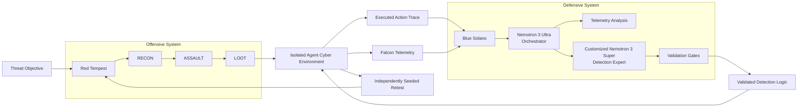
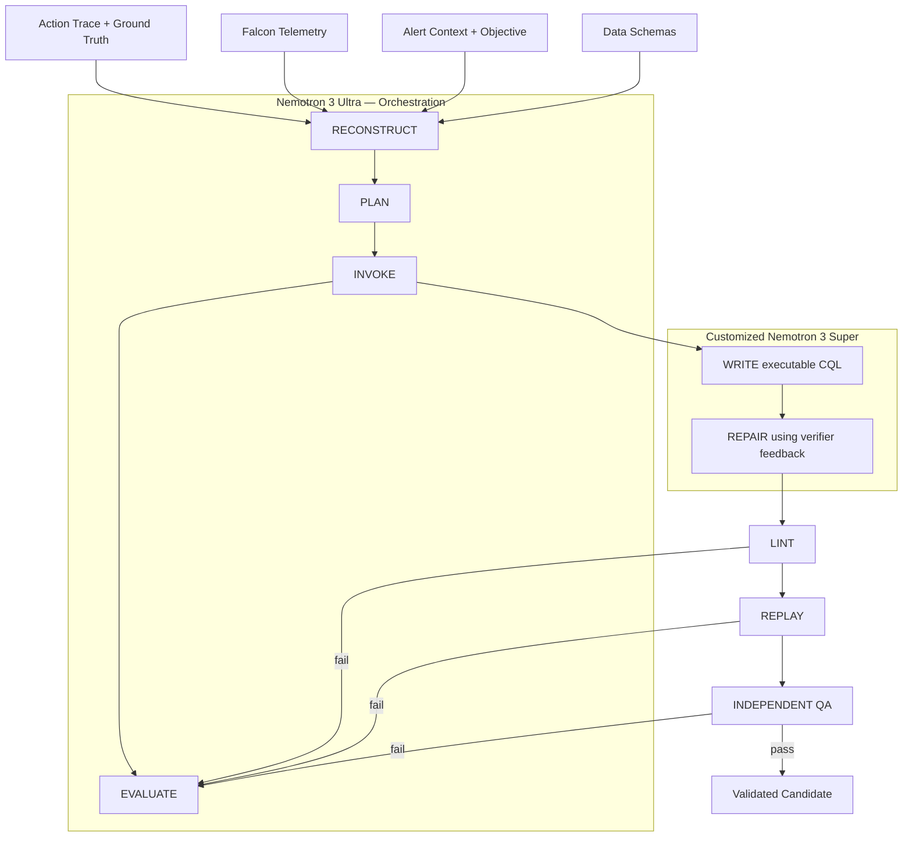
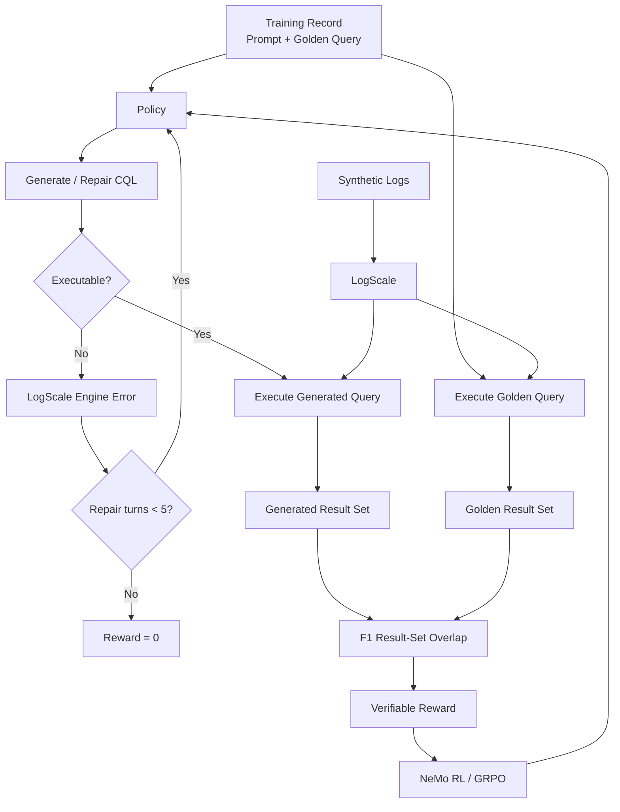

# Adaptive Agentic Cyber Defense with NVIDIA Nemotron

## A Source-Audited Reconstruction of the SafeMind Closed Loop, Specialized Detection Harness, and RLVR Training System

**Engineering Deep Dive**

The important result in NVIDIA and CrowdStrike's system is not simply that an open model generated cybersecurity detection rules. The engineering contribution is the construction of a **closed, executable offense–defense adaptation loop** in which model outputs are treated as untrusted intermediate artifacts until they survive deterministic syntax checks, telemetry replay, and an independent behavioral review.

This distinction is fundamental.

The system does not evaluate cybersecurity capability from natural-language explanations or agent self-reports. Attack execution produces observable traces and Falcon telemetry. Detection generation produces executable query artifacts. Reinforcement learning uses query execution against LogScale as part of the verifier. Live-fire evaluation redeploys generated detections against independently seeded attacks.

---

## 1. Evidence Contract

This reconstruction follows the Neural Atlas evidence discipline:

* **[R] Reported** — explicitly stated in NVIDIA's article, figures, model documentation, or directly linked artifacts.
* **[C] Code-verified** — observable in the public NeMo Gym or NeMo RL implementation/documentation.
* **[D] Derived** — follows mathematically or structurally from reported/code-verified facts; derivation is stated.
* **[U] Undisclosed** — the admissible source corpus does not expose the implementation detail required to establish the claim.

The distinction is consequential here because **the open training infrastructure is not equivalent to an open reproduction of the complete evaluated cybersecurity system**. NeMo Gym, NeMo RL, and Nemotron artifacts are exposed publicly, but the article does not publish a complete reproduction package containing the SafeMind implementation, Falcon telemetry schemas/data, attack traces, exact NL2LogScale training corpus, synthetic logs, golden queries, evaluator configuration, or complete training run configuration. Those components remain **[U]** under the available source boundary.

---

# 2. Objective

The engineering objective can be written as:

$$
\boxed{
\text{Attack execution}
\rightarrow
\text{observable telemetry}
\rightarrow
\text{detection synthesis}
\rightarrow
\text{executable validation}
\rightarrow
\text{deployment}
\rightarrow
\text{fresh attack}
}
$$

followed by another iteration whenever the offensive system discovers a viable path.

The target is therefore not static rule generation. It is an adaptive state transition:

$$
\mathcal S_t
=
\left(
\mathcal E_t,
\mathcal A_t,
\mathcal T_t,
\mathcal D_t,
\mathcal V_t
\right),
$$

where:

$$
\mathcal E_t = \text{isolated cyber environment},
$$

$$
\mathcal A_t = \text{executed attack trajectory},
$$

$$
\mathcal T_t = \text{Falcon telemetry and associated context},
$$

$$
\mathcal D_t = \text{candidate detection artifacts},
$$

$$
\mathcal V_t = \text{validation outcomes}.
$$

The closed-loop transition is conceptually:

$$
\mathcal S_{t+1}
=
F\left(
\mathcal S_t,
\pi_{\text{red}},
\pi_{\text{blue}},
\mathcal H,
\mathcal V
\right),
$$

with offensive policy \(\pi_{\text{red}}\), defensive policy \(\pi_{\text{blue}}\), specialized harness \(\mathcal H\), and executable verification stack \(\mathcal V\).

**[D]** This state representation is a formalization of the reported workflow, not an NVIDIA-published equation.

---

# 3. System Boundary

The reported system contains two interacting sides inside CrowdStrike SafeMind.

### Offensive side — Red Tempest

The architecture figure decomposes Red Tempest into:

$$
\text{RECON}
\rightarrow
\text{ASSAULT}
\rightarrow
\text{LOOT}
$$

operating through an isolated **Agent Cyber Environment**.

### Defensive side — Blue Solano

Blue Solano contains:

1. a **Nemotron 3 Ultra orchestrator**,
2. telemetry analysis,
3. a customized **Nemotron 3 Super detection-rule generation model**,
4. detection validation and remediation pathways.

The figure additionally shows data supplied from CrowdStrike platform/MDR data, threat intelligence, customer-supplied data, and open-source data.

A faithful architectural reconstruction is:



The meaningful boundary is that the connection between offense and defense is mediated by **executed system state**, not conversational agreement between two agents.

---

# 4. Closed-Loop Execution Semantics

NVIDIA describes four principal phases.

## 4.1 Execute and capture

The offensive agent executes an attack path in the instrumented environment.

The system records:

$$
\tau_{\text{attack}}
=
(a_1,a_2,\ldots,a_n)
$$

together with the corresponding telemetry:

$$
\mathcal T
=
\{e_1,e_2,\ldots,e_m\}.
$$

The critical point is that successful milestones are measured from **action traces and resulting telemetry**, rather than trusting a model-generated claim that exploitation succeeded.

This creates an observable causal substrate:

$$
a_t
\rightarrow
s_{t+1}
\rightarrow
e_{t+1}.
$$

The exact environment state representation and telemetry event-key semantics are **[U]**.

---

## 4.2 Reconstruct

Blue Solano receives:

* attack action trace,
* Falcon telemetry,
* broader context,
* schema/query-language knowledge,
* detection-engineering context.

The defensive system reconstructs the behavior that actually occurred.

This is materially different from:

$$
\text{attack description}
\rightarrow
\text{LLM}
\rightarrow
\text{rule}.
$$

The reported path is closer to:

$$
(\tau_{\text{attack}},\mathcal T,\mathcal K_{\text{schema}})
\rightarrow
\hat{\mathcal B}
\rightarrow
q,
$$

where:

* \(\hat{\mathcal B}\) = reconstructed attack behavior,
* \(q\) = candidate executable detection query.

---

## 4.3 Generate and validate

Candidate rules are not immediately accepted.

They pass through:

$$
q
\rightarrow
V_{\text{lint}}
\rightarrow
V_{\text{replay}}
\rightarrow
V_{\text{QA}}.
$$

Only a candidate satisfying all required gates becomes a validated artifact.

A useful state machine is therefore:

$$
q_0
\xrightarrow{\text{lint}}
q_1
\xrightarrow{\text{replay}}
q_2
\xrightarrow{\text{behavioral QA}}
q_{\text{validated}}.
$$

For any failed verifier:

$$
V_i(q)=0
\Rightarrow
q \rightarrow \text{structured feedback} \rightarrow \text{repair}.
$$

This repair edge is a central property of the architecture. Validation does not merely produce a score after generation; it participates directly in subsequent generation.

---

## 4.4 Independently seeded retest

Validated detections are deployed and a fresh offensive execution is generated.

The system then asks whether the defensive artifact generalizes from the recorded attack trajectory to a new realization from the same scenario family.

Formally:

$$
\tau^{(0)} \rightarrow q
$$

during detection construction, followed by evaluation on:

$$
\tau^{(1)} \neq \tau^{(0)}.
$$

The source does **not** establish generalization across unrelated threat families. NVIDIA explicitly limits the reported study to one scenario family.

---

# 5. Why the Agent Harness Is the Principal Systems Component

The strongest engineering signal in the source is the gap between a **basic agent harness** and the specialized defensive harness.

The optimized system adds six mechanisms around the underlying model.

## 5.1 Schema knowledge

The harness exposes a knowledge base describing:

* Falcon schemas,
* fields,
* query syntax.

The purpose is to constrain query generation against the actual execution substrate.

Without this boundary:

$$
q_{\theta}
\in
\mathcal Q_{\text{linguistically plausible}}
$$

does not imply:

$$
q_{\theta}
\in
\mathcal Q_{\text{executable}}.
$$

The schema layer reduces the reachable generation space toward:

$$
\mathcal Q_{\text{valid-schema}}
\subset
\mathcal Q_{\text{all generated}}.
$$

NVIDIA's figure explicitly characterizes this mechanism as preventing invented fields.

---

## 5.2 Telemetry grounding

The agent operates against:

$$
G=
\{
\tau_{\text{red}},
\mathcal T_{\text{Falcon}},
C_{\text{objective}},
C_{\text{environment}}
\}.
$$

Its function is not generic retrieval augmentation. It binds the generated rule to evidence emitted by the executed attack.

The figure characterizes this layer as preventing false links between the proposed rule and the behavior actually observed.

---

## 5.3 Bounded specialist model

Nemotron 3 Super is used as a specialized detection author/repair model rather than assigning the entire workflow to the orchestrator.

The topology is:

$$
\pi_{\text{Ultra}}
:
\text{reconstruct}
\rightarrow
\text{plan}
\rightarrow
\text{invoke}
\rightarrow
\text{evaluate},
$$

while:

$$
\pi_{\text{Super}}
:
(\text{write},\text{repair})
\rightarrow
q.
$$

This is a model-role separation rather than homogeneous multi-agent duplication.

---

## 5.4 Linting

The lint layer checks candidate artifacts for properties including:

* syntax errors,
* unsupported fields,
* environment-specific pins,
* brittle strings,
* IP/host/user/subnet-specific logic,
* portability problems.

Conceptually:

$$
V_{\text{lint}}(q)
=
V_{\text{syntax}}
\land
V_{\text{schema}}
\land
V_{\text{portability}}.
$$

A failure is converted into repair feedback rather than silently accepting the artifact.

---

## 5.5 Replay

Replay executes the candidate rule against telemetry captured from the known attack.

Let:

$$
E(q;\mathcal T)
$$

denote events returned by query \(q\) over telemetry \(\mathcal T\).

A candidate for which:

$$
E(q;\mathcal T_{\text{attack}})=\varnothing
$$

cannot demonstrate detection of the attack recorded during construction and is rejected.

This converts rule evaluation from semantic plausibility into executable evidence.

---

## 5.6 Independent QA

A fresh-context judge independently reviews the candidate for:

* behavioral alignment,
* robustness,
* multi-signal construction.

This gate addresses a different failure domain from syntax and replay.

A rule can be:

$$
V_{\text{syntax}}=1
$$

and:

$$
V_{\text{replay}}=1
$$

while still encoding brittle or semantically inappropriate behavior.

Therefore:

$$
V_{\text{accepted}}
=
V_{\text{lint}}
\land
V_{\text{replay}}
\land
V_{\text{behavior}}.
$$

The identity of the judging model, full rubric, calibration procedure, judge reliability, and exact acceptance threshold are **[U]** in the source.

---

# 6. Orchestrator–Expert Separation

Figure 3 exposes the internal role decomposition particularly clearly.

The Ultra orchestrator performs:

$$
\boxed{
\text{RECONSTRUCT}
\rightarrow
\text{PLAN}
\rightarrow
\text{INVOKE}
\rightarrow
\text{EVALUATE}
}
$$

while the customized Super model performs:

$$
\boxed{
\text{WRITE}
\leftrightarrow
\text{REPAIR}
}
$$

The surrounding system owns:

* context,
* memory,
* tools,
* skills,
* security,
* governance,
* validation gates.

A faithful execution graph is:



Architecturally, this establishes a clean ownership boundary:

$$
\text{workflow state}
\not\equiv
\text{artifact-generation state}.
$$

Ultra owns workflow control; Super owns the bounded artifact-generation operation; external verifiers own executable truth conditions.

That separation is more important than describing the system merely as "multi-agent."

---

# 7. Post-Training the Detection Expert

The customized Nemotron 3 Super model is produced through:

$$
\boxed{
\text{CPT}
\rightarrow
\text{SFT}
\rightarrow
\text{RLVR}
}
$$

starting from a Nemotron 3 Super-based NL2LogScale model.

---

# 8. Continual Pretraining

The source reports additional cybersecurity knowledge bases during continual pretraining.

However:

* corpus size — **[U]**
* token count — **[U]**
* source mixture — **[U]**
* optimizer — **[U]**
* learning-rate schedule — **[U]**
* number of optimization steps — **[U]**
* exact checkpoint — **[U]**
* training cadence — **[U]**

Consequently, no defensible reconstruction of the CPT objective beyond the general reported stage can be made from the released material.

Writing a specific CPT recipe here would therefore be fabrication.

---

# 9. Supervised Fine-Tuning Corpus

The SFT stage is substantially better specified.

Total examples:

$$
N_{\text{SFT}}=9,349.
$$

Split:

$$
N_{\text{write}}=4,559
$$

and:

$$
N_{\text{repair}}=4,790.
$$

Therefore:

$$
\frac{4559}{9349}\approx48.8\%
$$

and:

$$
\frac{4790}{9349}\approx51.2\%.
$$

These percentages are shown directly in NVIDIA's training figure.

### WRITE construction

The figure reports:

$$
1,520\ \text{source rules}
$$

expanded into three request styles through Super-generated rephrasings.

The source therefore uses model-assisted variation generation but retains an underlying rule-derived supervision target.

### REPAIR construction

Repair data contains:

$$
59
$$

programmatic error types.

Corrupted examples are executed against LogScale so that actual engine errors can become part of the repair supervision.

This is important because the repair task is trained around:

$$
(q_{\text{invalid}},
e_{\text{engine}})
\rightarrow
q_{\text{repaired}},
$$

rather than:

$$
q_{\text{invalid}}
\rightarrow
\text{generic textual critique}.
$$

### Reasoning traces

The article also reports quality-reviewed Ultra reasoning traces as a data source.

The training figure distinguishes the synthetic-data producers:

* Super → request rephrasing,
* programmatic corruption + LogScale → repair examples,
* Ultra → reasoning traces subject to QA/judge filtering.

The exact SFT loss, masking policy, packing configuration, sequence-length distribution, optimizer configuration, and per-source mixture weights are **[U]**.

---

# 10. RLVR: Executable Queries as Verifiable Outcomes

The RL stage is the technically strongest part of the training design.

The verifier is not a learned reward model evaluating the linguistic quality of a detection rule.

Instead:

1. generate CQL,
2. execute it in LogScale,
3. repair execution failures,
4. run valid generated and reference queries,
5. compare their returned event sets,
6. compute an F1-based reward,
7. update the policy through GRPO.

The training record contains:

$$
(x,q^\star),
$$

where:

* \(x\) = prompt,
* \(q^\star\) = golden query.

Synthetic logs are loaded into LogScale before the run.

The policy generates:

$$
q_\theta \sim \pi_\theta(\cdot|x).
$$

---

## 10.1 Execution gate

The first verifier asks:

$$
\operatorname{Valid}(q_\theta)?
$$

If invalid, LogScale returns an engine error:

$$
e_k
=
\operatorname{EngineError}(q_{\theta,k}).
$$

The error is fed back to the policy:

$$
q_{\theta,k+1}
\sim
\pi_\theta(
\cdot
\mid
x,q_{\theta,k},e_k
).
$$

The source permits at most five repair turns.

Therefore:

$$
k_{\max}=5.
$$

If the query remains unresolved:

$$
\boxed{r=0}.
$$

---

## 10.2 Validity is not the reward

This detail is explicitly emphasized in NVIDIA's figure.

Passing syntax/execution validation does **not** itself produce the final reward.

Formally:

$$
\operatorname{Valid}(q)=1
\not\Rightarrow
r(q)=1.
$$

Validity is only a gate enabling semantic execution comparison.

For a valid query:

$$
E_\theta
=
E(q_\theta;\mathcal L)
$$

and:

$$
E^\star
=
E(q^\star;\mathcal L),
$$

where \(\mathcal L\) denotes the synthetic log environment.

The reported reward is:

$$
\boxed{
r(q_\theta)
=
F_1(E_\theta,E^\star)
}
$$

for successfully executable queries.

A conventional event-set interpretation would be:

$$
P
=
\frac{|E_\theta\cap E^\star|}
{|E_\theta|},
$$

$$
R
=
\frac{|E_\theta\cap E^\star|}
{|E^\star|},
$$

$$
F_1
=
\frac{2PR}{P+R}.
$$

**[D]** The equations above provide the standard mathematical interpretation of F1 over two result sets. The source states that F1 overlap of returned events is used, but does not expose the exact event identity, deduplication, temporal-window, empty-set, or matching implementation. Those semantics remain **[U]**.

---

# 11. Why This Reward Is Structurally Different from Textual Reward Modeling

The verifier establishes an execution-grounded reward channel:

$$
q_\theta
\rightarrow
\text{LogScale}
\rightarrow
E_\theta
\rightarrow
r.
$$

Thus the reward depends on an external executable system.

The policy cannot obtain reward merely by producing a syntactically convincing explanation of what the query should detect.

The desired invariant is:

$$
\boxed{
\text{reward}
\leftarrow
\text{observable program behavior}
}
$$

rather than:

$$
\text{reward}
\leftarrow
\text{linguistic plausibility}.
$$

This is the critical RLVR property exposed by the source.

---

# 12. NeMo Gym as the Environment Boundary

The public NeMo Gym repository defines an environment around four principal pieces:

$$
\boxed{
\text{Environment}
=
\text{Dataset}
+
\text{Agent Harness}
+
\text{Verifier}
+
\text{State}
}
$$

and is intended for stateful model/agent evaluation and improvement against executable environments. The repository explicitly targets reproducible evaluation, tool/sandbox interaction, scaled repeated execution, and transition between evaluation and training workflows.

For the cyber RLVR case, the mapping can be reconstructed as:

| NeMo Gym concept    | Cybersecurity realization                         |
| ------------------- | ------------------------------------------------- |
| Dataset             | prompt + golden query records                     |
| Harness             | generation/repair interaction loop                |
| State               | loaded synthetic logs + current interaction state |
| Tool/environment    | Falcon LogScale                                   |
| Verifier            | query validity + returned-event comparison        |
| Observable feedback | engine error or result set                        |
| Reward              | F1 overlap                                        |
| Termination         | valid comparison or exhausted repair budget       |

Only the mapping directly supported by NVIDIA's RLVR figure should be treated as reported. Internal cyber-environment adapters and exact Gym implementation are not published in the article.

---

# 13. RLVR State Transition

The complete reported interaction can be represented as:



This diagram preserves an important ordering:

$$
\boxed{
\text{Generate}
\rightarrow
\text{Validate}
\rightarrow
\text{Repair if required}
\rightarrow
\text{Execute}
\rightarrow
\text{Compare}
\rightarrow
\text{Reward}
}
$$

—not:

$$
\text{Generate}
\rightarrow
\text{LLM judge}
\rightarrow
\text{reward}.
$$

---

# 14. GRPO: What the Public NeMo RL Stack Actually Exposes

NVIDIA reports that NeMo RL uses **Group Relative Policy Optimization — GRPO** to update the customized Super policy.

The public NeMo RL GRPO documentation expresses the clipped policy objective as:

$$
\mathcal L(\theta)
=
\mathbb E_{x\sim \pi_{\text{old}}}
\left[
\min
\left(
\rho_t(\theta)A_t,\,
\operatorname{clip}
(
\rho_t(\theta),
1-\epsilon,
1+\epsilon
)
A_t
\right)
\right]
-
\beta
D_{\mathrm{KL}}
(
\pi_\theta\Vert\pi_{\text{ref}}
),
$$

where:

$$
\rho_t(\theta)
=
\frac{
\pi_\theta(a_t|s_t)
}{
\pi_{\text{old}}(a_t|s_t)
}.
$$

The policy roles are distinct:

$$
\pi_\theta
=
\text{currently optimized policy},
$$

$$
\pi_{\text{old}}
=
\text{behavior policy used to generate optimization samples},
$$

$$
\pi_{\text{ref}}
=
\text{reference policy used for KL regularization}.
$$

This distinction should not be collapsed into a single "base model."

---

# 15. Group-Relative Advantage

The current public NeMo RL implementation contains a GRPO advantage estimator that forms a per-prompt group reward baseline and optionally normalizes group-relative rewards. It also exposes a leave-one-out baseline implementation.

For a prompt \(x_i\) with group:

$$
G_i=
\{r_{i,1},\ldots,r_{i,K}\},
$$

the group-relative structure is:

$$
A_{i,j}
=
r_{i,j}
-
b_{i,j}.
$$

Under a leave-one-out baseline:

$$
b_{i,j}
=
\frac{1}{K-1}
\sum_{\ell\neq j}
r_{i,\ell}.
$$

With normalization:

$$
\hat A_{i,j}
=
\frac{A_{i,j}}
{\sigma_{i,j}+\varepsilon}.
$$

The implementation uses an epsilon safeguard and broadcasts the sequence-level relative advantage over the valid token mask.

However, this distinction is essential:

> **[C]** These mechanisms are present in the current public NeMo RL implementation.

> **[U]** NVIDIA does not expose sufficient run metadata to prove that every current framework default—including reward normalization, leave-one-out configuration, clipping coefficients, KL coefficient, optimizer, learning rate, group size, batch size, or exact repository commit—was used unchanged in the cybersecurity training job.

Framework capability is not evidence of run-time configuration.

---

# 16. End-to-End RLVR Pseudo-Algorithm

```text
Algorithm: Executable Detection-Query RLVR

Input:
    D = {(x_i, q_i*)}        training prompts and golden queries
    L_i                     synthetic logs for record i
    πθ                      Nemotron detection policy
    Krepair = 5             maximum reported repair turns

For each training record (x_i, q_i*):

    Load L_i into LogScale

    Initialize interaction context c0 ← x_i

    For k = 1 ... Krepair:

        q_i,k ~ πθ(. | c_k)

        status, feedback ← LogScale.validate(q_i,k)

        If status == invalid:

            If k == Krepair:
                r_i ← 0
                terminate sample

            c_k+1 ← c_k ∪ {q_i,k, feedback}
            continue

        E_i ← LogScale.execute(q_i,k)
        E_i* ← LogScale.execute(q_i*)

        r_i ← F1(E_i, E_i*)
        terminate sample

Group samples by prompt

Estimate group-relative advantages A

Optimize πθ with NeMo RL GRPO
```

**[R]** Generation, LogScale validation, engine-error repair, maximum five repair turns, zero reward after unresolved failure, generated/reference execution, F1 reward, and GRPO are source-reported.

**[C]** Detailed GRPO loss and advantage-estimation mechanics are available from the public NeMo RL implementation.

**[U]** Exact cyber-training batching, rollout group size, token budget, decoding parameters, optimizer configuration, KL settings, distributed topology, checkpoint schedule, and convergence criteria are not exposed.

---

# 17. Detection-Time Artifact Pipeline

Training alone is not the system.

At inference/runtime, the defensive artifact follows a second verification pipeline:

$$
(\tau,\mathcal T)
\rightarrow
\pi_{\text{Ultra}}
\rightarrow
\pi_{\text{Super}}
\rightarrow
q
\rightarrow
\text{lint}
\rightarrow
\text{replay}
\rightarrow
\text{independent QA}
\rightarrow
q_{\text{deployable}}.
$$

Therefore, model post-training and runtime validation solve different failure domains.

### Post-training

Reduces the probability of generating structurally or behaviorally inappropriate queries:

$$
P(q_{\text{bad}}|x).
$$

### Runtime verification

Rejects residual invalid artifacts before deployment:

$$
P(
q_{\text{bad accepted}}
)
=
P(q_{\text{bad}})
P(
V(q_{\text{bad}})=1
\mid
q_{\text{bad}}
).
$$

**[D]** The equation is a reliability decomposition, not a reported NVIDIA metric.

The architecture therefore does not assume post-training eliminates hallucination or execution errors.

It places external controls downstream of the model.

---

# 18. Backtest Evaluation

NVIDIA first compares two complete configurations.

### Baseline

$$
\text{Nemotron 3 Ultra}
+
\text{basic harness}
$$

across eight independently seeded authoring sessions.

Reported mean:

$$
\boxed{16.5\%}
$$

of generated rules detected the recorded attack.

### Optimized open pipeline

$$
\text{Ultra}
+
\text{tuned harness}
+
\text{customized Super}
+
\text{domain context/tools/validation}
$$

across six sessions.

Reported mean:

$$
\boxed{41.9\%}.
$$

Thus:

$$
\frac{41.9}{16.5}
\approx
2.54.
$$

NVIDIA reports this as approximately a **2.5×** improvement.

But the correct causal interpretation is narrower than:

> customized Super improves detection by 2.5×.

The optimized condition simultaneously modifies:

* harness,
* model topology,
* specialized Super checkpoint,
* domain context,
* tools,
* validation.

Therefore:

$$
\Delta_{\text{observed}}
=
\Delta_{\text{system configuration}},
$$

not:

$$
\Delta_{\text{observed}}
=
\Delta_{\text{model alone}}.
$$

NVIDIA explicitly states that this is **not an isolated model ablation**.

A second observation follows directly from the absolute values:

$$
1-0.419=0.581.
$$

**[D]** Even the optimized configuration's mean backtest pass rate implies approximately **58.1% of generated rules did not detect the recorded attack under this reported metric**.

The relative improvement is substantial.

The absolute success rate remains below 50%.

Both facts must be retained.

---

# 19. Live-Fire Generalization

The second evaluation is stronger than replay because detections are deployed **verbatim** against eight new attacks from the same scenario family.

Reported deployment counts:

$$
N_{\text{open}}=11,
$$

$$
N_{\text{frontier}}=35.
$$

Rules detecting at least one fresh attack:

$$
5/11
\approx45\%
$$

for the optimized open pipeline,

versus:

$$
10/35
\approx29\%
$$

for the frontier system.

The exact unrounded ratios are:

$$
\frac{5}{11}=45.45\%
$$

and:

$$
\frac{10}{35}=28.57\%.
$$

**[D]**

---

# 20. Detection Quality Funnel

Figure 7 is especially useful because it prevents collapsing all firing rules into high-quality detections.

The reported funnel is:

| Stage                                       | Optimized open pipeline | Frontier system |
| ------------------------------------------- | ----------------------: | --------------: |
| Deployed after backtest hit                 |                      11 |              35 |
| Detected ≥1 fresh attack                    |                       5 |              10 |
| Stayed quiet                                |                       4 |               9 |
| Passed independent behavioral review / Gold |                       3 |               0 |

This can be represented as:

```text
OPEN PIPELINE

11 deployed
    │
    ├── 5 fired on ≥1 fresh attack
    │       │
    │       ├── 4 stayed quiet
    │       │       │
    │       │       └── 3 passed behavioral review → GOLD
    │       │
    │       └── 1 did not stay quiet
    │
    └── 6 did not fire


FRONTIER SYSTEM

35 deployed
    │
    ├── 10 fired on ≥1 fresh attack
    │        │
    │        ├── 9 stayed quiet
    │        │       │
    │        │       └── 0 passed behavioral review → GOLD
    │        │
    │        └── 1 did not stay quiet
    │
    └── 25 did not fire
```

The source defines a **gold** detection through three conditions:

1. detects a fresh attack,
2. remains quiet,
3. passes independent behavioral review for behavior-anchored, multi-signal detection without environment-specific strings.

---

# 21. Coverage

The figure reports:

$$
2.6
$$

fresh attacks detected per deployed open-pipeline rule versus:

$$
1.1
$$

for the frontier configuration.

This wording matters.

The prose surrounding the figure contains an awkward phrase equivalent to "detections per detection," but Figure 7 specifies the metric as:

$$
\boxed{
\text{fresh attacks detected per deployed rule}
}
$$

and should therefore be treated as the authoritative interpretation.

For quiet firing rules:

$$
\text{open coverage}=8/8,
$$

$$
\text{frontier coverage}=7/8.
$$

For gold rules:

$$
\text{open coverage}=8/8,
$$

$$
\text{frontier coverage}=0/8.
$$

The notable result is that three open-system gold rules collectively cover all eight fresh attacks in this scenario-family evaluation.

---

# 22. What the Results Establish

The evidence supports the following narrower conclusion:

$$
\boxed{
\text{specialized harness}
+
\text{bounded expert}
+
\text{executable verification}
+
\text{replay}
+
\text{behavioral QA}
}
$$

produced a materially stronger system-level result than the reported basic Ultra harness and produced stronger gold-rule outcomes than the tested frontier configuration **within the reported environment and scenario family**.

The source does **not** establish:

$$
\text{open models}
>
\text{frontier models}
$$

as a general relation.

It establishes:

$$
S_{\text{open,opt}}
>
S_{\text{tested comparator}}
$$

for a particular system configuration, environment, evaluation protocol, and threat-family scope.

That distinction is mandatory.

---

# 23. What the Results Do Not Establish

NVIDIA explicitly identifies several limitations.

### 23.1 Single scenario family

Cross-scenario generalization is not evaluated.

Therefore:

$$
P(
\text{success}
\mid
\text{new threat family}
)
$$

is unknown.

---

### 23.2 Small detection sets

The live-fire comparison contains 11 open-system detections and 35 frontier detections.

The source does not report statistical confidence intervals or an inferential significance analysis.

Consequently, the observed proportions should be treated as empirical case-study measurements, not population-level estimates.

---

### 23.3 Limited benign traffic

The environment does not contain enough benign traffic to support production false-positive claims.

Therefore:

$$
\text{stayed quiet in experiment}
\neq
\text{production-grade FPR}.
$$

A production false-positive rate would require an exposure denominator:

$$
\operatorname{FPR}
=
\frac{FP}{FP+TN},
$$

under realistic benign workload distributions.

Those measurements are not provided.

---

### 23.4 Harness failures

Three of eight live-fire runs experienced harness failures.

NVIDIA retained them because complete telemetry existed.

This is scientifically reasonable for preserving observed attack evidence, but it also means the experiment does **not** demonstrate that the orchestration/harness layer operates failure-free under repeated execution.

The failure taxonomy, root causes, retry behavior, and SLO implications are **[U]**.

---

### 23.5 Comparator opacity

The article describes a frontier model/system comparison, but the admissible source does not expose enough information to reconstruct:

* exact comparator model identity,
* model version,
* system prompt,
* tool harness,
* inference configuration,
* reasoning budget,
* token budget,
* retry policy,
* temperature,
* evaluator interactions,
* complete cost accounting.

Those variables matter materially in an agentic system comparison.

Therefore the frontier result is **reported experimental evidence**, not a reproducible independent benchmark from the currently released package.

---

# 24. Open Source Boundary

A precise open-source statement is necessary.

## Publicly exposed

The source ecosystem exposes major infrastructure components including:

* Nemotron model artifacts,
* NeMo Gym,
* NeMo RL,
* GRPO implementation/documentation,
* environment abstractions,
* agent-training infrastructure.

NeMo Gym describes itself as infrastructure for evaluating and improving models and agents using environments and exposes the dataset/harness/verifier/state abstraction. NeMo RL exposes the policy-optimization machinery used for GRPO-style training.

## Not sufficient for full reproduction

The available source corpus does not publish a single package from which an independent researcher can reconstruct the evaluated experiment end-to-end.

The following remain wholly or partially **[U]**:

$$
\begin{aligned}
&\text{SafeMind implementation},\\
&\text{Red Tempest implementation},\\
&\text{Blue Solano complete harness},\\
&\text{Falcon schemas and telemetry corpus},\\
&\text{attack-path dataset},\\
&\text{synthetic RLVR logs},\\
&\text{golden query corpus},\\
&\text{exact CPT corpus},\\
&\text{exact SFT records},\\
&\text{full RL training configuration},\\
&\text{model checkpoint hashes},\\
&\text{evaluation judge configuration},\\
&\text{frontier comparator configuration}.
\end{aligned}
$$

Thus:

$$
\boxed{
\text{open training/runtime components}
\neq
\text{fully open experiment reproduction}
}
$$

That is the defensible source-grounded characterization.

---

# 25. Systems Interpretation

The architecture implements three different correctness layers.

## Layer A — model correctness

Can the specialized model construct or repair the requested detection artifact?

$$
x \rightarrow q_\theta
$$

Post-training primarily attacks this layer.

---

## Layer B — executable correctness

Can the artifact execute under the real query engine and match intended telemetry?

$$
q_\theta
\xrightarrow{\text{engine}}
E(q_\theta)
$$

Linting, LogScale validation, replay, and RLVR operate here.

---

## Layer C — operational correctness

Does the rule detect independently generated attack behavior without becoming brittle or noisy?

$$
q
\xrightarrow{\text{fresh attack}}
\{
\text{coverage},
\text{quietness},
\text{behavioral quality}
\}.
$$

Live-fire evaluation and independent QA address this layer.

A model-only benchmark evaluates principally Layer A.

The reported system is explicitly constructed to require evidence from all three.

---

# 26. Principal Failure Domains

A useful source-grounded failure decomposition is:

$$
\mathcal F
=
\{
F_{\text{schema}},
F_{\text{syntax}},
F_{\text{grounding}},
F_{\text{execution}},
F_{\text{semantic}},
F_{\text{portability}},
F_{\text{generalization}},
F_{\text{orchestration}}
\}.
$$

The harness maps approximately as:

| Failure domain                         | Control                                            |
| -------------------------------------- | -------------------------------------------------- |
| invented schema/field                  | schema knowledge                                   |
| invalid query                          | lint + engine execution                            |
| false telemetry linkage                | grounding                                          |
| non-firing rule                        | replay                                             |
| brittle environment-specific detection | lint + behavioral QA                               |
| inadequate semantic coverage           | independent QA                                     |
| failed query repair                    | Super repair loop                                  |
| unseen execution behavior              | fresh live-fire retest                             |
| workflow failure                       | orchestrator/harness; exact recovery mechanism [U] |

This mapping explains why increasing model scale alone would not remove the full system error surface.

---

# 27. The Deeper Engineering Pattern

The system can be reduced to one general invariant:

$$
\boxed{
\text{Do not ask the model to certify its own artifact.}
}
$$

Instead:

$$
\text{model output}
\rightarrow
\text{external executable system}
\rightarrow
\text{observable state}
\rightarrow
\text{verifier}
\rightarrow
\text{feedback/update}.
$$

During training:

$$
q_\theta
\rightarrow
\text{LogScale}
\rightarrow
F_1
\rightarrow
\text{GRPO}.
$$

During defensive inference:

$$
q_\theta
\rightarrow
\text{lint}
\rightarrow
\text{replay}
\rightarrow
\text{independent QA}.
$$

During system evaluation:

$$
q_{\text{validated}}
\rightarrow
\text{fresh attack execution}
\rightarrow
\text{observed detection outcome}.
$$

The same principle therefore appears at three timescales:

$$
\boxed{
\text{training verification}
\rightarrow
\text{runtime verification}
\rightarrow
\text{evaluation verification}.
}
$$

That is the architectural center of the NVIDIA/CrowdStrike design.

---

# 28. End-to-End Reconstruction

```text
THREAT OBJECTIVE
      │
      ▼
RED TEMPEST
RECON → ASSAULT → LOOT
      │
      ▼
ISOLATED AGENT CYBER ENVIRONMENT
      │
      ├───────────────┐
      ▼               ▼
ACTION TRACE      FALCON TELEMETRY
      │               │
      └───────┬───────┘
              ▼
     NEMOTRON 3 ULTRA
        ORCHESTRATOR
              │
      RECONSTRUCT
              │
            PLAN
              │
           INVOKE
              │
              ▼
  CUSTOMIZED NEMOTRON 3 SUPER
              │
         WRITE / REPAIR
              │
              ▼
        CANDIDATE CQL
              │
              ▼
             LINT
              │
              ▼
            REPLAY
              │
              ▼
       INDEPENDENT QA
              │
        ┌─────┴─────┐
      FAIL          PASS
        │             │
        │             ▼
        │       VALIDATED RULE
        │             │
        └──feedback───┤
                      ▼
               DETECTION ENGINE
                      │
                      ▼
          INDEPENDENTLY SEEDED
              FRESH ATTACK
                      │
        ┌─────────────┴────────────┐
        ▼                          ▼
  DEFENSIVE RESULT          OFFENSIVE FEEDBACK
                                   │
                                   ▼
                              RED ADAPTS
                                   │
                                   └──→ LOOP
```

Every significant transition above corresponds to a source-reported architectural element.

---

# 29. Evidence Matrix

| Claim                                                                            | Status              |
| -------------------------------------------------------------------------------- | ------------------- |
| Offensive/defensive agents operate in a closed isolated loop                     | **[R]**             |
| Falcon telemetry and action traces ground defensive reconstruction               | **[R]**             |
| Ultra performs orchestration while customized Super writes/repairs detections    | **[R]**             |
| Defensive harness contains six specialization mechanisms                         | **[R]**             |
| Customized Super uses CPT → SFT → RLVR                                           | **[R]**             |
| SFT contains 9,349 examples                                                      | **[R]**             |
| Repair supervision covers 59 programmatic error types                            | **[R]**             |
| RLVR executes CQL against LogScale                                               | **[R]**             |
| Invalid queries receive engine feedback and up to five repair attempts           | **[R]**             |
| Unresolved queries receive zero reward                                           | **[R]**             |
| Valid generated/reference queries are compared through returned-event F1         | **[R]**             |
| GRPO performs the policy update                                                  | **[R]**             |
| NeMo RL publicly implements clipped GRPO and group-relative advantage estimation | **[C]**             |
| Exact cyber GRPO hyperparameters equal current NeMo RL defaults                  | **[U]**             |
| Optimized pipeline backtest mean = 41.9%; basic harness = 16.5%                  | **[R]**             |
| Relative improvement ≈2.54×                                                      | **[D]**             |
| Optimized mean backtest failure share ≈58.1%                                     | **[D]**             |
| Open live-fire firing rate = 5/11 ≈45%; frontier = 10/35 ≈29%                    | **[R]/[D]**         |
| Three open gold rules covered all eight fresh attacks                            | **[R]**             |
| The open system generally outperforms frontier models                            | **Not established** |
| Production false-positive rate is demonstrated                                   | **Not established** |
| Cross-threat-family generalization is demonstrated                               | **Not established** |
| Complete SafeMind experiment is publicly reproducible                            | **Not established** |

---

# 30. Technical Verdict

The principal contribution of the reported system is not an autonomous cybersecurity chatbot and not a standalone Nemotron benchmark.

It is an **execution-grounded agentic control system** that moves correctness outside the generative model.

Its core path is:

$$
\boxed{
\text{observe}
\rightarrow
\text{reconstruct}
\rightarrow
\text{generate}
\rightarrow
\text{execute}
\rightarrow
\text{verify}
\rightarrow
\text{repair}
\rightarrow
\text{deploy}
\rightarrow
\text{retest}
}
$$

The customized Nemotron 3 Super model is trained under the same philosophy. Generated detection programs are submitted to an actual query engine; execution failures become repair feedback; valid generated and golden queries are executed over the same synthetic logs; returned events determine an F1 reward; GRPO updates the policy.

At runtime, the same principle continues through schema grounding, linting, telemetry replay, and independent behavioral QA.

At evaluation time, the same principle is applied again through independently seeded live attacks.

The strongest source-supported conclusion is therefore:

$$
\boxed{
\text{Agent reliability emerged from}
\;
\text{model specialization}
+
\text{harness specialization}
+
\text{external verification}
+
\text{closed-loop execution}.
}
$$

The experiment provides evidence that this optimized open-model pipeline produced stronger results than both the basic Nemotron harness and the tested frontier configuration within the reported scenario family. It does **not** establish general open-versus-frontier model superiority, cross-domain cybersecurity generalization, production false-positive characteristics, or statistical universality.

The engineering lesson is more precise:

$$
\boxed{
\text{For executable domains, generated reasoning is not the final evidence. Execution is.}
}
$$

And for agentic systems:

$$
\boxed{
\text{model capability}
\neq
\text{system reliability}.
}
$$

Reliability is determined by the complete transition:

$$
\text{model}
+
\text{context}
+
\text{tools}
+
\text{environment}
+
\text{verification}
+
\text{feedback}
+
\text{evaluation}.
$$

That is the defensible technical interpretation of the NVIDIA Nemotron adaptive cybersecurity system from the currently released evidence.
