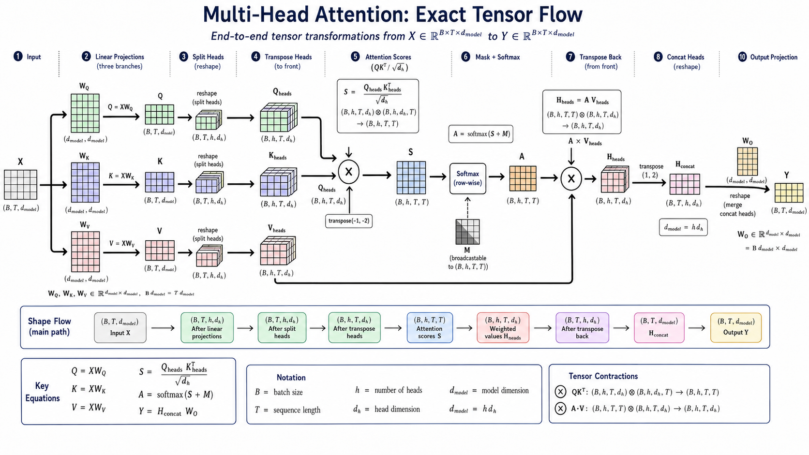
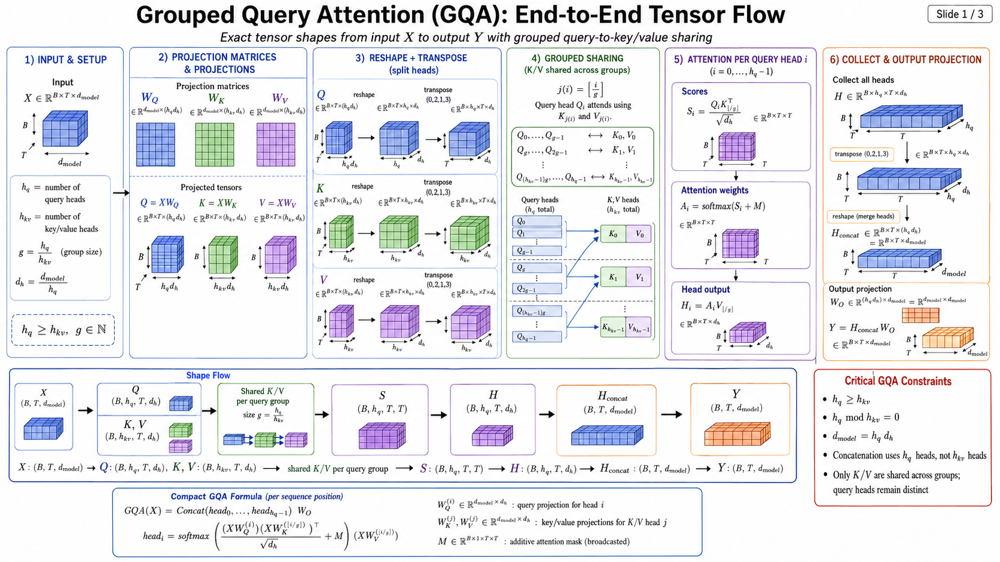
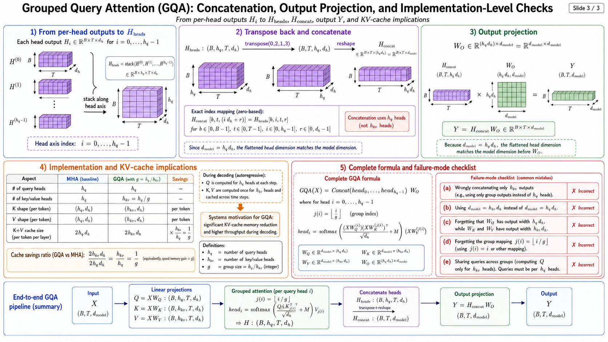
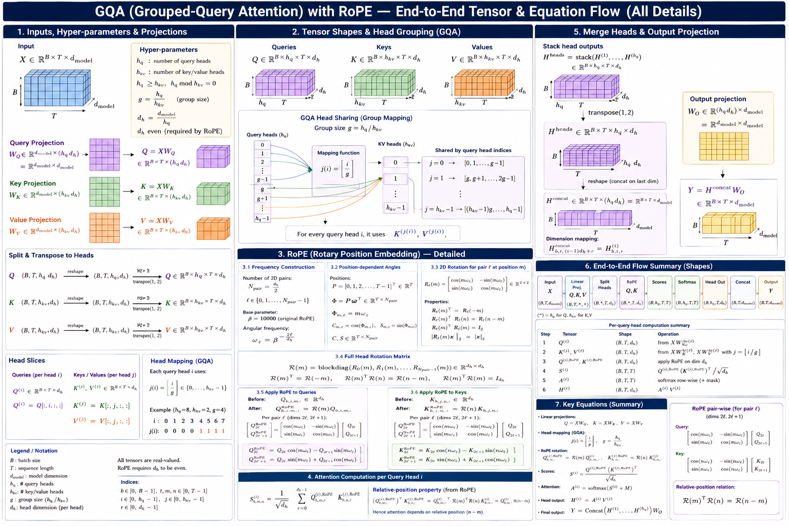
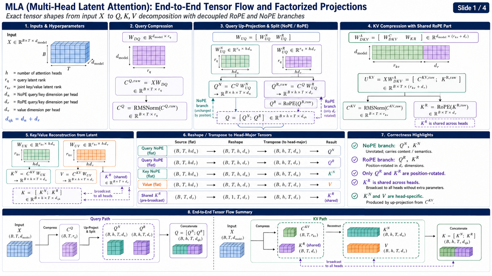
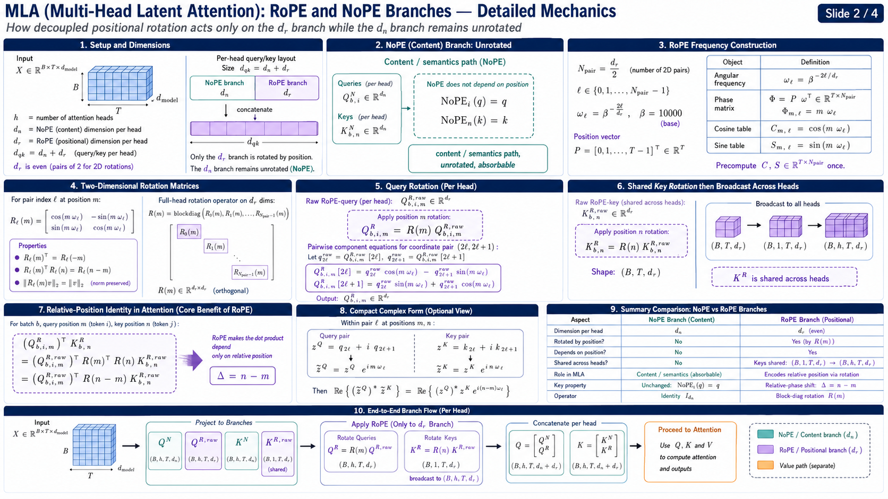
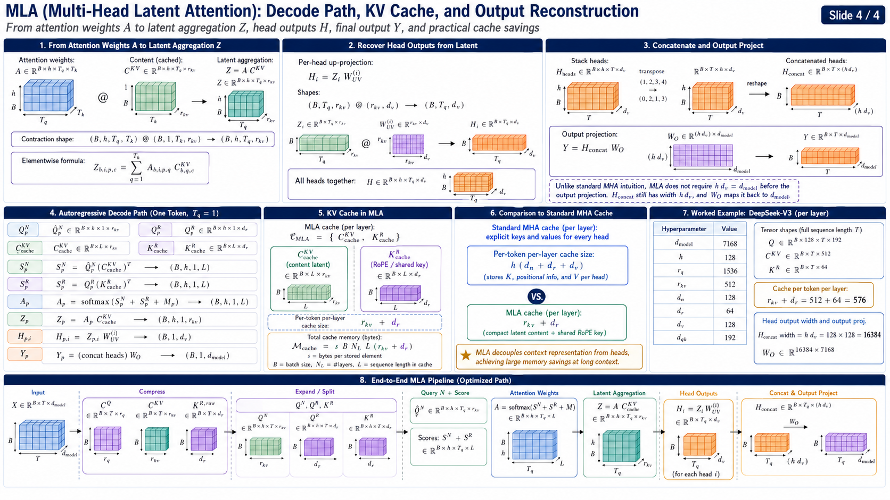
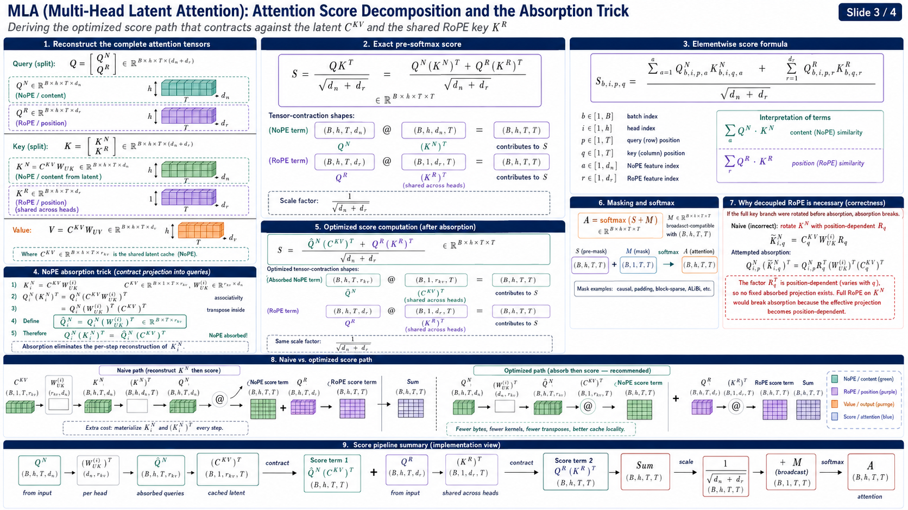

# MHA

[
X \in \mathbb{R}^{B\times T\times d_{\text{model}}}
]

[
h=\text{number of heads},
\qquad
d_h=\frac{d_{\text{model}}}{h}
]

[
W_Q,W_K,W_V\in\mathbb{R}^{d_{\text{model}}\times (h,d_h)}
=========================================================

\mathbb{R}^{d_{\text{model}}\times d_{\text{model}}}
]

[
W_Q=
\left[
W_Q^{(1)};W_Q^{(2)};\cdots;W_Q^{(h)}
\right],
\qquad
W_Q^{(i)}\in\mathbb{R}^{d_{\text{model}}\times d_h}
]

[
W_K=
\left[
W_K^{(1)};W_K^{(2)};\cdots;W_K^{(h)}
\right],
\qquad
W_K^{(i)}\in\mathbb{R}^{d_{\text{model}}\times d_h}
]

[
W_V=
\left[
W_V^{(1)};W_V^{(2)};\cdots;W_V^{(h)}
\right],
\qquad
W_V^{(i)}\in\mathbb{R}^{d_{\text{model}}\times d_h}
]

[
Q=XW_Q
\in
\mathbb{R}^{B\times T\times (h,d_h)}
====================================

\mathbb{R}^{B\times T\times d_{\text{model}}}
]

[
K=XW_K
\in
\mathbb{R}^{B\times T\times (h,d_h)}
]

[
V=XW_V
\in
\mathbb{R}^{B\times T\times (h,d_h)}
]

[
Q=
\left[
Q^{(1)};Q^{(2)};\cdots;Q^{(h)}
\right],
\qquad
Q^{(i)}=XW_Q^{(i)}
\in\mathbb{R}^{B\times T\times d_h}
]

[
K^{(i)}=XW_K^{(i)}
\in\mathbb{R}^{B\times T\times d_h}
]

[
V^{(i)}=XW_V^{(i)}
\in\mathbb{R}^{B\times T\times d_h}
]

[
Q:
(B,T,h,d_h)
;\xrightarrow{\operatorname{reshape}};
(B,T,h,d_h)
;\xrightarrow{\operatorname{transpose}(1,2)};
(B,h,T,d_h)
]

[
K:
(B,T,h,d_h)
;\xrightarrow{\operatorname{reshape}};
(B,T,h,d_h)
;\xrightarrow{\operatorname{transpose}(1,2)};
(B,h,T,d_h)
]

[
V:
(B,T,h,d_h)
;\xrightarrow{\operatorname{reshape}};
(B,T,h,d_h)
;\xrightarrow{\operatorname{transpose}(1,2)};
(B,h,T,d_h)
]

[
Q_{b,t,i,r}
===========

Q^{\text{heads}}_{b,i,t,r},
\qquad
\begin{aligned}
b&\in[1,B],\
t&\in[1,T],\
i&\in[1,h],\
r&\in[1,d_h]
\end{aligned}
]

[
Q^{(i)},K^{(i)},V^{(i)}
\in
\mathbb{R}^{B\times T\times d_h}
]

[
Q^{(i)}(K^{(i)})^\top:
(B,T,d_h)(B,d_h,T)
\rightarrow
(B,T,T)
]

[
S^{(i)}
=======

\frac{Q^{(i)}(K^{(i)})^\top}{\sqrt{d_h}}
\in
\mathbb{R}^{B\times T\times T}
]

[
A^{(i)}
=======

\operatorname{softmax}!\left(S^{(i)}+M\right)
\in
\mathbb{R}^{B\times T\times T}
]

[
H^{(i)}
=======

A^{(i)}V^{(i)}
]

[
(B,T,T)(B,T,d_h)
\rightarrow
(B,T,d_h)
]

[
H^{(i)}
\in
\mathbb{R}^{B\times T\times d_h}
]

[
H^{\text{heads}}
================

\operatorname{stack}
\left(
H^{(1)},H^{(2)},\ldots,H^{(h)}
\right)
\in
\mathbb{R}^{B\times h\times T\times d_h}
]

[
H^{\text{heads}}:
(B,h,T,d_h)
;\xrightarrow{\operatorname{transpose}(1,2)};
(B,T,h,d_h)
]

[
H^{\text{concat}}
=================

\operatorname{reshape}
\left(
H^{\text{heads}}
\right)
\in
\mathbb{R}^{B\times T\times (h,d_h)}
]

[
h,d_h=d_{\text{model}}
]

[
H^{\text{concat}}
\in
\mathbb{R}^{B\times T\times d_{\text{model}}}
]

[
H^{\text{concat}}_{b,t,(i-1)d_h+r}
==================================

H^{\text{heads}}_{b,i,t,r}
]

[
\operatorname{Concat}
\left(
H^{(1)},H^{(2)},\ldots,H^{(h)}
\right)
\in
\mathbb{R}^{B\times T\times (h,d_h)}
]

[
W_O
\in
\mathbb{R}^{(h,d_h)\times d_{\text{model}}}
===========================================

\mathbb{R}^{d_{\text{model}}\times d_{\text{model}}}
]

[
Y
=

H^{\text{concat}}W_O
]

[
(B,T,h,d_h)(h,d_h,d_{\text{model}})
\rightarrow
(B,T,d_{\text{model}})
]

[
\boxed{
X:
(B,T,d_{\text{model}})
\rightarrow
(B,T,h,d_h)
\rightarrow
(B,h,T,d_h)
\rightarrow
(B,h,T,T)
\rightarrow
(B,h,T,d_h)
\rightarrow
(B,T,h,d_h)
\rightarrow
(B,T,d_{\text{model}})
}
]

[
\boxed{
\operatorname{MHA}(X)
=====================

\operatorname{Concat}
\left(
\operatorname{head}_1,\ldots,\operatorname{head}_h
\right)W_O
}
]

[
\boxed{
\operatorname{head}_i
=====================

\operatorname{softmax}
\left(
\frac{
(XW_Q^{(i)})(XW_K^{(i)})^\top
}{
\sqrt{d_h}
}
+M
\right)
(XW_V^{(i)})
}
]

# GQA

[
X\in\mathbb{R}^{B\times T\times d_{\mathrm{model}}}
]

[
h_q=\text{number of query heads},
\qquad
h_{kv}=\text{number of key/value heads}
]

[
g=\frac{h_q}{h_{kv}},
\qquad
h_q\bmod h_{kv}=0
]

[
d_h=\frac{d_{\mathrm{model}}}{h_q},
\qquad
d_h\bmod 2=0
]

---
.png)
[
Q=XW_Q
\in
\mathbb{R}^{B\times T\times h_qd_h}
]

[
K=XW_K
\in
\mathbb{R}^{B\times T\times h_{kv}d_h}
]

[
Q:
(B,T,h_qd_h)
\rightarrow
(B,h_q,T,d_h)
]

[
K:
(B,T,h_{kv}d_h)
\rightarrow
(B,h_{kv},T,d_h)
]

[
Q_{b,i,m,:}\in\mathbb{R}^{d_h},
\qquad
K_{b,j,n,:}\in\mathbb{R}^{d_h}
]

[
\begin{aligned}
b&\in{0,\ldots,B-1},\
i&\in{0,\ldots,h_q-1},\
j&\in{0,\ldots,h_{kv}-1},\
m,n&\in{0,\ldots,T-1}
\end{aligned}
]

---

## RoPE frequencies

[
N_{\mathrm{pair}}
=================

\frac{d_h}{2}
]

[
\ell
\in
\left{
0,\ldots,\frac{d_h}{2}-1
\right}
]

[
\omega_\ell
===========

\beta^{-\frac{2\ell}{d_h}}
]

[
\beta=10000
\qquad
\text{in the original RoPE parameterization}
]

[
\boldsymbol{\omega}
===================

\begin{bmatrix}
\omega_0&
\omega_1&
\cdots&
\omega_{\frac{d_h}{2}-1}
\end{bmatrix}
\in
\mathbb{R}^{d_h/2}
]

[
P
=

\begin{bmatrix}
0&1&2&\cdots&T-1
\end{bmatrix}^{\top}
\in
\mathbb{R}^{T}
]

[
\Phi
====

P\boldsymbol{\omega}^{\top}
\in
\mathbb{R}^{T\times d_h/2}
]

[
\Phi_{m,\ell}
=============

m\omega_\ell
]

[
C_{m,\ell}
==========

\cos(m\omega_\ell)
]

[
S_{m,\ell}
==========

\sin(m\omega_\ell)
]

[
C,S
\in
\mathbb{R}^{T\times d_h/2}
]

---

## Two-dimensional rotation

[
R_\ell(m)
=========

\begin{bmatrix}
\cos(m\omega_\ell)&-\sin(m\omega_\ell)\
\sin(m\omega_\ell)&\cos(m\omega_\ell)
\end{bmatrix}
\in
\mathbb{R}^{2\times2}
]

[
R_\ell(m)^\top
==============

R_\ell(-m)
]

[
R_\ell(m)^\top R_\ell(n)
========================

R_\ell(n-m)
]

[
R_\ell(m)^{-1}
==============

R_\ell(-m)
]

[
R_\ell(m)^\top R_\ell(m)
========================

I_2
]

[
\left|R_\ell(m)x\right|_2
=========================

|x|_2
]

---

## Full head rotation matrix

[
\mathcal{R}(m)
==============

\operatorname{blockdiag}
\left(
R_0(m),
R_1(m),
\ldots,
R_{\frac{d_h}{2}-1}(m)
\right)
]

[
\mathcal{R}(m)
\in
\mathbb{R}^{d_h\times d_h}
]

[
\mathcal{R}(m)^\top
===================

\mathcal{R}(-m)
]

[
\mathcal{R}(m)^\top\mathcal{R}(n)
=================================

\mathcal{R}(n-m)
]

[
\mathcal{R}(m)^\top\mathcal{R}(m)
=================================

I_{d_h}
]

---

## Query rotation

[
q_{b,i,m}
=========

Q_{b,i,m,:}
\in
\mathbb{R}^{d_h}
]

[
q_{b,i,m}^{\mathrm{RoPE}}
=========================

\mathcal{R}(m)q_{b,i,m}
]

[
Q^{\mathrm{RoPE}}
\in
\mathbb{R}^{B\times h_q\times T\times d_h}
]

[
Q^{\mathrm{RoPE}}_{b,i,m,:}
===========================

\mathcal{R}(m)Q_{b,i,m,:}
]

---

## Key rotation

[
k_{b,j,n}
=========

K_{b,j,n,:}
\in
\mathbb{R}^{d_h}
]

[
k_{b,j,n}^{\mathrm{RoPE}}
=========================

\mathcal{R}(n)k_{b,j,n}
]

[
K^{\mathrm{RoPE}}
\in
\mathbb{R}^{B\times h_{kv}\times T\times d_h}
]

[
K^{\mathrm{RoPE}}_{b,j,n,:}
===========================

\mathcal{R}(n)K_{b,j,n,:}
]

---

## Pairwise query rotation

[
q_{b,i,m}^{(\ell)}
==================

\begin{bmatrix}
Q_{b,i,m,2\ell}\
Q_{b,i,m,2\ell+1}
\end{bmatrix}
\in
\mathbb{R}^{2}
]

[
q_{b,i,m}^{(\ell),\mathrm{RoPE}}
================================

R_\ell(m)q_{b,i,m}^{(\ell)}
]

[
\begin{bmatrix}
Q^{\mathrm{RoPE}}*{b,i,m,2\ell}\
Q^{\mathrm{RoPE}}*{b,i,m,2\ell+1}
\end{bmatrix}
=============

\begin{bmatrix}
\cos(m\omega_\ell)&-\sin(m\omega_\ell)\
\sin(m\omega_\ell)&\cos(m\omega_\ell)
\end{bmatrix}
\begin{bmatrix}
Q_{b,i,m,2\ell}\
Q_{b,i,m,2\ell+1}
\end{bmatrix}
]

[
\boxed{
Q^{\mathrm{RoPE}}_{b,i,m,2\ell}
===============================

## Q_{b,i,m,2\ell}\cos(m\omega_\ell)

Q_{b,i,m,2\ell+1}\sin(m\omega_\ell)
}
]

[
\boxed{
Q^{\mathrm{RoPE}}_{b,i,m,2\ell+1}
=================================

Q_{b,i,m,2\ell}\sin(m\omega_\ell)
+
Q_{b,i,m,2\ell+1}\cos(m\omega_\ell)
}
]

---

## Pairwise key rotation

[
k_{b,j,n}^{(\ell)}
==================

\begin{bmatrix}
K_{b,j,n,2\ell}\
K_{b,j,n,2\ell+1}
\end{bmatrix}
\in
\mathbb{R}^{2}
]

[
k_{b,j,n}^{(\ell),\mathrm{RoPE}}
================================

R_\ell(n)k_{b,j,n}^{(\ell)}
]

[
\begin{bmatrix}
K^{\mathrm{RoPE}}*{b,j,n,2\ell}\
K^{\mathrm{RoPE}}*{b,j,n,2\ell+1}
\end{bmatrix}
=============

\begin{bmatrix}
\cos(n\omega_\ell)&-\sin(n\omega_\ell)\
\sin(n\omega_\ell)&\cos(n\omega_\ell)
\end{bmatrix}
\begin{bmatrix}
K_{b,j,n,2\ell}\
K_{b,j,n,2\ell+1}
\end{bmatrix}
]

[
\boxed{
K^{\mathrm{RoPE}}_{b,j,n,2\ell}
===============================

## K_{b,j,n,2\ell}\cos(n\omega_\ell)

K_{b,j,n,2\ell+1}\sin(n\omega_\ell)
}
]

[
\boxed{
K^{\mathrm{RoPE}}_{b,j,n,2\ell+1}
=================================

K_{b,j,n,2\ell}\sin(n\omega_\ell)
+
K_{b,j,n,2\ell+1}\cos(n\omega_\ell)
}
]

---

## Complex-number form

[
z_{b,i,m,\ell}^{Q}
==================

Q_{b,i,m,2\ell}
+
\mathrm{i}Q_{b,i,m,2\ell+1}
]

[
z_{b,j,n,\ell}^{K}
==================

K_{b,j,n,2\ell}
+
\mathrm{i}K_{b,j,n,2\ell+1}
]

[
\boxed{
\widetilde z_{b,i,m,\ell}^{Q}
=============================

z_{b,i,m,\ell}^{Q}
e^{\mathrm{i}m\omega_\ell}
}
]

[
\boxed{
\widetilde z_{b,j,n,\ell}^{K}
=============================

z_{b,j,n,\ell}^{K}
e^{\mathrm{i}n\omega_\ell}
}
]

[
e^{\mathrm{i}m\omega_\ell}
==========================

\cos(m\omega_\ell)
+
\mathrm{i}\sin(m\omega_\ell)
]

---

## GQA head mapping

[
j(i)
====

\left\lfloor
\frac{i}{g}
\right\rfloor
]

[
Q_i
\longleftrightarrow
K_{j(i)}
]

[
\widetilde K_{b,i,n,:}^{\mathrm{RoPE}}
======================================

K_{b,j(i),n,:}^{\mathrm{RoPE}}
]

[
\widetilde K^{\mathrm{RoPE}}
\in
\mathbb{R}^{B\times h_q\times T\times d_h}
]

[
K^{\mathrm{RoPE}}:
(B,h_{kv},T,d_h)
\xrightarrow{\operatorname{repeat_interleave}(g)}
(B,h_q,T,d_h)
]

[
\boxed{
\widetilde K_{b,i,n,:}^{\mathrm{RoPE}}
======================================

\mathcal{R}(n)
K_{b,\lfloor i/g\rfloor,n,:}
}
]

---

## RoPE before or after GQA repetition

[
\operatorname{Repeat}_g
\left(
\mathcal{R}(n)K
\right)
=======

\mathcal{R}(n)
\operatorname{Repeat}_g(K)
]

[
\boxed{
\operatorname{Repeat}_g
\left(
K^{\mathrm{RoPE}}
\right)
=======

\operatorname{RoPE}
\left(
\operatorname{Repeat}_g(K)
\right)
}
]

---

## Query-key dot product

[
S_{b,i,m,n}
===========

\frac{
\left(
Q_{b,i,m,:}^{\mathrm{RoPE}}
\right)^\top
\widetilde K_{b,i,n,:}^{\mathrm{RoPE}}
}{
\sqrt{d_h}
}
]

# [

\frac{
\left(
\mathcal{R}(m)Q_{b,i,m,:}
\right)^\top
\left(
\mathcal{R}(n)K_{b,j(i),n,:}
\right)
}{
\sqrt{d_h}
}
]

# [

\frac{
Q_{b,i,m,:}^{\top}
\mathcal{R}(m)^\top
\mathcal{R}(n)
K_{b,j(i),n,:}
}{
\sqrt{d_h}
}
]

[
\boxed{
S_{b,i,m,n}
===========

\frac{
Q_{b,i,m,:}^{\top}
\mathcal{R}(n-m)
K_{b,\lfloor i/g\rfloor,n,:}
}{
\sqrt{d_h}
}
}
]

[
\Delta=n-m
]

[
\boxed{
S_{b,i,m,n}
===========

\frac{
Q_{b,i,m,:}^{\top}
\mathcal{R}(\Delta)
K_{b,\lfloor i/g\rfloor,n,:}
}{
\sqrt{d_h}
}
}
]

---

## Per-pair relative-position score

[
a
=

Q_{b,i,m,2\ell}
]

[
b_q
===

Q_{b,i,m,2\ell+1}
]

[
c
=

K_{b,j(i),n,2\ell}
]

[
d
=

K_{b,j(i),n,2\ell+1}
]

[
\Delta=n-m
]

[
\left(
q_{b,i,m}^{(\ell),\mathrm{RoPE}}
\right)^\top
k_{b,j(i),n}^{(\ell),\mathrm{RoPE}}
===================================

\left(
q_{b,i,m}^{(\ell)}
\right)^\top
R_\ell(\Delta)
k_{b,j(i),n}^{(\ell)}
]

# [

\begin{bmatrix}
a&b_q
\end{bmatrix}
\begin{bmatrix}
\cos(\Delta\omega_\ell)&-\sin(\Delta\omega_\ell)\
\sin(\Delta\omega_\ell)&\cos(\Delta\omega_\ell)
\end{bmatrix}
\begin{bmatrix}
c\d
\end{bmatrix}
]

[
\boxed{
=======

(ac+b_qd)\cos(\Delta\omega_\ell)
+
(b_qc-ad)\sin(\Delta\omega_\ell)
}
]

[
\boxed{
S_{b,i,m,n}
===========

\frac{1}{\sqrt{d_h}}
\sum_{\ell=0}^{d_h/2-1}
\left[
\begin{aligned}
&
\left(
Q_{b,i,m,2\ell}
K_{b,j(i),n,2\ell}
+
Q_{b,i,m,2\ell+1}
K_{b,j(i),n,2\ell+1}
\right)
\cos((n-m)\omega_\ell)
\
+{}&
\left(
Q_{b,i,m,2\ell+1}
K_{b,j(i),n,2\ell}
------------------

Q_{b,i,m,2\ell}
K_{b,j(i),n,2\ell+1}
\right)
\sin((n-m)\omega_\ell)
\end{aligned}
\right]
}
]

---

## Complex relative-position score

[
\left(
\widetilde z_{b,i,m,\ell}^{Q}
\right)^*
\widetilde z_{b,j(i),n,\ell}^{K}
]

# [

\left(
z_{b,i,m,\ell}^{Q}
e^{\mathrm{i}m\omega_\ell}
\right)^*
\left(
z_{b,j(i),n,\ell}^{K}
e^{\mathrm{i}n\omega_\ell}
\right)
]

# [

\left(
z_{b,i,m,\ell}^{Q}
\right)^*
z_{b,j(i),n,\ell}^{K}
e^{\mathrm{i}(n-m)\omega_\ell}
]

[
\boxed{
S_{b,i,m,n}
===========

\frac{1}{\sqrt{d_h}}
\sum_{\ell=0}^{d_h/2-1}
\operatorname{Re}
\left[
\left(
z_{b,i,m,\ell}^{Q}
\right)^*
z_{b,j(i),n,\ell}^{K}
e^{\mathrm{i}(n-m)\omega_\ell}
\right]
}
]

---

## Tensorized split-half implementation

[
Q
\in
\mathbb{R}^{B\times h_q\times T\times d_h}
]

[
K
\in
\mathbb{R}^{B\times h_{kv}\times T\times d_h}
]

[
Q
=

\left[
Q^{(1)};;;Q^{(2)}
\right]
]

[
Q^{(1)},Q^{(2)}
\in
\mathbb{R}^{B\times h_q\times T\times d_h/2}
]

[
K
=

\left[
K^{(1)};;;K^{(2)}
\right]
]

[
K^{(1)},K^{(2)}
\in
\mathbb{R}^{B\times h_{kv}\times T\times d_h/2}
]

[
\operatorname{rotate_half}(Q)
=============================

\left[
-Q^{(2)};;;Q^{(1)}
\right]
]

[
\operatorname{rotate_half}(K)
=============================

\left[
-K^{(2)};;;K^{(1)}
\right]
]

[
C^{\mathrm{full}}
=================

[C;;;C]
\in
\mathbb{R}^{T\times d_h}
]

[
S^{\mathrm{full}}
=================

[S;;;S]
\in
\mathbb{R}^{T\times d_h}
]

[
C^{\mathrm{full}},S^{\mathrm{full}}
:
(T,d_h)
\rightarrow
(1,1,T,d_h)
]

[
\boxed{
Q^{\mathrm{RoPE}}
=================

Q\odot C^{\mathrm{full}}
+
\operatorname{rotate_half}(Q)
\odot S^{\mathrm{full}}
}
]

[
\boxed{
K^{\mathrm{RoPE}}
=================

K\odot C^{\mathrm{full}}
+
\operatorname{rotate_half}(K)
\odot S^{\mathrm{full}}
}
]

[
(B,h_q,T,d_h)
\odot
(1,1,T,d_h)
\rightarrow
(B,h_q,T,d_h)
]

[
(B,h_{kv},T,d_h)
\odot
(1,1,T,d_h)
\rightarrow
(B,h_{kv},T,d_h)
]

---

## Split-half component equations

[
\ell
\in
\left{
0,\ldots,\frac{d_h}{2}-1
\right}
]

[
\boxed{
Q^{\mathrm{RoPE}}_{b,i,m,\ell}
==============================

## Q_{b,i,m,\ell}\cos(m\omega_\ell)

Q_{b,i,m,\ell+d_h/2}\sin(m\omega_\ell)
}
]

[
\boxed{
Q^{\mathrm{RoPE}}_{b,i,m,\ell+d_h/2}
====================================

Q_{b,i,m,\ell+d_h/2}\cos(m\omega_\ell)
+
Q_{b,i,m,\ell}\sin(m\omega_\ell)
}
]

[
\boxed{
K^{\mathrm{RoPE}}_{b,j,n,\ell}
==============================

## K_{b,j,n,\ell}\cos(n\omega_\ell)

K_{b,j,n,\ell+d_h/2}\sin(n\omega_\ell)
}
]

[
\boxed{
K^{\mathrm{RoPE}}_{b,j,n,\ell+d_h/2}
====================================

K_{b,j,n,\ell+d_h/2}\cos(n\omega_\ell)
+
K_{b,j,n,\ell}\sin(n\omega_\ell)
}
]

---

## Interleaved versus split-half layouts

[
\operatorname{pair}_{\mathrm{interleaved}}(\ell)
================================================

(2\ell,2\ell+1)
]

[
\operatorname{pair}_{\mathrm{split}}(\ell)
==========================================

\left(
\ell,\ell+\frac{d_h}{2}
\right)
]

[
P
\in
{0,1}^{d_h\times d_h}
]

[
P^\top P
========

# PP^\top

I_{d_h}
]

[
\boxed{
\mathcal{R}_{\mathrm{split}}(m)
===============================

P^\top
\mathcal{R}_{\mathrm{interleaved}}(m)
P
}
]

[
\boxed{
\mathcal{R}*{\mathrm{interleaved}}
\neq
\mathcal{R}*{\mathrm{split}}
\quad
\text{without the corresponding permutation}
}
]

---

## Complete GQA plus RoPE score path

[
Q:
(B,h_q,T,d_h)
\xrightarrow{\operatorname{RoPE}}
(B,h_q,T,d_h)
]

[
K:
(B,h_{kv},T,d_h)
\xrightarrow{\operatorname{RoPE}}
(B,h_{kv},T,d_h)
]

[
K^{\mathrm{RoPE}}:
(B,h_{kv},T,d_h)
\xrightarrow{\operatorname{repeat_interleave}(g)}
(B,h_q,T,d_h)
]

[
\left(
K^{\mathrm{RoPE}}
\right)^\top:
(B,h_q,T,d_h)
\rightarrow
(B,h_q,d_h,T)
]

[
S
=

\frac{
Q^{\mathrm{RoPE}}
\left(
\widetilde K^{\mathrm{RoPE}}
\right)^\top
}{
\sqrt{d_h}
}
]

[
(B,h_q,T,d_h)
@
(B,h_q,d_h,T)
\rightarrow
(B,h_q,T,T)
]

[
\boxed{
S
\in
\mathbb{R}^{B\times h_q\times T\times T}
}
]

[
\boxed{
S_{b,i,m,n}
===========

\frac{
Q_{b,i,m,:}^{\top}
\mathcal{R}(n-m)
K_{b,\lfloor i/g\rfloor,n,:}
}{
\sqrt{d_h}
}
}
]

[
A
=

\operatorname{softmax}(S+M)
\in
\mathbb{R}^{B\times h_q\times T\times T}
]

[
\boxed{
\operatorname{GQA!+!RoPE}(Q,K)
:
(B,h_q,T,d_h),
(B,h_{kv},T,d_h)
\rightarrow
(B,h_q,T,T)
}
]

---

## Partial RoPE

[
d_r\le d_h,
\qquad
d_r\bmod2=0
]

[
Q
=

\left[
Q^R;;;Q^N
\right]
]

[
Q^R
\in
\mathbb{R}^{B\times h_q\times T\times d_r}
]

[
Q^N
\in
\mathbb{R}^{B\times h_q\times T\times(d_h-d_r)}
]

[
K
=

\left[
K^R;;;K^N
\right]
]

[
K^R
\in
\mathbb{R}^{B\times h_{kv}\times T\times d_r}
]

[
K^N
\in
\mathbb{R}^{B\times h_{kv}\times T\times(d_h-d_r)}
]

[
Q^{\mathrm{RoPE}}
=================

\left[
\mathcal{R}_{d_r}(m)Q^R
;;;
Q^N
\right]
]

[
K^{\mathrm{RoPE}}
=================

\left[
\mathcal{R}_{d_r}(n)K^R
;;;
K^N
\right]
]

[
\boxed{
S_{b,i,m,n}
===========

\frac{
(Q^R_{b,i,m})^\top
\mathcal{R}*{d_r}(n-m)
K^R*{b,j(i),n}
+
(Q^N_{b,i,m})^\top
K^N_{b,j(i),n}
}{
\sqrt{d_h}
}
}
]

[
\boxed{
d_r=d_h
\Longrightarrow
\text{full-head RoPE}
}
]

[
\boxed{
d_r<d_h
\Longrightarrow
\text{partial RoPE}
}
]

The rotation-matrix and relative-position identities follow the RoFormer formulation; the split-half tensor equations correspond to the Llama-style implementation form. ([arxiv.org][1])

[1]: https://arxiv.org/abs/2104.09864?utm_source=chatgpt.com "RoFormer: Enhanced Transformer with Rotary Position Embedding"

# MLA

## 0. Conventions and corrections

The following uses the **row-vector tensor convention**

[
XW
]

rather than the DeepSeek paper’s column-vector convention

[
Wx.
]

The operations are identical; matrix dimensions are transposed. DeepSeek’s paper denotes the NoPE/content branch by superscript (C); here:

[
Q^N\equiv Q^C,
\qquad
K^N\equiv K^C.
]

DeepSeek MLA applies RoPE only to the (d_r)-dimensional positional branch, while the (d_n)-dimensional branch remains unrotated and absorbable into the compressed latent-space computation. The RoPE key is shared across all heads. 

---

# 1. Input and dimensions

[
X\in\mathbb{R}^{B\times T\times d_{\text{model}}}
]

[
\begin{aligned}
h&=\text{number of attention heads},\
r_q&=\text{query latent rank},\
r_{kv}&=\text{joint key-value latent rank},\
d_n&=\text{NoPE/content dimension per head},\
d_r&=\text{RoPE dimension per head},\
d_v&=\text{value dimension per head},\
d_{qk}&=d_n+d_r.
\end{aligned}
]

[
d_r\bmod 2=0
]

For token (t):

[
x_{b,t}\in\mathbb{R}^{d_{\text{model}}}.
]

---

# 2. RMSNorm used on compressed latents

For

[
z\in\mathbb{R}^{d},
]

[
\operatorname{RMS}(z)
=====================

\sqrt{
\frac{1}{d}
\sum_{a=1}^{d}z_a^2
+
\epsilon
}
]

[
\operatorname{RMSNorm}(z)
=========================

\gamma\odot
\frac{z}{\operatorname{RMS}(z)}
]

where

[
\gamma\in\mathbb{R}^{d}.
]

Therefore,

[
\operatorname{RMSNorm}:
\mathbb{R}^{B\times T\times d}
\rightarrow
\mathbb{R}^{B\times T\times d}.
]

The released implementation applies RMSNorm independently to the query latent and KV latent before their up-projections. ([Hugging Face][1])

---

# 3. Query compression

[
W_{DQ}
\in
\mathbb{R}^{d_{\text{model}}\times r_q}
]

[
C^{Q,\mathrm{raw}}
==================

XW_{DQ}
\in
\mathbb{R}^{B\times T\times r_q}
]

[
C^Q
===

\operatorname{RMSNorm}
\left(
C^{Q,\mathrm{raw}}
\right)
\in
\mathbb{R}^{B\times T\times r_q}.
]

Partition the query up-projection:

[
W_{UQ}
======

\left[
W_{UQ}^{N}
;;
W_{UQ}^{R}
\right]
]

with

[
W_{UQ}^{N}
\in
\mathbb{R}^{r_q\times hd_n}
]

and

[
W_{UQ}^{R}
\in
\mathbb{R}^{r_q\times hd_r}.
]

Hence,

[
W_{UQ}
\in
\mathbb{R}^{r_q\times h(d_n+d_r)}.
]

---

# 4. Query NoPE branch

[
Q^{N,\mathrm{flat}}
===================

C^QW_{UQ}^{N}
\in
\mathbb{R}^{B\times T\times hd_n}
]

[
Q^{N,\mathrm{flat}}:
(B,T,hd_n)
\rightarrow
(B,T,h,d_n)
\rightarrow
(B,h,T,d_n)
]

[
\boxed{
Q^N
\in
\mathbb{R}^{B\times h\times T\times d_n}
}
]

For head (i):

[
Q_i^N
=====

C^QW_{UQ}^{N,(i)}
]

where

[
W_{UQ}^{N,(i)}
\in
\mathbb{R}^{r_q\times d_n}.
]

Thus,

[
Q_i^N
\in
\mathbb{R}^{B\times T\times d_n}.
]

No positional rotation is applied:

[
\boxed{
\operatorname{NoPE}*t(q)=I*{d_n}q=q
}
]

[
Q_{b,i,t}^{N,\mathrm{positioned}}
=================================

# I_{d_n}Q_{b,i,t}^N

Q_{b,i,t}^N.
]

---

# 5. Query RoPE branch before rotation

[
Q^{R,\mathrm{raw,flat}}
=======================

C^QW_{UQ}^{R}
\in
\mathbb{R}^{B\times T\times hd_r}
]

[
Q^{R,\mathrm{raw,flat}}:
(B,T,hd_r)
\rightarrow
(B,T,h,d_r)
\rightarrow
(B,h,T,d_r)
]

[
\boxed{
Q^{R,\mathrm{raw}}
\in
\mathbb{R}^{B\times h\times T\times d_r}
}
]

For head (i):

[
Q_i^{R,\mathrm{raw}}
====================

C^QW_{UQ}^{R,(i)}
]

[
W_{UQ}^{R,(i)}
\in
\mathbb{R}^{r_q\times d_r}.
]

---

# 6. Joint KV compression and shared RoPE key

The combined KV down-projection is partitioned as

[
W_{DKV}^{A}
===========

\left[
W_{DKV}^{C}
;;
W_{KR}
\right].
]

[
W_{DKV}^{C}
\in
\mathbb{R}^{d_{\text{model}}\times r_{kv}}
]

[
W_{KR}
\in
\mathbb{R}^{d_{\text{model}}\times d_r}
]

[
W_{DKV}^{A}
\in
\mathbb{R}^{d_{\text{model}}\times(r_{kv}+d_r)}.
]

Then

[
U^{KV}
======

XW_{DKV}^{A}
\in
\mathbb{R}^{B\times T\times(r_{kv}+d_r)}
]

and

[
U^{KV}
======

\left[
C^{KV,\mathrm{raw}}
;;;
K^{R,\mathrm{raw}}
\right].
]

Therefore,

[
C^{KV,\mathrm{raw}}
===================

XW_{DKV}^{C}
\in
\mathbb{R}^{B\times T\times r_{kv}}
]

and

[
\boxed{
K^{R,\mathrm{raw}}
==================

XW_{KR}
\in
\mathbb{R}^{B\times T\times d_r}
}.
]

The implementation performs this as one projection and splits its output into the (r_{kv})-dimensional latent and the (d_r)-dimensional shared positional key. ([Hugging Face][1])

---

# 7. Normalized KV latent

[
C^{KV}
======

\operatorname{RMSNorm}
\left(
C^{KV,\mathrm{raw}}
\right)
]

[
\boxed{
C^{KV}
\in
\mathbb{R}^{B\times T\times r_{kv}}
}.
]

---

# 8. NoPE key up-projection

[
W_{UK}
======

\left[
W_{UK}^{(1)}
;;
W_{UK}^{(2)}
;;
\cdots
;;
W_{UK}^{(h)}
\right]
]

with

[
W_{UK}^{(i)}
\in
\mathbb{R}^{r_{kv}\times d_n}.
]

Hence,

[
W_{UK}
\in
\mathbb{R}^{r_{kv}\times hd_n}.
]

[
K^{N,\mathrm{flat}}
===================

C^{KV}W_{UK}
\in
\mathbb{R}^{B\times T\times hd_n}
]

[
K^{N,\mathrm{flat}}:
(B,T,hd_n)
\rightarrow
(B,T,h,d_n)
\rightarrow
(B,h,T,d_n)
]

[
\boxed{
K^N
\in
\mathbb{R}^{B\times h\times T\times d_n}
}.
]

Per head:

[
K_i^N
=====

C^{KV}W_{UK}^{(i)}
\in
\mathbb{R}^{B\times T\times d_n}.
]

Again,

[
\boxed{
\operatorname{NoPE}_t(K_i^N)=K_i^N
}.
]

---

# 9. Value up-projection

[
W_{UV}
======

\left[
W_{UV}^{(1)}
;;
W_{UV}^{(2)}
;;
\cdots
;;
W_{UV}^{(h)}
\right]
]

[
W_{UV}^{(i)}
\in
\mathbb{R}^{r_{kv}\times d_v}
]

[
W_{UV}
\in
\mathbb{R}^{r_{kv}\times hd_v}.
]

[
V^{\mathrm{flat}}
=================

C^{KV}W_{UV}
\in
\mathbb{R}^{B\times T\times hd_v}
]

[
V^{\mathrm{flat}}:
(B,T,hd_v)
\rightarrow
(B,T,h,d_v)
\rightarrow
(B,h,T,d_v)
]

[
\boxed{
V
\in
\mathbb{R}^{B\times h\times T\times d_v}
}.
]

---

# 10. RoPE frequencies for the (d_r)-dimensional branch

The number of two-dimensional rotation planes is

[
n_{\mathrm{pair}}
=================

\frac{d_r}{2}.
]

For

[
\ell
\in
\left{
0,\ldots,\frac{d_r}{2}-1
\right},
]

define

[
\omega_\ell
===========

\theta^{-\frac{2\ell}{d_r}}.
]

For the original RoPE base,

[
\theta=10000.
]

At position (t),

[
\phi_{t,\ell}
=============

t\omega_\ell.
]

[
c_{t,\ell}
==========

\cos(t\omega_\ell)
]

[
s_{t,\ell}
==========

\sin(t\omega_\ell).
]

---

# 11. Two-dimensional RoPE rotation

[
R_\ell(t)
=========

\begin{bmatrix}
\cos(t\omega_\ell)&-\sin(t\omega_\ell)\
\sin(t\omega_\ell)&\cos(t\omega_\ell)
\end{bmatrix}.
]

[
R_\ell(t)\in\mathbb{R}^{2\times2}
]

[
R_\ell(t)^\top
==============

R_\ell(-t)
]

[
R_\ell(t)^\top R_\ell(t)
========================

I_2
]

[
R_\ell(p)^\top R_\ell(q)
========================

R_\ell(q-p).
]

The complete (d_r)-dimensional operator is

[
\mathcal R_t
============

\operatorname{blockdiag}
\left(
R_0(t),
R_1(t),
\ldots,
R_{\frac{d_r}{2}-1}(t)
\right)
]

[
\mathcal R_t
\in
\mathbb{R}^{d_r\times d_r}.
]

[
\mathcal R_t^\top
=================

\mathcal R_{-t}
]

[
\mathcal R_p^\top\mathcal R_q
=============================

\mathcal R_{q-p}.
]

---

# 12. Query RoPE transformation

For query position (p),

[
Q_{b,i,p}^{R}
=============

\mathcal R_p
Q_{b,i,p}^{R,\mathrm{raw}}.
]

[
\boxed{
Q^R
===

\operatorname{RoPE}
\left(
Q^{R,\mathrm{raw}}
\right)
\in
\mathbb{R}^{B\times h\times T\times d_r}
}
]

For pair (\ell):

[
\begin{bmatrix}
Q^R_{b,i,p,2\ell}\
Q^R_{b,i,p,2\ell+1}
\end{bmatrix}
=============

R_\ell(p)
\begin{bmatrix}
Q^{R,\mathrm{raw}}*{b,i,p,2\ell}\
Q^{R,\mathrm{raw}}*{b,i,p,2\ell+1}
\end{bmatrix}.
]

Therefore,

[
\boxed{
Q^R_{b,i,p,2\ell}
=================

Q^{R,\mathrm{raw}}*{b,i,p,2\ell}
\cos(p\omega*\ell)
------------------

Q^{R,\mathrm{raw}}*{b,i,p,2\ell+1}
\sin(p\omega*\ell)
}
]

[
\boxed{
Q^R_{b,i,p,2\ell+1}
===================

Q^{R,\mathrm{raw}}*{b,i,p,2\ell}
\sin(p\omega*\ell)
+
Q^{R,\mathrm{raw}}*{b,i,p,2\ell+1}
\cos(p\omega*\ell)
}.
]

---

# 13. Shared key RoPE transformation

For key position (q),

[
K_{b,q}^{R}
===========

\mathcal R_q
K_{b,q}^{R,\mathrm{raw}}.
]

[
\boxed{
K^R
===

\operatorname{RoPE}
\left(
K^{R,\mathrm{raw}}
\right)
\in
\mathbb{R}^{B\times T\times d_r}
}
]

For pair (\ell):

[
\begin{bmatrix}
K^R_{b,q,2\ell}\
K^R_{b,q,2\ell+1}
\end{bmatrix}
=============

R_\ell(q)
\begin{bmatrix}
K^{R,\mathrm{raw}}*{b,q,2\ell}\
K^{R,\mathrm{raw}}*{b,q,2\ell+1}
\end{bmatrix}.
]

Thus,

[
\boxed{
K^R_{b,q,2\ell}
===============

K^{R,\mathrm{raw}}*{b,q,2\ell}
\cos(q\omega*\ell)
------------------

K^{R,\mathrm{raw}}*{b,q,2\ell+1}
\sin(q\omega*\ell)
}
]

[
\boxed{
K^R_{b,q,2\ell+1}
=================

K^{R,\mathrm{raw}}*{b,q,2\ell}
\sin(q\omega*\ell)
+
K^{R,\mathrm{raw}}*{b,q,2\ell+1}
\cos(q\omega*\ell)
}.
]

---

# 14. RoPE complex-number form

Define

[
z^{Q}_{b,i,p,\ell}
==================

Q^{R,\mathrm{raw}}*{b,i,p,2\ell}
+
\mathrm{i}
Q^{R,\mathrm{raw}}*{b,i,p,2\ell+1}
]

and

[
z^{K}_{b,q,\ell}
================

K^{R,\mathrm{raw}}*{b,q,2\ell}
+
\mathrm{i}
K^{R,\mathrm{raw}}*{b,q,2\ell+1}.
]

Then

[
\boxed{
\widetilde z^Q_{b,i,p,\ell}
===========================

z^Q_{b,i,p,\ell}
e^{\mathrm{i}p\omega_\ell}
}
]

[
\boxed{
\widetilde z^K_{b,q,\ell}
=========================

z^K_{b,q,\ell}
e^{\mathrm{i}q\omega_\ell}
}.
]

The official inference implementation uses exactly this adjacent-pair complex representation:

[
\mathbb{R}^{d_r}
\rightarrow
\mathbb{C}^{d_r/2}
\rightarrow
z\odot e^{\mathrm{i}t\omega}
\rightarrow
\mathbb{R}^{d_r}.
]

([GitHub][2])

---

# 15. Shared RoPE key across heads

The key RoPE branch has no head dimension before broadcasting:

[
K^R
\in
\mathbb{R}^{B\times T\times d_r}.
]

Insert a singleton head axis:

[
K^R:
(B,T,d_r)
\rightarrow
(B,1,T,d_r).
]

Broadcast over (h) query heads:

[
K^{R,\mathrm{head}}
===================

\operatorname{broadcast}_h(K^R)
]

[
(B,1,T,d_r)
\rightarrow
(B,h,T,d_r).
]

Therefore,

[
\boxed{
K_{b,i,q}^R
===========

K_{b,q}^R,
\qquad
\forall i\in{1,\ldots,h}
}.
]

No physical duplication is required by the mathematical operation.

---

# 16. Construct the complete query and key

For each head (i):

[
Q_i
===

\left[
Q_i^N
;;;
Q_i^R
\right].
]

[
Q_i
\in
\mathbb{R}^{B\times T\times(d_n+d_r)}.
]

Globally,

[
\boxed{
Q
\in
\mathbb{R}^{B\times h\times T\times d_{qk}}
}.
]

Similarly,

[
K_i
===

\left[
K_i^N
;;;
K^R
\right]
]

and

[
\boxed{
K
\in
\mathbb{R}^{B\times h\times T\times d_{qk}}
}.
]

The code explicitly concatenates `q_nope` with rotated `q_pe`, and `k_nope` with the rotated shared `k_pe`. ([GitHub][2])

---

# 17. Why the score separates into NoPE and RoPE terms

For one query and key:

[
Q_i
===

\begin{bmatrix}
Q_i^N\
Q_i^R
\end{bmatrix}
]

[
K_i
===

\begin{bmatrix}
K_i^N\
K^R
\end{bmatrix}.
]

Then

[
Q_i^\top K_i
============

\begin{bmatrix}
(Q_i^N)^\top&
(Q_i^R)^\top
\end{bmatrix}
\begin{bmatrix}
K_i^N\
K^R
\end{bmatrix}
]

[
\boxed{
Q_i^\top K_i
============

(Q_i^N)^\top K_i^N
+
(Q_i^R)^\top K^R
}.
]

There are no terms such as

[
(Q_i^N)^\top K^R
]

or

[
(Q_i^R)^\top K_i^N
]

because the NoPE and RoPE coordinates occupy disjoint concatenated subspaces.

---

# 18. NoPE attention score

For query position (p), key position (q), and head (i):

[
S^N_{b,i,p,q}
=============

\left(
Q^N_{b,i,p}
\right)^\top
K^N_{b,i,q}.
]

Index form:

[
\boxed{
S^N_{b,i,p,q}
=============

\sum_{a=1}^{d_n}
Q^N_{b,i,p,a}
K^N_{b,i,q,a}
}.
]

Tensor form:

[
S^N
===

Q^N(K^N)^\top
]

[
(B,h,T_q,d_n)
@
(B,h,d_n,T_k)
\rightarrow
(B,h,T_q,T_k).
]

[
\boxed{
S^N
\in
\mathbb{R}^{B\times h\times T_q\times T_k}
}.
]

No explicit position-dependent matrix appears:

[
\boxed{
S^N_{b,i,p,q}
=============

(Q^N_{b,i,p})^\top
I_{d_n}
K^N_{b,i,q}
}.
]

---

# 19. RoPE attention score

[
S^R_{b,i,p,q}
=============

\left(
Q^R_{b,i,p}
\right)^\top
K^R_{b,q}.
]

Substitute the rotations:

[
S^R_{b,i,p,q}
=============

\left(
\mathcal R_p
Q^{R,\mathrm{raw}}*{b,i,p}
\right)^\top
\left(
\mathcal R_q
K^{R,\mathrm{raw}}*{b,q}
\right).
]

# [

\left(
Q^{R,\mathrm{raw}}*{b,i,p}
\right)^\top
\mathcal R_p^\top
\mathcal R_q
K^{R,\mathrm{raw}}*{b,q}.
]

Since

[
\mathcal R_p^\top\mathcal R_q
=============================

\mathcal R_{q-p},
]

[
\boxed{
S^R_{b,i,p,q}
=============

\left(
Q^{R,\mathrm{raw}}*{b,i,p}
\right)^\top
\mathcal R*{q-p}
K^{R,\mathrm{raw}}_{b,q}
}.
]

Define

[
\Delta=q-p.
]

Then

[
\boxed{
S^R_{b,i,p,q}
=============

\left(
Q^{R,\mathrm{raw}}*{b,i,p}
\right)^\top
\mathcal R*{\Delta}
K^{R,\mathrm{raw}}_{b,q}
}.
]

Thus RoPE introduces the **relative-position operator**

[
\mathcal R_{q-p}.
]

---

# 20. Detailed pairwise RoPE score

For pair (\ell), define

[
a
=

Q^{R,\mathrm{raw}}_{b,i,p,2\ell}
]

[
b_q
===

Q^{R,\mathrm{raw}}_{b,i,p,2\ell+1}
]

[
c
=

K^{R,\mathrm{raw}}_{b,q,2\ell}
]

[
d
=

K^{R,\mathrm{raw}}_{b,q,2\ell+1}.
]

Then

[
\begin{aligned}
S^{R,(\ell)}*{b,i,p,q}
={}&
(ac+b_qd)\cos((q-p)\omega*\ell)
\
&+
(b_qc-ad)\sin((q-p)\omega_\ell).
\end{aligned}
]

Therefore,

[
\boxed{
\begin{aligned}
S^R_{b,i,p,q}
=============

\sum_{\ell=0}^{d_r/2-1}
\Big[
&
\left(
Q^{R,\mathrm{raw}}*{b,i,p,2\ell}
K^{R,\mathrm{raw}}*{b,q,2\ell}
+
Q^{R,\mathrm{raw}}*{b,i,p,2\ell+1}
K^{R,\mathrm{raw}}*{b,q,2\ell+1}
\right)
\cos((q-p)\omega_\ell)
\
+
&
\left(
Q^{R,\mathrm{raw}}*{b,i,p,2\ell+1}
K^{R,\mathrm{raw}}*{b,q,2\ell}
------------------------------

Q^{R,\mathrm{raw}}*{b,i,p,2\ell}
K^{R,\mathrm{raw}}*{b,q,2\ell+1}
\right)
\sin((q-p)\omega_\ell)
\Big].
\end{aligned}
}
]

---

# 21. Complete pre-softmax score

Let

[
\alpha
======

# \frac{1}{\sqrt{d_n+d_r}}

\frac{1}{\sqrt{d_{qk}}}.
]

Then

[
S_{b,i,p,q}
===========

\alpha
\left(
S^N_{b,i,p,q}
+
S^R_{b,i,p,q}
\right)
+
M_{p,q}.
]

Equivalently,

[
\boxed{
S
=

\frac{
Q^N(K^N)^\top
+
Q^R(K^R)^\top
}{
\sqrt{d_n+d_r}
}
+
M
}.
]

Tensor dimensions:

[
Q^N(K^N)^\top:
(B,h,T_q,d_n)
@
(B,h,d_n,T_k)
\rightarrow
(B,h,T_q,T_k)
]

[
Q^R(K^R)^\top:
(B,h,T_q,d_r)
@
(B,1,d_r,T_k)
\rightarrow
(B,h,T_q,T_k).
]

Therefore,

[
\boxed{
S
\in
\mathbb{R}^{B\times h\times T_q\times T_k}
}.
]

---

# 22. Causal masking and softmax

[
M_{p,q}
=======

\begin{cases}
0,&q\le p,\
-\infty,&q>p.
\end{cases}
]

[
A_{b,i,p,q}
===========

\frac{
\exp(S_{b,i,p,q})
}{
\displaystyle
\sum_{u=1}^{T_k}
\exp(S_{b,i,p,u})
}.
]

[
\boxed{
A
=

\operatorname{softmax}_{q}(S)
\in
\mathbb{R}^{B\times h\times T_q\times T_k}
}.
]

---

# 23. NoPE key-projection absorption

Per head:

[
K_i^N
=====

C^{KV}W_{UK}^{(i)}.
]

The NoPE score is

[
Q_i^N(K_i^N)^\top
=================

Q_i^N
\left(
C^{KV}W_{UK}^{(i)}
\right)^\top.
]

Using

[
(AB)^\top
=========

B^\top A^\top,
]

[
Q_i^N(K_i^N)^\top
=================

Q_i^N
\left(
W_{UK}^{(i)}
\right)^\top
\left(
C^{KV}
\right)^\top.
]

Define the absorbed query:

[
\boxed{
\widehat Q_i^N
==============

Q_i^N
\left(
W_{UK}^{(i)}
\right)^\top
}.
]

Dimensions:

[
(B,T_q,d_n)
@
(d_n,r_{kv})
\rightarrow
(B,T_q,r_{kv}).
]

Thus,

[
\widehat Q_i^N
\in
\mathbb{R}^{B\times T_q\times r_{kv}}.
]

Across all heads:

[
\boxed{
\widehat Q^N
\in
\mathbb{R}^{B\times h\times T_q\times r_{kv}}
}.
]

Then

[
\boxed{
Q_i^N(K_i^N)^\top
=================

\widehat Q_i^N
(C^{KV})^\top
}.
]

Tensor form:

[
(B,h,T_q,r_{kv})
@
(B,1,r_{kv},T_k)
\rightarrow
(B,h,T_q,T_k).
]

---

# 24. Optimized MLA score without reconstructing (K^N)

[
\boxed{
S
=

\alpha
\left[
\widehat Q^N(C^{KV})^\top
+
Q^R(K^R)^\top
\right]
+
M
}
]

with

[
\widehat Q^N
\in
\mathbb{R}^{B\times h\times T_q\times r_{kv}}
]

[
C^{KV}
\in
\mathbb{R}^{B\times T_k\times r_{kv}}
]

[
Q^R
\in
\mathbb{R}^{B\times h\times T_q\times d_r}
]

[
K^R
\in
\mathbb{R}^{B\times T_k\times d_r}.
]

Index form:

[
\boxed{
\begin{aligned}
S_{b,i,p,q}
===========

\alpha
\Bigg[
&
\sum_{c=1}^{r_{kv}}
\widehat Q^N_{b,i,p,c}
C^{KV}*{b,q,c}
\
+
&
\sum*{r=1}^{d_r}
Q^R_{b,i,p,r}
K^R_{b,q,r}
\Bigg]
+
M_{p,q}.
\end{aligned}
}
]

This is the optimized score path implemented in DeepSeek’s released inference code: one contraction against the cached latent and one contraction against the cached positional key. ([GitHub][2])

---

# 25. Why full RoPE prevents absorption

Assume incorrectly that the complete compressed key were up-projected and then rotated:

[
K_{i,q}
=======

\mathcal R_q
W_{UK}^{(i)}
C_q^{KV}.
]

Similarly,

[
Q_{i,p}
=======

\mathcal R_pQ_{i,p}^{\mathrm{raw}}.
]

Then

[
Q_{i,p}^\top K_{i,q}
====================

\left(
Q_{i,p}^{\mathrm{raw}}
\right)^\top
\mathcal R_p^\top
\mathcal R_q
W_{UK}^{(i)}
C_q^{KV}.
]

# [

\left(
Q_{i,p}^{\mathrm{raw}}
\right)^\top
\mathcal R_{q-p}
W_{UK}^{(i)}
C_q^{KV}.
]

To absorb (W_{UK}^{(i)}), one would require a fixed matrix

[
\overline W_i
]

such that

[
\overline W_i
=============

\mathcal R_{q-p}
W_{UK}^{(i)}
\qquad
\forall p,q.
]

But

[
\mathcal R_{q-p}
]

depends on the query-key relative position. Therefore,

[
\boxed{
\nexists;
\overline W_i
\text{ independent of }p,q
\text{ such that }
\overline W_i
=============

\mathcal R_{q-p}W_{UK}^{(i)}
}
]

in general.

Equivalently,

[
\mathcal R_qW_{UK}^{(i)}
\neq
W_{UK}^{(i)}\mathcal R_q
]

for arbitrary learned (W_{UK}^{(i)}).

Hence,

[
\boxed{
\text{full-key RoPE}
\Longrightarrow
\text{position-dependent up-projection}
\Longrightarrow
\text{no fixed absorption}
}.
]

DeepSeek solves this by keeping

[
K^N=C^{KV}W_{UK}
]

unrotated and absorbable, while isolating position dependence into the small shared key

[
K^R\in\mathbb{R}^{d_r}.
]

This is the core reason for **decoupled RoPE**. ([arXiv][3])

---

# 26. Attention-weighted latent aggregation

Instead of materializing values first,

[
V_i
===

C^{KV}W_{UV}^{(i)},
]

compute

[
Z_i
===

A_iC^{KV}.
]

Tensor dimensions:

[
(B,T_q,T_k)
@
(B,T_k,r_{kv})
\rightarrow
(B,T_q,r_{kv}).
]

Across heads:

[
\boxed{
Z
=

AC^{KV}
\in
\mathbb{R}^{B\times h\times T_q\times r_{kv}}
}.
]

Index form:

[
\boxed{
Z_{b,i,p,c}
===========

\sum_{q=1}^{T_k}
A_{b,i,p,q}
C^{KV}_{b,q,c}
}.
]

Recover the head output:

[
H_i
===

Z_iW_{UV}^{(i)}.
]

[
(B,T_q,r_{kv})
@
(r_{kv},d_v)
\rightarrow
(B,T_q,d_v).
]

[
\boxed{
H
\in
\mathbb{R}^{B\times h\times T_q\times d_v}
}.
]

Associativity gives

[
A_iV_i
======

A_i
\left(
C^{KV}W_{UV}^{(i)}
\right)
]

[
\boxed{
A_iV_i
======

\left(
A_iC^{KV}
\right)
W_{UV}^{(i)}
}.
]

---

# 27. Output projection and complete value absorption

[
H:
(B,h,T_q,d_v)
\rightarrow
(B,T_q,h,d_v)
\rightarrow
(B,T_q,hd_v).
]

[
W_O
\in
\mathbb{R}^{hd_v\times d_{\text{model}}}.
]

Partition its rows by head:

[
W_O
===

\begin{bmatrix}
W_O^{(1)}\
W_O^{(2)}\
\vdots\
W_O^{(h)}
\end{bmatrix}
]

where

[
W_O^{(i)}
\in
\mathbb{R}^{d_v\times d_{\text{model}}}.
]

Then

[
Y
=

H_{\mathrm{concat}}W_O
]

# [

\sum_{i=1}^{h}
H_iW_O^{(i)}.
]

Substitute

[
H_i
===

Z_iW_{UV}^{(i)}:
]

[
Y
=

\sum_{i=1}^{h}
Z_iW_{UV}^{(i)}W_O^{(i)}.
]

Define

[
\overline W_{OV}^{(i)}
======================

W_{UV}^{(i)}W_O^{(i)}
]

with

[
\overline W_{OV}^{(i)}
\in
\mathbb{R}^{r_{kv}\times d_{\text{model}}}.
]

Therefore,

[
\boxed{
Y
=

\sum_{i=1}^{h}
Z_i\overline W_{OV}^{(i)}
}
]

and

[
\boxed{
Y
\in
\mathbb{R}^{B\times T_q\times d_{\text{model}}}
}.
]

---

# 28. Autoregressive decode path

Let

[
T_q=1
]

and let

[
L=T_{\mathrm{cache}}.
]

For the current query token at position (p):

[
Q^N_p
\in
\mathbb{R}^{B\times h\times1\times d_n}
]

[
Q^R_p
\in
\mathbb{R}^{B\times h\times1\times d_r}.
]

After NoPE absorption:

[
\widehat Q^N_p
\in
\mathbb{R}^{B\times h\times1\times r_{kv}}.
]

Cached tensors:

[
C_{\mathrm{cache}}^{KV}
\in
\mathbb{R}^{B\times L\times r_{kv}}
]

[
K_{\mathrm{cache}}^R
\in
\mathbb{R}^{B\times L\times d_r}.
]

NoPE score:

[
S_p^N
=====

\widehat Q_p^N
\left(
C_{\mathrm{cache}}^{KV}
\right)^\top
]

[
(B,h,1,r_{kv})
@
(B,1,r_{kv},L)
\rightarrow
(B,h,1,L).
]

RoPE score:

[
S_p^R
=====

Q_p^R
\left(
K_{\mathrm{cache}}^R
\right)^\top
]

[
(B,h,1,d_r)
@
(B,1,d_r,L)
\rightarrow
(B,h,1,L).
]

Complete score:

[
\boxed{
S_p
===

\alpha
\left(
S_p^N+S_p^R
\right)
+
M_p
}
]

[
S_p
\in
\mathbb{R}^{B\times h\times1\times L}.
]

[
A_p
===

\operatorname{softmax}(S_p)
\in
\mathbb{R}^{B\times h\times1\times L}.
]

Latent aggregation:

[
Z_p
===

A_pC_{\mathrm{cache}}^{KV}
]

[
(B,h,1,L)
@
(B,1,L,r_{kv})
\rightarrow
(B,h,1,r_{kv}).
]

Head recovery:

[
H_{p,i}
=======

Z_{p,i}W_{UV}^{(i)}
\in
\mathbb{R}^{B\times1\times d_v}.
]

Final output:

[
Y_p
\in
\mathbb{R}^{B\times1\times d_{\text{model}}}.
]

---

# 29. KV-cache state

The optimized MLA cache is

[
\boxed{
\mathcal C_{\mathrm{MLA}}
=========================

\left{
C_{\mathrm{cache}}^{KV},
K_{\mathrm{cache}}^R
\right}
}.
]

Per token, per layer:

[
C_t^{KV}
\in
\mathbb{R}^{r_{kv}}
]

[
K_t^R
\in
\mathbb{R}^{d_r}.
]

Therefore,

[
\boxed{
N_{\mathrm{cache/token/layer}}
==============================

r_{kv}+d_r
}.
]

For (B) sequences, (L) cached tokens, and (N_L) layers:

[
N_{\mathrm{cache}}
==================

BN_LL(r_{kv}+d_r).
]

At storage precision (s) bytes:

[
\boxed{
M_{\mathrm{cache}}
==================

sBN_LL(r_{kv}+d_r)
\text{ bytes}
}.
]

The paper identifies precisely these two cached states: the compressed KV latent and the shared decoupled RoPE key. 

---

# 30. DeepSeek-V3 YaRN-modified RoPE frequencies

For the released DeepSeek-V3 configuration:

[
d_r=64,
\qquad
\theta=10000,
\qquad
f=40,
]

[
L_0=4096,
\qquad
\beta_{\mathrm{fast}}=32,
\qquad
\beta_{\mathrm{slow}}=1.
]

The unscaled frequency is

[
\omega_\ell
===========

\theta^{-2\ell/d_r}.
]

Define the correction index for (n) rotations:

[
d_{\mathrm{corr}}(n)
====================

\frac{
d_r\log\left(
\frac{L_0}{2\pi n}
\right)
}{
2\log\theta
}.
]

[
\ell_{\mathrm{low}}
===================

\left\lfloor
d_{\mathrm{corr}}
\left(
\beta_{\mathrm{fast}}
\right)
\right\rfloor
]

[
\ell_{\mathrm{high}}
====================

\left\lceil
d_{\mathrm{corr}}
\left(
\beta_{\mathrm{slow}}
\right)
\right\rceil.
]

Define

[
\rho_\ell
=========

\operatorname{clip}
\left(
\frac{
\ell-\ell_{\mathrm{low}}
}{
\ell_{\mathrm{high}}-\ell_{\mathrm{low}}
},
0,
1
\right)
]

and

[
\sigma_\ell
===========

1-\rho_\ell.
]

The interpolated frequency is

[
\boxed{
\widetilde\omega_\ell
=====================

\frac{\omega_\ell}{f}
\left(
1-\sigma_\ell
\right)
+
\omega_\ell\sigma_\ell
}.
]

Equivalently,

[
\boxed{
\widetilde\omega_\ell
=====================

\omega_\ell
\left[
\sigma_\ell
+
\frac{1-\sigma_\ell}{f}
\right]
}.
]

The attention scaling used by the released inference implementation is

[
m
=

1+
0.1,m_{\mathrm{scale}}\log f
]

and

[
\boxed{
\alpha_{\mathrm{YaRN}}
======================

\frac{m^2}{\sqrt{d_n+d_r}}
}.
]

These frequency-interpolation and scaling equations directly follow the released DeepSeek-V3 inference implementation and configuration. ([GitHub][2])

---

# 31. DeepSeek-V3 exact dimensions

[
\begin{aligned}
d_{\text{model}}&=7168,\
h&=128,\
r_q&=1536,\
r_{kv}&=512,\
d_n&=128,\
d_r&=64,\
d_v&=128,\
d_{qk}&=192.
\end{aligned}
]

These values are specified in the released DeepSeek-V3-Base configuration. ([Hugging Face][4])

## Query path

[
X
\in
\mathbb{R}^{B\times T\times7168}
]

[
C^Q
\in
\mathbb{R}^{B\times T\times1536}
]

[
Q^{N,\mathrm{flat}}
\in
\mathbb{R}^{B\times T\times(128\cdot128)}
=========================================

\mathbb{R}^{B\times T\times16384}
]

[
Q^N
\in
\mathbb{R}^{B\times128\times T\times128}
]

[
Q^{R,\mathrm{raw,flat}}
\in
\mathbb{R}^{B\times T\times(128\cdot64)}
========================================

\mathbb{R}^{B\times T\times8192}
]

[
Q^R
\in
\mathbb{R}^{B\times128\times T\times64}.
]

Combined:

[
Q
\in
\mathbb{R}^{B\times128\times T\times192}.
]

## KV path

[
U^{KV}
\in
\mathbb{R}^{B\times T\times(512+64)}
====================================

\mathbb{R}^{B\times T\times576}
]

[
C^{KV}
\in
\mathbb{R}^{B\times T\times512}
]

[
K^R
\in
\mathbb{R}^{B\times T\times64}
]

[
K^N
\in
\mathbb{R}^{B\times128\times T\times128}
]

[
V
\in
\mathbb{R}^{B\times128\times T\times128}.
]

---

# 32. DeepSeek-V3 optimized score shapes

Absorbed NoPE query:

[
\widehat Q^N:
(B,128,T,128)
@
(128,512)
\rightarrow
(B,128,T,512).
]

NoPE score:

[
(B,128,T,512)
@
(B,1,512,T)
\rightarrow
(B,128,T,T).
]

RoPE score:

[
(B,128,T,64)
@
(B,1,64,T)
\rightarrow
(B,128,T,T).
]

Complete score:

[
\boxed{
S
=

\alpha
\left[
\widehat Q^N(C^{KV})^\top
+
Q^R(K^R)^\top
\right]
}
]

[
\boxed{
S
\in
\mathbb{R}^{B\times128\times T\times T}
}.
]

---

# 33. DeepSeek-V3 output shapes

[
A
\in
\mathbb{R}^{B\times128\times T\times T}
]

[
Z
=

AC^{KV}
]

[
(B,128,T,T)
@
(B,1,T,512)
\rightarrow
(B,128,T,512).
]

[
Z
\in
\mathbb{R}^{B\times128\times T\times512}.
]

Value recovery:

[
(B,128,T,512)
\rightarrow
(B,128,T,128).
]

Concatenation:

[
(B,128,T,128)
\rightarrow
(B,T,128,128)
\rightarrow
(B,T,16384).
]

[
W_O
\in
\mathbb{R}^{16384\times7168}.
]

[
(B,T,16384)
@
(16384,7168)
\rightarrow
(B,T,7168).
]

---

# 34. DeepSeek-V3 cache

[
C_{\mathrm{cache}}^{KV}
\in
\mathbb{R}^{B\times L\times512}
]

[
K_{\mathrm{cache}}^R
\in
\mathbb{R}^{B\times L\times64}.
]

[
\boxed{
N_{\mathrm{cache/token/layer}}
==============================

# 512+64

576
}
]

At BF16:

[
s=2\text{ bytes}
]

[
\boxed{
M_{\mathrm{token/layer}}
========================

# 576\cdot2

1152\text{ bytes}
}.
]

For (61) Transformer layers:

[
M_{\mathrm{token}}
==================

# 61\cdot1152

70{,}272\text{ bytes}
]

[
\boxed{
M_{\mathrm{token}}
\approx
68.625\text{ KiB}
}
]

excluding allocator alignment, block metadata, quantization metadata, replication, and serving-engine padding.

---

# 35. Complete RoPE–NoPE identity

[
\boxed{
Q_{b,i,p}
=========

\left[
Q^N_{b,i,p}
;;;
\mathcal R_pQ^{R,\mathrm{raw}}_{b,i,p}
\right]
}
]

[
\boxed{
K_{b,i,q}
=========

\left[
C^{KV}*{b,q}W*{UK}^{(i)}
;;;
\mathcal R_qK^{R,\mathrm{raw}}_{b,q}
\right]
}
]

[
\boxed{
\begin{aligned}
Q_{b,i,p}^{\top}K_{b,i,q}
={}&
\left(
Q^N_{b,i,p}
W_{UK}^{(i)\top}
\right)^\top
C^{KV}*{b,q}
\
&+
\left(
Q^{R,\mathrm{raw}}*{b,i,p}
\right)^\top
\mathcal R_{q-p}
K^{R,\mathrm{raw}}_{b,q}.
\end{aligned}
}
]

Therefore,

[
\boxed{
\begin{aligned}
S_{b,i,p,q}
===========

\frac{1}{\sqrt{d_n+d_r}}
\Bigg[
&
\underbrace{
\sum_{c=1}^{r_{kv}}
\widehat Q^N_{b,i,p,c}
C^{KV}*{b,q,c}
}*{\text{NoPE/content latent score}}
\
+
&
\underbrace{
\left(
Q^{R,\mathrm{raw}}*{b,i,p}
\right)^\top
\mathcal R*{q-p}
K^{R,\mathrm{raw}}*{b,q}
}*{\text{RoPE relative-position score}}
\Bigg]
+
M_{p,q}.
\end{aligned}
}
]

[
\boxed{
\text{NoPE branch}
:
d_n
\rightarrow
r_{kv}\text{-latent contraction}
}
]

[
\boxed{
\text{RoPE branch}
:
d_r\text{-dimensional shared positional key}
}
]

[
\boxed{
\text{MLA cache}
================

\underbrace{r_{kv}}*{\text{content/value latent}}
+
\underbrace{d_r}*{\text{position-dependent key}}
}
]

[1]: https://huggingface.co/deepseek-ai/DeepSeek-V3/blob/main/modeling_deepseek.py "modeling_deepseek.py · deepseek-ai/DeepSeek-V3 at main"
[2]: https://github.com/deepseek-ai/DeepSeek-V3/blob/main/inference/model.py "DeepSeek-V3/inference/model.py at main · deepseek-ai/DeepSeek-V3 · GitHub"
[3]: https://arxiv.org/html/2405.04434v4 "DeepSeek-V2: A Strong, Economical, and Efficient Mixture-of-Experts Language Model"
[4]: https://huggingface.co/deepseek-ai/DeepSeek-V3-Base/blob/main/config.json "config.json · deepseek-ai/DeepSeek-V3-Base at main"

