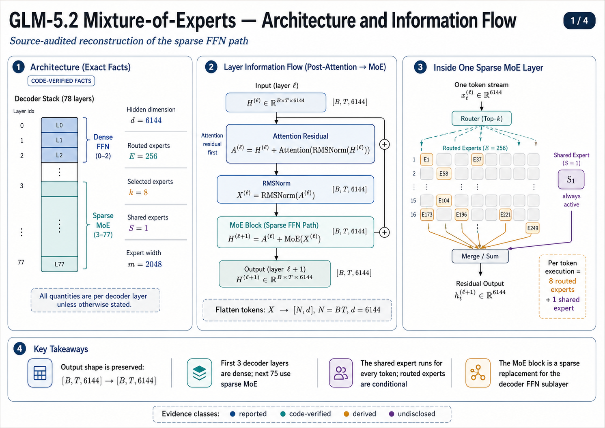
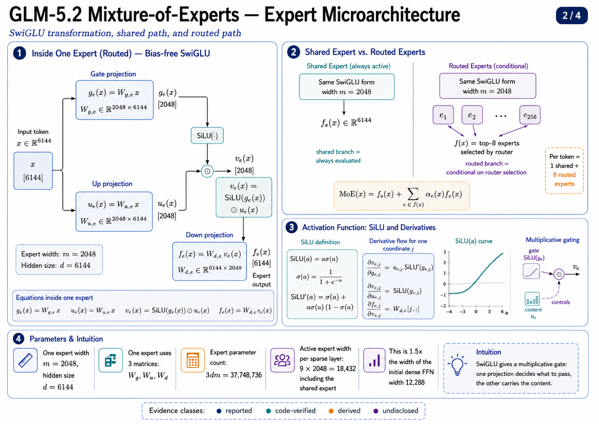
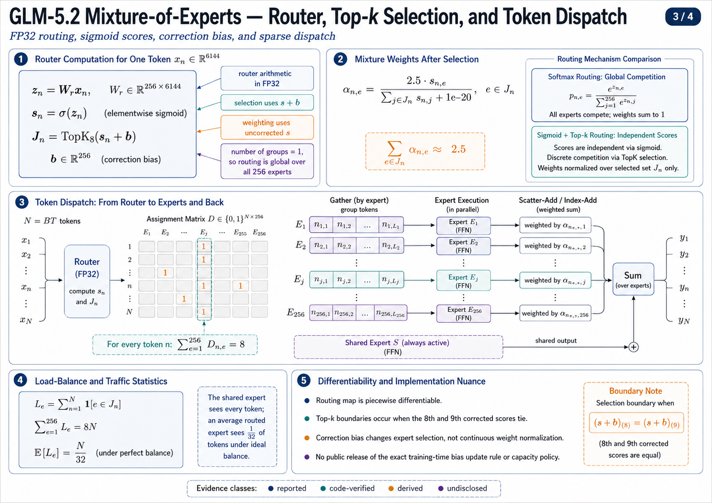
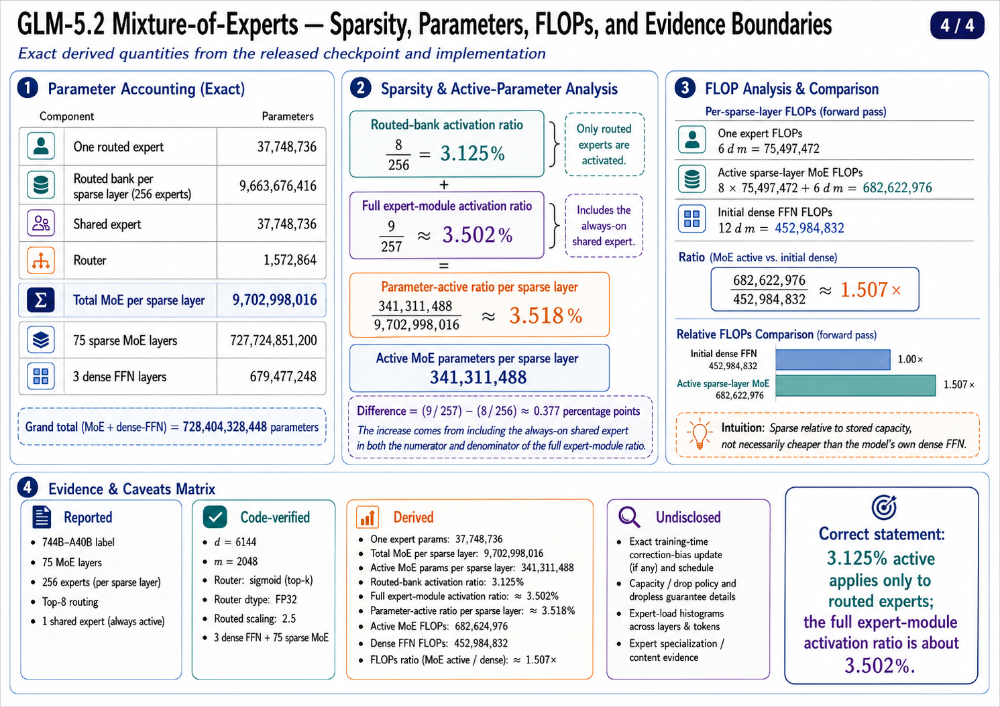

# GLM-5.2 Mixture-of-Experts: Source-Audited Mathematical Reconstruction

## 0. Scope and evidence boundary

As of **July 23, 2026**, there is no separate public GLM-5.2 technical report that completely specifies a new MoE design. The strongest reconstruction therefore combines:

1. the **GLM-5.2 checkpoint configuration**;
2. the official Hugging Face `GlmMoeDsa` implementation used by GLM-5, GLM-5.1, and GLM-5.2;
3. the GLM-5 technical report’s architecture table;
4. the official GLM repository and GLM-5.2 model card.

The exact GLM-5.2 checkpoint establishes the MoE topology. The GLM-5 report provides the declared total/activated parameter accounting. Exact training-time router-bias updates, capacity policies, and expert-utilization statistics are not publicly exposed. ([Hugging Face][1])

I use four evidence labels:

* **Reported** — explicitly stated in an official report or model card.
* **Code-verified** — directly reconstructed from released configuration or implementation.
* **Derived** — arithmetic or calculus from code-verified quantities.
* **Undisclosed** — not recoverable from released artifacts.

---

## 1. Exact GLM-5.2 MoE configuration

Let

[
B=\text{batch size},\qquad
T=\text{sequence length},\qquad
N=BT,
]

and let the decoder hidden state be

[
H^{(\ell)}\in\mathbb{R}^{B\times T\times d},
\qquad d=6144.
]

The checkpoint defines:

| Quantity                      |               Symbol | GLM-5.2 value | Evidence      |
| ----------------------------- | -------------------: | ------------: | ------------- |
| Decoder hidden size           |                  (d) |        (6144) | Code-verified |
| Main decoder layers           |                  (L) |          (78) | Code-verified |
| Initial dense layers          | (L_{\mathrm{dense}}) |           (3) | Code-verified |
| Sparse MoE layers             |   (L_{\mathrm{MoE}}) |          (75) | Code-verified |
| Dense FFN width               | (m_{\mathrm{dense}}) |       (12288) | Code-verified |
| Routed expert width           |                  (m) |        (2048) | Code-verified |
| Routed experts per layer      |                  (E) |         (256) | Code-verified |
| Selected routed experts/token |                  (k) |           (8) | Code-verified |
| Shared experts                |                  (S) |           (1) | Code-verified |
| Router scoring                |                    — |       sigmoid | Code-verified |
| Router arithmetic             |                    — |          FP32 | Code-verified |
| Top-(k) normalization         |                    — |       enabled | Code-verified |
| Routed scaling factor         |                (c_r) |         (2.5) | Code-verified |
| Expert activation             |               (\phi) |          SiLU | Code-verified |
| Router method metadata        |                    — |    `noaux_tc` | Code-verified |
| Expert groups                 |                  (G) |           (1) | Code-verified |
| Selected groups               |                (G_k) |           (1) | Code-verified |

The first three decoder layers use dense gated FFNs. Layers (3,\ldots,77) use the sparse MoE sublayer. The checkpoint’s `mlp_layer_types` array independently confirms exactly three dense and seventy-five sparse entries. ([Hugging Face][1])

The GLM-5 report separately records (744) billion total parameters and approximately (40) billion activated parameters, with 3 dense layers, 75 MoE layers, 256 routed experts, top-8 routing, one shared expert, (d=6144), and (m=2048). ([arXiv][2])

---

# 2. Decoder-level information flow

For a sparse decoder layer (\ell), let

[
H^{(\ell)}\in\mathbb{R}^{B\times T\times6144}.
]

The released implementation uses a pre-normalized attention block followed by a pre-normalized MoE block:

[
A^{(\ell)}
==========

H^{(\ell)}
+
\operatorname{Attention}^{(\ell)}
\left(
\operatorname{RMSNorm}_{1}^{(\ell)}
\left(H^{(\ell)}\right)
\right),
]

[
X^{(\ell)}
==========

\operatorname{RMSNorm}_{2}^{(\ell)}
\left(A^{(\ell)}\right),
]

[
H^{(\ell+1)}
============

A^{(\ell)}
+
\operatorname{MoE}^{(\ell)}
\left(X^{(\ell)}\right).
]

The MoE therefore receives an RMS-normalized tensor

[
X^{(\ell)}\in\mathbb{R}^{B\times T\times6144}
]

and returns a tensor with the identical shape. The shared and routed branches are summed **inside** the MoE module, after which the complete MoE output is added through the outer residual connection. ([GitHub][3])

Flattening the token axes gives

[
X
=

\operatorname{reshape}
\left(
X^{(\ell)},[N,d]
\right)
\in\mathbb{R}^{N\times6144}.
]

Routing and expert execution operate over these (N=BT) token vectors.

---

# 3. Exact expert transformation

## 3.1 Routed-expert parameterization

For routed expert (e\in{1,\dots,E}), the released implementation stores

[
W_{g,e}\in\mathbb{R}^{m\times d},
\qquad
W_{u,e}\in\mathbb{R}^{m\times d},
\qquad
W_{d,e}\in\mathbb{R}^{d\times m},
]

with

[
d=6144,\qquad m=2048.
]

All three linear transformations are bias-free.

For token (x\in\mathbb{R}^{d}),

[
g_e(x)=W_{g,e}x\in\mathbb{R}^{m},
]

[
u_e(x)=W_{u,e}x\in\mathbb{R}^{m},
]

[
v_e(x)
======

\operatorname{SiLU}!\left(g_e(x)\right)
\odot u_e(x)
\in\mathbb{R}^{m},
]

[
f_e(x)=W_{d,e}v_e(x)\in\mathbb{R}^{d}.
]

The implementation fuses (W_{g,e}) and (W_{u,e}) into a single grouped projection tensor of shape

[
W_{gu}\in\mathbb{R}^{E\times2m\times d}.
]

It then splits the resulting (2m)-dimensional vector into gate and up-projection components. Mathematically, this is the standard **SiLU-gated linear unit**, commonly denoted SwiGLU. ([GitHub][3])

---

## 3.2 SiLU activation and gating dynamics

The activation is

[
\operatorname{SiLU}(a)
======================

a\sigma(a),
\qquad
\sigma(a)=\frac{1}{1+e^{-a}}.
]

Its derivative is

[
\operatorname{SiLU}'(a)
=======================

\sigma(a)
+
a\sigma(a)\left(1-\sigma(a)\right).
]

For one intermediate coordinate,

[
v_{e,j}
=======

\operatorname{SiLU}(g_{e,j})u_{e,j}.
]

Therefore,

[
\frac{\partial v_{e,j}}{\partial g_{e,j}}
=========================================

u_{e,j}\operatorname{SiLU}'(g_{e,j}),
]

[
\frac{\partial v_{e,j}}{\partial u_{e,j}}
=========================================

\operatorname{SiLU}(g_{e,j}).
]

The gate branch controls whether and with what sign/magnitude information from the up branch is transmitted. The transformation is multiplicative rather than a conventional single-path activation:

[
x
\longrightarrow
\left(
W_gx,;W_ux
\right)
\longrightarrow
\operatorname{SiLU}(W_gx)\odot W_ux
\longrightarrow
W_d(\cdot).
]

Within a fixed routing region, the expert Jacobian is

[
J_e(x)
======

W_{d,e}
\left[
\operatorname{Diag}
\left(
u_e(x)\odot
\operatorname{SiLU}'(g_e(x))
\right)W_{g,e}
+
\operatorname{Diag}
\left(
\operatorname{SiLU}(g_e(x))
\right)W_{u,e}
\right].
]

This expression captures both gradient paths: through the nonlinear gate projection and through the linear value projection.

---

# 4. Shared expert

GLM-5.2 defines exactly one shared expert:

[
S=1.
]

Its width is constructed as

[
m_{\mathrm{shared}}
===================

# S,m

# 1\times2048

2048.

]

Thus, the shared branch has the same mathematical form and width as one routed expert:

[
f_s(x)
======

W_{d,s}
\left[
\operatorname{SiLU}(W_{g,s}x)
\odot
W_{u,s}x
\right].
]

The shared expert is evaluated for **every token**, independently of routing:

[
\forall x_n,\quad f_s(x_n)\text{ is executed}.
]

It has no router coefficient in the released forward function; its implicit coefficient is exactly (1). ([GitHub][3])

This gives two parallel information channels:

[
x
\longrightarrow
\begin{cases}
\text{shared dense expert: } f_s(x),[2mm]
\text{sparse routed bank: }
\displaystyle\sum_{e\in\mathcal J(x)}
\alpha_e(x)f_e(x).
\end{cases}
]

The outputs are combined additively:

[
\operatorname{MoE}(x)
=====================

f_s(x)
+
\sum_{e\in\mathcal J(x)}
\alpha_e(x)f_e(x).
]

Consequently, the shared expert is not an additional top-(k) candidate. It is an always-active dense FFN branch alongside the sparse branch.

Under perfectly balanced routing, a routed expert receives on average

[
\frac{k}{E}
===========

# \frac{8}{256}

\frac{1}{32}
]

of all token assignments, while the shared expert receives all tokens. Hence the shared expert has approximately (32\times) the per-layer token exposure of an average routed expert:

[
\frac{1}{k/E}
=============

# \frac{E}{k}

32.

]

This is an exposure ratio, not a claim about gradient magnitude or learned functional importance.

---

# 5. Router mathematics

## 5.1 FP32 router logits

Let

[
W_r\in\mathbb{R}^{E\times d}
============================

\mathbb{R}^{256\times6144}.
]

For token (x_n), router logits are

[
z_n
===

W_rx_n
\in\mathbb{R}^{256}.
]

The implementation explicitly casts both token states and router weights to FP32:

[
z_n
===

\operatorname{Linear}
\left(
\operatorname{FP32}(x_n),
\operatorname{FP32}(W_r)
\right).
]

Thus, even when expert weights and hidden states are stored in BF16 or FP8-compatible deployment formats, the reference router computes its scores in FP32. ([huggingface.co][1])

This matters because top-(k) selection depends on rank ordering. A rounding perturbation

[
z_i-z_j\approx 0
]

can change the selected expert set even when its absolute numerical magnitude is small.

---

## 5.2 Sigmoid scores

GLM-5.2 does not apply a 256-way softmax before expert selection. Instead,

[
s_{n,e}
=======

\sigma(z_{n,e}),
\qquad
s_{n,e}\in(0,1).
]

Hence the preselection expert scores do not satisfy

[
\sum_{e=1}^{E}s_{n,e}=1.
]

Each expert obtains an independent sigmoid confidence.

This differs from softmax routing:

[
p_e^{\mathrm{softmax}}
======================

\frac{\exp(z_e)}
{\sum_j\exp(z_j)}.
]

For two selected experts (i,j), GLM-5.2’s postselection relative weighting is

[
\frac{\alpha_i}{\alpha_j}
=========================

\frac{\sigma(z_i)}{\sigma(z_j)},
]

whereas softmax would produce

[
\frac{p_i}{p_j}
===============

\exp(z_i-z_j).
]

Sigmoid therefore changes the geometry of expert competition: competition is imposed primarily by the discrete top-(k) operation, not by a global normalization over all experts.

---

## 5.3 Correction bias for expert selection

The implementation maintains an expert-wise correction vector

[
b\in\mathbb{R}^{256}.
]

It constructs selection scores

[
\widetilde{s}_{n,e}
===================

s_{n,e}+b_e.
]

Crucially:

* (\widetilde{s}) is used to determine expert indices;
* the original, uncorrected (s) is used to compute mixture weights.

Thus,

[
\mathcal J_n
============

\operatorname{TopK}_8
\left(
\widetilde{s}_n
\right),
]

but

[
\alpha_{n,e}
\propto s_{n,e},
\qquad e\in\mathcal J_n.
]

The correction bias is registered as a non-trainable buffer in the Hugging Face implementation, rather than an ordinary gradient-trained parameter. This structure is consistent with auxiliary-loss-free load-balancing methods that modify expert selection through dynamically adjusted expert biases. However, the exact GLM-5.2 training-time bias update rule, update interval, step size, and load statistic are not present in the released inference implementation. ([GitHub][3])

This distinction is mathematically important. Within a region where the selected set (\mathcal J_n) remains fixed,

[
\frac{\partial\alpha_{n,e}}{\partial b_j}
=========================================

0.

]

The correction bias affects the output through the discrete change in expert membership, not through the continuous mixture amplitude.

---

## 5.4 Group routing collapses to global routing

The implementation contains grouped top-(k) machinery, but GLM-5.2 configures

[
n_{\mathrm{group}}=1,
\qquad
\mathrm{topk_group}=1.
]

With only one group, every expert belongs to the same group. Selecting one of one groups is the identity operation. Therefore, the actual GLM-5.2 selection reduces exactly to

[
\mathcal J_n
============

\operatorname{TopK}_8
\left(
s_n+b
\right)
]

over all 256 routed experts.

There is no effective group-locality restriction in this checkpoint. The group-scoring code executes, but it does not alter the candidate set. ([huggingface.co][1])

---

## 5.5 Normalized and scaled router weights

For (e\in\mathcal J_n), define

[
S_n
===

\sum_{j\in\mathcal J_n}s_{n,j}.
]

The released code computes

[
\alpha_{n,e}
============

c_r
\frac{s_{n,e}}
{S_n+\varepsilon},
]

where

[
c_r=2.5,
\qquad
\varepsilon=10^{-20}.
]

Consequently,

[
\sum_{e\in\mathcal J_n}\alpha_{n,e}
===================================

2.5
\frac{S_n}{S_n+\varepsilon}
\approx2.5.
]

Therefore, the routed branch is **not a convex combination**. Its total routing coefficient is approximately (2.5), not (1).

The complete MoE output is

[
\boxed{
\operatorname{MoE}(x_n)
=======================

f_s(x_n)
+
2.5
\sum_{e\in\mathcal J_n}
\frac{\sigma(w_e^\top x_n)}
{\sum_{j\in\mathcal J_n}
\sigma(w_j^\top x_n)+10^{-20}}
f_e(x_n)
}
]

with

[
\mathcal J_n
============

\operatorname{TopK}_8
\left(
\sigma(W_rx_n)+b
\right).
]

This is the exact checkpoint-level mathematical reconstruction. ([GitHub][3])

---

# 6. Router-weight derivatives

Within a fixed top-(k) set, let

[
q_e=\sigma(z_e),\qquad
Q=\sum_{j\in\mathcal J}q_j,
\qquad
\alpha_e=c_r\frac{q_e}{Q}.
]

Since

[
\frac{\partial q_e}{\partial z_e}
=================================

q_e(1-q_e),
]

for (e,l\in\mathcal J),

[
\frac{\partial\alpha_e}{\partial z_l}
=====================================

c_r
\frac{
\delta_{el}q_e(1-q_e)Q
----------------------

q_eq_l(1-q_l)
}
{Q^2}.
]

For (l\notin\mathcal J), the ordinary autograd path through the selected-weight computation is zero:

[
\frac{\partial\alpha_e}{\partial z_l}=0,
]

except at a top-(k) boundary where the selected index set changes.

The MoE Jacobian inside a fixed routing region is

[
J_{\mathrm{MoE}}(x)
===================

J_s(x)
+
\sum_{e\in\mathcal J}
\left[
\alpha_e(x)J_e(x)
+
f_e(x)\nabla_x\alpha_e(x)^\top
\right].
]

The first routed term propagates gradients through expert transformations; the second propagates gradients through the router weights.

At boundaries satisfying

[
\widetilde{s}_{(8)}
===================

\widetilde{s}_{(9)},
]

the top-8 set may switch. The routing map is therefore piecewise differentiable, with nondifferentiable expert-selection boundaries.

---

# 7. Token dispatch and expert execution

For all (N=BT) tokens, the router produces

[
I\in{1,\dots,E}^{N\times k},
]

[
A\in\mathbb{R}^{N\times k},
]

where

[
I_{n,r}
=======

\text{(r)-th selected expert for token (n)},
]

and

[
A_{n,r}
=======

\alpha_{n,I_{n,r}}.
]

A conceptual sparse dispatch tensor is

[
D\in{0,1}^{N\times E},
]

with

[
D_{n,e}
=======

\begin{cases}
1,&e\in\mathcal J_n,\
0,&\text{otherwise}.
\end{cases}
]

Every row satisfies

[
\sum_{e=1}^{E}D_{n,e}=k=8.
]

For expert (e), define its assigned token set

[
\mathcal T_e
============

{n\mid e\in\mathcal J_n}.
]

The implementation executes:

[
X_e
===

\operatorname{Gather}
\left(
X,\mathcal T_e
\right),
]

[
Y_e
===

f_e(X_e),
]

[
\widehat{Y}_{e,n}
=================

\alpha_{n,e}Y_{e,n},
]

followed by scatter-add:

[
Y_n^{\mathrm{routed}}
=====================

\sum_{e:n\in\mathcal T_e}
\widehat{Y}_{e,n}.
]

The reference Hugging Face implementation materializes a one-hot expert assignment, iterates over experts that received tokens, gathers token rows, applies expert matrices, multiplies by routing weights, and accumulates outputs with `index_add`. Production engines ordinarily replace this reference path with grouped GEMMs and expert-parallel dispatch kernels, but the mathematical mapping is identical. ([GitHub][3])

The total routed token-expert assignments per sparse layer are

[
N_{\mathrm{assign}}
===================

# Nk

8BT.
]

The shared branch adds another

[
N_{\mathrm{shared}}
===================

# N

BT
]

expert evaluations. Therefore, each token executes nine expert-shaped FFNs:

[
8\text{ routed}+1\text{ shared}=9.
]

Under ideal balancing, the mean routed load per expert is

[
\mathbb{E}[|\mathcal T_e|]
==========================

# \frac{Nk}{E}

# \frac{8N}{256}

\frac{N}{32}.
]

The released reference inference implementation does not expose a capacity factor and does not drop overflow assignments. Whether a separate training runtime applied capacity limits, token dropping, or expert replication is undisclosed.

---

# 8. Exact parameter accounting

## 8.1 One routed expert

Each SwiGLU expert contains three matrices:

[
P_{\mathrm{expert}}
===================

# dm+dm+md

3dm.
]

Substituting (d=6144), (m=2048),

[
P_{\mathrm{expert}}
===================

# 3(6144)(2048)

37{,}748{,}736.
]

Thus, one routed expert contains

[
\boxed{37.748736\text{ million parameters}}.
]

---

## 8.2 Routed expert bank per sparse layer

[
P_{\mathrm{routed-bank}}
========================

E P_{\mathrm{expert}}
]

# [

256\times37{,}748{,}736
]

# [

\boxed{9{,}663{,}676{,}416}.
]

---

## 8.3 Shared expert

Because (S=1),

[
P_{\mathrm{shared}}
===================

37{,}748{,}736.
]

---

## 8.4 Router

The router has

[
P_{\mathrm{router}}
===================

# Ed

# 256\times6144

1{,}572{,}864.
]

The correction vector (b\in\mathbb{R}^{256}) is a buffer, not an ordinary trainable parameter in the released Hugging Face module.

---

## 8.5 Total MoE parameters per sparse layer

[
P_{\mathrm{MoE-layer}}
======================

P_{\mathrm{routed-bank}}
+
P_{\mathrm{shared}}
+
P_{\mathrm{router}}.
]

Therefore,

[
P_{\mathrm{MoE-layer}}
======================

9{,}663{,}676{,}416
+
37{,}748{,}736
+
1{,}572{,}864,
]

[
\boxed{
P_{\mathrm{MoE-layer}}
======================

9{,}702{,}998{,}016
}.
]

Approximately (9.703) billion MoE parameters are stored in each sparse decoder layer.

---

## 8.6 Active MoE parameters per token

Every token evaluates:

* eight routed experts;
* one shared expert;
* the complete router.

Hence

[
P_{\mathrm{active,MoE}}
=======================

(k+S)P_{\mathrm{expert}}
+
P_{\mathrm{router}}.
]

# [

9(37{,}748{,}736)
+
1{,}572{,}864,
]

[
\boxed{
P_{\mathrm{active,MoE}}
=======================

341{,}311{,}488
}.
]

Excluding the router,

[
P_{\mathrm{active,experts}}
===========================

339{,}738{,}624.
]

This is the per-token parameter-touch count for one sparse MoE sublayer, not the whole-model activated-parameter count.

---

## 8.7 All 75 sparse layers

[
P_{\mathrm{75,MoE}}
===================

75
\times
9{,}702{,}998{,}016
]

# [

\boxed{
727{,}724{,}851{,}200
}.
]

Breakdown:

[
P_{\mathrm{routed,75}}
======================

# 75\times9{,}663{,}676{,}416

724{,}775{,}731{,}200,
]

[
P_{\mathrm{shared,75}}
======================

# 75\times37{,}748{,}736

2{,}831{,}155{,}200,
]

[
P_{\mathrm{router,75}}
======================

# 75\times1{,}572{,}864

117{,}964{,}800.
]

---

## 8.8 First three dense FFNs

The dense layers use

[
m_{\mathrm{dense}}=12288.
]

One dense SwiGLU FFN contains

[
P_{\mathrm{dense}}
==================

3d m_{\mathrm{dense}}
]

# [

# 3(6144)(12288)

226{,}492{,}416.
]

For three layers,

[
P_{\mathrm{3,dense}}
====================

679{,}477{,}248.
]

Therefore, the main decoder’s FFN/MoE parameter total is

[
P_{\mathrm{decoder-FFN}}
========================

727{,}724{,}851{,}200
+
679{,}477{,}248,
]

[
\boxed{
P_{\mathrm{decoder-FFN}}
========================

728{,}404{,}328{,}448
}.
]

This excludes attention, normalization, embeddings, output projection, and the separately reported MTP layer.

---

## 8.9 Active FFN/MoE parameters across the main decoder

For one token:

[
P_{\mathrm{active,75,MoE}}
==========================

# 75\times341{,}311{,}488

25{,}598{,}361{,}600.
]

Adding the three dense FFNs,

[
P_{\mathrm{active,decoder-FFN}}
===============================

25{,}598{,}361{,}600
+
679{,}477{,}248,
]

[
\boxed{
P_{\mathrm{active,decoder-FFN}}
===============================

26{,}277{,}838{,}848
}.
]

The official approximately (40) billion activated-parameter designation is a model-level number that additionally includes attention and other active modules, under the report’s counting convention. It must not be reconstructed by simply multiplying (744) billion by (8/256). ([arXiv][2])

---

# 9. Sparsity calculations

## 9.1 Routed-bank sparsity

Considering only the routed expert bank,

[
\rho_{\mathrm{routed-active}}
=============================

# \frac{k}{E}

# \frac{8}{256}

0.03125.
]

Therefore,

[
\boxed{
\rho_{\mathrm{routed-active}}
=============================

3.125%
}
]

and

[
\boxed{
\rho_{\mathrm{routed-inactive}}
===============================

96.875%
}.
]

This is the commonly cited top-8-of-256 sparsity.

---

## 9.2 Full expert-module sparsity

Including the always-on shared expert, the layer contains

[
E+S=257
]

expert-shaped modules, of which

[
k+S=9
]

are active per token.

Thus,

[
\rho_{\mathrm{expert-active}}
=============================

# \frac{9}{257}

0.035019455\ldots
]

or

[
\boxed{
\rho_{\mathrm{expert-active}}
\approx3.50195%
}.
]

The inactive fraction is

[
\boxed{
\rho_{\mathrm{expert-inactive}}
===============================

\frac{248}{257}
\approx96.49805%
}.
]

Therefore, **3.125% active** is correct only for the routed bank. The complete routed-plus-shared expert subsystem activates approximately **3.502%** of its expert modules.

---

## 9.3 Parameter-weighted active ratio

Using exact parameter counts and including the dense router,

[
\rho_{\mathrm{parameter-active}}
================================

\frac{
341{,}311{,}488
}{
9{,}702{,}998{,}016
}
]

[
\boxed{
\rho_{\mathrm{parameter-active}}
\approx3.5176%
}.
]

The ratio is slightly higher than (9/257) because all router parameters are evaluated for every token.

This is parameter sparsity. It does not directly equal:

* FLOP sparsity;
* memory-bandwidth reduction;
* communication reduction;
* latency reduction;
* energy reduction.

Those depend on batching, expert parallelism, token distribution, kernel occupancy, and collective communication.

---

# 10. FLOP accounting

Count a fused multiply-add as two floating-point operations and initially ignore SiLU, sigmoid, top-(k), normalization, dispatch, and accumulation.

## 10.1 One expert

Each expert executes three matrix-vector operations:

[
W_gx,\quad W_ux,\quad W_dv.
]

Therefore,

[
F_{\mathrm{expert}}
===================

# 2dm+2dm+2md

6dm.
]

[
F_{\mathrm{expert}}
===================

# 6(6144)(2048)

\boxed{
75{,}497{,}472
}
]

FLOPs per token.

---

## 10.2 Eight routed plus one shared expert

[
F_{\mathrm{active-experts}}
===========================

9F_{\mathrm{expert}}
]

# [

9(75{,}497{,}472)
]

# [

\boxed{
679{,}477{,}248
}
]

FLOPs per token per sparse layer.

---

## 10.3 Router

[
F_{\mathrm{router-linear}}
==========================

# 2dE

2(6144)(256)
]

# [

\boxed{
3{,}145{,}728
}
]

FLOPs per token.

Therefore, the linear-algebra lower bound is

[
F_{\mathrm{MoE}}
================

679{,}477{,}248
+
3{,}145{,}728,
]

[
\boxed{
F_{\mathrm{MoE}}
================

682{,}622{,}976
}
]

FLOPs/token/sparse-layer, before elementwise and routing overhead.

---

## 10.4 Hypothetical dense evaluation of all experts

Evaluating all 257 expert modules would cost

[
F_{\mathrm{all-experts}}
========================

257F_{\mathrm{expert}}
+
F_{\mathrm{router}}
]

# [

257(75{,}497{,}472)
+
3{,}145{,}728
]

# [

\boxed{
19{,}405{,}996{,}032
}
]

FLOPs per token.

Hence,

[
\frac{F_{\mathrm{MoE}}}
{F_{\mathrm{all-experts}}}
==========================

0.0351759,
]

or approximately

[
\boxed{3.518%}
]

of the all-expert dense arithmetic.

---

## 10.5 Comparison with a GLM-5.2 dense FFN

One initial dense FFN has width (12288):

[
F_{\mathrm{dense}}
==================

6d m_{\mathrm{dense}}
]

# [

6(6144)(12288)
]

# [

\boxed{
452{,}984{,}832
}
]

FLOPs/token/layer.

The sparse MoE layer therefore has

[
\frac{
682{,}622{,}976
}{
452{,}984{,}832
}
\approx
1.507
]

times the linear-algebra cost of one initial dense FFN.

This is not contradictory. Sparse MoE provides enormous parameter capacity relative to evaluating all 257 experts, but GLM-5.2 activates nine (2048)-wide expert paths, giving an aggregate active expert width

[
9\times2048=18432,
]

which is

[
\frac{18432}{12288}=1.5
]

times the dense FFN width.

Thus, GLM-5.2 MoE is sparse relative to its **stored expert capacity**, not necessarily cheaper than its own initial dense FFNs.

---

# 11. Load balance and expert parallelism

For (N) tokens, define expert load

[
L_e
===

\sum_{n=1}^{N}
\mathbf 1[e\in\mathcal J_n].
]

The assignment conservation law is

[
\sum_{e=1}^{E}L_e
=================

# Nk

8N.
]

Perfect balance gives

[
L_e^\star
=========

# \frac{Nk}{E}

\frac{N}{32}.
]

A useful normalized load measure is

[
r_e
===

\frac{L_e}{Nk/E}.
]

Perfect balance corresponds to

[
r_e=1,\quad\forall e.
]

Load imbalance may be measured by

[
\operatorname{CV}(L)
====================

\frac{
\sqrt{
\frac{1}{E}
\sum_e(L_e-\bar L)^2
}
}{
\bar L
},
\qquad
\bar L=\frac{Nk}{E},
]

or by maximum imbalance

[
I_{\max}
========

\frac{\max_eL_e}{Nk/E}.
]

Under expert parallelism across (P) ranks with equal expert ownership, each rank owns

[
\frac{E}{P}
]

experts, and the expected routed assignments per rank under perfect balance are

[
\frac{Nk}{P}.
]

Actual layer time is controlled by the most heavily loaded rank:

[
T_{\mathrm{expert}}
\gtrsim
\max_{p\in{1,\dots,P}}
T_p(L_p),
]

not by the mean load. Consequently, even modest routing skew can create stragglers.

An approximate distributed latency decomposition is

[
T_{\mathrm{MoE}}
================

T_{\mathrm{router}}
+
T_{\mathrm{topk}}
+
T_{\mathrm{dispatch}}
+
T_{\mathrm{all\text{-}to\text{-}all}}
+
T_{\mathrm{grouped\ GEMM}}
+
T_{\mathrm{return}}
+
T_{\mathrm{combine}}
+
T_{\mathrm{shared}}.
]

Therefore,

[
3.5%\text{ active parameters}
\not\Rightarrow
3.5%\text{ wall-clock cost}.
]

The Hugging Face parallelization plan identifies the routed expert projections as grouped-GEMM targets and exposes expert-parallel sharding for the routed bank; exact production placement and collective algorithms remain runtime-dependent. ([GitHub][4])

---

# 12. Mathematical role of the shared branch

The shared expert introduces a router-independent path:

[
\frac{\partial f_s(x)}{\partial x}
==================================

J_s(x)
]

for every token, even when the routed set changes.

The complete residual transformation is

[
h_{\mathrm{out}}
================

h_{\mathrm{attn}}
+
f_s(x)
+
\sum_{e\in\mathcal J(x)}
\alpha_e(x)f_e(x).
]

Thus, there are three distinct information paths:

[
h_{\mathrm{attn}}
\rightarrow h_{\mathrm{out}}
]

through the identity residual,

[
x\rightarrow f_s(x)\rightarrow h_{\mathrm{out}}
]

through the shared FFN,

and

[
x
\rightarrow
\left(
\mathcal J(x),\alpha(x)
\right)
\rightarrow
{f_e(x)}
\rightarrow
h_{\mathrm{out}}
]

through conditional experts.

A defensible architectural interpretation is:

* the shared branch supplies globally available transformation capacity;
* routed experts supply conditional parameter capacity;
* the residual path preserves the original post-attention representation.

However, the released artifacts do **not** prove that the shared expert learns “general knowledge” or that individual routed experts learn semantically identifiable domains. Such claims require routing traces, probing, ablations, or expert-level representation analyses that have not been released.

---

# 13. Important implementation subtleties

## 13.1 Selection scores and mixture weights are deliberately separated

Selection uses

[
s_e+b_e,
]

whereas weighting uses

[
s_e.
]

Therefore, load-balancing corrections can alter traffic allocation without continuously rescaling expert outputs. This decoupling is a central mathematical property of the released router.

---

## 13.2 Routed scaling is applied after normalization

The order is

[
s
\rightarrow
\operatorname{TopK}
\rightarrow
\frac{s_{\mathcal J}}{\sum s_{\mathcal J}}
\rightarrow
2.5\times.
]

It is not

[
\operatorname{TopK}(2.5s)
]

in a manner that changes indices, and it is not a softmax temperature.

---

## 13.3 Shared and routed branches have unequal explicit coefficients

The shared branch has coefficient (1). The selected routed coefficients sum to approximately (2.5):

[
\operatorname{MoE}(x)
=====================

1\cdot f_s(x)
+
\sum_e\alpha_ef_e(x),
\qquad
\sum_e\alpha_e\approx2.5.
]

This does not prove that the routed branch has (2.5\times) the output norm because expert weights, activation statistics, and RMS-normalized inputs determine the actual magnitude.

---

## 13.4 Router execution is dense over experts

Although expert computation is sparse, the router computes

[
W_rx
]

for all 256 experts. Therefore, expert activation is sparse, but routing evaluation is dense in (E):

[
\mathcal O(dE).
]

The routed expert arithmetic is

[
\mathcal O(kdm),
]

while stored expert parameters scale as

[
\mathcal O(Edm).
]

---

## 13.5 Configuration metadata versus executable behavior

The checkpoint records

* `scoring_func = "sigmoid"`;
* `topk_method = "noaux_tc"`;
* `moe_router_dtype = "float32"`.

The current Transformers implementation directly executes sigmoid routing, correction-bias selection, and FP32 router arithmetic. It does not dynamically dispatch among multiple routing algorithms based on these strings in the forward path. ([huggingface.co][1])

---

# 14. Source reconciliation and unresolved discrepancies

## 14.1 744B versus 753B

The official GLM repository labels GLM-5.2 as **744B-A40B**, while the Hugging Face interface reports approximately **753B parameters** for the checkpoint. ([GitHub][5])

These values should not be silently treated as identical. Potential causes include:

* different parameter-counting conventions;
* inclusion or exclusion of embeddings/output heads;
* inclusion of MTP-related tensors;
* checkpoint-side tensors not counted by the report;
* rounded architecture labels.

The public sources do not provide a complete reconciliation. The MoE arithmetic above is unaffected because it is reconstructed directly from exact tensor dimensions.

---

## 14.2 “80 layers” prose versus explicit architecture

The GLM-5 report prose mentions reducing the layer count to 80, while its architecture table reports:

[
3\text{ dense}
+
75\text{ MoE}
+
1\text{ MTP},
]

and the GLM-5.2 configuration exposes

[
78
]

main decoder layers plus one next-token-prediction layer. ([arXiv][2])

For reconstructing the main decoder MoE stack, the explicit table and checkpoint configuration are the defensible sources:

[
3+75=78
]

main decoder layers.

---

## 14.3 MTP implementation boundary

The official Transformers documentation notes that the generic `GlmMoeDsa` implementation does not include the complete MTP layer used during training. Therefore, the parameter calculations above deliberately cover the 78-layer main decoder and do not invent an unreleased MTP-specific MoE implementation. ([Hugging Face][6])

---

# 15. What is provable and what remains undisclosed

## Proven from released artifacts

1. GLM-5.2 uses 75 sparse MoE decoder layers after 3 dense layers.
2. Every sparse layer contains 256 routed experts and one shared expert.
3. Every token selects eight routed experts.
4. Each expert is a bias-free (6144\rightarrow2048\rightarrow6144) SwiGLU FFN.
5. Router logits are computed in FP32.
6. Router scores use sigmoid, not preselection softmax.
7. Correction bias affects expert selection but not continuous mixture amplitudes.
8. Selected weights are normalized and then multiplied by (2.5).
9. Group routing degenerates to global routing because there is only one group.
10. Every token evaluates eight routed experts plus the shared expert.
11. One sparse layer stores approximately (9.703) billion MoE parameters.
12. One token touches approximately (341.31) million MoE parameters per sparse layer, including the router.
13. Routed-only activation is (3.125%); shared-inclusive expert activation is approximately (3.502%).

## Not publicly provable

1. The exact training-time correction-bias update equation.
2. Bias update frequency and step size.
3. Whether router statistics were computed globally or per expert-parallel group.
4. Capacity factors or overflow policies used during pretraining.
5. Whether any training implementation dropped or rerouted tokens.
6. Per-layer routing entropy.
7. Expert-load histograms.
8. Expert specialization by domain, language, syntax, or reasoning mode.
9. Shared-expert versus routed-expert contribution norms.
10. Expert collapse frequency or recovery interventions.
11. The exact fraction of GLM-5.2 training devoted to modifying MoE weights versus post-training other components.
12. A complete reconciliation of the 744B and 753B parameter counts.

---

# 16. Final mathematical specification

For each normalized token vector

[
x_n\in\mathbb{R}^{6144},
]

GLM-5.2’s sparse feedforward transformation is

[
z_n=W_rx_n,
\qquad
W_r\in\mathbb{R}^{256\times6144},
]

[
s_n=\sigma(z_n),
]

[
\mathcal J_n
============

\operatorname{TopK}_8(s_n+b),
]

[
\alpha_{n,e}
============

2.5
\frac{s_{n,e}}
{\sum_{j\in\mathcal J_n}s_{n,j}+10^{-20}},
\qquad e\in\mathcal J_n,
]

[
f_e(x_n)
========

W_{d,e}
\left[
\operatorname{SiLU}(W_{g,e}x_n)
\odot
W_{u,e}x_n
\right],
]

[
\boxed{
y_n
===

f_s(x_n)
+
\sum_{e\in\mathcal J_n}
\alpha_{n,e}f_e(x_n)
}
]

and the decoder residual update is

[
\boxed{
h_n^{(\ell+1)}
==============

a_n^{(\ell)}
+
y_n
}.
]

The central architectural truth is:

[
\boxed{
\text{GLM-5.2 MoE}
==================

\text{one always-active 2048-wide SwiGLU}
+
\text{top-8 of 256 routed 2048-wide SwiGLUs}
}
]

with sigmoid routing, correction-biased expert selection, FP32 router computation, normalized selected weights, and a routed-branch scaling factor of (2.5).

The correct sparsity statement is therefore:

[
\boxed{
\text{Routed-bank activation}=8/256=3.125%
}
]

but

[
\boxed{
\text{Complete expert-module activation}
========================================

9/257
\approx3.502%
}.
]

That distinction is essential for mathematically correct GLM-5.2 MoE analysis.

[1]: https://huggingface.co/zai-org/GLM-5.2/blob/main/config.json "config.json · zai-org/GLM-5.2 at main"
[2]: https://arxiv.org/html/2602.15763v2 "GLM-5: from Vibe Coding to Agentic Engineering"
[3]: https://github.com/huggingface/transformers/blob/main/src/transformers/models/glm_moe_dsa/modeling_glm_moe_dsa.py "transformers/src/transformers/models/glm_moe_dsa/modeling_glm_moe_dsa.py at main · huggingface/transformers · GitHub"
[4]: https://github.com/huggingface/transformers/blob/main/src/transformers/models/glm_moe_dsa/configuration_glm_moe_dsa.py "transformers/src/transformers/models/glm_moe_dsa/configuration_glm_moe_dsa.py at main · huggingface/transformers · GitHub"
[5]: https://github.com/zai-org/GLM-5 "GitHub - zai-org/GLM-5: GLM-5: From Vibe Coding to Agentic Engineering · GitHub"
[6]: https://huggingface.co/docs/transformers/en/model_doc/glm_moe_dsa?utm_source=chatgpt.com "GLM-5, GLM-5.1, GLM-5.2"

[
\boxed{
\mathcal{A}_{\mathrm{MoE}}^{(\ell)}
:
\mathbb{R}^{B\times T\times 6144}
\rightarrow
\mathbb{R}^{B\times T\times 6144},
\qquad
\ell\in{3,\ldots,77}
}
]

[
\boxed{
d=6144,\qquad
m=2048,\qquad
E=256,\qquad
k=8,\qquad
S=1,\qquad
\gamma=2.5,\qquad
\varepsilon=10^{-20},\qquad
N=BT
}
]

[
\boxed{
W_r\in\mathbb{R}^{E\times d},
\qquad
b\in\mathbb{R}^{E}
}
]

[
\boxed{
\forall e\in{1,\ldots,E}:
\quad
W_{g,e},W_{u,e}\in\mathbb{R}^{m\times d},
\qquad
W_{d,e}\in\mathbb{R}^{d\times m}
}
]

[
\boxed{
W_{g,s},W_{u,s}\in\mathbb{R}^{m\times d},
\qquad
W_{d,s}\in\mathbb{R}^{d\times m}
}
]

---

[
\tag{1}
X^{(\ell)}
\in
\mathbb{R}^{B\times T\times d}
==============================

\mathbb{R}^{B\times T\times6144}
]

[
\tag{2}
X
=

\operatorname{reshape}
!\left(
X^{(\ell)};
B,T,d
\rightarrow
N,d
\right)
\in
\mathbb{R}^{N\times6144}
]

[
\tag{3}
N=BT
]

---

[
\tag{4}
X_r
===

\operatorname{FP32}(X)
\in
\mathbb{R}^{N\times d}
]

[
\tag{5}
W_r^{(32)}
==========

\operatorname{FP32}(W_r)
\in
\mathbb{R}^{E\times d}
]

[
\tag{6}
Z
=

X_r
\left(
W_r^{(32)}
\right)^{!\top}
\in
\mathbb{R}^{N\times E}
======================

\mathbb{R}^{N\times256}
]

[
\tag{7}
Z_{n,e}
=======

\sum_{j=1}^{d}
X_{r,nj}
W_{r,ej}^{(32)}
]

[
\tag{8}
1\le n\le N,
\qquad
1\le e\le E
]

---

[
\tag{9}
P
=

\sigma(Z)
\in
(0,1)^{N\times E}
]

[
\tag{10}
P_{n,e}
=======

# \sigma(Z_{n,e})

\frac{1}
{1+\exp(-Z_{n,e})}
]

[
\tag{11}
\sum_{e=1}^{E}P_{n,e}
\neq
1
]

---

[
\tag{12}
\widetilde P
============

P+\mathbf 1_Nb^\top
\in
\mathbb{R}^{N\times E}
]

[
\tag{13}
\widetilde P_{n,e}
==================

P_{n,e}+b_e
]

---

[
\tag{14}
I
=

\operatorname{TopKIdx}_{k}
\left(
\widetilde P
\right)
\in
{1,\ldots,E}^{N\times k}
]

[
\tag{15}
I
\in
{1,\ldots,256}^{N\times8}
]

[
\tag{16}
I_n
===

\left(
I_{n,1},\ldots,I_{n,8}
\right)
]

[
\tag{17}
\widetilde P_{n,I_{n,1}}
\ge
\widetilde P_{n,I_{n,2}}
\ge
\cdots
\ge
\widetilde P_{n,I_{n,8}}
]

[
\tag{18}
\widetilde P_{n,I_{n,8}}
\ge
\widetilde P_{n,j},
\qquad
j\notin I_n
]

[
\tag{19}
|I_n|
=====

# k

8
]

---

[
\tag{20}
Q_{n,r}
=======

P_{n,I_{n,r}},
\qquad
Q\in\mathbb{R}^{N\times k}
]

[
\tag{21}
Q
\in
\mathbb{R}^{N\times8}
]

[
\tag{22}
\lambda_n
=========

\sum_{r=1}^{k}
Q_{n,r}
]

[
\tag{23}
A_{n,r}
=======

\gamma
\frac{Q_{n,r}}
{\lambda_n+\varepsilon}
]

[
\tag{24}
A_{n,r}
=======

2.5
\frac{
P_{n,I_{n,r}}
}{
\displaystyle
\sum_{q=1}^{8}
P_{n,I_{n,q}}
+
10^{-20}
}
]

[
\tag{25}
A
\in
\mathbb{R}^{N\times8}
]

[
\tag{26}
\sum_{r=1}^{8}A_{n,r}
=====================

2.5
\frac{\lambda_n}
{\lambda_n+10^{-20}}
\simeq
2.5
]

---

[
\tag{27}
D_{n,e}
=======

\sum_{r=1}^{8}
\mathbf 1
\left[
I_{n,r}=e
\right]
]

[
\tag{28}
D
\in
{0,1}^{N\times256}
]

[
\tag{29}
\sum_{e=1}^{256}
D_{n,e}
=======

8
]

[
\tag{30}
\sum_{n=1}^{N}
\sum_{e=1}^{256}
D_{n,e}
=======

8N
]

---

[
\tag{31}
R_{n,e}
=======

\sum_{r=1}^{8}
A_{n,r}
\mathbf 1
\left[
I_{n,r}=e
\right]
]

[
\tag{32}
R
\in
\mathbb{R}^{N\times256}
]

[
\tag{33}
R_{n,e}
=======

0
\iff
D_{n,e}=0
]

[
\tag{34}
\sum_{e=1}^{256}
R_{n,e}
\simeq
2.5
]

---

[
\tag{35}
\mathcal T_e
============

\left{
n
\in
{1,\ldots,N}
;|;
D_{n,e}=1
\right}
]

[
\tag{36}
L_e
===

# |\mathcal T_e|

\sum_{n=1}^{N}D_{n,e}
]

[
\tag{37}
\sum_{e=1}^{256}L_e
===================

8N
]

[
\tag{38}
L_e^{\star}
===========

# \frac{8N}{256}

\frac{N}{32}
]

---

[
\tag{39}
X_e
===

X[\mathcal T_e,:]
\in
\mathbb{R}^{L_e\times d}
========================

\mathbb{R}^{L_e\times6144}
]

---

[
\tag{40}
G_e
===

X_eW_{g,e}^{\top}
\in
\mathbb{R}^{L_e\times m}
========================

\mathbb{R}^{L_e\times2048}
]

[
\tag{41}
(G_e)_{ij}
==========

\sum_{p=1}^{6144}
(X_e)*{ip}
(W*{g,e})_{jp}
]

[
\tag{42}
U_e
===

X_eW_{u,e}^{\top}
\in
\mathbb{R}^{L_e\times m}
========================

\mathbb{R}^{L_e\times2048}
]

[
\tag{43}
(U_e)_{ij}
==========

\sum_{p=1}^{6144}
(X_e)*{ip}
(W*{u,e})_{jp}
]

---

[
\tag{44}
\sigma(G_e)_{ij}
================

\frac{1}
{1+\exp(-(G_e)_{ij})}
]

[
\tag{45}
\operatorname{SiLU}(G_e)
========================

G_e\odot\sigma(G_e)
\in
\mathbb{R}^{L_e\times2048}
]

[
\tag{46}
V_e
===

\operatorname{SiLU}(G_e)
\odot
U_e
\in
\mathbb{R}^{L_e\times2048}
]

[
\tag{47}
(V_e)_{ij}
==========

(G_e)*{ij}
\sigma((G_e)*{ij})
(U_e)_{ij}
]

---

[
\tag{48}
F_e
===

V_eW_{d,e}^{\top}
\in
\mathbb{R}^{L_e\times d}
========================

\mathbb{R}^{L_e\times6144}
]

[
\tag{49}
(F_e)_{ip}
==========

\sum_{j=1}^{2048}
(V_e)*{ij}
(W*{d,e})_{pj}
]

[
\tag{50}
f_e(x)
======

W_{d,e}
\left[
\operatorname{SiLU}
\left(
W_{g,e}x
\right)
\odot
\left(
W_{u,e}x
\right)
\right]
]

[
\tag{51}
f_e:
\mathbb{R}^{6144}
\rightarrow
\mathbb{R}^{2048}
\rightarrow
\mathbb{R}^{6144}
]

---

[
\tag{52}
\omega_{e,i}
============

R_{\mathcal T_e[i],e}
]

[
\tag{53}
\omega_e
\in
\mathbb{R}^{L_e}
]

[
\tag{54}
\widehat F_e
============

\operatorname{Diag}(\omega_e)
F_e
\in
\mathbb{R}^{L_e\times6144}
]

[
\tag{55}
(\widehat F_e)_{ip}
===================

\omega_{e,i}(F_e)_{ip}
]

---

[
\tag{56}
Y^{(r)}_0
=========

0_{N\times6144}
]

[
\tag{57}
Y^{(r)}_e
=========

Y^{(r)}_{e-1}
+
\operatorname{Scatter}
\left(
\mathcal T_e,
\widehat F_e
\right),
\qquad
e=1,\ldots,256
]

[
\tag{58}
Y^{(r)}
=======

Y^{(r)}_{256}
\in
\mathbb{R}^{N\times6144}
]

[
\tag{59}
Y^{(r)}_{n,:}
=============

\sum_{e=1}^{256}
R_{n,e}
f_e(X_{n,:})
]

[
\tag{60}
Y^{(r)}_{n,:}
=============

\sum_{r=1}^{8}
A_{n,r}
f_{I_{n,r}}
(X_{n,:})
]

---

[
\tag{61}
G_s
===

XW_{g,s}^{\top}
\in
\mathbb{R}^{N\times2048}
]

[
\tag{62}
U_s
===

XW_{u,s}^{\top}
\in
\mathbb{R}^{N\times2048}
]

[
\tag{63}
V_s
===

\operatorname{SiLU}(G_s)
\odot
U_s
\in
\mathbb{R}^{N\times2048}
]

[
\tag{64}
F_s
===

V_sW_{d,s}^{\top}
\in
\mathbb{R}^{N\times6144}
]

[
\tag{65}
f_s(x)
======

W_{d,s}
\left[
\operatorname{SiLU}
\left(
W_{g,s}x
\right)
\odot
\left(
W_{u,s}x
\right)
\right]
]

[
\tag{66}
\forall n\in{1,\ldots,N}:
\qquad
F_{s,n,:}
=========

f_s(X_{n,:})
]

---

[
\tag{67}
Y^{\flat}
=========

F_s
+
Y^{(r)}
\in
\mathbb{R}^{N\times6144}
]

[
\tag{68}
Y^{\flat}_{n,:}
===============

f_s(X_{n,:})
+
\sum_{r=1}^{8}
A_{n,r}
f_{I_{n,r}}
(X_{n,:})
]

[
\tag{69}
Y^{\flat}_{n,:}
===============

f_s(X_{n,:})
+
2.5
\sum_{r=1}^{8}
\frac{
P_{n,I_{n,r}}
}{
\displaystyle
\sum_{q=1}^{8}
P_{n,I_{n,q}}
+
10^{-20}
}
f_{I_{n,r}}
(X_{n,:})
]

[
\tag{70}
P_{n,e}
=======

\sigma
\left(
W_{r,e:}X_{n,:}^{\top}
\right)
]

[
\tag{71}
I_n
===

\operatorname{TopKIdx}*{8}
\left(
P*{n,:}+b
\right)
]

---

[
\tag{72}
Y^{(\ell)}
==========

\operatorname{reshape}
\left(
Y^{\flat};
N,d
\rightarrow
B,T,d
\right)
]

[
\tag{73}
Y^{(\ell)}
\in
\mathbb{R}^{B\times T\times6144}
]

[
\boxed{
\tag{74}
X^{(\ell)}
\in
\mathbb{R}^{B\times T\times6144}
;\longrightarrow;
Y^{(\ell)}
\in
\mathbb{R}^{B\times T\times6144}
}
]

---

[
\tag{75}
\operatorname{SiLU}(a)
======================

a\sigma(a)
]

[
\tag{76}
\sigma(a)
=========

\frac{1}{1+e^{-a}}
]

[
\tag{77}
\operatorname{SiLU}'(a)
=======================

\sigma(a)
+
a\sigma(a)
\left(
1-\sigma(a)
\right)
]

[
\tag{78}
v_{e,j}
=======

\operatorname{SiLU}(g_{e,j})
u_{e,j}
]

[
\tag{79}
\frac{\partial v_{e,j}}
{\partial g_{e,j}}
==================

u_{e,j}
\operatorname{SiLU}'(g_{e,j})
]

[
\tag{80}
\frac{\partial v_{e,j}}
{\partial u_{e,j}}
==================

\operatorname{SiLU}(g_{e,j})
]

[
\tag{81}
g_e(x)
======

W_{g,e}x
]

[
\tag{82}
u_e(x)
======

W_{u,e}x
]

[
\tag{83}
v_e(x)
======

\operatorname{SiLU}
\left(
g_e(x)
\right)
\odot
u_e(x)
]

[
\tag{84}
f_e(x)
======

W_{d,e}v_e(x)
]

---

[
\tag{85}
J_e(x)
======

W_{d,e}
\left[
\operatorname{Diag}
\left(
u_e(x)
\odot
\operatorname{SiLU}'(g_e(x))
\right)
W_{g,e}
+
\operatorname{Diag}
\left(
\operatorname{SiLU}(g_e(x))
\right)
W_{u,e}
\right]
]

[
\tag{86}
q_e
===

\sigma(z_e)
]

[
\tag{87}
Q
=

\sum_{j\in\mathcal J}q_j
]

[
\tag{88}
\alpha_e
========

\gamma
\frac{q_e}{Q+\varepsilon}
]

[
\tag{89}
\frac{\partial q_e}{\partial z_e}
=================================

q_e(1-q_e)
]

[
\tag{90}
\frac{\partial\alpha_e}{\partial z_l}
=====================================

\gamma
\frac{
\delta_{el}q_e(1-q_e)(Q+\varepsilon)
------------------------------------

q_eq_l(1-q_l)
}{
(Q+\varepsilon)^2
},
\qquad
e,l\in\mathcal J
]

[
\tag{91}
\frac{\partial\alpha_e}{\partial z_l}
=====================================

0,
\qquad
l\notin\mathcal J
]

[
\tag{92}
J_{\mathrm{MoE}}(x)
===================

J_s(x)
+
\sum_{e\in\mathcal J(x)}
\left[
\alpha_e(x)J_e(x)
+
f_e(x)
\nabla_x\alpha_e(x)^{\top}
\right]
]

[
\tag{93}
(P+b)_{(8)}
===========

(P+b)_{(9)}
]

---

[
\tag{94}
P_{\mathrm{expert}}
===================

3dm
]

[
\tag{95}
P_{\mathrm{expert}}
===================

# 3(6144)(2048)

37,748,736
]

[
\tag{96}
P_{\mathrm{routed}}
===================

# EP_{\mathrm{expert}}

# 256(37,748,736)

9,663,676,416
]

[
\tag{97}
P_{\mathrm{shared}}
===================

# SP_{\mathrm{expert}}

37,748,736
]

[
\tag{98}
P_{\mathrm{router}}
===================

# Ed

# 256(6144)

1,572,864
]

[
\tag{99}
P_{\mathrm{MoE}}
================

P_{\mathrm{routed}}
+
P_{\mathrm{shared}}
+
P_{\mathrm{router}}
]

[
\tag{100}
P_{\mathrm{MoE}}
================

9,702,998,016
]

[
\tag{101}
P_{\mathrm{active}}
===================

(k+S)P_{\mathrm{expert}}
+
P_{\mathrm{router}}
]

[
\tag{102}
P_{\mathrm{active}}
===================

9(37,748,736)
+
1,572,864
=========

341,311,488
]

---

[
\tag{103}
\rho_{\mathrm{routed}}
======================

# \frac{k}{E}

# \frac{8}{256}

# 0.03125

3.125%
]

[
\tag{104}
\rho_{\mathrm{expert}}
======================

# \frac{k+S}{E+S}

\frac{9}{257}
\approx
0.03501946
]

[
\tag{105}
\rho_{\mathrm{expert}}
\approx
3.501946%
]

[
\tag{106}
\rho_{\mathrm{parameter}}
=========================

\frac{
P_{\mathrm{active}}
}{
P_{\mathrm{MoE}}
}
]

[
\tag{107}
\rho_{\mathrm{parameter}}
=========================

\frac{
341,311,488
}{
9,702,998,016
}
\approx
0.035176
\approx
3.518%
]

---

[
\tag{108}
\mathcal F_{\mathrm{expert}}
============================

# 2dm+2dm+2md

6dm
]

[
\tag{109}
\mathcal F_{\mathrm{expert}}
============================

# 6(6144)(2048)

75,497,472
]

[
\tag{110}
\mathcal F_{\mathrm{experts}}
=============================

(k+S)
\mathcal F_{\mathrm{expert}}
]

[
\tag{111}
\mathcal F_{\mathrm{experts}}
=============================

# 9(75,497,472)

679,477,248
]

[
\tag{112}
\mathcal F_{\mathrm{router}}
============================

# 2dE

# 2(6144)(256)

3,145,728
]

[
\tag{113}
\mathcal F_{\mathrm{MoE}}
=========================

\mathcal F_{\mathrm{experts}}
+
\mathcal F_{\mathrm{router}}
]

[
\tag{114}
\mathcal F_{\mathrm{MoE}}
=========================

682,622,976
]

---

[
\boxed{
\tag{115}
\begin{aligned}
\mathbb{R}^{B\times T\times6144}
&\rightarrow
\mathbb{R}^{N\times6144}
\
&\rightarrow
\mathbb{R}^{N\times256}
\
&\rightarrow
\mathbb{R}^{N\times256}
\
&\rightarrow
\mathbb{R}^{N\times8}
\
&\rightarrow
\left{
\mathbb{R}^{L_e\times6144}
\right}*{e=1}^{256}
\
&\rightarrow
\left{
\mathbb{R}^{L_e\times2048}
\right}*{e=1}^{256}
\
&\rightarrow
\left{
\mathbb{R}^{L_e\times6144}
\right}_{e=1}^{256}
\
&\rightarrow
\mathbb{R}^{N\times6144}
\
&\rightarrow
\mathbb{R}^{B\times T\times6144}
\end{aligned}
}
]

[
\boxed{
\tag{116}
\mathcal A_{\mathrm{MoE}}^{(\ell)}(X)
=====================================

\operatorname{reshape}*{N,d\rightarrow B,T,d}
\left[
F_s
+
\sum*{e=1}^{256}
\operatorname{Scatter}*{\mathcal T_e}
\left(
\operatorname{Diag}(\omega_e)
W*{d,e}
\left[
\operatorname{SiLU}
\left(
W_{g,e}X_e^{\top}
\right)
\odot
\left(
W_{u,e}X_e^{\top}
\right)
\right]
\right)^{!\top}
\right]
}
]
