# Production Reference Algorithms for an Enterprise Knowledge-Agent Stack
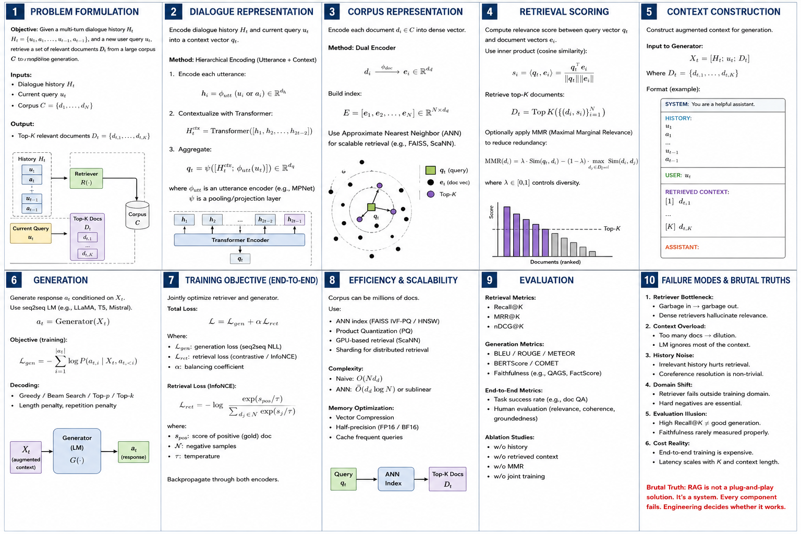
[
\boxed{\mathbf{R}=\text{source-reported mechanism}}
\qquad
\boxed{\mathbf{D}=\text{production synthesis/engineering extension}}
]

No threshold, coefficient, retry count, (k), or model is asserted as universally optimal. Every free parameter below is an **evaluation-selected hyperparameter**, not an invented constant.

---
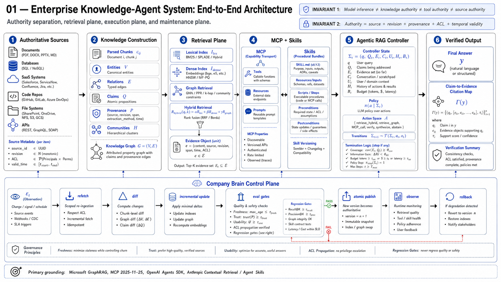
# Algorithm 1 — Provenance-Preserving Temporal Knowledge-Graph Construction

**Selected basis:** Standard Microsoft GraphRAG: LLM entity extraction, relationship extraction, optional claim extraction, entity/relationship summarization, hierarchical Leiden communities, community reports, embeddings. GraphRAG explicitly recommends Standard over FastGraphRAG when high-fidelity entities are required. ([Microsoft GitHub][1])

### Input

[
\mathcal D
==========

\left{
d_i=
\left(
x_i,,
u_i,,
r_i,,
t_i^{src},,
A_i,,
m_i
\right)
\right}_{i=1}^{N}
]

[
x_i:\text{content},\quad
u_i:\text{source identifier},\quad
r_i:\text{revision},\quad
A_i:\text{ACL}.
]

### Output

[
\mathcal K^{(v)}
================

\left(
G^{(v)},
\mathcal H^{(v)},
\mathcal P^{(v)},
I_{\text{dense}}^{(v)},
I_{\text{lex}}^{(v)}
\right)
]

[
G=(V,E),\qquad
\mathcal H=\text{hierarchical communities},\qquad
\mathcal P=\text{provenance ledger}.
]

### Initialize

[
V\leftarrow\varnothing,\qquad
E\leftarrow\varnothing,\qquad
\mathcal P\leftarrow\varnothing
]

[
I_{\text{dense}}\leftarrow\varnothing,\qquad
I_{\text{lex}}\leftarrow\varnothing.
]

### Procedure

| (l) | Transition                                                                                                                                                                   |                        |       |
| --: | ---------------------------------------------------------------------------------------------------------------------------------------------------------------------------- | ---------------------- | ----- |
|   1 | (\displaystyle h_i\leftarrow H!\left(\operatorname{Canonicalize}(x_i)\right))                                                                                                |                        |       |
|   2 | (\displaystyle h_i=h_i^{prev}\land r_i=r_i^{prev}\Rightarrow \operatorname{SKIP}(d_i))                                                                                       |                        |       |
|   3 | (\displaystyle X_i\leftarrow\operatorname{Parse}(x_i;m_i))                                                                                                                   |                        |       |
|   4 | (\displaystyle C_i=\operatorname{Chunk}*{\theta_c}(X_i)={c*{ij}}_{j=1}^{n_i})                                                                                                |                        |       |
|   5 | (\displaystyle c_{ij}=\left(z_{ij},u_i,r_i,[a_{ij},b_{ij}),A_i\right))                                                                                                       |                        |       |
|   6 | (\displaystyle \hat V_{ij},\hat E_{ij},\hat Q_{ij}\leftarrow F_{\theta}^{KG}(c_{ij};\Sigma_{KG})\quad[\mathbf R])                                                            |                        |       |
|   7 | (\displaystyle \hat V=\bigcup_{i,j}\hat V_{ij},\quad \hat E=\bigcup_{i,j}\hat E_{ij},\quad \hat Q=\bigcup_{i,j}\hat Q_{ij})                                                  |                        |       |
|   8 | (\displaystyle \mathcal C(m)=\operatorname{Candidates}!\left(m,V;\operatorname{ID},\operatorname{alias},\operatorname{type},\operatorname{embedding}\right)\quad[\mathbf D]) |                        |       |
|   9 | (\displaystyle p_\phi(v\equiv m)=F_{\phi}^{ER}(m,v,\operatorname{context}(m))\quad[\mathbf D])                                                                               |                        |       |
|  10 | (\displaystyle v^\star=\arg\max_{v\in\mathcal C(m)}p_\phi(v\equiv m))                                                                                                        |                        |       |
|  11 | (\displaystyle \max_v p_\phi(v\equiv m)<\tau_{ER}\Rightarrow v_m\leftarrow\operatorname{NEW}(m))                                                                             |                        |       |
|  12 | (\displaystyle \tau_{ER}\leftarrow\arg\max_{\tau}\operatorname{F}*{\beta}^{ER}(\mathcal D*{\mathrm{ER,val}}))                                                                |                        |       |
|  13 | (\displaystyle e_k=(v_s,r_k,v_o)\leftarrow\operatorname{Resolve}(\hat e_k))                                                                                                  |                        |       |
|  14 | (\displaystyle p_k=(u_i,r_i,c_{ij},[a,b),h_i))                                                                                                                               |                        |       |
|  15 | (\displaystyle E\leftarrow E\cup{(e_k,p_k)})                                                                                                                                 |                        |       |
|  16 | (\displaystyle q_k=\left(s_k,p_k,o_k,[t^{v0}_k,t^{v1}_k),[t^{s0}_k,t^{s1}_k)\right)\quad[\mathbf D])                                                                         |                        |       |
|  17 | (\displaystyle q_a\neq q_b\land P_a\neq P_b\Rightarrow {q_a,q_b}\subseteq Q)                                                                                                 |                        |       |
|  18 | (\displaystyle \neg\operatorname{Overwrite}(q_a,q_b))                                                                                                                        |                        |       |
|  19 | (\displaystyle \mathcal H\leftarrow\operatorname{HierarchicalLeiden}(G;\theta_L)\quad[\mathbf R])                                                                            |                        |       |
|  20 | (\displaystyle R_h\leftarrow F_{\theta}^{report}!\left(V_h,E_h,Q_h\right),\quad h\in\mathcal H\quad[\mathbf R])                                                              |                        |       |
|  21 | (\displaystyle e(c_{ij})\leftarrow f_{\psi}(c_{ij}))                                                                                                                         |                        |       |
|  22 | (\displaystyle I_{\text{dense}}\leftarrow\operatorname{ANN}\left({e(c_{ij})}\right))                                                                                         |                        |       |
|  23 | (\displaystyle I_{\text{lex}}\leftarrow\operatorname{BM25Index}\left({c_{ij}}\right))                                                                                        |                        |       |
|  24 | (\displaystyle \forall e\in E:\quad                                                                                                                                          | \operatorname{Prov}(e) | \ge1) |
|  25 | (\displaystyle \forall v\in V:\quad \operatorname{SchemaValid}(v)=1)                                                                                                         |                        |       |
|  26 | (\displaystyle \forall z:\quad A(z)\neq\varnothing)                                                                                                                          |                        |       |
|  27 | (\displaystyle \operatorname{Commit}(\mathcal K^{(v+1)})\iff \mathcal V_{KG}=1)                                                                                              |                        |       |

### Graph fact representation
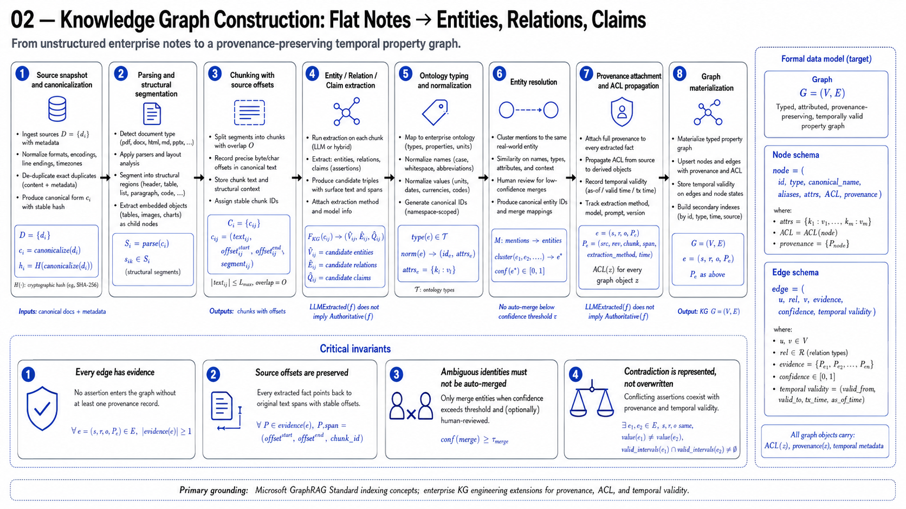
[
f_k=
\left(
s_k,,
r_k,,
o_k,,
P_k,,
[t_{valid}^{0},t_{valid}^{1}),,
[t_{sys}^{0},t_{sys}^{1})
\right)
]

[
\boxed{
f_k\in G
\Rightarrow
P_k\neq\varnothing
}
]

[
\boxed{
\text{LLM extraction}\neq\text{authoritative fact}
}
]

[
\boxed{
\text{extracted proposition}
+
\text{retrievable provenance}
+
\text{resolution}
\rightarrow
\text{graph assertion}
}
]

GraphRAG's present outputs explicitly include hierarchical Leiden communities; incremental runs also carry ingestion-period metadata. ([Microsoft GitHub][2])

---
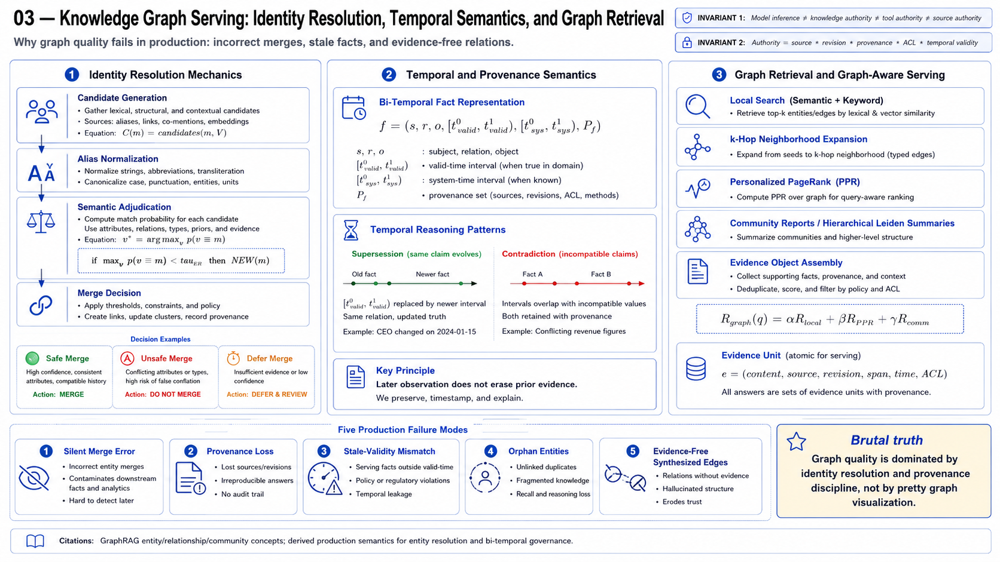
# Algorithm 2 — Capability-Negotiated MCP Execution Runtime

**Production baseline on July 26, 2026:** MCP `2025-11-25`. The `2026-07-28` specification remains a release candidate until July 28 and removes the initialization/session handshake, so production code should encapsulate lifecycle semantics behind a protocol adapter. ([blog.modelcontextprotocol.io][3])

### Input

[
\mathcal I=
(q,u,\mathcal S,\Pi,\mathcal B)
]

[
u=\text{principal},\qquad
\mathcal S={S_j}_{j=1}^{M},\qquad
\Pi=\text{authorization policy}.
]

### State

[
\Xi_t=
\left(
u,,
S,,
\nu,,
C,,
T,,
R,,
P,,
B_t,,
\tau_t
\right)
]

[
C=\text{negotiated capabilities},
\quad
T=\text{tools},
\quad
R=\text{resources},
\quad
P=\text{prompts}.
]

### Procedure

| (l) | Transition                                                                                                               |
| --: | ------------------------------------------------------------------------------------------------------------------------ |
|   1 | (\displaystyle S^\star\leftarrow\operatorname{RegistryResolve}(q,\mathcal S,\Pi))                                        |
|   2 | (\displaystyle \operatorname{Trusted}(S^\star)=0\Rightarrow\operatorname{DENY})                                          |
|   3 | (\displaystyle \nu_c,C_c,I_c\rightarrow\operatorname{initialize}(S^\star)\quad[\mathbf R])                               |
|   4 | (\displaystyle \nu_s,C_s,I_s\leftarrow\operatorname{initializeResponse}\quad[\mathbf R])                                 |
|   5 | (\displaystyle \nu^\star\in\nu_c\cap\nu_s)                                                                               |
|   6 | (\displaystyle C^\star=C_c\cap C_s\cap C_{\Pi})                                                                          |
|   7 | (\displaystyle \nu^\star=\varnothing\Rightarrow\operatorname{ABORT})                                                     |
|   8 | (\displaystyle \operatorname{notifications/initialized}\rightarrow S^\star\quad[\mathbf R])                              |
|   9 | (\displaystyle T\leftarrow\operatorname{tools/list}(S^\star))                                                            |
|  10 | (\displaystyle R\leftarrow\operatorname{resources/list}(S^\star))                                                        |
|  11 | (\displaystyle T_u={t\in T:\Pi(u,t,\operatorname{READ})\neq DENY})                                                       |
|  12 | (\displaystyle a_t=(t_t,\alpha_t)\sim\pi_\theta(\cdot\mid q,\Xi_t,T_u))                                                  |
|  13 | (\displaystyle t_t\notin T_u\Rightarrow o_t\leftarrow DENIED)                                                            |
|  14 | (\displaystyle \operatorname{JSONSchemaValid}(\alpha_t,\Sigma^{in}_{t_t})=0\Rightarrow o_t\leftarrow INVALID)            |
|  15 | (\displaystyle \rho_t=\operatorname{Risk}(u,t_t,\alpha_t,\Xi_t))                                                         |
|  16 | (\displaystyle d_t=\Pi(u,t_t,\alpha_t,\rho_t)\in{DENY,ALLOW,APPROVAL})                                                   |
|  17 | (\displaystyle d_t=DENY\Rightarrow o_t\leftarrow DENIED)                                                                 |
|  18 | (\displaystyle d_t=APPROVAL\land h_t=0\Rightarrow o_t\leftarrow PENDING)                                                 |
|  19 | (\displaystyle d_t=ALLOW\lor h_t=1\Rightarrow y_t\leftarrow\operatorname{tools/call}(t_t,\alpha_t))                      |
|  20 | (\displaystyle \operatorname{SchemaValid}(y_t,\Sigma^{out}_{t_t})=0\Rightarrow o_t\leftarrow INVALID_OUTPUT)             |
|  21 | (\displaystyle o_t\leftarrow\operatorname{Sanitize}(y_t))                                                                |
|  22 | (\displaystyle \Xi_{t+1}\leftarrow F(\Xi_t,a_t,o_t))                                                                     |
|  23 | (\displaystyle \tau_t\leftarrow(\operatorname{server},t_t,H(\alpha_t),H(y_t),d_t,\Delta t_t))                            |
|  24 | (\displaystyle \operatorname{retry}(a_t)\iff\operatorname{Retryable}(e_t)\land\operatorname{Idempotent}(a_t)\land B_t>0) |
|  25 | (\displaystyle B_{t+1}=B_t-\operatorname{cost}(a_t))                                                                     |
|  26 | (\displaystyle B_{t+1}\le0\Rightarrow\operatorname{STOP})                                                                |

### Authorization invariant

[
\boxed{
a_t\sim\pi_\theta
\not\Rightarrow
\operatorname{Execute}(a_t)
}
]

[
\boxed{
\operatorname{Execute}(a_t)
\iff
\Pi(u,a_t)\in{ALLOW,\operatorname{Approved}}
}
]

### Capability invariant

[
\boxed{
C_{\mathrm{runtime}}
====================

C_{\mathrm{client}}
\cap
C_{\mathrm{server}}
\cap
C_{\mathrm{policy}}
}
]

OpenAI's current Agents SDK exposes MCP integrations, filtering, approvals, sessions, guardrails, and tracing around the agent loop rather than equating model selection with authorization. ([OpenAI GitHub][4])
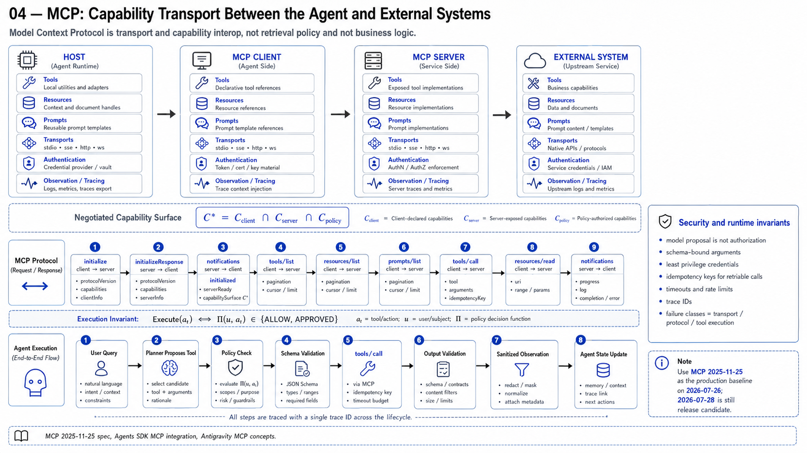
---

# Algorithm 3 — Version-Pinned Progressive-Disclosure Skill Runtime

OpenAI currently defines Skills as **versioned bundles containing `SKILL.md`**, while Anthropic loads metadata first, instructions only after selection, and supporting resources/scripts lazily. OpenAI additionally states that Skill content can affect planning/tool execution and must be treated as privileged, potentially untrusted instructions. ([OpenAI Developers][5])

### Skill object

[
S_i^{(v)}
=========

\left(
id_i,,
v,,
n_i,,
d_i,,
M_i,,
R_i,,
X_i,,
T_i,,
P_i,,
Q_i,,
H_i
\right)
]

[
M_i=\texttt{SKILL.md},
\quad
R_i=\text{references},
\quad
X_i=\text{executables}.
]

### Input

[
(q,u,\mathcal S,\mathcal T,\Pi,\Xi_0)
]

### Candidate generation

[
\mathcal S_u
============

{
S_i:
\operatorname{Authorized}(u,S_i)=1
}
]

[
m_i=
(n_i,d_i,\operatorname{path}_i)
]

[
\mathcal M=
{m_i:S_i\in\mathcal S_u}.
]

### Selection

[
S^\star
\sim
\pi_\theta(S\mid q,\mathcal M,\Xi_0)
]

subject to

[
\operatorname{Trust}(S^\star)=1
]

[
\operatorname{Pre}(S^\star,\Xi_0)=1
]

[
T_{S^\star}\cap T_u\neq\varnothing.
]

### Version resolution

[
v^\star=
\begin{cases}
v_{\text{pinned}}, & v_{\text{pinned}}\neq\varnothing\
v_{\text{default}}, & \text{otherwise}
\end{cases}
]

[
\boxed{
v^\star\neq\text{implicit latest}
}
\qquad[\mathbf D]
]

### Progressive disclosure

[
C_0=
C_{\text{sys}}
\oplus
C_{\text{user}}
\oplus
\mathcal M
]

[
S^\star\ \text{selected}
\Rightarrow
C_1=
C_0
\oplus
\operatorname{Read}(M_{S^\star})
]

[
r_j\in R_{S^\star}
\land
\operatorname{Needed}(r_j,t)
\Rightarrow
C_{t+1}=C_t\oplus\operatorname{Read}(r_j)
]

[
x_j\in X_{S^\star}
\land
\operatorname{Needed}(x_j,t)
\Rightarrow
o_j=\operatorname{Exec}(x_j)
]

[
C_{t+1}=C_t\oplus o_j
]

rather than

[
C_{t+1}
=======

C_t\oplus\operatorname{SourceCode}(x_j).
]

This matches Anthropic's metadata (\rightarrow) `SKILL.md` (\rightarrow) resource/script progressive-disclosure architecture. ([Claude Platform][6])

### Execution

| (l) | Transition                                                                                             |
| --: | ------------------------------------------------------------------------------------------------------ |
|   1 | (\displaystyle \mathcal M\leftarrow\operatorname{Metadata}(\mathcal S_u))                              |
|   2 | (\displaystyle S^\star\sim\pi_\theta(S\mid q,\mathcal M))                                              |
|   3 | (\displaystyle \operatorname{VerifyHash}(S^\star,v^\star)=0\Rightarrow ABORT)                          |
|   4 | (\displaystyle W\leftarrow\operatorname{ParseWorkflow}(\texttt{SKILL.md}_{S^\star,v^\star}))           |
|   5 | (\displaystyle W=(w_1,\ldots,w_n))                                                                     |
|   6 | (\displaystyle T_{\mathrm{eff}}=T_{S^\star}\cap T_u\cap T_{\mathrm{runtime}})                          |
|   7 | (\displaystyle T_{\mathrm{required}}\nsubseteq T_{\mathrm{eff}}\Rightarrow FAIL_{\mathrm{capability}}) |
|   8 | (\displaystyle \forall k:\operatorname{Pre}(w_k,\Xi_k)=1)                                              |
|   9 | (\displaystyle a_k\leftarrow\operatorname{Instantiate}(w_k,\Xi_k))                                     |
|  10 | (\displaystyle d_k\leftarrow\Pi(u,a_k))                                                                |
|  11 | (\displaystyle d_k=DENY\Rightarrow FAIL_{\mathrm{policy}})                                             |
|  12 | (\displaystyle o_k\leftarrow\operatorname{Execute}(a_k))                                               |
|  13 | (\displaystyle \Xi_{k+1}\leftarrow F(\Xi_k,a_k,o_k))                                                   |
|  14 | (\displaystyle \operatorname{Post}(w_k,\Xi_{k+1})=0\Rightarrow\operatorname{Recover}(w_k))             |
|  15 | (\displaystyle \operatorname{Recoverable}(w_k)=0\Rightarrow FAIL)                                      |
|  16 | (\displaystyle \bigwedge_{k=1}^{n}\operatorname{Post}(w_k,\Xi_{k+1})=1\Rightarrow SUCCESS)             |

### Privilege invariant

[
\boxed{
S^\star
\not\supset
\Pi
}
]

[
\boxed{
\operatorname{Instructions}(S^\star)
\not\Rightarrow
\operatorname{PrivilegeEscalation}
}
]

[
\boxed{
T_{\mathrm{skill}}
\cap
T_{\mathrm{authorized}}
\cap
T_{\mathrm{runtime}}
====================

T_{\mathrm{effective}}
}
]
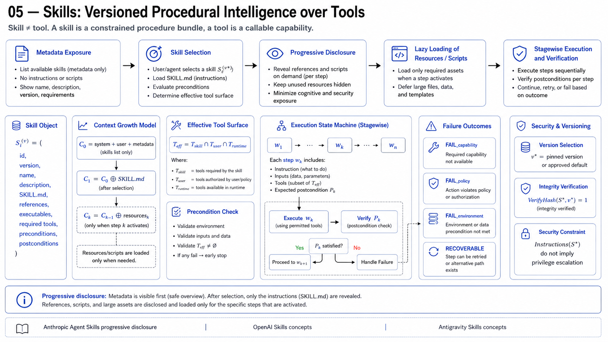
---

# Algorithm 4 — Contextual Hybrid Retrieval with Rank Fusion and Neural Reranking

Anthropic's measured configuration is the strongest directly source-grounded baseline here: contextualized chunks (\rightarrow) Contextual BM25 + contextual embeddings (\rightarrow) rank fusion (\rightarrow) reranking. Their experiments reported top-20 retrieval failure decreasing (5.7%\rightarrow2.9%) using contextual embeddings + BM25, and (5.7%\rightarrow1.9%) after reranking. Anthropic used 150 initial candidates and 20 after reranking in those experiments; these are experimental settings, **not universal constants**. ([Anthropic][7])

## Offline phase

### Input

[
D={d_i}_{i=1}^{N}.
]

### Structural chunking

[
C_i=\operatorname{Chunk}_{\theta_c}(d_i)
========================================

{c_{ij}}_{j=1}^{n_i}
]

[
c_{ij}
======

(x_{ij},u_i,r_i,A_i,s_{ij}).
]

### Contextualization

[
z_{ij}
======

F_{\theta}^{ctx}(d_i,c_{ij})
]

[
\tilde c_{ij}
=============

z_{ij}\oplus c_{ij}.
]

### Dense representation

[
v_{ij}
======

f_{\phi}^{emb}(\tilde c_{ij})
]

[
\bar v_{ij}
===========

\frac{v_{ij}}{|v_{ij}|_2}.
]

### Lexical representation

For term (w),

[
BM25(c,q)
=========

\sum_{w\in q}
IDF(w)
\frac{
f(w,c)(k_1+1)
}{
f(w,c)
+
k_1
\left(
1-b+b\frac{|c|}{\operatorname{avgdl}}
\right)
}.
]

### Index construction

[
I_D
===

\operatorname{ANN}
\left(
{(cid_{ij},\bar v_{ij},A_i)}
\right)
]

[
I_L
===

\operatorname{BM25Index}
\left(
{(cid_{ij},\tilde c_{ij},A_i)}
\right).
]

---

## Online phase

### Input

[
(q,u,K,B).
]

### Query representation

[
q_L=\operatorname{LexicalNormalize}(q)
]

[
q_D=f_{\phi}^{emb}(q)
]

[
\bar q_D=\frac{q_D}{|q_D|_2}.
]

Exact identifiers MUST survive normalization:

[
\operatorname{Identifier}(x)=1
\Rightarrow
x\in q_L.
]

### Hard authorization filter

[
F_u
===

{c:u\in ACL(c)}.
]

### Parallel candidate generation

[
L_q
===

\operatorname{TopK}_{K_L}
\left[
BM25(q_L,c)
\mid
c\in F_u
\right]
]

[
D_q
===

\operatorname{TopK}_{K_D}
\left[
\bar q_D^{\top}\bar v_c
\mid
c\in F_u
\right].
]

### Rank fusion

Because

[
BM25(q,c)\not\sim\cos(q,c),
]

raw score addition is undefined without score calibration.

Therefore

[
U_q=L_q\cup D_q
]

[
s_F(c)
======

\sum_{r\in{L,D}}
\frac{w_r}
{\kappa+\operatorname{rank}_r(c)}
]

[
C_F
===

\operatorname{TopK}_{K_F}
\left[
s_F(c)
\right].
]

[
(w_L,w_D,\kappa,K_L,K_D,K_F)
\leftarrow
\arg\max_{\Theta_R}
\operatorname{nDCG@K}
(\mathcal D_{\mathrm{retrieval,val}};\Theta_R).
]

No fixed fusion parameter is asserted.

### Neural reranking

[
s_R(q,c)
========

f_{\psi}^{cross}(q,c)
]

[
C_R
===

\operatorname{sort}_{c\in C_F}
s_R(q,c).
]

### Diversity-constrained context selection

[
C^\star
=======

\arg\max_{S\subseteq C_R}
\left[
\sum_{c\in S}s_R(q,c)
---------------------

\lambda
\sum_{\substack{c_i,c_j\in S\i\neq j}}
\operatorname{Redundancy}(c_i,c_j)
\right]
]

subject to

[
\sum_{c\in S}\operatorname{tokens}(c)\le B
]

[
|S|\le K
]

[
S\subseteq F_u.
]

### Retrieval output

[
R(q)
====

{
(c_i,
u_i,
r_i,
span_i,
s_L,
s_D,
s_F,
s_R)
}_{i=1}^{|C^\star|}.
]

### Critical invariant

[
\boxed{
ACL
\rightarrow
candidate\ generation
\rightarrow
fusion
\rightarrow
reranking
}
]

not

[
\boxed{
candidate\ generation
\rightarrow
LLM
\rightarrow
ACL.
}
]

Anthropic's source explicitly specifies parallel BM25/embedding retrieval, deduplication through rank fusion, and reranking of the candidate pool. ([Anthropic][7])
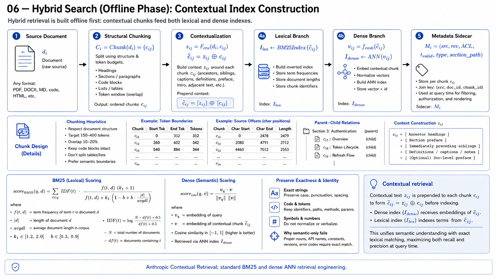
---

# Algorithm 5 — Budgeted Adaptive Agentic RAG with Evidence-State Verification

Selected synthesis:

[
\text{OpenAI Agent Loop}
+
\text{Anthropic Orchestrator/Workers}
+
\text{Self-RAG adaptive retrieval}
+
\text{CRAG retrieval evaluation}.
]

OpenAI's runtime iterates model/tool turns until an exit condition; Anthropic's Research system dynamically plans, parallelizes subagents, evaluates intermediate findings, performs additional retrieval when required, and executes a separate citation stage. Self-RAG establishes adaptive retrieval/critique; CRAG introduces explicit retrieval-quality evaluation and corrective acquisition. ([OpenAI GitHub][4])

### Input

[
\mathcal I
==========

(q,u,\mathcal R,\mathcal G,\mathcal T,\Pi,B_0)
]

[
\mathcal R=\text{hybrid retrieval},
\quad
\mathcal G=\text{graph retrieval},
\quad
\mathcal T=\text{MCP/tool surface}.
]

### Agent state

[
\Sigma_t
========

\left(
q,,
\mathcal Q_t,,
\mathcal E_t,,
\mathcal C_t,,
\mathcal U_t,,
\mathcal H_t,,
B_t
\right)
]

[
\mathcal Q_t=\text{evidence obligations}
]

[
\mathcal E_t=\text{evidence set}
]

[
\mathcal C_t=\text{supported claim set}
]

[
\mathcal U_t=\text{unsupported obligations}.
]

### Query decomposition

[
\mathcal Q_0
============

# F_{\theta}^{decompose}(q)

{q_1,\ldots,q_m}.
]

### Evidence object

[
e_j=
\left(
x_j,,
u_j,,
r_j,,
span_j,,
t_j,,
a_j,,
s_j
\right)
]

where

[
a_j=\text{authority metadata},
\qquad
s_j=\text{retrieval/verification state}.
]

### Action space

[
\mathcal A=
{
SEARCH_{hybrid},
SEARCH_{graph},
READ,
MCP,
SPAWN,
REFORMULATE,
VERIFY,
SYNTHESIZE,
ABSTAIN
}.
]

### Policy

[
a_t
\sim
\pi_\theta
\left(
a
\mid
q,
\mathcal Q_t,
\mathcal E_t,
\mathcal H_t,
B_t
\right).
]

### Retrieval decision

[
p_t^{ret}
=========

F_{\theta}^{need}
(q,\Sigma_t)
]

[
p_t^{ret}<\tau_{ret}
\Rightarrow
a_t\neq SEARCH
]

[
\tau_{ret}
\leftarrow
\arg\max_{\tau}
U_{\mathrm{task}}
(\mathcal D_{val};\tau).
]

This preserves Self-RAG's essential property:

[
\boxed{
\text{retrieval is adaptive}
\neq
\text{fixed top-}k\text{ on every query}.
}
]

### Parallel decomposition

Let dependency DAG

[
\mathcal D_Q=(\mathcal Q,\mathcal E_Q).
]

Independent frontier:

[
F_t
===

{
q_i\in\mathcal Q_t:
\operatorname{pred}(q_i)\subseteq\mathcal C_t
}.
]

Then

[
{o_i}*{q_i\in F_t}
\leftarrow
\operatorname{PARALLEL}
\left[
\pi*{\theta_i}(q_i)
\right].
]

Anthropic reports the orchestrator-worker architecture and parallel subagents/tool calls explicitly. ([Anthropic][8])

### Evidence admission

For (e_j),

[
r_j=
F_{\phi}^{rel}(q_i,e_j)
]

[
g_j=
F_{\phi}^{ground}(q_i,e_j)
]

[
a_j=
F^{authority}(source_j)
]

[
f_j=
F^{freshness}(t_q,t_j)
]

[
v_j=
F^{validity}(e_j).
]

Admit iff

[
\operatorname{Admit}(e_j)
=========================

\mathbf 1
[
r_j\ge\tau_r
\land
g_j\ge\tau_g
\land
v_j=1
\land
ACL(u,e_j)=1
].
]

### Corrective retrieval

Define retrieval-state evaluator

[
\rho_i
======

F_{\omega}^{retrieval}
(q_i,E_i)
\in
{CORRECT,AMBIGUOUS,INCORRECT}.
]

Then

[
\rho_i=CORRECT
\Rightarrow
E_i^{t+1}=E_i^t
]

[
\rho_i=AMBIGUOUS
\Rightarrow
q_i'
====

F_\theta^{rewrite}(q_i,E_i)
]

[
\rho_i=INCORRECT
\Rightarrow
\mathcal R_{t+1}
\neq
\mathcal R_t.
]

i.e.

[
SEARCH_{dense}
\rightarrow
SEARCH_{lexical}
]

or

[
SEARCH_{corpus}
\rightarrow
SEARCH_{graph}
]

or

[
SEARCH_{internal}
\rightarrow
MCP_{authoritative}.
]

This is preferable to

[
K\leftarrow 2K\leftarrow4K\leftarrow8K
]

without retrieval-quality diagnosis.

### Claim support

For proposed claim (c_i),

[
S(c_i)
======

\max_{e_j\in\mathcal E_t}
F_{\psi}^{entail}(e_j,c_i).
]

[
c_i\in\mathcal C_t
\iff
S(c_i)\ge\tau_s.
]

[
c_i\in\mathcal U_t
\iff
S(c_i)<\tau_s.
]

### Evidence coverage

[
Coverage_t
==========

\frac{
\sum_{i=1}^{m}
w_i
\mathbf 1[
q_i\in\mathcal C_t
]
}{
\sum_{i=1}^{m}w_i
}.
]

### Information-gain control

[
\Delta I_t
==========

## I(\mathcal Q;\mathcal E_{t+1})

I(\mathcal Q;\mathcal E_t).
]

### Budget dynamics

[
B_t=
\left(
B_t^{tok},
B_t^{tool},
B_t^{wall},
B_t^{cost},
B_t^{turn}
\right)
]

[
B_{t+1}
=======

B_t-
\Delta B(a_t).
]

### Termination

[
STOP_t
======

\mathbf 1
\left[
Coverage_t\ge\tau_C
\right]
\lor
\mathbf 1[\Delta I_t<\epsilon]
\lor
\mathbf 1[B_t\le0]
\lor
\mathbf 1[\operatorname{PolicyStop}=1].
]

### Generation

[
y
=

F_\theta^{gen}
\left(
q,,
\mathcal E_T^{verified}
\right)
]

subject to

[
\forall c_i\in Claims(y):
\quad
S(c_i)\ge\tau_s
\lor
c_i=\operatorname{Qualified}(c_i).
]

### Citation map

[
\Gamma:
Claims(y)
\rightarrow
2^{\mathcal E_T}
]

[
\Gamma(c_i)
===========

{e_j:e_j\models c_i}.
]

### Final verification

[
V(y)
====

\frac{
\sum_{c_i\in Claims(y)}
\mathbf 1[
\Gamma(c_i)\neq\varnothing
\land
F_{\psi}^{entail}(\Gamma(c_i),c_i)\ge\tau_s
]
}{
|Claims(y)|
}.
]

[
V(y)<\tau_V
\Rightarrow
y\leftarrow
\operatorname{RepairOrAbstain}(y).
]

### Core transition

[
\boxed{
\Sigma_t
\xrightarrow{\pi_\theta}
a_t
\xrightarrow{\mathcal E}
o_t
\xrightarrow{Verify}
\Sigma_{t+1}
}
]

[
\boxed{
Plan
\rightarrow
Retrieve
\rightarrow
Evaluate
\rightarrow
Correct
\rightarrow
Verify
\rightarrow
Synthesize
}
]

not

[
\boxed{
q\rightarrow TopK\rightarrow LLM.
}
]
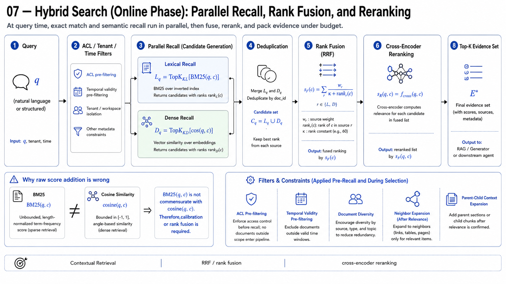
---

# Algorithm 6 — Versioned Enterprise Knowledge Control Plane / Company Brain

There is **no canonical OpenAI/Anthropic algorithm named “Company Brain.”** Treating the phrase as though it identified a published algorithm would be false.

The production construction below is therefore explicitly:

[
\mathbf D
=========

\text{GraphRAG incremental update}
+
\text{versioned sources}
+
\text{policy propagation}
+
\text{retrieval regression}
+
\text{agent traces/evals}
+
\text{atomic publication}.
]

GraphRAG currently exposes incremental `update`/`standard-update` workflows and separate update storage preserving previous outputs. OpenAI Agents SDK traces model turns, tool calls, guardrails, handoffs, and custom spans. ([Microsoft GitHub][9])

### Serving state

[
\mathbb B_t
===========

\left(
D_t,
G_t,
I_t^L,
I_t^D,
S_t,
M_t,
\Pi_t,
E_t,
\Omega_t
\right)
]

where

[
D_t=\text{source snapshots}
]

[
G_t=\text{knowledge graph}
]

[
S_t=\text{Skill registry}
]

[
M_t=\text{MCP registry}
]

[
E_t=\text{evaluation suite}
]

[
\Omega_t=\text{observability state}.
]

### Change event

[
\epsilon_k
==========

\left(
src_k,
id_k,
op_k,
rev_k,
t_k,
principal_k
\right)
]

[
op_k\in
{
CREATE,
UPDATE,
DELETE,
ACL,
SCHEMA,
SKILL,
TOOL
}.
]

### Authoritative refresh

[
x_k^{new}
=========

\operatorname{FetchAuthoritative}
(src_k,id_k,rev_k).
]

[
h_k^{new}=H(\operatorname{Canonicalize}(x_k^{new}))
]

[
h_k^{new}=h_k^{old}
\Rightarrow
\Delta_k=\varnothing.
]

### Versioned diff

[
C^{old}={c_i^{old}}
]

[
C^{new}={c_j^{new}}
]

[
\Delta C
========

\left(
C^+,
C^-,
C^\Delta,
C^=
\right).
]

[
C^+=C^{new}\setminus C^{old}
]

[
C^-=C^{old}\setminus C^{new}.
]

Stable identities:

[
c_i^{old}\equiv c_j^{new}
\Rightarrow
ID(c_i^{old})=ID(c_j^{new}).
]

### Incremental recomputation

[
I_{t+1}^{D}
===========

## I_t^{D}

## Emb(C^-)

Emb(C^\Delta_{old})
+
Emb(C^+)
+
Emb(C^\Delta_{new})
]

[
I_{t+1}^{L}
===========

## I_t^{L}

## Lex(C^-)

Lex(C^\Delta_{old})
+
Lex(C^+)
+
Lex(C^\Delta_{new}).
]

### Graph delta

[
\Delta G_k
==========

KGBuilder(C^+\cup C^\Delta_{new})
]

[
G'_{t+1}
========

MergeTemporal
\left(
G_t,
\Delta G_k
\right).
]

### Supersession

For fact identity

[
\iota(f)
========

(s,r,o,\operatorname{scope}(f)),
]

if

[
\iota(f_a)=\iota(f_b)
\land
t_b>t_a
\land
f_b\neq f_a,
]

then

[
t_{valid,end}(f_a)
\leftarrow
t_{valid,start}(f_b)
]

without

[
DELETE(f_a).
]

### ACL propagation

[
A_{t+1}(c)
==========

A_{src,t+1}(c).
]

[
A_{t+1}(v)
==========

\bigvee_{p\in Prov(v)}
A_{t+1}(p).
]

[
A_{t+1}(e)
==========

A_{t+1}(Prov(e)).
]

[
ACL_CHANGE
\Rightarrow
\operatorname{Invalidate}
\left(
I^D,I^L,G,Cache,AnswerCache
\right)
]

before

[
\operatorname{Serve}(B'_{t+1}).
]

### Candidate build

[
\mathbb B'_{t+1}
================

F_{update}
(\mathbb B_t,\epsilon_k).
]

### Offline quality vector

[
Q(B)
====

\left[
Recall@K,
nDCG@K,
MRR,
CitationPrecision,
CitationRecall,
Groundedness,
TaskSuccess,
ToolAccuracy,
p95,
p99,
Cost
\right].
]

### Security vector

[
S(B)
====

\left[
ACLViolation,
UnauthorizedTool,
PolicyBypass,
InjectionSuccess,
DataExfiltration
\right].
]

### Regression vector

[
\Delta Q
========

## Q(\mathbb B'_{t+1})

Q(\mathbb B_t).
]

### Publication predicate

[
\mathcal A(\mathbb B'_{t+1})
============================

\mathbf 1[
SchemaValid
]
\cdot
\mathbf 1[
GraphIntegrity
]
\cdot
\mathbf 1[
RetrievalGate
]
\cdot
\mathbf 1[
GroundingGate
]
\cdot
\mathbf 1[
AgentGate
]
\cdot
\mathbf 1[
SecurityGate
].
]

[
\operatorname{Publish}(\mathbb B'*{t+1})
\iff
\mathcal A(\mathbb B'*{t+1})=1.
]

### Atomic publication

[
p_{serve}
:
\mathbb B_t
\rightarrow
\mathbb B_{t+1}.
]

[
\boxed{
\operatorname{CAS}
(p_{serve},
v_t,
v_{t+1})
}
]

rather than

[
\boxed{
\operatorname{MutateInPlace}(\mathbb B_t).
}
]

### Rollback

[
M_{online}(\mathbb B_{t+1})
\notin
\mathcal SLO
\Rightarrow
p_{serve}\leftarrow v_t.
]

### Trace state

[
\tau_j=
\left(
request_j,
model_j,
brain_version_j,
skill_version_j,
toolcalls_j,
retrieval_j,
guardrails_j,
citations_j,
latency_j,
tokens_j,
cost_j
\right).
]

This aligns with the event types represented in OpenAI's current tracing system—model generations, tools, guardrails, handoffs, and custom spans. ([OpenAI GitHub][10])
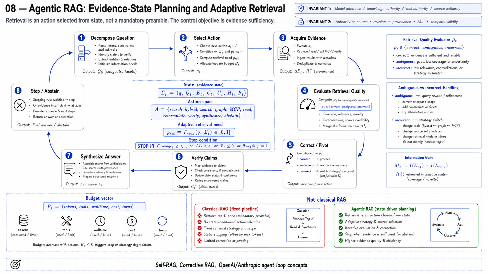
---
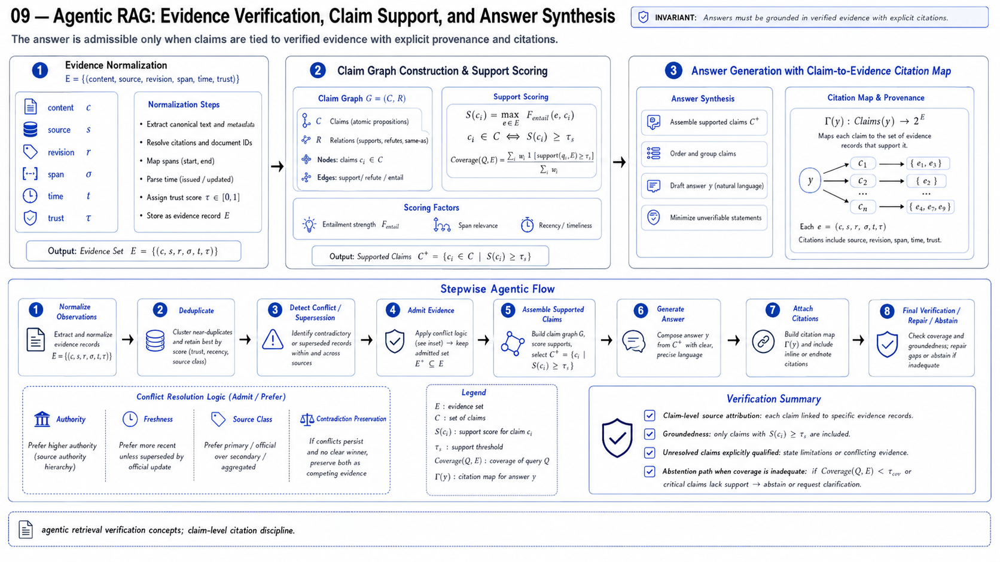
# End-to-End Composite Algorithm

[
\boxed{
\mathcal D
\xrightarrow[\text{Alg.1}]{KG}
\mathcal K^{(v)}
\xrightarrow[\text{Alg.6}]{publish}
\mathbb B_v
}
]

For request

[
r_0=(q,u,\tau_0),
]

construct authorized serving surface

[
\mathcal T_u
============

\mathcal T_{MCP}
\cap
\Pi_u
]

[
\mathcal S_u
============

\mathcal S
\cap
\Pi_u.
]

Skill selection:

[
S^\star
\leftarrow
\operatorname{Alg3}(q,u,\mathcal S_u).
]

Agent state:

[
\Sigma_0
========

\operatorname{InitAgent}
(q,S^\star,\mathbb B_v).
]

For

[
t=0,\ldots,T_{\max}-1:
]

[
a_t
\sim
\pi_\theta
(a\mid\Sigma_t)
]

[
o_t=
\begin{cases}
\operatorname{Alg4}(q_t),&
a_t=RETRIEVE_{hybrid}
[2mm]
\operatorname{GraphSearch}(G_v,q_t),&
a_t=RETRIEVE_{graph}
[2mm]
\operatorname{Alg2}(a_t),&
a_t=MCP
[2mm]
\operatorname{Worker}(q_t),&
a_t=SPAWN
\end{cases}
]

[
e_t
===

\operatorname{NormalizeEvidence}(o_t)
]

[
e_t^{+}
=======

\operatorname{Verify}(e_t)
]

[
\Sigma_{t+1}
============

F(\Sigma_t,e_t^{+}).
]

Terminate iff

[
\operatorname{Coverage}(\Sigma_t)\ge\tau_C
]

or

[
\Delta I_t<\epsilon
]

or

[
t=T_{\max}
]

or

[
B_t\le0
]

or

[
PolicyStop_t=1.
]

Generate:

[
y^\star
=======

\arg\max_y
P_\theta
\left(
y
\mid
q,
E_T^{verified},
S^\star
\right)
]

subject to

[
\forall c\in Claims(y^\star):
\quad
\exists e\in E_T^{verified}
:
e\models c
]

or

[
c\in Claims(y^\star)
\Rightarrow
\operatorname{UncertaintyTagged}(c).
]

Therefore the serving contract is

[
\boxed{
q
\rightarrow
Skill
\rightarrow
Plan
\rightarrow
{
Hybrid,\ KG,\ MCP,\ Subagent
}
\rightarrow
Evidence
\rightarrow
Verification
\rightarrow
Citation
\rightarrow
y
}
]

with independent maintenance:

[
\boxed{
SourceChange
\rightarrow
Diff
\rightarrow
IncrementalReindex
\rightarrow
TemporalMerge
\rightarrow
Eval
\rightarrow
AtomicPublish
\rightarrow
Observe
\rightarrow
Rollback
}
]

and the non-negotiable system invariant

[
\boxed{
\text{Model inference}
\neq
\text{retrieval authority}
\neq
\text{tool authority}
\neq
\text{knowledge authority}.
}
]

[
\boxed{
\text{Knowledge authority}
==========================

\text{source}
+
\text{version}
+
\text{provenance}
+
\text{authorization}
+
\text{temporal validity}.
}
]
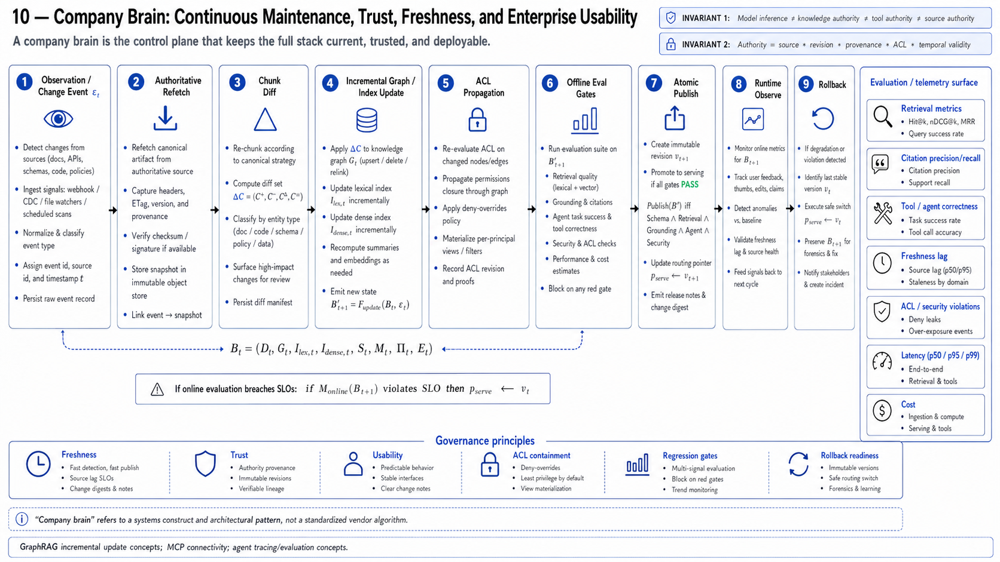
[1]: https://microsoft.github.io/graphrag/index/overview/?utm_source=chatgpt.com "Overview - GraphRAG"
[2]: https://microsoft.github.io/graphrag/index/outputs/?utm_source=chatgpt.com "Outputs - GraphRAG"
[3]: https://blog.modelcontextprotocol.io/posts/2026-07-28-release-candidate/?utm_source=chatgpt.com "The 2026-07-28 MCP Specification Release Candidate | Model Context Protocol Blog"
[4]: https://openai.github.io/openai-agents-python/?utm_source=chatgpt.com "OpenAI Agents SDK"
[5]: https://developers.openai.com/api/docs/guides/tools-skills "Skills | OpenAI API"
[6]: https://platform.claude.com/docs/en/agents-and-tools/agent-skills/overview?fcdaa149_sort_date=desc&method=individual&utm_source=chatgpt.com "Agent Skills - Claude Platform Docs"
[7]: https://www.anthropic.com/engineering/contextual-retrieval "Contextual Retrieval in AI Systems \ Anthropic"
[8]: https://www.anthropic.com/engineering/multi-agent-research-system "How we built our multi-agent research system \ Anthropic"
[9]: https://microsoft.github.io/graphrag/cli/?utm_source=chatgpt.com "CLI - GraphRAG"
[10]: https://openai.github.io/openai-agents-python/tracing/?utm_source=chatgpt.com "Tracing - OpenAI Agents SDK"
