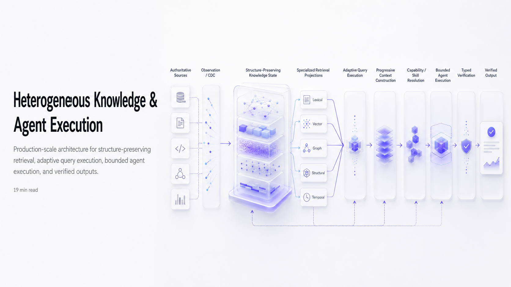

# Production-Scale Heterogeneous Knowledge and Agent Execution Platform



---

## Abstract

This report specifies an end-to-end production architecture for reasoning over heterogeneous enterprise information while preserving the native semantics of structured databases, semi-structured records, documents, source code, event streams, workflow state, and institutional knowledge.

The system is explicitly **not** designed as:

[
\text{documents}\rightarrow\text{chunks}\rightarrow\text{vector DB}\rightarrow\text{LLM}.
]

The production architecture is:

[
\boxed{
\begin{aligned}
\text{Authoritative Sources}
&\rightarrow
\text{Observation/CDC}\
&\rightarrow
\text{Versioned Heterogeneous Knowledge State}\
&\rightarrow
\text{Specialized Retrieval Projections}\
&\rightarrow
\text{Adaptive Query Execution}\
&\rightarrow
\text{Progressive Context Construction}\
&\rightarrow
\text{Capability/Skill Resolution}\
&\rightarrow
\text{Bounded Agent Execution}\
&\rightarrow
\text{Typed Verification}\
&\rightarrow
\text{Verified Output}\
&\rightarrow
\text{Production Evidence}\
&\rightarrow
\text{Eval-Gated Improvement}.
\end{aligned}}
]

The system is decomposed into independent **client, control, data, serving, execution, verification, and evaluation planes**. Heterogeneous knowledge is retained in structure-preserving intermediate representations rather than collapsed prematurely into textual chunks. Lexical indexes, dense ANN indexes, knowledge graphs, structural indexes, temporal indexes, and native database engines are treated as workload-specific access paths rather than competing stores of truth.

Selection of a methodology is based on Pareto dominance under the target workload rather than claims of universal algorithmic superiority.

---

# 1. Design Objective

Let a workload be:

[
W=
(
D,
Q,
U,
T,
R,
B,
S
)
]

where

[
\begin{aligned}
D &= \text{data distribution and modalities},\
Q &= \text{query distribution},\
U &= \text{update distribution},\
T &= \text{traffic profile},\
R &= \text{reliability requirements},\
B &= \text{compute/storage/token budget},\
S &= \text{security and isolation requirements}.
\end{aligned}
]

The platform must determine architecture parameters

[
\Theta^*
========

\arg\max_{\Theta}
J(\Theta;W)
]

with

[
J=
w_qQ_{\text{correct}}
+w_rR_{\text{retrieval}}
+w_fF_{\text{fresh}}
+w_aA_{\text{availability}}
---------------------------

## w_lL_{p99}

## w_cC_{\text{compute}}

## w_mM_{\text{memory}}

w_sS_{\text{storage}}.
]

Subject to hard constraints:

[
\begin{aligned}
ACLLeakRate &=0,\
UnauthorizedExecutionRate &=0,\
UnsupportedClaimRate &\le \epsilon_h,\
P99Latency &\le L_{\max},\
Availability &\ge A_{\min},\
RecoveryTime &\le RTO,\
RecoveryPointLoss &\le RPO.
\end{aligned}
]

Therefore, the architecture does not define one universally optimal ANN index, graph representation, datastore, chunk size, retriever, reranker, or agent topology.

It defines the machinery required to **measure and select the optimal operator for a particular workload**.

---

# 2. Evidence Classification

Architectural claims are divided into four classes.

**Reported** — explicitly described by a production system, official implementation, specification, or research result.

**Derived** — follows from reported behavior or systems reasoning but is not claimed by the source itself.

**Selected** — architecture choice adopted here after evaluating trade-offs.

**Conditional** — selected only when workload conditions satisfy explicit criteria.

This distinction prevents production recommendations from being presented as externally proven facts when they are engineering derivations.

---

# 3. Core Architectural Invariants

## 3.1 Source-of-truth invariant

[
\boxed{
\text{Authoritative source state}
\neq
\text{retrieval projection}
}
]

A vector index, BM25 index, graph, embedding store, cache, or model-generated summary is never authoritative organizational truth.

---

## 3.2 Structure-preservation invariant

For source object (x),

[
I(x)=
I_{\text{content}}
+
I_{\text{structure}}
+
I_{\text{relation}}
+
I_{\text{temporal}}
+
I_{\text{provenance}}
+
I_{\text{authorization}}.
]

Ingestion must avoid transformations that irreversibly eliminate:

[
I_{\text{structure}},\quad
I_{\text{relation}},\quad
I_{\text{temporal}}.
]

---

## 3.3 Projection invariant

For canonical knowledge state (K_v),

[
P_j^v=\Phi_j(K_v;\theta_j).
]

Therefore lexical, vector, graph, temporal, lineage, and structural indexes are **reconstructible materialized projections**.

---

## 3.4 Execution-state invariant

[
\boxed{
\text{Worker-local state}\neq\text{system truth}.
}
]

Agent workers must be restartable from durable external state.

OpenAI's Symphony architecture follows this model by using external task state, isolated workspaces, bounded concurrency, retries, and reconciliation rather than treating agent sessions as the authoritative workflow state.

---

## 3.5 Evidence-mutation invariant

[
\boxed{
\text{production evidence is immutable;}
\quad
\text{candidate fixes are mutable}.
}
]

OpenAI's Tax AI architecture separates a writable worktree from read-only production traces and source artifacts during automated improvement tasks.

---

## 3.6 Deterministic-boundary invariant

Infrastructure governs:

[
authorization,
budgets,
leases,
timeouts,
retries,
concurrency,
dependencies,
state\ transitions,
promotion,
rollback.
]

Models govern:

[
reasoning,
planning,
query\ reformulation,
evidence\ synthesis,
tool\ selection
]

only inside those deterministic boundaries.

---

# 4. Plane Decomposition

```text
CLIENT PLANE
     │
     ▼
CONTROL / POLICY PLANE
     │
     ├───────────────────────────────────────────────┐
     ▼                                               ▼
DATA PLANE                                    EVALUATION PLANE
     │                                               ▲
     ▼                                               │
SERVING / CAPABILITY PLANE                           │
     │                                               │
     ▼                                               │
EXECUTION PLANE ────────────────► VERIFICATION PLANE┘
     │
     ▼
 VERIFIED OUTPUT
```

The planes scale independently and communicate through versioned contracts.

---

# 5. Data Plane

## 5.1 Data-class ontology

The data substrate contains five semantically distinct classes:

[
\mathcal D=
\mathcal D_{SoR}
\cup
\mathcal D_K
\cup
\mathcal D_C
\cup
\mathcal D_X
\cup
\mathcal D_E.
]

### Systems of record

[
\mathcal D_{SoR}
]

contains:

* OLTP databases;
* warehouses and lakehouses;
* Git repositories;
* object stores;
* APIs;
* document systems;
* messaging systems;
* workflow systems;
* telemetry/event systems.

### Knowledge state

[
\mathcal D_K
]

contains:

* normalized metadata;
* lineage;
* structural IR;
* code semantics;
* entity mappings;
* temporal assertions;
* validated memory;
* retrieval projections.

### Runtime context

[
\mathcal D_C
]

contains query-scoped:

* retrieved evidence;
* runtime observations;
* selected skills;
* selected tools;
* active task state;
* temporary artifacts.

### Execution state

[
\mathcal D_X
]

contains:

[
Task,\ Lease,\ Workspace,\ Checkpoint,\ Budget,\ ToolState.
]

### Improvement evidence

[
\mathcal D_E
]

contains:

[
Trace,\ Correction,\ Failure,\ Eval,\ Golden,\ Regression,\ Canary.
]

These classes must have independent retention, consistency, authorization, indexing, and write policies.

---

# 6. Storage-Engine Selection

A single datastore is not selected for all state.

Define workload vector:

[
w=
(
r/w,
partitionability,
consistency,
query\ algebra,
latency,
volume,
update\ rate
).
]

Then:

[
Store^*(w)=
\arg\min_s Cost(s,w)
]

subject to reliability and latency constraints.

OpenAI's PostgreSQL deployment provides an instructive production example: read-heavy workloads continue to use an unsharded PostgreSQL primary with nearly 50 geographically distributed replicas, while horizontally partitionable write-heavy workloads are moved to sharded stores. OpenAI reports millions of QPS under this workload topology.

Accordingly:

| State                                | Preferred primitive                 |
| ------------------------------------ | ----------------------------------- |
| strongly transactional control state | relational OLTP                     |
| partitionable high-write state       | sharded KV / distributed relational |
| immutable artifacts                  | object storage                      |
| events                               | append-only distributed log         |
| retrieval text                       | inverted index                      |
| semantic vectors                     | ANN index                           |
| relational/provenance traversal      | graph/adjacency representation      |
| analytics                            | columnar warehouse/lakehouse        |
| trace analytics                      | OLAP/object storage                 |
| ephemeral hot state                  | distributed cache                   |

The rule is:

[
\boxed{
\text{polyglot persistence}
+
\text{single authoritative owner per datum}.
}
]

---

# 7. Source Observation Pipeline

Sources are observed incrementally rather than periodically reconstructed wholesale.

```text
SOURCE
  │
  ▼
CONNECTOR / ADAPTER
  │
  ├─ WAL / CDC
  ├─ commit/tree
  ├─ ETag/revision
  ├─ object checksum
  ├─ partition/offset
  └─ API version
  │
  ▼
IMMUTABLE OBSERVATION LOG
```

Observation:

[
o_t=
(
source,
object,
version,
hash,
event,
ACL,
metadata,
event_time,
observed_time
).
]

The log is append-only.

State is reconstructed:

[
State_t=
Fold(o_1,\ldots,o_t).
]

This provides deterministic replay, forensic analysis, incremental projection construction, and rollback support.

---

# 8. Content Addressing and Incremental Computation

For normalized object (x_i):

[
h_i=H(x_i).
]

For hierarchical state:

[
h_p=
H(
h_1\Vert h_2\Vert\cdots\Vert h_k
).
]

Knowledge-version roots form:

[
R_v=Merkle(K_v).
]

Change detection becomes:

[
\Delta_v=
Diff(R_v,R_{v+1}).
]

Only divergent objects undergo:

[
parse
\rightarrow enrich
\rightarrow embed
\rightarrow index.
]

Cursor reports using Merkle-tree divergence to identify changed portions of repositories, and index reuse reduced reported P99 time-to-first-query from 4.03 hours to 21 seconds for its measured repository population.

For (N) objects and (k\ll N) updates:

[
T_{\text{full}}=O(N)
]

versus approximately:

[
T_{\Delta}
==========

O(k\log N)
+
O(kC_{\text{transform}}).
]

**Selected:** content-addressed incremental materialization is therefore the default update architecture.

---

# 9. Heterogeneous Structural Intermediate Representation

## 9.1 Structured sources

Rows are not transformed into generic text unless retrieval requires a textual representation.

Retain:

[
IR_S=
(
schema,
types,
PK/FK,
constraints,
statistics,
lineage,
owners,
semantics,
query\ patterns
).
]

Values remain in the native execution system.

An analytical request:

[
SUM(revenue)\ GROUP\ BY\ region
]

should use the relational engine rather than approximate vector retrieval.

---

# 10. Unstructured document representation

A document is represented as a structured hierarchy:

[
D=(V_D,E_D)
]

with nodes:

[
Document
\rightarrow Chapter
\rightarrow Section
\rightarrow
{Paragraph,Table,Figure,Equation,List}.
]

Retrieval unit:

[
u_i=
(
content,
path,
heading,
parent,
siblings,
page,
layout,
source,
version
).
]

A token window may be derived from this representation but is not canonical.

---

# 11. Code Representation

Code requires additional structure:

[
IR_C=
(
AST,
symbols,
definitions,
references,
imports,
types,
callgraph,
tests,
commit\ history
).
]

Maintain separate projections:

[
P_{\text{lexical}}(IR_C),
\quad
P_{\text{semantic}}(IR_C),
\quad
P_{\text{symbol}}(IR_C),
\quad
P_{\text{dependency}}(IR_C).
]

Cursor reports semantic search improving response accuracy by 12.5% on average in its evaluation while still maintaining exact text retrieval, supporting complementary exact and semantic access rather than replacing one with the other.

---

# 12. Event and Temporal Representation

Operational events become state transitions:

[
e_t=
(
entity,
operation,
s_{before},
s_{after},
valid_t,
observed_t
).
]

Bitemporal knowledge records:

[
T=
(
valid_{from},
valid_{to},
observed_{from},
observed_{to}
).
]

This distinguishes:

[
\text{when something was true}
]

from:

[
\text{when the system learned it}.
]

Without this separation, historical enterprise questions become semantically ill-defined.

---

# 13. Provenance and Authorization

Every evidence object carries:

[
E_i=
(
EvidenceID,
SourceID,
SourceVersion,
ContentHash,
ACL,
Provenance,
TemporalState,
StructureRef
).
]

ACL propagation occurs during ingestion and is revalidated during retrieval.

Authorization must satisfy:

[
CanRead(p,e)=1
]

before evidence is admitted to candidate generation, context construction, caching, graph traversal, or answer citation.

Cross-tenant filtering cannot be deferred to generation.

---

# 14. Semantic Knowledge Construction

The architecture uses six independent context channels inspired by OpenAI's production data-agent architecture.

OpenAI describes a context stack based on table usage, human annotations, Codex-derived enrichment, institutional knowledge, memory, and runtime context. It retrieves relevant stored knowledge at query time and performs live queries where current data is needed.

The production representation generalizes those layers.

---

## 14.1 Channel C1 — structural and usage semantics

[
C_1=
{
schema,
types,
lineage,
usage,
historical\ queries,
join\ patterns
}.
]

Historical behavior is treated as a prior, not truth.

---

## 14.2 Channel C2 — authoritative human semantics

[
C_2=
(
definition,
owner,
scope,
caveat,
authority,
validity,
provenance
).
]

Annotations are versioned facts rather than raw prose.

---

## 14.3 Channel C3 — code-derived semantics

[
C_3=
\Phi_{\text{code}}
(
SQL,
Python,
Spark,
DAG,
config
).
]

Extract:

[
dependency,
filter,
join,
transformation,
freshness,
granularity,
null\ semantics,
business\ rule.
]

OpenAI identifies code as a critical source of table meaning when metadata is insufficient.

---

## 14.4 Channel C4 — institutional knowledge

[
C_4=
Docs
\cup Messages
\cup RFCs
\cup ADRs
\cup Incidents
\cup Tickets.
]

Every source is assigned:

[
Authority(d),\quad Status(d),\quad Validity(d).
]

Example status:

[
{
canonical,
approved,
draft,
historical,
superseded
}.
]

---

## 14.5 Channel C5 — validated memory

Memory object:

[
m=
(
statement,
scope,
evidence,
confidence,
created,
validated,
expires,
supersedes
).
]

Promotion requires:

[
Novel
\land
Useful
\land
Supported
\land
Authorized.
]

A model output does not directly become persistent memory.

---

## 14.6 Channel C6 — runtime observation

Runtime context performs live inspection:

[
C_6(t)=
{
current\ schema,
current\ values,
workflow\ state,
deployment,
metrics,
service\ state
}_t.
]

OpenAI describes issuing live warehouse queries when static context is absent or stale, and consulting metadata services, Airflow, and Spark for current platform state.

Therefore:

[
\boxed{
C_{1..5}=\text{persisted semantic context}
}
]

while

[
\boxed{
C_6=\text{current observation}.
}
]

---

# 15. Versioned Knowledge State

After structural parsing, provenance, temporalization, semantic enrichment, and memory validation:

[
K_v=
(
IR_S,
IR_D,
IR_C,
IR_E,
Entities,
Claims,
Lineage,
ACL,
Memory,
Manifest_v
).
]

The manifest pins:

[
Manifest_v=
(
parser_v,
schema_v,
ontology_v,
linker_v,
memory_v,
ACL_v
).
]

The full production serving state extends this to:

[
S_v=
(
K_v,
Lex_v,
ANN_v,
Graph_v,
Struct_v,
Temporal_v,
RetrievalPolicy_v
).
]

---

# 16. Projection Factory

Specialized projections are created from (K_v).

```text
                   K_v
                    │
      ┌─────────────┼─────────────┐
      ▼             ▼             ▼
  lexical         dense        relational
      │             │             │
 inverted        ANN graph     provenance KG
 phrase          vectors       dependencies
 n-gram                        temporal links
      │             │             │
      └─────────────┼─────────────┘
                    ▼
              structural/
               lineage index
```

All projections retain `EvidenceID` backreferences.

---

# 17. Sparse Retrieval

Sparse retrieval is selected for:

[
identifiers,
error\ codes,
symbols,
names,
literals,
exact\ phrases,
rare\ terminology.
]

An inverted index converts full scanning:

[
O(NL)
]

toward candidate access proportional to posting-list size:

[
O(|Posting(q)|).
]

This is generally superior for exact lexical signals because semantic embeddings deliberately collapse lexical distinctions.

---

# 18. Dense Semantic Retrieval

Dense search targets semantic equivalence:

[
q\rightarrow e_q,
\qquad
d_i\rightarrow e_i
]

with similarity:

[
s_i=
sim(e_q,e_i).
]

ANN technology is not fixed.

Selection:

[
ANN^*
=====

f(
N,
d,
RAM,
SSD,
QPS,
updateRate,
recall,
latency
).
]

For high-scale SSD-oriented workloads, DiskANN is a strong candidate: Microsoft's original evaluation demonstrated billion-point indexing on a 64 GB RAM workstation and reported more than 5,000 QPS, under 3 ms mean latency, and greater than 95% 1-recall@1 on SIFT1B under the reported hardware configuration.

This does **not** imply DiskANN dominates HNSW for small, memory-resident, update-heavy indexes.

It demonstrates why ANN selection must be workload dependent.

---

# 19. Graph Projection

Graph nodes may include:

[
{
Source,
Document,
Table,
Column,
Symbol,
Service,
Pipeline,
Team,
Metric,
Claim,
Incident,
Deployment
}.
]

Relationships retain source evidence.

For claim:

[
c=(s,p,o,evidence,time).
]

Conflicting claims remain independent:

[
c_a
\xrightarrow{contradicts}
c_b.
]

Graph construction itself must be cost-aware. Microsoft GraphRAG documents two substantially different indexing strategies: its standard pipeline uses LLM-based entity and relation extraction, while FastGraphRAG replaces much of that processing with cheaper NLP/co-occurrence techniques; Microsoft estimates graph extraction at roughly 75% of standard indexing cost.

Therefore graph construction is conditional.

Use rich graph extraction when:

[
Value_{\text{relations}}>Cost_{\text{construction}}.
]

---

# 20. Atomic Publication

A candidate state:

[
S_{v+1}^{candidate}
]

is fully constructed before becoming active.

```text
K_(v+1)
   ├── Lex_(v+1)
   ├── ANN_(v+1)
   ├── Graph_(v+1)
   ├── Struct_(v+1)
   └── Temporal_(v+1)
              │
              ▼
         VALIDATION
              │
              ▼
           CANARY
          /      \
       PASS      FAIL
        │          │
        ▼          ▼
     PROMOTE    QUARANTINE
```

Promotion:

[
ACTIVE:S_v
\rightarrow
S_{v+1}.
]

No request may combine:

[
Lex_{v+1},
ANN_v,
Graph_{v-2}.
]

This guarantees reproducibility.

---

# 21. Query Ingress and Admission

Input envelope:

[
Q=
(
query,
principal,
tenant,
session,
deadline,
budget,
outputContract
).
]

Pipeline:

[
AuthN
\rightarrow
AuthZ
\rightarrow
TenantPolicy
\rightarrow
Quota
\rightarrow
DeadlineAdmission
\rightarrow
PriorityClass.
]

Traffic classes must be isolated.

[
P=
{
interactive,
agent,
evaluation,
background
}.
]

OpenAI reports separating high- and low-priority database workloads onto separate instances to avoid noisy-neighbor degradation.

The same principle should apply to retrieval, LLM serving, reranking, embeddings, background indexing, and evaluation.

---

# 22. Query Topology Classification

Every request is classified:

[
z=
f(q,
entities,
operators,
temporalIntent,
aggregationIntent,
relationshipIntent).
]

Classes:

[
z\in
{
exact,
semantic,
structured,
hybrid,
temporal,
relational,
analytical,
multihop,
research
}.
]

This classification determines the candidate execution policy.

---

# 23. Adaptive Operator Selection

Policy space:

[
\Pi=
{
\pi_{\text{native}},
\pi_{\text{sparse}},
\pi_{\text{dense}},
\pi_{\text{hybrid}},
\pi_{\text{rerank}},
\pi_{\text{graph}},
\pi_{\text{agent}},
\pi_{\text{multiagent}}
}.
]

Select:

[
\pi^*
=====

\arg\max_{\pi\in\Pi}
\left[
Quality(\pi,q)
-\lambda_LL(\pi)
-\lambda_CC(\pi)
-\lambda_MM(\pi)
\right].
]

An adaptive router has an important theoretical advantage over a fixed policy.

For query classes (z):

[
U_{fixed}
=========

\max_\pi
\sum_z P(z)U(\pi,z)
]

while oracle routing gives:

[
U_{adaptive}
============

\sum_z
P(z)
\max_\pi U(\pi,z).
]

Therefore:

[
\boxed{
U_{adaptive}\ge U_{fixed}
}
]

before routing error.

With route error probability (\epsilon) and maximum error penalty (\Delta):

[
U_{router}
\ge
U_{adaptive}
------------

\epsilon\Delta.
]

The engineering problem therefore becomes minimizing routing error and operator-switching overhead.

---

# 24. Native Structured Execution

A request requiring relational computation follows:

```text
question
  ↓
schema + lineage grounding
  ↓
human semantic grounding
  ↓
code-semantic grounding
  ↓
query-plan generation
  ↓
read-only validation
  ↓
native SQL/DSL engine
  ↓
typed artifact
```

The database performs:

[
selection,
projection,
join,
aggregation,
window,
grouping.
]

The model should not approximate these operations by retrieving rows from embeddings.

OpenAI's data agent follows a similar separation by retrieving table semantics but executing live warehouse queries when current values are required.

---

# 25. Hybrid Candidate Generation

For evidence-oriented queries:

[
C=
C_{lex}
\cup
C_{dense}
\cup
\mathbb 1_{G(q)}C_{graph}.
]

Graph retrieval is activated only where relational topology materially contributes.

Sparse and dense search are complementary because their error distributions differ.

Anthropic reported contextual embeddings and contextual BM25 reducing retrieval failure in its experiments, with further improvement from reranking; this supports hybrid candidate generation rather than dense-only retrieval for heterogeneous text workloads.

---

# 26. Fusion

Initial heterogeneous rank fusion uses:

[
RRF(d)=
\sum_{r\in R}
\frac{w_r}{k+rank_r(d)}.
]

RRF is appropriate as a bootstrap because raw BM25, dense similarity, and graph relevance scores are not necessarily calibrated.

After accumulating judgments:

[
RRF
\rightarrow
LearnedFusion_\theta
]

only if:

[
Metric(LearnedFusion)

>

Metric(RRF)
]

under fixed offline and canary evaluation.

---

# 27. Conditional Reranking

After candidate generation:

[
N
\rightarrow C
\rightarrow K
]

where:

[
K\ll C\ll N.
]

A cross-interaction reranker computes:

[
r_i=
f_\theta(q,d_i).
]

Do not rerank the complete corpus.

Select (K) through:

[
K^*=
f(
qualityTarget,
latencyBudget,
costBudget
).
]

---

# 28. Evidence Adequacy

The system evaluates:

[
A=
Adequacy(q,E).
]

If:

[
A\ge\tau_A
]

generation may proceed.

Otherwise:

[
q
\rightarrow
{q_1,\ldots,q_m}
\rightarrow
targeted\ retrieval.
]

Bound iterative retrieval by:

[
iterations\le I_{\max},
]

[
retrievalCalls\le R_{\max},
]

[
tokens\le B_T.
]

Unbounded “agentic RAG” is not production control.

---

# 29. Context Compiler

Context is not synonymous with retrieval output.

Candidate context items are characterized by:

[
x_i=
(
relevance,
authority,
freshness,
provenance,
scope,
cost,
tokens
).
]

The compiler solves:

[
C^*
===

\arg\max_C
\sum_{x_i\in C}U(x_i|q)
]

subject to:

[
\sum_{x_i\in C}tokens(x_i)
\le
B_{context}.
]

The six semantic channels are progressively queried according to need.

OpenAI reports running an offline enrichment pipeline and retrieving only relevant context at runtime across tens of thousands of tables rather than scanning complete metadata, while live warehouse queries provide current values when required.

---

# 30. Progressive Disclosure

The system exposes a small navigation surface first.

This is strongly consistent with OpenAI's harness-engineering result: a large monolithic instruction file was replaced by a compact map into a structured repository knowledge base, with deeper information fetched as necessary and mechanical validation preventing documentation drift.

Similarly:

[
AvailableContext
\neq
LoadedContext.
]

Only relevant detail enters the context window.

---

# 31. Skill Resolution

Skills represent procedural knowledge.

[
Skill=\text{how to execute}
]

while:

[
Knowledge=\text{what is currently known}.
]

Skill package:

[
S=
(
SkillID,
Version,
Digest,
Metadata,
Instructions,
Scripts,
Tests,
Dependencies,
Permissions
).
]

Resolution:

```text
intent
 ↓
skill-metadata search
 ↓
candidate shortlist
 ↓
permission/version check
 ↓
instruction load
 ↓
resource/script load on demand
```

---

# 32. Capability Resolution and MCP

MCP should operate as a capability interoperability boundary, not as the internal reasoning architecture.

Its responsibilities:

[
Discovery,
Schema,
Invocation,
AuthorizationContext,
Transport.
]

Its non-responsibilities:

[
Reasoning,
Ranking,
KnowledgeTruth,
WorkflowDurability.
]

Tool catalog:

[
\mathcal T={t_1,\ldots,t_n}.
]

Runtime context receives:

[
\mathcal T_q=
TopK(CapabilityRetrieve(q,\mathcal T)).
]

Cursor reports a 46.9% reduction in total agent tokens for MCP-using runs after moving from statically injected tool definitions toward dynamic capability discovery.

Thus:

[
\boxed{
AvailableTools\neq PromptVisibleTools.
}
]

---

# 33. Artifact-Based Context

Large outputs are materialized externally:

[
O\rightarrow ArtifactID.
]

Context receives:

[
(
ArtifactID,
schema,
summary,
size,
provenance
).
]

Subsequent access:

[
Read(ArtifactID,range).
]

Cursor describes using files for long tool outputs and dynamic context discovery to avoid repeatedly carrying large responses through the model trajectory.

---

# 34. Execution Plane

Execution contains a deterministic macro-controller and adaptive model-controlled micro-loop.

## Macro-controller

Owns:

[
admission,
leases,
budgets,
workspace,
dependencies,
checkpoint,
retry,
cancellation,
completion.
]

## Micro-controller

Receives:

[
(
Goal,
Constraints,
Context,
Skills,
Capabilities,
Budget
)
]

and produces:

[
\tau=
(a_1,o_1,\ldots,a_n,o_n).
]

OpenAI's in-house data-agent report notes that exposing overlapping tools created ambiguity and that reducing/consolidating the tool set improved reliability.

This supports dynamic, narrow capability exposure.

---

# 35. Durable Execution

State:

[
S_t=
(
goal,
plan,
completed,
pending,
artifacts,
evidence,
budget,
toolState
).
]

Periodic checkpoint:

[
Checkpoint(S_t).
]

On worker loss:

[
Worker_i\downarrow
]

another worker reconstructs:

[
S_t'=Restore(checkpoint,task,artifacts).
]

Compute is replaceable.

State is durable.

---

# 36. Reconciliation

Let:

[
D_t=\text{desired task state}
]

and:

[
O_t=\text{observed execution state}.
]

Then:

[
a_t=Reconcile(D_t,O_t).
]

Actions:

[
a_t\in
{
dispatch,
continue,
retry,
cancel,
block,
complete
}.
]

Symphony's reference architecture uses a task tracker as control state and specifies bounded concurrency, authoritative orchestrator state for dispatch/retry/reconciliation, deterministic workspaces, and recovery from transient failure.

---

# 37. Adaptive Parallelism

Multi-agent execution is conditional.

Given decomposition:

[
q\rightarrow{q_1,\ldots,q_m},
]

parallel execution is enabled only if:

[
Gain_{\parallel}

>

CoordinationCost
+
InferenceCost
+
MergeRisk.
]

Anthropic's production research architecture uses parallel subagents for broad research tasks but explicitly identifies coordination, evaluation, and reliability as additional system problems introduced by multi-agent execution.

Thus multi-agent operation is a workload-specific optimization, not the default architecture.

---

# 38. Serving Reliability

Every expensive service boundary implements:

[
Admission
\rightarrow
Queue
\rightarrow
ConcurrencyLimit
\rightarrow
Deadline
\rightarrow
RetryBudget
\rightarrow
CircuitBreaker.
]

When saturated:

[
shed
\vee degrade
\vee reroute.
]

Example degradation:

[
GraphUnavailable
\Rightarrow
Sparse+Dense.
]

[
RerankerUnavailable
\Rightarrow
FusedCandidates.
]

[
DenseUnavailable
\Rightarrow
Sparse+Native.
]

A failure in an optional optimization must not automatically become an availability failure.

---

# 39. Cache Stampede Protection

For deterministic key:

[
k=H(
operation,
input,
version,
policy
).
]

For simultaneous misses:

[
r_1,\ldots,r_n
]

only one request performs backend computation:

[
\exists !r_i:
r_i\rightarrow backend.
]

Others block or consume stale-safe state.

OpenAI describes cache locking/leasing to ensure simultaneous misses for one key do not generate a read storm against PostgreSQL.

Use the same primitive for:

[
parsing,
embeddings,
enrichment,
schema\ resolution,
reranking,
summarization.
]

---

# 40. Connection and Resource Pooling

External resources such as databases, MCP services, model endpoints, sandboxes, and embedding services must use bounded pools.

OpenAI reports PgBouncer reducing average database connection establishment time from approximately 50 ms to 5 ms in its benchmark while protecting a finite PostgreSQL connection budget.

Equivalent principle:

[
ClientConcurrency
\gg
BackendConnections
]

is permissible only through controlled multiplexing.

---

# 41. Evidence-Constrained Synthesis

Generation receives:

[
(
q,
EvidencePack,
RuntimeState,
VerifiedToolResults
).
]

Output:

[
Y=
f_\theta(q,E,R).
]

Then decompose:

[
Y
\rightarrow
{c_1,\ldots,c_n}.
]

Verification operates on claims, not only on full-response similarity.

RAGChecker's evaluation framework similarly separates retrieval and generation diagnostics and evaluates fine-grained claim-level behavior rather than reducing the entire RAG pipeline to one aggregate score.

---

# 42. Typed Verification

Claim:

[
c_i
\rightarrow type(c_i).
]

Types:

[
{
documentary,
numeric,
structured,
code,
relational,
temporal,
procedural
}.
]

### Documentary

[
Verify_D=
EvidenceSupport
+
Entailment
+
Authority
+
Freshness.
]

### Numeric

[
Verify_N=
Recompute(SQL/Python).
]

### Structured

[
Verify_S=
Execute(native\ query)
+
schema\ validation.
]

### Code

[
Verify_C=
Compile
+
Tests
+
StaticAnalysis.
]

### Relational

[
Verify_R=
PathValidation
+
EdgeEvidence.
]

### Temporal

[
Verify_T=
ValidAt(c,t)
+
ObservedState.
]

Use deterministic verification where deterministic operators exist.

---

# 43. Acceptance Gate

A response is accepted only if:

[
Accept(Y)=1
]

where:

[
\begin{aligned}
Coverage(Y)&\ge\tau_C,\
Unsupported(Y)&\le\tau_U,\
Contradictions(Y)&=0,\
ACLIntegrity(Y)&=1,\
TemporalValidity(Y)&=1,\
PolicyCompliance(Y)&=1.
\end{aligned}
]

Failure routes to:

[
Repair
\rightarrow Reverify
]

or:

[
Abstain.
]

---

# 44. Verified Output Contract

Output envelope:

[
A=
(
response,
claims,
evidence,
sourceVersions,
stateVersion,
runtimeObservations,
skillVersions,
toolVersions,
verification,
traceID
).
]

Therefore:

[
A=
f(
q,
S_v,
runtime_t,
skills_v,
tools_v,
model_v,
policy_v
).
]

The answer becomes reproducible and auditable.

---

# 45. Production Observation

Every execution emits structured trace:

[
\tau=
(
input,
route,
retrieval,
context,
tools,
trajectory,
answer,
verification,
latency,
tokens,
cost,
outcome
).
]

Tracing is not merely operational telemetry.

It is the raw evidence layer for improving retrieval, tools, skills, schemas, policies, and models.

---

# 46. Evaluation-Gated Improvement

Raw production failures never mutate production directly.

Pipeline:

```text
production trace
      ↓
failure qualification
      ↓
failure grouping
      ↓
reproducible eval
      ↓
candidate fix
      ↓
targeted evaluation
      ↓
global regression
      ↓
shadow/canary
      ↓
promotion
```

OpenAI's Tax AI reports a loop involving practitioner corrections, structured production traces, eval construction, and Codex-driven improvements; it explicitly does not convert every correction directly into an automated change.

This gives:

[
Observation
\neq
Learning.
]

Instead:

[
Observation
\rightarrow
Evidence
\rightarrow
Evaluation
\rightarrow
Change
\rightarrow
Validation
\rightarrow
Promotion.
]

---

# 47. Failure Prioritization

Let:

[
F={f_1,\ldots,f_n}.
]

Represent:

[
z_i=\phi(f_i).
]

Group related failures into clusters (C_j).

Priority:

[
Priority(C_j)
=============

Frequency_j
\times Severity_j
\times Confidence_j
\times Addressability_j.
]

High-priority recurring failure modes become engineering/eval tasks.

One-off noise does not automatically trigger architecture mutation.

---

# 48. Candidate Improvement Environment

Read-only:

[
{
productionTrace,
sourceEvidence,
currentManifest,
goldenOutput,
currentSkills
}.
]

Writable:

[
{
branch,
configuration,
code,
skills,
tests,
evals
}.
]

This reproduces the safety boundary described by OpenAI for Tax AI, where production context is visible to Codex but immutable during improvement work.

---

# 49. Promotion Protocol

Candidate:

[
\Theta'
]

must first improve targeted metrics:

[
M_{target}(\Theta')

>

M_{target}(\Theta)+\delta.
]

Then pass global evaluation:

[
E_{global}
==========

E_{retrieval}
\cup
E_{generation}
\cup
E_{tool}
\cup
E_{security}
\cup
E_{latency}
\cup
E_{cost}
\cup
E_{resilience}.
]

Deployment proceeds:

[
shadow
\rightarrow
1%
\rightarrow
5%
\rightarrow
25%
\rightarrow
100%.
]

Abort immediately on hard-constraint regression.

Rollback:

[
ACTIVE_{v+1}
\rightarrow
ACTIVE_v.
]

---

# 50. Independent Feedback Loops

Three loops operate at different frequencies.

## Data reconciliation

[
Source
\rightarrow Observe
\rightarrow Diff
\rightarrow Transform
\rightarrow Publish.
]

Fast.

---

## Execution reconciliation

[
Task
\rightarrow Dispatch
\rightarrow Observe
\rightarrow Reconcile.
]

Continuous.

---

## Capability improvement

[
Trace
\rightarrow Eval
\rightarrow Candidate
\rightarrow Regression
\rightarrow Canary
\rightarrow Promote.
]

Slow and evidence gated.

These loops must not share promotion semantics.

A source update may become searchable quickly.

A behavioral change requires substantially stronger validation.

---

# 51. Scalability Model

Scale vector:

[
\mathcal S=
(
N_D,
N_V,
N_E,
QPS,
U,
T,
A,
M
)
]

where:

[
\begin{aligned}
N_D &= \text{source objects},\
N_V &= \text{vectors},\
N_E &= \text{graph edges},\
QPS &= \text{query traffic},\
U &= \text{update rate},\
T &= \text{tenants},\
A &= \text{concurrent agents},\
M &= \text{model token throughput}.
\end{aligned}
]

Scale independently:

```text
source ingestion   → source/tenant partitions
parsing            → stateless worker pool
embeddings         → batched accelerator pool
lexical retrieval  → shards + replicas
ANN                → partitions + replicas
graph              → entity/domain partitioning
capability servers → stateless replicas
agents             → task/session partitioning
verification       → independent pool
traces             → event stream + OLAP/object storage
evaluation         → isolated offline compute
```

---

# 52. Read/Write Separation

Write pipeline:

[
Sources
\rightarrow
CDC/EventLog
\rightarrow
CanonicalState
\rightarrow
ProjectionBuilders
\rightarrow
Version
\rightarrow
Publication.
]

Read pipeline:

[
Request
\rightarrow
Cache
\rightarrow
Replica/Shard
\rightarrow
Projection
\rightarrow
Context.
]

Write bursts must not directly saturate user-facing retrieval resources.

OpenAI's PostgreSQL architecture similarly minimizes reads and writes against its primary and routes the bulk of reads to replicas.

---

# 53. Time Complexity

For total objects (N), changed objects (k), candidate count (C), and reranking depth (K):

### Corpus maintenance

[
O(N)
\rightarrow
O(k\log N)
]

under content-addressed differential maintenance.

### Exact retrieval

[
O(NL)
\rightarrow
O(|Posting(q)|).
]

### Dense retrieval

Exact:

[
O(Nd).
]

ANN:

[
O(Bd),
\qquad B\ll N
]

empirically, where (B) is the explored search frontier.

### Reranking

Naive:

[
O(NC_R).
]

Two-stage:

[
O(C_{retrieve})
+
O(KC_R),
\qquad K\ll N.
]

### Context

Naive:

[
O(|K|)
]

tokens.

Progressive:

[
O(|Evidence_q|).
]

### Parallel decomposable execution

Serial:

[
T_s=
\sum_iT_i.
]

Idealized parallel lower bound:

[
T_p\approx
\max_iT_i
+
T_{coord}.
]

---

# 54. Space Complexity

Canonical evidence is stored once.

[
ContentID=H(content).
]

Projections store references.

Total storage approximates:

[
S=
S_{canonical}
+
S_{lexical}
+
S_{vectors}
+
S_{graph}
+
S_{metadata}
+
S_{trace}.
]

Avoid:

[
S\approx
kS_{raw}
]

from copying full raw content independently into each subsystem.

---

# 55. Freshness Classes

Strong consistency everywhere is unnecessarily expensive.

Example freshness SLO:

| Projection                      | Freshness           |
| ------------------------------- | ------------------- |
| live operational values         | source-current      |
| critical workflow/control state | strongly consistent |
| exact code/text search          | seconds             |
| sparse document index           | seconds–minutes     |
| dense embedding index           | minutes             |
| graph relationships             | minutes             |
| graph community summaries       | hours               |

Thus:

[
FreshnessSLO(P_i)
\neq constant.
]

Consistency is budgeted according to downstream decision risk.

---

# 56. Robustness Model

A production request should be modeled as a state machine:

[
NEW
\rightarrow
ADMITTED
\rightarrow
CONTEXT
\rightarrow
EXECUTING
\rightarrow
VERIFYING
\rightarrow
SUCCEEDED.
]

Alternative terminal/transition states:

[
FAILED,
RETRY_WAIT,
TIMED_OUT,
CANCELLED,
DEGRADED.
]

Retries require a global retry budget:

[
\frac{N_{retry}}{N_{requests}}
\le\rho.
]

Otherwise retries amplify overload, a failure mode explicitly identified in OpenAI's PostgreSQL scaling discussion.

---

# 57. Security Model

Model output is untrusted.

Retrieved content is untrusted.

Tool output is untrusted until validated.

Agent execution is mediated:

[
Agent
\rightarrow
CapabilityBroker
\rightarrow
ScopedCredential
\rightarrow
Resource.
]

The model must never receive broad infrastructure credentials.

Authorization:

[
Permit=
f(
principal,
tenant,
resource,
operation,
policy,
time
).
]

Policy enforcement occurs outside the model.

---

# 58. Evaluation Architecture

A production-quality benchmark is multidimensional.

## Retrieval

[
Recall@k,\quad
MRR,\quad
nDCG@k.
]

Add:

[
ExactRecall,
TemporalRecall,
RelationalRecall,
ACLLeak,
StaleRate.
]

## Generation

[
ClaimAccuracy,
Faithfulness,
Completeness,
CitationPrecision,
CitationRecall,
ContradictionRate.
]

## Agent execution

[
TaskSuccess,
ToolAccuracy,
RecoveryRate,
Steps,
Tokens,
Cost,
E2E_{p50/p95/p99}.
]

## Data plane

[
FreshnessLag,
ProjectionBuildTime,
IndexConsistency,
RollbackTime.
]

## Security

[
CrossTenantLeak=0,
]

[
UnauthorizedAction=0.
]

---

# 59. SOTA Method Selection Protocol

The phrase “best method” is accepted only after comparative evaluation.

For candidates:

[
\mathcal M=
{m_1,\ldots,m_n}
]

measure:

[
V_i=
(
Quality,
Recall,
Latency,
Throughput,
Memory,
Storage,
Cost,
Freshness,
Reliability
).
]

Method (m_i) is dominated by (m_j) when:

[
V_j\succeq V_i
]

for every objective and:

[
V_j\succ V_i
]

for at least one.

Production candidates therefore belong to:

[
\boxed{
ParetoFrontier(\mathcal M).
}
]

The runtime policy chooses among Pareto-optimal methods according to query topology and SLO.

This is more defensible than choosing:

* BM25 everywhere;
* dense retrieval everywhere;
* GraphRAG everywhere;
* HNSW everywhere;
* DiskANN everywhere;
* multi-agent execution everywhere.

---

# 60. End-to-End Production Pipeline

[
\boxed{
\begin{aligned}
\textbf{Authoritative Sources}\
\downarrow\
\text{CDC / Revision / Event Observation}\
\downarrow\
\text{Immutable Observation Log}\
\downarrow\
\text{Content-Addressed Change Detection}\
\downarrow\
\text{Type-Preserving Structural Parsing}\
\downarrow\
\text{Identity + ACL + Provenance + Temporalization}\
\downarrow\
\text{Usage / Human / Code / Institutional Enrichment}\
\downarrow\
\text{Validated Memory}\
\downarrow\
\textbf{Versioned Heterogeneous Knowledge State}\
\downarrow\
\text{Projection Factory}\
\downarrow\
{
Lexical,
Dense,
Graph,
Structural,
Temporal,
Lineage
}\
\downarrow\
\text{Validation + Atomic Publication}[5pt]
\
\textbf{Request}\
\downarrow\
\text{AuthN/AuthZ + Admission + Priority}\
\downarrow\
\text{Task/Session Hydration}\
\downarrow\
\text{Intent + Query-Topology Classification}\
\downarrow\
\text{Cost/SLO-Aware Execution Policy}\
\downarrow\
{
Native,
Sparse,
Dense,
Hybrid,
Graph
}\
\downarrow\
\text{Fusion}\
\downarrow\
\text{Conditional Reranking}\
\downarrow\
\text{Evidence Adequacy}\
\downarrow\
\text{Progressive Context Compilation}\
\downarrow\
\text{Skill Resolution + Capability Resolution}\
\downarrow\
\text{Deterministic Execution Control}\
\downarrow\
\text{Bounded Adaptive Agent Execution}\
\downarrow\
\text{Evidence-Constrained Synthesis}\
\downarrow\
\text{Atomic Claim Decomposition}\
\downarrow\
\text{Typed Verification}\
\downarrow\
\boxed{\textbf{Verified Output}}[5pt]
\
\textbf{Production Trace}\
\downarrow\
\text{Failure Qualification}\
\downarrow\
\text{Failure Aggregation}\
\downarrow\
\text{Versioned Eval Construction}\
\downarrow\
\text{Bounded Candidate Improvement}\
\downarrow\
\text{Targeted Evaluation}\
\downarrow\
\text{Global Regression}\
\downarrow\
\text{Shadow / Canary}\
\downarrow\
\text{Atomic Promotion or Rollback}.
\end{aligned}}
]

---

# 61. Final Architectural Position

The platform should not be described as an enterprise RAG system.

Its actual abstraction is:

[
\boxed{
\text{a versioned heterogeneous knowledge-execution platform}
}
]

with four fundamental properties.

### Structure preserving

The platform retains native relational, structural, code, document, temporal, and provenance semantics rather than reducing enterprise information to homogeneous text chunks.

### Workload adaptive

Retrieval, storage, ranking, graph traversal, structured execution, context acquisition, and agent compute are selected according to query topology and measured workload characteristics.

### Deterministically bounded

Models reason inside infrastructure-controlled limits for authorization, budgets, state, retries, concurrency, verification, deployment, and rollback.

### Empirically self-improving

Production outcomes become immutable evidence; repeated failures become versioned evaluations; candidate changes are validated through targeted evaluation, global regression, canaries, and reversible promotion.

The resulting system is therefore:

[
\boxed{
\text{source-grounded}
+
\text{versioned}
+
\text{structure-preserving}
+
\text{adaptive}
+
\text{incremental}
+
\text{reconcilable}
+
\text{verifiable}
+
\text{rollback-safe}.
}
]

The strongest production evidence motivating this architecture comes from several independently developed systems: OpenAI's data agent demonstrates layered semantic and runtime context; OpenAI's PostgreSQL architecture demonstrates workload isolation, replica scaling, pooling, cache protection, and load control at massive read scale; Symphony demonstrates external durable state and reconciliation for agent orchestration; Tax AI demonstrates evidence-to-eval-to-change improvement loops; OpenAI's harness engineering demonstrates structured, progressively disclosed knowledge as a system of record; Cursor demonstrates content-addressed incremental indexing and dynamic context/tool discovery; Microsoft GraphRAG demonstrates cost-quality trade-offs in graph construction; and DiskANN demonstrates how ANN topology must change when vector scale exceeds practical memory residency.

The resulting engineering principle is:

[
\boxed{
\text{Do not optimize for maximum agent autonomy.}
}
]

[
\boxed{
\text{Optimize for maximum verified task utility per unit of latency, compute, state, and operational risk.}
}
]

That criterion should govern every subsequent component-level architecture decision.
