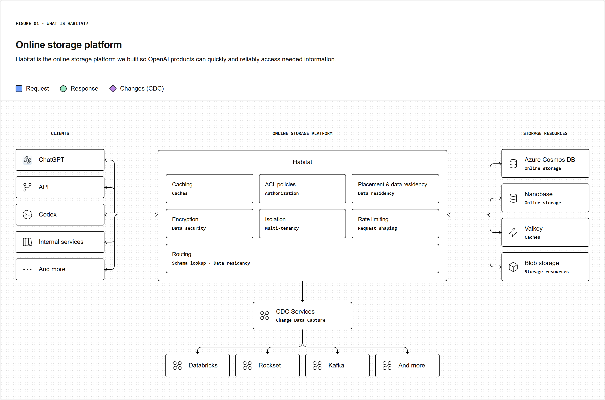
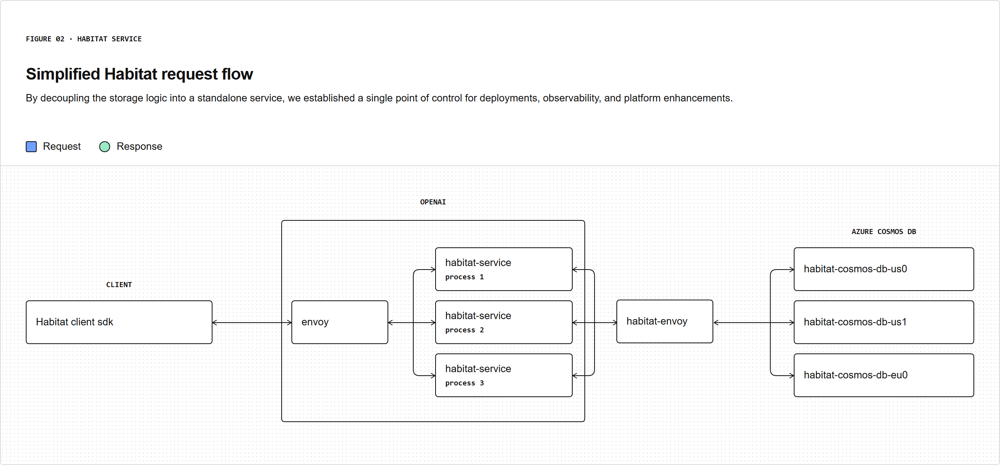
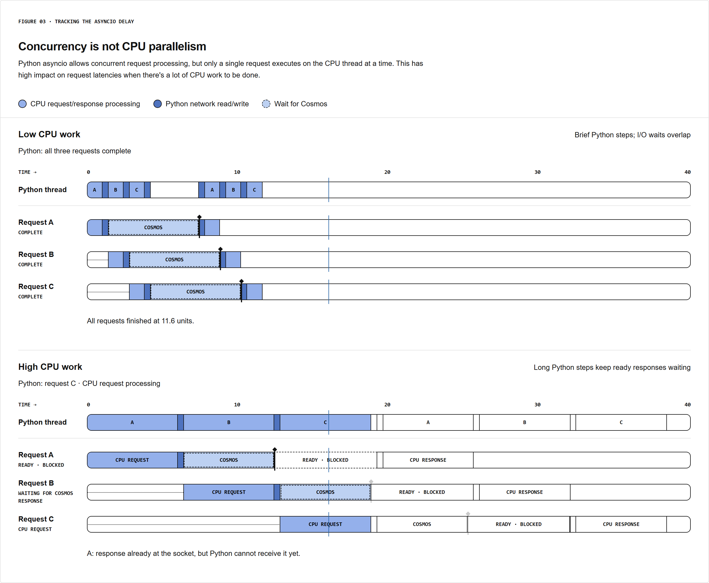
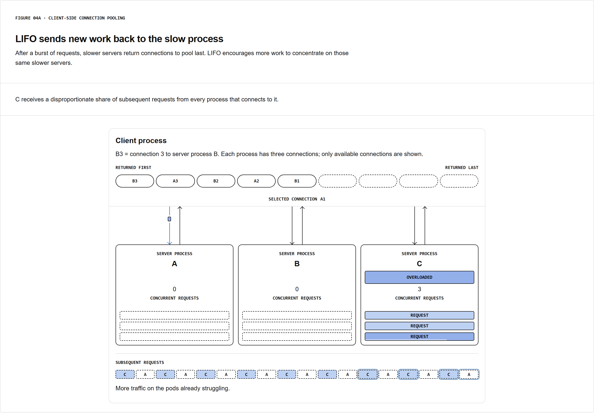
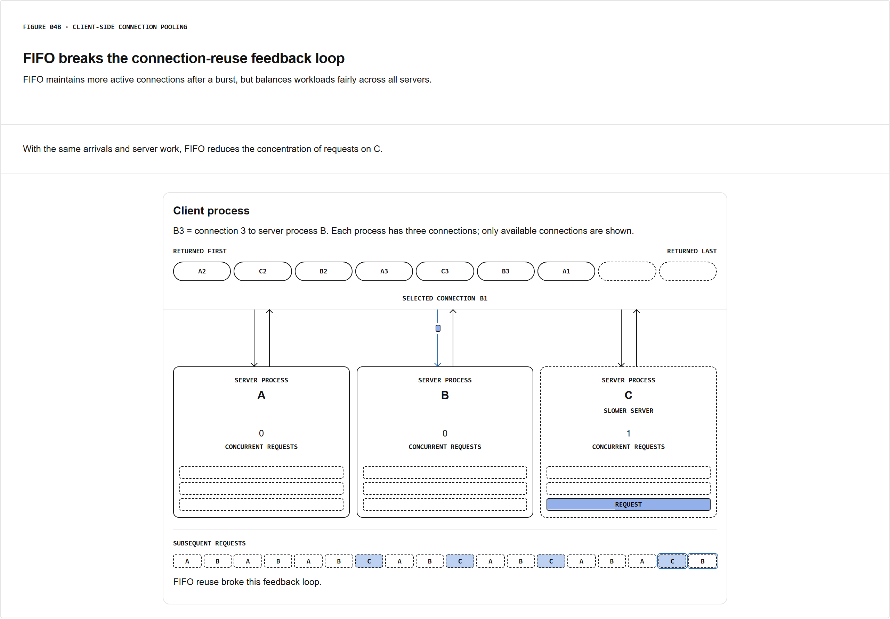
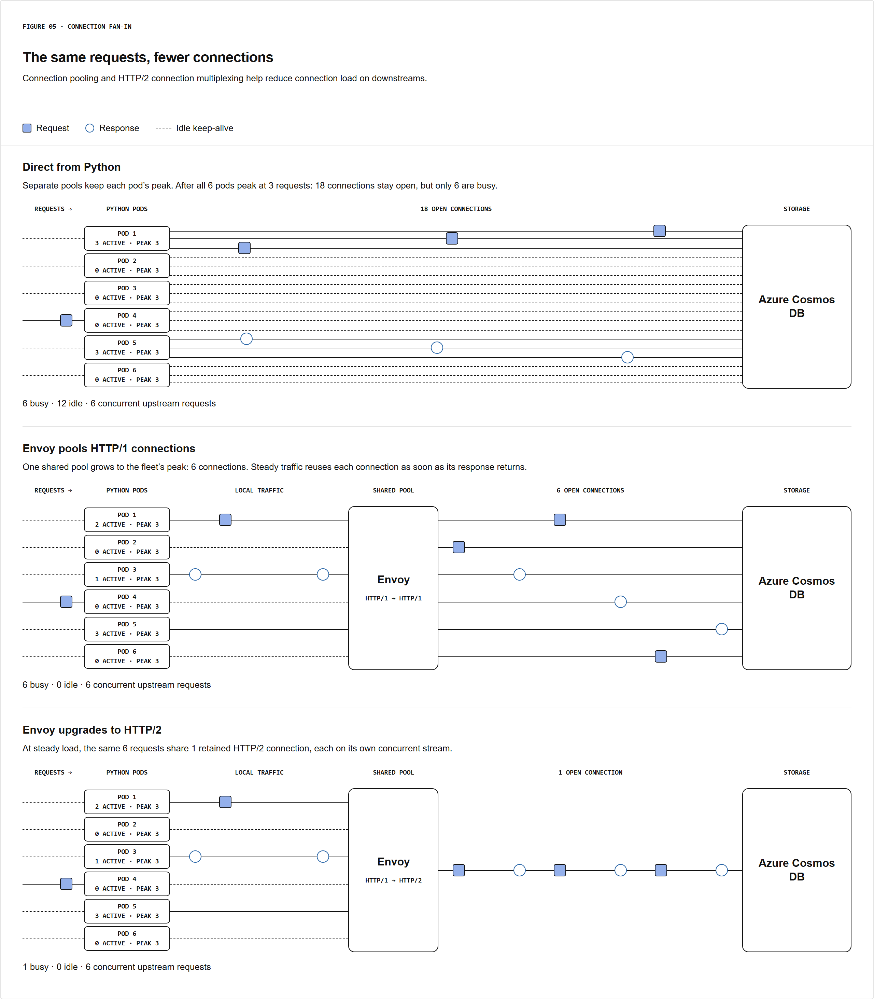

# Scaling Habitat: From a Python Client Library to a 70M+ RPS Online Storage Service

Habitat is an online storage abstraction positioned between product services and the underlying storage systems. Its current operating envelope exceeds **70 million requests per second**, spans **almost 40 geographic regions**, serves **more than 500 PB of data**, and supports products used by **more than one billion people each week**. The engineering problem was not simply to provision enough database capacity for that traffic. The system had to continue evolving while demand had been growing at more than **10× year over year for three consecutive years**.

That growth rate changes the engineering problem. A conventional capacity strategy assumes that a major architectural investment can create several years of headroom. Habitat did not consistently have that interval. Its evolution therefore became a sequence of tightly coupled interventions: preserve development velocity long enough to establish the abstraction, remove deployment fan-out by converting the library into a service, make Python's asynchronous runtime observable enough to control p99+ latency, prevent client connection pools from creating metastable load concentration, reduce connection multiplicity with Envoy and HTTP/2, constrain the API so that request work remains predictable, and only then replace the mature Python serving implementation with Rust.

The important technical thread is causal:

\[
\boxed{
\text{client library}
\rightarrow
\text{deployment fan-out}
\rightarrow
\text{central service}
\rightarrow
\text{Python runtime pressure}
\rightarrow
\text{low worker concurrency}
\rightarrow
\text{large process count}
\rightarrow
\text{connection pressure}
\rightarrow
\text{Envoy fan-in}
\rightarrow
\text{bounded request semantics}
\rightarrow
\text{Rust serving plane}
}
\]

Each intervention removes one bottleneck but exposes the next one. That progression is the architecture.

---

# 1. Habitat's Original Abstraction

Habitat began with a narrow objective: product engineers should not need to reason directly about database management for routine application storage.

The first implementation was a small Python client library used by ChatGPT's main server. Its supported operations mapped internally onto **Azure Cosmos DB**. The client-facing abstraction was deliberately above the physical database interface.

A request could therefore be expressed against Habitat while the library handled several storage-level concerns:

- schema lookup;
- routing;
- authorization;
- encryption;
- serialization;
- request shaping;
- connection pooling;
- selection between Azure Cosmos DB, caches, and other storage resources.

This boundary is important. Habitat was not initially introduced as another independently deployed distributed service. It was application-side storage logic packaged as a reusable library.

The effective path was approximately:

\[
\text{product code}
\rightarrow
\text{Habitat Python library}
\rightarrow
\text{storage backend}.
\]

For the initial scale, this had strong implementation properties.

There was no additional service deployment to operate. Product teams could adopt the abstraction incrementally. Because the implementation lived in Python alongside application code, developers could also extend it relatively easily with functionality such as client-side caching, compression, and encryption.

The library consequently achieved adoption without requiring a centrally mandated migration away from directly managed Postgres or Azure Cosmos DB deployments.

The same property that accelerated adoption, however, became the architectural limitation: **the executable storage control logic existed inside every consuming application process**.

---

# 2. Why the Client Library Stopped Scaling

By the middle of 2025, Habitat's difficulty was no longer primarily implementing storage operations. It was coordinating changes to those operations across a growing number of independently deployed services.

The critical failure mode appeared during work intended to improve regional resiliency.

The objective was to reduce the blast radius of a single-region outage for important datasets. The storage topology therefore needed to move toward a collection of **regionally distributed Azure Cosmos DB accounts**.

Because routing was implemented inside the Habitat library, changing the storage topology also required changing every consumer that contained the library.

The rollout dependency became:

\[
\text{new storage topology}
\Rightarrow
\text{new routing algorithm}
\Rightarrow
\text{new client version}
\Rightarrow
\text{rollout across every consuming service}.
\]

The routing logic was initially placed behind a feature flag. Before that flag could safely be enabled, the updated client had to propagate throughout the service fleet.

That propagation took days.

Before activation, request shadowing was then considered necessary to validate the sharding logic.

Shadowing was also client-side.

Therefore:

\[
\text{need shadowing}
\Rightarrow
\text{another client change}
\Rightarrow
\text{another multi-service rollout}.
\]

That required additional days.

A discovered bug required another client release, which introduced another propagation interval.

Eventually the fleet was considered ready. Before the final change could safely settle, one unrelated product-service rollback restored a previously buggy version of the Habitat client and recreated the outage condition the migration was designed to remove.

This is the precise architectural failure.

The desired operation was:

\[
\text{change Habitat routing once}.
\]

The actual operation was:

\[
\text{change Habitat routing}
\times
N_{\text{independently deployed consumers}}.
\]

The client library had turned a storage-platform deployment into a distributed application coordination problem.

Backward compatibility also became increasingly difficult because old and new versions of the storage protocol could remain active simultaneously across the fleet. Every meaningful protocol evolution therefore had to account for a moving distribution of client versions.

At small scale, library distribution minimizes infrastructure.

At sufficiently large organizational scale, library distribution can maximize **operational fan-out**.

That was the point at which Habitat had to become a service.

---

# 3. Pulling Habitat Behind a Service Boundary

The migration changed where storage behavior executed.

Instead of:

\[
\text{product}
\rightarrow
\boxed{\text{Habitat logic inside product}}
\rightarrow
\text{storage},
\]

the architecture became:

\[
\text{product}
\rightarrow
\boxed{\text{Habitat service}}
\rightarrow
\text{storage}.
\]

This was not merely an RPC extraction.

It relocated the **authority to change storage behavior**.

Routing no longer needed to be updated independently in every product deployment. Observability could be implemented around one serving layer. Platform improvements could be rolled out once. Changes to storage topology could be mediated behind a stable client-facing service interface.

The operational dependency changed from

\[
N_{\text{clients}}
\times
N_{\text{required upgrades}}
\]

toward

\[
1_{\text{Habitat service rollout}}
\]

for platform-internal behavior.

That is why the service boundary matters more than the network topology itself.

The centralized service also created a security enforcement point. Habitat could centrally perform:

- access-control enforcement;
- audit logging;
- restrictions on access to underlying Azure Cosmos DB resources;
- protection against unauthorized requests originating from external actors;
- protection against unauthorized requests from internal actors;
- protection against unauthorized requests generated by agent actors.

The key property is not simply centralization. It is **policy convergence**.

Storage authorization, routing, privacy controls, deployment state, and platform observability could now converge at the same execution boundary instead of being reproduced independently in application processes.

But this architectural correction introduced a new problem.

The old Habitat code was Python.

As a client library, Python was running local storage orchestration inside existing application processes. Once Habitat became a high-throughput network service, that same implementation had to become the serving runtime itself.

---

# 4. Why the Service Remained Python

The obvious response would have been to combine the service extraction with a language rewrite.

That was deliberately rejected.

Python as a network service imposed additional costs relative to the client-library implementation:

- higher CPU consumption;
- higher memory consumption;
- additional network-path latency;
- runtime scheduling overhead;
- substantially larger infrastructure requirements at scale.

The system's designers also explicitly expected Python's inefficiency to become unacceptable at approximately another two orders of magnitude of scale. A rewrite was therefore already considered likely.

Yet the immediate constraint was not runtime efficiency.

The immediate constraint was platform evolution.

The system still needed to:

1. decouple storage behavior from product deployments;
2. stabilize the Habitat API;
3. establish the serving infrastructure;
4. unblock product development;
5. develop the operational model of the service.

Rewriting the implementation at the same time would have coupled two migrations:

\[
\text{architecture migration}
+
\text{runtime migration}.
\]

Instead, Python was intentionally retained as **strategic technical debt**.

That sequencing matters.

The system accepted an inefficient runtime to gain a stable service boundary first. The expectation was that once the service semantics had matured, the implementation could later be replaced without forcing another application-level architectural migration.

There was also an explicit wager that improvements in coding models would reduce the engineering cost of that future rewrite. Codex and GPT were expected to make the eventual language migration materially easier.

That prediction later influenced the Rust transition.

But retaining Python only worked if its latency behavior could be controlled.

At Habitat's request pattern, mean latency was not sufficient.

An average user operation may trigger **hundreds of database calls**. Consequently, the slowest calls disproportionately affect the user-visible operation.

If one operation contains \(n\) relevant storage calls,

\[
R_1,R_2,\ldots,R_n,
\]

then for a parallel synchronization point the effective completion time is bounded by the slowest dependency:

\[
T_{\text{barrier}}
\simeq
\max(T_{R_1},T_{R_2},\ldots,T_{R_n}).
\]

As \(n\) increases, the probability of observing at least one tail event also increases.

If an individual storage request exceeds latency threshold \(t\) with probability \(p\), then—under a simplified independence assumption—the probability that at least one of \(n\) requests exceeds that threshold is

\[
P(\max_i T_i > t)
=
1-(1-p)^n.
\]

The source does not present this equation, but it captures the operational reason explicitly stated in the system: **when a user action produces hundreds of database requests, tail latency becomes product latency**.

Python therefore had to be engineered primarily around p99+ behavior, not merely average throughput.

---

# 5. The Actual Python Bottleneck: Asyncio Scheduling Delay

The first runtime problem is easy to misdiagnose.

Habitat performs substantial I/O. That initially makes `asyncio` appear naturally appropriate.

But asynchronous concurrency and CPU parallelism are different properties.

`asyncio` allows one process to keep multiple I/O operations outstanding. It does not cause multiple Python coroutines to execute Python CPU work in parallel on the same execution thread.

Habitat's request processing was not pure socket proxying.

The service also performed CPU-relevant work including:

- routing;
- compression;
- encryption;
- checksumming;
- downstream health checking;
- request shadowing;
- hedging;
- background tasks.

Consider a simplified coroutine:

\[
\text{CPU}_{\text{request}}
\rightarrow
\text{await downstream}
\rightarrow
\text{CPU}_{\text{response}}.
\]

During the downstream wait, another coroutine can execute.

The problem begins after the downstream response becomes available.

A packet may already have arrived and be readable at the socket while the coroutine responsible for consuming that response is not yet scheduled.

The latency observed by the caller is therefore not simply

\[
T_{\text{downstream}}.
\]

It contains a runtime scheduling term:

\[
T_{\text{observed}}
=
T_{\text{pre-I/O CPU}}
+
T_{\text{downstream}}
+
T_{\text{event-loop wait}}
+
T_{\text{post-I/O CPU}}.
\]

The important discovery came from p99+ traces: the underlying storage frequently responded quickly, but the Habitat request remained stalled because the coroutine waiting for that response could not immediately return to the CPU.

The storage system had completed its work.

Python had not scheduled the code required to observe that completion.

That distinction is fundamental.

A standard downstream-latency metric would point away from the database because the database was healthy.

A standard aggregate CPU metric would show utilization.

Neither directly measures:

\[
\text{How long does runnable asyncio work wait before being scheduled?}
\]

Habitat therefore made event-loop scheduling delay itself observable.

---

# 6. Measuring Asyncio Loop Delay as a Runtime Saturation Signal

The measurement method was intentionally direct.

A background task is scheduled to execute at expected time

\[
t_e.
\]

Its actual execution time is recorded as

\[
t_a.
\]

The event-loop delay is then

\[
\Delta_{\text{loop}}
=
t_a-t_e.
\]

This quantity measures how late the runtime is in executing work that should already be eligible to run.

It is therefore a better runtime-specific saturation signal than CPU percentage alone.

At high utilization, Habitat observed that even a modest number of concurrent requests per process could generate substantial scheduling jitter when combined with expensive request processing and background work.

Observed delay reached:

- **hundreds of milliseconds** under problematic load;
- **several seconds** in some edge cases.

Those numbers are catastrophic for a storage-service layer whose downstream operation may itself be fast.

The conclusion was not to increase concurrency.

It was the opposite.

Habitat deliberately constrained each Python process to serve only a small number of concurrent requests.

Then aggregate throughput was recovered by increasing the number of worker processes:

\[
Q_{\text{fleet}}
\approx
N_{\text{workers}}
\times
Q_{\text{worker}}.
\]

Rather than maximizing \(Q_{\text{worker}}\), the architecture reduced per-process concurrency to control

\[
\Delta_{\text{loop}}.
\]

The optimization objective had changed.

A conventional throughput-oriented configuration might attempt:

\[
\max Q_{\text{worker}}.
\]

Habitat instead needed something closer to:

\[
\min P_{99+}(\Delta_{\text{loop}})
\]

subject to

\[
Q_{\text{fleet}} \ge Q_{\text{required}}.
\]

This is why a Python service capable of large aggregate throughput can simultaneously require an unusually large number of relatively lightly loaded processes.

But once event-loop delay became the governing metric, another source of scheduling interference became visible: **control-plane work running inside the same Python processes**.

---

# 7. Statsig Configuration Parsing: A Synchronized CPU Stall

Live CPU profiling identified one concrete contributor to excessive asyncio delay: periodic parsing of feature-flag configuration delivered through **Statsig**.

Three details interacted.

First, configuration refresh occurred every **one minute**.

Second, the refresh had **no jitter**.

Third, the configuration contained the production rules for **every service**, not just a small Habitat-specific subset.

Separately, Habitat could run as many as **eight Python processes per pod** to increase CPU utilization while maintaining low request latency.

Those decisions were individually plausible.

Together they created correlated CPU stalls.

For each worker \(w\), let the configuration refresh period be

\[
T=60\text{ s}.
\]

Without jitter, worker refresh times become approximately phase-aligned:

\[
t_{w,k}
\approx
t_0+kT.
\]

Each worker then performs JSON parsing over a large configuration at approximately the same periodic boundary.

With eight Python workers per pod, the pod periodically transitions from:

\[
\text{workers processing application requests}
\]

to

\[
\text{multiple workers consuming CPU parsing configuration}.
\]

In-flight request coroutines remain runnable but compete with the parsing work.

The result is:

\[
\text{synchronized config parsing}
\rightarrow
\text{CPU occupancy}
\rightarrow
\text{asyncio scheduling delay}
\rightarrow
\text{p99+ request latency}.
\]

The remediation had three components:

**Reduce configuration size.**  
Deliver a smaller, targeted configuration instead of parsing every production rule.

**Increase the refresh interval.**  
Reduce how frequently the CPU-intensive operation occurs.

**Add jitter.**  
Prevent worker refresh cycles from becoming synchronized.

If the interval is represented as

\[
T+\epsilon_w,
\]

with worker-specific timing variation \(\epsilon_w\), then the probability of all workers executing the expensive task simultaneously decreases.

The essential point is that the feature-flag system was not on the nominal storage data path, yet its background CPU behavior appeared directly in storage tail latency.

That is why tracking event-loop scheduling delay was necessary. Without the runtime-specific metric and live CPU profiling, the system could have appeared to suffer unexplained p99 outliers while the actual downstream database remained responsive.

After reducing this local source of delay, however, low process concurrency could only remain effective if traffic was distributed evenly across those processes.

That exposed the next failure mode.

---

# 8. Low Per-Process Concurrency Requires Extremely Good Load Distribution

The Python strategy depended on maintaining small concurrent-request counts in each worker.

This means variance across workers is dangerous.

Suppose average concurrency is

\[
\bar c.
\]

If a tail worker receives

\[
c_i = 10\bar c,
\]

then the fleet may appear to have adequate aggregate capacity while that worker is already deep inside the asyncio scheduling regime the architecture was explicitly trying to avoid.

Habitat observed precisely this behavior.

Before load-balancing adjustments, some tail processes were serving **5–10× the average concurrent-request count**.

The immediate mechanism was client-side connection pooling.

A client performing many concurrent requests does not necessarily open connections uniformly to every available server process. It may establish only a small connection set and repeatedly reuse those connections.

Consequently:

\[
\text{balanced service discovery}
\not\Rightarrow
\text{balanced request execution}
\]

when persistent connection reuse pins subsequent traffic to a small server subset.

This produced an incident with a more severe characteristic.

A burst overloaded a subset of server processes.

The offending client was stopped.

The overloaded subset did **not** recover.

Instead, some processes continued receiving increasing amounts of traffic and became progressively more degraded until they were restarted.

The initiating load had disappeared, but the degraded state persisted.

This was a metastable failure.

The investigation therefore shifted from “what produced the original burst?” to:

> What state inside the system causes an already-slow server to continue attracting disproportionate traffic?

The connection pool became the primary suspect.

---

# 9. Diagnosing the Metastable Connection-Pool Failure

The first diagnostic experiment was to cap the maximum connection-reuse duration.

That bounded the degradation.

This observation implicated persistent connection state because forcing connections to expire also limited the lifetime of the pathological behavior.

Further inspection identified the critical policy: Python's `aiohttp.TCPConnector` used **LIFO connection reuse**.

LIFO means:

\[
\text{next connection}
=
\text{most recently returned connection}.
\]

Under ordinary burst handling, this behavior can be desirable.

Assume a pool temporarily expands from \(m\) to \(m+k\) connections during a traffic burst.

If recently active connections are repeatedly reused, older excess connections can remain idle and eventually time out:

\[
m+k
\rightarrow
m.
\]

That reduces the steady-state cost of retaining transient burst capacity.

The pathological behavior arises when connection return order is correlated with server health.

---

# 10. Why LIFO Sent New Traffic to the Slowest Process

Consider server processes:

\[
A,\;B,\;C
\]

where \(C\) has become slower.

A burst sends traffic to all three.

Let completion times satisfy:

\[
t_A < t_B < t_C.
\]

Connections to \(A\) and \(B\) return to the client pool first.

The connection to \(C\) returns last.

Because the pool is LIFO, the most recently returned connection becomes the preferred connection for the next request.

Therefore:

\[
C\text{ slower}
\Rightarrow
C\text{ returns connection later}
\Rightarrow
C\text{ connection becomes newest}
\Rightarrow
\text{LIFO selects }C
\Rightarrow
C\text{ receives more work}.
\]

The additional work then increases \(C\)'s queueing and event-loop pressure:

\[
\lambda_C \uparrow
\Rightarrow
T_C \uparrow.
\]

Higher \(T_C\) makes its connections even more likely to return later than healthy peers.

The feedback loop becomes:

\[
T_C\uparrow
\rightarrow
\text{return later}
\rightarrow
P(\text{reuse }C)\uparrow
\rightarrow
\lambda_C\uparrow
\rightarrow
T_C\uparrow.
\]

This is not conventional overload where load simply exceeds capacity.

It is **load-placement feedback**.

The connection-reuse policy contains enough state to reinforce the degraded condition after the original burst has ended.

This explains why stopping the client producing the initial overload did not necessarily restore the system.

The traffic burst was the trigger.

LIFO connection reuse was part of the persistence mechanism.

---

# 11. FIFO Removes the Reinforcing Correlation

The immediate correction was to patch connection reuse from LIFO to **FIFO**.

FIFO selects the connection that has been idle the longest:

\[
\text{next connection}
=
\text{oldest returned connection}.
\]

Using the same sequence:

\[
t_A < t_B < t_C,
\]

connections from \(A\) and \(B\) become eligible for reuse before the late connection from \(C\).

When \(C\)'s connection finally returns, it does not immediately become the preferred path for the next request.

Therefore the correlation changes from:

\[
\text{slow completion}
\Rightarrow
\text{higher reuse priority}
\]

to approximately:

\[
\text{slow completion}
\Rightarrow
\text{no immediate priority advantage}.
\]

That breaks the positive feedback loop.

The tradeoff is explicit.

LIFO tends to allow older excess connections to age out after traffic bursts.

FIFO can keep a broader set of connections active for longer.

Therefore FIFO may retain more connections.

But Habitat preferred:

\[
\text{higher connection retention}
\]

over

\[
\text{load concentration on already-degraded workers}.
\]

The patch not only eliminated the metastable behavior; it also reduced steady-state request variance.

The infrastructure later moved most connection pooling and server-load-aware balancing responsibility into **Istio and Envoy**, avoiding reliance on each Python client's local pool behavior.

This transition is directly connected to the earlier Python decision.

The service had reduced per-process concurrency to protect asyncio tail latency.

That made per-process load imbalance more expensive.

Persistent client connection pools introduced such imbalance.

Moving pooling and balancing into the service mesh therefore protected the runtime strategy required to make Python viable.

But increasing the number of Python processes to protect event-loop latency created another independent multiplicative effect:

\[
\text{worker count}
\rightarrow
\text{downstream connection count}.
\]

---

# 12. The Cost of Scaling Out Python: Connection Multiplicity

Habitat's response to asyncio saturation was to use many processes with low individual concurrency.

Every process, however, can independently create downstream connections.

If there are \(P\) processes and each establishes up to \(K\) downstream connections, connection state can scale approximately as:

\[
C_{\text{downstream}}
\propto
P K.
\]

The request throughput may justify only a certain number of simultaneously active downstream operations, but independent pools retain capacity according to **local peaks**, not necessarily the aggregate steady-state requirement.

This creates a mismatch:

\[
\text{aggregate retained connections}
\gg
\text{aggregate active requests}.
\]

At Habitat's worker count, this changed ordinary network events into infrastructure risks.

A deployment that rapidly replaces processes can cause extensive connection cycling.

Connection creation and teardown generate CPU work downstream.

A connection leak can accumulate enough sockets to saturate a NAT gateway.

A simultaneous surge in newly started workers can create a thundering herd toward shared dependencies.

The important point is that pure request throughput no longer predicts downstream pressure.

Two systems processing identical request volumes can produce radically different connection footprints if one uses an order of magnitude more application processes.

Thus:

\[
Q_{\text{requests}}
\not\Rightarrow
C_{\text{connections}}.
\]

The runtime optimization that protects Python latency can independently destabilize the network layer.

Habitat therefore needed **connection fan-in**.

---

# 13. Envoy as the Connection Fan-In Layer

Envoy was used to decouple application-process multiplicity from downstream transport multiplicity.

Python processes can originate HTTP/1 traffic locally.

Envoy concentrates those connections, upgrades the downstream side to **HTTP/2**, pools connections, extends their lifetime, and multiplexes many concurrent logical requests over fewer physical connections.

The source provides a concrete example.

Assume six Python pods.

Each pod has previously peaked at three downstream connections.

With completely separate local pools:

\[
6\times3 = 18
\]

connections remain open.

At the illustrated steady workload, only six are busy:

\[
18\text{ open}
=
6\text{ busy}
+
12\text{ idle}.
\]

Now place those requests behind one shared pool.

The pool only needs to grow to the **fleet-level simultaneous peak**:

\[
18
\rightarrow
6\text{ connections}.
\]

At steady traffic, responses return and each connection can be reused across the combined fleet rather than remaining attached to the peak history of a particular pod.

With HTTP/2 multiplexing, those six concurrent logical requests can then be carried as independent streams over one retained connection in the illustrated case:

\[
6\text{ requests}
\rightarrow
6\text{ HTTP/2 streams}
\rightarrow
1\text{ connection}.
\]

Nothing about the request workload itself became smaller.

The optimization operates on transport state:

\[
\text{logical concurrency}
\neq
\text{TCP connection multiplicity}.
\]

This is why the sequence matters.

Python latency control required process scale-out.

Process scale-out amplified connections.

Envoy absorbed connection multiplicity so that the process-level solution did not overwhelm downstream systems.

Envoy additionally became a centralized location for **rate limits** and **circuit breakers**.

Implementing those controls independently in every Python process would make their effectiveness dependent on a fragmented local view.

With \(P\) processes, a local per-process limit \(r\) can potentially produce an aggregate envelope approaching:

\[
R_{\text{aggregate}}
\approx
P r.
\]

A centralized layer can reason about a broader traffic aggregate and enforce downstream protection independently of Python worker count.

At this stage, however, Habitat had only solved the execution mechanics of the service.

There remained another scaling variable with potentially far greater variance than CPU scheduling or connection count:

**the amount of work a single API request is allowed to trigger.**

---

# 14. The API Was Constrained Because Query Cost Is a Reliability Property

One reason Python could be pushed beyond **20 million requests per second** was that Habitat did not expose a highly expressive online query interface.

Its NoSQL API intentionally restricts what clients can ask the service to compute.

This is not an incidental product choice.

It is central to the scalability model.

Consider two API designs.

In the first, a request corresponds to a bounded lookup whose execution work is approximately stable:

\[
W_{\text{request}}
\approx
\text{constant bounded work}.
\]

In the second, a compact query can trigger:

- table scans;
- multi-table joins;
- high-cardinality fan-out;
- arbitrary graph traversal;
- data-dependent intermediate work.

Then:

\[
W_{\text{request}}
=
f(\text{data distribution},\text{query plan},\text{fan-out},\text{cardinality},\ldots)
\]

with potentially large variance.

At moderate scale, an expensive query can be detected and corrected manually.

At Habitat scale, an unpredictable request-cost distribution complicates every mechanism already discussed:

### Isolation

A tenant issuing expensive requests can consume disproportionate shared capacity.

### Load balancing

Balancing request counts no longer balances compute or storage work.

If request costs are \(w_i\), then balancing

\[
N_A \approx N_B
\]

does not imply

\[
\sum_{i\in A} w_i
\approx
\sum_{i\in B}w_i.
\]

### Capacity planning

Requests per second stop being a sufficiently useful load proxy.

### Tail latency

A small population of very expensive requests creates service-level and downstream latency cliffs.

### Backpressure

A rate limiter counting requests may admit radically different amounts of actual work depending on request mix.

This is why Habitat optimizes for **simple, predictable, constant-work requests**.

The weak expressiveness of the API is not a missing capability.

It is a scaling constraint intentionally encoded into the product surface.

---

# 15. Why the Previous Postgres Model Became Operationally Unsafe

Before Habitat and Azure Cosmos DB became dominant for this online data, much of it lived in **Postgres**.

At smaller organizational scale, proposed queries and schema changes could be reviewed manually.

The review process could verify that:

- queries used appropriate indexes;
- schema changes were well behaved;
- obvious pathological scans did not enter hot paths.

That operational process ceased to scale with the number of engineers, services, products, and production changes.

The source reports a recurring failure class: one newly introduced expensive query on a hot path could take down the database.

The fundamental asymmetry is:

\[
\text{cost to express query}
\ll
\text{cost to execute query at production cardinality}.
\]

A few lines of SQL can encode work whose cost only becomes visible after considering:

- dataset size;
- selectivity;
- join cardinality;
- index availability;
- execution frequency;
- concurrency.

The request syntax is therefore not proportional to operational cost.

Habitat intentionally reverses part of that relationship.

Complex operations are made obvious to the client because they cannot be hidden inside an unrestricted server-side query.

There are no unbounded online queries that can silently force the Habitat service to perform arbitrarily large work.

Complex joins and graph traversals require product teams to perform explicit work.

This makes computational cost visible at the call site rather than implicit inside the storage service.

That constraint provides the bridge from the serving architecture to the data model.

---

# 16. Object-and-Edge NoSQL Model

Habitat exposes client-defined **object types** and **edge types**, with a model inspired by **TAO**.

Clients define how objects and edges relate, while the contents of those types remain application defined.

At a logical level:

\[
G=(V,E)
\]

where

\[
V=\text{objects}
\]

and

\[
E=\text{typed edges between objects}.
\]

The resulting structure is graph-like.

But Habitat is intentionally **not a general graph-query engine**.

The service can query direct edges associated with a particular object.

It does not expose ordinary arbitrary graph traversal semantics.

For object \(v\), a direct relationship lookup corresponds conceptually to:

\[
N(v)=\{u:(v,u)\in E\}.
\]

Habitat can represent the relationship.

It does not automatically execute an arbitrary recursive operation such as:

\[
N^{(k)}(v)
\]

for unconstrained \(k\).

That restriction is consistent with the constant-work design.

A direct edge query can be engineered around known partition and request behavior.

An arbitrary traversal introduces data-dependent fan-out:

\[
1
\rightarrow
d
\rightarrow
d^2
\rightarrow
\cdots
\]

in the worst conceptual case.

The graph-shaped logical schema is therefore separated from graph-query execution semantics.

---

# 17. Partitioning: Colocate an Object With Its Edges, Not the Entire Reachable Graph

Habitat's graph-like data is partitioned so that an object and its associated edges are colocated at the storage level.

For an object \(v\),

\[
\{v,E_v\}
\]

is the locality unit.

What the architecture deliberately does **not** attempt is colocating \(v\) with all remote objects referenced by \(E_v\).

If

\[
(v,u)\in E,
\]

there is no guarantee that \(v\) and \(u\) reside in the same Azure Cosmos DB account—or even the same geographic region.

This choice simplifies horizontal partitioning.

Trying to preserve arbitrary graph locality is difficult because an object may participate in many relationships and those relationships can evolve independently.

Instead, the partition rule is local and predictable:

\[
\text{object}
+
\text{its edges}
\rightarrow
\text{one storage-level partition}.
\]

The consequence is equally explicit:

\[
\text{graph traversal efficiency}
\downarrow.
\]

A traversal hop may require fetching information from two entirely different Azure Cosmos DB accounts in different regions.

Habitat accepts that cost because arbitrary traversal is not the primary online operation being optimized.

Again, the connection to the previous engineering decisions is direct:

\[
\text{simple partition rule}
\rightarrow
\text{horizontal scalability}
\rightarrow
\text{predictable serving behavior}
\]

at the cost of

\[
\text{cross-object traversal locality}.
\]

The architecture is choosing predictable partitionability over universal query efficiency.

---

# 18. Complex Queries Are Removed From the Online Failure Domain

Constraining the online API does not eliminate legitimate needs for:

- complex querying;
- search;
- analytical filtering;
- large read-oriented workloads.

Instead of extending Habitat until it can execute all of those operations, the system provides a separate read path through **Rockset**.

The architecture is:

\[
\text{online Habitat storage}
\rightarrow
\text{CDC}
\rightarrow
\text{isolated Rockset instance}.
\]

**Change data capture (CDC)** continuously streams storage changes out of the online system into Rockset in near real time.

Complex reads then execute against the secondary representation rather than against the latency-sensitive transactional path.

Each client team is responsible for scaling its own Rockset instance for its query requirements.

This introduces deliberate client friction.

But that friction creates resource isolation.

Without separation:

\[
\text{OLTP traffic}
+
\text{search}
+
\text{analytical scans}
\rightarrow
\text{shared capacity domain}.
\]

With the secondary view:

\[
\text{bounded online operations}
\rightarrow
\text{Habitat}
\]

while

\[
\text{complex read operations}
\rightarrow
\text{client-scaled Rockset}.
\]

A team's analytical workload can therefore saturate its own Rockset capacity without directly consuming the Habitat serving capacity required for online requests.

The escape hatch preserves query flexibility without weakening the invariant that makes the primary system scalable:

> the default online request should have simple, bounded, predictable work.

This closes the architectural loop around the Python implementation.

Python was able to scale as far as it did not only because of low process concurrency and Envoy. It was also protected from arbitrary computational workloads by the API contract itself.

---

# 19. Why the Rust Rewrite Happened Only After These Constraints Were Established

Python ultimately became expensive enough that the runtime itself had to be replaced.

At its peak, the Python implementation served more than:

\[
20\,\text{million requests/s}.
\]

By then, Habitat had become the **second-largest service by core count** in its infrastructure environment and the **fourth-largest by Envoy footprint**.

Those numbers expose the cost of the earlier tactical decision.

The Python architecture worked.

But making it work required substantial compute, memory, process multiplicity, and proxy infrastructure.

The rewrite was deferred for roughly a year because removing those costs earlier would have competed with higher-priority architecture work.

That sequencing meant the rewrite began after the system had already discovered and stabilized critical semantics:

- the service boundary;
- request APIs;
- storage abstraction;
- routing behavior;
- runtime observability expectations;
- connection-management behavior;
- operational isolation requirements.

In **Q2 2026**, the entire service was rewritten in **Rust** by **two engineers**, using **Codex** and **GPT-5.5**.

At the publication point, Rust was serving approximately:

\[
95\%
\]

of production requests.

The measured efficiency changes were:

\[
\text{CPU efficiency}_{Rust}
\approx
6\times
\text{CPU efficiency}_{Python}
\]

and

\[
\text{memory efficiency}_{Rust}
\approx
15\times
\text{memory efficiency}_{Python}.
\]

Average latency and tail latency were also materially lower.

The source does **not** provide the implementation details required to attribute the 6× and 15× improvements to specific mechanisms such as allocator behavior, async runtime implementation, zero-copy serialization, compiler optimization, request representation, or reduced process count.

Those details would be speculation.

The only defensible conclusion from Part I is the measured system-level result:

- substantially better CPU efficiency;
- substantially better memory efficiency;
- lower average latency;
- lower tail latency;
- 95% production migration at the time of publication.

The significance of the migration is architectural sequencing.

Python was retained while Habitat's architecture was unstable enough that implementation velocity dominated infrastructure efficiency.

Rust was introduced after the platform semantics had matured enough that execution efficiency became the dominant remaining serving-layer problem.

---

# 20. The Full Causal Chain

The entire Part I architecture can be reconstructed as one dependency chain rather than a collection of independent optimizations.

### Stage 1 — Client-side abstraction

\[
\text{product complexity}
\rightarrow
\text{shared Python storage library}
\]

Product engineers avoid direct database-management concerns.

### Stage 2 — Organizational scale breaks library deployment

\[
\text{more clients}
\rightarrow
\text{version skew}
+
\text{rollout coordination}
+
\text{backward compatibility burden}
\]

A regional-routing change requires fleet-wide application coordination.

### Stage 3 — Centralize into a service

\[
\text{client-side control}
\rightarrow
\text{central Habitat service}
\]

Routing, observability, security, deployment, and platform enhancements become centrally deployable.

### Stage 4 — Python becomes the serving runtime

\[
\text{library Python}
\rightarrow
\text{network-service Python}
\]

CPU, memory, network, and tail-latency overhead become first-order infrastructure concerns.

### Stage 5 — Asyncio tail latency appears

\[
\text{CPU work}
+
\text{I/O concurrency}
\rightarrow
\text{event-loop scheduling delay}.
\]

Storage responses can already be available while request coroutines remain unscheduled.

### Stage 6 — Measure runtime delay directly

\[
\Delta_{\text{loop}}
=
t_{\text{actual}}-t_{\text{expected}}.
\]

This exposes hundreds-of-milliseconds and occasional seconds-scale scheduling jitter.

### Stage 7 — Lower per-process concurrency

\[
\text{smaller concurrency/process}
\rightarrow
\text{lower scheduling contention}.
\]

Aggregate throughput is restored through many more Python processes.

### Stage 8 — Remove synchronized background CPU work

Statsig configuration behavior is changed:

\[
\text{smaller config}
+
\text{longer interval}
+
\text{jitter}.
\]

This reduces correlated CPU stalls and corresponding p99+ latency.

### Stage 9 — Process-level load variance becomes dangerous

Low-concurrency workers cannot tolerate persistent traffic imbalance.

Client-side connection pools produce workers with:

\[
5\text{--}10\times
\]

average concurrency.

### Stage 10 — Identify metastable LIFO feedback

\[
\text{slow worker}
\rightarrow
\text{late connection return}
\rightarrow
\text{LIFO priority}
\rightarrow
\text{more traffic}
\rightarrow
\text{slower worker}.
\]

### Stage 11 — Replace LIFO reuse with FIFO

FIFO removes the coupling between slow completion and immediate connection-reuse priority.

Steady-state request variance falls.

### Stage 12 — Move connection behavior into Istio/Envoy

The infrastructure takes responsibility for connection pooling and stronger server-load-aware balancing.

### Stage 13 — Process scale-out creates connection scale-out

\[
N_{\text{Python workers}}\uparrow
\Rightarrow
N_{\text{connection pools}}\uparrow.
\]

Deployments, leaks, and bursts can overwhelm downstream network resources.

### Stage 14 — Envoy concentrates connections

\[
\text{many Python HTTP/1 connections}
\rightarrow
\text{shared pool}
\rightarrow
\text{HTTP/2 multiplexing}.
\]

The same request concurrency is represented by substantially fewer physical connections.

### Stage 15 — Bound work at the API level

Even an efficient runtime cannot reliably absorb arbitrary fan-out.

Habitat therefore exposes constrained NoSQL operations rather than unrestricted SQL or graph traversal.

### Stage 16 — Partition for predictable horizontal scaling

\[
\text{object}+\text{direct edges}
\rightarrow
\text{same storage partition}.
\]

Remote graph targets need not be colocated.

### Stage 17 — Move complex reads outside the OLTP path

\[
\text{Habitat}
\rightarrow
\text{CDC}
\rightarrow
\text{Rockset}.
\]

Search and analytical workloads receive a secondary, independently scaled execution environment.

### Stage 18 — Replace the mature runtime

Once the architecture and API are stable:

\[
\text{Python}
\rightarrow
\text{Rust}
\]

producing reported improvements of:

\[
6\times\text{ CPU efficiency}
\]

and

\[
15\times\text{ memory efficiency}.
\]

This sequence is the core engineering story.

---

# 21. Architecture at the End of Part I

The source supports the following logical architecture:

```text
Product / service
       │
       │ bounded Habitat operation
       ▼
┌──────────────────────────────────────────┐
│              Habitat service             │
│                                          │
│  schema / routing / authorization        │
│  encryption / serialization              │
│  request shaping                         │
│  storage selection                       │
│  security / audit enforcement            │
└──────────────────────────────────────────┘
       │
       │ traffic / connection mediation
       ▼
┌──────────────────────────────────────────┐
│             Istio / Envoy                │
│                                          │
│  connection pooling                      │
│  load-aware balancing                    │
│  HTTP/2 multiplexing                     │
│  rate limiting                           │
│  circuit breaking                        │
└──────────────────────────────────────────┘
       │
       ▼
┌──────────────────────────────────────────┐
│         Online storage resources         │
│                                          │
│          Azure Cosmos DB                 │
│          caches / other stores           │
└──────────────────────────────────────────┘
       │
       │ CDC
       ▼
┌──────────────────────────────────────────┐
│       isolated Rockset instances         │
│                                          │
│       complex / analytical reads         │
└──────────────────────────────────────────┘
```

The application-facing data model remains object-and-edge based.

The online path is intentionally optimized for predictable work.

The secondary path exists specifically so that richer query requirements do not force unpredictable work back into the latency-sensitive service.

---

# 22. What Part I Does Not Establish

The boundary of the source is important.

This material explains the evolution of the **Habitat service layer**, particularly the transition from client library to service and the engineering required to operate the Python implementation at extreme scale before the Rust migration.

It does **not** provide sufficient implementation detail to reconstruct:

- Azure Cosmos DB account topology at the 500 PB scale;
- physical partition counts;
- logical-partition sizing policy;
- RU/s provisioning strategy;
- global replication configuration;
- consistency-level selection;
- failover protocol internals;
- cache hierarchy;
- detailed read-path optimization;
- multi-tenant admission-control implementation;
- per-tenant isolation algorithms;
- Rust runtime architecture;
- Rust async executor configuration;
- Rust memory-management strategy;
- serialization implementation;
- exact reasons for the measured 6× CPU gain;
- exact reasons for the measured 15× memory gain.

The source explicitly positions those storage-layer subjects—multi-tenancy reliability, layered read-performance optimization, and scaling the Azure Cosmos DB partnership—as material for the subsequent part.

Attributing the reported 70M+ RPS and 500 PB figures solely to the service techniques described here would therefore be technically incorrect.

Part I establishes how the **service layer** was evolved so it would not become the limiting factor.

It does not yet provide the complete architecture of the underlying 500 PB storage layer.

---

# 23. Final Technical Interpretation

Habitat's Part I architecture is not fundamentally a story about replacing Python with Rust.

Rust is the final serving-runtime optimization in the sequence.

The deeper engineering problem was controlling **where unboundedness could enter the system**.

The original client library created unbounded deployment fan-out as the service count grew.

The centralized service removed that fan-out.

Python then exposed runtime scheduling variance.

Low concurrency and explicit event-loop-delay instrumentation bounded that variance.

Large worker counts then amplified transport connections.

Envoy bounded transport-state multiplicity.

Client-side LIFO reuse created a positive load-feedback loop.

FIFO and subsequently Istio/Envoy removed that feedback mechanism.

Arbitrary queries would have reintroduced unbounded computational fan-out.

The constrained NoSQL API removed it from the online interface.

Graph traversal would have introduced data-dependent cross-partition fan-out.

Only direct-edge access remained native.

Complex queries were moved behind CDC into separately scaled Rockset instances.

Only after these architectural constraints were established did the system replace Python with Rust to remove the remaining CPU, memory, and latency inefficiency of the mature serving implementation.

The progression is therefore:

\[
\boxed{
\text{remove deployment fan-out}
\rightarrow
\text{bound scheduler contention}
\rightarrow
\text{bound load variance}
\rightarrow
\text{remove metastable feedback}
\rightarrow
\text{bound connection multiplicity}
\rightarrow
\text{bound request work}
\rightarrow
\text{isolate complex workloads}
\rightarrow
\text{optimize runtime efficiency}
}
\]

That connected sequence—not any isolated technology choice—is what allowed Habitat's serving layer to evolve from a small Python storage library into infrastructure supporting a platform operating beyond **70 million requests per second**, across almost **40 regions**, over a storage estate exceeding **500 PB**.

---

# Original OpenAI article

**[Rapidly scaling online storage to serve over 1 billion ChatGPT users](https://openai.com/index/scaling-storage-one-billion-users-part-one/)**

By Jon Lee, Chaomin Yu, and Ben Ries, Members of Technical Staff at OpenAI. Published September 11, 2026.

> How we adapted our application storage platform, Habitat, in Python to manage unprecedented growth.

The following article and six interactive flow diagrams are imported from the supplied saved HTML. Use Play, Pause, Replay, the asyncio timeline slider, or the connection-pool phase controls to explore the flows. These are illustrative simulations; they do not expose live production telemetry. Static figures remain available for print and when JavaScript is disabled.

Every OpenAI product depends on fast, reliable access to data, whether someone is logging in, checking their Codex settings, or starting a new conversation in ChatGPT. Each of those actions may require many separate data lookups before the product can respond. If those requests are slow, the product feels slow. If those requests fail, the product stops working entirely.

Habitat is the online storage platform we built so OpenAI products can quickly and reliably access needed information. Habitat now handles more than 70 million requests every second, supporting products used by over 1 billion people each week, across almost 40 geographic regions. Habitat first launched to support GPTs at DevDay 2023, starting as a simple Python client-side library connected to a single database. Today, it’s a complex distributed system that serves more than 500 petabytes of data.

<figure data-interactive-src="/interactive/habitat/figure-01-platform.html">



</figure>

*Figure 01 · What is Habitat? Online storage platform Habitat is the online storage platform we built so OpenAI products can quickly and reliably access needed information.*

Building and operating infrastructure at this scale is no easy feat, but also not particularly challenging. What made our situation unique is the unprecedented rate at which we’ve had to scale to support staggering user growth and product demand while simultaneously building out a mature platform. Often, system engineers build for 10x scale, and hope for it to hold for a few years while preparing for the next 10x. In our case, we've grown more than 10x year-over-year for the last three years. As a result, building and operating Habitat has been a series of tactical decisions and sequencing: understanding each component at the lowest level to squeeze as much juice out of our existing stack, while fending off storage and compute capacity crunches to buy time for foundational investments.

| Requests per second | People each week | Data |
| --- | --- | --- |
| 70M+ | 1B+ | 500 PB+ |

As OpenAI grew, Habitat had to grow with it: first by becoming reliable enough for mission-critical product traffic, then fast enough for global users, and finally, to deftly operate at massive scale. This post is the first in a two-part series on how we scaled online storage. In this post, we’ll share how Habitat evolved, why we turned it from a library into a service, and how we stretched a service written in an uncommon serving stack language—Python—into a reliable storage platform layer.

In a future post, we’ll go into detail about how we made multi-tenancy reliability at scale, our layered strategy for optimizing read performance, and how we scaled our partnership with Azure Cosmos DB to reliably handle unprecedented demand.

## What is Habitat?

Habitat started from a simple idea: product engineers shouldn’t need to think about database management. Habitat first launched to support GPTs at DevDay 2023 as a small Python library that interacted with ChatGPT’s main server. It supported a small set of operations that mapped under the hood to the database application, Azure Cosmos DB.

The library’s job was to give product teams a simple way to store and retrieve data without needing to master the underlying details. Habitat took care of the necessary work: figuring out what kind of data was involved, where it should come from (or go), whether the request was allowed, and so on.

Product engineers need not concern themselves with schema lookup, routing, authorization, encryption, serialization, request shaping, and connection pooling. They didn’t even need to consider where the data comes from: Azure Cosmos DB, caches, or other types of storage.

<figure data-interactive-src="/interactive/habitat/figure-02-request-flow.html">



</figure>

*Figure 02 · Habitat service Simplified Habitat request flow By decoupling the storage logic into a standalone service, we established a single point of control for deployments, observability, and platform enhancements.*

This Python library worked well and Habitat saw rapid adoption among product engineers at OpenAI, despite no concerted central push away from using self-serve Postgres and Azure Cosmos DB.

As product needs evolved, it was even easy for product developers to add to the shared library support for features like client-side caching, compression, or encryption.

## Build a service to better support multiple, complex products

By the middle of 2025, Habitat had reached its limits as a client-side implementation. As the Habitat layer had grown more complex and OpenAI’s services count increased, backward-compatible protocol changes had become infeasible.

In one instance, we wanted to reduce the blast radius of any single region outage for our most critical data sets by migrating them to a set of regionally distributed Azure Cosmos DB accounts. Making this change required introducing extra routing logic into the client, disabled behind a feature flag, ensuring it rolled out to all clients, and then enabling the feature flag.

Coordinating deployments across dozens of services and working with each team to roll it out took days. Before enabling this, we realized we wanted to introduce some shadowing to ensure the sharding logic would be correct. That took another couple of days to roll out. A bug fix for something we realized was incorrect? Another couple of days. Eventually, we were ready to enable the flag, only for one of the teams to roll back their service for unrelated reasons to a previously buggy client, causing the outage we had worked so hard to avoid.

Changes to the client library necessitated complex coordination across dozens of services, a process that proved increasingly brittle, inefficient, and susceptible to operational failures. To reduce this operational fan out for our future deployments, we decided to pull Habitat into its own service.

By decoupling the storage logic into a standalone service, we established a single point of control for deployments, observability, and platform enhancements. Instead of managing fragmented updates, we could implement improvements centrally, providing immediate benefits to every OpenAI product.

A centralized service also gives us a single chokepoint to provide the strongest data security and privacy primitives. Habitat service is where we can centrally enforce access control policies, perform audit logging, and limit access to underlying storage resources like Azure Cosmos DB. Habitat plays a critical role in protecting user data and preventing unauthorized access from external, internal, and agent actors.

## Launching a Python service at scale

We knew we needed a service, but we didn’t want to migrate off Python quite yet, even with Python’s additional overhead as a service. Using Python for a high-throughput service increased network latency and added substantial CPU and memory scaling costs compared to local library execution. Moreover, we recognized that the inefficiencies of Python would not be acceptable at 100x scale, making an eventual rewrite almost certain.

However, we viewed this as a strategic incursion of technical debt. Our primary objective then was not cost or resource optimization, but rather unblocking product developers and achieving platform stability. By accepting the performance trade-offs of a Python service in the short term, we were able to prioritize more immediate challenges, establish our core APIs, and build out a robust infrastructure.

We also made a calculated wager that the rapid advancement of our own coding models would simplify the technical path in the future. We bet that by the time a full migration off Python was required, Codex and GPT would make that migration achievable. That bet eventually proved correct.

Running Habitat as a Python service would be suboptimal, performance-wise, but a necessary choice. Python lets us move quickly, but it doesn’t mean we could throw caution to the wind and accept meaningfully worse latencies. When the average user request results in hundreds of database calls, the slowest database call is the one the user feels. We’ve found the main challenge in running a Python service at this scale is in managing these tail latencies.

### Tracking the asyncio delay

Asyncio helps Python execute I/O-bound workloads concurrently, but does not help work around the Python GIL and provide CPU parallelism. In addition to I/O-heavy request proxying, Habitat handles many CPU-heavy responsibilities and background tasks: routing, compression, encryption, checksumming, downstream health checking, request shadowing, and hedging.

With so many CPU-heavy workloads and background tasks in our service, asyncio scheduling delay can easily dominate tail request latency. Before tuning for our initial service launch, we saw in traces for requests with p99 and higher latency that while downstream storage responded quickly, requests frequently stalled while waiting for the responsible coroutine to be rescheduled to parse the response.

<figure data-interactive-src="/interactive/habitat/figure-03-asyncio.html">



</figure>

*Figure 03 · Tracking the asyncio delay Concurrency is not CPU parallelism Python asyncio allows concurrent request processing, but only a single request executes on the CPU thread at a time. This has high impact on request latencies when there's a lot of CPU work to be done.*

For Python services at OpenAI, we find that in addition to measuring standard utilization and saturation metrics on memory, CPU, network, and disk usage, it is critical to also monitor the asyncio loop and how busy it is, then tune accordingly.

By periodically scheduling background tasks and recording the delta between expected and actual execution time, we are able to empirically measure event loop scheduling delay in real time. At high utilization, with many expensive tasks, even modest numbers of concurrent requests per process are enough to produce significant scheduling jitter, up to hundreds of milliseconds and in some edge cases several seconds.

As a result, we resort to keeping each process serving only a small number of concurrent requests and instead massively scale out the number of Python worker processes.

### Reducing a tail latency in our feature flag configurations

In our initial service launch, we discovered through live service CPU profiling one root cause of high asyncio delay (and resulting high tail latencies): periodic JSON parsing of our feature flag configurations via Statsig (a tool that manages feature flags, and can be used to run A/B tests and more).

By default, Statsig was configured to poll for refreshed configs every minute with no jitter, and the config included every production rule across every service. Elsewhere, an architectural decision was made to run up to 8 Python processes per pod to push higher CPU usage and provide lower latencies. Combined, this meant that every minute each pod would have some moment where all of its workers stalled processing in-flight requests and instead would spend their CPU cycles parsing a giant configuration file.

The fix was straightforward once CPU profiling helped us root cause the issue: deploy a smaller targeted config, lengthen the refresh interval, and add some jitter to background tasks like these.

### Balancing loads and managing connection pools

In order to maintain low asyncio delay, it is also critical to maintain good load balancing of requests across server processes; connection pooling can end up being antithetical to this without tuning as well.

With client-side connection pooling, a single client process that does many concurrent requests might establish only a handful of server connections and as a result send all of its load to only a handful of processes. Prior to adjusting how we do load balancing, our service had a wide variance of utilization with some tail processes serving 5-10x the number of concurrent requests as the average.

We discovered this in a chance incident where, despite stopping the client that was overloading part of our service, a subset of processes remained degraded well past the bursty traffic. In fact, we noticed those processes experienced runaway degradation, receiving increasingly more requests until we restarted them. Once a pod became overloaded, some behavior was pinning more traffic onto the overloaded pod. This was a class of failures some of our teammates were well-acquainted with from prior work: [metastable failure](https://engineering.fb.com/2014/11/14/production-engineering/solving-the-mystery-of-link-imbalance-a-metastable-failure-state-at-scale/).

We suspected the connection pool was to blame and tested this suspicion by capping max connection reuse duration, which indeed limited the degradation and confirmed our investigation direction. Further investigation found that Python’s aiohttp TCPConnector defaults to LIFO connection reuse: the most recently returned connection is selected for the next request. This is normally a reasonable default: reusing recent connections allows the extra connections created to handle bursty traffic to idle timeout, reducing overhead to maintaining extra connections. In this case, it created a metastable failure for us. During a burst of requests, requests to slower overloaded servers returned connections to the pool later and were therefore selected more frequently by subsequent requests, gradually concentrating more traffic on the pods already struggling. Patching the connection pool to use FIFO reuse broke this feedback loop and even reduced our steady state request variance as well.

<figure data-interactive-src="/interactive/habitat/figure-04a-lifo.html">



</figure>

*Figure 04A · Client-side connection pooling LIFO sends new work back to the slow process After a burst of requests, slower servers return connections to pool last. LIFO encourages more work to concentrate on those same slower servers.*

<figure data-interactive-src="/interactive/habitat/figure-04b-fifo.html">



</figure>

*Figure 04B · Client-side connection pooling FIFO breaks the connection-reuse feedback loop FIFO maintains more active connections after a burst, but balances workloads fairly across all servers.*

Today, we mostly depend on Istio and Envoy to provide connection pooling and better server-load-aware balancing strategies throughout OpenAI infrastructure and avoid this problem altogether.

### Avoiding flooding downstream resources

One side effect of tuning for low asyncio delay and having so many Python processes is that it becomes very easy to overwhelm downstream dependencies with the vast number of connections (known as a “thundering herd”).

A regular daily deployment—if not tuned to be slow—can cause significant CPU churn from connection cycling. Or a connection leak can take out the network by saturating the NAT gateway. These are not uncommon problems for other services too, but the threshold for triggering is lowered significantly by having an order of magnitude more processes, often saturating network related resources that clients are not expecting to need to handle in a steady state based on pure throughput alone.

We also rely on Envoy to maximize our connection fan-in. We use it to upgrade Python’s HTTP/1 connections to HTTP/2 to take advantage of multiplexing and then to pool those connections and extend connection lifetimes. Envoy also gives us a central place to implement rate limits and circuit breakers that would be less effective in each standalone Python process.

<figure data-interactive-src="/interactive/habitat/figure-05-connection-fan-in.html">



</figure>

*Figure 05 · Connection fan-in The same requests, fewer connections Connection pooling and HTTP/2 connection multiplexing help reduce connection load on downstreams.*

## Why Habitat does less

One reason we could scale Python this far was Habitat’s constrained API, which keeps request cost predictable. Rather than allowing clients to construct arbitrary SQL queries that could result in large table scans or joins across many tables, Habitat exposes a simple NoSQL API. The lack of a powerful API is an explicit tradeoff in Habitat’s design.

We aim to optimize for simple, predictable, constant-work requests. In our experience, these systems are substantially easier to scale and difficult to get wrong or misuse. Requests with unpredictable fanout are operationally dangerous: they complicate isolation, load balancing, and introduce latency cliffs that are hard to scale for both the service and its clients.

Before we moved to Habitat and Azure Cosmos DB, most of OpenAI’s online data was stored on Postgres. At that time it was easy to review all query and schema changes to make sure they were well-behaved and operated against indexed data before shipping to production. As the team and products grew, this quickly became unmanageable and was a frequent cause of outages where a single expensive new query on a hot path took out the database.

The problem here is in cost imbalance: it is cheap and easy to write SQL queries that are expensive and hard to run. In Habitat, we avoid this and make expensive queries exceedingly obvious client-side. There are no unbounded queries that can overload Habitat and complex joins and graph traversals require product teams to do some of the heavy-lifting which helps overall optimize for more efficient designs.

Habitat exposes a NoSQL API modeled around client-defined object and edge types, inspired by [TAO](https://www.usenix.org/system/files/conference/atc13/atc13-bronson.pdf). Clients predefine objects and edges and how they relate to each other, but not the content of each type. The resulting relationships resemble a graph, but Habitat itself does not support typical graph traversal queries outside of querying direct edges of a particular object.

We partition this graph so that each object and its corresponding edges are colocated in a storage-level partition, but we make no concerted database-level effort to colocate objects and the remote objects to which their edges point. The result is that the model easily partitions for horizontal scalability, but graph traversals are inefficient since any particular hop between objects may require fetching from two entirely different Azure Cosmos DB accounts stored in different regions.

For clients with more complex querying needs, we do provide an offline secondary view of Habitat exposed via Rockset. We use change data capture (CDC) to stream changes from the online storage out to isolated Rockset instances in near-real-time. Each client team is responsible for scaling their own Rockset instance for their complex querying needs.

This Rockset provisioning introduces extra friction to our clients, but we think is the right tradeoff to make at this particular moment: making simple queries the default while providing an escape hatch for those who need complex queries. This design isolates our online storage from read-heavy analytical and search workloads.

## Migrate from Python to Rust

Deferring a Python rewrite for a year allowed us to focus on more urgent and impactful challenges during our hypergrowth. With the platform maturing and our growth continuing to accelerate, and being the second largest service by core count at OpenAI (and fourth for our Envoy footprint), it was finally time to move past Python. At its peak, Python helped us serve more than 20 million requests every second.

In Q2 2026, with just 2 engineers, Codex, and GPT‑5.5, we were able to rewrite the entire service in Rust. This new Rust service is now handling 95% of our production requests; we’ll be deprecating Python entirely in the coming weeks. Our data shows the Rust service is 6x more CPU efficient and 15x more memory efficient than the Python version, with significantly lower average and tail latencies. We plan to share more learnings in a future blog.

## Optimizing our database layer, Azure Cosmos DB

The Python—and now Rust—service is only one facet of Habitat. In part II of this series explaining how we rapidly scaled our online storage to serve over 1 billion ChatGPT users, we’ll talk about the storage layer and how Habitat serves more than 500 petabytes and over 70 million requests every second.

If you want to work on OLTP systems at frontier scale and are interested in this kind of engineering, [check out this open role on our team](https://openai.com/careers/software-engineer-habitat-(online-data)-seattle/).
