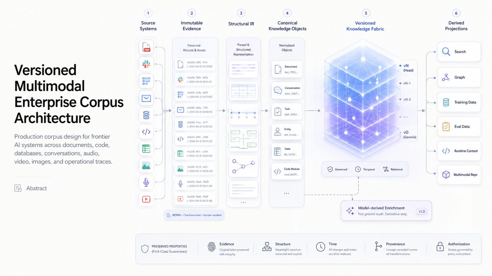

# Versioned Multimodal Enterprise Corpus Architecture for Frontier AI Systems



## Abstract

Modern enterprise AI systems cannot treat organizational information as a collection of text documents transformed into fixed-size chunks and embeddings. PDFs, collaborative documents, Slack conversations, tickets, email, databases, code, meetings, videos, recordings, spreadsheets, images, and operational traces encode fundamentally different structural, temporal, relational, security, and provenance semantics.

The corpus therefore must be designed as an independently governed **versioned evidence and knowledge substrate**

[
\mathcal C_v
]

from which retrieval indexes, graph representations, training datasets, evaluation datasets, multimodal representations, and runtime context are derived.

The proposed architecture is:

[
\boxed{
\text{Source Systems}
\rightarrow
\text{Immutable Evidence}
\rightarrow
\text{Structural IR}
\rightarrow
\text{Canonical Knowledge Objects}
\rightarrow
\text{Versioned Knowledge Fabric}
\rightarrow
\text{Derived Projections}
}
]

The system preserves five properties that conventional RAG ingestion pipelines frequently destroy:

[
\boxed{
\text{Evidence}
+
\text{Structure}
+
\text{Time}
+
\text{Provenance}
+
\text{Authorization}
}
]

Semantic enrichment produced by frontier models is represented as a versioned derivative rather than ground truth. Search indexes are materialized projections rather than canonical state. Production traces form a second **experience corpus** that supports evaluation, failure analysis, and iterative system improvement.

The resulting corpus behaves closer to a distributed temporal knowledge system than a document database.

---

# 1. Objective

The objective is to construct a corpus substrate capable of representing enterprise information across:

[
\mathcal S=
{
PDF,
DOCX,
Slides,
Slack,
Tickets,
Email,
Video,
Audio,
Meetings,
Tables,
Spreadsheets,
Code,
Images,
Logs
}
]

while maintaining:

[
\begin{aligned}
&\text{source fidelity},\
&\text{structural fidelity},\
&\text{temporal fidelity},\
&\text{identity consistency},\
&\text{provenance closure},\
&\text{authorization equivalence},\
&\text{deterministic version reconstruction}.
\end{aligned}
]

The corpus must support heterogeneous consumers without coupling its canonical representation to any specific model, embedding model, vector database, retriever, agent framework, or training pipeline.

Therefore:

[
\boxed{
\mathcal C \neq \text{RAG index}
}
]

and

[
\boxed{
\mathcal C \neq \text{training dataset}.
}
]

Both are projections:

[
D_{\text{RAG}}=\Pi_R(\mathcal C_v),
\qquad
D_{\text{train}}=\Pi_T(\mathcal C_v).
]

---

# 2. System Boundary

This report defines the **data/corpus plane only**.

Included:

[
\begin{aligned}
&\text{source discovery},\
&\text{acquisition},\
&\text{change capture},\
&\text{evidence preservation},\
&\text{parsing},\
&\text{multimodal structural reconstruction},\
&\text{normalization},\
&\text{identity resolution},\
&\text{versioning},\
&\text{lineage},\
&\text{ACL propagation},\
&\text{quality control},\
&\text{semantic enrichment},\
&\text{projection generation}.
\end{aligned}
]

Excluded:

[
\begin{aligned}
&\text{agent planning},\
&\text{tool orchestration},\
&\text{prompt construction},\
&\text{model serving},\
&\text{inference scheduling},\
&\text{agent memory policy}.
\end{aligned}
]

Consumers interact with the corpus through stable projection/query interfaces.

---

# 3. Evidence Classification

Every architectural assertion should be classified.

| Class                     | Meaning                                                       |
| ------------------------- | ------------------------------------------------------------- |
| **Reported**              | Explicitly documented by primary engineering/research sources |
| **Code-verified**         | Observable in released implementation/configuration           |
| **Derived**               | Logical consequence of reported behavior                      |
| **Design recommendation** | Architecture proposed here                                    |
| **Undisclosed**           | Implementation detail unavailable from source                 |

For example, OpenAI reports an internal data agent using schema metadata, lineage, historical table usage, human annotations, code-derived enrichment, institutional knowledge, memory, and runtime inspection. It also reports a daily offline normalization pipeline whose enriched representation is embedded for retrieval, while live warehouse inspection remains available at runtime. ltimodal corpus architecture presented here is therefore a **design recommendation informed by those reported patterns**, not a claim that OpenAI implements this exact architecture.

---

# 4. Design Axioms

## 4.1 Evidence precedes interpretation

For source object (x),

[
B(x)=\operatorname{rawBytes}(x)
]

must exist independently of:

[
Parse(x),\quad
Embed(x),\quad
Summarize(x),\quad
Extract(x).
]

Hence:

[
B(x)\rightarrow P(x)\rightarrow E(x)
]

where (B) is source evidence, (P) is parsed structure, and (E) is semantic enrichment.

Never:

[
x\rightarrow E(x)
]

with (x) discarded.

---

## 4.2 Structure is first-class data

The following transformations are lossy:

[
PDF\rightarrow String,
]

[
SlackThread\rightarrow [MessageStrings],
]

[
Video\rightarrow Transcript,
]

[
EmailConversation\rightarrow BodyText.
]

The canonical representation therefore preserves native structure before generating textual projections.

---

## 4.3 Corpus state is immutable and version-addressable

Published corpus version (v) satisfies:

[
\mathcal C_v=\operatorname{immutable}.
]

Changes produce:

[
\mathcal C_v+\Delta_v\rightarrow\mathcal C_{v+1}.
]

Published corpus versions are never modified in place.

---

## 4.4 Model outputs are derived evidence

For model transformation (f_{\theta}),

[
y=f_{\theta}(x)
]

the system stores:

[
(
x,
y,
\theta,
prompt,
configuration,
timestamp
)
]

rather than replacing (x) by (y).

This is essential because model interpretations change as:

[
\theta_1\rightarrow\theta_2\rightarrow\theta_3.
]

---

## 4.5 Retrieval infrastructure is disposable

For any projection (P_k),

[
P_k=\Pi_k(\mathcal C_v).
]

Therefore:

[
Delete(P_k)
\not\Rightarrow
Delete(\mathcal C_v).
]

A vector database can be rebuilt.

The canonical corpus cannot.

---

# 5. Formal Corpus Model

Define corpus version:

[
\boxed{
\mathcal C_v=
(
E_v,
O_v,
R_v,
T_v,
A_v,
P_v,
Q_v
)
}
]

where:

[
E_v=\text{source evidence},
]

[
O_v=\text{canonical knowledge objects},
]

[
R_v=\text{relations},
]

[
T_v=\text{temporal state},
]

[
A_v=\text{authorization state},
]

[
P_v=\text{provenance DAG},
]

[
Q_v=\text{quality state}.
]

A canonical knowledge object is:

[
\boxed{
K_i=
(
I_i,
C_i,
S_i,
T_i,
R_i,
P_i,
A_i,
M_i,
Q_i
)
}
]

with:

* (I_i): canonical identity
* (C_i): content
* (S_i): native structural representation
* (T_i): temporal metadata
* (R_i): relationships
* (P_i): provenance
* (A_i): access policy
* (M_i): semantic metadata
* (Q_i): quality/confidence state

Thus the fundamental corpus unit is not:

[
chunk_i
]

but:

[
KnowledgeObject_i.
]

---

# 6. End-to-End State Transition

The corpus construction pipeline is:

[
D_0\rightarrow
D_1\rightarrow
D_2\rightarrow
D_3\rightarrow
D_4\rightarrow
D_5\rightarrow
D_6\rightarrow
D_7\rightarrow
D_8\rightarrow
D_9\rightarrow
D_{10}\rightarrow
D_{11}.
]

Where:

[
D_0=\text{Source Registry}
]

[
D_1=\text{Acquisition/CDC}
]

[
D_2=\text{Immutable Evidence}
]

[
D_3=\text{Structural Parsing}
]

[
D_4=\text{Canonical IR}
]

[
D_5=\text{Identity Resolution}
]

[
D_6=\text{Temporalization}
]

[
D_7=\text{Authorization/Governance}
]

[
D_8=\text{Semantic Enrichment}
]

[
D_9=\text{Graph/Lineage Construction}
]

[
D_{10}=\text{Quality + Deduplication}
]

[
D_{11}=\text{Atomic Corpus Publication}.
]

Only after (D_{11}):

[
\mathcal C_v
\rightarrow
{
P_{\text{lex}},
P_{\text{vector}},
P_{\text{graph}},
P_{\text{train}},
P_{\text{eval}},
P_{\text{analytics}}
}.
]

---

# 7. Source Registry

Each source requires an explicit contract:

[
S_i=
(
sid,
type,
owner,
authority,
connector,
schema,
ACL,
sync,
retention
).
]

Example logical representation:

```yaml
source_id: slack://research/model-architecture
source_type: slack_channel

ownership:
  domain: research
  authority: primary-discussion

synchronization:
  mode: change-stream
  ordering: source-sequence

governance:
  acl_policy: inherit
  retention: permanent

processing:
  parser: slack-structural-v4
  schema: corpus-message-v7
```

The registry converts connectors from implicit infrastructure into versioned system contracts.

---

# 8. Acquisition and CDC

A production corpus should not repeatedly reprocess the full source universe.

Represent state evolution as:

[
S_t=S_0+\sum_{k=1}^{t}\Delta_k.
]

Each event is:

[
e_k=
(
source,
object,
revision,
operation,
sequence,
eventTime,
payloadRef
)
]

with:

[
operation\in
{
CREATE,
UPDATE,
DELETE,
MOVE,
ACL_CHANGE
}.
]

The ingestion system should normally provide:

[
\boxed{
\text{at-least-once delivery}
+
\text{idempotent application}
}
]

rather than attempting expensive end-to-end exactly-once semantics.

Define transformation identity:

[
J=
H(
sourceID
\Vert
objectID
\Vert
revision
\Vert
stage
\Vert
transformVersion
).
]

Then:

[
Apply(J)^n=Apply(J).
]

Duplicate events therefore converge to the same state.

---

# 9. Immutable Evidence Store

For source object (x_i):

[
b_i=\operatorname{bytes}(x_i)
]

[
h_i=H(b_i).
]

Evidence record:

[
E_i=
(
h_i,
source_i,
nativeID_i,
revision_i,
eventTime_i,
ingestTime_i,
metadata_i,
blob_i
).
]

The required invariant is:

[
\forall d\in Derived:
\exists e\in Evidence:
d\leadsto e.
]

No derived object is permitted without a lineage path to evidence.

This property makes:

[
\text{parser replacement},
\quad
\text{model replacement},
\quad
\text{reindexing},
\quad
\text{audit},
\quad
\text{rollback}
]

possible without reacquiring source data.

---

# 10. Multimodal Structural IR

A generic intermediate representation is:

[
G_x=(V_x,E_x,A_x)
]

where:

[
V_x=\text{content/structural nodes},
]

[
E_x=\text{typed relations},
]

[
A_x=\text{attributes}.
]

The IR is modality-neutral at the graph level but modality-aware at the node/edge schema level.

---

# 11. PDF and Document Representation

For PDF:

[
Document
\rightarrow
Page
\rightarrow
Region
\rightarrow
Block.
]

Block types:

[
BlockType\in
{
Heading,
Paragraph,
List,
Table,
Figure,
Equation,
Caption,
Footnote
}.
]

Each spatial block carries:

[
bbox=(x_0,y_0,x_1,y_1)
]

and ordering:

[
v_i\xrightarrow{NEXT}v_{i+1}.
]

Tables retain:

[
(row,column,rowspan,colspan)
]

rather than flattening into concatenated text.

Figures retain:

[
Figure
\xrightarrow{CAPTION}
Caption
]

and:

[
Figure
\xrightarrow{LOCATED_ON}
Page.
]

DOCX/Google Docs additionally preserve:

[
Section,
Paragraph,
List,
Table,
Comment,
Revision,
Author.
]

Therefore document meaning becomes a function of:

[
M_{doc}
=======

f(
text,
hierarchy,
layout,
tables,
figures,
revisions
).
]

---

# 12. Slack Representation

Slack should be modeled as a conversation graph:

[
Workspace
\rightarrow
Channel
\rightarrow
Thread
\rightarrow
Message.
]

Typed relations include:

[
Message_i
\xrightarrow{REPLY_TO}
Message_j
]

[
Message_i
\xrightarrow{MENTIONS}
Person_k
]

[
Message_i
\xrightarrow{ATTACHES}
Artifact_l.
]

Temporal ordering is:

[
m_1\prec m_2\prec\ldots\prec m_n.
]

Retrieval may later derive thread projections:

[
P_{\text{thread}}
=================

\Pi(Thread)
]

without destroying individual message identity.

OpenAI reports incorporating institutional information from systems including Slack and documents into its data-agent context architecture. Representation

Ticket systems encode executable organizational state.

Define:

[
Issue=
(
description,
state(t),
priority(t),
owner(t),
comments,
dependencies,
attachments
).
]

State evolution must remain explicit:

[
OPEN
\rightarrow
IN_PROGRESS
\rightarrow
REVIEW
\rightarrow
RESOLVED.
]

A historical ticket therefore cannot be represented only by its latest text.

For event history:

[
Issue_t=
Issue_{t-1}
+
Event_t.
]

Relations may include:

[
Issue\xrightarrow{BLOCKS}Issue
]

[
Issue\xrightarrow{FIXED_BY}PullRequest
]

[
Issue\xrightarrow{CAUSED_BY}Incident.
]

---

# 14. Email Representation

Email requires MIME-aware reconstruction:

[
Conversation
\rightarrow
Message
\rightarrow
MIMEPart.
]

Each message contains:

[
(
sender,
recipients,
sentTime,
headers,
body,
attachments
).
]

Thread relations:

[
m_i\xrightarrow{IN_REPLY_TO}m_j.
]

Critically, decompose body content into:

[
Body=
NewContent
\cup
QuotedHistory
\cup
Signature.
]

Otherwise the same historical conversation is repeatedly replicated across messages and subsequently duplicated in embeddings and retrieval.

---

# 15. Video and Recording Representation

The lossy transformation

[
Video\rightarrow Transcript
]

must not be canonical.

Instead:

[
Video
\rightarrow
VideoTrack\cup AudioTrack.
]

Visual decomposition:

[
VideoTrack
\rightarrow
Scene
\rightarrow
Shot
\rightarrow
Frames.
]

Audio decomposition:

[
AudioTrack
\rightarrow
SpeakerTurn
\rightarrow
Utterance.
]

All objects share temporal coordinates:

[
[t_s,t_e].
]

Cross-modal relations then become possible:

[
Utterance_{17}
\xleftrightarrow{ALIGNED_WITH}
FrameRange_{781:918}.
]

Likewise:

[
SpeakerTurn_{11}
\xleftrightarrow{DISCUSSES}
Slide_{7}.
]

This is necessary for multimodal frontier systems because semantic evidence may exist visually while being referenced linguistically.

---

# 16. Canonical Normalization

After modality-specific decoding, every object is normalized into a common envelope:

```yaml
identity:
  corpus_id: ...
  object_type: ...

source:
  source_id: ...
  native_id: ...
  revision: ...

content:
  text: ...
  binary_refs: ...

structure:
  parent: ...
  children: [...]
  geometry: ...
  ordering: ...

temporal:
  event_time: ...
  valid_from: ...
  valid_to: ...

actors:
  author: ...

relations:
  - type: ...
    target: ...

provenance:
  evidence_hash: ...
  parser_version: ...

authorization:
  policy_ref: ...

semantics:
  enrichment_refs: [...]

quality:
  parser_confidence: ...
```

The canonical schema should remain model-independent.

---

# 17. Identity Resolution

The same real-world entity frequently appears under multiple source identities:

[
{
@alice,
alice@corp,
github/alice,
jira/user-412
}.
]

Define:

[
Resolve:
ExternalIdentity
\rightarrow
CanonicalEntity.
]

Preserve both:

[
CanonicalEntity
\xleftarrow{IDENTITY_OF}
ExternalIdentity.
]

Do not overwrite external identifiers.

The same process applies to:

[
Person,
Project,
Service,
Dataset,
Repository,
Customer,
Model,
Incident.
]

For entity pair (e_i,e_j), identity resolution may estimate:

[
P(e_i=e_j\mid F_{ij})
]

but automatic merge should require:

[
P>\tau_{\text{merge}}
]

with an ambiguity interval:

[
\tau_{\text{review}}
<
P
<
\tau_{\text{merge}}
]

routed for verification.

Incorrect identity merges are significantly more damaging than missed merges because they contaminate downstream graph traversal and retrieval.

---

# 18. Temporal Semantics

Enterprise knowledge is inherently temporal.

For object (o):

[
o^{(1)}
\rightarrow
o^{(2)}
\rightarrow
\ldots
\rightarrow
o^{(n)}.
]

Each version carries valid time:

[
T_v=[t_{\text{from}},t_{\text{to}})
]

and system time:

[
T_s=t_{\text{ingested}}.
]

Hence use bitemporal semantics:

[
\boxed{
T=(T_{\text{valid}},T_{\text{system}})
}
]

where possible.

This permits both:

[
Query(\mathcal C,t_{\text{historical}})
]

and:

[
Query(\mathcal C,t_{\text{current}}).
]

The distinction is critical for questions such as:

> What was believed before incident (I)?

versus:

> What is currently known about incident (I)?

---

# 19. Authorization Model

Authorization must be carried through the corpus.

For object (x):

[
ACL(x)=
(
subjects,
roles,
capabilities,
conditions,
validity
).
]

For derived object (d=f(x)):

[
ACL(d)
\preceq
ACL(x).
]

A transformation must never widen access implicitly.

For multi-parent transformation:

[
d=f(x_1,\ldots,x_n),
]

safe authorization is bounded by source visibility:

[
ACL(d)
\subseteq
\bigcap_{i=1}^{n}ACL(x_i)
]

unless an explicit approved security policy defines another composition rule.

OpenAI reports that its internal data agent operates through existing access-control mechanisms and exposes only data the user is already authorized to access. architectural rule:

[
Authorization
\rightarrow
CandidateDomain
\rightarrow
Retrieval
]

rather than:

[
GlobalRetrieval
\rightarrow
PostFilter.
]

---

# 20. Semantic Enrichment

Structural normalization precedes semantic inference.

For knowledge object (K_i):

[
M_i=f_{\theta}(K_i)
]

may include:

[
M_i=
{
summary,
entities,
claims,
keywords,
topics,
relations,
embedding
}.
]

Each enrichment is recorded as:

[
E=
(
modelID,
modelVersion,
inputHash,
promptHash,
parameters,
output,
timestamp
).
]

Thus:

[
K_i\not\equiv M_i.
]

Re-enrichment can run:

[
M_i^{(1)}
\rightarrow
M_i^{(2)}
]

without mutating evidence or structure.

---

# 21. Meaning from Usage and Code

Static content frequently under-specifies semantics.

A stronger model is:

[
Meaning(x)
==========

f(
content,
creation,
usage,
relations,
history
).
]

For tables:

[
Meaning(Table)
==============

f(
schema,
lineage,
queries,
ETL,
code,
annotations
).
]

OpenAI reports using code-derived knowledge to enrich understanding of internal data structures, in addition to schema, lineage, usage history, and human annotations. generalizes:

[
Meaning(Document)
=================

f(
content,
references,
revisionHistory,
authors
)
]

[
Meaning(Ticket)
===============

f(
description,
discussion,
commits,
deployments
)
]

[
Meaning(Service)
================

f(
code,
runbooks,
incidents,
metrics,
dependencies
).
]

This produces significantly richer enterprise semantics than embedding isolated text.

---

# 22. Provenance DAG

Define provenance:

[
G_P=(V_P,E_P).
]

Supported edges should include:

[
DERIVED_FROM,
]

[
EXTRACTED_FROM,
]

[
SUMMARIZES,
]

[
TRANSFORMED_FROM,
]

[
SUPERSEDES,
]

[
CONFIRMS.
]

For any generated claim (c):

[
c\rightarrow d_k\rightarrow\ldots\rightarrow e_j
]

must terminate at immutable evidence (e_j).

Required invariant:

[
\boxed{
LineageCoverage=1
}
]

for production derived objects.

This makes evidence attribution a property of the corpus itself rather than a feature reconstructed later by a retriever.

---

# 23. Cross-Source Knowledge Graph

Let:

[
G_K=(V,E)
]

with:

[
V=
{
Person,
Team,
Project,
Document,
Message,
Ticket,
Dataset,
Table,
Repository,
Commit,
Meeting,
Incident,
Claim
}.
]

Possible edges:

[
AUTHORED,
]

[
MENTIONS,
]

[
REPLIES_TO,
]

[
DEPENDS_ON,
]

[
IMPLEMENTS,
]

[
FIXES,
]

[
DERIVED_FROM,
]

[
SUPERSEDES.
]

Example:

[
Incident_{42}
\xrightarrow{DISCUSSED_IN}
SlackThread_{91}
]

[
Incident_{42}
\xrightarrow{TRACKED_BY}
Ticket_{417}
]

[
Ticket_{417}
\xrightarrow{FIXED_BY}
PR_{88}
]

[
PR_{88}
\xrightarrow{CHANGES}
Service_{Payments}.
]

This graph is part of canonical enterprise state.

GraphRAG is merely one downstream consumer:

[
GraphRAG=\Pi_{\text{graph-retrieval}}(G_K).
]

---

# 24. Deduplication

Deduplication should be hierarchical.

### Exact

[
H(x_i)=H(x_j).
]

### Structural

[
D_{\text{struct}}(x_i,x_j)<\epsilon.
]

### Semantic

[
sim(E_i,E_j)>\tau.
]

### Provenance-aware

[
x_j
\xrightarrow{DERIVED_FROM}
x_i.
]

Examples include:

[
GoogleDoc\rightarrow PDFExport,
]

[
SlackMessage\rightarrow TicketDescription,
]

[
MeetingTranscript\rightarrow MeetingSummary.
]

Do not necessarily delete duplicates.

Instead preserve relations:

[
DUPLICATE_OF
]

or:

[
DERIVED_FROM.
]

Repeated appearance may itself encode organizational significance.

---

# 25. Authority and Evidential Status

Semantic similarity does not imply authority.

Represent:

[
Authority(K_i)=a_i.
]

Object states may include:

[
{
authoritative,
primary,
discussion,
generated,
deprecated,
superseded,
historical
}.
]

For a domain-specific ordering one might define:

[
ApprovedSpecification

>

FinalTicket

>

EngineeringDiscussion

>

GeneratedSummary.
]

This ordering must be policy-driven rather than globally hard-coded.

Retrieval systems can then compute:

[
Score(x,q)
==========

\alpha R(x,q)
+
\beta A(x)
+
\gamma F(x)
+
\delta Q(x),
]

where:

* (R): query relevance
* (A): authority
* (F): freshness
* (Q): quality

instead of optimizing exclusively for embedding similarity.

---

# 26. Corpus Versioning

Corpus version (v) is described by manifest:

[
M_v=
(
S_v,
E_v,
T_v,
P_v,
Q_v,
A_v
).
]

Where:

* (S_v): source snapshot manifests
* (E_v): evidence hashes
* (T_v): transformation versions
* (P_v): parser/enrichment versions
* (Q_v): quality policy
* (A_v): authorization snapshot/policy

Corpus identifier:

[
CID_v=H(M_v).
]

Deterministic reconstruction requires:

[
\boxed{
M_v+Evidence+Transformations
\Rightarrow
\mathcal C_v.
}
]

If this equation does not hold, corpus versioning is metadata labeling rather than genuine reproducibility.

---

# 27. Atomic Publication

Production state should not expose partially constructed corpus versions.

Construct:

[
\mathcal C_{v+1}^{candidate}.
]

Run gates:

[
G=
G_{\text{schema}}
\land
G_{\text{lineage}}
\land
G_{\text{ACL}}
\land
G_{\text{quality}}
\land
G_{\text{integrity}}.
]

Only when:

[
G=1
]

perform:

[
HEAD\leftarrow CID_{v+1}.
]

Rollback:

[
HEAD\leftarrow CID_v.
]

Publication is therefore an atomic metadata operation rather than a destructive data migration.

---

# 28. Distributed Processing Semantics

Corpus processing is naturally partitionable by:

[
partitionKey=H(sourceID,objectID).
]

For each transformation stage:

[
Input
\rightarrow
Worker
\rightarrow
Output
\rightarrow
Checkpoint.
]

Workers should be:

[
stateless
]

with persistent state externalized to:

[
EvidenceStore,
MetadataStore,
Queue,
CheckpointStore.
]

Retries satisfy:

[
retry(x)
\Rightarrow
same\ deterministic\ artifact
]

for deterministic stages.

Model-generated stages require captured generation configuration so that nondeterminism is explicit rather than hidden.

Backpressure condition:

[
\lambda_{in}>\mu_{stage}
]

must produce bounded queuing:

[
Q(t)\le Q_{\max}.
]

Otherwise a failing OCR or model-enrichment stage can cause unbounded resource growth upstream.

---

# 29. Failure Domains

Failure isolation should occur per source, object, and transformation stage.

State machine:

[
DISCOVERED
\rightarrow
ACQUIRED
\rightarrow
PARSED
\rightarrow
NORMALIZED
\rightarrow
ENRICHED
\rightarrow
VALIDATED
\rightarrow
PUBLISHED.
]

Failure transition:

[
S_i
\xrightarrow{failure}
QUARANTINED.
]

A malformed PDF must not prevent:

[
\mathcal C_{v+1}
]

from incorporating millions of unrelated valid objects, unless publication policy explicitly requires strict completeness.

Errors should be typed:

[
\begin{aligned}
&SourceUnavailable,\
&AcquisitionFailure,\
&UnsupportedFormat,\
&ParseFailure,\
&SchemaViolation,\
&IdentityConflict,\
&ACLConflict,\
&EnrichmentFailure,\
&LineageViolation.
\end{aligned}
]

---

# 30. Storage Architecture

A frontier corpus should not force heterogeneous access patterns into one database.

Use three logically separated storage planes.

## 30.1 Evidence Plane

Optimized for:

[
large\ immutable\ objects
]

including:

[
PDF,
DOCX,
video,
audio,
images,
email MIME,
source exports.
]

Requirements:

[
content-addressability,
durability,
version retention,
cheap capacity,
lifecycle policy.
]

---

## 30.2 Metadata and Control Plane

Maintains:

[
sources,
objects,
versions,
relations,
ACLs,
lineage,
manifests,
jobs,
quality,
publication state.
]

This plane requires transactional consistency for control metadata.

A relational system is appropriate for substantial portions of this state because relationships and integrity constraints dominate many access patterns.

OpenAI reports scaling a large read-heavy PostgreSQL deployment to millions of QPS using a single primary with nearly 50 read replicas, while moving shardable write-heavy workloads to horizontally partitioned systems. It also emphasizes workload isolation, caching, connection management, query optimization, and multilayer rate limiting. nclusion is not:

[
\text{PostgreSQL solves every corpus workload}.
]

It is:

[
\boxed{
StorageSelection=
f(
consistency,
writePattern,
readPattern,
partitionability,
latency
)
}
]

with workload isolation as the primary systems principle.

---

# 31. Projection Plane

From published corpus:

[
\mathcal C_v
]

derive:

[
\Pi(\mathcal C_v)=
{
P_L,
P_V,
P_G,
P_S,
P_T,
P_{ML}
}.
]

Where:

### Lexical

[
P_L\rightarrow \text{inverted index/BM25}.
]

### Dense semantic

[
P_V\rightarrow
{
E_{document},
E_{section},
E_{block},
E_{entity}
}.
]

### Graph

[
P_G\rightarrow G_K.
]

### Structural

[
P_S\rightarrow
AST/DOM/Table/JSON/document-tree.
]

### Temporal

[
P_T(t)\rightarrow\mathcal C_v|_t.
]

### Model-development

[
P_{ML}\rightarrow
{
training,
SFT,
eval,
preference,
distillation
}.
]

Every projection includes:

[
sourceCorpusVersion=CID_v.
]

---

# 32. Offline Corpus vs Live Operational State

Do not continuously rematerialize static semantic representations for every rapidly changing operational value.

Define:

[
K_t=
C_t^{offline}
\cup
S_t^{live}.
]

Offline corpus:

[
C_t^{offline}
]

contains durable:

[
documents,
historical conversations,
definitions,
lineage,
policies,
semantic enrichments.
]

Live state:

[
S_t^{live}
]

contains:

[
current metrics,
active incidents,
latest deployments,
live table contents,
present queue states.
]

OpenAI reports a similar architectural distinction: normalized context is prepared offline and retrieved when useful, while runtime queries can inspect current warehouse/data-platform state. t-engineering guidance independently argues for selectively loading high-value information and using runtime, just-in-time retrieval because model context remains finite and larger context can introduce irrelevant information. xed{
Corpus\ storage
\neq
Model\ context.
}
]

Corpus completeness and context minimality are compatible objectives.

---

# 33. Knowledge Corpus and Experience Corpus

A frontier enterprise AI platform should maintain two separate corpus classes.

## Knowledge corpus

[
\mathcal C_K
============

{
documents,
communication,
code,
data,
media,
metadata
}.
]

## Experience corpus

[
\mathcal C_E
============

{
traces,
failures,
humanCorrections,
evaluations,
approvedOutputs
}.
]

Full system corpus:

[
\boxed{
\mathcal C=
\mathcal C_K
\cup
\mathcal C_E.
}
]

Experience objects should preserve:

[
Trace=
(
input,
evidence,
transformations,
actions,
outputs,
verification,
correction
).
]

OpenAI's 2026 Tax AI engineering report explicitly describes production traces preserving the path from source documents through extraction and downstream outputs, with practitioner corrections transformed into structured findings and evaluation targets. ounded basis for treating production execution itself as a durable corpus asset.

---

# 34. Quality Model

Corpus quality should be measurable.

Define:

[
Q(\mathcal C)=
\sum_i w_iQ_i.
]

Core dimensions:

[
Q=
{
Q_{integrity},
Q_{coverage},
Q_{freshness},
Q_{structure},
Q_{provenance},
Q_{ACL},
Q_{semantic}
}.
]

Examples:

### Parse success

[
Q_{parse}
=========

\frac{N_{valid\ parsed}}
{N_{processable}}.
]

### Lineage coverage

[
Q_{lineage}
===========

\frac{N_{derived-with-provenance}}
{N_{derived}}.
]

Required:

[
Q_{lineage}=1.
]

### ACL coverage

[
Q_{ACL}
=======

\frac{N_{objects-with-policy}}
{N_{objects}}.
]

Production requirement should approach:

[
Q_{ACL}=1.
]

### Freshness

For source (s):

[
F_s=
t_{now}-t_{latest-sync}.
]

### Publication completeness

[
Q_{publication}
===============

\frac{N_{eligible-published}}
{N_{eligible-discovered}}.
]

---

# 35. Recommended SLOs

SLO values must be workload-specific, but the architecture should expose at least:

| Dimension                | Measurement                   |
| ------------------------ | ----------------------------- |
| Acquisition freshness    | (t_{ingest}-t_{source})       |
| Parse throughput         | objects/s, bytes/s            |
| Parse latency            | p50/p95/p99                   |
| Failed transformations   | failure rate/stage            |
| Quarantine rate          | objects/hour                  |
| Lineage coverage         | target (100%)                 |
| ACL propagation coverage | target (100%)                 |
| Projection lag           | (t_{projection}-t_{publish})  |
| Version publication time | snapshot build duration       |
| Recovery point           | last durable CDC sequence     |
| Recovery time            | corpus-plane RTO              |
| Evidence integrity       | hash validation failures      |
| Duplicate ratio          | exact/near/cross-source       |
| Enrichment cost          | tokens/object, compute/object |

These must be observable per:

[
source,
tenant,
modality,
pipelineStage,
corpusVersion.
]

Global averages hide localized corpus failures.

---

# 36. Security Invariants

The corpus must guarantee:

[
ACL(derived)
\not\supset
ACL(source).
]

Deletion/retention policy must propagate through the derivation graph:

[
DeletePolicy(x)
\rightarrow
Descendants(x).
]

Sensitive-data transformations must retain classification:

[
Classification(y)
\ge
Classification(x)
]

for:

[
y=f(x)
]

unless an approved sanitization transformation has formally changed the information content.

Derived embeddings must not be treated as inherently non-sensitive.

---

# 37. Projection Consistency

Given published corpus (C_v), each materialized projection has state:

[
P_k^{(v,r)}
]

where (r) denotes projection implementation version.

Hence:

[
ProjectionID=
H(
CID_v,
projectionType,
projectionVersion,
configuration
).
]

This permits:

[
P_{\text{vector}}^{embed-v1}
]

and:

[
P_{\text{vector}}^{embed-v2}
]

to coexist against the same canonical corpus.

Model migration therefore does not imply corpus migration.

---

# 38. Retrieval Architecture Implication

Although retrieval implementation is downstream, the corpus architecture enables candidate generation across:

[
R(q)=
R_L(q)
\cup
R_V(q)
\cup
R_G(q)
\cup
R_S(q)
\cup
R_T(q).
]

The corpus does not dictate the final ranking strategy.

This matters because a SQL schema question, historical policy question, architecture diagram query, Slack discussion, and video-frame query require fundamentally different retrieval operators.

A single vector index is therefore structurally incapable of representing the complete access semantics of the corpus.

---

# 39. Implementation Dependency Graph

A production implementation should proceed in this dependency order:

[
\boxed{
Evidence
\prec
Structure
\prec
Identity
\prec
Time
\prec
ACL
\prec
Provenance
\prec
Semantics
\prec
Projection
}
]

Meaning:

1. source bytes must exist before semantic enrichment;
2. structural representation must stabilize before chunk/index policy;
3. identity and version semantics must exist before graph construction;
4. ACL propagation must exist before broad retrieval deployment;
5. provenance must exist before machine-generated enrichment becomes production knowledge;
6. indexes are created last.

Reversing this order typically creates migrations where embeddings become accidental canonical state.

---

# 40. Principal Failure Modes

### F1 — Premature flattening

[
StructuredObject\rightarrow String
]

destroys layout, hierarchy, conversation, and relation semantics.

### F2 — Embedding as source of truth

Changing the embedding model becomes equivalent to migrating the corpus.

This is an architectural error.

### F3 — Destructive updates

Latest-state overwrite destroys historical organizational knowledge.

### F4 — ACL post-filtering

Unauthorized objects unnecessarily enter candidate generation and intermediate computation.

### F5 — Model enrichment without provenance

Generated summaries or extracted entities become indistinguishable from source evidence.

### F6 — Cross-source identity contamination

Incorrect entity merges propagate across graph retrieval.

### F7 — One datastore for all workloads

Control metadata, video evidence, embeddings, full-text search, graphs, and high-volume events have different storage economics and consistency requirements.

### F8 — Reprocessing whole corpora

Without CDC:

[
Cost_{update}=O(|\mathcal C|)
]

rather than:

[
Cost_{update}=O(|\Delta|).
]

### F9 — Corpus/context conflation

A complete enterprise corpus should be very large.

Model context should be small and high-signal.

Anthropic explicitly frames context selection as optimization under a finite attention budget and describes hybrid retrieval plus just-in-time discovery as useful patterns for agentic systems. eference Architecture

```text
                        ENTERPRISE SOURCES

 PDF   Docs   Slack   Tickets   Email   Video   Audio
  │      │      │        │        │       │       │
  └──────┴──────┴────────┴────────┴───────┴───────┐
                                                  │
                    Source Registry               │
                ownership / ACL / schema          │
                           │                      │
                           ▼
                 Acquisition + CDC
                           │
                           ▼
              Immutable Evidence Store
             bytes / hashes / revisions
                           │
                           ▼
                Modality-Specific Parsers
                           │
                           ▼
                  Structural IR Layer
        hierarchy / geometry / time / dialogue
                           │
                           ▼
                 Canonical Normalization
                           │
              ┌────────────┼────────────┐
              ▼            ▼            ▼
           Identity       ACL        Temporal
          Resolution   Propagation    Versioning
              └────────────┼────────────┘
                           ▼
                  Semantic Enrichment
                           │
                           ▼
              Knowledge + Lineage Graph
                           │
                           ▼
        Deduplication / Authority / Quality
                           │
                           ▼
                Candidate Corpus Version
                           │
                  Validation Gates
                           │
                           ▼
              ┌─────────────────────────┐
              │ VERSIONED CORPUS C_v    │
              │                         │
              │ Evidence                │
              │ Structure               │
              │ Identity                │
              │ Temporal history        │
              │ Relationships           │
              │ Provenance              │
              │ ACL                     │
              │ Semantic metadata       │
              └────────────┬────────────┘
                           │
                           ▼
                  Projection Factory
            ┌──────────────┼───────────────┐
            ▼              ▼               ▼
         Lexical         Vector           Graph
         Search          Search          Search
            │              │               │
            ├──────────────┼───────────────┤
            ▼              ▼               ▼
        Structural      Temporal        ML/Evals
```

Parallel to the knowledge corpus:

```text
Production Execution
        │
        ▼
 Structured Trace
        │
  ┌─────┼───────────┐
  ▼     ▼           ▼
Failure Correction Verification
  └─────┼───────────┘
        ▼
 EXPERIENCE CORPUS
        │
        ▼
 Eval / Improvement Projections
```

---

# 42. Architectural Result

The complete system should satisfy:

[
\boxed{
\mathcal C_v=
\operatorname{Closure}
(
Evidence,
Structure,
Identity,
Time,
Relations,
Provenance,
Authorization,
Semantics
)
}
]

with:

[
\boxed{
Index=\Pi(\mathcal C_v)
}
]

and never:

[
\boxed{
Index=\mathcal C_v.
}
]

The architectural hierarchy is therefore:

[
\text{Source}
\rightarrow
\text{Evidence}
\rightarrow
\text{Knowledge Object}
\rightarrow
\text{Corpus Version}
\rightarrow
\text{Projection}
\rightarrow
\text{Model Context}.
]

Each layer intentionally loses or specializes information.

The loss is permitted only in the forward direction because the preceding canonical layer remains recoverable.

This produces the principal system invariant:

[
\boxed{
\text{Fidelity in the corpus;}
\qquad
\text{specialization in projections;}
\qquad
\text{minimality in model context.}
}
]

That separation is the critical distinction between a production frontier-AI knowledge infrastructure and a conventional document-ingestion/RAG pipeline.

---

## Source-grounding status

**Reported:** OpenAI's internal data agent uses schema metadata, lineage, historical usage, human annotations, code-derived enrichment, institutional knowledge, memory, offline normalization/embedding, live runtime inspection, and pass-through access controls. AI's PostgreSQL architecture demonstrates large-scale read-heavy PostgreSQL operation, read-replica scaling, workload isolation, migration of shardable write-heavy workloads, caching, connection management, and multilayer rate limiting. AI's Tax AI system uses practitioner feedback and production traces containing source-to-output execution evidence to create structured failure findings and evaluation targets. ropic treats context as a finite resource and describes selective context construction, just-in-time discovery, progressive disclosure, and hybrid retrieval as useful patterns for capable agents. ation:** The canonical KnowledgeObject schema, multimodal Structural IR, evidence-store architecture, bitemporal model, cross-source graph, corpus manifest, projection factory, experience-corpus abstraction, publication protocol, and distributed processing semantics defined in this report.

**Undisclosed:** Exact internal storage schemas, databases, partitioning topology, embedding implementation, parser infrastructure, corpus schemas, and internal scaling characteristics of the cited frontier systems unless explicitly described by those sources.
