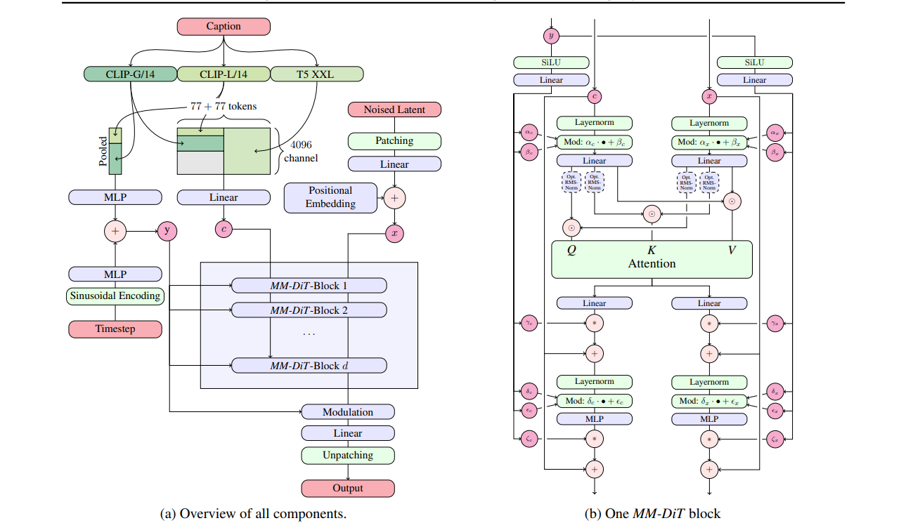
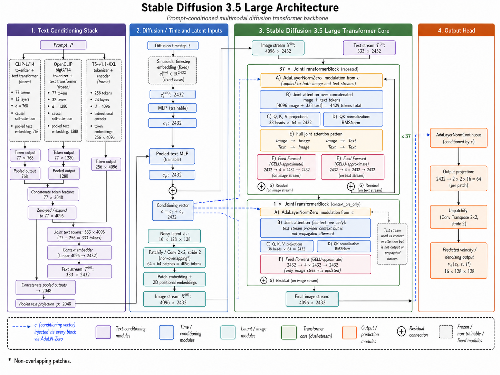

# Exploring MM-DiT for Prompt-Based Image Editing

## Architecture, rectified-flow foundation, attention intervention, and inference mechanics

## 0. Evidence boundary and central correction

**[REPORTED]** This paper does **not** introduce or train a new multimodal diffusion transformer. Its contribution is a systematic analysis of attention inside pretrained MM-DiTs and a **training-free image-editing intervention** applied to frozen Stable Diffusion 3, SD3.5, and Flux.1 models. The proposed editor performs no parameter optimization, no fine-tuning, and no additional flow-matching training. ([arXiv][1])

**[REPORTED]** The underlying generators are rectified-flow models, but this paper provides only a generic rectified-flow/conditional-flow-matching formulation. It does not disclose the exact original pretraining objective, loss weighting, timestep distribution, optimizer, data mixture, latent normalization, conditioning dropout, distillation loss, or model-specific scheduler transformations used for each released SD3/SD3.5/Flux checkpoint. ([arXiv][2])

**[CODE-VERIFIED]** The current public repository is a later refactoring compatible with `diffusers==0.36.0` and `transformers==4.57.3`; its README explicitly states that parts of the refactoring used LLMs. Therefore, code-verified behavior below describes the current public implementation, not necessarily byte-for-byte ICCV experiment code. ([GitHub][3])

---

# 1. End-to-end computational graph

**[DERIVED]** The complete synthetic-image editing process can be represented as

[
\boxed{
\begin{aligned}
P^{\mathrm{src}},P^{\mathrm{tgt}}
&\xrightarrow{\Phi}
C^{\mathrm{src}},C^{\mathrm{tgt}}
\
\epsilon\sim\mathcal N(0,I)
&\longrightarrow
Z_T^{\mathrm{src}}=Z_T^{\mathrm{tgt}}=\epsilon
\
\left(
Z_t^{\mathrm{src}},
C^{\mathrm{src}}
\right)
&\xrightarrow{\mathrm{MM\text{-}DiT}}
\left(
v_t^{\mathrm{src}},
Q_{i,t}^{\mathrm{src}},
K_{i,t}^{\mathrm{src}},
A_{T\rightarrow I,t}^{\mathrm{src}}
\right)
\
\left(
Z_t^{\mathrm{tgt}},
C^{\mathrm{tgt}}
\right)
&\xrightarrow{
Q_{i,t}^{\mathrm{tgt}}\leftarrow Q_{i,t}^{\mathrm{src}},
;
K_{i,t}^{\mathrm{tgt}}\leftarrow K_{i,t}^{\mathrm{src}}
}
\widetilde v_t^{\mathrm{tgt}}
\
Z_{t-\Delta t}^{\mathrm{src}}
&=
\operatorname{Euler}
\left(
Z_t^{\mathrm{src}},v_t^{\mathrm{src}}
\right)
\
\widetilde Z_{t-\Delta t}^{\mathrm{tgt}}
&=
\operatorname{Euler}
\left(
Z_t^{\mathrm{tgt}},\widetilde v_t^{\mathrm{tgt}}
\right)
\
Z_{t-\Delta t}^{\mathrm{tgt}}
&=
M_t\odot\widetilde Z_{t-\Delta t}^{\mathrm{tgt}}
+
(1-M_t)\odot Z_{t-\Delta t}^{\mathrm{src}}
\
I^{\mathrm{src}},I^{\mathrm{tgt}}
&=
\operatorname{VAE.decode}
\left(
Z_0^{\mathrm{src}},Z_0^{\mathrm{tgt}}
\right).
\end{aligned}
}
]

**[REPORTED]** Both branches begin from identical Gaussian noise. During early denoising iterations, the target branch receives source-branch image queries and keys. When local blending is enabled, a mask derived from selected text-to-image attention maps copies the source latent outside the editable region. ([arXiv][2])

---

# 2. Rectified-flow foundation

## 2.1 Direction convention

**[REPORTED]** The paper uses

[
\pi_0=\text{image-latent distribution},
\qquad
\pi_1=\mathcal N(0,I),
]

with

[
X_0\sim\pi_0,
\qquad
X_1\sim\pi_1.
]

The forward interpolation therefore moves from data at (t=0) to noise at (t=1):

[
\boxed{
X_t=(1-t)X_0+tX_1,
\qquad t\in[0,1].
}
]

Generation runs in the reverse direction, from (t=1) to (t=0). ([arXiv][2])

**[DERIVED]** The pathwise velocity is constant:

[
\dot X_t
========

# \frac{\partial X_t}{\partial t}

X_1-X_0.
]

The marginal velocity field is the conditional expectation

[
\boxed{
v^\star_t(x)
============

\mathbb E[
X_1-X_0\mid X_t=x
].
}
]

This is not generally equal to one particular endpoint displacement because multiple pairs ((X_0,X_1)) can pass through the same intermediate state (x). ([arXiv][2])

---

## 2.2 Conditional fields

**[REPORTED]** Conditioning on the noise endpoint (X_1),

[
X_0
===

\frac{X_t-tX_1}{1-t},
]

and therefore

[
\boxed{
v_t(X_t\mid X_1)
================

# \frac{X_1-X_t}{1-t}

X_1-X_0.
}
]

Conditioning on the data endpoint (X_0),

[
X_1
===

\frac{X_t-(1-t)X_0}{t},
]

which gives

[
\boxed{
v_t(X_t\mid X_0)
================

# \frac{X_t-X_0}{t}

X_1-X_0.
}
]

The two expressions describe the same constant pathwise displacement but use opposite known endpoints. ([arXiv][2])

---

## 2.3 Conditional flow-matching objective

**[REPORTED]** The generic training objective stated in the supplement is

[
\boxed{
\mathcal L_{\mathrm{CFM}}(\phi)
===============================

\mathbb E_{
\substack{
t\sim\mathcal U[0,1],\
X_1\sim\pi_1,\
X_t\sim p_t(\cdot\mid X_1)
}
}
\left[
\left|
v_\phi(X_t,t)-v_t(X_t\mid X_1)
\right|_2^2
\right].
}
]

For the linear path,

[
\boxed{
\mathcal L_{\mathrm{CFM}}(\phi)
===============================

\mathbb E
\left[
\left|
v_\phi(X_t,t,\Phi(P))
---------------------

(X_1-X_0)
\right|_2^2
\right].
}
]

The paper calls the model output a velocity or (v)-prediction. ([arXiv][2])

### Tensor-level form

**[DERIVED]** For latent tensors

[
X_0,X_1,X_t
\in
\mathbb R^{B\times C_z\times H_z\times W_z},
]

the training state is

[
\begin{aligned}
X_0&=\operatorname{Encode}(I),\
X_1&=\epsilon,\qquad
\epsilon\sim\mathcal N(0,I),\
t&\in\mathbb R^{B},\
X_t&=(1-t)X_0+tX_1,\
Y_t&=X_1-X_0,\
\widehat Y_t&=v_\phi(X_t,t,\Phi(P)).
\end{aligned}
]

Broadcasting uses

[
t
\mapsto
t[:,\mathrm{None},\mathrm{None},\mathrm{None}].
]

The elementwise loss can be written as

[
\mathcal L
==========

\frac{1}{BC_zH_zW_z}
\sum_{b,c,h,w}
\left(
\widehat Y_{bchw}-Y_{bchw}
\right)^2.
]

---

## 2.4 Neural forward and backward flow

**[DERIVED]** The model-training forward graph is

[
(X_0,X_1,t,P)
\rightarrow
X_t
\rightarrow
\Phi(P)
\rightarrow
v_\phi(X_t,t,\Phi(P))
\rightarrow
\mathcal L.
]

With fixed sampled inputs, the parameter gradient is

[
\boxed{
\nabla_\phi\mathcal L
=====================

2,
\mathbb E
\left[
J_\phi v_\phi(X_t,t,\Phi(P))^\top
\left(
v_\phi(X_t,t,\Phi(P))
---------------------

(X_1-X_0)
\right)
\right].
}
]

**[DERIVED]** The path target and interpolated latent are stop-gradient quantities for ordinary CFM training:

[
X_t
===

\operatorname{sg}
\left(
(1-t)X_0+tX_1
\right),
\qquad
Y_t
===

\operatorname{sg}(X_1-X_0).
]

**[UNDISCLOSED]** The paper does not state whether the VAE or text encoders were frozen during original SD3, SD3.5, or Flux training, nor whether their gradients were jointly optimized with the MM-DiT.

---

# 3. Reverse-time generation

## 3.1 Continuous ODE

**[REPORTED]** The learned vector field defines

[
\boxed{
\frac{dZ_t}{dt}
===============

v_\phi(Z_t,t,\Phi(P)).
}
]

The same vector field is used in either time direction. Generation starts from

[
Z_1\sim\mathcal N(0,I)
]

and integrates toward

[
Z_0\sim\pi_0.
]

Because the integration interval is descending, (dt<0). ([arXiv][2])

## 3.2 Euler discretization

**[DERIVED]** Let

[
1=t_K>t_{K-1}>\cdots>t_0=0.
]

A first-order Euler step is

[
\boxed{
Z_{t_{k-1}}
===========

Z_{t_k}
+
\left(
t_{k-1}-t_k
\right)
v_\phi(Z_{t_k},t_k,\Phi(P)).
}
]

For a uniform grid with step magnitude

[
h=t_k-t_{k-1}>0,
]

this becomes

[
\boxed{
Z_{k-1}=Z_k-hv_\phi(Z_k,t_k,\Phi(P)).
}
]

The negative sign is a consequence of integrating from noise to data.

## 3.3 Discretization error

**[DERIVED]** For a smooth field,

[
Z(t-\Delta t)
=============

## Z(t)

\Delta t,v(Z(t),t)
+
\frac{\Delta t^2}{2}
\left[
\partial_t v+
J_xv,v
\right]
+
O(\Delta t^3).
]

Euler therefore has

[
\text{local truncation error}=O(\Delta t^2),
]

and under standard stability assumptions,

[
\text{global error}=O(\Delta t).
]

**[DERIVED]** Distilled four-step models expose a much larger per-step interval. Consequently, a single early-step attention intervention controls a disproportionately large fraction of the trajectory.

---

# 4. MM-DiT architecture

## 4.1 Architectural variants studied

| Evidence       | Model              | MM-DiT organization                                                             |
| -------------- | ------------------ | ------------------------------------------------------------------------------- |
| **[REPORTED]** | SD3-M              | 24 dual-branch MM-DiT blocks                                                    |
| **[REPORTED]** | SD3.5-L            | 38 dual-branch blocks                                                           |
| **[REPORTED]** | Flux.1             | 19 dual-branch blocks followed by 38 single-branch blocks                       |
| **[REPORTED]** | SD3.5-M            | First 13 blocks add a dedicated image self-attention operation, termed MM-DiT-X |
| **[REPORTED]** | Flux single branch | Uses unified weights for the already concatenated text/image token sequence     |

The paper reports approximately 340M parameters for a dual-branch block configuration and 141M for the corresponding Flux single-branch configuration. ([arXiv][2])

**[CODE-VERIFIED]** The current implementation leaves SD3.5-M’s separate `attn2` image self-attention processor untouched; the proposed controller is registered only on the joint-attention processors.

---

## 4.2 Tokens and dimensions

**[REPORTED]** For the SD3-M analysis, the paper uses:

[
N_i=64\times64=4096
]

image tokens,

[
N_t=77+256=333
]

text tokens from CLIP and T5, and displayed per-head projections of dimension

[
d_h=64.
]

Thus,

[
Q_i,K_i,V_i\in\mathbb R^{4096\times64},
]

[
Q_t,K_t,V_t\in\mathbb R^{333\times64}.
]

Batch and attention-head dimensions are omitted in the paper’s displayed equations. ([arXiv][2])

**[DERIVED]** Restoring these dimensions,

[
Q_i,K_i,V_i
\in
\mathbb R^{B\times H\times N_i\times d_h},
]

[
Q_t,K_t,V_t
\in
\mathbb R^{B\times H\times N_t\times d_h}.
]

The concatenated sequence has length

[
N=N_i+N_t.
]

For SD3-M,

[
N=4429.
]

---

## 4.3 Dual-branch projections

**[DERIVED]** In a dual-branch block, text and image hidden states are projected using modality-specific parameters:

[
\begin{aligned}
Q_i&=H_iW_{Q,i},&
K_i&=H_iW_{K,i},&
V_i&=H_iW_{V,i},
\
Q_t&=H_tW_{Q,t},&
K_t&=H_tW_{K,t},&
V_t&=H_tW_{V,t}.
\end{aligned}
]

The sequence projections are concatenated:

[
Q=
\begin{bmatrix}
Q_i\
Q_t
\end{bmatrix},
\qquad
K=
\begin{bmatrix}
K_i\
K_t
\end{bmatrix},
\qquad
V=
\begin{bmatrix}
V_i\
V_t
\end{bmatrix}.
]

**[REPORTED]** SD3 uses image tokens followed by text tokens. Flux uses the inverse ordering, text followed by image. ([arXiv][2])

**[CODE-VERIFIED]** In the public implementation, Q/K normalization is applied before concatenation. Flux applies rotary positional embeddings before the source/target projection replacement. Consequently, the Flux controller copies normalized, RoPE-transformed query and key vectors.

---

# 5. Exact four-block attention formulation

## 5.1 Score matrix

**[REPORTED]** For SD3 ordering ([I;T]),

[
S
=

# \frac{QK^\top}{\sqrt{d_h}}

\frac{1}{\sqrt{d_h}}
\begin{bmatrix}
Q_iK_i^\top & Q_iK_t^\top\
Q_tK_i^\top & Q_tK_t^\top
\end{bmatrix}.
]

The paper names these blocks

[
\boxed{
S
\sim
\begin{bmatrix}
I2I&T2I\
I2T&T2T
\end{bmatrix}.
}
]

Their shapes are

[
\begin{aligned}
S_{I2I}&\in\mathbb R^{B\times H\times N_i\times N_i},\
S_{T2I}&\in\mathbb R^{B\times H\times N_i\times N_t},\
S_{I2T}&\in\mathbb R^{B\times H\times N_t\times N_i},\
S_{T2T}&\in\mathbb R^{B\times H\times N_t\times N_t}.
\end{aligned}
]

([arXiv][2])

## 5.2 Global row-wise softmax

**[DERIVED]** The four blocks are **not independently normalized**:

[
A
=

\operatorname{softmax}_{\mathrm{keys}}(S).
]

The block matrices

[
A_{I2I},A_{T2I},A_{I2T},A_{T2T}
]

are slices of the globally normalized matrix.

For every image-query row (n),

[
\boxed{
\sum_{m=1}^{N_i}A_{I2I}[n,m]
+
\sum_{j=1}^{N_t}A_{T2I}[n,j]
============================

1.

}
]

For every text-query row (j),

[
\boxed{
\sum_{m=1}^{N_i}A_{I2T}[j,m]
+
\sum_{r=1}^{N_t}A_{T2T}[j,r]
============================

1.

}
]

This coupling is why replacing a score submatrix must occur before the final softmax if the original normalization semantics are to be preserved.

---

## 5.3 Attention outputs

**[DERIVED]** The image output is

[
\boxed{
O_i
===

A_{I2I}V_i
+
A_{T2I}V_t.
}
]

The text output is

[
\boxed{
O_t
===

A_{I2T}V_i
+
A_{T2T}V_t.
}
]

Thus:

* (I2I) transports image values into image representations.
* (T2I) transports text values into image representations.
* (I2T) transports image values into text representations.
* (T2T) transports text values into text representations.

This is genuinely bidirectional multimodal communication, unlike conventional U-Net cross-attention where image queries consume text keys/values without a reciprocal text update. ([arXiv][1])

---

# 6. Empirical roles of the four blocks

## 6.1 I2I

**[REPORTED]** PCA of I2I attention reveals spatial and geometric components resembling U-Net self-attention. The paper associates I2I with preservation of layout, geometry, and source-image attributes. ([arXiv][2])

## 6.2 T2I

**[REPORTED]** T2I provides token-specific image-region localization and is used to construct local-editing masks. The paper reports that T5-derived maps are generally more precise than CLIP-derived maps in the SD3 series. ([arXiv][2])

**[DERIVED]** For a selected text token (j), the spatial map

[
m_j[n]
======

A_{T2I}[n,j],
\qquad n=1,\ldots,N_i,
]

does not obey a spatial sum-to-one constraint:

[
\sum_n m_j[n]
\neq1
]

in general. Multiple image locations can therefore carry high attention for the same textual token.

## 6.3 I2T

**[REPORTED]** The paper finds I2T less effective than T2I for spatial localization because image locations compete within each text-query row under row-wise softmax. ([arXiv][2])

**[DERIVED]** For one text query (j),

[
\sum_{m=1}^{N_i}A_{I2T}[j,m]
\le1.
]

Hence, image positions compete for a fixed probability mass. This is the mathematically precise reason that a column- or row-derived I2T localization map can become diluted.

## 6.4 T2T

**[REPORTED]** T2T is primarily identity-like, with strong responses around special tokens, sequence boundaries, encoder transitions, and meaningful prompt endings. Transferring T2T alone has comparatively little effect on image preservation. ([arXiv][2])

---

# 7. The proposed projection intervention

## 7.1 Two synchronized branches

**[REPORTED]** Let (s) denote the source branch and (e) the edited target branch:

[
Z_T^s=Z_T^e=\epsilon,
\qquad
\epsilon\sim\mathcal N(0,I).
]

The branches differ only in their prompts:

[
C^s=\Phi(P^s),
\qquad
C^e=\Phi(P^e).
]

Both are evaluated at every reverse-flow step. ([arXiv][2])

## 7.2 Source Q/K injection

**[REPORTED]** During the initial editing interval, the method performs

[
\boxed{
Q_i^e\leftarrow Q_i^s,
\qquad
K_i^e\leftarrow K_i^s.
}
]

The target text projections and all target values remain unchanged:

[
Q_t^e,;K_t^e,;V_t^e,;V_i^e
\quad\text{remain target-branch tensors}.
]

([arXiv][2])

## 7.3 Exact edited score matrix

**[DERIVED]** After replacement, target logits become

[
\boxed{
\widetilde S^e
==============

\frac{1}{\sqrt{d_h}}
\begin{bmatrix}
Q_i^sK_i^{s\top}
&
Q_i^sK_t^{e\top}
\
Q_t^eK_i^{s\top}
&
Q_t^eK_t^{e\top}
\end{bmatrix}.
}
]

Therefore,

[
\begin{aligned}
\widetilde S_{I2I}^{e}
&=
S_{I2I}^{s},
\
\widetilde S_{T2I}^{e}
&=
Q_i^sK_t^{e\top}/\sqrt{d_h},
\
\widetilde S_{I2T}^{e}
&=
Q_t^eK_i^{s\top}/\sqrt{d_h},
\
\widetilde S_{T2T}^{e}
&=
S_{T2T}^{e}.
\end{aligned}
]

The method exactly transplants source I2I logits, but it also constructs hybrid source-image/target-text cross-modal logits.

## 7.4 Edited output

**[DERIVED]**

[
\widetilde A^e
==============

\operatorname{softmax}(\widetilde S^e),
]

and

[
\boxed{
\widetilde O_i^e
================

\widetilde A_{I2I}^eV_i^e
+
\widetilde A_{T2I}^eV_t^e.
}
]

[
\boxed{
\widetilde O_t^e
================

\widetilde A_{I2T}^eV_i^e
+
A_{T2T}^eV_t^e.
}
]

**[DERIVED]** The method does **not** copy source values. It copies the source image-query/key geometry while target values carry target-branch content. The intervention is therefore more accurately described as an **attention-similarity or routing-topology transplant**, not direct feature copying.

---

# 8. Why full Q/K replacement fails

**[REPORTED]** Replacing all target queries and keys would produce

[
Q^e\leftarrow Q^s,
\qquad
K^e\leftarrow K^s,
]

including

[
Q_t^e\leftarrow Q_t^s,
\qquad
K_t^e\leftarrow K_t^s.
]

The resulting source T2T attention would then be multiplied by target text values (V_t^e). The paper identifies this as text–value misalignment, especially severe for T5 prompts with different subword tokenizations or different sequence semantics. ([arXiv][2])

**[DERIVED]** Full replacement gives

[
O_t^{\mathrm{misaligned}}
=========================

A_{I2T}^{s}V_i^e
+
A_{T2T}^{s}V_t^e.
]

The attention row indexed by source token position (j) is applied to a target value at position (j), although that target position may represent another subword, another word, or padding.

**[REPORTED]** Restricting replacement to (Q_i,K_i) leaves the T2T score block intact and removes the requirement for explicit source-to-target token correspondence. ([arXiv][2])

**[DERIVED]** “T2T remains intact” is a block-local statement. Because (I2T) is modified, the target text hidden state can still be altered after the attention operation, which can indirectly change subsequent blocks’ target text projections.

---

# 9. I2I replacement versus Q/K replacement

**[REPORTED]** The paper tests two variants:

[
A_{I2I}^{e}\leftarrow A_{I2I}^{s}
]

and

[
Q_i^e\leftarrow Q_i^s,\qquad
K_i^e\leftarrow K_i^s.
]

They produce qualitatively similar results. The projection variant is preferred because it remains compatible with fused scaled-dot-product-attention kernels. ([arXiv][2])

**[CODE-VERIFIED]** The public implementation distinguishes projection methods from attention-region methods. Projection replacement uses PyTorch SDPA; explicit I2I/T2I/I2T/T2T replacement computes logits manually, replaces a pre-softmax region, then applies global softmax.

**[REPORTED]** Materializing and modifying the attention matrix can make inference as much as approximately three times slower for some reported models because optimized SDPA kernels cannot be used. ([arXiv][2])

---

# 10. Editing as a coupled dynamical system

**[DERIVED]** Without local blending, the editor defines the coupled ODE

[
\boxed{
\frac{d}{dt}
\begin{bmatrix}
Z_t^s\
Z_t^e
\end{bmatrix}
=============

\begin{bmatrix}
v_\phi(Z_t^s,t,C^s)\
\widetilde v_\phi
\left(
Z_t^e,t,C^e;
Q_i^s(Z_t^s),K_i^s(Z_t^s)
\right)
\end{bmatrix}.
}
]

The edited branch is no longer an autonomous function of its own latent and prompt. It depends on the current internal state of the source branch.

**[DERIVED]** The intervention is piecewise in time:

[
\widetilde v_t^e
================

\begin{cases}
v_\phi^{Q_i,K_i\leftarrow s}(Z_t^e,t,C^e),
&
t>\tau,
\
v_\phi(Z_t^e,t,C^e),
&
t\le\tau.
\end{cases}
]

With descending time, (t>\tau) denotes early, high-noise reverse-flow steps.

**[REPORTED]** The default empirical policy is to replace projections during the initial 20% of inference iterations. The paper expresses this as

[
\tau=0.8T
]

under its descending integer timestep convention. ([arXiv][2])

---

# 11. Local blending

## 11.1 Block selection

**[REPORTED]** To identify reliable localization blocks, the authors sampled 100 PARTI prompts, generated reference masks using Grounded SAM2, and ranked blocks using:

[
\mathrm{BCE},
\qquad
\mathrm{Soft;mIoU},
\qquad
\mathrm{MSE}.
]

The five highest average-ranked blocks are fixed per model rather than selected per prompt. ([arXiv][2])

**[REPORTED]** With Gaussian smoothing, the selected block indices are

[
\begin{array}{c|c}
\text{Model}&\mathcal B_{\mathrm{top5}}\\hline
\text{SD3-M}&[7,8,5,4,9]\
\text{SD3.5-M}&[7,9,8,5,10]\
\text{SD3.5-L}&[18,21,20,24,16]\
\text{Flux.1-dev}&[18,17,12,14,11].
\end{array}
]

([arXiv][2])

**[CODE-VERIFIED]** The current repository uses the same lists and shares them between distilled models and their corresponding base architectures.

---

## 11.2 Token-conditioned attention map

**[DERIVED]** Let

[
\mathcal J_r
]

be the selected token indices for branch

[
r\in{s,e}.
]

For block (\ell), timestep (k), and image position (n), define

[
m_{\ell,k}^r[n]
===============

\frac{1}{H|\mathcal J_r|}
\sum_{h=1}^{H}
\sum_{j\in\mathcal J_r}
A_{T2I,\ell,k}^r[h,n,j].
]

Aggregating over selected blocks gives

[
\bar m_k^r[n]
=============

\frac1{|\mathcal B|}
\sum_{\ell\in\mathcal B}
m_{\ell,k}^r[n].
]

**[CODE-VERIFIED]** The public implementation averages over heads, averages the selected text-token columns, aggregates over selected blocks and stored timesteps, and retains an image-token vector of shape

[
(B_{\mathrm{branches}},N_i).
]

---

## 11.3 Smoothing and thresholding

**[DERIVED]**

[
\widetilde m_k^r
================

G_\sigma * \bar m_k^r.
]

After normalization,

[
\widehat m_k^r
==============

\frac{\widetilde m_k^r}
{\max_n\widetilde m_k^r[n]}.
]

The binary branch mask is

[
M_k^r[n]
========

\mathbf 1
\left[
\widehat m_k^r[n]>\theta
\right].
]

The final editable region is the union

[
\boxed{
M_k
===

M_k^s\lor M_k^e.
}
]

**[CODE-VERIFIED]** The current code uses a (7\times7) Gaussian kernel with (\sigma=1). For SD3, it additionally performs (3\times3) max pooling and interpolates the mask to the latent resolution.

---

## 11.4 Latent projection

**[REPORTED]**

[
\boxed{
Z_{k-1}^{e}
\leftarrow
M_k\odot\widetilde Z_{k-1}^{e}
+
(1-M_k)\odot Z_{k-1}^{s}.
}
]

The target branch is retained inside the editable mask; the source branch is restored outside it. ([arXiv][2])

**[DERIVED]** The code-equivalent form is

[
Z_{k-1}^{e}
===========

Z_{k-1}^{s}
+
M_k\odot
\left(
\widetilde Z_{k-1}^{e}-Z_{k-1}^{s}
\right).
]

**[REPORTED]** Local blending is typically used during the first 50% of reverse-flow iterations:

[
\eta=0.5T.
]

Higher thresholds produce smaller, more precise edits; lower thresholds permit broader changes. ([arXiv][2])

---

## 11.5 Operator-splitting interpretation

**[DERIVED]** One editing step is not merely an Euler ODE step. It is an operator composition:

[
\boxed{
\begin{aligned}
Z_{k-1}^{s}
&=
\Psi_k^s(Z_k^s),
\
\widetilde Z_{k-1}^{e}
&=
\widetilde\Psi_k^e(Z_k^e;Z_k^s),
\
Z_{k-1}^{e}
&=
\mathcal P_{M_k}
\left(
\widetilde Z_{k-1}^{e},
Z_{k-1}^{s}
\right).
\end{aligned}
}
]

The hard-mask projection (\mathcal P_{M_k}) is discontinuous when threshold crossings change the mask.

**[DERIVED]** Consequently, the complete edited sampler is not a conventional smooth continuous normalizing flow. Standard invertibility and likelihood guarantees for the original rectified-flow ODE do not automatically survive local blending.

---

# 12. Few-step models

**[REPORTED]** On four-step distilled models, replacing projections in every transformer block can preserve the source too strongly, leaving insufficient freedom for the target edit. The paper therefore restricts replacement to:

[
38\text{ initial blocks for Flux.1-schnell},
]

[
30\text{ initial blocks for SD3.5-L-Turbo}.
]

([arXiv][2])

**[DERIVED]** Let

[
\mathcal R\subseteq{1,\ldots,L}
]

be the replacement blocks. The intervention becomes

[
(Q_{i,\ell}^{e},K_{i,\ell}^{e})
\leftarrow
(Q_{i,\ell}^{s},K_{i,\ell}^{s})
\quad
\Longleftrightarrow
\quad
\ell\in\mathcal R.
]

Reducing (|\mathcal R|) weakens structural locking and increases target-prompt freedom.

**[CODE-VERIFIED]** The current controller exposes `replace_blocks`, but its default is `None`, which means all controlled blocks. The caller must provide model-specific block restrictions to reproduce the paper’s few-step policy.

**[CODE-VERIFIED]** The current factory converts a fractional replacement interval using

[
\operatorname{int}(K\times r).
]

Taken literally, the default (r=0.2) with (K=4) yields zero replacement iterations:

[
\operatorname{int}(4\times0.2)=0.
]

A four-step caller must therefore override the interval or otherwise ensure at least one controlled step. This is a current-code edge case, not a reported paper result.

---

# 13. Real-image editing

## 13.1 Controlled RF inversion

**[REPORTED]** For a real image latent (x_0), RF inversion integrates from (t=0) to (t=1). A Gaussian regulation point

[
x_1\sim\mathcal N(0,I)
]

defines the conditional field

[
v_t(X_t\mid x_1)
================

\frac{x_1-X_t}{1-t}.
]

The controlled forward field is

[
\boxed{
\widehat v_t^{\mathrm{inv}}(X_t)
================================

v_\phi(X_t,t,\Phi(""))
+
\gamma
\left[
\frac{x_1-X_t}{1-t}
-------------------

v_\phi(X_t,t,\Phi(""))
\right].
}
]

([arXiv][2])

**[DERIVED]** Equivalently,

[
\widehat v_t^{\mathrm{inv}}
===========================

(1-\gamma)v_\phi^{\mathrm{uncond}}
+
\gamma v_t(\cdot\mid x_1).
]

The parameter (\gamma) interpolates between the learned unconditional field and the exact straight-line field toward the selected noise endpoint.

---

## 13.2 Controlled reverse editing

**[REPORTED]** Starting from the inverted noisy latent, reverse editing uses

[
v_t(X_t\mid x_0)
================

\frac{X_t-x_0}{t}
]

and

[
\boxed{
\widehat v_t^{\mathrm{edit}}(X_t)
=================================

v_\phi(X_t,t,\Phi(P^{\mathrm{tgt}}))
+
\eta
\left[
\frac{X_t-x_0}{t}
-----------------

v_\phi(X_t,t,\Phi(P^{\mathrm{tgt}}))
\right].
}
]

([arXiv][2])

**[DERIVED]**

[
\widehat v_t^{\mathrm{edit}}
============================

(1-\eta)v_\phi^{\mathrm{target}}
+
\eta v_t(\cdot\mid x_0).
]

The first component introduces target-prompt semantics; the second attracts the reverse trajectory toward the original image latent.

---

## 13.3 Fixed source path

**[REPORTED]** For the paper’s real-image editing pipeline, the source branch is not evolved using the MM-DiT-predicted velocity. Given the inverted noise latent (z_1^{\mathrm{inv}}) and source latent (z_0^{s}), its state is analytically fixed as

[
\boxed{
Z_t^s
=====

(1-t)Z_0^s+tZ_1^{\mathrm{inv}}.
}
]

The source MM-DiT evaluation is used only to extract (Q_i^s,K_i^s); its predicted source update is discarded. ([arXiv][2])

**[DERIVED]** This removes source-trajectory integration error. The target branch remains numerically integrated and receives Q/K projections computed from a theoretically specified source point on the straight conditional path.

---

# 14. Training algorithm for the underlying RF model

**[REPORTED/DERIVED]**

[
\boxed{
\begin{array}{ll}
\textbf{Input:}
&
\text{image }I,\text{ prompt }P,\text{ trainable field }v_\phi.
[1mm]
\textbf{Encode:}
&
X_0=\operatorname{VAEEnc}(I).
[1mm]
\textbf{Sample:}
&
X_1\sim\mathcal N(0,I),
\qquad
t\sim\mathcal U[0,1].
[1mm]
\textbf{Interpolate:}
&
X_t=(1-t)X_0+tX_1.
[1mm]
\textbf{Condition:}
&
C=\Phi(P).
[1mm]
\textbf{Target:}
&
Y=X_1-X_0.
[1mm]
\textbf{Predict:}
&
\widehat Y=v_\phi(X_t,t,C).
[1mm]
\textbf{Loss:}
&
\mathcal L=
|\widehat Y-\operatorname{sg}(Y)|*2^2.
[1mm]
\textbf{Backward:}
&
g*\phi=\nabla_\phi\mathcal L.
[1mm]
\textbf{Update:}
&
\phi\leftarrow\operatorname{OptimizerStep}(\phi,g_\phi).
\end{array}
}
]

**[UNDISCLOSED]** This is the generic CFM formulation reproduced by the editing paper. It is not sufficient to reconstruct exact SD3/SD3.5/Flux pretraining because the paper omits model-specific loss reweighting, timestep shifting, preconditioning, optimizer state, training data, and distributed training configuration.

---

# 15. Training-free editing algorithm

**[REPORTED/DERIVED]**

[
\boxed{
\begin{array}{ll}
\textbf{Input:}
&
P^s,P^e,;
K,;
\tau,\eta,\theta,;
\mathcal R,\mathcal B.
[1mm]
\textbf{Sample:}
&
Z_K^s\sim\mathcal N(0,I),
\qquad
Z_K^e\leftarrow Z_K^s.
[1mm]
\textbf{For }k=K,\ldots,1:
&
[1mm]
\quad\textbf{Source forward:}
&
(v_k^s,Q_{i,k}^s,K_{i,k}^s,A_k^s)
=================================

\operatorname{MM\text{-}DiT}
(Z_k^s,P^s,k).
[1mm]
\quad\textbf{Source step:}
&
Z_{k-1}^s
=========

Z_k^s+\Delta t_kv_k^s.
[1mm]
\quad\textbf{Target forward:}
&
\widetilde v_k^e
================

\operatorname{MM\text{-}DiT}
(Z_k^e,P^e,k)
\
&
\left[
Q_{i,\ell,k}^e\leftarrow Q_{i,\ell,k}^s,;
K_{i,\ell,k}^e\leftarrow K_{i,\ell,k}^s
\right]
\
&
\forall;
k\in\mathcal T_\tau,;
\ell\in\mathcal R.
[1mm]
\quad\textbf{Target step:}
&
\widetilde Z_{k-1}^e
====================

Z_k^e+\Delta t_k\widetilde v_k^e.
[1mm]
\quad\textbf{Mask:}
&
M_k
===

\operatorname{UnionThreshold}
\left(
G_\sigma*
\operatorname{Aggregate}*{\ell\in\mathcal B}
(A*{T2I,\ell,k}^{s},A_{T2I,\ell,k}^{e}),
\theta
\right).
[1mm]
\quad\textbf{Blend:}
&
Z_{k-1}^e
=========

\begin{cases}
M_k\odot\widetilde Z_{k-1}^e+
(1-M_k)\odot Z_{k-1}^s,
&
k\in\mathcal T_\eta,
\
\widetilde Z_{k-1}^e,
&
\text{otherwise}.
\end{cases}
[1mm]
\textbf{Decode:}
&
(I^s,I^e)
=========

\operatorname{VAEDec}
(Z_0^s,Z_0^e).
\end{array}
}
]

**[CODE-VERIFIED]** No optimizer, parameter gradient, or backward pass appears in the editing controller. All model parameters are used as frozen inference parameters.

---

# 16. Computational complexity

## 16.1 Full attention

**[DERIVED]** For

[
N=N_i+N_t,
]

one attention layer has score-computation complexity

[
\boxed{
O(BHN^2d_h).
}
]

Naively materializing the attention matrix requires

[
\boxed{
O(BHN^2)
}
]

memory.

For the displayed SD3-M dimensions,

[
N=4429,
]

and one per-head attention matrix contains

[
4429^2=19{,}616{,}041
]

elements.

At two bytes per element, this is approximately

[
37.4\ \mathrm{MiB}
]

per head and batch element before accounting for gradients, softmax workspace, or multiple heads.

## 16.2 Block sizes

**[DERIVED]**

[
|I2I|
=====

# 4096^2

16{,}777{,}216,
]

[
|T2I|
=====

# 4096\times333

1{,}363{,}968,
]

[
|I2T|
=====

# 333\times4096

1{,}363{,}968,
]

[
|T2T|
=====

# 333^2

110{,}889.
]

The I2I block dominates explicit attention storage.

## 16.3 Two-branch execution

**[DERIVED]** Let (C_{\mathrm{MM\text{-}DiT}}) denote one model forward. Synthetic editing requires approximately

[
2K,C_{\mathrm{MM\text{-}DiT}}
]

branch evaluations, although source and target can be concatenated into a batch of size two.

The Q/K replacement itself costs only

[
O(BHN_id_h)
]

copy operations per controlled block, which is asymptotically smaller than full attention.

## 16.4 Selected attention extraction

**[REPORTED]** Full attention is explicitly calculated only for five selected blocks; all remaining blocks can use SDPA. The reported local-blending implementation has runtime close to ordinary batch-size-two inference:

[
\begin{array}{c|cc}
\text{Model}&\text{Editing}&\text{Naive batch-2}\\hline
\text{SD3-M}&15.2,s&14.9,s\
\text{Flux.1-dev}&55.9,s&53.7,s\
\text{SD3.5-L}&50.1,s&47.5,s.
\end{array}
]

These measurements use one A6000 GPU. ([arXiv][2])

---

# 17. Numerical and systems failure modes

## 17.1 Endpoint singularities

**[DERIVED]** The endpoint-conditioned fields contain

[
\frac{1}{1-t}
\qquad\text{and}\qquad
\frac1t.
]

They are algebraically finite on an exact straight path because their numerators vanish at the same rate, but approximate numerical states can make them unstable near (t=1) or (t=0).

A production implementation should avoid direct endpoint evaluation or use analytically simplified targets when possible:

[
v_t(X_t\mid X_1)
================

X_1-X_0.
]

## 17.2 Source-Q/K and target-V mismatch

**[DERIVED]** The edited branch combines

[
Q_i^s,K_i^s
]

with

[
V_i^e,V_t^e.
]

There is no theorem guaranteeing these tensors remain semantically compatible. Excessive replacement can overconstrain the target trajectory or generate source-like outputs.

## 17.3 Temporal overconstraint

**[REPORTED]** Since low-level geometry and color can be established in early denoising iterations, replacing source image projections at those iterations can make some color changes or rough geometric changes difficult. Manual adjustment of the replacement interval can mitigate but does not systematically solve the problem. ([arXiv][2])

## 17.4 Hard-mask discontinuity

**[DERIVED]** Thresholding

[
M=\mathbf1[\widehat m>\theta]
]

is discontinuous. Small attention perturbations near (\theta) can flip latent regions abruptly, creating boundary flicker, halos, or step-to-step instability.

## 17.5 Zero-normalization edge case

**[CODE-VERIFIED]** The current local-blend implementation normalizes by the maximum mask value without an explicit epsilon. If token selection produces an all-zero attention vector, this can produce a division-by-zero condition.

## 17.6 Scale-dependent attention noise

**[REPORTED]** Larger MM-DiTs exhibit better localization but increasingly fragmented or noisy attention. Very early and very late blocks are frequently noisy, but there is no universal layer trend shared by every architecture. ([arXiv][2])

## 17.7 Non-rigid identity transformation

**[REPORTED]** The method does not robustly support identity-preserving non-rigid transformations of the kind targeted by methods such as MasaCtrl. The authors identify this as a central limitation. ([arXiv][2])

## 17.8 Inversion dependence

**[REPORTED]** For real-image editing, quality depends more strongly on the inversion method than on the proposed architectural intervention. The projection method adds controllability but does not eliminate inversion error. ([arXiv][2])

---

# 18. Experimental evidence and its limits

**[REPORTED]** The primary prompt-editing benchmark uses 60 PARTI-derived source prompts and LLM-generated target prompts: 30 simple edits and 30 complex edits. Non-distilled models use 28 inference iterations; SD3.5-L-Turbo and Flux.1-schnell use four. Local blending is disabled in the primary quantitative comparison, and projection replacement is fixed to the first 20% of iterations. ([arXiv][2])

**[REPORTED]** The paper reports LPIPS and CLIPScore but explicitly notes that low LPIPS alone is not evidence of successful editing: doing almost nothing trivially preserves the source and can minimize perceptual distance. ([arXiv][2])

**[REPORTED]** The quantitative results position fixed-seed generation as high-change/low-preservation, prompt switching as high-preservation/weak-editing, and Q/K replacement between them. For example:

[
\begin{array}{c|cc}
\text{SD3-M method}&\mathrm{LPIPS}&\mathrm{CLIP}\\hline
\text{Fixed seed}&0.594&0.377\
\text{Prompt change}&0.325&0.344\
\text{Q/K editor}&0.380&0.359
\end{array}
]

([arXiv][2])

**[REPORTED]** The user study includes 96 participants across SD3-M, Flux.1-dev, and Flux.1-schnell. It evaluates target-prompt alignment and source preservation, but uses only Q/K replacement without per-sample local-blending tuning. ([arXiv][2])

**[DERIVED]** The evaluation does not establish universal superiority. It is limited by:

[
\begin{aligned}
&60\text{ benchmark prompt pairs},\
&\text{imperfect LPIPS/CLIP proxies},\
&\text{model-specific block selection},\
&\text{empirical timestep and threshold choices},\
&\text{dependence on pretrained checkpoint behavior}.
\end{aligned}
]

---

# 19. What is proved, observed, and not established

| Claim                                                                        | Status                                                   |
| ---------------------------------------------------------------------------- | -------------------------------------------------------- |
| MM-DiT attention decomposes algebraically into I2I, T2I, I2T, and T2T blocks | **[DERIVED from architecture]**                          |
| The original RF path is linear and has target (X_1-X_0)                      | **[REPORTED]**                                           |
| CFM can regress the conditional straight-path field                          | **[REPORTED]**                                           |
| I2I empirically contains spatial/geometric information                       | **[REPORTED empirical observation]**                     |
| T2I empirically provides useful token localization                           | **[REPORTED empirical observation]**                     |
| Copying source (Q_i,K_i) preserves structure                                 | **[REPORTED empirical observation]**, not a theorem      |
| Keeping target T2T avoids direct source/target text-token misalignment       | **[REPORTED + DERIVED]**                                 |
| Top-five blocks generalize to every prompt or domain                         | **[UNDISCLOSED / not proved]**                           |
| Local blending preserves all non-edited content                              | **[UNDISCLOSED / not guaranteed]**                       |
| The edited sampler remains invertible                                        | **[UNDISCLOSED and generally false with hard blending]** |
| The editor has an explicit likelihood                                        | **[UNDISCLOSED]**                                        |
| The editor optimizes an image-editing objective                              | **[FALSE for this method; no training occurs]**          |
| Four-step editing is theoretically stable                                    | **[UNDISCLOSED]**                                        |
| Projection replacement is globally optimal                                   | **[UNDISCLOSED]**                                        |

---

# 20. Undisclosed architecture and training state

**[UNDISCLOSED]** This paper does not provide enough evidence to reconstruct the following for each base model:

[
\begin{aligned}
&\text{complete hidden width and head count},\
&\text{all MLP dimensions and activation functions},\
&\text{normalization/modulation equations for every block},\
&\text{VAE latent channel count and scaling constants},\
&\text{exact positional encoding for every model variant},\
&\text{training data and caption pipeline},\
&\text{optimizer, learning-rate schedule, and batch size},\
&\text{loss weighting over }t,\
&\text{model-specific timestep shifting},\
&\text{classifier-free conditioning-dropout law},\
&\text{distillation losses for Turbo and Schnell},\
&\text{precision, sharding, and distributed-training configuration}.
\end{aligned}
]

Any exact values for those fields would require the original SD3, SD3.5, and Flux technical sources rather than this editing paper.

---

# 21. Final technical interpretation

**[DERIVED]** The method’s essential operation is

[
\boxed{
\text{source geometric routing}
+
\text{target semantic values}
+
\text{target text self-consistency}.
}
]

More explicitly:

[
\boxed{
(Q_i^s,K_i^s)
;\oplus;
(V_i^e,V_t^e,Q_t^e,K_t^e).
}
]

**[DERIVED]** Source image Q/K preserve a source-conditioned attention topology. Target text Q/K preserve the target prompt’s T2T organization. Target values carry the state that is actually propagated. The hybrid cross-modal blocks permit the new prompt to act on source-constrained image geometry.

**[DERIVED]** Local blending adds a second, stronger constraint:

[
\boxed{
\text{outside target-attended regions, copy the source latent exactly}.
}
]

**[DERIVED]** The final system is therefore not merely “rectified-flow editing.” It is a three-level control stack:

[
\boxed{
\begin{aligned}
\text{Level 1:}&\quad
\text{pretrained RF velocity field},
\
\text{Level 2:}&\quad
\text{source-conditioned internal Q/K routing intervention},
\
\text{Level 3:}&\quad
\text{hard spatial latent projection using T2I masks}.
\end{aligned}
}
]

**[DERIVED]** Its strength is zero-training architectural compatibility across several MM-DiT variants. Its fundamental weakness is equally clear: preservation and editability are controlled by empirical temporal, block, and threshold interventions, not by a learned editing objective or a formal guarantee.

[1]: https://arxiv.org/abs/2508.07519 "[2508.07519] Exploring Multimodal Diffusion Transformers for Enhanced Prompt-based Image Editing"
[2]: https://arxiv.org/html/2508.07519v1 "Exploring Multimodal Diffusion Transformers for Enhanced Prompt-based Image Editing"
[3]: https://github.com/SNU-VGILab/exploring-mmdit "GitHub - SNU-VGILab/exploring-mmdit: Exploring Multimodal Diffusion Transformers for Enhanced Prompt-based Image Editing · GitHub"

## SD3.5!-!Large
Note : `flow diagram is generated by chatgpt`

[
\boxed{
\begin{gathered}
\mathcal M
==========

\operatorname{SD3.5!-!Large},
\qquad
L_M=38,
\qquad
H_M=38,
\qquad
d_h=64,
\
D_M=H_Md_h=2432,
\qquad
D_{\mathrm{FF},M}=4D_M=9728,
\
C_z=16,
\qquad
S_z=128,
\qquad
p=2,
\qquad
N_i=\left(\frac{S_z}{p}\right)^2=4096,
\
D_J=4096,
\qquad
D_P=2048,
\qquad
N_t=77+256=333,
\qquad
N=N_i+N_t=4429,
\
\mathcal L_{\mathrm{dual}}=\varnothing,
\qquad
\operatorname{QKNorm}=\operatorname{RMSNorm},
\qquad
\varepsilon_M=10^{-6}.
\end{gathered}
}
\tag{1}
]

([Hugging Face][1])

[
\boxed{
\begin{aligned}
\sigma(x)
&=
\frac{1}{1+e^{-x}},
\
\operatorname{SiLU}(x)
&=
x\sigma(x),
\
\operatorname{QuickGELU}(x)
&=
x\sigma(1.702x),
\
\operatorname{GELU}(x)
&=
\frac{x}{2}
\left[
1+
\operatorname{erf}
\left(
\frac{x}{\sqrt2}
\right)
\right],
\
\operatorname{GELU}_{\tanh}(x)
&=
\frac{x}{2}
\left[
1+
\tanh
\left(
\sqrt{\frac2\pi}
\left(
x+0.044715x^3
\right)
\right)
\right],
\
\operatorname{Softmax}(a)_j
&=
\frac{e^{a_j-\max_k a_k}}
{\sum_k e^{a_k-\max_r a_r}}.
\end{aligned}
}
\tag{2}
]

[
\boxed{
\begin{aligned}
\mu(x)
&=
\frac1D\sum_{r=1}^{D}x_r,
\
\nu(x)
&=
\frac1D\sum_{r=1}^{D}
\left(x_r-\mu(x)\right)^2,
\
\operatorname{LN}*{\gamma,\beta,\varepsilon}(x)
&=
\gamma\odot
\frac{x-\mu(x)}
{\sqrt{\nu(x)+\varepsilon}}
+
\beta,
\
\operatorname{LN}*{0,\varepsilon}(x)
&=
\frac{x-\mu(x)}
{\sqrt{\nu(x)+\varepsilon}},
\
\operatorname{RMS}*{\gamma,\varepsilon}(x)
&=
\gamma\odot
\frac{x}
{\sqrt{
D^{-1}\sum*{r=1}^{D}x_r^2+\varepsilon
}},
\
\operatorname{T5Norm}*{\gamma,\varepsilon}(x)
&=
\gamma\odot
\frac{x}
{\sqrt{
D^{-1}\sum*{r=1}^{D}x_r^2+\varepsilon
}}.
\end{aligned}
}
\tag{3}
]

[
\boxed{
\begin{aligned}
\mathscr D_{\rho}(x)
&=
\frac{m\odot x}{1-\rho},
\qquad
m_r\overset{\mathrm{iid}}{\sim}
\operatorname{Bernoulli}(1-\rho),
\
\mathscr D_{\rho}^{\mathrm{eval}}(x)
&=
x,
\
\rho_{\mathrm{CLIP-L}}
&=
\rho_{\mathrm{CLIP-G}}
======================

0,
\
\rho_{\mathrm{T5}}
&=
0.1.
\end{aligned}
}
\tag{4}
]

([Hugging Face][2])

[
\boxed{
\begin{array}{c|cccccccc}
m
&
V_m
&
N_m
&
D_m
&
L_m
&
H_m
&
d_{h,m}
&
D_{\mathrm{ff},m}
&
\phi_m
\ \hline
L
&
49408
&
77
&
768
&
12
&
12
&
64
&
3072
&
\operatorname{QuickGELU}
\
G
&
49408
&
77
&
1280
&
32
&
20
&
64
&
5120
&
\operatorname{GELU}
\
5
&
32128
&
256
&
4096
&
24
&
64
&
64
&
10240
&
\operatorname{GELU}_{\tanh}
\end{array}
}
\tag{5}
]

[
\boxed{
\begin{aligned}
\varepsilon_L
&=
\varepsilon_G
=============

10^{-5},
\
\varepsilon_5
&=
10^{-6},
\
D_{\mathrm{proj},L}
&=
768,
\
D_{\mathrm{proj},G}
&=
1280,
\
D_{\mathrm{pool}}
&=
768+1280
========

2048.

\end{aligned}
}
\tag{6}
]

([Hugging Face][2])

[
\boxed{
\begin{aligned}
u^{L}
&=
\tau_{\mathrm{CLIP-L}}(P)
\in
{0,\ldots,49407}^{B\times77},
\
u^{G}
&=
\tau_{\mathrm{CLIP-G}}(P)
\in
{0,\ldots,49407}^{B\times77},
\
u^{5}
&=
\tau_{\mathrm{T5}}(P)
\in
{0,\ldots,32127}^{B\times256},
\
u_{b,0}^{L}
&=
u_{b,0}^{G}
===========

\operatorname{BOS},
\
u_{b,\iota_b^{L}}^{L}
&=
u_{b,\iota_b^{G}}^{G}
=====================

\operatorname{EOS},
\
\iota_b^m
&=
\operatorname*{arg,max}*{0\le r<77}
u*{b,r}^{m},
\qquad
m\in{L,G}.
\end{aligned}
}
\tag{7}
]

[
\boxed{
\begin{aligned}
E_{\mathrm{tok}}^{m}
&\in
\mathbb R^{V_m\times D_m},
\
E_{\mathrm{pos}}^{m}
&\in
\mathbb R^{77\times D_m},
\
H_{b,r}^{m,(0)}
&=
E_{\mathrm{tok}}^{m}
\left[
u_{b,r}^{m}
\right]
+
E_{\mathrm{pos}}^{m}[r],
\
H^{m,(0)}
&\in
\mathbb R^{B\times77\times D_m},
\qquad
m\in{L,G}.
\end{aligned}
}
\tag{8}
]

[
\boxed{
M^{\mathrm{causal}}_{r,s}
=========================

\begin{cases}
0,
&
s\le r,
\
-\infty,
&
s>r,
\end{cases}
\qquad
M^{\mathrm{causal}}
\in
\mathbb R^{1\times1\times77\times77}.
}
\tag{9}
]

[
\boxed{
\begin{aligned}
\bar H^{m,(\ell)}
&=
\operatorname{LN}^{m,\ell}*{1}
\left(
H^{m,(\ell-1)}
\right)
\in
\mathbb R^{B\times77\times D_m},
\
Q^{m,\ell}
&=
\operatorname{reshape}*{H_m,d_{h,m}}
\left(
\bar H^{m,(\ell)}
W_{Q}^{m,\ell}
+
b_Q^{m,\ell}
\right),
\
K^{m,\ell}
&=
\operatorname{reshape}*{H_m,d*{h,m}}
\left(
\bar H^{m,(\ell)}
W_{K}^{m,\ell}
+
b_K^{m,\ell}
\right),
\
V^{m,\ell}
&=
\operatorname{reshape}*{H_m,d*{h,m}}
\left(
\bar H^{m,(\ell)}
W_{V}^{m,\ell}
+
b_V^{m,\ell}
\right),
\
Q^{m,\ell},
K^{m,\ell},
V^{m,\ell}
&\in
\mathbb R^{B\times H_m\times77\times64},
\
W_Q^{m,\ell},
W_K^{m,\ell},
W_V^{m,\ell}
&\in
\mathbb R^{D_m\times D_m},
\
S_{b,h,r,s}^{m,\ell}
&=
\frac{
\left\langle
Q_{b,h,r,:}^{m,\ell},
K_{b,h,s,:}^{m,\ell}
\right\rangle
}{8}
+
M^{\mathrm{causal}}*{r,s},
\
A^{m,\ell}
&=
\operatorname{Softmax}^{(\mathrm{FP32})}*{s}
\left(
S^{m,\ell}
\right),
\
O^{m,\ell}
&=
\operatorname{merge}*{H_m}
\left(
A^{m,\ell}V^{m,\ell}
\right)
W_O^{m,\ell}
+
b_O^{m,\ell},
\
\widehat H^{m,\ell}
&=
H^{m,(\ell-1)}
+
O^{m,\ell},
\
\widetilde H^{m,\ell}
&=
\operatorname{LN}^{m,\ell}*{2}
\left(
\widehat H^{m,\ell}
\right),
\
F^{m,\ell}
&=
\phi_m
\left(
\widetilde H^{m,\ell}
W_{1}^{m,\ell}
+
b_{1}^{m,\ell}
\right)
W_{2}^{m,\ell}
+
b_{2}^{m,\ell},
\
H^{m,(\ell)}
&=
\widehat H^{m,\ell}
+
F^{m,\ell},
\
W_{1}^{m,\ell}
&\in
\mathbb R^{D_m\times D_{\mathrm{ff},m}},
\
W_{2}^{m,\ell}
&\in
\mathbb R^{D_{\mathrm{ff},m}\times D_m},
\
\ell
&=
1,\ldots,L_m,
\qquad
m\in{L,G}.
\end{aligned}
}
\tag{10}
]

[
\boxed{
\begin{aligned}
E_L
&=
H^{L,(L_L-1)}
=============

H^{L,(11)}
\in
\mathbb R^{B\times77\times768},
\
E_G
&=
H^{G,(L_G-1)}
=============

H^{G,(31)}
\in
\mathbb R^{B\times77\times1280},
\
\overline H_L
&=
\operatorname{LN}^{L}*{\mathrm{final}}
\left(
H^{L,(12)}
\right),
\
\overline H_G
&=
\operatorname{LN}^{G}*{\mathrm{final}}
\left(
H^{G,(32)}
\right),
\
e_L
&=
\overline H_{L}
\left[
b,\iota_b^{L},:
\right]
\in
\mathbb R^{B\times768},
\
e_G
&=
\overline H_{G}
\left[
b,\iota_b^{G},:
\right]
\in
\mathbb R^{B\times1280},
\
p_L
&=
e_LW_{\mathrm{text},L},
\qquad
W_{\mathrm{text},L}
\in
\mathbb R^{768\times768},
\
p_G
&=
e_GW_{\mathrm{text},G},
\qquad
W_{\mathrm{text},G}
\in
\mathbb R^{1280\times1280},
\
p_L
&\in
\mathbb R^{B\times768},
\qquad
p_G
\in
\mathbb R^{B\times1280}.
\end{aligned}
}
\tag{11}
]

[
\boxed{
\begin{aligned}
E_{\mathrm{tok}}^{5}
&\in
\mathbb R^{32128\times4096},
\
G^{(0)}*{b,r}
&=
E*{\mathrm{tok}}^{5}
\left[
u_{b,r}^{5}
\right],
\
G^{(0)}
&\in
\mathbb R^{B\times256\times4096},
\
M^{5}
&=
0_{B\times1\times256\times256}.
\end{aligned}
}
\tag{12}
]

[
\boxed{
\begin{aligned}
\Delta_{r,s}
&=
s-r,
\
n_{r,s}
&=
|\Delta_{r,s}|,
\
q_{r,s}
&=
\mathbf1_{{\Delta_{r,s}>0}},
\
B_{\mathrm{sign}}
&=
16,
\
B_{\mathrm{exact}}
&=
8,
\
\beta(n)
&=
\begin{cases}
n,
&
0\le n<8,
[1mm]
\displaystyle
\min
\left(
15,,
8+
\left\lfloor
8,
\frac{
\log(n/8)
}{
\log(128/8)
}
\right\rfloor
\right),
&
n\ge8,
\end{cases}
\
b(r,s)
&=
16q_{r,s}
+
\beta(n_{r,s})
\in
{0,\ldots,31},
\
R_{h,r,s}
&=
E_{\mathrm{rel}}
\left[
b(r,s),h
\right],
\
E_{\mathrm{rel}}
&\in
\mathbb R^{32\times64},
\
R
&\in
\mathbb R^{1\times64\times256\times256}.
\end{aligned}
}
\tag{13}
]

([Hugging Face][3])

[
\boxed{
\begin{aligned}
\bar G^{(\ell)}
&=
\operatorname{T5Norm}*{\gamma*{\ell,a},10^{-6}}
\left(
G^{(\ell-1)}
\right),
\
Q^{5,\ell}
&=
\operatorname{reshape}*{64,64}
\left(
\bar G^{(\ell)}W_Q^{5,\ell}
\right),
\
K^{5,\ell}
&=
\operatorname{reshape}*{64,64}
\left(
\bar G^{(\ell)}W_K^{5,\ell}
\right),
\
V^{5,\ell}
&=
\operatorname{reshape}*{64,64}
\left(
\bar G^{(\ell)}W_V^{5,\ell}
\right),
\
Q^{5,\ell},
K^{5,\ell},
V^{5,\ell}
&\in
\mathbb R^{B\times64\times256\times64},
\
W_Q^{5,\ell},
W_K^{5,\ell},
W_V^{5,\ell}
&\in
\mathbb R^{4096\times4096},
\
S^{5,\ell}*{b,h,r,s}
&=
\left\langle
Q^{5,\ell}*{b,h,r,:},
K^{5,\ell}*{b,h,s,:}
\right\rangle
+
R_{h,r,s}
+
M^5_{b,1,r,s},
\
A^{5,\ell}
&=
\operatorname{Softmax}*{s}
\left(
S^{5,\ell}
\right),
\
O^{5,\ell}
&=
\operatorname{merge}*{64}
\left(
A^{5,\ell}V^{5,\ell}
\right)
W_O^{5,\ell},
\
W_O^{5,\ell}
&\in
\mathbb R^{4096\times4096},
\
G_a^{(\ell)}
&=
G^{(\ell-1)}
+
\mathscr D_{0.1}
\left(
O^{5,\ell}
\right).
\end{aligned}
}
\tag{14}
]

[
\boxed{
\begin{aligned}
\bar G_f^{(\ell)}
&=
\operatorname{T5Norm}*{\gamma*{\ell,f},10^{-6}}
\left(
G_a^{(\ell)}
\right),
\
U_0^{5,\ell}
&=
\bar G_f^{(\ell)}
W_{0}^{5,\ell},
\
U_1^{5,\ell}
&=
\bar G_f^{(\ell)}
W_{1}^{5,\ell},
\
W_{0}^{5,\ell},
W_{1}^{5,\ell}
&\in
\mathbb R^{4096\times10240},
\
U^{5,\ell}
&=
\operatorname{GELU}*{\tanh}
\left(
U_0^{5,\ell}
\right)
\odot
U_1^{5,\ell},
\
F^{5,\ell}
&=
\mathscr D*{0.1}
\left(
U^{5,\ell}
\right)
W_{o}^{5,\ell},
\
W_o^{5,\ell}
&\in
\mathbb R^{10240\times4096},
\
G^{(\ell)}
&=
G_a^{(\ell)}
+
\mathscr D_{0.1}
\left(
F^{5,\ell}
\right),
\
\ell
&=
1,\ldots,24,
\
E_5
&=
\operatorname{T5Norm}*{\gamma*{\mathrm{final}},10^{-6}}
\left(
G^{(24)}
\right)
\in
\mathbb R^{B\times256\times4096}.
\end{aligned}
}
\tag{15}
]

([Hugging Face][4])

[
\boxed{
\begin{aligned}
E_{LG}
&=
\operatorname{Concat}*{D}
\left(
E_L,E_G
\right)
\in
\mathbb R^{B\times77\times2048},
\
E*{LG}^{\uparrow}
&=
\operatorname{Concat}*{D}
\left(
E*{LG},
0_{B\times77\times2048}
\right)
\in
\mathbb R^{B\times77\times4096},
\
E
&=
\operatorname{Concat}*{N}
\left(
E*{LG}^{\uparrow},
E_5
\right)
\in
\mathbb R^{B\times333\times4096},
\
p
&=
\operatorname{Concat}_{D}
\left(
p_L,p_G
\right)
\in
\mathbb R^{B\times2048}.
\end{aligned}
}
\tag{16}
]

[
\boxed{
\begin{aligned}
T^{(0)}
&=
EW_{\mathrm{ctx}}
+
b_{\mathrm{ctx}},
\
W_{\mathrm{ctx}}
&\in
\mathbb R^{4096\times2432},
\
b_{\mathrm{ctx}}
&\in
\mathbb R^{2432},
\
T^{(0)}
&\in
\mathbb R^{B\times333\times2432}.
\end{aligned}
}
\tag{17}
]

[
\boxed{
\begin{aligned}
\omega_j
&=
\exp
\left(
-\frac{j}{128}\log 10000
\right)
=======

10000^{-j/128},
\qquad
j=0,\ldots,127,
\
e_t
&=
\left[
\cos(t\omega_0),\ldots,\cos(t\omega_{127}),
\sin(t\omega_0),\ldots,\sin(t\omega_{127})
\right],
\
e_t
&\in
\mathbb R^{B\times256},
\
c_t
&=
\operatorname{SiLU}
\left(
e_tW_{t,1}+b_{t,1}
\right)
W_{t,2}
+
b_{t,2},
\
W_{t,1}
&\in
\mathbb R^{256\times2432},
\
W_{t,2}
&\in
\mathbb R^{2432\times2432},
\
c_t
&\in
\mathbb R^{B\times2432}.
\end{aligned}
}
\tag{18}
]

[
\boxed{
\begin{aligned}
c_p
&=
\operatorname{SiLU}
\left(
pW_{p,1}+b_{p,1}
\right)
W_{p,2}
+
b_{p,2},
\
W_{p,1}
&\in
\mathbb R^{2048\times2432},
\
W_{p,2}
&\in
\mathbb R^{2432\times2432},
\
c_p
&\in
\mathbb R^{B\times2432},
\
c
&=
c_t+c_p
\in
\mathbb R^{B\times2432}.
\end{aligned}
}
\tag{19}
]

[
\boxed{
\begin{aligned}
z_t
&\in
\mathbb R^{B\times16\times128\times128},
\
W_{\mathrm{patch}}
&\in
\mathbb R^{2432\times16\times2\times2},
\
U_{b,d,h,w}
&=
b_{\mathrm{patch},d}
+
\sum_{c=1}^{16}
\sum_{a=0}^{1}
\sum_{q=0}^{1}
W_{\mathrm{patch},d,c,a,q}
z_{t,b,c,2h+a,2w+q},
\
U
&\in
\mathbb R^{B\times2432\times64\times64},
\
\widetilde U
&=
\operatorname{Flatten}_{h,w}
\left(
U
\right)^\top
\in
\mathbb R^{B\times4096\times2432}.
\end{aligned}
}
\tag{20}
]

[
\boxed{
\begin{aligned}
D_{\mathrm{axis}}
&=
\frac{2432}{2}
==============

1216,
\
D_\omega
&=
\frac{1216}{2}
==============

608,
\
\Omega_k
&=
10000^{-k/608},
\qquad
k=0,\ldots,607,
\
r_u
&=
\frac{u}{3},
\qquad
u=64,\ldots,127,
\
c_v
&=
\frac{v}{3},
\qquad
v=64,\ldots,127,
\
\pi_r(u)
&=
\left[
\sin(r_u\Omega_0),\ldots,\sin(r_u\Omega_{607}),
\cos(r_u\Omega_0),\ldots,\cos(r_u\Omega_{607})
\right],
\
\pi_c(v)
&=
\left[
\sin(c_v\Omega_0),\ldots,\sin(c_v\Omega_{607}),
\cos(c_v\Omega_0),\ldots,\cos(c_v\Omega_{607})
\right],
\
\Pi_{u,v}
&=
\operatorname{Concat}
\left(
\pi_r(u),\pi_c(v)
\right)
\in
\mathbb R^{2432},
\
\Pi
&\in
\mathbb R^{1\times4096\times2432},
\
X^{(0)}
&=
\widetilde U+\Pi
\in
\mathbb R^{B\times4096\times2432}.
\end{aligned}
}
\tag{21}
]

[
\boxed{
\begin{aligned}
\mathcal I
&=
{1,\ldots,37},
\
a_i^{(\ell)}
&=
\operatorname{SiLU}(c)
W_{\mathrm{ada},i}^{(\ell)}
+
b_{\mathrm{ada},i}^{(\ell)}
\in
\mathbb R^{B\times6D_M},
\
a_t^{(\ell)}
&=
\operatorname{SiLU}(c)
W_{\mathrm{ada},t}^{(\ell)}
+
b_{\mathrm{ada},t}^{(\ell)}
\in
\mathbb R^{B\times6D_M},
\
W_{\mathrm{ada},i}^{(\ell)},
W_{\mathrm{ada},t}^{(\ell)}
&\in
\mathbb R^{2432\times14592},
\
\left[
\delta_{i,a}^{(\ell)},
\alpha_{i,a}^{(\ell)},
g_{i,a}^{(\ell)},
\delta_{i,f}^{(\ell)},
\alpha_{i,f}^{(\ell)},
g_{i,f}^{(\ell)}
\right]
&=
\operatorname{Split}*{6}
\left(
a_i^{(\ell)}
\right),
\
\left[
\delta*{t,a}^{(\ell)},
\alpha_{t,a}^{(\ell)},
g_{t,a}^{(\ell)},
\delta_{t,f}^{(\ell)},
\alpha_{t,f}^{(\ell)},
g_{t,f}^{(\ell)}
\right]
&=
\operatorname{Split}_{6}
\left(
a_t^{(\ell)}
\right).
\end{aligned}
}
\tag{22}
]

[
\boxed{
\begin{aligned}
\bar X^{(\ell)}
&=
\operatorname{LN}*{0,10^{-6}}
\left(
X^{(\ell-1)}
\right)
\odot
\left(
1+
\alpha*{i,a}^{(\ell)}[:,None,:]
\right)
+
\delta_{i,a}^{(\ell)}[:,None,:],
\
\bar T^{(\ell)}
&=
\operatorname{LN}*{0,10^{-6}}
\left(
T^{(\ell-1)}
\right)
\odot
\left(
1+
\alpha*{t,a}^{(\ell)}[:,None,:]
\right)
+
\delta_{t,a}^{(\ell)}[:,None,:],
\
\bar X^{(\ell)}
&\in
\mathbb R^{B\times4096\times2432},
\
\bar T^{(\ell)}
&\in
\mathbb R^{B\times333\times2432}.
\end{aligned}
}
\tag{23}
]

[
\boxed{
\begin{aligned}
Q_i^{(\ell)}
&=
\operatorname{reshape}*{38,64}
\left(
\bar X^{(\ell)}
W*{Q,i}^{(\ell)}
+
b_{Q,i}^{(\ell)}
\right),
\
K_i^{(\ell)}
&=
\operatorname{reshape}*{38,64}
\left(
\bar X^{(\ell)}
W*{K,i}^{(\ell)}
+
b_{K,i}^{(\ell)}
\right),
\
V_i^{(\ell)}
&=
\operatorname{reshape}*{38,64}
\left(
\bar X^{(\ell)}
W*{V,i}^{(\ell)}
+
b_{V,i}^{(\ell)}
\right),
\
Q_t^{(\ell)}
&=
\operatorname{reshape}*{38,64}
\left(
\bar T^{(\ell)}
W*{Q,t}^{(\ell)}
+
b_{Q,t}^{(\ell)}
\right),
\
K_t^{(\ell)}
&=
\operatorname{reshape}*{38,64}
\left(
\bar T^{(\ell)}
W*{K,t}^{(\ell)}
+
b_{K,t}^{(\ell)}
\right),
\
V_t^{(\ell)}
&=
\operatorname{reshape}*{38,64}
\left(
\bar T^{(\ell)}
W*{V,t}^{(\ell)}
+
b_{V,t}^{(\ell)}
\right),
\
W_{{Q,K,V},{i,t}}^{(\ell)}
&\in
\mathbb R^{2432\times2432},
\
Q_i^{(\ell)},K_i^{(\ell)},V_i^{(\ell)}
&\in
\mathbb R^{B\times38\times4096\times64},
\
Q_t^{(\ell)},K_t^{(\ell)},V_t^{(\ell)}
&\in
\mathbb R^{B\times38\times333\times64}.
\end{aligned}
}
\tag{24}
]

[
\boxed{
\begin{aligned}
\widehat Q_{m,b,h,n,:}^{(\ell)}
&=
\gamma_{Q,m,h}^{(\ell)}
\odot
\frac{
Q_{m,b,h,n,:}^{(\ell)}
}{
\sqrt{
64^{-1}
\left|
Q_{m,b,h,n,:}^{(\ell)}
\right|*2^2
+
10^{-6}
}
},
\
\widehat K*{m,b,h,n,:}^{(\ell)}
&=
\gamma_{K,m,h}^{(\ell)}
\odot
\frac{
K_{m,b,h,n,:}^{(\ell)}
}{
\sqrt{
64^{-1}
\left|
K_{m,b,h,n,:}^{(\ell)}
\right|*2^2
+
10^{-6}
}
},
\
m
&\in
{i,t},
\
Q^{(\ell)}
&=
\operatorname{Concat}*{N}
\left(
\widehat Q_i^{(\ell)},
\widehat Q_t^{(\ell)}
\right)
\in
\mathbb R^{B\times38\times4429\times64},
\
K^{(\ell)}
&=
\operatorname{Concat}*{N}
\left(
\widehat K_i^{(\ell)},
\widehat K_t^{(\ell)}
\right)
\in
\mathbb R^{B\times38\times4429\times64},
\
V^{(\ell)}
&=
\operatorname{Concat}*{N}
\left(
V_i^{(\ell)},
V_t^{(\ell)}
\right)
\in
\mathbb R^{B\times38\times4429\times64}.
\end{aligned}
}
\tag{25}
]

[
\boxed{
\begin{aligned}
S^{(\ell)}
&=
\frac{
Q^{(\ell)}
K^{(\ell)\top}
}{8}
\in
\mathbb R^{B\times38\times4429\times4429},
\
S^{(\ell)}
&=
\frac1{8}
\begin{bmatrix}
\widehat Q_i^{(\ell)}
\widehat K_i^{(\ell)\top}
&
\widehat Q_i^{(\ell)}
\widehat K_t^{(\ell)\top}
\
\widehat Q_t^{(\ell)}
\widehat K_i^{(\ell)\top}
&
\widehat Q_t^{(\ell)}
\widehat K_t^{(\ell)\top}
\end{bmatrix},
\
S_{i\leftarrow i}^{(\ell)}
&\in
\mathbb R^{B\times38\times4096\times4096},
\
S_{i\leftarrow t}^{(\ell)}
&\in
\mathbb R^{B\times38\times4096\times333},
\
S_{t\leftarrow i}^{(\ell)}
&\in
\mathbb R^{B\times38\times333\times4096},
\
S_{t\leftarrow t}^{(\ell)}
&\in
\mathbb R^{B\times38\times333\times333}.
\end{aligned}
}
\tag{26}
]

([Open Access CVF][5])

[
\boxed{
\begin{aligned}
A_{b,h,r,s}^{(\ell)}
&=
\frac{
\exp
\left(
S_{b,h,r,s}^{(\ell)}
\right)
}{
\displaystyle
\sum_{u=1}^{4429}
\exp
\left(
S_{b,h,r,u}^{(\ell)}
\right)
},
\
A^{(\ell)}
&=
\operatorname{Softmax}*{s}
\left(
S^{(\ell)}
\right),
\
O^{(\ell)}
&=
A^{(\ell)}V^{(\ell)}
\in
\mathbb R^{B\times38\times4429\times64},
\
O_i^{(\ell)}
&=
A*{i\leftarrow i}^{(\ell)}V_i^{(\ell)}
+
A_{i\leftarrow t}^{(\ell)}V_t^{(\ell)},
\
O_t^{(\ell)}
&=
A_{t\leftarrow i}^{(\ell)}V_i^{(\ell)}
+
A_{t\leftarrow t}^{(\ell)}V_t^{(\ell)},
\
O_i^{(\ell)}
&\in
\mathbb R^{B\times38\times4096\times64},
\
O_t^{(\ell)}
&\in
\mathbb R^{B\times38\times333\times64}.
\end{aligned}
}
\tag{27}
]

[
\boxed{
\begin{aligned}
Y_i^{(\ell)}
&=
\operatorname{merge}*{38}
\left(
O_i^{(\ell)}
\right)
W*{O,i}^{(\ell)}
+
b_{O,i}^{(\ell)},
\
Y_t^{(\ell)}
&=
\operatorname{merge}*{38}
\left(
O_t^{(\ell)}
\right)
W*{O,t}^{(\ell)}
+
b_{O,t}^{(\ell)},
\
W_{O,i}^{(\ell)},
W_{O,t}^{(\ell)}
&\in
\mathbb R^{2432\times2432},
\
Y_i^{(\ell)}
&\in
\mathbb R^{B\times4096\times2432},
\
Y_t^{(\ell)}
&\in
\mathbb R^{B\times333\times2432},
\
X_a^{(\ell)}
&=
X^{(\ell-1)}
+
g_{i,a}^{(\ell)}[:,None,:]
\odot
Y_i^{(\ell)},
\
T_a^{(\ell)}
&=
T^{(\ell-1)}
+
g_{t,a}^{(\ell)}[:,None,:]
\odot
Y_t^{(\ell)}.
\end{aligned}
}
\tag{28}
]

[
\boxed{
\begin{aligned}
\bar X_f^{(\ell)}
&=
\operatorname{LN}*{0,10^{-6}}
\left(
X_a^{(\ell)}
\right)
\odot
\left(
1+
\alpha*{i,f}^{(\ell)}[:,None,:]
\right)
+
\delta_{i,f}^{(\ell)}[:,None,:],
\
\bar T_f^{(\ell)}
&=
\operatorname{LN}*{0,10^{-6}}
\left(
T_a^{(\ell)}
\right)
\odot
\left(
1+
\alpha*{t,f}^{(\ell)}[:,None,:]
\right)
+
\delta_{t,f}^{(\ell)}[:,None,:],
\
U_i^{(\ell)}
&=
\operatorname{GELU}*{\tanh}
\left(
\bar X_f^{(\ell)}
W*{i,1}^{(\ell)}
+
b_{i,1}^{(\ell)}
\right),
\
U_t^{(\ell)}
&=
\operatorname{GELU}*{\tanh}
\left(
\bar T_f^{(\ell)}
W*{t,1}^{(\ell)}
+
b_{t,1}^{(\ell)}
\right),
\
W_{i,1}^{(\ell)},
W_{t,1}^{(\ell)}
&\in
\mathbb R^{2432\times9728},
\
F_i^{(\ell)}
&=
U_i^{(\ell)}
W_{i,2}^{(\ell)}
+
b_{i,2}^{(\ell)},
\
F_t^{(\ell)}
&=
U_t^{(\ell)}
W_{t,2}^{(\ell)}
+
b_{t,2}^{(\ell)},
\
W_{i,2}^{(\ell)},
W_{t,2}^{(\ell)}
&\in
\mathbb R^{9728\times2432},
\
X^{(\ell)}
&=
X_a^{(\ell)}
+
g_{i,f}^{(\ell)}[:,None,:]
\odot
F_i^{(\ell)},
\
T^{(\ell)}
&=
T_a^{(\ell)}
+
g_{t,f}^{(\ell)}[:,None,:]
\odot
F_t^{(\ell)},
\
\ell
&=
1,\ldots,37.
\end{aligned}
}
\tag{29}
]

[
\boxed{
\begin{aligned}
a_i^{(38)}
&=
\operatorname{SiLU}(c)
W_{\mathrm{ada},i}^{(38)}
+
b_{\mathrm{ada},i}^{(38)}
\in
\mathbb R^{B\times14592},
\
\left[
\delta_{i,a}^{(38)},
\alpha_{i,a}^{(38)},
g_{i,a}^{(38)},
\delta_{i,f}^{(38)},
\alpha_{i,f}^{(38)},
g_{i,f}^{(38)}
\right]
&=
\operatorname{Split}*{6}
\left(
a_i^{(38)}
\right),
\
a_t^{(38)}
&=
\operatorname{SiLU}(c)
W*{\mathrm{ada},t}^{(38)}
+
b_{\mathrm{ada},t}^{(38)}
\in
\mathbb R^{B\times4864},
\
\left[
\alpha_{t,a}^{(38)},
\delta_{t,a}^{(38)}
\right]
&=
\operatorname{Split}_{2}
\left(
a_t^{(38)}
\right).
\end{aligned}
}
\tag{30}
]

[
\boxed{
\begin{aligned}
\bar X^{(38)}
&=
\operatorname{LN}*{0,10^{-6}}
\left(
X^{(37)}
\right)
\odot
\left(
1+
\alpha*{i,a}^{(38)}[:,None,:]
\right)
+
\delta_{i,a}^{(38)}[:,None,:],
\
\bar T^{(38)}
&=
\operatorname{LN}*{0,10^{-6}}
\left(
T^{(37)}
\right)
\odot
\left(
1+
\alpha*{t,a}^{(38)}[:,None,:]
\right)
+
\delta_{t,a}^{(38)}[:,None,:].
\end{aligned}
}
\tag{31}
]

[
\boxed{
\begin{aligned}
Q_i^{(38)},K_i^{(38)},V_i^{(38)}
&=
\operatorname{reshape}*{38,64}
\left(
\bar X^{(38)}
W*{{Q,K,V},i}^{(38)}
+
b_{{Q,K,V},i}^{(38)}
\right),
\
Q_t^{(38)},K_t^{(38)},V_t^{(38)}
&=
\operatorname{reshape}*{38,64}
\left(
\bar T^{(38)}
W*{{Q,K,V},t}^{(38)}
+
b_{{Q,K,V},t}^{(38)}
\right),
\
Q^{(38)}
&=
\operatorname{Concat}*{N}
\left(
\operatorname{RMS}(Q_i^{(38)}),
\operatorname{RMS}(Q_t^{(38)})
\right),
\
K^{(38)}
&=
\operatorname{Concat}*{N}
\left(
\operatorname{RMS}(K_i^{(38)}),
\operatorname{RMS}(K_t^{(38)})
\right),
\
V^{(38)}
&=
\operatorname{Concat}*{N}
\left(
V_i^{(38)},V_t^{(38)}
\right),
\
A^{(38)}
&=
\operatorname{Softmax}*{s}
\left(
\frac{
Q^{(38)}K^{(38)\top}
}{8}
\right),
\
O_i^{(38)}
&=
A_{i\leftarrow i}^{(38)}V_i^{(38)}
+
A_{i\leftarrow t}^{(38)}V_t^{(38)},
\
Y_i^{(38)}
&=
\operatorname{merge}*{38}
\left(
O_i^{(38)}
\right)
W*{O,i}^{(38)}
+
b_{O,i}^{(38)},
\
X_a^{(38)}
&=
X^{(37)}
+
g_{i,a}^{(38)}[:,None,:]
\odot
Y_i^{(38)},
\
T^{(38)}
&=
\varnothing.
\end{aligned}
}
\tag{32}
]

[
\boxed{
\begin{aligned}
\bar X_f^{(38)}
&=
\operatorname{LN}*{0,10^{-6}}
\left(
X_a^{(38)}
\right)
\odot
\left(
1+
\alpha*{i,f}^{(38)}[:,None,:]
\right)
+
\delta_{i,f}^{(38)}[:,None,:],
\
U_i^{(38)}
&=
\operatorname{GELU}*{\tanh}
\left(
\bar X_f^{(38)}
W*{i,1}^{(38)}
+
b_{i,1}^{(38)}
\right),
\
F_i^{(38)}
&=
U_i^{(38)}
W_{i,2}^{(38)}
+
b_{i,2}^{(38)},
\
X^{(38)}
&=
X_a^{(38)}
+
g_{i,f}^{(38)}[:,None,:]
\odot
F_i^{(38)},
\
X^{(38)}
&\in
\mathbb R^{B\times4096\times2432}.
\end{aligned}
}
\tag{33}
]

[
\boxed{
\begin{aligned}
a_{\mathrm{out}}
&=
\operatorname{SiLU}(c)
W_{\mathrm{out,ada}}
+
b_{\mathrm{out,ada}}
\in
\mathbb R^{B\times4864},
\
\left[
\alpha_{\mathrm{out}},
\delta_{\mathrm{out}}
\right]
&=
\operatorname{Split}*{2}
\left(
a*{\mathrm{out}}
\right),
\
\bar X_{\mathrm{out}}
&=
\operatorname{LN}*{0,10^{-6}}
\left(
X^{(38)}
\right)
\odot
\left(
1+
\alpha*{\mathrm{out}}[:,None,:]
\right)
+
\delta_{\mathrm{out}}[:,None,:],
\
W_{\mathrm{out}}
&\in
\mathbb R^{2432\times64},
\
Y
&=
\bar X_{\mathrm{out}}
W_{\mathrm{out}}
+
b_{\mathrm{out}}
\in
\mathbb R^{B\times4096\times64}.
\end{aligned}
}
\tag{34}
]

[
\boxed{
\begin{aligned}
Y
&\xrightarrow{\operatorname{reshape}}
\mathcal Y
\in
\mathbb R^{B\times64\times64\times2\times2\times16},
\
\mathcal Y_{b,h,w,a,q,c}
&\longmapsto
v_{\theta}(z_t,t,P)*{b,c,2h+a,2w+q},
\
v*{\theta}(z_t,t,P)*{b,c,2h+a,2w+q}
&=
\mathcal Y*{b,h,w,a,q,c},
\
v_{\theta}(z_t,t,P)
&\in
\mathbb R^{B\times16\times128\times128}.
\end{aligned}
}
\tag{35}
]

[
\boxed{
\begin{aligned}
P
&\xrightarrow{
\left(
\tau_L,\tau_G,\tau_5
\right)
}
\left(
u^L,u^G,u^5
\right)
\
&\xrightarrow{
\left(
\Phi_L^{12},
\Phi_G^{32},
\Phi_5^{24}
\right)
}
\left(
E_L,E_G,E_5,p_L,p_G
\right)
\
&\xrightarrow{
\operatorname{Concat}
}
\left(
E,p
\right)
\
&\xrightarrow{
\left(
W_{\mathrm{ctx}},
\mathcal E_p
\right)
}
\left(
T^{(0)},c_p
\right),
[2mm]
t
&\xrightarrow{
\mathcal E_{\sin}
}
e_t
\xrightarrow{
W_{t,1},\operatorname{SiLU},W_{t,2}
}
c_t,
\
c
&=
c_t+c_p,
\
z_t
&\xrightarrow{
\operatorname{Conv}*{2\times2,s=2}
}
\widetilde U
\xrightarrow{
+\Pi
}
X^{(0)},
\
\left(
T^{(0)},X^{(0)},c
\right)
&\xrightarrow{
\mathcal B_1
}
\left(
T^{(1)},X^{(1)}
\right)
\xrightarrow{
\mathcal B_2
}
\cdots
\xrightarrow{
\mathcal B*{37}
}
\left(
T^{(37)},X^{(37)}
\right),
\
\left(
T^{(37)},X^{(37)},c
\right)
&\xrightarrow{
\mathcal B_{38}^{\mathrm{context\text{-}pre}}
}
X^{(38)},
\
X^{(38)}
&\xrightarrow{
\operatorname{AdaLN}*{\mathrm{continuous}}(\cdot,c)
}
\bar X*{\mathrm{out}}
\xrightarrow{
W_{\mathrm{out}}
}
Y
\xrightarrow{
\operatorname{Unpatchify}*{2\times2}
}
v*{\theta}(z_t,t,P).
\end{aligned}
}
\tag{36}
]

[
\boxed{
\begin{aligned}
\mathcal B_{\ell}
&:
\left(
\mathbb R^{B\times333\times2432},
\mathbb R^{B\times4096\times2432},
\mathbb R^{B\times2432}
\right)
\
&\longrightarrow
\left(
\mathbb R^{B\times333\times2432},
\mathbb R^{B\times4096\times2432}
\right),
\qquad
\ell=1,\ldots,37,
\
\mathcal B_{38}^{\mathrm{context\text{-}pre}}
&:
\left(
\mathbb R^{B\times333\times2432},
\mathbb R^{B\times4096\times2432},
\mathbb R^{B\times2432}
\right)
\
&\longrightarrow
\mathbb R^{B\times4096\times2432},
\
v_{\theta}
&:
\mathbb R^{B\times16\times128\times128}
\times
\mathbb R^{B}
\times
\mathcal P
\
&\longrightarrow
\mathbb R^{B\times16\times128\times128}.
\end{aligned}
}
\tag{37}
]

[1]: https://huggingface.co/stabilityai/stable-diffusion-3.5-large "stabilityai/stable-diffusion-3.5-large · Hugging Face"
[2]: https://huggingface.co/openai/clip-vit-large-patch14/blob/54e5da62410cf720eb7bd05dda385f45670a1a61/config.json "config.json · openai/clip-vit-large-patch14 at 54e5da62410cf720eb7bd05dda385f45670a1a61"
[3]: https://huggingface.co/DeepFloyd/t5-v1_1-xxl/blob/main/config.json?utm_source=chatgpt.com "config.json · DeepFloyd/t5-v1_1-xxl at main"
[4]: https://huggingface.co/google/t5-v1_1-xxl/blob/main/config.json?utm_source=chatgpt.com "config.json · google/t5-v1_1-xxl at main"
[5]: https://openaccess.thecvf.com/content/ICCV2025/html/Shin_Exploring_Multimodal_Diffusion_Transformers_for_Enhanced_Prompt-based_Image_Editing_ICCV_2025_paper.html?utm_source=chatgpt.com "ICCV 2025 Open Access Repository"
