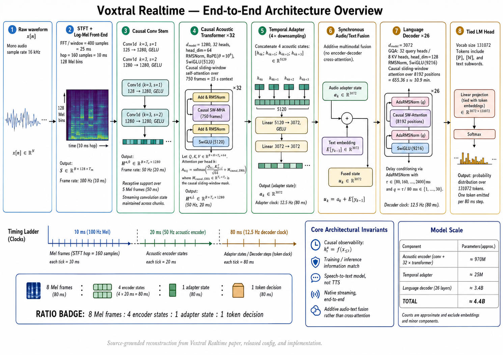
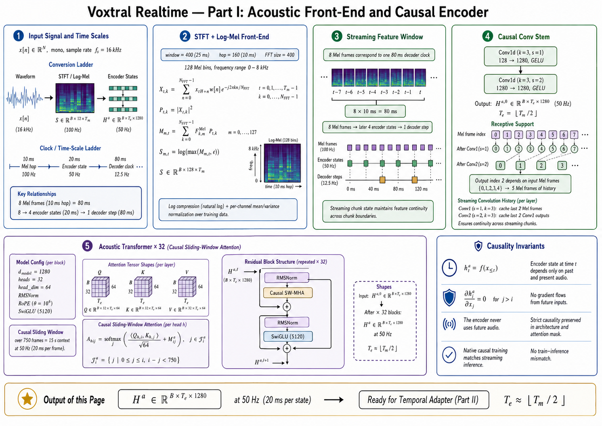
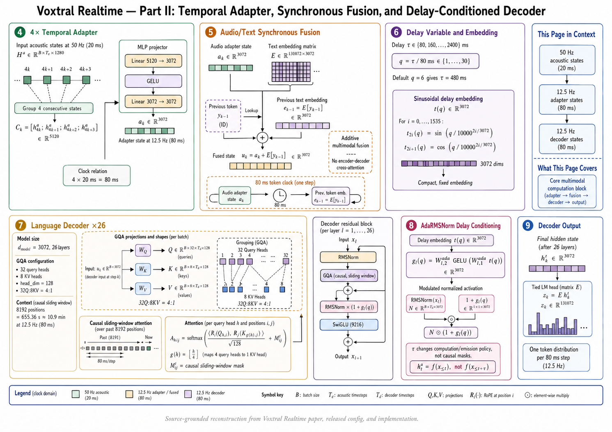
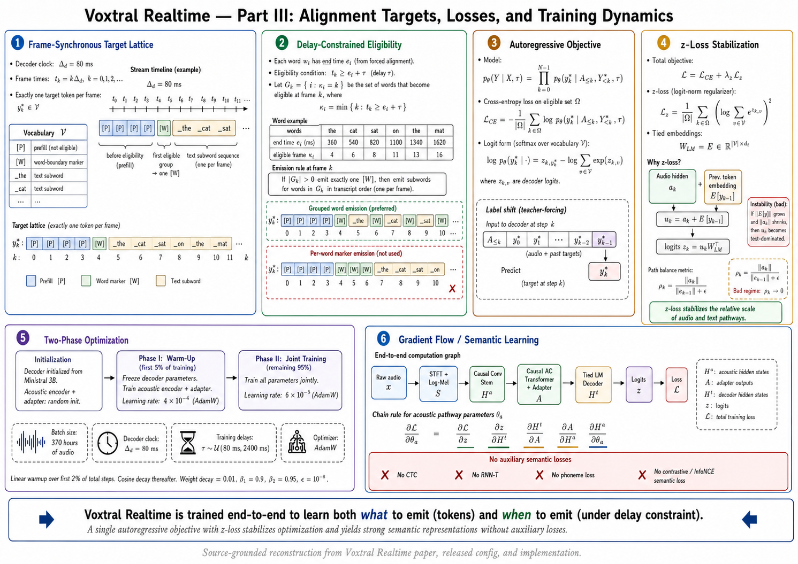
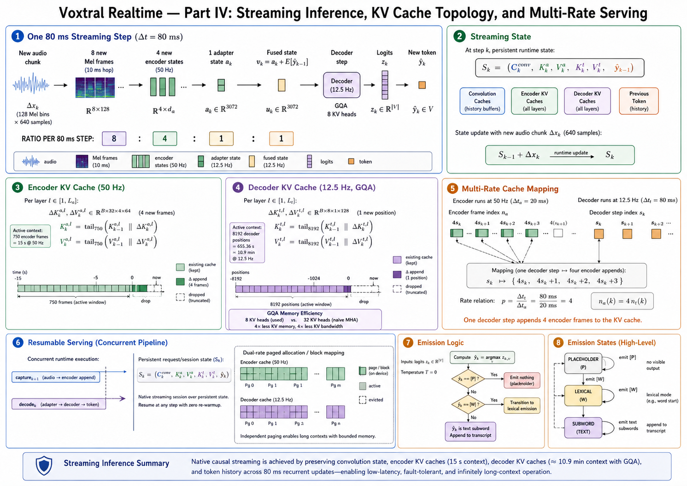

# Voxtral Realtime — source-audited end-to-end architecture reconstruction

I am treating the **latest paper revision available in the supplied arXiv record, v3 dated April 6, 2026**, as the architectural authority; the released Mistral/Hugging Face configuration and current Transformers implementation as implementation evidence; and the Mistral release page mainly as product/evaluation evidence. Where those sources disagree, I will expose the disagreement rather than normalize it away. ([arXiv][1])

I will use four evidence classes:

* **[R] Reported** — explicitly stated in the paper/model card.
* **[C] Code-verified** — directly recoverable from released configuration/implementation.
* **[D] Derived** — follows algebraically from reported/code-verified quantities.
* **[U] Undisclosed** — cannot be established from the supplied primary sources.

---

## 0. First correct the model abstraction

Voxtral Realtime is **not three independent models coupled as an ASR pipeline**. It is one end-to-end conditional sequence model with three architectural macro-blocks:

[
\boxed{
x_{\text{wave}}
\rightarrow
\text{causal acoustic encoder}
\rightarrow
\text{temporal adapter}
\rightarrow
\text{decoder-only LM}
\rightarrow
p(y_k)
}
]

The paper explicitly decomposes it into a **causal audio encoder**, **temporal adapter**, and **Transformer language decoder**, but the acoustic embedding is injected into the decoder residual-input stream at **every synchronous 80-ms step**. There is no independent ASR decoder followed by an LLM, and there is no encoder-decoder cross-attention. ([arXiv][1])

The released implementation makes this graph concrete:

[
\texttt{audio_tower}
\rightarrow
\texttt{multi_modal_projector}
\rightarrow
\underbrace{
E_{\text{text}}(y)+A_{\text{audio}}
}_{\text{additive stream fusion}}
\rightarrow
\texttt{language_model}
\rightarrow
\texttt{lm_head}.
]

The implementation literally performs `inputs_embeds += audio_embeds`; the decoder receives one fused residual stream rather than separate audio/text attention sources. ([GitHub][2])

There is a second important correction: **Voxtral Realtime itself is speech-to-text, not speech-to-speech**. Mistral explicitly instructs voice-agent users to connect Voxtral Realtime to an external LLM and TTS pipeline. Therefore the endpoint of the architecture analyzed here is a textual token stream/transcript, not synthesized audio. ([Mistral AI][3])

And there is **no discrete audio vocabulary/codebook** in this architecture. Audio remains continuous:

[
\text{waveform}
\rightarrow
\text{log-Mel}
\rightarrow
\mathbb R^{1280}
\rightarrow
\mathbb R^{3072}.
]

The (131072)-entry vocabulary is the **text decoder vocabulary**, not an acoustic-token vocabulary. ([Hugging Face][4])

---

# 1. Global architecture

The paper reports:

| Block                | Layers |           (d_{\text{model}}) | Heads | KV heads |              Window | Parameters |
| -------------------- | -----: | ---------------------------: | ----: | -------: | ------------------: | ---------: |
| Causal audio encoder |     32 |                         1280 |    32 |       32 | 750 acoustic frames |       970M |
| Adapter              |  1 MLP | (1280\times4\rightarrow3072) |     — |        — |                   — |        25M |
| Language decoder     |     26 |                         3072 |    32 |        8 |  8192 stream tokens |       3.4B |
| **Total**            |      — |                            — |     — |        — |                   — |   **4.4B** |

This is directly Table 1 of the report. ([arXiv][1])

The released config further fixes:

[
d_a=1280,\quad
d_t=3072,\quad
d_{a,\mathrm{ffn}}=5120,\quad
d_{t,\mathrm{ffn}}=9216,
]

[
H_a=32,; H_{KV,a}=32,; d_{h,a}=64,
]

[
H_t=32,;H_{KV,t}=8,;d_{h,t}=128,
]

[
V=131072,\quad
\theta_{\mathrm{RoPE}}=10^6,
]

with BF16 released weights. ([Hugging Face][4])

There is an important subtlety here:

[
32\times64=2048\neq1280.
]

Therefore the acoustic Q/K/V projection width is **2048 dimensions**, despite the residual width being 1280. The implementation verifies that Q/K/V projection output width is `num_heads * head_dim`, followed by an output projection back to (1280). ([GitHub][2])

Similarly, the text decoder has:

[
32\times128=4096
]

query dimensions while KV use:

[
8\times128=1024.
]

That is genuine GQA, with four query heads sharing one logical KV head group. ([Hugging Face][4])

---

# 2. One clock equation explains the entire model

The fundamental temporal lattice is:

[
\boxed{
10\text{ ms}
\xrightarrow[\times2]{\text{causal conv}}
20\text{ ms}
\xrightarrow[\times4]{\text{adapter}}
80\text{ ms}
}
]

or equivalently,

[
100\text{ Hz}
\rightarrow
50\text{ Hz}
\rightarrow
12.5\text{ Hz}.
]

At 16 kHz, the log-Mel hop is 160 samples:

[
\frac{160}{16000}=10\text{ ms}.
]

The causal convolutional stem downsamples time by (2), producing one acoustic encoder state every 20 ms. Four adjacent encoder states are then combined by the adapter, producing one decoder-side acoustic embedding every 80 ms. The paper reports precisely these rates, and the released configuration additionally encodes `audio_length_per_tok = 8` and `downsample_factor = 4`. ([arXiv][1])

Thus:

[
1\text{ decoder position}
=========================

# 4\text{ encoder positions}

# 8\text{ log-Mel hops}

80\text{ ms}.
]

This synchronization lattice is more fundamental to Voxtral Realtime than any individual Transformer block.

---

# 3. Spoken waveform (\rightarrow) acoustic observations

Let raw mono audio be

[
x\in\mathbb R^{B\times N}
]

sampled at

[
f_s=16,000\text{ Hz}.
]

The paper specifies 128 Mel channels and a hop of 160 samples. The released feature extractor fixes the STFT window/FFT size at 400 samples, uses a Hann window, computes squared magnitudes, applies 128 Slaney-normalized Mel filters spanning (0)–(8,\text{kHz}), then applies log compression. ([arXiv][1])

For frame (m),

[
X_m[\omega]
===========

\sum_n
x[n+mH],
w[n]e^{-j2\pi\omega n/N_{\mathrm{FFT}}},
]

with

[
H=160,\qquad
N_{\mathrm{FFT}}=400.
]

Mel energy:

[
M_{b,m}
=======

\sum_\omega
F_{b,\omega}|X_m[\omega]|^2,
\qquad
b=1,\ldots,128.
]

Released preprocessing then computes approximately

[
L_{b,m}=\log_{10}\max(M_{b,m},10^{-10}),
]

clips it relative to the configured global log-Mel maximum, and rescales:

[
\tilde L_{b,m}
==============

\frac{\max(L_{b,m},1.5-8)+4}{4}.
]

Those preprocessing constants come from the current Hugging Face implementation/configuration rather than the architecture section of the paper. ([GitHub][5])

The resulting acoustic tensor is approximately

[
\boxed{
X^{(0)}
\in
\mathbb R^{B\times128\times T_m}
}
]

with (T_m) advancing at (100,\mathrm{Hz}).

### Why log-Mel rather than an audio-token vocabulary?

Nothing in the report indicates codec tokens, residual vector quantization, semantic tokens, HuBERT units, EnCodec codes, or a learned acoustic codebook. The model starts from continuous log-Mel features. Therefore asking for its “audio vocabulary size” as though this were a speech-token LLM would impose the wrong abstraction. Its acoustic input dimensionality is **128 Mel channels**; its discrete vocabulary is the **131072-entry text vocabulary**. ([arXiv][1])

The paper does **not** provide an ablation establishing why 128 rather than 80, 64, or another Mel dimensionality is optimal. Any stronger rationale would be invented.

---

# 4. Causal convolutional stem

The released implementation uses two causal 1-D convolutions:

[
128
\xrightarrow[;k=3,;s=1;]{\mathrm{Conv}_1}
1280
\xrightarrow{\mathrm{GELU}}
1280
\xrightarrow[;k=3,;s=2;]{\mathrm{Conv}_2}
1280
\xrightarrow{\mathrm{GELU}}.
]

The code uses left-only padding for causality; the second convolution is strided by two. ([GitHub][2])

Hence,

[
X^{(0)}
:
[B,128,T_m]
\rightarrow
C^{(1)}
:
[B,1280,T_m]
\rightarrow
C^{(2)}
:
[B,1280,T_e],
]

where approximately

[
T_e=\frac{T_m}{2}.
]

After permutation:

[
H^{(0)}_a
\in
\mathbb R^{B\times T_e\times1280}.
]

The paper states that the two kernel-3 causal convolutions give each output a dependency on the previous four input frames, and streaming inference maintains a **four-frame convolution history** so incremental computation reproduces the causal full-prefix result. ([arXiv][1])

The current Transformers implementation contains explicit convolution-padding caches for exactly this streaming state preservation. ([GitHub][2])

---

# 5. Why fully causal attention is not merely an implementation constraint

This is one of the central architectural decisions.

For an offline acoustic encoder,

[
h_t=f(x_{1:T})
]

may use both

[
x_{<t}
\quad\text{and}\quad
x_{>t}.
]

During real-time decoding, however, (x_{>t}) literally does not exist yet.

If training uses

[
p(h_t\mid x_{\le T})
]

but production can provide only

[
p(h_t\mid x_{\le t}),
]

the representation distribution changes precisely as latency is reduced. The report identifies this **bidirectional-training / streaming-inference mismatch** as the failure mode of adapting offline systems through chunking. ([arXiv][1])

Voxtral instead enforces:

[
h_t
===

f_\theta(x_{\le t}),
]

and attention position (i) can access only

[
\mathcal C_i
============

{j:
\max(0,i-W_a+1)\le j\le i},
]

with

[
W_a=750.
]

No (j>i) is visible.

At (50) Hz,

[
750\times20\text{ ms}=15\text{ s}.
]

Therefore the encoder has a **15-second causal left-context window**, bounded KV state, and no future/right-context attention. ([arXiv][1])

This is why causality makes architectural sense for speech streaming: not because speech is merely “sequential,” but because **production-time observability has a causal filtration**,

[
\mathcal F_t=\sigma(x_{\le t}),
]

and the representation used to emit at (t) must be measurable with respect to (\mathcal F_t).

Using bidirectional attention would optimize a predictor under a richer information set than production inference possesses.

---

# 6. Critical distinction: target delay is not encoder lookahead

This is easy to misinterpret.

Voxtral permits (\tau=480) ms delay, but the audio encoder remains causal:

[
h_t=f(x_{\le t}).
]

The model does **not** turn a 480-ms delay setting into

[
h_t=f(x_{\le t+480\text{ms}})
]

by exposing future frames inside attention.

Instead, transcription for an event whose acoustics finish at time (t_w) is **scheduled later**:

[
t_{\text{emit}}\ge t_w+\tau.
]

By the wall-clock time the decoder reaches (t_{\text{emit}}), those additional 480 ms have naturally arrived as past observations.

So Voxtral transforms a lookahead problem into a **delayed causal emission problem**.

That is the core systems insight of DSM-style streaming:

[
\boxed{
\text{preserve causality}
+
\text{shift emission time}
}
]

rather than

[
\text{violate causality with future acoustic context}.
]

The paper defines (\tau) as a minimum offset between acoustic evidence and earliest text production and samples it during training from 80–2400 ms. ([arXiv][1])

---

# 7. Acoustic Transformer: tensor-level block

The encoder contains (L_a=32) pre-normalized Transformer layers with RMSNorm, causal sliding-window self-attention, RoPE and SwiGLU. ([arXiv][1])

For

[
H_l\in\mathbb R^{B\times T_e\times1280},
]

RMSNorm is

[
\operatorname{RMSNorm}(h)
=========================

\gamma\odot
\frac{h}
{\sqrt{\frac{1}{1280}\sum_{j=1}^{1280}h_j^2+\epsilon}},
\qquad
\epsilon=10^{-5}.
]

The implementation evaluates the variance in FP32 before converting back to the input dtype. ([GitHub][2])

### 7.1 Acoustic Q/K/V

With 32 heads and head dimension 64:

[
W_Q\in\mathbb R^{1280\times2048},
]

[
W_K\in\mathbb R^{1280\times2048},
\qquad
W_V\in\mathbb R^{1280\times2048}.
]

After projection:

[
Q,K,V
\in
\mathbb R^{B\times32\times T_e\times64}.
]

The attention scale is

[
\frac{1}{\sqrt{64}}=\frac18.
]

RoPE is applied to (Q,K), with released

[
\theta_{\mathrm{RoPE}}=10^6.
]

The output heads are concatenated:

[
[B,T_e,32,64]
\rightarrow
[B,T_e,2048]
]

and projected:

[
W_O:
\mathbb R^{2048}
\rightarrow
\mathbb R^{1280}.
]

These dimensions are directly recoverable from the released configuration and implementation. ([Hugging Face][4])

The causal attention for head (h) is

[
A^{(h)}
=======

\operatorname{softmax}
\left(
\frac{
Q^{(h)}
\tilde K^{(h)\top}
}{\sqrt{64}}
+M_{\mathrm{causal,SWA}}
\right),
]

[
O^{(h)}=A^{(h)}V^{(h)}.
]

The current implementation explicitly constructs a sliding-window causal mask. ([GitHub][2])

### 7.2 Acoustic FFN

Released dimensions are

[
1280\rightarrow5120\rightarrow1280
]

using gated SwiGLU:

[
u=W_u x,\qquad
g=W_gx,
]

[
z=
\operatorname{SiLU}(g)\odot u,
]

[
\operatorname{FFN}(x)=W_dz.
]

The paper specifically contrasts this encoder with Whisper: Voxtral uses **causal attention, RMSNorm, SwiGLU, RoPE and a sliding window**, versus Whisper's bidirectional encoder, LayerNorm, GELU and sinusoidal positional encoding. ([arXiv][1])

No source-supplied ablation decomposes how much WER improvement comes individually from RMSNorm, SwiGLU, RoPE, encoder scale, or causality. They should therefore not be individually credited with measured gains.

---

# 8. Where acoustics become decoder-compatible semantics

After 32 encoder blocks:

[
H^a
\in
\mathbb R^{B\times T_e\times1280},
\qquad
T_e=50\text{ Hz}.
]

The paper describes a 4× temporal adapter. The implementation reveals precisely what “downsampling” means: **four consecutive encoder vectors are reshaped/concatenated**, not averaged. ([GitHub][2])

For decoder step (k):

[
c_k=
[
h^a_{4k};
h^a_{4k+1};
h^a_{4k+2};
h^a_{4k+3}
]
\in\mathbb R^{5120}.
]

Thus

[
[B,T_e,1280]
\rightarrow
[B,T_d,5120],
]

where

[
T_d=T_e/4.
]

Then:

[
a_k=
W_2,
\operatorname{GELU}(W_1c_k),
]

with

[
W_1\in\mathbb R^{5120\times3072},
\qquad
W_2\in\mathbb R^{3072\times3072}.
]

Therefore

[
a_k\in\mathbb R^{3072}.
]

This is the exact dimensional interface between acoustic and linguistic computation. ([GitHub][2])

The paper's stated reason for the 4× adapter is to reduce decoder sequence length and therefore decoder compute while preserving relevant acoustic information. It does **not** present an ablation proving (p=4) is optimal. ([arXiv][1])

---

# 9. Why the 80-ms compression is architecturally powerful

Before the adapter, a 10-minute utterance produces approximately

[
600\times50=30,000
]

encoder positions.

After 4× compression:

[
600\times12.5=7,500
]

decoder positions.

Decoder compute, KV allocation, scheduling frequency, and autoregressive control are therefore all run at one quarter of the encoder's temporal rate.

But the operation is not simply destructive pooling. The implementation first forms:

[
[h_{4k};h_{4k+1};h_{4k+2};h_{4k+3}]
]

and then learns a (5120\rightarrow3072) projection. The projector can therefore learn transformations over the **ordered set of four 20-ms acoustic states**, rather than collapsing them using a fixed average. ([GitHub][2])

That is the first major transition from fine acoustic timing to the synchronous audio/text representation clock.

---

# 10. Stream-synchronous audio/text fusion

This is the defining Voxtral/DSM mechanism.

At 12.5 Hz, the adapter yields

[
a_k\in\mathbb R^{3072}.
]

The preceding generated text token has embedding

[
e_{k-1}=E[y_{k-1}]
\in\mathbb R^{3072}.
]

The decoder input is

[
\boxed{
u_k=a_k+e_{k-1}.
}
]

The paper explicitly states that the current-step audio embedding and most recently generated text-token embedding are summed; Figure 2 shows exactly this loop. The released implementation executes the same operation. ([arXiv][1])

This is fundamentally different from a conventional encoder-decoder ASR Transformer:

[
\text{decoder self-attention}
+
\text{encoder cross-attention}.
]

Voxtral has no such cross-attention branch.

Instead:

[
\text{audio}
\xrightarrow{}
a_k
]

and

[
\text{text history}
\xrightarrow{}
E[y_{k-1}]
]

are projected into a common residual space **before decoder self-attention**.

Consequently, after fusion, the decoder operates over a single sequence:

[
U=(u_1,u_2,\ldots,u_k).
]

Acoustic evidence is therefore not a static prefix. New acoustic information is injected continuously at every stream position.

That distinction matters materially for long-running streaming.

---

# 11. Language decoder: 26-layer causal GQA Transformer

The decoder has

[
L_t=26,\quad
d_t=3072,\quad
d_{\mathrm{ffn}}=9216,
]

[
H_Q=32,\quad
H_{KV}=8,\quad
d_h=128,
]

with causal sliding-window self-attention of length 8192. ([Hugging Face][4])

For

[
X_l\in\mathbb R^{B\times T_d\times3072},
]

the Q projection is

[
W_Q\in\mathbb R^{3072\times4096},
]

giving

[
Q\in
\mathbb R^{B\times32\times T_d\times128}.
]

K/V are:

[
W_K,W_V
\in
\mathbb R^{3072\times1024},
]

[
K,V
\in
\mathbb R^{B\times8\times T_d\times128}.
]

Four query heads share each KV head:

[
\frac{H_Q}{H_{KV}}
==================

\frac{32}{8}=4.
]

The implementation repeats KV logically across groups for ordinary eager attention; optimized attention backends need not physically materialize this expansion. ([GitHub][2])

### KV reduction

A full 32-KV-head decoder would store per token:

[
2\times32\times128=8192
]

K/V scalars per layer.

Voxtral stores:

[
2\times8\times128=2048.
]

Therefore GQA gives a theoretical:

[
\boxed{4\times}
]

reduction in decoder K/V elements relative to 32-head MHA at the same head dimension.

That is **[D]**, not a performance claim made by the paper.

---

# 12. Decoder temporal receptive field

Decoder left context:

[
W_d=8192\text{ positions}.
]

Each position is 80 ms, hence the active recurrent temporal horizon is

[
8192\times0.08
==============

655.36\text{ s}
\approx10.92\text{ minutes}.
]

The encoder window is only 15 seconds, but the decoder residual/KV stream can preserve transcription-level linguistic state for roughly 10.9 minutes before old positions leave its sliding window. ([arXiv][1])

That division is important:

[
\text{encoder}
\rightarrow
\text{high-rate recent acoustic context},
]

[
\text{decoder}
\rightarrow
\text{much longer fused linguistic/acoustic history}.
]

The released maximum positional configuration is

[
131072.
]

At 80 ms per decoder position:

[
131072\times0.08
================

# 10485.76\text{ s}

2.913\text{ h}.
]

This is consistent with the card's approximately three-hour practical maximum. ([Hugging Face][4])

There is actually a small documentation error in the model card: it writes `3600 / 0.8 = 45000`; the correct dimensional calculation is

[
3600/0.08=45000.
]

The resulting 45,000-token number is correct; the written denominator is not. ([Hugging Face][6])

---

# 13. Delay is an explicit model condition: AdaRMSNorm

A fixed streaming model would optimize only one latency operating point. Voxtral instead trains:

[
p_\theta(y\mid x,\tau),
]

where

[
\tau\in
{80,160,\ldots,2400}\text{ ms}
]

during training. The report samples these 30 delay values uniformly. ([arXiv][1])

Define delay frame count

[
n_\tau=\frac{\tau}{80\text{ ms}}.
]

For 480 ms:

[
n_\tau=6.
]

The released config indeed sets:

[
\texttt{default_num_delay_tokens}=6.
]

([Hugging Face][4])

The current implementation encodes this integer through a 3072-dimensional sinusoidal embedding with (\theta=10000). Each decoder layer then transforms that representation via

[
3072
\rightarrow32
\xrightarrow{\mathrm{GELU}}
3072.
]

([GitHub][2])

For block (l),

[
g_l(\tau)
=========

W_{2,l}
\operatorname{GELU}
\left(
W_{1,l}\phi(\tau)
\right).
]

The decoder block is:

[
r_{\text{attn}}
===============

\operatorname{Attn}
(
\operatorname{RMSNorm}(x)
),
]

[
h=x+r_{\text{attn}},
]

[
\tilde h
========

\operatorname{RMSNorm}(h)
\odot
(1+g_l(\tau)),
]

[
r_{\text{ffn}}
==============

\operatorname{FFN}(\tilde h),
]

[
y=h+r_{\text{ffn}}.
]

This is the actual paper equation and released implementation. ([arXiv][1])

### Important nuance

The paper calls this “additive conditioning,” but operationally the conditioning inside the block is **feature-wise multiplicative modulation around unit gain**:

[
h_j\mapsto h_j(1+g_j(\tau)).
]

The attention branch receives no (\tau) modulation.

Thus (\tau) does not change:

* the causal mask,
* attention right-context,
* encoder lookahead.

It changes the decoder's **conditional computation/emission policy**.

---

# 14. Why AdaRMSNorm is better than simply injecting a delay token

This part is empirically supported.

The report compares:

1. adding a sinusoidal delay embedding to the audio/text stream;
2. encoding delay through special tokens;
3. AdaRMSNorm.

AdaRMSNorm obtains faster convergence and lower WER across the reported English, French and German FLEURS experiments. The paper also notes a structural issue with special-token conditioning: a delay token may need reinsertion when it falls outside the sliding-attention window. ([arXiv][1])

Mechanistically, AdaRMSNorm provides every decoder layer with the operating point:

[
\tau
\rightarrow
g_1(\tau),\ldots,g_{26}(\tau),
]

instead of requiring the network to preserve a single conditioning token across thousands of autoregressive positions.

Each Ada projection contains

[
3072\times32+
32\times3072
============

196608
]

parameters.

Across 26 blocks:

[
26\times196608
==============

5,111,808
]

parameters,

which reproduces the paper's stated **approximately 5M extra parameters**. ([arXiv][1])

---

# 15. The real alignment mechanism: ([P]) and ([W])

Streaming ASR has two optimization problems simultaneously:

[
\text{what token?}
]

and

[
\text{when may that token be emitted?}
]

Voxtral encodes both into the autoregressive token target.

Training data comprise:

[
(\text{audio},\text{text},\text{word-level timestamps}).
]

The paper adds two symbols to the base text vocabulary:

* ([P]): non-emitting placeholder;
* ([W]): word-generation boundary/control symbol.

Exactly **one target token is assigned to every 80-ms decoder frame**. ([arXiv][1])

Let word (w_i) have acoustic end timestamp (e_i).

Conceptually, the emission constraint is:

[
t_k<e_i+\tau
\quad\Longrightarrow\quad
y_k=[P].
]

Once the word is fully observed and its delay constraint has expired:

[
t_k\ge e_i+\tau,
]

the stream may emit

[
[W],;
s_{i,1},s_{i,2},\ldots
]

where (s_{i,j}) are ordinary tokenizer subwords. ([arXiv][1])

The paper does **not** specify the exact continuous-timestamp-to-80-ms rounding/tie-breaking algorithm, so an equality such as

[
k_i=\left\lceil\frac{e_i+\tau}{80\text{ms}}\right\rceil
]

is a reasonable mathematical formalization but should be marked **[D]**, not reported implementation truth.

---

# 16. Why ([P]) is not ordinary padding

Calling ([P]) simply “padding” can obscure its semantics.

In this model it participates in the stream timing policy.

At every synchronous frame:

[
y_k\in\mathcal V
]

must exist because the text stream and audio stream remain rate-aligned.

If the model has no legitimate lexical emission:

[
y_k=[P].
]

So ([P]) is better understood functionally as:

[
\boxed{\text{WAIT / no textual emission at this 80-ms clock}}
]

even though the paper names it the padding token. ([arXiv][1])

That removes the need for an external VAD or external online emission policy; the decoder learns whether the current state should produce lexical content or remain silent. The paper explicitly states that inference uses this learned decision mechanism. ([arXiv][1])

---

# 17. Word grouping is not cosmetic target formatting

Suppose multiple words become eligible during the same emission group.

A naive target could produce:

[
[W]; \text{Mistral};
[W]; \text{is};
[W]; \text{building}.
]

Voxtral instead retains:

[
[W];
\text{Mistral is building}
]

for words sharing the group.

Why?

The decoder is initialized from a pretrained Ministral 3B text model. Its learned distribution has been optimized on ordinary subword sequences:

[
p(s_1,s_2,\ldots,s_n).
]

Injecting a control symbol between every lexical word transforms that distribution into

[
p(
[W],s_1,[W],s_2,[W],s_3,\ldots
),
]

which is much farther from its pretraining token manifold.

The paper's ablation confirms this: per-group word boundaries converge substantially faster and yield lower WER than inserting ([W]) per word; the authors explicitly attribute the benefit to preserving subword sequences seen during language-model pretraining. ([arXiv][1])

This target design is therefore directly tied to successful transfer of the pretrained LM prior.

---

# 18. “Explicit” versus “implicit” alignment: the paper uses both terms

The abstract says Voxtral is trained with **explicit alignment between audio and text streams**. Section 3 then says target construction induces an **implicit alignment** learned end-to-end. These are not actually contradictory once we separate supervision from runtime policy. ([arXiv][1])

At the dataset/target-construction level:

[
(\text{audio},\text{text},\text{word timestamps})
]

provides explicit temporal supervision.

The training procedure converts that supervision into a frame-synchronous token lattice.

But the neural model does not run a forced aligner at inference. Instead:

[
p_\theta(y_k\mid a_{\le k},y_{<k},\tau)
]

learns the emission decisions.

Therefore the precise interpretation is:

[
\boxed{
\text{explicit timestamp-derived target construction}
\rightarrow
\text{learned implicit neural emission policy}
}
]

rather than “no alignment supervision.”

---

# 19. There are not “many separate acoustic/semantic losses”

This is where a source-grounded reconstruction diverges from the premise in the question.

The report does **not** describe:

* an acoustic reconstruction loss,
* a semantic contrastive loss,
* a CTC loss,
* an RNN-T loss,
* an audio-token prediction loss,
* separate encoder/decoder objectives,
* a speech-language alignment contrastive loss,
* a codec reconstruction loss.

The model is trained around frame-synchronous autoregressive token prediction, plus a reported **z-loss regularizer** introduced for optimization stability. The current Hugging Face conditional-generation implementation exposes the standard causal-LM label-loss interface on the output logits. ([arXiv][1])

The natural conditional NLL is therefore

[
\mathcal L_{\mathrm{AR}}
========================

-\sum_{k=1}^{T_d}
\log
p_\theta
\left(
y_k^\star
\mid
y_{<k}^\star,
a_{\le k},
\tau
\right),
]

where

[
y_k^\star
\in
\mathcal V
]

includes lexical subwords, ([P]), and ([W]).

I would mark this equation **[D/C]**: it follows from the autoregressive decoder and released causal-LM training interface, but the paper itself does not print this exact loss equation.

---

# 20. The important auxiliary loss is z-loss — and it solves a multimodal collapse mode

This is one of the most technically consequential details in the report.

The decoder input is

[
u_k
===

a_k+e_k.
]

The LM output matrix and text embedding matrix are tied:

[
W_{\mathrm{LM}}=E^\top.
]

The authors observed during training that decoder logits grew without bound. Because output-head and text-embedding weights are tied, increasing the output weight norms also increased text embedding norms:

[
|E[y]|\uparrow.
]

Meanwhile:

[
|a_k|\downarrow.
]

Consequently,

[
|e_k|\gg|a_k|,
]

and in

[
u_k=a_k+e_k
]

the audio contribution became negligible. The decoder progressively learned to rely on the text autoregressive stream and ignore acoustic evidence. This failure mode is explicitly reported. ([arXiv][1])

The authors introduce a z-loss penalty that constrains the softmax normalizer/logit scale and report that audio/text embedding norms then converge to stable values. ([arXiv][1])

Schematically:

[
\mathcal L
==========

\mathcal L_{\mathrm{AR}}
+
\lambda_z\mathcal L_z.
]

A conventional z-loss has the structure

[
\mathcal L_z
\propto
\left(
\log\sum_{v=1}^{V}e^{z_v}
\right)^2.
]

However:

[
\boxed{\lambda_z\text{ is not disclosed in the Voxtral report}.}
]

I would not import a coefficient from PaLM or another implementation and present it as Voxtral's.

This z-loss is not just generic logit stabilization here. It directly stabilizes the **relative amplitude of the two modalities before additive fusion**.

That is a model-specific systems consequence.

---

# 21. How acoustic information becomes “semantic” without a semantic loss

There is no explicit semantic bottleneck.

The path is:

[
\underbrace{x}*{\text{waveform}}
\rightarrow
\underbrace{M}*{\text{spectrotemporal}}
\rightarrow
\underbrace{H_a}*{\text{contextual acoustics}}
\rightarrow
\underbrace{A}*{\text{LM-space acoustic embedding}}
\rightarrow
\underbrace{A+E[y]}*{\text{joint residual state}}
\rightarrow
\underbrace{H_t}*{\text{language-conditioned representation}}
\rightarrow
\text{text}.
]

The encoder must retain information sufficient for minimizing the downstream token objective.

Therefore its gradients arise through:

[
\frac{\partial \mathcal L}{\partial W_{\mathrm{enc}}}
=====================================================

\frac{\partial\mathcal L}{\partial z}
\frac{\partial z}{\partial H_t}
\frac{\partial H_t}{\partial A}
\frac{\partial A}{\partial H_a}
\frac{\partial H_a}{\partial W_{\mathrm{enc}}}.
]

There is no requirement that some layer explicitly be “phonetic” and another explicitly be “semantic.”

What we can source-ground is:

1. fine acoustic features enter the causal encoder;
2. contextual encoder states integrate causal acoustic history;
3. groups of four states are projected into the language decoder dimensionality;
4. they are summed with text embeddings;
5. a pretrained language decoder maps the joint state toward textual prediction.

The semantic abstraction is therefore learned **because text prediction is the terminal supervision**, not because the paper defines a separate semantic objective. ([arXiv][1])

---

# 22. Training initialization is specifically designed around this modality bridge

Initialization:

[
\theta_{\text{encoder}}\sim\text{random},
\qquad
\theta_{\text{adapter}}\sim\text{random},
]

while

[
\theta_{\text{decoder}}
\leftarrow
\text{Ministral 3B}.
]

Training is split:

[
5%:
\quad
\theta_{\text{decoder}};\text{frozen},
]

[
95%:
\quad
\theta_{\text{all}};\text{trainable}.
]

The paper explicitly says the warm-up prevents the randomly initialized acoustic pathway from destabilizing the pretrained decoder before it learns useful audio embeddings. ([arXiv][1])

This is a representation-alignment phase in functional terms:

[
\mathbb R^{\text{audio}}
\xrightarrow[\text{encoder+adapter training}]{}
\mathbb R^{3072}_{\text{pretrained LM residual geometry}}.
]

Then joint optimization permits the language model itself to adapt.

Optimizer:

[
\text{AdamW},
]

batch size:

[
370\text{ hours of audio},
]

warm-up LR:

[
4\times10^{-4},
]

joint phase LR:

[
6\times10^{-5}.
]

([arXiv][1])

“370 hours” here is **batch size**, not total training-dataset size.

The total training corpus size is not disclosed; the paper only describes a large-scale 13-language dataset. ([arXiv][1])

---

# 23. Parameter reconstruction: released architecture independently reproduces 4.4B

The current code/config allows the published parameter counts to be reconstructed.

### Acoustic encoder

Per encoder layer:

[
P_{\mathrm{attn}}
\approx10{,}491{,}136,
]

[
P_{\mathrm{FFN}}
\approx19{,}662{,}080,
]

plus normalization parameters, giving

[
P_{\mathrm{layer}}
==================

30{,}155{,}776.
]

Including 32 layers, two convolutional layers and final norm:

[
\boxed{
P_{\mathrm{encoder}}
====================

970{,}395{,}392
}
]

which reproduces the paper's (970)M. Dimensions and bias structure are code-verified; the arithmetic is derived. ([GitHub][2])

### Adapter

[
P_{\mathrm{adapter}}
====================

5120\times3072+
3072\times3072
]

# [

25{,}165{,}824
\approx25.17\text{ M}.
]

([GitHub][2])

### Decoder

Per layer:

[
P_{\mathrm{attention}}
======================

31{,}457{,}280,
]

[
P_{\mathrm{SwiGLU}}
===================

84{,}934{,}656,
]

[
P_{\mathrm{Ada}}
================

196{,}608,
]

plus RMSNorms, giving

[
P_{\mathrm{decoder-layer}}
==========================

116{,}594{,}688.
]

Text embedding:

[
131072\times3072
================

402{,}653{,}184.
]

Because output embedding/head weights are tied, the LM head does not introduce another (402.7)M independent parameters. ([GitHub][2])

Total decoder:

[
\boxed{
P_{\mathrm{decoder}}
\approx3.4341\text{ B}
}
]

and full model:

[
970.395\text{ M}
+
25.166\text{ M}
+
3.434118\text{ B}
=================

\boxed{
4.429679\text{ B}
}
]

using the current released implementation's exact bias choices.

Hence the paper's **4.4B** is consistent with the released architecture. “4B” in the product/model name is a rounded family label, not evidence for a different 4.0B architecture. ([arXiv][1])

The repository's BF16 model file is approximately 8.86 GB, which is also numerically consistent with:

[
4.43\times10^9\times2\text{ bytes}
\approx8.86\text{ GB}.
]

([Hugging Face][7])

---

# 24. Inference: what happens during one 80-ms model clock

The complete streaming state can be represented as

[
S_k=
(
C_{\text{conv}},
K_a,V_a,
K_t,V_t,
y_{k-1}
).
]

For the next 80-ms advancement:

### Stage 1 — acoustic feature arrival

Eight new 10-ms log-Mel hops become available:

[
\Delta M_k
\sim
[128,8].
]

Because STFT windows overlap, this should **not** be interpreted as eight isolated independent waveform segments; the frontend maintains the windowing context required by the spectral transform. The released processor has explicit chunk calculations incorporating hop and window sizes. ([GitHub][8])

### Stage 2 — causal convolution update

The stem transforms the new Mel region to four new 50-Hz encoder positions:

[
\Delta H^{(0)}_k
\in
\mathbb R^{B\times4\times1280}.
]

Its causal convolution history is retained.

### Stage 3 — acoustic Transformer update

For each of 32 layers:

[
\Delta Q_l,\Delta K_l,\Delta V_l,
]

are computed only for new positions while previous K/V states remain cached.

The four new encoder states causally attend into at most the most recent 750 positions.

### Stage 4 — temporal fusion

[
c_k
===

\operatorname{concat}
(
h_{4k},h_{4k+1},h_{4k+2},h_{4k+3}
)
\in\mathbb R^{5120},
]

[
a_k
===

P(c_k)
\in\mathbb R^{3072}.
]

### Stage 5 — audio/text synchronous fusion

[
e_{k-1}
=======

E(y_{k-1})
\in\mathbb R^{3072},
]

[
u_k=a_k+e_{k-1}.
]

### Stage 6 — delay condition

[
n_\tau=\tau/80\text{ ms},
]

[
t_\tau=\phi(n_\tau)\in\mathbb R^{3072}.
]

### Stage 7 — 26 decoder blocks

[
h_k^{(0)}=u_k,
]

[
h_k^{(l+1)}
===========

F_l
(
h_{\le k}^{(l)},
K_{t,l}^{\text{cache}},
V_{t,l}^{\text{cache}},
t_\tau
).
]

### Stage 8 — logits

[
z_k
===

E^\top h_k^{(26)}
\in
\mathbb R^{131072}.
]

### Stage 9 — synchronous token decision

[
\hat y_k=\arg\max_v z_{k,v}
]

under the model card's recommended temperature (0). ([Hugging Face][6])

Then:

[
\hat y_k=[P]
\Rightarrow
\text{emit nothing user-visible},
]

[
\hat y_k=[W]
\Rightarrow
\text{transition into word emission},
]

otherwise:

[
\hat y_k\in\mathcal V_{\text{subword}}
\Rightarrow
\text{append text}.
]

And that token becomes part of the next step's fused input.

That closes the recurrent stream-synchronous loop.

---

# 25. Two KV-cache clocks, not one

The inference engine has a non-standard cache topology because:

[
f_{\mathrm{encoder}}=50\text{ Hz}
]

while

[
f_{\mathrm{decoder}}=12.5\text{ Hz}.
]

Thus one language-model position corresponds to

[
p=4
]

new encoder KV positions. ([arXiv][1])

Standard PagedAttention metadata usually advances a sequence in one positional domain. Voxtral instead maintains:

[
(K_a,V_a)
\quad\text{and}\quad
(K_t,V_t)
]

with different rates.

Mistral's vLLM integration handles this by stretching encoder KV block/index metadata by (p=4), scaling sequence lengths/query offsets and mapping each logical slot onto (p) contiguous encoder slots. That allows both temporal domains to participate in a unified paged-allocation scheme. ([arXiv][1])

This is not peripheral serving code: it is a direct consequence of the model's multi-rate architecture.

---

# 26. Resumable streaming is required for the architecture to remain computationally sane

For every incoming 80-ms increment, recomputing:

[
x_{1:k}
\rightarrow
H_{1:k}
]

would make cumulative streaming cost grow badly.

Instead Voxtral retains:

* convolution state,
* encoder K/V,
* decoder K/V,
* request/session state.

vLLM's resumable requests preserve KV blocks across incremental updates. The report further states that while the server buffers the next 80-ms audio increment, it concurrently executes the current one-token decode step. ([arXiv][1])

So conceptually:

[
\boxed{
\text{capture}*{k+1}
\parallel
\text{decode}*{k}
}
]

rather than:

[
\text{capture}*{k+1}
\rightarrow
\text{then decode}*{k}.
]

The WebSocket endpoint provides bidirectional incremental audio submission and token-delta output over the same persistent session. ([arXiv][1])

---

# 27. Theoretical active KV footprint

For one sequence at full sliding windows, ignoring allocator metadata, fragmentation, attention-workspace tensors and implementation-specific cache layouts:

### Acoustic KV

Each encoder position/layer stores:

[
2\times32\times64
=================

4096
]

elements.

At BF16:

[
4096\times2=8192\text{ bytes}.
]

Over 750 positions and 32 layers:

[
8192\times750\times32
=====================

196{,}608{,}000\text{ bytes}
\approx187.5\text{ MiB}.
]

### Decoder KV

Per position/layer:

[
2\times8\times128
=================

2048
]

BF16 elements:

[
4096\text{ bytes}.
]

Across (8192) positions and 26 layers:

[
4096\times8192\times26
======================

872{,}415{,}232\text{ bytes}
\approx832\text{ MiB}.
]

Total idealized active KV state:

[
\boxed{
\approx1.0\text{ GiB/sequence}
}
]

when both sliding windows are completely populated.

This is a theoretical tensor-storage calculation, not a measured vLLM memory figure.

It also makes the decoder's 8-KV-head GQA choice architecturally significant: 32 KV heads would make its raw KV term approximately four times larger.

---

# 28. Left-padding result: surprisingly important, but mechanism remains hypothetical

At inference the authors prepend silence to the audio stream and corresponding ([P]) positions to the text stream.

Their ablation reports that moving from 0 to 16 initial frames improves WER across the tested categories; 32 frames further improves most categories. They hypothesize an **attention-sink-like** effect, but explicitly leave the mechanism unresolved. ([arXiv][1])

Therefore:

[
\text{left-padding improves measured WER}
]

is supported.

But:

[
\text{attention sinks are definitively the cause}
]

is **not** supported.

The latter remains the authors' hypothesis.

---

# 29. What actually makes Voxtral strong at low latency

“Best frontier open-source model” needs a narrower definition.

The paper establishes that Voxtral Realtime substantially outperforms the **open-source streaming baselines included in its evaluation at comparable latency**. It does not establish universal dominance over every ASR model or every model released after the benchmark was constructed. Mistral releases the model weights under Apache 2.0; because the complete training dataset and training recipe are not published, **open-weight** is the more precise scientific descriptor than “fully open-source research stack.” ([arXiv][1])

The relevant results are:

| Model                              |      Delay | En-short WER ↓ | En-long ↓ | FLEURS ↓ |     MCV ↓ |
| ---------------------------------- | ---------: | -------------: | --------: | -------: | --------: |
| Whisper offline                    |          — |           8.39 |      7.97 |     8.23 |     14.25 |
| Voxtral Mini Transcribe V2 offline |          — |           7.27 |      7.11 |     5.90 |      8.07 |
| Voxtral Realtime                   |     240 ms |           9.95 |      9.29 |    10.80 |     19.22 |
| **Voxtral Realtime**               | **480 ms** |       **8.47** |  **7.73** | **8.72** | **15.24** |
| **Voxtral Realtime**               | **960 ms** |       **7.94** |  **7.13** | **7.70** | **11.99** |
| Voxtral Realtime                   |    2400 ms |           7.72 |      6.93 |     6.73 |     10.47 |

([arXiv][1])

At 480 ms:

[
\text{En-long}:7.73<7.97_{\text{Whisper}},
]

while En-short, FLEURS and MCV are already close to Whisper.

At 960 ms:

[
7.94<8.39 \quad\text{En-short},
]

[
7.13<7.97 \quad\text{En-long},
]

[
7.70<8.23 \quad\text{FLEURS},
]

[
11.99<14.25 \quad\text{MCV}.
]

So at 960 ms the paper's benchmark demonstrates lower WER than Whisper across those four aggregate columns. ([arXiv][1])

Against other listed open streaming systems, the gap is larger: DSM 1B En-Fr reports 12.26/13.83 at 500 ms on En-short/En-long, and Nemotron Streaming reports 9.59/14.29 at 560 ms; Voxtral at 480 ms is 8.47/7.73. ([arXiv][1])

---

# 30. Why it gets there: separate demonstrated mechanisms from plausible ones

### Empirically demonstrated

**AdaRMSNorm** outperforms sum-conditioning and special-delay-token conditioning. ([arXiv][1])

**Per-group word-boundary targets** outperform inserting ([W]) per individual word and better preserve the pretrained decoder's text distribution. ([arXiv][1])

**Left padding** improves measured WER, although the reason is unresolved. ([arXiv][1])

### Explicitly reported architectural motivation

**Native causal training** removes the fundamental train/inference information mismatch of bidirectional offline encoders used under streaming constraints. ([arXiv][1])

**4× temporal adaptation** lowers the sequence length seen by the expensive language decoder. ([arXiv][1])

**z-loss** prevents the pretrained text pathway from dominating additive multimodal fusion. ([arXiv][1])

### Technically plausible but not individually ablated

The paper does not establish individual causal effects for:

[
\text{RMSNorm vs LayerNorm},
]

[
\text{SwiGLU vs GELU},
]

[
\text{RoPE vs alternative positions},
]

[
32\text{ encoder layers},
]

[
p=4,
]

[
750\text{-frame encoder SWA},
]

[
8192\text{-token decoder SWA},
]

[
8\text{ decoder KV heads}.
]

Those choices are source-confirmed architecture, but their marginal contributions are not measured in the report.

---

# 31. Why this architecture is unusually coherent for streaming ASR

The model is designed around one invariant:

[
\boxed{
\text{training-time information availability}
=============================================

\text{inference-time information availability}
}
]

and one synchronized clock:

[
\boxed{
80\text{ ms / decoder state}.
}
]

Everything else composes around them:

[
16\text{kHz waveform}
]

[
\Downarrow
]

[
128\text{-bin log-Mel}@100\text{ Hz}
]

[
\Downarrow
]

[
\text{causal conv }2\times
]

[
\Downarrow
]

[
1280\text{-D causal acoustic states}@50\text{ Hz}
]

[
\Downarrow
]

[
32\times
[\text{RMSNorm}+\text{causal MHA/SWA/RoPE}+\text{SwiGLU}]
]

[
\Downarrow
]

[
4\text{ states}\rightarrow5120
\rightarrow3072
]

[
\Downarrow
]

[
a_k\in\mathbb R^{3072}@12.5\text{ Hz}
]

[
+\quad
E[y_{k-1}]\in\mathbb R^{3072}
]

[
\Downarrow
]

[
u_k=a_k+E[y_{k-1}]
]

[
\Downarrow
]

[
26\times
[
\text{causal GQA}
+
\text{AdaRMS-SwiGLU}
]
]

[
\Downarrow
]

[
z_k\in\mathbb R^{131072}
]

[
\Downarrow
]

[
[P];|;[W];|;\text{subword token}
]

[
\Downarrow
]

[
\text{incremental transcript}.
]

That is Voxtral Realtime's actual end-to-end architecture. ([arXiv][1])

---

# 32. The decisive conceptual insight

Voxtral Realtime does **not** make an offline ASR model run faster.

It reformulates ASR into a clocked conditional language-model process:

[
\boxed{
p_\theta
\left(
y_k
\mid
a_{\le k},
y_{<k},
\tau
\right)
}
]

where acoustic and textual state occupy the same 80-ms lattice.

That produces four important consequences.

First, **latency becomes part of the learned conditional distribution**:

[
\tau\rightarrow p_\theta(y\mid x,\tau)
]

rather than an external chunk-size knob.

Second, **alignment becomes token prediction**. ([P]) and ([W]) encode wait/generate decisions inside the same autoregressive objective.

Third, **multimodal fusion becomes residual-space fusion**:

[
a_k+E[y_{k-1}]
]

rather than cross-attention.

Fourth, **streaming becomes true state continuation**: causal convolutions, encoder KV, decoder KV and the previous token are incrementally advanced, rather than repeatedly solving overlapping offline transcription windows.

Those properties follow directly from the architecture/training design described in the report. ([arXiv][1])

---

# 33. Brutal-truth boundary: what the sources do **not** let us claim

A rigorous architecture reconstruction has to stop at these boundaries.

| Question                                                            | Source status                                       |
| ------------------------------------------------------------------- | --------------------------------------------------- |
| Total pretraining audio hours                                       | **Undisclosed**                                     |
| Per-language dataset mixture/weights                                | **Undisclosed**                                     |
| Dataset provenance/composition                                      | Only “large-scale, 13 languages”                    |
| Timestamp source/forced-aligner used to create training tuples      | **Undisclosed**                                     |
| Exact timestamp (\rightarrow80) ms rounding algorithm               | **Undisclosed**                                     |
| z-loss coefficient (\lambda_z)                                      | **Undisclosed**                                     |
| Whether ([P]), ([W]), lexical tokens receive different loss weights | **Undisclosed**                                     |
| AdamW (\beta_1,\beta_2,\epsilon), weight decay                      | **Undisclosed in report**                           |
| Gradient clipping                                                   | **Undisclosed in report**                           |
| Training precision/hardware/topology                                | **Undisclosed in report**                           |
| Number of optimizer steps/epochs                                    | **Undisclosed**                                     |
| Why exactly 128 Mel channels                                        | No reported ablation                                |
| Why exactly (V=131072)                                              | No reported ablation                                |
| Why exactly adapter (p=4)                                           | Compute rationale given; optimality not established |
| Why exactly 32 encoder / 26 decoder layers                          | **Undisclosed**                                     |
| Why encoder uses 32 KV heads but decoder 8                          | **Undisclosed**                                     |
| Explicit phoneme objective                                          | **None reported**                                   |
| Explicit semantic objective                                         | **None reported**                                   |
| Discrete acoustic vocabulary/codebook                               | **None in this architecture**                       |
| TTS/audio-response generator                                        | **Not part of Voxtral Realtime**                    |

The report does say the decoder starts from Ministral 3B, so maintaining tokenizer/embedding compatibility is structurally important. But the paper does **not** explicitly state “131072 was chosen for reason X,” so I would not invent such a rationale. ([arXiv][1])

One additional source inconsistency should be kept visible. The paper says training samples every 80-ms multiple from **80 through 2400 ms** and says this enables operation throughout that range. The current model card recommends 480 ms and says the exposed parameter may be changed to multiples of 80 ms from **80 to 1200 ms, plus 2400 ms**, while another part of the card summarizes support as 80 ms–2.4 s. Therefore the **training manifold** and the **currently documented deployment choices** should not be conflated. ([arXiv][1])

---

## Final architecture invariant

The cleanest mathematical summary is

[
\boxed{
\begin{aligned}
x
&\xrightarrow[;16\text{kHz};]{\mathrm{STFT+Mel}}
M_{100\text{Hz}}^{128}
\
&\xrightarrow{\mathrm{causal\ Conv}*{\times2}}
H*{50\text{Hz}}^{1280}
\
&\xrightarrow{32\times\mathrm{causal\ Transformer}}
\bar H_{50\text{Hz}}^{1280}
\
&\xrightarrow[;\mathrm{concat};4;]{\mathrm{MLP}}
A_{12.5\text{Hz}}^{3072}
\
u_k
&=
A_k+E(y_{k-1})
\
h_k
&=
\mathrm{Decoder}*{26}
\left(
u*{\le k};
\tau
\right)
\
z_k
&=
E^\top h_k
\in\mathbb R^{131072}
\
y_k
&\in
{
[P],[W],\mathcal V_{\mathrm{text}}
}.
\end{aligned}}
]

with

[
\boxed{
10\text{ ms}
\times2
\times4
=======

80\text{ ms}
}
]

and

[
\boxed{
\tau=n\times80\text{ ms}.
}
]

The central architectural achievement is therefore **not merely a causal speech encoder**. It is the co-design of **causal acoustics, a 12.5-Hz synchronous audio/text lattice, delayed target alignment, pretrained decoder transfer, layer-wise delay conditioning, modality-scale stabilization, and multi-rate persistent KV serving** into one end-to-end ASR state machine. The reported ablations support AdaRMSNorm and grouped alignment targets as material contributors; the benchmark evidence supports its frontier position among the evaluated open streaming ASR systems at sub-second latency. ([arXiv][1])

[1]: https://arxiv.org/pdf/2602.11298 "https://arxiv.org/pdf/2602.11298"
[2]: https://raw.githubusercontent.com/huggingface/transformers/main/src/transformers/models/voxtral_realtime/modeling_voxtral_realtime.py "https://raw.githubusercontent.com/huggingface/transformers/main/src/transformers/models/voxtral_realtime/modeling_voxtral_realtime.py"
[3]: https://mistral.ai/news/voxtral-transcribe-2/ "https://mistral.ai/news/voxtral-transcribe-2/"
[4]: https://huggingface.co/mistralai/Voxtral-Mini-4B-Realtime-2602/blob/main/config.json "https://huggingface.co/mistralai/Voxtral-Mini-4B-Realtime-2602/blob/main/config.json"
[5]: https://raw.githubusercontent.com/huggingface/transformers/main/src/transformers/models/voxtral_realtime/feature_extraction_voxtral_realtime.py "https://raw.githubusercontent.com/huggingface/transformers/main/src/transformers/models/voxtral_realtime/feature_extraction_voxtral_realtime.py"
[6]: https://huggingface.co/mistralai/Voxtral-Mini-4B-Realtime-2602 "https://huggingface.co/mistralai/Voxtral-Mini-4B-Realtime-2602"
[7]: https://huggingface.co/mistralai/Voxtral-Mini-4B-Realtime-2602/tree/main "https://huggingface.co/mistralai/Voxtral-Mini-4B-Realtime-2602/tree/main"
[8]: https://raw.githubusercontent.com/huggingface/transformers/main/src/transformers/models/voxtral_realtime/processing_voxtral_realtime.py "https://raw.githubusercontent.com/huggingface/transformers/main/src/transformers/models/voxtral_realtime/processing_voxtral_realtime.py"

# Algorithm 1 — Voxtral Realtime: End-to-End Tensor-State Formulation

[
\boxed{
80,\mathrm{ms}=8\times 10^{-2},\mathrm{s},
\qquad
f_{\mathrm{DSM}}=\frac{1}{0.08}=12.5,\mathrm{Hz}
}
]

[
\boxed{80,\mu\mathrm{s}\neq80,\mathrm{ms}}
]

[
\mathsf R\equiv\text{reported},
\qquad
\mathsf C\equiv\text{code/config verified},
\qquad
\mathsf D\equiv\text{strictly derived},
\qquad
\mathsf U\equiv\text{undisclosed}.
]

---

## Input

[
\boxed{
x^{(b)}
=======

(x^{(b)}*0,\ldots,x^{(b)}*{N_b-1})
\in\mathbb R^{N_b},
\qquad
b\in{1,\ldots,B}
}
]

[
f_s=16000,\mathrm{Hz},
\qquad
x_n\in\mathbb R,
\qquad
C_{\mathrm{audio}}=1
]

[
d_x=\frac{N}{f_s};\mathrm{s}.
]

[
\mathcal D_{\mathrm{train}}
===========================

\left{
\left(
x^{(b)},
Y^{(b)},
{(w_i,s_i,e_i)}*{i=1}^{M_b}
\right)
\right}*{b=1}^{B}
]

[
\tau
====

q\Delta_d,
\qquad
q\sim\mathcal U{1,\ldots,30},
\qquad
\Delta_d=80,\mathrm{ms}
]

[
\tau\in
{80,160,\ldots,2400},\mathrm{ms}.
]

[
q_{\mathrm{default}}=6
\quad\Longrightarrow\quad
\tau_{\mathrm{default}}
=======================

# 6(80,\mathrm{ms})

480,\mathrm{ms}.
]

([arXiv][1])

---

## Output

[
\boxed{
\hat Y
======

(\hat y_1,\ldots,\hat y_{T_d}),
\qquad
\hat y_k\in\mathcal V
}
]

[
|\mathcal V|=131072
]

[
\mathcal V
\supset
\mathcal V_{\mathrm{subword}}
\cup
{[P],[W]}.
]

[
\hat Y_{\mathrm{text}}
======================

\operatorname{Strip}_{[P],[W]}
(\hat Y).
]

([arXiv][1])

---

# I. Initialize global dimensional system

[
d_a=1280,
\qquad
d_{a,\mathrm{ff}}=5120,
\qquad
L_a=32
]

[
H_a=32,
\qquad
H_{KV,a}=32,
\qquad
d_{h,a}=64
]

[
W_a=750.
]

[
d_t=3072,
\qquad
d_{t,\mathrm{ff}}=9216,
\qquad
L_t=26
]

[
H_{Q,t}=32,
\qquad
H_{KV,t}=8,
\qquad
d_{h,t}=128
]

[
W_t=8192.
]

[
p=4,
\qquad
V=131072,
\qquad
\epsilon_{\mathrm{RMS}}=10^{-5},
\qquad
\theta_{\mathrm{RoPE}}=10^6.
]

[
\theta_{\mathrm{model}}
=======================

{
\theta_{\mathrm{STEM}},
\theta_{\mathrm{ENC}},
\theta_{\mathrm{ADP}},
\theta_{\mathrm{DEC}},
E
}.
]

[
\theta_{\mathrm{model}}
\approx4.4\times10^9.
]

([arXiv][1])

---

# II. Waveform (\rightarrow) 100-Hz spectral lattice

[
N_{\mathrm{FFT}}
================

# L_w

400
]

[
H=160
]

[
\Delta_m
========

# \frac{H}{f_s}

# \frac{160}{16000}

# 10^{-2},\mathrm{s}

10,\mathrm{ms}
]

[
f_m
===

# \frac1{\Delta_m}

100,\mathrm{Hz}.
]

[
L_w/f_s
=======

# 400/16000

25,\mathrm{ms}.
]

### STFT

[
w[n]
====

\frac12
\left(
1-\cos
\frac{2\pi n}{L_w-1}
\right),
\qquad
0\le n<L_w
]

[
X_{t,k}
=======

\sum_{n=0}^{L_w-1}
x_{tH+n}
w[n]
e^{-j2\pi kn/N_{\mathrm{FFT}}}.
]

[
P_{t,k}
=======

|X_{t,k}|^2.
]

[
k\in
\left{
0,\ldots,
\frac{N_{\mathrm{FFT}}}{2}
\right}
=======

{0,\ldots,200}.
]

### 128-dimensional Slaney Mel projection

[
F^{\mathrm{Mel}}
\in
\mathbb R^{201\times128}
]

[
f_{\min}=0,
\qquad
f_{\max}=8000,\mathrm{Hz}
]

[
M_{m,t}
=======

\sum_{k=0}^{200}
F^{\mathrm{Mel}}*{k,m}
P*{t,k},
\qquad
m=1,\ldots,128.
]

[
M
\in
\mathbb R^{B\times128\times T_m}.
]

### Released log-Mel transformation

[
\bar M_{m,t}
============

\max(M_{m,t},10^{-10})
]

[
L_{m,t}
=======

\log_{10}\bar M_{m,t}
]

[
L'_{m,t}
========

\max
\left(
L_{m,t},
1.5-8
\right)
]

[
L'_{m,t}
========

\max(L_{m,t},-6.5)
]

[
\boxed{
S_{m,t}
=======

\frac{L'_{m,t}+4}{4}
}
]

[
S\in
\mathbb R^{B\times128\times T_m}.
]

([arXiv][1])

---

# III. Streaming feature-window constraint

[
\mathrm{center}*0=1,
\qquad
\mathrm{center}*{k>0}=0.
]

[
N_{\mathrm{mel/token}}
======================

8.

]

[
8H
==

# 8(160)

1280;\mathrm{samples}
]

[
\frac{1280}{16000}
==================

0.08,\mathrm{s}.
]

[
\boxed{
8;\mathrm{Mel\ frames}
;\Longleftrightarrow;
80,\mathrm{ms}
;\Longleftrightarrow;
1;\mathrm{decoder\ clock}
}
]

[
N_{\mathrm{window,next}}
========================

# 8H+L_w

# 1280+400

1680.

]

[
N_{\mathrm{STFT,next}}
======================

\left\lfloor
\frac{1680-400}{160}
\right\rfloor+1
===============

9.

]

[
T_{\mathrm{Mel,next}}
=====================

# N_{\mathrm{STFT,next}}-1

8.

]

[
T_{\mathrm{Mel,next}}\Delta_m
=============================

# 8(10,\mathrm{ms})

80,\mathrm{ms}.
]

---

# IV. Causal convolutional acoustic stem

[
S
\in
\mathbb R^{B\times128\times T_m}.
]

### Convolution 1

[
W^{c1}
\in
\mathbb R^{1280\times128\times3}
]

[
b^{c1}\in\mathbb R^{1280}.
]

[
\ell^{c1}
=========

# (k_1-1)d_1+1-s_1

# (3-1)+1-1

2.

]

[
\tilde S_t
==========

(S_{t-2},S_{t-1},S_t).
]

[
c^{(1)}_t
=========

\operatorname{GELU}
\left(
b^{c1}
+
\sum_{r=0}^{2}
W^{c1}*rS*{t-r}
\right).
]

[
C^{(1)}
\in
\mathbb R^{B\times1280\times T_m}.
]

### Convolution 2

[
W^{c2}
\in
\mathbb R^{1280\times1280\times3}
]

[
s_2=2,
\qquad
k_2=3
]

[
\ell^{c2}
=========

# 3-2

1.

]

[
c^{(2)}_u
=========

\operatorname{GELU}
\left[
b^{c2}
+
\sum_{r=0}^{2}
W^{c2}*r
c^{(1)}*{2u+1-r}
\right].
]

[
c^{(1)}_{2u+1-r}
================

f
\left(
S_{2u+1-r},
S_{2u-r},
S_{2u-1-r}
\right).
]

[
\bigcup_{r=0}^{2}
{
2u+1-r,,
2u-r,,
2u-1-r
}
=

{2u-3,\ldots,2u+1}.
]

[
\boxed{
c^{(2)}_u
=========

f
(
S_{2u-3},
S_{2u-2},
S_{2u-1},
S_{2u},
S_{2u+1}
)
}
]

[
\boxed{
\text{history}
==============

4;\mathrm{previous\ Mel\ frames}
+
1;\mathrm{current\ frame}
}
]

[
T_e
\simeq
\frac{T_m}{2}.
]

[
\Delta_e
========

# 2\Delta_m

20,\mathrm{ms}
]

[
f_e
===

50,\mathrm{Hz}.
]

[
H^{a,0}
=======

(C^{(2)})^\top
\in
\mathbb R^{B\times T_e\times1280}.
]

([arXiv][1])

---

# V. Streaming convolution state

[
\mathcal C^{c1}_u
\in
\mathbb R^{B\times128\times2}
]

[
\mathcal C^{c2}_u
\in
\mathbb R^{B\times1280\times1}.
]

[
\mathcal C^{c1}_{u+1}
=====================

\operatorname{tail}*2
\left(
\mathcal C^{c1}*{u}
\Vert
S^{\mathrm{new}}
\right)
]

[
\mathcal C^{c2}_{u+1}
=====================

\operatorname{tail}*1
\left(
\mathcal C^{c2}*{u}
\Vert
C^{(1),\mathrm{new}}
\right).
]

[
\mathcal C^{\mathrm{conv}}_u
============================

\left(
\mathcal C^{c1}_u,
\mathcal C^{c2}_u
\right).
]

---

# VI. Acoustic RMS normalization

[
\operatorname{RMS}(x)
=====================

\sqrt{
\frac1{1280}
\sum_{j=1}^{1280}x_j^2
+
10^{-5}
}
]

[
\boxed{
\operatorname{RMSNorm}_{\gamma}(x)
==================================

\gamma
\odot
\frac{x}{\operatorname{RMS}(x)}
}
]

[
x_{\mathrm{BF16}}
\rightarrow
x_{\mathrm{FP32}}
\rightarrow
\operatorname{RMSNorm}
\rightarrow
\mathrm{BF16}.
]

---

# VII. Acoustic RoPE

[
d_{h,a}=64,
\qquad
\theta_R=10^6
]

[
\omega_j^{(a)}
==============

\theta_R^{-2j/64},
\qquad
j=0,\ldots,31.
]

[
\phi^{(a)}_p
============

p
(
\omega_0^{(a)},\ldots,\omega_{31}^{(a)}
).
]

[
c_p^{(a)}
=========

[
\cos\phi_p^{(a)};
\cos\phi_p^{(a)}
]
\in\mathbb R^{64}
]

[
s_p^{(a)}
=========

[
\sin\phi_p^{(a)};
\sin\phi_p^{(a)}
]
\in\mathbb R^{64}.
]

[
x=[x^{(1)};x^{(2)}],
\qquad
x^{(1)},x^{(2)}\in\mathbb R^{32}
]

[
\rho(x)
=======

[-x^{(2)};x^{(1)}].
]

[
\boxed{
R_p(x)
======

x\odot c_p
+
\rho(x)\odot s_p
}
]

[
\tilde Q_p=R_p(Q_p),
\qquad
\tilde K_p=R_p(K_p).
]

---

# VIII. Acoustic layer (\ell=1,\ldots,32)

[
H^{a,\ell-1}
\in
\mathbb R^{B\times T_e\times1280}.
]

### Pre-attention normalization

[
U^{a,\ell}
==========

\operatorname{RMSNorm}
(
H^{a,\ell-1}
).
]

### Q/K/V projections

[
W^{a,\ell}_Q
\in
\mathbb R^{2048\times1280}
]

[
W^{a,\ell}_K
\in
\mathbb R^{2048\times1280}
]

[
W^{a,\ell}_V
\in
\mathbb R^{2048\times1280}
]

[
2048
====

32\times64.
]

[
Q^{a,\ell}
==========

U^{a,\ell}(W_Q^{a,\ell})^\top+b_Q^{a,\ell}
]

[
K^{a,\ell}
==========

U^{a,\ell}(W_K^{a,\ell})^\top
]

[
V^{a,\ell}
==========

U^{a,\ell}(W_V^{a,\ell})^\top+b_V^{a,\ell}.
]

[
Q^{a,\ell},
K^{a,\ell},
V^{a,\ell}
\in
\mathbb R^{B\times T_e\times2048}.
]

[
Q^{a,\ell}
\mapsto
\mathbb R^{B\times32\times T_e\times64}
]

[
K^{a,\ell},V^{a,\ell}
\mapsto
\mathbb R^{B\times32\times T_e\times64}.
]

### RoPE

[
\tilde Q^{a,\ell}_{h,i}
=======================

R_i(Q^{a,\ell}_{h,i})
]

[
\tilde K^{a,\ell}_{h,j}
=======================

R_j(K^{a,\ell}_{h,j}).
]

### Causal sliding-window support

[
\mathcal J^{a}_i
================

\left{
j:
0\le j\le i,;
i-j<750
\right}.
]

[
M^a_{ij}
========

\begin{cases}
0,
&
j\in\mathcal J_i^a,
[2mm]
-\infty,
&
j\notin\mathcal J_i^a.
\end{cases}
]

[
750(20,\mathrm{ms})
===================

# 15000,\mathrm{ms}

15,\mathrm{s}.
]

### Causal MHA

[
A^{a,\ell}_{hij}
================

\operatorname{Softmax}*{j}
\left(
\frac{
\langle
\tilde Q^{a,\ell}*{h,i},
\tilde K^{a,\ell}*{h,j}
\rangle
}{\sqrt{64}}
+
M^a*{ij}
\right).
]

[
\sqrt{64}=8.
]

[
A^{a,\ell}
:
\mathrm{FP32;softmax}
\rightarrow
\mathrm{BF16}.
]

[
O^{a,\ell}_{h,i}
================

\sum_{j\in\mathcal J_i^a}
A^{a,\ell}*{hij}
V^{a,\ell}*{h,j}.
]

[
O^{a,\ell}_i
============

\operatorname{Concat}*{h=1}^{32}
O^{a,\ell}*{h,i}
\in\mathbb R^{2048}.
]

[
W_O^{a,\ell}
\in
\mathbb R^{1280\times2048}.
]

[
R^{a,\ell}_{\mathrm{attn}}
==========================

O^{a,\ell}(W_O^{a,\ell})^\top+b_O^{a,\ell}.
]

### Attention residual

[
\bar H^{a,\ell}
===============

H^{a,\ell-1}
+
R^{a,\ell}_{\mathrm{attn}}.
]

### SwiGLU branch

[
N^{a,\ell}
==========

\operatorname{RMSNorm}
(
\bar H^{a,\ell}
).
]

[
G^{a,\ell}
==========

N^{a,\ell}
(W_g^{a,\ell})^\top
\in
\mathbb R^{B\times T_e\times5120}
]

[
U^{a,\ell}_{\mathrm{ff}}
========================

N^{a,\ell}
(W_u^{a,\ell})^\top
\in
\mathbb R^{B\times T_e\times5120}.
]

[
\operatorname{SiLU}(z)
======================

# z\sigma(z)

\frac{z}{1+e^{-z}}.
]

[
Z^{a,\ell}
==========

\operatorname{SiLU}(G^{a,\ell})
\odot
U^{a,\ell}_{\mathrm{ff}}.
]

[
W_d^{a,\ell}
\in
\mathbb R^{1280\times5120}.
]

[
R^{a,\ell}_{\mathrm{ff}}
========================

Z^{a,\ell}
(W_d^{a,\ell})^\top
+
b_d^{a,\ell}.
]

### FFN residual

[
\boxed{
H^{a,\ell}
==========

\bar H^{a,\ell}
+
R^{a,\ell}_{\mathrm{ff}}
}
]

[
\ell=1,\ldots,32.
]

([arXiv][1])

---

# IX. Final acoustic representation

[
H^a
===

\operatorname{RMSNorm}
(
H^{a,32}
)
]

[
\boxed{
H^a
\in
\mathbb R^{B\times T_e\times1280}
}
]

[
f(H^a)=50,\mathrm{Hz}.
]

[
h^a_t
=====

f_{\theta_a}
(
S_{\le 2t+1}
)
]

[
\boxed{
\frac{\partial h^a_t}
{\partial S_j}
==============

0,
\qquad
j>2t+1
}
]

[
\boxed{
p(h^a_t\mid S)
==============

p(h^a_t\mid S_{\le2t+1})
}
]

([arXiv][1])

---

# X. 50-Hz acoustic states (\rightarrow) 12.5-Hz decoder states

[
p=4
]

[
T_d
===

\frac{T_e}{4},
\qquad
T_e\equiv0\pmod4.
]

[
\Delta_d
========

# 4\Delta_e

# 4(20,\mathrm{ms})

80,\mathrm{ms}.
]

[
f_d
===

# \frac{50}{4}

12.5,\mathrm{Hz}.
]

### Exact released reshape

[
C_k
===

[
h^a_{4k};
h^a_{4k+1};
h^a_{4k+2};
h^a_{4k+3}
]
]

[
C_k
\in
\mathbb R^{4(1280)}
===================

\mathbb R^{5120}.
]

[
C
\in
\mathbb R^{B\times T_d\times5120}.
]

### Projector

[
W^{p}_1
\in
\mathbb R^{3072\times5120}
]

[
P^{(1)}_k
=========

W^p_1C_k.
]

[
P^{(2)}_k
=========

\operatorname{GELU}
(
P^{(1)}_k
).
]

[
W^p_2
\in
\mathbb R^{3072\times3072}.
]

[
\boxed{
a_k
===

W^p_2
\operatorname{GELU}
(
W^p_1C_k
)
}
]

[
a_k\in\mathbb R^{3072}.
]

[
A
=

(a_1,\ldots,a_{T_d})
\in
\mathbb R^{B\times T_d\times3072}.
]

[
\boxed{
8(10,\mathrm{ms})
=================

# 4(20,\mathrm{ms})

1(80,\mathrm{ms})
}
]

([arXiv][1])

---

# XI. Acoustic-semantic supervision path

[
x
\rightarrow
S
\rightarrow
H^a
\rightarrow
A
\rightarrow
H^t
\rightarrow
Z
\rightarrow
\mathcal L.
]

[
\mathcal L_{\mathrm{phoneme}}
=============================

\varnothing
]

[
\mathcal L_{\mathrm{CTC}}
=========================

\varnothing
]

[
\mathcal L_{\mathrm{RNNT}}
==========================

\varnothing
]

[
\mathcal L_{\mathrm{acoustic\ reconstruction}}
==============================================

\varnothing
]

[
\mathcal L_{\mathrm{contrastive\ semantic}}
===========================================

\varnothing.
]

[
\boxed{
\nabla_{\theta_a}\mathcal L
===========================

\frac{\partial\mathcal L}{\partial Z}
\frac{\partial Z}{\partial H^t}
\frac{\partial H^t}{\partial A}
\frac{\partial A}{\partial H^a}
\frac{\partial H^a}{\partial\theta_a}
}
]

[
\boxed{
H^a
;\xrightarrow[\text{end-to-end token supervision}]{};
\text{transcription-sufficient acoustic representation}
}
]

---

# XII. Frame-synchronous target lattice

[
\Delta_d
========

80,\mathrm{ms}.
]

[
Y^\star
=======

(y^\star_1,\ldots,y^\star_{T_d})
]

[
\boxed{
\forall k\in{1,\ldots,T_d},
\qquad
y^\star_k\in\mathcal V
}
]

[
\boxed{
#\mathrm{targets/frame}=1
}
]

[
t_k=k\Delta_d.
]

For word (w_i),

[
w_i
\xrightarrow{\operatorname{Tokenizer}}
(s_{i,1},\ldots,s_{i,n_i}).
]

[
s_{i,j}\in\mathcal V_{\mathrm{subword}}.
]

### Delay-constrained eligibility

[
e_i
===

\text{acoustic end-time}(w_i).
]

[
t_k<e_i+\tau
\quad\Longrightarrow\quad
w_i\notin\mathcal E_k.
]

[
t_k\ge e_i+\tau
\quad\Longrightarrow\quad
w_i\in\mathcal E_k.
]

[
\mathcal E_k
============

{i:e_i+\tau\le t_k}.
]

[
\kappa_i
\overset{\mathsf D}{=}
\min
\left{
k:k\Delta_d\ge e_i+\tau
\right}.
]

[
\kappa_i
\overset{\mathsf D}{=}
\left\lceil
\frac{e_i+\tau}{80,\mathrm{ms}}
\right\rceil.
]

[
\boxed{
\text{exact timestamp rounding/tie-breaking}
\in\mathsf U
}
]

([arXiv][1])

---

# XIII. Non-emission state

[
\mathcal Q_k
============

\varnothing
\quad\Longrightarrow\quad
y^\star_k=[P].
]

[
t_k<e_i+\tau
\quad\Longrightarrow\quad
y_k^\star=[P]
\quad
\text{when no earlier lexical output is queued}.
]

[
[P]
\equiv
\mathrm{non!-!emitting\ synchronous\ state}.
]

[
[P]\in\mathcal V.
]

([arXiv][1])

---

# XIV. Word-generation state

For a newly eligible word group

[
G_k
===

{i:\kappa_i=k}.
]

[
G_k\neq\varnothing
\quad\Longrightarrow\quad
\mathcal T(G_k)
===============

[W]
\Vert
\operatorname{Tok}(w_{i_1})
\Vert\cdots\Vert
\operatorname{Tok}(w_{i_{|G_k|}}).
]

[
\operatorname{Tok}(w_i)
=======================

(s_{i,1},\ldots,s_{i,n_i}).
]

[
\boxed{
#([W]\mid G_k)=1,
\qquad
|G_k|\ge1
}
]

rather than

[
#([W]\mid G_k)=|G_k|.
]

[
G_k={i_1,i_2,i_3}
]

[
\Longrightarrow
]

[
[W],
s_{i_1,1},\ldots,s_{i_1,n_{i_1}},
s_{i_2,1},\ldots,s_{i_2,n_{i_2}},
s_{i_3,1},\ldots,s_{i_3,n_{i_3}}.
]

([arXiv][1])

---

# XV. DSM conditional factorization

[
X
=

# A

(a_1,\ldots,a_T)
]

[
Y
=

(y_1,\ldots,y_T).
]

[
\boxed{
q_{\mathrm{aligned}}
(
y
\mid
X_{\le t},
Y_{<t}
)
\approx
\Pr
[
Y_t=y
\mid
X_{\le t},
Y_{<t}
]
}
]

[
p_\theta(Y\mid X,\tau)
======================

\prod_{k=1}^{T_d}
p_\theta
\left(
y_k
\mid
A_{\le k},
Y_{<k},
\tau
\right).
]

[
\boxed{
p_\theta
\left(
y_k
\mid
x_{\le k\Delta_d},
y_{<k},
\tau
\right)
}
]

([arXiv][2])

---

# XVI. Text embedding stream

[
E
\in
\mathbb R^{131072\times3072}.
]

[
e_{k-1}
=======

E[y_{k-1}]
\in
\mathbb R^{3072}.
]

[
a_k
\in
\mathbb R^{3072}.
]

### Stream-synchronous additive fusion

[
\boxed{
u_k
===

a_k+e_{k-1}
}
]

[
u_k
\in
\mathbb R^{3072}.
]

[
U
=

(u_1,\ldots,u_{T_d})
\in
\mathbb R^{B\times T_d\times3072}.
]

[
\boxed{
f_{\mathrm{audio}}
==================

# f_{\mathrm{text}}

12.5,\mathrm{Hz}
}
]

[
\boxed{
\text{CrossAttention}(A,Y)
==========================

\varnothing
}
]

[
\boxed{
\operatorname{Fusion}(a_k,e_{k-1})
==================================

a_k+e_{k-1}
}
]

([arXiv][1])

---

# XVII. Delay embedding

[
q=\frac{\tau}{80,\mathrm{ms}}.
]

[
q\in{1,\ldots,30}.
]

[
d_t=3072,
\qquad
d_t/2=1536.
]

[
\theta_\tau=10000.
]

[
\omega^{\tau}_j
===============

\exp
\left(
-\log(10000)
\frac{j}{1536}
\right),
\qquad
j=0,\ldots,1535.
]

[
\boxed{
t(q)
====

[
\cos(q\omega^\tau_0),
\ldots,
\cos(q\omega^\tau_{1535}),
\sin(q\omega^\tau_0),
\ldots,
\sin(q\omega^\tau_{1535})
]
}
]

[
t(q)\in\mathbb R^{3072}.
]

---

# XVIII. Per-layer AdaRMS modulation

For decoder layer (\ell),

[
W_{\ell,1}^{\mathrm{ada}}
\in
\mathbb R^{32\times3072}
]

[
W_{\ell,2}^{\mathrm{ada}}
\in
\mathbb R^{3072\times32}.
]

[
r_\ell(q)
=========

W_{\ell,1}^{\mathrm{ada}}t(q)
\in\mathbb R^{32}.
]

[
\boxed{
g_\ell(q)
=========

W_{\ell,2}^{\mathrm{ada}}
\operatorname{GELU}
(
r_\ell(q)
)
}
]

[
g_\ell(q)
\in
\mathbb R^{3072}.
]

[
P_{\mathrm{Ada/layer}}
======================

# 3072(32)+32(3072)

196608.

]

[
P_{\mathrm{Ada,total}}
======================

# 26(196608)

5,111,808.
]

[
P_{\mathrm{Ada,total}}
\approx5.1\times10^6.
]

([arXiv][1])

---

# XIX. Decoder GQA dimensions

[
H^{t,\ell-1}
\in
\mathbb R^{B\times T_d\times3072}.
]

[
W^{t,\ell}_Q
\in
\mathbb R^{4096\times3072}
]

[
4096
====

32(128).
]

[
W^{t,\ell}_K,
W^{t,\ell}_V
\in
\mathbb R^{1024\times3072}
]

[
1024
====

8(128).
]

[
Q^{t,\ell}
\in
\mathbb R^{B\times32\times T_d\times128}
]

[
K^{t,\ell},
V^{t,\ell}
\in
\mathbb R^{B\times8\times T_d\times128}.
]

[
G
=

# \frac{H_Q}{H_{KV}}

# \frac{32}{8}

4.

]

[
g(h)
====

\left\lfloor
\frac{h}{4}
\right\rfloor,
\qquad
h=0,\ldots,31.
]

[
Q_h
\leftrightarrow
(K_{g(h)},V_{g(h)}).
]

[
\boxed{
H_{KV}=H_Q/4
}
]

([Hugging Face][3])

---

# XX. Decoder causal sliding-window attention

[
\mathcal J^t_i
==============

{
j:
0\le j\le i,;
i-j<8192
}.
]

[
M^t_{ij}
========

\begin{cases}
0,&j\in\mathcal J^t_i\
-\infty,&j\notin\mathcal J^t_i.
\end{cases}
]

[
8192(80,\mathrm{ms})
====================

655360,\mathrm{ms}
]

# [

655.36,\mathrm{s}
]

[
\approx10.9227,\mathrm{min}.
]

[
A^{t,\ell}_{hij}
================

\operatorname{Softmax}*j
\left[
\frac{
\langle
R_i(Q^{t,\ell}*{h,i}),
R_j(K^{t,\ell}*{g(h),j})
\rangle
}
{\sqrt{128}}
+
M^t*{ij}
\right].
]

[
O^{t,\ell}_{h,i}
================

\sum_{j\in\mathcal J_i^t}
A^{t,\ell}*{hij}
V^{t,\ell}*{g(h),j}.
]

[
O_i^{t,\ell}
============

\operatorname{Concat}*{h=1}^{32}
O^{t,\ell}*{h,i}
\in
\mathbb R^{4096}.
]

[
W_O^{t,\ell}
\in
\mathbb R^{3072\times4096}.
]

([arXiv][1])

---

# XXI. Decoder block (\ell=1,\ldots,26)

[
H^{t,0}=U.
]

### Attention branch

[
N_{\ell}^{(1)}
==============

\operatorname{RMSNorm}
(
H^{t,\ell-1}
)
]

[
R_{\ell}^{\mathrm{attn}}
========================

\operatorname{GQA}*{8192}
(
N*{\ell}^{(1)}
)
]

[
\boxed{
\bar H^{t,\ell}
===============

H^{t,\ell-1}
+
R_{\ell}^{\mathrm{attn}}
}
]

### Delay-conditioned FFN branch

[
N_{\ell}^{(2)}
==============

\operatorname{RMSNorm}
(
\bar H^{t,\ell}
)
]

[
\boxed{
\tilde N_{\ell}^{(2)}
=====================

N_{\ell}^{(2)}
\odot
\left(
\mathbf1+
g_\ell(q)
\right)
}
]

[
W_{\ell,g}
\in
\mathbb R^{9216\times3072}
]

[
W_{\ell,u}
\in
\mathbb R^{9216\times3072}
]

[
W_{\ell,d}
\in
\mathbb R^{3072\times9216}.
]

[
G_\ell
======

W_{\ell,g}
\tilde N_{\ell}^{(2)}
]

[
U_\ell
======

W_{\ell,u}
\tilde N_{\ell}^{(2)}
]

[
Z_\ell
======

\operatorname{SiLU}(G_\ell)
\odot
U_\ell
]

[
R_\ell^{\mathrm{ff}}
====================

W_{\ell,d}Z_\ell.
]

[
\boxed{
H^{t,\ell}
==========

\bar H^{t,\ell}
+
R_\ell^{\mathrm{ff}}
}
]

[
\ell=1,\ldots,26.
]

[
\boxed{
g_\ell(q)\notin\mathrm{AttentionBranch}
}
]

[
\boxed{
g_\ell(q)\in\mathrm{FFNBranch}
}
]

([arXiv][1])

---

# XXII. Delay changes computation, not causality

[
\forall q,
\qquad
M^{t,q}_{ij}
============

M^t_{ij}.
]

[
\forall q,
\qquad
M^{a,q}_{ij}
============

M^a_{ij}.
]

[
\frac{\partial M^a}{\partial q}
===============================

0
]

[
\frac{\partial M^t}{\partial q}
===============================

0.

]

[
\frac{\partial g_\ell(q)}{\partial q}
\neq0.
]

[
\boxed{
\tau
\not\Rightarrow
\text{future acoustic attention}
}
]

[
\boxed{
\tau
\Rightarrow
\text{conditioned emission dynamics}
}
]

[
h_t^a
=====

f(x_{\le t})
]

[
\neq
f(x_{\le t+\tau}).
]

([arXiv][1])

---

# XXIII. Final decoder representation

[
H^t
===

\operatorname{RMSNorm}
(
H^{t,26}
)
]

[
H^t
\in
\mathbb R^{B\times T_d\times3072}.
]

---

# XXIV. Tied language head

[
E
\in
\mathbb R^{V\times3072}.
]

[
W_{\mathrm{LM}}
===============

E.
]

[
z_k
===

Eh_k^t
]

[
\boxed{
z_k
\in
\mathbb R^{131072}
}
]

[
Z_k
===

\sum_{v=1}^{131072}
e^{z_{k,v}}.
]

[
p_{k,v}
=======

\frac{e^{z_{k,v}}}{Z_k}.
]

[
\sum_{v=1}^{131072}p_{k,v}=1.
]

---

# XXV. Autoregressive frame objective

[
p_\theta(Y^\star\mid X,\tau)
============================

\prod_{k=1}^{T_d}
p_\theta
\left(
y^\star_k
\mid
X_{\le k},
Y^\star_{<k},
\tau
\right).
]

[
\boxed{
\mathcal L_{\mathrm{CE}}
========================

-\frac1{|\Omega|}
\sum_{k\in\Omega}
\log
p_\theta
\left(
y^\star_k
\mid
X_{\le k},
Y^\star_{<k},
\tau
\right)
}
]

[
\Omega
======

{k:y^\star_k\neq-100}.
]

[
\mathcal L_{\mathrm{CE}}
========================

-\frac1{|\Omega|}
\sum_{k\in\Omega}
\left[
z_{k,y_k^\star}
---------------

\log
\sum_{v=1}^{V}e^{z_{k,v}}
\right].
]

[
\operatorname{CE}:
z_{\mathrm{BF16}}
\rightarrow
z_{\mathrm{FP32}}
\rightarrow
\mathcal L_{\mathrm{CE}}.
]

---

# XXVI. Causal label shift

[
L
=

(y_0^\star,y_1^\star,\ldots,y_{T-1}^\star)
]

[
\tilde L
========

(y_1^\star,y_2^\star,\ldots,y_{T-1}^\star,-100).
]

[
z_k
\longrightarrow
\tilde L_k.
]

[
\boxed{
z_k
;\text{predicts};
y_{k+1}^\star
}
]

for the released generic causal-LM training interface.

---

# XXVII. z-loss regularization

[
Z_k
===

\sum_{v=1}^{V}
e^{z_{k,v}}.
]

[
\log Z_k
========

\operatorname{LSE}(z_k).
]

[
\boxed{
\mathcal L_z
============

\frac1{|\Omega|}
\sum_{k\in\Omega}
(\log Z_k)^2
}
]

[
\boxed{
\mathcal L
==========

\mathcal L_{\mathrm{CE}}
+
\lambda_z
\mathcal L_z
}
]

[
\lambda_z^{\mathrm{Voxtral}}
\in\mathsf U.
]

[
\frac{\partial\mathcal L_z}{\partial z_{k,v}}
=============================================

2\log Z_k
\frac{e^{z_{k,v}}}{Z_k}
]

# [

2\log Z_k,p_{k,v}.
]

[
\log Z_k\rightarrow0
\quad\Longrightarrow\quad
Z_k\rightarrow1.
]

---

# XXVIII. Tied-embedding instability

[
W_{\mathrm{LM}}
===============

E.
]

[
z_k
===

Eh_k^t.
]

[
|E|_F\uparrow
\quad\Longrightarrow\quad
|z_k|_2\uparrow.
]

[
e_{k-1}
=======

E[y_{k-1}].
]

[
|E|*F\uparrow
\quad\Longrightarrow\quad
|e*{k-1}|_2\uparrow.
]

[
u_k
===

a_k+e_{k-1}.
]

Define

[
\rho_k
======

\frac{
|a_k|*2
}{
|e*{k-1}|_2+\varepsilon
}.
]

Observed unstable regime:

[
|e_{k-1}|_2\uparrow,
\qquad
|a_k|_2\downarrow
]

[
\Longrightarrow
]

[
\boxed{
\rho_k\rightarrow0
}
]

[
u_k
===

a_k+e_{k-1}
\approx
e_{k-1}.
]

[
\boxed{
\frac{\partial u_k}{\partial a_k}=I
\quad\land\quad
\rho_k\rightarrow0
;\Rightarrow;
\text{numerical modality dominance}
}
]

z-loss-stabilized regime:

[
|\log Z_k|\downarrow
]

[
\Longrightarrow
]

[
|E[y]|_2
;\text{bounded empirically},
\qquad
|a_k|_2
;\text{stable empirically}.
]

---

# XXIX. Two-phase optimization

[
\theta_a
========

\theta_{\mathrm{STEM}}
\cup
\theta_{\mathrm{ENC}}
\cup
\theta_{\mathrm{ADP}}.
]

[
\theta_t
========

\theta_{\mathrm{DEC}}
\cup
E.
]

### Phase I

[
r\in[0,0.05).
]

[
\nabla_{\theta_t}\mathcal L
===========================

0.

]

[
\nabla_{\theta_a}\mathcal L
\neq0.
]

[
\eta_1
======

4\times10^{-4}.
]

### Phase II

[
r\in[0.05,1].
]

[
\nabla_{\theta_a}\mathcal L
\neq0
]

[
\nabla_{\theta_t}\mathcal L
\neq0.
]

[
\eta_2
======

6\times10^{-5}.
]

[
\sum_{b\in\mathcal B}
\operatorname{duration}(x^{(b)})
================================

370;\mathrm{h}.
]

---

# XXX. AdamW state transition

[
g_t
===

\nabla_{\theta_t}
\mathcal L_t.
]

[
m_t
===

\beta_1m_{t-1}
+
(1-\beta_1)g_t
]

[
v_t
===

\beta_2v_{t-1}
+
(1-\beta_2)g_t^{\odot2}
]

[
\hat m_t
========

\frac{m_t}{1-\beta_1^t}
]

[
\hat v_t
========

\frac{v_t}{1-\beta_2^t}
]

[
\boxed{
\theta_{t+1}
============

## \theta_t

\eta_t
\frac{\hat m_t}
{\sqrt{\hat v_t}+\epsilon_{\mathrm{opt}}}
-----------------------------------------

\eta_t\lambda_{\mathrm{wd}}\theta_t
}
]

[
\beta_1,\beta_2,
\epsilon_{\mathrm{opt}},
\lambda_{\mathrm{wd}}
\in\mathsf U_{\mathrm{Voxtral}}.
]

---

# XXXI. One complete training state transition

[
x
\rightarrow
S
\rightarrow
H^{a,0}
\rightarrow
H^{a,32}
\rightarrow
A
\rightarrow
U
\rightarrow
H^{t,26}
\rightarrow
z
\rightarrow
\mathcal L
]

[
\rightarrow
\nabla_{\theta}\mathcal L
\rightarrow
(m_t,v_t)
\rightarrow
\boxed{\theta_{t+1}}.
]

[
\boxed{
x
\xrightarrow[;100,\mathrm{Hz};]{\mathrm{logMel}*{128}}
S
\xrightarrow[;50,\mathrm{Hz};]{\mathrm{causal\ stem}}
H^{a,0}
\xrightarrow{32\times\mathrm{Transformer}}
H^a
\xrightarrow[;12.5,\mathrm{Hz};]{4\times\mathrm{adapter}}
A
\xrightarrow{+E(y*{<k})}
U
\xrightarrow{26\times\mathrm{Ada!-!GQA}}
H^t
\xrightarrow{E}
z
}
]

---

# XXXII. Incremental inference state

[
\mathcal S_k
============

\left(
\mathcal C^{c1}_k,
\mathcal C^{c2}_k,
{
K^{a,\ell}_k,V^{a,\ell}*k
}*{\ell=1}^{32},
{
K^{t,\ell}_k,V^{t,\ell}*k
}*{\ell=1}^{26},
y_k
\right).
]

[
\Delta S_k
\in
\mathbb R^{128\times8}.
]

[
8;\mathrm{Mel\ frames}
\xrightarrow{\mathrm{stride};2}
4;\mathrm{encoder\ states}
]

[
4;\mathrm{encoder\ states}
\xrightarrow{p=4}
1;\mathrm{audio\ embedding}
]

[
1;\mathrm{audio\ embedding}
+
1;\mathrm{previous\ text\ embedding}
\xrightarrow{\mathrm{decoder}}
1;\mathrm{new\ token}.
]

[
\boxed{
8:4:1:1
=======

\mathrm{Mel:Encoder:Adapter:Token}
}
]

per

[
80,\mathrm{ms}.
]

([arXiv][1])

---

# XXXIII. Encoder KV-state update

At stream clock (k),

[
\Delta T_a=4.
]

For layer (\ell),

[
\Delta K_k^{a,\ell},
\Delta V_k^{a,\ell}
\in
\mathbb R^{B\times32\times4\times64}.
]

[
K_k^{a,\ell}
============

\operatorname{tail}*{750}
\left(
K*{k-1}^{a,\ell}
\Vert
\Delta K_k^{a,\ell}
\right)
]

[
V_k^{a,\ell}
============

\operatorname{tail}*{750}
\left(
V*{k-1}^{a,\ell}
\Vert
\Delta V_k^{a,\ell}
\right).
]

[
K_k^{a,\ell},
V_k^{a,\ell}
\in
\mathbb R^{
B\times32\times
\min(4k,750)
\times64
}.
]

---

# XXXIV. Decoder KV-state update

[
\Delta T_t=1.
]

[
\Delta K_k^{t,\ell},
\Delta V_k^{t,\ell}
\in
\mathbb R^{B\times8\times1\times128}.
]

[
K_k^{t,\ell}
============

\operatorname{tail}*{8192}
\left(
K*{k-1}^{t,\ell}
\Vert
\Delta K_k^{t,\ell}
\right)
]

[
V_k^{t,\ell}
============

\operatorname{tail}*{8192}
\left(
V*{k-1}^{t,\ell}
\Vert
\Delta V_k^{t,\ell}
\right).
]

[
K_k^{t,\ell},
V_k^{t,\ell}
\in
\mathbb R^{
B\times8\times
\min(k,8192)
\times128
}.
]

([arXiv][1])

---

# XXXV. Multi-rate cache relation

[
f_a=50,\mathrm{Hz}
]

[
f_t=12.5,\mathrm{Hz}
]

[
p
=

# \frac{f_a}{f_t}

4.

]

[
n_a(k)
======

4n_t(k).
]

[
\boxed{
1;\mathrm{decoder\ KV\ append}
\Longleftrightarrow
4;\mathrm{encoder\ KV\ appends}
}
]

For logical slot (s_k),

[
\boxed{
s^a_{k,r}
=========

4s_k+r,
\qquad
r\in{0,1,2,3}
}
]

[
s_k
\mapsto
{
4s_k,
4s_k+1,
4s_k+2,
4s_k+3
}.
]

([arXiv][1])

---

# XXXVI. Per-step recurrent generation

[
\mathcal S_{k-1}
+
\Delta x_k
\rightarrow
\Delta S_k
]

[
\rightarrow
\Delta H^a_k
============

(
h^a_{4k},
h^a_{4k+1},
h^a_{4k+2},
h^a_{4k+3}
)
]

[
\rightarrow
a_k
===

P
\left(
[
h^a_{4k};
h^a_{4k+1};
h^a_{4k+2};
h^a_{4k+3}
]
\right)
]

[
\rightarrow
u_k
===

a_k+E[\hat y_{k-1}]
]

[
\rightarrow
h^t_k
=====

F_\theta
(
u_k,
K^t_{<k},
V^t_{<k},
q
)
]

[
\rightarrow
z_k
===

Eh^t_k
]

[
\rightarrow
p_k
===

\operatorname{softmax}(z_k).
]

For temperature (T_{\mathrm{samp}}=0),

[
\boxed{
\hat y_k
========

\arg\max_{v\in\mathcal V}
z_{k,v}
}
]

[
\mathcal S_k
============

\operatorname{Update}
(
\mathcal S_{k-1},
\Delta x_k,
\hat y_k
).
]

([Hugging Face][4])

---

# XXXVII. Emission state machine

[
\hat y_k=[P]
\quad\Longrightarrow\quad
\Delta\hat Y_{\mathrm{visible},k}
=================================

\varnothing.
]

[
\hat y_k=[W]
\quad\Longrightarrow\quad
\mathrm{state}_{k+1}
====================

\mathrm{LEXICAL}.
]

[
\hat y_k\in\mathcal V_{\mathrm{subword}}
\quad\Longrightarrow\quad
\hat Y_{\mathrm{visible}}
\leftarrow
\hat Y_{\mathrm{visible}}
\Vert
\hat y_k.
]

[
\boxed{
\hat y_k
\in
{
[P],
[W],
\mathcal V_{\mathrm{subword}}
}
}
]

[
\boxed{
\Delta t_{\mathrm{decision}}
============================

80,\mathrm{ms}
}
]

([arXiv][1])

---

# XXXVIII. Causal information invariant

[
\mathcal F_t
============

\sigma(x_0,\ldots,x_t).
]

[
h^a_t
\in
\mathcal F_t.
]

[
\boxed{
h^a_t
\perp
x_{>t}
\mid
x_{\le t}
}
]

[
\operatorname{Attn}(i,j)=0
\qquad
\forall j>i.
]

[
\frac{\partial h_i}{\partial x_j}=0
\qquad
\forall j>i.
]

[
\boxed{
\text{training observability}
=============================

\text{inference observability}
}
]

[
p_{\mathrm{train}}
(
y_k\mid x_{\le k},y_{<k},\tau
)
=

p_{\mathrm{inference}}
(
y_k\mid x_{\le k},y_{<k},\tau
)
]

with respect to the causal information set.

([arXiv][1])

---

# XXXIX. Complete rate transformation

[
x[n]
\quad
@16,000,\mathrm{Hz}
]

[
\Downarrow
]

[
S_t\in\mathbb R^{128}
\quad
@100,\mathrm{Hz}
]

[
\Downarrow_{\times2}
]

[
h^a_t\in\mathbb R^{1280}
\quad
@50,\mathrm{Hz}
]

[
\Downarrow_{\times4}
]

[
a_k\in\mathbb R^{3072}
\quad
@12.5,\mathrm{Hz}
]

[
+
]

[
E[y_{k-1}]
\in\mathbb R^{3072}
\quad
@12.5,\mathrm{Hz}
]

[
\Downarrow
]

[
h_k^t\in\mathbb R^{3072}
]

[
\Downarrow
]

[
z_k\in\mathbb R^{131072}
]

[
\Downarrow
]

[
y_k\in\mathcal V
\quad
@12.5,\mathrm{Hz}.
]

[
\boxed{
16,000
\rightarrow100
\rightarrow50
\rightarrow12.5
\rightarrow12.5
}
]

---

# XL. Complete tensor flow

[
[B,N]
]

[
\xrightarrow{\mathrm{STFT}_{400,160}}
[B,201,T_m]
]

[
\xrightarrow{\mathrm{Mel}_{128}}
[B,128,T_m]
]

[
\xrightarrow{\mathrm{Conv1D}_{3,1}}
[B,1280,T_m]
]

[
\xrightarrow{\mathrm{Conv1D}_{3,2}}
[B,1280,T_e]
]

[
\xrightarrow{\mathrm{transpose}}
[B,T_e,1280]
]

[
\xrightarrow{
32\times
[
\mathrm{RMS}
\rightarrow
\mathrm{MHA}*{32\times64}
\rightarrow
\mathrm{SwiGLU}*{5120}
]
}
[B,T_e,1280]
]

[
\xrightarrow{\mathrm{reshape}_{p=4}}
[B,T_d,5120]
]

[
\xrightarrow{
5120\rightarrow3072
\rightarrow\mathrm{GELU}
\rightarrow3072
}
[B,T_d,3072]
]

[
+
]

[
E[Y_{<T_d}]
\in
\mathbb R^{B\times T_d\times3072}
]

[
\Downarrow
]

[
[B,T_d,3072]
]

[
\xrightarrow{
26\times
[
\mathrm{RMS}
\rightarrow
\mathrm{GQA}*{32Q:8KV}
\rightarrow
\mathrm{AdaRMS}(q)
\rightarrow
\mathrm{SwiGLU}*{9216}
]
}
[B,T_d,3072]
]

[
\xrightarrow{E}
[B,T_d,131072].
]

---

# XLI. End-to-end architecture equation

[
\boxed{
\begin{aligned}
S
&=
\operatorname{LogMel}*{128,400,160}(x),
[1mm]
H^{a,0}
&=
\operatorname{CausalConv}*{3,2}
\left(
\operatorname{GELU}
\left(
\operatorname{CausalConv}*{3,1}(S)
\right)
\right),
[1mm]
H^a
&=
\operatorname{RMSNorm}
\circ
\prod*{\ell=1}^{32}
\left[
I+
\operatorname{SwiGLU}*\ell
\circ\operatorname{RMSNorm}
\right]
\left[
I+
\operatorname{MHA}^{\mathrm{causal}}*{\ell,W=750}
\circ\operatorname{RMSNorm}
\right]
(H^{a,0}),
[1mm]
a_k
&=
W^p_2
\operatorname{GELU}
\left(
W^p_1
[
h^a_{4k};
h^a_{4k+1};
h^a_{4k+2};
h^a_{4k+3}
]
\right),
[1mm]
u_k
&=
a_k+E[y_{k-1}],
[1mm]
g_\ell(q)
&=
W^{\mathrm{ada}}*{\ell,2}
\operatorname{GELU}
\left(
W^{\mathrm{ada}}*{\ell,1}
t(q)
\right),
[1mm]
r_{\ell}^{\mathrm{attn}}
&=
\operatorname{GQA}^{\mathrm{causal}}*{\ell,W=8192}
\left(
\operatorname{RMSNorm}(h*{\ell-1})
\right),
[1mm]
\bar h_\ell
&=
h_{\ell-1}
+
r_{\ell}^{\mathrm{attn}},
[1mm]
r_\ell^{\mathrm{ff}}
&=
\operatorname{SwiGLU}*{\ell}
\left[
\operatorname{RMSNorm}(\bar h*\ell)
\odot
(1+g_\ell(q))
\right],
[1mm]
h_\ell
&=
\bar h_\ell+r_\ell^{\mathrm{ff}},
\qquad
\ell=1,\ldots,26,
[1mm]
z_k
&=
E\operatorname{RMSNorm}(h_{26,k}),
[1mm]
p_\theta(y_k=v)
&=
\frac{e^{z_{k,v}}}
{\sum_{j=1}^{131072}e^{z_{k,j}}},
[1mm]
\mathcal L
&=
-\sum_k
\log
p_\theta
(
y_k^\star
\mid
a_{\le k},
y^\star_{<k},
q
)
+
\lambda_z
\sum_k
\left[
\log
\sum_v
e^{z_{k,v}}
\right]^2.
\end{aligned}
}
]

([arXiv][1])

---

# XLII. Single 80-ms state transition

[
\boxed{
\begin{aligned}
\Delta x_k
&\xrightarrow{8\times10,\mathrm{ms}}
\Delta S_k^{1:8}
\
&\xrightarrow{\mathrm{causal\ stem}}
\Delta H^{a,0}*{k,1:4}
\
&\xrightarrow{32\times\mathrm{causal\ MHA}}
\Delta H^a*{k,1:4}
\
&\xrightarrow{\operatorname{concat}}
c_k\in\mathbb R^{5120}
\
&\xrightarrow{\mathrm{MLP}}
a_k\in\mathbb R^{3072}
\
&\xrightarrow{+E[\hat y_{k-1}]}
u_k\in\mathbb R^{3072}
\
&\xrightarrow{26\times\mathrm{GQA+AdaRMS+SwiGLU}}
h_k\in\mathbb R^{3072}
\
&\xrightarrow{E}
z_k\in\mathbb R^{131072}
\
&\xrightarrow{\arg\max}
\hat y_k
\
&\xrightarrow{\mathrm{cache\ update}}
\mathcal S_k.
\end{aligned}
}
]

[
\boxed{
\Delta t
========

80,\mathrm{ms},
\qquad
\Delta n_{\mathrm{Mel}}=8,
\qquad
\Delta n_{\mathrm{Enc}}=4,
\qquad
\Delta n_{\mathrm{Dec}}=1,
\qquad
\Delta n_{\mathrm{token}}=1.
}
]

([arXiv][1])

[1]: https://arxiv.org/pdf/2602.11298 "Voxtral Realtime"
[2]: https://arxiv.org/pdf/2509.08753 "Streaming Sequence-to-Sequence Learning with Delayed Streams Modeling"
[3]: https://huggingface.co/mistralai/Voxtral-Mini-4B-Realtime-2602/blob/main/config.json "config.json · mistralai/Voxtral-Mini-4B-Realtime-2602 at main"
[4]: https://huggingface.co/mistralai/Voxtral-Mini-4B-Realtime-2602 "mistralai/Voxtral-Mini-4B-Realtime-2602 · Hugging Face"
