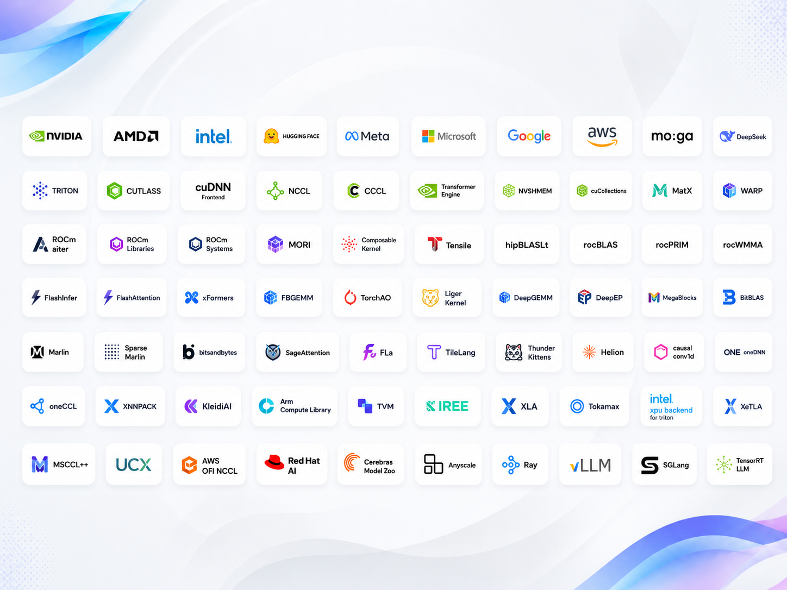

# Top 50 GitHub Repositories

| Name                                   | Description                                                                                                                                                                                    | Link of repo                                                                                                           |
| -------------------------------------- | ---------------------------------------------------------------------------------------------------------------------------------------------------------------------------------------------- | ---------------------------------------------------------------------------------------------------------------------- |
| **1. NVIDIA CUTLASS**                  | NVIDIA's fundamental CUDA template and CuTe DSL substrate for Tensor Core GEMM, convolution, grouped GEMM, attention and architecture-specialized linear algebra kernels. ([GitHub][2])        | [NVIDIA/cutlass](https://github.com/NVIDIA/cutlass?utm_source=chatgpt.com)                                             |
| **2. Triton**                          | Dominant Python kernel DSL and MLIR/LLVM compiler stack for authoring high-performance GPU kernels without dropping to handwritten CUDA or assembly. ([GitHub][3])                             | [triton-lang/triton](https://github.com/triton-lang/triton?utm_source=chatgpt.com)                                     |
| **3. NVIDIA CCCL**                     | CUDA Core Compute Libraries unifying CUB, Thrust and libcudacxx into the foundational CUDA C++ primitives for scans, reductions, sorting and device algorithms. ([GitHub][4])                  | [NVIDIA/cccl](https://github.com/NVIDIA/cccl?utm_source=chatgpt.com)                                                   |
| **4. NVIDIA cuDNN Frontend**           | Modern cuDNN graph interface plus open kernels for SDPA, FlashAttention, grouped GEMM, MoE and fused normalization/activation on Hopper and Blackwell. ([GitHub][5])                           | [NVIDIA/cudnn-frontend](https://github.com/NVIDIA/cudnn-frontend?utm_source=chatgpt.com)                               |
| **5. NVIDIA NCCL**                     | Production-standard multi-GPU communication primitives implementing optimized AllReduce, AllGather, ReduceScatter, Broadcast and send/receive paths. ([GitHub][6])                             | [NVIDIA/nccl](https://github.com/NVIDIA/nccl?utm_source=chatgpt.com)                                                   |
| **6. AMD AITER**                       | AMD's performance-critical AI operator library combining assembly, Composable Kernel and Triton kernels for GEMM, attention, MoE, quantization and training/inference fusion. ([GitHub][7])    | [ROCm/aiter](https://github.com/ROCm/aiter?utm_source=chatgpt.com)                                                     |
| **7. NVIDIA Transformer Engine**       | NVIDIA's Transformer primitive library for fused operators and FP8, MXFP8 and NVFP4 execution across Ampere, Hopper and Blackwell. ([GitHub][8])                                               | [NVIDIA/TransformerEngine](https://github.com/NVIDIA/TransformerEngine?utm_source=chatgpt.com)                         |
| **8. AMD ROCm Libraries**              | Current consolidated source for core AMD numerical and ML libraries including Composable Kernel, rocBLAS-family primitives, rocPRIM, rocWMMA, MIOpen and related components. ([GitHub][9])     | [ROCm/rocm-libraries](https://github.com/ROCm/rocm-libraries?utm_source=chatgpt.com)                                   |
| **9. FlashInfer**                      | Purpose-built kernel library for LLM serving covering attention, paged KV-cache operations, sampling, GEMM, MoE and serving-specific fusion. ([GitHub][10])                                    | [flashinfer-ai/flashinfer](https://github.com/flashinfer-ai/flashinfer?utm_source=chatgpt.com)                         |
| **10. FlashAttention**                 | Canonical implementation family of IO-aware exact attention kernels that fundamentally changed Transformer attention memory traffic and execution efficiency. ([GitHub][11])                   | [Dao-AILab/flash-attention](https://github.com/Dao-AILab/flash-attention?utm_source=chatgpt.com)                       |
| **11. DeepSeek DeepGEMM**              | DeepSeek's compact high-performance GPU BLAS/kernel library targeting low-precision GEMM and LLM/MoE execution. ([GitHub][12])                                                                 | [deepseek-ai/DeepGEMM](https://github.com/deepseek-ai/DeepGEMM?utm_source=chatgpt.com)                                 |
| **12. NVIDIA NVSHMEM**                 | GPU-initiated one-sided communication substrate providing globally addressable symmetric memory and fine-grained device-side communication primitives. ([GitHub][13])                          | [NVIDIA/nvshmem](https://github.com/NVIDIA/nvshmem?utm_source=chatgpt.com)                                             |
| **13. Microsoft MSCCL++**              | GPU-driven communication stack exposing programmable communication primitives for high-performance collective and point-to-point AI workloads. ([GitHub][14])                                  | [microsoft/mscclpp](https://github.com/microsoft/mscclpp?utm_source=chatgpt.com)                                       |
| **14. AMD ROCm Systems**               | Current AMD systems source tree containing RCCL, rocSHMEM, HIP/runtime infrastructure and other low-level components after repository consolidation. ([GitHub][15])                            | [ROCm/rocm-systems](https://github.com/ROCm/rocm-systems?utm_source=chatgpt.com)                                       |
| **15. DeepSeek DeepEP**                | Expert-parallel communication library optimized around high-throughput and low-latency token dispatch/combine for large MoE systems. ([GitHub][16])                                            | [deepseek-ai/DeepEP](https://github.com/deepseek-ai/DeepEP?utm_source=chatgpt.com)                                     |
| **16. PyTorch FBGEMM**                 | Meta/PyTorch production kernel library spanning quantized GEMM, embeddings, sparse/jagged operators and increasingly GenAI-focused GPU primitives. ([GitHub][17])                              | [pytorch/FBGEMM](https://github.com/pytorch/FBGEMM?utm_source=chatgpt.com)                                             |
| **17. UXL oneDNN**                     | Mature cross-platform neural-network primitive library with deeply optimized CPU and Intel GPU execution plus broader SYCL accelerator support. ([GitHub][18])                                 | [uxlfoundation/oneDNN](https://github.com/uxlfoundation/oneDNN?utm_source=chatgpt.com)                                 |
| **18. Intel XPU Backend for Triton**   | Intel's Triton compiler backend for Xe GPUs, enabling Triton kernels to target Arc, Flex and Data Center GPU families. ([GitHub][19])                                                          | [intel/intel-xpu-backend-for-triton](https://github.com/intel/intel-xpu-backend-for-triton?utm_source=chatgpt.com)     |
| **19. Intel XeTLA**                    | Intel's low-level tile abstraction library for explicitly exploiting Xe GPU matrix engines, SIMD execution and architecture-specific kernel optimization. ([GitHub][20])                       | [intel/xetla](https://github.com/intel/xetla?utm_source=chatgpt.com)                                                   |
| **20. PyTorch TorchAO**                | PyTorch-native quantization, low-precision and sparsity stack containing optimized primitives for modern training and inference paths. ([GitHub][21])                                          | [pytorch/ao](https://github.com/pytorch/ao?utm_source=chatgpt.com)                                                     |
| **21. Meta xFormers**                  | Optimized Transformer building blocks with CUDA kernels and backend dispatch for memory-efficient attention, sparse attention, fused softmax and related operators. ([GitHub][22])             | [facebookresearch/xformers](https://github.com/facebookresearch/xformers?utm_source=chatgpt.com)                       |
| **22. OpenXLA XLA**                    | Production ML compiler that lowers tensor programs into optimized accelerator code and forms the compiler-to-kernel substrate behind major JAX and TPU workloads. ([GitHub][23])               | [openxla/xla](https://github.com/openxla/xla?utm_source=chatgpt.com)                                                   |
| **23. OpenXLA Tokamax**                | OpenXLA's dedicated GPU and TPU kernel library, making it considerably closer to the primitive layer than the broader JAX framework. ([GitHub][24])                                            | [openxla/tokamax](https://github.com/openxla/tokamax?utm_source=chatgpt.com)                                           |
| **24. Hugging Face kernels-community** | Actual source repository behind Hugging Face Kernel Hub kernels, including attention, MoE, quantization, RMSNorm, RoPE, paged attention and imported optimized kernel families. ([GitHub][25]) | [huggingface/kernels-community](https://github.com/huggingface/kernels-community?utm_source=chatgpt.com)               |
| **25. Hugging Face kernels**           | Kernel Hub infrastructure for deterministically building, versioning, loading and executing binary compute kernels independently of normal Python package boundaries. ([GitHub][26])           | [huggingface/kernels](https://github.com/huggingface/kernels?utm_source=chatgpt.com)                                   |
| **26. LinkedIn Liger-Kernel**          | Training-focused Triton kernels providing fused normalization, activation, RoPE, cross-entropy and other memory-intensive LLM primitives. ([GitHub][27])                                       | [linkedin/Liger-Kernel](https://github.com/linkedin/Liger-Kernel?utm_source=chatgpt.com)                               |
| **27. TileLang**                       | High-performance tile-level kernel DSL targeting GPUs, CPUs and accelerators with explicit control over tiled compute and memory scheduling. ([GitHub][28])                                    | [tile-ai/tilelang](https://github.com/tile-ai/tilelang?utm_source=chatgpt.com)                                         |
| **28. ThunderKittens**                 | CUDA tile-primitive framework exposing hardware-aware abstractions for constructing highly tuned attention, GEMM and fused GPU kernels. ([GitHub][29])                                         | [HazyResearch/ThunderKittens](https://github.com/HazyResearch/ThunderKittens?utm_source=chatgpt.com)                   |
| **29. AMD MORI**                       | AMD's Modular RDMA Interface providing low-level GPU communication mechanisms for distributed inference, MoE communication and GPU-centric networking. ([GitHub][30])                          | [ROCm/mori](https://github.com/ROCm/mori?utm_source=chatgpt.com)                                                       |
| **30. UXL oneCCL**                     | oneAPI collective communication library providing optimized distributed communication primitives across CPU and accelerator environments. ([GitHub][31])                                       | [uxlfoundation/oneCCL](https://github.com/uxlfoundation/oneCCL?utm_source=chatgpt.com)                                 |
| **31. Google XNNPACK**                 | Production low-level inference primitive library optimized across Arm, x86, WebAssembly and RISC-V and consumed by major ML runtimes. ([GitHub][32])                                           | [google/XNNPACK](https://github.com/google/XNNPACK?utm_source=chatgpt.com)                                             |
| **32. Arm KleidiAI**                   | Architecture-specific Arm CPU microkernel library implementing minimal high-performance building blocks for matrix, quantization and ML operators. ([GitHub][33])                              | [ARM-software/kleidiai](https://github.com/ARM-software/kleidiai?utm_source=chatgpt.com)                               |
| **33. Arm Compute Library**            | Production Arm CPU/GPU ML operator library exploiting NEON, SVE and GPU execution for highly optimized inference primitives. ([GitHub][34])                                                    | [ARM-software/ComputeLibrary](https://github.com/ARM-software/ComputeLibrary?utm_source=chatgpt.com)                   |
| **34. Apache TVM**                     | Tensor compiler stack providing scheduling, lowering and code generation infrastructure for optimized operators across heterogeneous targets. ([GitHub][35])                                   | [apache/tvm](https://github.com/apache/tvm?utm_source=chatgpt.com)                                                     |
| **35. IREE**                           | MLIR-based compiler/runtime toolkit designed to lower ML workloads into compact, hardware-specific executable kernels across heterogeneous platforms. ([GitHub][36])                           | [iree-org/iree](https://github.com/iree-org/iree?utm_source=chatgpt.com)                                               |
| **36. PyTorch Helion**                 | Python-embedded kernel DSL that generates and autotunes Triton implementations while retaining explicit tile-level ML kernel semantics. ([GitHub][37])                                         | [pytorch/helion](https://github.com/pytorch/helion?utm_source=chatgpt.com)                                             |
| **37. Flash Linear Attention**         | Hardware-efficient Triton implementations for linear attention, sparse attention, state-space and hybrid sequence-model primitives across NVIDIA, AMD and Intel. ([GitHub][38])                | [fla-org/flash-linear-attention](https://github.com/fla-org/flash-linear-attention?utm_source=chatgpt.com)             |
| **38. SageAttention**                  | Aggressively quantized attention-kernel family exploring INT8, INT4 and microscaling low-precision execution for attention-heavy inference. ([GitHub][39])                                     | [thu-ml/SageAttention](https://github.com/thu-ml/SageAttention?utm_source=chatgpt.com)                                 |
| **39. Databricks MegaBlocks**          | Sparse and grouped-GEMM MoE primitive stack built around block-sparse execution for efficient dropless expert computation. ([GitHub][40])                                                      | [databricks/megablocks](https://github.com/databricks/megablocks?utm_source=chatgpt.com)                               |
| **40. Microsoft BitBLAS**              | Mixed-precision matrix multiplication library focused on highly optimized low-bit GEMM kernels for quantized LLM deployment. ([GitHub][41])                                                    | [microsoft/BitBLAS](https://github.com/microsoft/BitBLAS?utm_source=chatgpt.com)                                       |
| **41. Marlin**                         | Highly specialized FP16×INT4 matrix-multiplication kernel designed to retain near-ideal quantization speedups beyond batch-one LLM inference. ([GitHub][42])                                   | [IST-DASLab/marlin](https://github.com/IST-DASLab/marlin?utm_source=chatgpt.com)                                       |
| **42. Sparse-Marlin**                  | Sparse extension of Marlin combining 4-bit quantization with NVIDIA 2:4 structured sparsity for accelerated LLM linear layers. ([GitHub][43])                                                  | [IST-DASLab/Sparse-Marlin](https://github.com/IST-DASLab/Sparse-Marlin?utm_source=chatgpt.com)                         |
| **43. bitsandbytes**                   | Widely deployed low-bit primitive library providing INT8/4-bit quantization, quantized linear operators and low-memory optimizer kernels across multiple accelerators. ([GitHub][44])          | [bitsandbytes-foundation/bitsandbytes](https://github.com/bitsandbytes-foundation/bitsandbytes?utm_source=chatgpt.com) |
| **44. Dao-AILab causal-conv1d**        | Compact CUDA/HIP implementation of fused causal depthwise 1-D convolution used as a core primitive in modern state-space sequence architectures. ([GitHub][45])                                | [Dao-AILab/causal-conv1d](https://github.com/Dao-AILab/causal-conv1d?utm_source=chatgpt.com)                           |
| **45. NVIDIA MatX**                    | C++20 numerical tensor library providing expression fusion, GPU execution and JIT-oriented primitives for CUDA numerical workloads. ([GitHub][46])                                             | [NVIDIA/MatX](https://github.com/NVIDIA/MatX?utm_source=chatgpt.com)                                                   |
| **46. NVIDIA Warp**                    | JIT-compiled Python kernel programming framework producing efficient CPU/CUDA code with differentiable GPU primitives for ML, robotics and simulation workloads. ([GitHub][47])                | [NVIDIA/warp](https://github.com/NVIDIA/warp?utm_source=chatgpt.com)                                                   |
| **47. Apple MLX**                      | Apple Silicon tensor substrate with C++/Metal/CUDA kernels, lazy execution, unified-memory semantics and low-level array primitives beneath its higher-level ML API. ([GitHub][48])            | [ml-explore/mlx](https://github.com/ml-explore/mlx?utm_source=chatgpt.com)                                             |
| **48. UCX**                            | Production communication substrate exposing RDMA, GPU memory, shared-memory, network-atomic and low-latency transport primitives beneath distributed ML stacks. ([GitHub][49])                 | [openucx/ucx](https://github.com/openucx/ucx?utm_source=chatgpt.com)                                                   |
| **49. AWS OFI NCCL**                   | AWS's NCCL transport plugin connecting NCCL collectives to libfabric and EFA-class networking for distributed GPU workloads on EC2. ([GitHub][50])                                             | [aws/aws-ofi-nccl](https://github.com/aws/aws-ofi-nccl?utm_source=chatgpt.com)                                         |
| **50. NVIDIA cuCollections**           | CUDA-native concurrent data-structure primitives for GPU hash maps, sets and related device-resident collections useful below higher-level ML systems. ([GitHub][51])                          | [NVIDIA/cuCollections](https://github.com/NVIDIA/cuCollections?utm_source=chatgpt.com)                                 |

[1]: https://github.com/ROCm/rccl "GitHub - ROCm/rccl: [DEPRECATED] Moved to ROCm/rocm-systems repo · GitHub"
[2]: https://github.com/NVIDIA/cutlass "GitHub - NVIDIA/cutlass: CUDA Templates and Python DSLs for High-Performance Linear Algebra · GitHub"
[3]: https://github.com/triton-lang/triton "GitHub - triton-lang/triton: Development repository for the Triton language and compiler · GitHub"
[4]: https://github.com/NVIDIA/cccl "GitHub - NVIDIA/cccl: CUDA Core Compute Libraries · GitHub"
[5]: https://github.com/NVIDIA/cudnn-frontend "GitHub - NVIDIA/cudnn-frontend: cuDNN Frontend is NVIDIA's modern, open-source entry point to the cuDNN library and a growing collection of high-performance open-source kernels. · GitHub"
[6]: https://github.com/NVIDIA/nccl "GitHub - NVIDIA/nccl: Optimized primitives for collective multi-GPU communication · GitHub"
[7]: https://github.com/ROCm/aiter "GitHub - ROCm/aiter: AI Tensor Engine for ROCm · GitHub"
[8]: https://github.com/NVIDIA/TransformerEngine "GitHub - NVIDIA/TransformerEngine: A library for accelerating Transformer models on NVIDIA GPUs, including using 8-bit and 4-bit floating point (FP8 and FP4) precision on Hopper, Ada and Blackwell GPUs, to provide better performance with lower memory utilization in both training and inference. · GitHub"
[9]: https://github.com/ROCm/rocm-libraries "GitHub - ROCm/rocm-libraries: super repo for rocm libraries · GitHub"
[10]: https://github.com/flashinfer-ai/flashinfer "GitHub - flashinfer-ai/flashinfer: FlashInfer: Kernel Library for LLM Serving · GitHub"
[11]: https://github.com/Dao-AILab/flash-attention "GitHub - Dao-AILab/flash-attention: Fast and memory-efficient exact attention · GitHub"
[12]: https://github.com/deepseek-ai/DeepGEMM "GitHub - deepseek-ai/DeepGEMM: DeepGEMM: clean and efficient BLAS kernel library on GPU · GitHub"
[13]: https://github.com/NVIDIA/nvshmem "GitHub - NVIDIA/nvshmem: NVIDIA NVSHMEM is a parallel programming interface for NVIDIA GPUs based on OpenSHMEM. NVSHMEM can significantly reduce multi-process communication and coordination overheads by allowing programmers to perform one-sided communication from within CUDA kernels and on CUDA streams. · GitHub"
[14]: https://github.com/microsoft/mscclpp "GitHub - microsoft/mscclpp: MSCCL++: A GPU-driven communication stack for scalable AI applications · GitHub"
[15]: https://github.com/ROCm/rocm-systems "GitHub - ROCm/rocm-systems: super repo for rocm systems projects · GitHub"
[16]: https://github.com/deepseek-ai/DeepEP "GitHub - deepseek-ai/DeepEP: DeepEP: an efficient expert-parallel communication library · GitHub"
[17]: https://github.com/pytorch/FBGEMM "GitHub - pytorch/FBGEMM: FB (Facebook) + GEMM (General Matrix-Matrix Multiplication) - https://code.fb.com/ml-applications/fbgemm/ · GitHub"
[18]: https://github.com/uxlfoundation/oneDNN "GitHub - uxlfoundation/oneDNN: oneAPI Deep Neural Network Library (oneDNN) · GitHub"
[19]: https://github.com/intel/intel-xpu-backend-for-triton "GitHub - intel/intel-xpu-backend-for-triton: OpenAI Triton backend for Intel® GPUs · GitHub"
[20]: https://github.com/intel/xetla "GitHub - intel/xetla · GitHub"
[21]: https://github.com/pytorch/ao "GitHub - pytorch/ao: PyTorch native quantization and sparsity for training and inference · GitHub"
[22]: https://github.com/facebookresearch/xformers "GitHub - facebookresearch/xformers: Hackable and optimized Transformers building blocks, supporting a composable construction. · GitHub"
[23]: https://github.com/openxla/xla "GitHub - openxla/xla: A machine learning compiler for GPUs, CPUs, and ML accelerators · GitHub"
[24]: https://github.com/openxla/tokamax "GitHub - openxla/tokamax: Tokamax: A GPU and TPU kernel library. · GitHub"
[25]: https://github.com/huggingface/kernels-community "GitHub - huggingface/kernels-community: Kernel sources for https://huggingface.co/kernels-community · GitHub"
[26]: https://github.com/huggingface/kernels "GitHub - huggingface/kernels: Build compute kernels and load them from the Hub. · GitHub"
[27]: https://github.com/linkedin/Liger-Kernel "GitHub - linkedin/Liger-Kernel: Efficient Triton Kernels for LLM Training · GitHub"
[28]: https://github.com/tile-ai/tilelang "GitHub - tile-ai/tilelang: Domain-specific language designed to streamline the development of high-performance GPU/CPU/Accelerators kernels · GitHub"
[29]: https://github.com/HazyResearch/ThunderKittens "GitHub - HazyResearch/ThunderKittens: Tile primitives for speedy kernels · GitHub"
[30]: https://github.com/ROCm/mori "GitHub - ROCm/mori: Modular RDMA Interface · GitHub"
[31]: https://github.com/uxlfoundation/oneCCL "GitHub - uxlfoundation/oneCCL: oneAPI Collective Communications Library (oneCCL) · GitHub"
[32]: https://github.com/google/XNNPACK "GitHub - google/XNNPACK: High-efficiency floating-point neural network inference operators for mobile, server, and Web · GitHub"
[33]: https://github.com/ARM-software/kleidiai "https://github.com/ARM-software/kleidiai"
[34]: https://github.com/ARM-software/ComputeLibrary "GitHub - ARM-software/ComputeLibrary: The Compute Library is a set of computer vision and machine learning functions optimised for both Arm CPUs and GPUs using SIMD technologies. · GitHub"
[35]: https://github.com/apache/tvm "GitHub - apache/tvm: Open Machine Learning Compiler Framework · GitHub"
[36]: https://github.com/iree-org/iree "GitHub - iree-org/iree: A retargetable MLIR-based machine learning compiler and runtime toolkit. · GitHub"
[37]: https://github.com/pytorch/helion "GitHub - pytorch/helion: A Python-embedded DSL that makes it easy to write fast, scalable ML kernels with minimal boilerplate. · GitHub"
[38]: https://github.com/fla-org/flash-linear-attention "https://github.com/fla-org/flash-linear-attention"
[39]: https://github.com/thu-ml/SageAttention "GitHub - thu-ml/SageAttention: [ICLR2025, ICML2025, NeurIPS2025 Spotlight] Quantized Attention achieves speedup of 2-5x compared to FlashAttention, without losing end-to-end metrics across language, image, and video models. · GitHub"
[40]: https://github.com/databricks/megablocks?utm_source=chatgpt.com "GitHub - databricks/megablocks · GitHub"
[41]: https://github.com/microsoft/BitBLAS "GitHub - microsoft/BitBLAS: BitBLAS is a library to support mixed-precision matrix multiplications, especially for quantized LLM deployment. · GitHub"
[42]: https://github.com/IST-DASLab/marlin "GitHub - IST-DASLab/marlin: FP16xINT4 LLM inference kernel that can achieve near-ideal ~4x speedups up to medium batchsizes of 16-32 tokens. · GitHub"
[43]: https://github.com/IST-DASLab/Sparse-Marlin "GitHub - IST-DASLab/Sparse-Marlin: Boosting 4-bit inference kernels with 2:4 Sparsity · GitHub"
[44]: https://github.com/bitsandbytes-foundation/bitsandbytes "GitHub - bitsandbytes-foundation/bitsandbytes: Accessible large language models via k-bit quantization for PyTorch. · GitHub"
[45]: https://github.com/Dao-AILab/causal-conv1d "GitHub - Dao-AILab/causal-conv1d: Causal depthwise conv1d in CUDA, with a PyTorch interface · GitHub"
[46]: https://github.com/NVIDIA/MatX "GitHub - NVIDIA/MatX: An efficient C++20 GPU numerical computing library with Python-like syntax · GitHub"
[47]: https://github.com/NVIDIA/warp "GitHub - NVIDIA/warp: A Python framework for GPU-accelerated simulation, robotics, and machine learning. · GitHub"
[48]: https://github.com/ml-explore/mlx "GitHub - ml-explore/mlx: MLX: An array framework for Apple silicon · GitHub"
[49]: https://github.com/openucx/ucx "GitHub - openucx/ucx: Unified Communication X (mailing list - https://elist.ornl.gov/mailman/listinfo/ucx-group) · GitHub"
[50]: https://github.com/aws/aws-ofi-nccl "GitHub - aws/aws-ofi-nccl: This is a plugin which lets EC2 developers use libfabric as network provider while running NCCL applications. · GitHub"
[51]: https://github.com/NVIDIA/cuCollections "GitHub - NVIDIA/cuCollections · GitHub"
