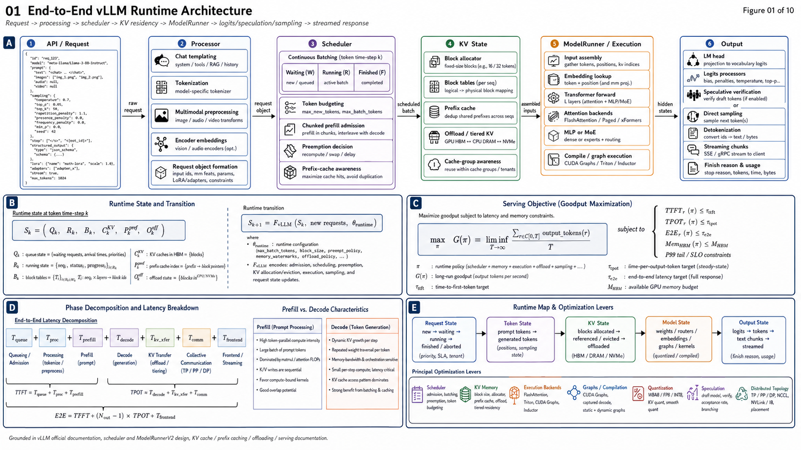
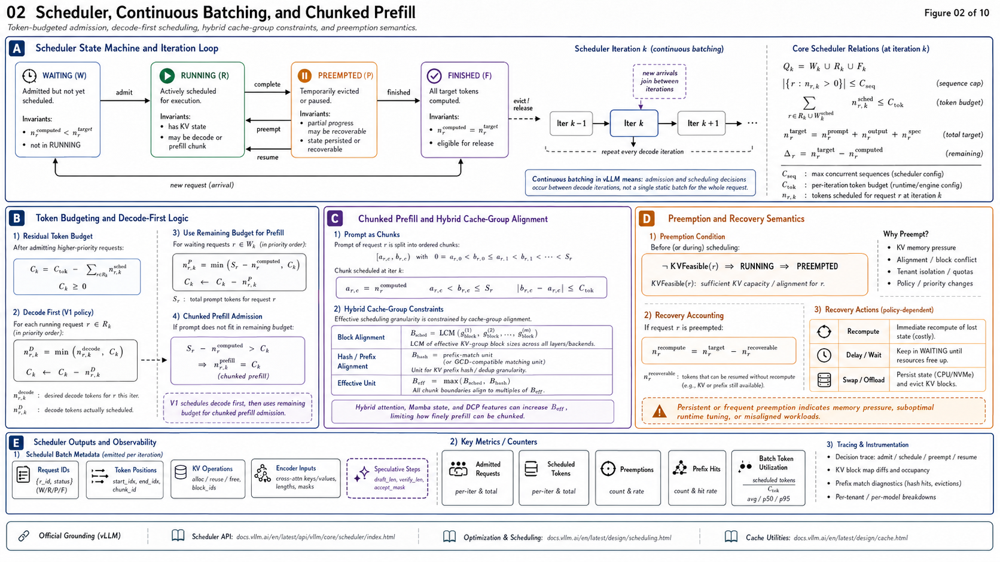
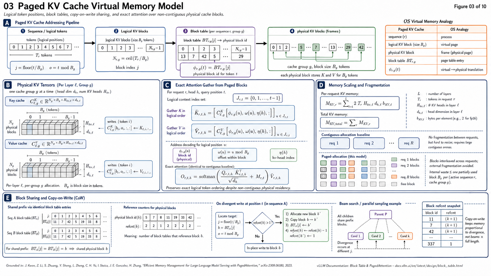
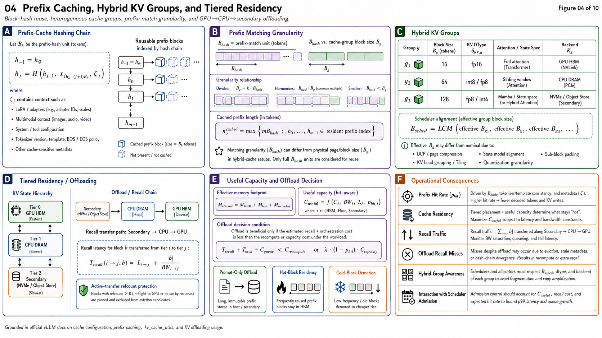
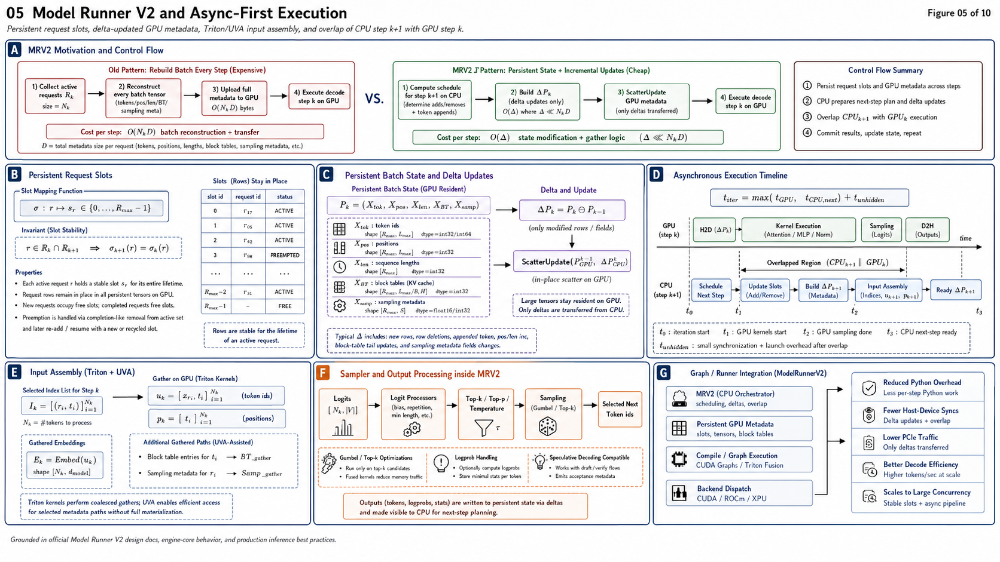
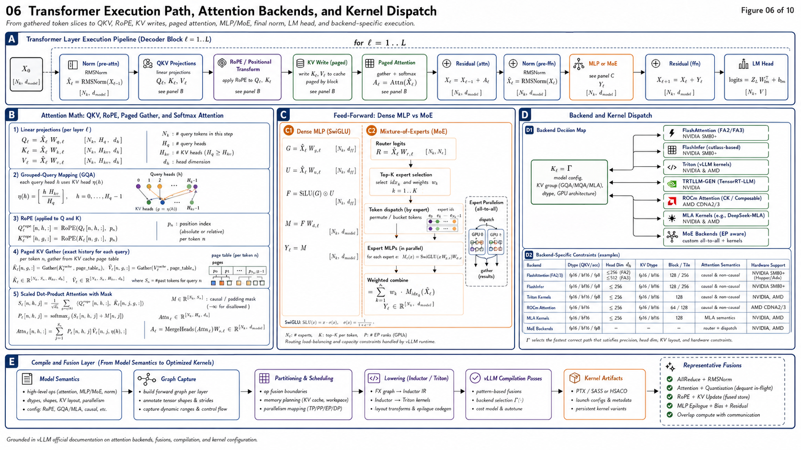
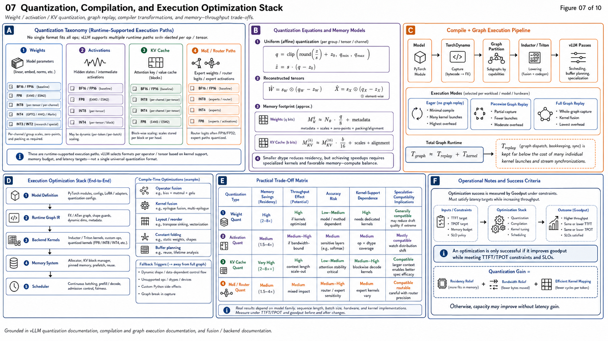
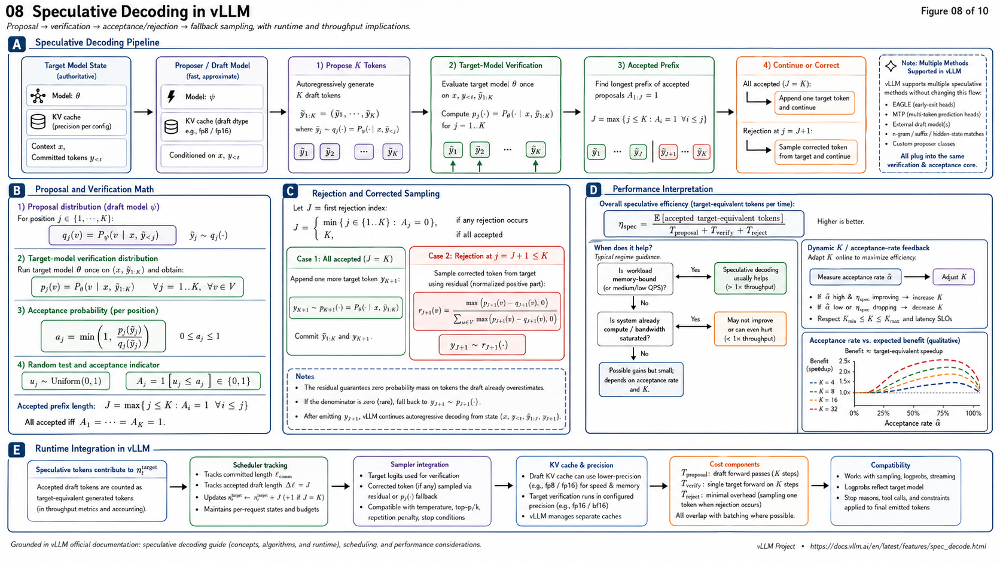
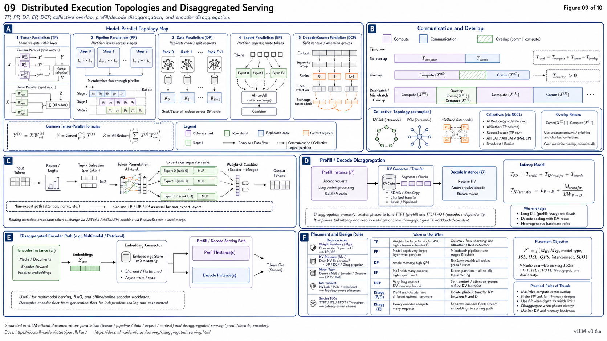
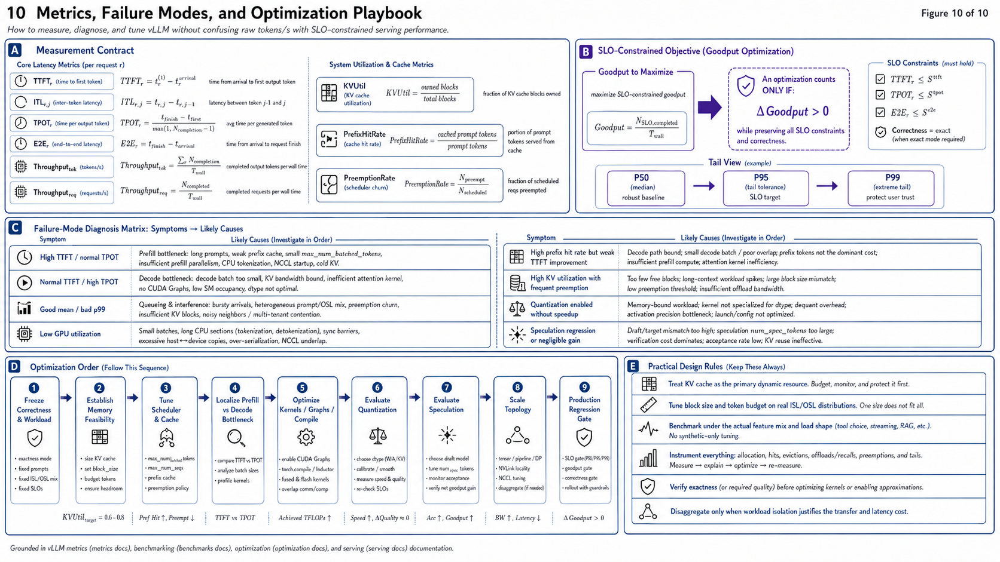

# vLLM: Architecture, Memory System, Schedu

---

## Abstract

vLLM should not be understood as an attention-kernel optimization library. It is an **LLM execution runtime whose primary optimization problem is resource scheduling across dynamic autoregressive workloads**.

The original system established this direction through PagedAttention: instead of reserving contiguous KV-cache tensors for requests whose final sequence lengths are unknown, KV state is managed in fixed-size blocks and logical sequence positions are mapped to physical cache blocks. This reduced fragmentation, supported KV sharing, and allowed substantially larger effective batches. The original SOSP work reported 2–4× serving-throughput improvements against contemporaneous systems at comparable latency; the 2023 launch experiments reported larger gains against Hugging Face Transformers and TGI under their evaluated configurations. ion is now historically incomplete.

As of **vLLM v0.26.0, released July 25, 2026**, the runtime encompasses dynamic token scheduling, chunked prefill, prefix reuse, heterogeneous KV-cache groups, multi-tier KV offloading, Model Runner V2, asynchronous CPU/GPU orchestration, full and piecewise graph execution, multiple attention/GEMM/MoE kernel families, speculative decoding, weight/activation/KV quantization, multiple forms of model parallelism, and prefill/decode/encoder disaggregation. ion objective is therefore:

[
\boxed{
\max_{\mathcal C}
;\operatorname{Goodput}(\mathcal C)
\quad
\text{s.t.}
\quad
\operatorname{TTFT}*{p99}\le S*{\mathrm{TTFT}},
;
\operatorname{TPOT}*{p99}\le S*{\mathrm{TPOT}},
;
M_{\mathrm{HBM}}\le M_{\mathrm{device}},
;
\text{correctness preserved}
}
]

where (\mathcal C) includes scheduling, KV allocation, cache reuse, compilation, kernel selection, precision, speculative-decoding configuration, parallel topology, and distributed cache placement.

Raw tokens/s alone is not a sufficient optimization target.

---

# 1. Evidence Policy and Version Boundary

This report uses four evidence classes:

**[REPORTED]** behavior or performance explicitly reported by vLLM documentation, release notes, or the PagedAttention paper.

**[CODE/API]** behavior visible in current vLLM API/source documentation.

**[DERIVED]** consequence derived mathematically or architecturally from reported mechanisms.

**[WORKLOAD-DEPENDENT]** behavior whose sign or magnitude cannot be established without benchmark data for the target model, hardware, request-length distribution, and load.

The earlier report correctly centered the problem on KV residency, scheduling, fragmentation, preemption, prefix reuse, TTFT, TPOT, ITL, and HBM occupancy.

The important update is the version boundary.

**vLLM v0.26.0 is the latest release as of July 25, 2026.**  v0.25.0, released July 11, had already made Model Runner V2 the default execution path for dense models and removed the legacy PagedAttention implementation. “PagedAttention was removed” must not be interpreted as “vLLM stopped paging KV cache.”** The deleted component was the legacy attention implementation. Current vLLM still exposes block tables, block pools, KV-cache groups, block-based prefix reuse, paged/sparse attention backends, cache offloading, and block-granular scheduling. v0.26.0 further generalized backend selection per KV-cache group. [xt{PagedAttention}_{2023}
\neq
\text{current attention implementation}
]

but

[
\text{paged/block-virtualized KV management}
\subset
\text{current vLLM architecture}.
]

---

# 2. The Actual vLLM Optimization Problem

An autoregressive serving engine simultaneously manages four resource domains:

[
\mathcal R=
{
\text{HBM capacity},
\text{HBM bandwidth},
\text{GPU compute},
\text{CPU/orchestration}
}.
]

The dominant resource changes with phase.

### Prefill

For prompt length (T), prefill evaluates many tokens concurrently. Large matrix multiplications expose substantial GPU parallelism and are normally far more compute-intensive than one-token decode.

### Decode

Each active sequence normally advances only a small number of tokens per iteration. Model weights are repeatedly traversed while relatively little arithmetic is performed per request, making decode particularly sensitive to memory bandwidth, batch size, kernel-launch overhead, and CPU scheduling overhead.

vLLM's current optimization stack explicitly addresses this asymmetry through continuous batching, decode-prioritized chunked prefill, speculative decoding, CUDA/HIP graphs, fused kernels, and optionally prefill/decode disaggregation. objective is therefore not:

[
\min t_{\mathrm{forward}}
]

but approximately:

[
\min
{
t_{\mathrm{queue}},
t_{\mathrm{prefill}},
t_{\mathrm{decode}},
t_{\mathrm{launch}},
t_{\mathrm{comm}},
t_{\mathrm{KV-transfer}},
t_{\mathrm{frontend}}
}
]

under a constrained shared-resource system.

---

# 3. End-to-End Runtime State Transition

The serving path is usefully represented as:

[
\text{HTTP/API request}
\rightarrow
\text{tokenization/processing}
\rightarrow
R_{\mathrm{WAITING}}
\rightarrow
\text{Scheduler}
\rightarrow
\text{KV allocation/reuse}
\rightarrow
\text{InputBatch}
\rightarrow
\text{ModelRunner}
\rightarrow
\text{attention/GEMM/MoE kernels}
\rightarrow
\text{sampler}
\rightarrow
R_{\mathrm{RUNNING}}
\rightarrow
\text{next scheduler iteration}
\rightarrow
R_{\mathrm{FINISHED}}.
]

The critical observation is that vLLM does **not** execute one request from beginning to end before servicing another.

The scheduler repeatedly reconstructs the executable token workload from active request state. This is the systems basis of continuous batching.

Current EngineCore also supports batch queuing: it can schedule another batch while earlier GPU work remains outstanding, with scheduler state updated from completed model outputs afterward. V2 takes this further by explicitly designing the CPU side around asynchronous execution: while GPU execution for step (n) proceeds, scheduler/model-runner work for step (n+1) can proceed without introducing unnecessary CPU/GPU barriers. Cache: The Primary Dynamic Memory Object

For a Transformer with:

* (L): cached attention layers
* (n_{kv}): KV heads
* (d_h): head dimension
* (T): cached tokens
* (b): bytes per KV element,

the unsharded KV memory for one sequence is approximately

[
M_{\mathrm{KV}}(T)
==================

2L,n_{kv},d_h,T,b.
]

The factor (2) corresponds to keys and values.

Define per-token cache consumption:

[
m_{\mathrm{KV/token}}
=====================

2L n_{kv} d_h b.
]

Then for active sequences (i=1,\ldots,N),

[
M_{\mathrm{KV,total}}
\approx
m_{\mathrm{KV/token}}
\sum_i T_i.
]

[DERIVED]

This explains why KV capacity controls concurrency even when model weights remain constant.

The original vLLM analysis identified precisely this problem: KV cache is both large and dynamically sized, and prior contiguous-memory approaches could incur severe fragmentation and reservation waste. The launch analysis reported 60–80% memory waste in the evaluated earlier systems. ed KV Memory Model

The conceptual memory transformation introduced by PagedAttention is:

[
\text{Sequence}
\rightarrow
\text{logical token blocks}
\rightarrow
\text{block table}
\rightarrow
\text{physical KV blocks}.
]

The virtual-memory analogy is exact at the abstraction level:

| LLM serving object | OS analogy             |
| ------------------ | ---------------------- |
| Sequence           | Process                |
| Logical KV block   | Virtual page           |
| Physical KV block  | Physical frame         |
| Block table        | Page table             |
| Token position     | Logical address offset |

Physical KV blocks need not be contiguous.

Suppose a block stores (B) tokens. Logical token (t) belongs to

[
j=\left\lfloor\frac{t}{B}\right\rfloor,
\qquad
o=t\bmod B.
]

The per-request block table resolves logical block (j) into the physical cache block consumed by the attention backend.

Current vLLM still has explicit `BlockTable` and `MultiGroupBlockTable` objects, including device-side representations and mapping from KV-manager block IDs to kernel block IDs. ull-attention blocks, paging bounds normal terminal internal waste to less than one block per active sequence:

[
W_i < B,m_{\mathrm{KV/token}}.
]

[DERIVED]

This is radically different from reserving a contiguous allocation based on an uncertain future maximum length.

---

# 6. Multi-Sequence Sharing and Copy-on-Write

Paged addressing also decouples logical ownership from physical ownership.

If multiple output sequences share an identical prefix,

[
BT_A[j]
=======

# BT_B[j]

p_j
]

can reference the same physical block (p_j).

Once one sequence diverges, shared state must not be overwritten; the original PagedAttention design uses reference counting and copy-on-write semantics for this purpose. The launch report showed that this mechanism significantly reduced memory duplication for parallel sampling and beam search in its evaluated configurations. sequently becomes more general in prefix caching: KV need not merely be shared between sibling sequences from the same request; identical block-aligned prefixes can be reused across requests.

---

# 7. Continuous Batching

Continuous batching is a **scheduler policy**, not an attention algorithm.

At iteration (k), define:

[
\mathcal A_k
============

\mathcal D_k
\cup
\mathcal P_k
]

where (\mathcal D_k) represents decode work and (\mathcal P_k) represents prompt/prefill work admitted into the iteration.

Requests can enter or leave between iterations.

Hence batch cardinality evolves as

[
|\mathcal A_{k+1}|
==================

## |\mathcal A_k|

## N_{\mathrm{finished}}

N_{\mathrm{preempted}}
+
N_{\mathrm{admitted}}.
]

The scheduler therefore packs **tokens**, not merely requests.

Current scheduling is constrained by token budget, request capacity, KV-cache availability, external KV operations, speculative state, multimodal encoder requirements, and distributed configuration. The current scheduler implementation constructs its KV manager with caching, cache-group and distributed-context information and tracks asynchronous KV operations and block copies. irst major distinction between a high-throughput inference runtime and a naïve batched forward loop.

---

# 8. Chunked Prefill

A very long prefill can monopolize an iteration.

vLLM therefore permits

[
T_{\mathrm{prompt}}
===================

\sum_{c=1}^{C} T_c
]

and schedules each prompt chunk separately.

In V1, chunked prefill is enabled by default whenever possible. The documented scheduling policy first admits pending decode work and uses the remaining `max_num_batched_tokens` budget for prefill. A prefill that does not fit the remaining token budget is chunked. nism is therefore:

[
\boxed{\text{decode first} \rightarrow \text{consume residual budget with prefill}}
]

rather than allowing a large prompt to block existing decode streams.

The documented tuning trade-off is explicit:

[
\downarrow; \texttt{max_num_batched_tokens}
\Rightarrow
\text{better ITL tendency}
]

while

[
\uparrow; \texttt{max_num_batched_tokens}
\Rightarrow
\text{better TTFT tendency for large prefills}.
]

vLLM documentation additionally recommends values above 8192 when optimizing throughput for smaller models on large GPUs, while emphasizing workload-specific tuning. peting objectives, not a universally optimal knob.

---

# 9. Automatic Prefix Caching

Prefix caching eliminates redundant prefill work.

Conceptually, for request (R),

[
P_R
===

P_{\mathrm{cached}}
\Vert
P_{\mathrm{new}},
]

so inference performs compute primarily for

[
P_{\mathrm{new}}
]

while the cache state corresponding to (P_{\mathrm{cached}}) is reused.

vLLM's documented APC architecture uses block hashes constructed from token-block content and its prefix history, allowing reusable blocks to be located without associating them exclusively with a particular request. g improves the **prefill-compute path**. It does not intrinsically make subsequent decode operations cheaper.

This distinction matters:

[
\text{APC gain}
\propto
\text{reusable prompt fraction}
]

not output length.

Current v0.26 development extends prefix-cache behavior to hybrid architectures, including partial prefix-cache hits and selective hybrid-cache retention. brid KV Architectures

A modern inference runtime can no longer assume every model layer has identical cache semantics.

Current vLLM handles heterogeneous cache groups and attention specifications; its cache capacity calculation is group-aware because the simple quantity

[
N_{\mathrm{blocks}}\times B
]

can be incorrect when one request occupies several heterogeneous KV-cache groups. nally introduced **per-KV-cache-group attention backend selection**, explicitly improving support for models that combine different attention types. nificant architectural progression from the original PagedAttention model:

[
\text{one homogeneous block allocator}
\rightarrow
\text{heterogeneous cache specifications}
+
\text{group-aware allocation}
+
\text{backend-specific execution}.
]

---

# 11. Model Runner V2

MRV2 is one of the most important changes in current vLLM architecture.

As of v0.25.0 it became the default execution path for dense models. dresses CPU-side and synchronization overhead that becomes increasingly visible as GPU kernels become faster.

## 11.1 Persistent Batch State

Instead of rebuilding large scheduling tensors every iteration, MRV2 allocates persistent request slots. Requests retain a fixed row during their active lifetime; GPU inputs are gathered from this persistent state. ation is approximately:

[
O(ND);\text{batch reconstruction}
\rightarrow
O(\Delta);\text{state modification}
+
\text{GPU gather}.
]

Here (\Delta) represents changes between successive iterations.

## 11.2 Async-First Execution

MRV2 assumes execution behaves like an asynchronous CUDA stream rather than a sequence of CPU-synchronized model calls.

The target pipeline is:

[
CPU_{n+1}
\parallel
GPU_n.
]

This reduces bubbles caused by Python orchestration and host-device synchronization. d Block-Table Updates

Large structures such as block tables remain resident on GPU. CPU changes are staged as compact diffs, transferred, then applied through a kernel rather than copying the entire structure every step. tion is particularly important because block tables can become large under high concurrency and long contexts.

## 11.4 GPU-Native Metadata

MRV2 uses Triton kernels to derive inputs including `input_ids`, positions, sequence lengths, and query offsets. It can also use UVA for selected CPU-resident structures. er

The MRV2 sampler moves major operations to Triton and includes Gumbel sampling, optimized top-k logprob handling, long-prompt logprob chunking, and sampling-state indirection intended to integrate cleanly with speculative decoding. rch.compile and Graph Execution

vLLM does not merely call stock `torch.compile`.

Its compilation system captures the model using TorchDynamo, can split/specialize the resulting graph, compiles regions using TorchInductor, applies vLLM-specific transformation passes, caches compilation artifacts, and combines compilation with CUDA graph execution to reduce host launch overhead. optimization can be decomposed into:

[
\text{graph capture}
\rightarrow
\text{partition/specialize}
\rightarrow
\text{Inductor lowering}
\rightarrow
\text{vLLM passes}
\rightarrow
\text{kernel artifact}
\rightarrow
\text{CUDA graph replay}.
]

Current CUDA-graph modes include piecewise, full, decode-only full graph, and combined full-plus-piecewise operation. `FULL_AND_PIECEWISE` is documented as the default and generally preferred mode for performance across most supported models. on targets a different bottleneck from Paged KV:

[
\text{Paged KV}
\rightarrow
\text{HBM capacity efficiency}
]

whereas

[
\text{CUDA graph}
\rightarrow
\text{CPU/launch overhead efficiency}.
]

These optimizations are complementary.

---

# 13. Compile-Time Fusion

Current vLLM performs custom Inductor transformations rather than requiring all performance fusions to be hard-coded inside model implementations.

Documented fusion families include:

[
\text{AllReduce}+\text{RMSNorm},
]

[
\text{Attention}+\text{Quantization},
]

[
\text{RoPE}+\text{KV-cache update},
]

and GEMM/communication overlap, together with sequence-parallel transformations. tecturally important because the model definition can remain semantically clean while hardware-specific transformations occur downstream:

[
\text{model semantics}
\rightarrow
\text{graph IR}
\rightarrow
\text{hardware optimization}.
]

The v0.25.1 patch illustrates why verification is essential: a mixed-dtype AllReduce+RMSNorm+quantization fusion could incorrectly match incompatible FP32/BF16 configurations and corrupt hidden states. The patch introduced a dtype guard and retained the fusion only for valid configurations. not** imply correct.

---

# 14. Attention Backend Layer

The term “vLLM attention kernel” is no longer singular.

Current documentation exposes backend families including FlashAttention, FlashInfer, TRTLLM-GEN-backed paths, Triton, ROCm attention implementations, TurboQuant-related paths, MLA-specific kernels, and hardware-specific alternatives. Backend capability varies by datatype, KV datatype, block size, head dimension, attention semantics, architecture, and compute capability. ntion, vLLM supports selection among FA2, FA3, and FA4. Current automatic policy documented for standard attention defaults to FA4 on SM100+, FA3 on SM90, and FA2 otherwise, subject to supported configurations. izes backend selection further:

[
\text{backend}
==============

f(
\text{KV group},
\text{attention type},
\text{dtype},
\text{architecture},
\text{hardware}
).
]

This means kernel tuning must start with **backend selection evidence**, not with the assumption that one implementation dominates universally.

---

# 15. GEMM and MoE Kernel Stack

Attention is only one component of LLM inference.

For dense models, projection and FFN GEMMs often dominate arithmetic.

For MoE models, the systems path expands to:

[
X
\rightarrow
\text{router}
\rightarrow
\text{top-}k
\rightarrow
\text{token permutation}
\rightarrow
\text{expert GEMM}
\rightarrow
\text{combine}
\rightarrow
Y.
]

Current vLLM exposes multiple MoE backends including Triton fused MoE, DeepGEMM, CUTLASS, TRTLLM-GEN/FlashInfer paths, CuTeDSL, Marlin, AMD AITer/FlyDSL, and several precision-specific backends. s further routing and MoE optimizations such as specialized DeepSeek-V4 routing kernels, `fused_topk_bias`, BF16/FP32 router GEMMs, TRTLLM BF16 modular MoE kernels, collective substitutions, and additional ROCm paths. kernel optimization problem is therefore:

[
t_{\mathrm{step}}
=================

t_{\mathrm{attn}}
+
t_{\mathrm{GEMM}}
+
t_{\mathrm{MoE}}
+
t_{\mathrm{collective}}
+
t_{\mathrm{sampling}}
+
t_{\mathrm{launch}}
+
t_{\mathrm{metadata}}.
]

Optimizing only attention can leave the actual critical path unchanged.

---

# 16. Quantization

Quantization in vLLM operates at several fundamentally different locations:

[
\boxed{
\text{weights}
\quad
\text{activations}
\quad
\text{KV cache}
\quad
\text{MoE paths}
}
]

and these should not be conflated.

Current documentation includes FP8, INT8, INT4, GPTQ/AWQ-class schemes, compressed-tensors/LLM Compressor formats, NVIDIA Model Optimizer, AMD Quark, TorchAO, GGUF and quantized KV-cache support, among others. Hardware compatibility is method-specific rather than universal. antization

Reduces weight residency:

[
M_W^{q}
\approx
N_{\theta}
\frac{q}{8}
+
M_{\mathrm{scale/metadata}}.
]

This can permit a larger model, larger KV pool, or greater batch concurrency.

### Activation quantization

Targets intermediate traffic and lower-precision tensor-core execution where a supported kernel exists.

### KV quantization

For KV precision (b_{\mathrm{KV}}),

[
M_{\mathrm{KV}}
\propto
b_{\mathrm{KV}}.
]

Moving from 16-bit KV to 8-bit KV nominally halves raw KV payload before metadata/alignment effects.

[DERIVED]

v0.26 includes further INT4/NVFP4/MXFP4/low-bit support, including Humming low-bit inference, NVFP4/MXFP4 paths, per-token quantization, and skip-layer support for selected KV-cache configurations. roduction question is not “Does lower precision run?”

It is:

[
\boxed{
\text{Does this quantization scheme map to an efficient kernel on this architecture?}
}
]

A nominally smaller datatype can lose performance if conversion, dequantization, layout transformation, or unsupported-kernel fallback dominates execution.

---

# 17. Speculative Decoding

Ordinary decoding generates approximately one accepted token per target-model step.

Speculative decoding attempts:

[
\text{propose }K\text{ tokens}
\rightarrow
\text{verify jointly}
\rightarrow
\text{accept prefix}
\rightarrow
\text{continue}.
]

Let (A) be the number of accepted speculative tokens.

The useful quantity is not merely (K), but:

[
E[A]
]

relative to proposal and verification cost.

A useful abstract efficiency term is

[
\eta_{\mathrm{spec}}
====================

\frac{E[\text{accepted target-equivalent tokens}]}
{t_{\mathrm{proposal}}+t_{\mathrm{verification}}}.
]

[DERIVED]

vLLM currently documents EAGLE, MTP, draft-model, PARD, MLP, n-gram, suffix, hidden-state-based, custom proposer, and dynamic speculative-decoding mechanisms. Its documentation specifically positions speculative decoding primarily as an ITL optimization for medium-to-low QPS, memory-bound workloads; gains depend strongly on traffic and model characteristics. eterogeneous-vocabulary speculative decoding and additional DFlash/DSpark paths, while v0.26 adds hybrid attention drafters, runtime draft-weight update, and separate draft KV-cache dtype configuration. [
\text{speculative decoding}
\neq
\text{automatic throughput gain}.
]

At saturation, extra drafting can consume GPU capacity that could instead serve additional target-model requests.

---

# 18. Preemption

Paged allocation does not create infinite KV capacity.

When KV space is insufficient for active work, vLLM may preempt requests and later recompute their required state. Current optimization documentation explicitly warns that this can damage end-to-end performance.

[
\text{preemption rate} > 0
]

under a steady target workload should be investigated as a memory-pressure signal.

Potential control dimensions include cache size, `max_num_seqs`, token budget, model precision, KV precision, parallel topology, and offloading.

The desired condition is not necessarily:

[
\text{KV utilization}\ll100%.
]

That wastes capacity.

Instead the target is:

[
\text{high KV utilization}
+
\text{controlled queueing}
+
\text{near-zero pathological preemption}.
]

[DERIVED]

---

# 19. KV Offloading and Tiered Memory

Current vLLM extends KV residency beyond GPU HBM.

The conceptual hierarchy is:

[
\text{HBM}
\leftrightarrow
\text{CPU DRAM}
\leftrightarrow
\text{filesystem/object/network tier}.
]

The current tiering manager uses CPU memory as the gateway between GPU and secondary tiers; secondary-tier blocks are promoted to CPU before GPU consumption. Reference counts protect blocks involved in active transfers from eviction. sage guide supports a CPU primary tier with additional secondary tiers, configurable block/chunk sizing, LRU or ARC policies, prompt-only offload options, and block-level event integration. matures this path with additional offload metrics, object-store tiers, DP-replica-aware tiering, block chunking for heterogeneous cache groups, and encoder-cache offload integration. anges the capacity equation:

[
M_{\mathrm{effective}}
======================

M_{\mathrm{HBM}}
+
M_{\mathrm{host}}
+
M_{\mathrm{secondary}},
]

but not all bytes are equally useful.

A more useful quantity is effective cache capacity subject to recall latency:

[
C_{\mathrm{useful}}
===================

f(C_i,; BW_i,; L_i,; p_{\mathrm{hit},i}).
]

[DERIVED]

A large slow cache can decrease performance if recall lies on the decode critical path.

---

# 20. Distributed Execution

vLLM supports multiple parallelism dimensions; they solve different constraints.

## Tensor Parallelism

Matrix parameters and computation are distributed across ranks. Communication appears inside transformer execution.

Use when model tensors or compute naturally require multiple accelerators.

## Pipeline Parallelism

Layers are divided across stages:

[
L=L_1\cup L_2\cup\ldots\cup L_P.
]

vLLM documentation supports combining TP and PP, including multi-node deployments. lelism

Model replicas process distinct batches. vLLM supports DP for dense and MoE systems; in MoE configurations attention can remain DP while experts use EP or TP. allelism

Experts are partitioned independently from dense/attention computation. The documentation shows, for example, configurations in which attention uses TP/DP while expert layers form a larger EP group. rallelism

Current vLLM also exposes context/decode-context parallelism for supported attention paths. The top-level documentation explicitly lists tensor, pipeline, data, expert, and context parallelism. DCP support for hybrid attention and selected speculative/MLA configurations. lobally optimal topology:

[
\mathcal P^*
============

f(
M_W,
M_{KV},
\text{model type},
ISL,
OSL,
QPS,
\text{interconnect},
\text{SLO}
).
]

---

# 21. Prefill/Decode Disaggregation

Prefill and decode have different hardware behavior.

Hence vLLM can operate:

[
\text{Prefill instance}
\xrightarrow{\text{KV transfer}}
\text{Decode instance}.
]

Current documentation gives two primary motivations:

1. independent optimization of TTFT and ITL;
2. isolation of decode from prefill-induced tail-latency interference.

It explicitly states that disaggregated prefilling **does not inherently improve throughput**. tant.

P/D disaggregation is primarily an SLO/isolation architecture, not a free throughput multiplier.

Current connectors include NIXL, LMCache, Mooncake, MoRI-IO on ROCm, MultiConnector, native offload connectors, FlexKV, and additional integration paths. rther NIXL pipeline-parallel prefill support and continues maturation of distributed KV paths. saggregated Encoding

For multimodal models, vLLM can separate another compute domain:

[
E
\rightarrow
P
\rightarrow
D
]

where (E) is modality encoding.

Current architecture supports a separate encoder instance whose embeddings are transferred through encoder-cache connectors to prefill/decode workers. the same systems principle:

[
\boxed{
\text{separate workloads whose resource profiles differ}
}
]

rather than forcing all stages into one scheduling domain.

---

# 23. Dual-Batch Overlap and Communication/Compute Overlap

Distributed execution introduces bubbles around collectives and expert traffic.

vLLM exposes Dual Batch Overlap, which microbatches sufficiently large decode or prefill workloads so computation and communication can overlap. Current configuration includes separate decode and prefill token thresholds governing when microbatching activates. y, runtime latency becomes

[
T
=

T_{\mathrm{compute}}
+
T_{\mathrm{comm}}
-----------------

T_{\mathrm{overlap}}.
]

Optimization therefore includes increasing (T_{\mathrm{overlap}}), not only decreasing the isolated kernel durations.

---

# 24. Serving-Surface Features

The core optimization mechanisms must coexist with higher-level serving behavior.

Current vLLM feature matrices explicitly track interaction among:

* chunked prefill;
* automatic prefix caching;
* LoRA;
* speculative decoding;
* graph execution;
* pooling;
* encoder-decoder models;
* logprobs and prompt logprobs;
* asynchronous output processing;
* multi-step execution;
* multimodal models;
* best-of;
* beam search;
* prompt embeddings.

Support differs across combinations and hardware. oduction optimization cannot benchmark a stripped-down generation path and assume identical behavior once LoRA, logprobs, multimodal processing, structured output, speculative decoding, or distributed execution is enabled.

The **production feature combination** is the benchmark configuration.

---

# 25. Current v0.26.0 Direction

v0.26.0 makes the architectural trajectory particularly clear.

The release adds or extends:

* per-KV-group attention-backend selection;
* hybrid attention/DCP support;
* partial and selective hybrid prefix caching;
* more mature tiered KV offloading and object-store integration;
* additional speculative drafters;
* new precision paths;
* more MoE/router kernels;
* communication fusions;
* lower CUDA-graph capture memory;
* persistent memory-profiling results;
* Rust frontend expansion;
* additional production metrics and profiling infrastructure. is no longer:

[
\text{one clever attention kernel}.
]

It is:

[
\boxed{
\text{heterogeneous runtime resource orchestration}
+
\text{specialized execution}
+
\text{state reuse}
+
\text{distributed memory}
}
]

---

# 26. Measurement Contract

Any vLLM optimization result should report at minimum:

[
{
QPS,,
ISL,,
OSL,,
TTFT,,
TPOT,,
ITL,,
E2EL,,
\text{output tok/s},,
\text{goodput}
}.
]

`vllm bench serve` directly supports TTFT, TPOT, ITL, and E2EL percentile reporting as well as SLO-defined goodput. strumentation should additionally expose scheduler and memory-state behavior. Current metrics include preemption count, prefix-cache hit/query counters, prompt-token counts, cached prompt tokens, successful requests, and KV-cache utilization. mark tooling can also expose sampled KV residency metrics and CUDA-graph dispatch/padding statistics. seful optimization vector is:

[
\mathbf y =
[
QPS,
TTFT_{50,99},
TPOT_{50,99},
ITL_{50,99},
E2EL_{50,99},
Tok/s,
Goodput,
KV_{\mathrm{util}},
P_{\mathrm{preempt}},
H_{\mathrm{prefix}}
].
]

An optimization that increases Tok/s while violating TTFT/TPOT SLOs is not necessarily an improvement.

---

# 27. Correct Optimization Order

The order of investigation matters.

## Stage 1 — Freeze correctness

Establish deterministic or statistically controlled output equivalence before changing precision, speculative decoding, graph fusions, attention backends, or distributed topology.

## Stage 2 — Freeze the workload

Specify:

[
p(ISL,OSL),
\quad
QPS,
\quad
\text{burst distribution},
\quad
\text{prefix reuse},
\quad
\text{sampling configuration}.
]

Without this, throughput comparisons are scientifically weak.

## Stage 3 — Establish memory feasibility

Measure:

[
M_{\mathrm{weights}},
M_{\mathrm{KV}},
M_{\mathrm{graphs}},
M_{\mathrm{workspace}},
M_{\mathrm{runtime}}.
]

Determine cache capacity and whether preemption occurs.

## Stage 4 — Tune scheduling

Investigate:

[
\texttt{max_num_batched_tokens},
\quad
\texttt{max_num_seqs},
\quad
\text{chunked prefill},
\quad
\text{prefix caching}.
]

## Stage 5 — Localize phase bottleneck

Separate:

[
TTFT \rightarrow \text{queue/prefill}
]

from

[
TPOT/ITL \rightarrow \text{decode}.
]

## Stage 6 — Optimize execution

Evaluate:

[
\text{attention backend},
\text{CUDA graphs},
\text{compile level},
\text{fusion},
\text{GEMM/MoE backend}.
]

## Stage 7 — Evaluate precision

Perform independent ablations for weights, activations, and KV precision.

## Stage 8 — Evaluate speculative decoding

Measure proposal overhead, acceptance behavior, verification cost, TPOT, and saturated throughput.

## Stage 9 — Scale topology

Only after the single-node/local critical path is understood should TP/PP/DP/EP/DCP or disaggregation be introduced.

## Stage 10 — Production regression gate

Compare candidate configuration against baseline under identical:

[
\text{model},
\text{weights},
\text{hardware},
\text{software version},
\text{request trace},
\text{SLO}.
]

[DERIVED from the documented mechanisms and metrics above.]

---

# 28. Main Failure Modes

### High TTFT, normal TPOT

Likely domain:

[
\text{queue}
+
\text{prefill}
+
\text{prefix miss}
+
\text{token budget}.
]

### Good TTFT, high TPOT

Investigate:

[
\text{decode batch size},
\text{memory bandwidth},
\text{attention/GEMM backend},
\text{graphs},
\text{collectives},
\text{prefill interference}.
]

### High p99 with good mean

Investigate scheduler interference, large-prefill admission, preemption, cache recall, distributed communication, and traffic burstiness.

### Low GPU utilization

Possible causes include CPU scheduling/input preparation, synchronization, launch overhead, insufficient batching, communication, unsupported graph path, or frontend bottlenecks.

### High KV utilization plus preemption

The working set exceeds the effective HBM KV budget.

### High prefix-cache hit rate but weak TTFT improvement

Cache lookup may be successful while non-cacheable prompt work, queueing, transfer, multimodal encoding, or other overhead dominates latency.

### Quantization without throughput improvement

The selected representation may reduce capacity pressure without reducing the current execution critical path, or may invoke dequantization/fallback kernels.

### Speculative decoding regression

Proposal and verification overhead can exceed savings from accepted tokens, particularly under saturation.

These are hypotheses to test, not diagnoses from metrics alone.

---

# 29. What vLLM Actually Optimizes

The complete system can now be decomposed as:

[
\boxed{
\begin{aligned}
\text{vLLM}
=&;
\text{request scheduler}\
&+\text{dynamic KV memory manager}\
&+\text{prefix/cache hierarchy}\
&+\text{model execution runtime}\
&+\text{compiler/graph runtime}\
&+\text{attention backend layer}\
&+\text{GEMM/MoE kernel layer}\
&+\text{sampling/speculation runtime}\
&+\text{precision layer}\
&+\text{distributed executor}\
&+\text{KV/encoder transfer system}\
&+\text{API/frontend}\
&+\text{benchmark/observability system}.
\end{aligned}
}
]

The system's historical core was PagedAttention.

Its current architectural core is broader:

[
\boxed{
\text{state-aware dynamic scheduling of expensive model execution}
}
]

where **state** includes KV blocks, cached prefixes, speculative state, multimodal encoder state, distributed expert state, graph state, and external cache residency.

---

# 30. Final Technical Conclusion

The central inference bottleneck that motivated vLLM was not the mathematical complexity of Transformer attention alone. It was the mismatch between **dynamic sequence state** and **static accelerator-memory allocation**.

PagedAttention solved the first generation of that problem by virtualizing KV ownership:

[
\text{logical sequence}
\rightarrow
\text{block table}
\rightarrow
\text{physical KV blocks}.
]

Continuous batching then converted those blocks into dynamically schedulable capacity.

Chunked prefill transformed prompt processing from an indivisible request-level operation into budgeted token work.

Automatic prefix caching transformed previously computed KV from request-local temporary state into reusable inference state.

MRV2 attacks the CPU-side runtime itself through persistent batch state, asynchronous execution, staged writes, GPU-native metadata, and explicit graph management.

`torch.compile`, CUDA/HIP graphs, attention backends, GEMM/MoE kernels, and graph-level fusions attack dispatch and device execution.

Quantization changes the capacity/bandwidth/compute balance.

Speculative decoding changes the number of accepted tokens produced per expensive target execution step.

TP/PP/DP/EP/DCP redistribute computation and state across devices.

KV offload and disaggregated execution move the memory abstraction from:

[
\text{GPU-local cache}
]

toward

[
\text{distributed hierarchical inference state}.
]

That is the correct 2026 interpretation of vLLM.

It is no longer technically accurate to describe vLLM simply as **“an LLM server using PagedAttention.”**

A more accurate systems description is:

[
\boxed{
\textbf{vLLM is a heterogeneous, state-aware inference runtime that jointly manages token scheduling, KV residency, model execution, kernel specialization, precision, and distributed accelerator resources to maximize SLO-constrained LLM serving goodput.}
}
]

And the optimization principle is correspondingly strict:

[
\boxed{
\text{measure}
\rightarrow
\text{localize}
\rightarrow
\text{change one subsystem}
\rightarrow
\text{verify correctness}
\rightarrow
\text{re-measure under production load}.
}
]

No scheduler flag, quantization format, speculative decoder, attention backend, fused kernel, or parallel topology is intrinsically an optimization.

It becomes an optimization only when the complete workload-level measurement shows:

[
\Delta \text{Goodput} > 0
]

while correctness and the required TTFT/TPOT/E2EL service envelope remain satisfied.

[
\boxed{
\mathcal{A}*{\mathrm{vLLM}}
:
\mathcal{R}
\longrightarrow
\mathcal{Y},
\qquad
\mathcal{R}
\xrightarrow{;\Pi*{\mathrm{proc}};}
\mathcal{Q}
\xrightarrow{;\Pi_{\mathrm{sched}};}
\mathcal{S}
\xrightarrow{;\Pi_{\mathrm{KV}};}
\mathcal{B}
\xrightarrow{;\Pi_{\mathrm{runner}};}
\mathcal{H}
\xrightarrow{;\Pi_{\theta};}
\mathcal{L}
\xrightarrow{;\Pi_{\mathrm{spec/sam}};}
\mathcal{Y}
}
\tag{A.0}
]

[
\begin{aligned}
\mathcal R_r
&=
\Big(
\mathrm{id}*r,,
s_r,,
\mathcal M_r,,
\Theta_r^{\mathrm{samp}},,
\Theta_r^{\mathrm{stop}},,
\Theta_r^{\mathrm{struct}},,
\ell_r^{\mathrm{LoRA}},,
\pi_r,,
K_r^{\mathrm{spec}}
\Big),                                                        \
s_r&\in\Sigma^{*},                                             \
\mathcal M_r
&=
\left{
m*{r,j}
\right}*{j=1}^{N_r^{\mathrm{mm}}},
\qquad
m*{r,j}\in
\mathbb R^{H_j\times W_j\times C_j}
\cup
\mathbb R^{T_j\times F_j},                                    \
\Theta_r^{\mathrm{samp}}
&=
\left(
\tau_r,,
k_r,,
p_r,,
p_r^{\min},,
\alpha_r^{\mathrm{pres}},,
\alpha_r^{\mathrm{freq}},,
\alpha_r^{\mathrm{rep}},,
n_r^{\mathrm{logprob}}
\right).
\end{aligned}
\tag{A.1}
]

[
\boxed{
\mathcal C=
\left(
V,d,L,H_q,H_{kv},d_h,d_{\mathrm{ff}},
B_g,N_g,
P_{\mathrm{TP}},P_{\mathrm{PP}},P_{\mathrm{DP}},
P_{\mathrm{EP}},P_{\mathrm{DCP}},
C_{\mathrm{tok}},C_{\mathrm{seq}}
\right)
}
\tag{A.2}
]

[
d=H_qd_h,
\qquad
H_q=gH_{kv},
\qquad
g\in\mathbb N_{+},
\tag{A.3}
]

[
\rho=
\left(
\rho_{\mathrm{DP}},
\rho_{\mathrm{PP}},
\rho_{\mathrm{TP}},
\rho_{\mathrm{EP}},
\rho_{\mathrm{DCP}}
\right),
\qquad
\operatorname{dev}(\rho)\in\mathcal G_{\mathrm{GPU}} .
\tag{A.4}
]

[
\mathbb T^{D,\delta}_{\mathbf n}
================================

\left{
X:
\operatorname{shape}(X)=\mathbf n,;
\operatorname{device}(X)=D,;
\operatorname{dtype}(X)=\delta
\right}.
\tag{A.5}
]

[
D\in
{
\mathrm{CPU},
\mathrm{GPU}_{\rho},
\mathrm{HOST},
\mathrm{SECONDARY}
},
\qquad
\delta\in
{
\mathrm{FP32},
\mathrm{BF16},
\mathrm{FP16},
\mathrm{FP8},
\mathrm{INT8},
\mathrm{INT4},
\ldots
}.
\tag{A.6}
]

[
\boxed{
s_r
\xrightarrow{\mathcal T_{\mathrm{chat}}}
\bar s_r
\xrightarrow{\operatorname{Tokenizer}}
\mathbf x_r
}
\tag{A.7}
]

[
\mathbf x_r
===========

(x_{r,0},\ldots,x_{r,S_r-1})
\in
{0,\ldots,V-1}^{S_r},
\qquad
\operatorname{shape}(\mathbf x_r)
=================================

[S_r].
\tag{A.8}
]

[
\mathbf x_r^{\mathrm{CPU}}
\in
\mathbb T_{,[S_r]}^{\mathrm{CPU},\mathrm{INT64}}.
\tag{A.9}
]

[
\mathbf a_r
===========

(a_{r,0},\ldots,a_{r,S_r-1})
\in
{0,1,\ldots}^{S_r},
\qquad
\mathbf p_r
===========

(0,\ldots,S_r-1)
\in\mathbb N^{S_r}.
\tag{A.10}
]

[
\forall m_{r,j}\in\mathcal M_r:
\qquad
Z_{r,j}
=======

E_{\phi_j}(m_{r,j})
\in
\mathbb R^{N_{r,j}^{\mathrm{mm}}\times d},
\tag{A.11}
]

[
N_r^{\mathrm{mm}}
=================

\sum_jN_{r,j}^{\mathrm{mm}},
\qquad
Z_r^{\mathrm{mm}}
=================

\operatorname{Concat}*{j}(Z*{r,j})
\in
\mathbb R^{N_r^{\mathrm{mm}}\times d}.
\tag{A.12}
]

[
X_{r,0}^{\mathrm{text}}
=======================

E_{\mathrm{tok}}[\mathbf x_r]
\in
\mathbb R^{S_r\times d},
\tag{A.13}
]

[
X_{r,0}
=======

\operatorname{ScatterReplace}
\left(
X_{r,0}^{\mathrm{text}},
Z_r^{\mathrm{mm}},
\mathcal I_r^{\mathrm{mm}}
\right)
\in
\mathbb R^{S_r'\times d}.
\tag{A.14}
]

[
q_r^{(0)}
=========

\mathrm{WAITING},
\qquad
n_r^{\mathrm{computed}}=0,
\qquad
n_r^{\mathrm{generated}}=0.
\tag{A.15}
]

[
\mathcal Q^{(k)}
================

\mathcal Q_W^{(k)}
\cup
\mathcal Q_R^{(k)}
\cup
\mathcal Q_F^{(k)} .
\tag{A.16}
]

[
q_r^{(k)}
\in
{
\mathrm{WAITING},
\mathrm{RUNNING},
\mathrm{PREEMPTED},
\mathrm{FINISHED}
}.
\tag{A.17}
]

[
\boxed{
\mathcal Q^{(k)}
\xrightarrow{\Pi_{\mathrm{prefix}}}
\mathcal H^{(k)}
\xrightarrow{\Pi_{\mathrm{sched}}}
\left{
n_{r,k}^{\mathrm{sched}}
\right}_{r}
}
\tag{A.18}
]

[
j
=

\left\lfloor\frac{t}{B_g}\right\rfloor,
\qquad
o
=

t\bmod B_g .
\tag{A.19}
]

[
\mathbf x_{r,j}^{(g)}
=====================

\left(
x_{r,jB_g},
\ldots,
x_{r,(j+1)B_g-1}
\right).
\tag{A.20}
]

[
h_{r,-1}^{(g)}
==============

h_{\varnothing},
\tag{A.21}
]

[
h_{r,j}^{(g)}
=============

\mathcal H_{\mathrm{crypt}}
\left(
h_{r,j-1}^{(g)},
\mathbf x_{r,j}^{(g)},
\zeta_{r,j}^{(g)}
\right),
\tag{A.22}
]

[
\zeta_{r,j}^{(g)}
=================

\left(
\ell_r^{\mathrm{LoRA}},
h_{r,j}^{\mathrm{mm}},
s_r^{\mathrm{cache}},
\chi_r
\right).
\tag{A.23}
]

[
\mathcal P_r^{(g)}
==================

\max
\left{
mB_g:
\forall j<m,;
h_{r,j}^{(g)}
\in
\mathcal H_{\mathrm{resident}}^{(g)}
\right}.
\tag{A.24}
]

[
n_r^{\mathrm{cached}}
=====================

\min_g\mathcal P_r^{(g)},
\qquad
n_r^{\mathrm{computed}}
\leftarrow
n_r^{\mathrm{cached}} .
\tag{A.25}
]

[
\mathrm{BT}_{r,g}
=================

\left[
b_{r,g,0},
b_{r,g,1},
\ldots,
b_{r,g,M_{r,g}-1}
\right],
\tag{A.26}
]

[
\mathrm{BT}*{r,g}
\in
\mathbb Z*{\ge0}^{M_{r,g}},
\qquad
M_{r,g}
=======

\left\lceil
\frac{T_r^{\max}}{B_g}
\right\rceil .
\tag{A.27}
]

[
\phi_{r,g}(t)
=============

\mathrm{BT}_{r,g}
\left[
\left\lfloor t/B_g\right\rfloor
\right],
\qquad
\omega_g(t)=t\bmod B_g .
\tag{A.28}
]

[
\boxed{
t
\longmapsto
\left(
j=\lfloor t/B_g\rfloor,
\mathrm{BT}_{r,g}[j],
o=t\bmod B_g
\right)
}
\tag{A.29}
]

[
\mathcal B_g^{\mathrm{free}}
============================

{0,\ldots,N_g-1}
\setminus
\mathcal B_g^{\mathrm{owned}} .
\tag{A.30}
]

[
N_{r,g}^{\mathrm{req}}(k)
=========================

\left\lceil
\frac{
n_r^{\mathrm{computed}}
+n_{r,k}^{\mathrm{sched}}
}{B_g}
\right\rceil,
\tag{A.31}
]

[
\Delta N_{r,g}^{(k)}
====================

\max
\left(
0,,
N_{r,g}^{\mathrm{req}}(k)
-------------------------

|\mathrm{BT}_{r,g}^{(k)}|
\right).
\tag{A.32}
]

[
\sum_r
\Delta N_{r,g}^{(k)}
\le
|\mathcal B_g^{\mathrm{free}}|.
\tag{A.33}
]

[
M_{\mathrm{KV},r}
=================

\sum_{l=1}^{L}
2,T_r,H_{kv,l},d_{h,l},b_{\mathrm{KV},l}.
\tag{A.34}
]

[
M_{\mathrm{KV,total}}
=====================

\sum_rM_{\mathrm{KV},r},
\tag{A.35}
]

[
m_{\mathrm{KV/token}}
=====================

\sum_{l=1}^{L}
2H_{kv,l}d_{h,l}b_{\mathrm{KV},l}.
\tag{A.36}
]

[
0
\le
W_{r,g}^{\mathrm{terminal}}
<
B_gm_{\mathrm{KV/token},g}.
\tag{A.37}
]

[
\operatorname{refcnt}(b)>1
\land
\operatorname{write}(b)
\Longrightarrow
b'
\leftarrow
\operatorname{Allocate}(\mathcal B_g^{\mathrm{free}}),
\tag{A.38}
]

[
C[b']
\leftarrow
C[b],
\qquad
\mathrm{BT}_{r,g}[j]
\leftarrow
b',
\qquad
\operatorname{refcnt}(b)\leftarrow\operatorname{refcnt}(b)-1.
\tag{A.39}
]

[
\boxed{
\max_{{n_{r,k}}}
;
\sum_r u_{r,k}n_{r,k}
}
\tag{A.40}
]

[
\mathrm{s.t.}\qquad
0\le n_{r,k}\le
n_{r,k}^{\mathrm{available}},
\tag{A.41}
]

[
\sum_rn_{r,k}
\le
C_{\mathrm{tok}}
================

\mathrm{max_num_batched_tokens},
\tag{A.42}
]

[
|{r:n_{r,k}>0}|
\le
C_{\mathrm{seq}}
================

\mathrm{max_num_seqs},
\tag{A.43}
]

[
\forall g:
\quad
\sum_r\Delta N_{r,g}^{(k)}
\le
|\mathcal B_g^{\mathrm{free}}|,
\tag{A.44}
]

[
u_{r,k}^{\mathrm{decode}}

>

u_{r',k}^{\mathrm{prefill}}
\qquad
\forall
r\in\mathcal Q_D^{(k)},
;
r'\in\mathcal Q_P^{(k)} .
\tag{A.45}
]

[
C_k^{(0)}
=========

C_{\mathrm{tok}},
\tag{A.46}
]

[
n_{r,k}^{D}
===========

\min
\left(
n_{r,k}^{\mathrm{decode}},
C_k
\right),
\qquad
C_k\leftarrow C_k-n_{r,k}^{D},
\tag{A.47}
]

[
n_{r,k}^{P}
===========

\min
\left(
S_r-n_r^{\mathrm{computed}},
C_k
\right),
\qquad
C_k\leftarrow C_k-n_{r,k}^{P}.
\tag{A.48}
]

[
S_r-n_r^{\mathrm{computed}}

>

C_k
\Longrightarrow
n_{r,k}^{P}=C_k .
\tag{A.49}
]

[
\boxed{
\mathrm{prefill}_r
==================

\bigcup_{c=1}^{C_r}
\left[
a_{r,c},b_{r,c}
\right),
\qquad
b_{r,c}-a_{r,c}
\le
C_{\mathrm{tok}}
}
\tag{A.50}
]

[
q_r^{(k)}=\mathrm{RUNNING}
\land
\neg\operatorname{KVFeasible}(r)
\Longrightarrow
q_r^{(k+1)}
===========

\mathrm{PREEMPTED}.
\tag{A.51}
]

[
q_r^{(k)}=\mathrm{PREEMPTED}
\Longrightarrow
n_r^{\mathrm{computed}}
\leftarrow
n_r^{\mathrm{recoverable}},
\tag{A.52}
]

[
n_r^{\mathrm{recompute}}
========================

## n_r^{\mathrm{target}}

n_r^{\mathrm{recoverable}} .
\tag{A.53}
]

[
\sigma:
r
\mapsto
s_r^{\mathrm{slot}}
\in
{0,\ldots,S_{\max}^{\mathrm{slot}}-1}.
\tag{A.54}
]

[
r\in\mathcal Q_R^{(k)}
\cap
\mathcal Q_R^{(k+1)}
\Longrightarrow
\sigma_{k+1}(r)=\sigma_k(r).
\tag{A.55}
]

[
\mathcal P^{(k)}
================

\left(
X_{\mathrm{tok}}^{(k)},
X_{\mathrm{pos}}^{(k)},
X_{\mathrm{len}}^{(k)},
X_{\mathrm{BT}}^{(k)},
X_{\mathrm{samp}}^{(k)}
\right),
\tag{A.56}
]

[
\Delta\mathcal P^{(k)}
======================

\mathcal P^{(k)}
\ominus
\mathcal P^{(k-1)},
\tag{A.57}
]

[
\mathcal P_{\mathrm{GPU}}^{(k)}
===============================

\operatorname{ScatterUpdate}
\left(
\mathcal P_{\mathrm{GPU}}^{(k-1)},
\Delta\mathcal P_{\mathrm{CPU}}^{(k)}
\right).
\tag{A.58}
]

[
\mathcal I_k
============

\left[
(r_1,t_1),\ldots,(r_{N_k},t_{N_k})
\right],
\qquad
N_k
===

\sum_rn_{r,k}^{\mathrm{sched}}.
\tag{A.59}
]

[
\mathbf u_k
===========

\left[
x_{r_i,t_i}
\right]*{i=1}^{N_k}
\in
\mathbb T*{[N_k]}^{\mathrm{GPU}_{\rho},\mathrm{INT64}},
\tag{A.60}
]

[
\mathbf p_k
===========

[t_i]*{i=1}^{N_k}
\in
\mathbb T*{[N_k]}^{\mathrm{GPU}_{\rho},\mathrm{INT64}}.
\tag{A.61}
]

[
\mathbf r_k
===========

[r_i]*{i=1}^{N_k}
\in
\mathbb T*{[N_k]}^{\mathrm{GPU}_{\rho},\mathrm{INT32}}.
\tag{A.62}
]

[
X_0
===

E_{\mathrm{tok}}[\mathbf u_k]
\in
\mathbb T_{[N_k,d]}^{\mathrm{GPU}_{\rho},\delta_a}.
\tag{A.63}
]

[
\boxed{
\mathrm{CPU}*{k+1}
\parallel
\mathrm{GPU}*{k}
}
\tag{A.64}
]

[
t_{\mathrm{iter}}
=================

\max
\left(
t_{\mathrm{GPU}},
t_{\mathrm{CPU,next}}
\right)
+
t_{\mathrm{unhidden}} .
\tag{A.65}
]

[
Q_b(z;s,z_0)
============

\operatorname{clip}
\left(
\operatorname{round}\left(\frac{z}{s}\right)+z_0,
q_{\min},q_{\max}
\right),
\tag{A.66}
]

[
D_b(q;s,z_0)
============

s(q-z_0).
\tag{A.67}
]

[
s_{\mathcal G}
==============

\frac{
\max_{z\in\mathcal G}|z|
}{
q_{\max}
},
\tag{A.68}
]

[
\hat W
======

D_b(Q_b(W;s_W,0);s_W,0),
\qquad
\hat X
======

D_b(Q_b(X;s_X,0);s_X,0).
\tag{A.69}
]

[
\operatorname{Linear}_{q}(X,W)
==============================

\mathcal K_q
\left(
Q(X),Q(W),s_X,s_W
\right)
\approx
XW .
\tag{A.70}
]

[
W_q
\in
\mathbb R^{d\times H_qd_h},
\quad
W_k,W_v
\in
\mathbb R^{d\times H_{kv}d_h},
\quad
W_o
\in
\mathbb R^{H_qd_h\times d}.
\tag{A.71}
]

[
\operatorname{RMSNorm}(X;\gamma)
================================

\left[
\frac{x_{ij}}
{
\sqrt{
d^{-1}\sum_{m=1}^{d}x_{im}^{2}
+\epsilon
}
}
\gamma_j
\right]_{i,j},
\tag{A.72}
]

[
\operatorname{shape}
\left(
\operatorname{RMSNorm}(X;\gamma)
\right)
=======

[N_k,d].
\tag{A.73}
]

[
\tilde X_l
==========

\operatorname{Norm}_{l}^{(A)}(X_l)
\in
\mathbb R^{N_k\times d}.
\tag{A.74}
]

[
Q_l
===

\operatorname{Linear}*{q}
(\tilde X_l,W*{q,l})
\in
\mathbb R^{N_k\times H_q\times d_h},
\tag{A.75}
]

[
K_l
===

\operatorname{Linear}*{q}
(\tilde X_l,W*{k,l})
\in
\mathbb R^{N_k\times H_{kv}\times d_h},
\tag{A.76}
]

[
V_l
===

\operatorname{Linear}*{q}
(\tilde X_l,W*{v,l})
\in
\mathbb R^{N_k\times H_{kv}\times d_h}.
\tag{A.77}
]

[
Q_{l,i,h,:}^{\mathrm{rope}}
===========================

R_{\theta_l}(p_i),
Q_{l,i,h,:},
\tag{A.78}
]

[
K_{l,i,h,:}^{\mathrm{rope}}
===========================

R_{\theta_l}(p_i),
K_{l,i,h,:},
\tag{A.79}
]

[
R_\theta(p)
===========

\operatorname{diag}
\left(
R(p\theta_0),
\ldots,
R(p\theta_{d_{\mathrm{rot}}/2-1}),
I_{d_h-d_{\mathrm{rot}}}
\right),
\tag{A.80}
]

[
R(\varphi)
==========

\begin{bmatrix}
\cos\varphi&-\sin\varphi\
\sin\varphi&\cos\varphi
\end{bmatrix},
\tag{A.81}
]

[
\theta_j
========

\theta_{\mathrm{base}}^{-2j/d_{\mathrm{rot}}}.
\tag{A.82}
]

[
\eta(h)
=======

\left\lfloor
\frac{hH_{kv}}{H_q}
\right\rfloor
=============

\left\lfloor
\frac hg
\right\rfloor .
\tag{A.83}
]

[
C_{K,l,g}
\in
\mathbb T_{
[N_g,B_g,H_{kv,l}^{(\rho)},d_{h,l}]
}^{\mathrm{GPU}*{\rho},\delta*{\mathrm{KV}}},
\tag{A.84}
]

[
C_{V,l,g}
\in
\mathbb T_{
[N_g,B_g,H_{kv,l}^{(\rho)},d_{h,l}]
}^{\mathrm{GPU}*{\rho},\delta*{\mathrm{KV}}}.
\tag{A.85}
]

[
b_i
===

\phi_{r_i,g}(p_i),
\qquad
o_i
===

\omega_g(p_i),
\tag{A.86}
]

[
C_{K,l,g}[b_i,o_i,:,:]
\leftarrow
K_{l,i,:,:},
\tag{A.87}
]

[
C_{V,l,g}[b_i,o_i,:,:]
\leftarrow
V_{l,i,:,:}.
\tag{A.88}
]

[
\mathcal J_{r,t}
================

\left{
0,\ldots,t
\right}
\cap
\mathcal W_l(t),
\tag{A.89}
]

[
\mathcal W_l(t)
===============

\begin{cases}
{0,\ldots,t},
&
a_l=\mathrm{FULL},
[2mm]
{\max(0,t-W_l+1),\ldots,t},
&
a_l=\mathrm{SLIDING},
[2mm]
\mathcal W_l^{\mathrm{local}}(t),
&
a_l=\mathrm{LOCAL}.
\end{cases}
\tag{A.90}
]

[
\bar K_{l,r,t,h}
================

\left[
C_{K,l,g}
\left[
\phi_{r,g}(u),
\omega_g(u),
\eta(h),
:
\right]
\right]*{u\in\mathcal J*{r,t}}
\in
\mathbb R^{|\mathcal J_{r,t}|\times d_h},
\tag{A.91}
]

[
\bar V_{l,r,t,h}
================

\left[
C_{V,l,g}
\left[
\phi_{r,g}(u),
\omega_g(u),
\eta(h),
:
\right]
\right]*{u\in\mathcal J*{r,t}}
\in
\mathbb R^{|\mathcal J_{r,t}|\times d_h}.
\tag{A.92}
]

[
s_{l,r,t,h,u}
=============

\frac{
\left\langle
Q_{l,r,t,h,:},
\bar K_{l,r,t,h,u,:}
\right\rangle
}{
\sqrt{d_h}
}
+
\beta_{l,r,t,h,u},
\tag{A.93}
]

[
\beta_{l,r,t,h,u}
=================

m_{r,t,u}^{\mathrm{causal}}
+
m_{l,r,t,u}^{\mathrm{arch}}
+
b_{l,h,t,u}.
\tag{A.94}
]

[
m_{r,t,u}^{\mathrm{causal}}
===========================

\begin{cases}
0,&u\le t,\
-\infty,&u>t,
\end{cases}
\tag{A.95}
]

[
P_{l,r,t,h,:}
=============

\operatorname{softmax}
\left(
s_{l,r,t,h,:}
\right),
\tag{A.96}
]

[
O_{l,r,t,h,:}
=============

P_{l,r,t,h,:},
\bar V_{l,r,t,h}
\in
\mathbb R^{d_h}.
\tag{A.97}
]

[
O_l^{\mathrm{cat}}
==================

\operatorname{Concat}*{h=1}^{H_q}
O*{l,:,:,h,:}
\in
\mathbb R^{N_k\times H_qd_h}.
\tag{A.98}
]

[
A_l
===

\operatorname{Linear}*{q}
\left(
O_l^{\mathrm{cat}},
W*{o,l}
\right)
\in
\mathbb R^{N_k\times d}.
\tag{A.99}
]

[
X_l^{A}
=======

X_l+A_l.
\tag{A.100}
]

[
\hat X_l
========

\operatorname{Norm}_{l}^{(F)}(X_l^{A}).
\tag{A.101}
]

[
W_{g,l},W_{u,l}
\in
\mathbb R^{d\times d_{\mathrm{ff}}},
\qquad
W_{d,l}
\in
\mathbb R^{d_{\mathrm{ff}}\times d},
\tag{A.102}
]

[
G_l
===

\hat X_lW_{g,l}
\in
\mathbb R^{N_k\times d_{\mathrm{ff}}},
\tag{A.103}
]

[
U_l
===

\hat X_lW_{u,l}
\in
\mathbb R^{N_k\times d_{\mathrm{ff}}},
\tag{A.104}
]

[
F_l
===

\operatorname{SiLU}(G_l)
\odot
U_l,
\tag{A.105}
]

[
\operatorname{SiLU}(z)
======================

# z\sigma(z)

\frac{z}{1+e^{-z}},
\tag{A.106}
]

[
M_l
===

F_lW_{d,l}
\in
\mathbb R^{N_k\times d},
\tag{A.107}
]

[
X_{l+1}
=======

X_l^{A}+M_l.
\tag{A.108}
]

[
\boxed{
X_l
\xrightarrow{\mathrm{Norm}}
Q_l,K_l,V_l
\xrightarrow{\mathrm{RoPE}}
\mathrm{KVWrite}
\xrightarrow{\mathrm{PagedAttention}}
A_l
\xrightarrow{+}
X_l^A
\xrightarrow{\mathrm{Norm}}
\mathrm{MLP/MoE}
\xrightarrow{+}
X_{l+1}
}
\tag{A.109}
]

[
R_l
===

\hat X_lW_{r,l}
\in
\mathbb R^{N_k\times E},
\tag{A.110}
]

[
\mathcal E_{l,i}
================

\operatorname{TopK}
\left(
R_{l,i,:},
K_E
\right)
\subset
{1,\ldots,E},
\tag{A.111}
]

[
\alpha_{l,i,e}
==============

\frac{
\exp(R_{l,i,e})
}{
\sum_{e'\in\mathcal E_{l,i}}
\exp(R_{l,i,e'})
},
\qquad
e\in\mathcal E_{l,i}.
\tag{A.112}
]

[
\mathcal X_{l,e}
================

\left{
\hat X_{l,i,:}
:
e\in\mathcal E_{l,i}
\right},
\tag{A.113}
]

[
\mathcal X_{l,e}^{(\rho_e)}
===========================

\operatorname{AllToAll}*{\mathrm{EP}}
\left(
\mathcal X*{l,e}
\right),
\tag{A.114}
]

[
U_{l,i,e}
=========

\operatorname{SiLU}
\left(
\hat X_{l,i}W_{g,l,e}
\right)
\odot
\left(
\hat X_{l,i}W_{u,l,e}
\right),
\tag{A.115}
]

[
Y_{l,i,e}
=========

U_{l,i,e}W_{d,l,e}
\in
\mathbb R^{d},
\tag{A.116}
]

[
M_{l,i}
=======

\sum_{e\in\mathcal E_{l,i}}
\alpha_{l,i,e}Y_{l,i,e},
\tag{A.117}
]

[
M_l
===

\operatorname{AllToAll}^{-1}*{\mathrm{EP}}
\left(
{M*{l,i}}_{i}
\right).
\tag{A.118}
]

[
\operatorname{FFN}_l
====================

\begin{cases}
\operatorname{DenseMLP}_l,
&
\mu_l=\mathrm{DENSE},
[1mm]
\operatorname{FusedMoE}_l,
&
\mu_l=\mathrm{MOE}.
\end{cases}
\tag{A.119}
]

[
\left(
a_l,\mu_l,\mathcal K_l
\right)
=======

\Gamma
\left(
\mathrm{model_config},
\mathrm{KVGroup}_l,
\delta,
\operatorname{arch}(\mathrm{GPU})
\right).
\tag{A.120}
]

[
\mathcal K_l
\in
{
\mathcal K_{\mathrm{FA}},
\mathcal K_{\mathrm{FlashInfer}},
\mathcal K_{\mathrm{Triton}},
\mathcal K_{\mathrm{TRTLLM}},
\mathcal K_{\mathrm{ROCm}},
\mathcal K_{\mathrm{MLA}},
\ldots
}.
\tag{A.121}
]

[
\operatorname{Fused}
\left(
\mathcal O_1,\ldots,\mathcal O_m
\right)
\equiv
\mathcal O_m\circ\cdots\circ\mathcal O_1,
\tag{A.122}
]

[
\operatorname{Fused}*{\mathrm{valid}}
\Longleftrightarrow
\left[
\forall X:
\operatorname{dtype/shape/layout}(X)
\in
\mathcal D*{\mathrm{kernel}}
\right].
\tag{A.123}
]

[
\mathcal G_{\theta}
===================

\operatorname{DynamoCapture}
\left(
f_\theta
\right),
\tag{A.124}
]

[
\mathcal G_{\theta}
\xrightarrow{\operatorname{partition}}
{
\mathcal G_1,\ldots,\mathcal G_m
}
\xrightarrow{\operatorname{Inductor+passes}}
{
K_1,\ldots,K_m
}.
\tag{A.125}
]

[
\mathcal E_k
============

\begin{cases}
\operatorname{Eager}
(\mathcal I_k),
&
\gamma_k=\mathrm{EAGER},
\
\operatorname{GraphReplay}_{s(k)}
(\mathcal I_k),
&
\gamma_k=\mathrm{FULL},
\
\operatorname{PiecewiseGraph}
(\mathcal I_k),
&
\gamma_k=\mathrm{PIECEWISE}.
\end{cases}
\tag{A.126}
]

[
T_{\mathrm{dispatch}}
=====================

T_{\mathrm{launch}}
+
T_{\mathrm{kernel}}
+
T_{\mathrm{sync}},
\tag{A.127}
]

[
T_{\mathrm{graph}}
\simeq
T_{\mathrm{replay}}
+
T_{\mathrm{kernel}},
\qquad
T_{\mathrm{replay}}
\ll
\sum_jT_{\mathrm{launch},j}.
\tag{A.128}
]

[
W^{(\mathrm{TP},p)}*{\mathrm{col}}
\in
\mathbb R^{d*{\mathrm{in}}\times d_{\mathrm{out}}/P_{\mathrm{TP}}},
\tag{A.129}
]

[
Y^{(p)}
=======

XW_{\mathrm{col}}^{(p)}
\in
\mathbb R^{N_k\times d_{\mathrm{out}}/P_{\mathrm{TP}}},
\tag{A.130}
]

[
Y
=

\operatorname{Concat}*{p=0}^{P*{\mathrm{TP}}-1}
Y^{(p)}.
\tag{A.131}
]

[
W_{\mathrm{row}}^{(p)}
\in
\mathbb R^{d_{\mathrm{in}}/P_{\mathrm{TP}}\times d_{\mathrm{out}}},
\tag{A.132}
]

[
Z^{(p)}
=======

X^{(p)}W_{\mathrm{row}}^{(p)},
\tag{A.133}
]

[
Z
=

\operatorname{AllReduce}_{\mathrm{TP}}
\left(
\sum_p Z^{(p)}
\right).
\tag{A.134}
]

[
{1,\ldots,L}
============

\dot\bigcup_{p=0}^{P_{\mathrm{PP}}-1}
\mathcal L_p,
\tag{A.135}
]

[
X_{\min\mathcal L_{p}}
======================

\operatorname{Recv}*{p-1\rightarrow p}
\left(
X*{\max\mathcal L_{p-1}+1}
\right).
\tag{A.136}
]

[
\mathcal Q
==========

\dot\bigcup_{p=0}^{P_{\mathrm{DP}}-1}
\mathcal Q^{(p)}_{\mathrm{DP}},
\qquad
\theta^{(0)}
============

# \cdots

\theta^{(P_{\mathrm{DP}}-1)} .
\tag{A.137}
]

[
{1,\ldots,E}
============

\dot\bigcup_{p=0}^{P_{\mathrm{EP}}-1}
\mathcal E_p .
\tag{A.138}
]

[
{0,\ldots,T_r-1}
================

\dot\bigcup_{p=0}^{P_{\mathrm{DCP}}-1}
\mathcal C_{r,p},
\tag{A.139}
]

[
K_r
===

\operatorname{ContextCollective}*{\mathrm{DCP}}
\left(
K_r^{(0)},\ldots,K_r^{(P*{\mathrm{DCP}}-1)}
\right).
\tag{A.140}
]

[
T_{\mathrm{distributed}}
========================

T_{\mathrm{compute}}
+
T_{\mathrm{comm}}
-----------------

T_{\mathrm{overlap}}.
\tag{A.141}
]

[
X_k
===

X_k^{(0)}
\Vert
X_k^{(1)},
\tag{A.142}
]

[
\operatorname{Comm}
\left(
X_k^{(0)}
\right)
\parallel
\operatorname{Compute}
\left(
X_k^{(1)}
\right).
\tag{A.143}
]

[
C_{K,l}^{q}
===========

Q_{b_{\mathrm{KV}}}
\left(
C_{K,l};
s_{K,l}
\right),
\qquad
C_{V,l}^{q}
===========

Q_{b_{\mathrm{KV}}}
\left(
C_{V,l};
s_{V,l}
\right).
\tag{A.144}
]

[
M_{\mathrm{KV}}^{(b)}
\approx
M_{\mathrm{KV}}^{(16)}
\frac{b}{16}
+
M_{\mathrm{scale}}
+
M_{\mathrm{align}}.
\tag{A.145}
]

[
\operatorname{Attn}_{q}
=======================

\mathcal K_{\mathrm{attn},q}
\left(
Q,
C_K^q,C_V^q,
s_K,s_V,
\mathrm{BT}
\right).
\tag{A.146}
]

[
\mathcal C_{\mathrm{KV}}
========================

\mathcal C_{\mathrm{GPU}}
\cup
\mathcal C_{\mathrm{CPU}}
\cup
\mathcal C_{\mathrm{secondary}} .
\tag{A.147}
]

[
b\notin\mathcal C_{\mathrm{GPU}}
\land
b\in\mathcal C_{\mathrm{CPU}}
\Longrightarrow
b:
\mathrm{CPU}\rightarrow\mathrm{GPU},
\tag{A.148}
]

[
b\notin
\left(
\mathcal C_{\mathrm{GPU}}
\cup
\mathcal C_{\mathrm{CPU}}
\right)
\land
b\in\mathcal C_{\mathrm{secondary}}
\Longrightarrow
b:
\mathrm{secondary}
\rightarrow
\mathrm{CPU}
\rightarrow
\mathrm{GPU}.
\tag{A.149}
]

[
\operatorname{refcnt}*{\mathrm{transfer}}(b)>0
\Longrightarrow
b\notin\mathcal E*{\mathrm{evict}}.
\tag{A.150}
]

[
T_{\mathrm{recall}}(b,i\rightarrow j)
=====================================

L_{i\rightarrow j}
+
\frac{|b|}{BW_{i\rightarrow j}} .
\tag{A.151}
]

[
\operatorname{Offload}(b)
\Longleftrightarrow
T_{\mathrm{recall}}(b)
<
T_{\mathrm{recompute}}(b)
\quad
\land
\quad
P_{\mathrm{reuse}}(b)

>

P_{\min}.
\tag{A.152}
]

[
\boxed{
\mathrm{Prefill}
\rightarrow
C_{KV}^{(P)}
\xrightarrow{\mathrm{KVConnector}}
C_{KV}^{(D)}
\rightarrow
\mathrm{Decode}
}
\tag{A.153}
]

[
T_{\mathrm{PD}}
===============

T_{\mathrm{prefill}}
+
T_{\mathrm{KVtransfer}}
+
T_{\mathrm{decode}},
\tag{A.154}
]

[
T_{\mathrm{KVtransfer}}
=======================

L_{P\rightarrow D}
+
\frac{
M_{\mathrm{KV,transfer}}
}{
BW_{P\rightarrow D}
}.
\tag{A.155}
]

[
\boxed{
\mathrm{Encoder}
\rightarrow
Z^{\mathrm{enc}}
\xrightarrow{\mathrm{EncoderConnector}}
\mathrm{Prefill}
\rightarrow
\mathrm{Decode}
}
\tag{A.156}
]

[
Z^{\mathrm{enc}}
\in
\mathbb R^{N_{\mathrm{enc}}\times d}.
\tag{A.157}
]

[
H_L
===

\operatorname{Norm}_{\mathrm{final}}
(X_L)
\in
\mathbb R^{N_k\times d}.
\tag{A.158}
]

[
\mathcal I_k^{\mathrm{logit}}
=============================

\left{
i:
i=
\operatorname{lastScheduledIndex}(r)
\right}_{r\in\mathcal Q_k^{\mathrm{gen}}},
\tag{A.159}
]

[
H_k^{\mathrm{logit}}
====================

H_L[
\mathcal I_k^{\mathrm{logit}},:
]
\in
\mathbb R^{N_k^{\mathrm{seq}}\times d}.
\tag{A.160}
]

[
W_{\mathrm{lm}}
\in
\mathbb R^{V\times d},
\tag{A.161}
]

[
Z_k
===

H_k^{\mathrm{logit}}
W_{\mathrm{lm}}^{\top}
\in
\mathbb R^{N_k^{\mathrm{seq}}\times V}.
\tag{A.162}
]

[
Z_k^{(p)}
=========

H_k^{\mathrm{logit}}
\left(
W_{\mathrm{lm}}^{(p)}
\right)^{\top}
\in
\mathbb R^{
N_k^{\mathrm{seq}}
\times
V_p
},
\tag{A.163}
]

[
\sum_{p=0}^{P_{\mathrm{TP}}-1}
V_p=V.
\tag{A.164}
]

[
\lambda_{r,v}
=============

Z_{r,v}
+
\Delta^{\mathrm{pres}}*{r,v}
+
\Delta^{\mathrm{freq}}*{r,v}
+
\Delta^{\mathrm{rep}}*{r,v}
+
M^{\mathrm{allowed}}*{r,v}
+
M^{\mathrm{stop}}*{r,v}
+
M^{\mathrm{grammar}}*{r,v}.
\tag{A.165}
]

[
\Delta^{\mathrm{pres}}_{r,v}
============================

-\alpha_r^{\mathrm{pres}}
\mathbf 1
\left[
c_{r,v}>0
\right],
\tag{A.166}
]

[
\Delta^{\mathrm{freq}}_{r,v}
============================

-\alpha_r^{\mathrm{freq}}
c_{r,v},
\tag{A.167}
]

[
c_{r,v}
=======

\sum_{t<S_r+n_r^{\mathrm{generated}}}
\mathbf 1[x_{r,t}=v].
\tag{A.168}
]

[
M_{r,v}^{\mathrm{allowed}}
==========================

\begin{cases}
0,&v\in\mathcal V_r^{\mathrm{allowed}},\
-\infty,&v\notin\mathcal V_r^{\mathrm{allowed}},
\end{cases}
\tag{A.169}
]

[
M_{r,v}^{\mathrm{grammar}}
==========================

\begin{cases}
0,&
\delta(q_r^{\mathrm{grammar}},v)
\neq\varnothing,
\
-\infty,&
\delta(q_r^{\mathrm{grammar}},v)
================================

\varnothing.
\end{cases}
\tag{A.170}
]

[
\lambda^{(\tau)}_{r,v}
======================

\begin{cases}
\lambda_{r,v}/\tau_r,
&
\tau_r>0,
\
\lambda_{r,v},
&
\tau_r=0.
\end{cases}
\tag{A.171}
]

[
\mathcal K_r
============

\operatorname{TopKIndices}
\left(
\lambda_r^{(\tau)},
k_r
\right),
\tag{A.172}
]

[
\lambda_{r,v}^{(k)}
===================

\begin{cases}
\lambda_{r,v}^{(\tau)},&v\in\mathcal K_r,\
-\infty,&v\notin\mathcal K_r.
\end{cases}
\tag{A.173}
]

[
p_{r,v}^{(0)}
=============

\operatorname{softmax}
\left(
\lambda_r^{(k)}
\right)_v.
\tag{A.174}
]

[
\pi_r
=====

\operatorname{argsort}*{v}
p*{r,v}^{(0)}
\quad
\mathrm{s.t.}
\quad
p_{r,\pi_r(1)}
\ge
p_{r,\pi_r(2)}
\ge\cdots .
\tag{A.175}
]

[
J_r
===

\min
\left{
j:
\sum_{i=1}^{j}
p_{r,\pi_r(i)}^{(0)}
\ge
p_r
\right}.
\tag{A.176}
]

[
\mathcal N_r
============

{\pi_r(1),\ldots,\pi_r(J_r)}.
\tag{A.177}
]

[
p_{r,v}^{(\mathrm{nucleus})}
============================

\frac{
p_{r,v}^{(0)}
\mathbf1[v\in\mathcal N_r]
}{
\sum_{u\in\mathcal N_r}p_{r,u}^{(0)}
}.
\tag{A.178}
]

[
\mathcal M_r
============

\left{
v:
p_{r,v}^{(\mathrm{nucleus})}
\ge
p_r^{\min}
\max_u
p_{r,u}^{(\mathrm{nucleus})}
\right},
\tag{A.179}
]

[
p_{r,v}
=======

\frac{
p_{r,v}^{(\mathrm{nucleus})}
\mathbf1[v\in\mathcal M_r]
}{
\sum_{u\in\mathcal M_r}
p_{r,u}^{(\mathrm{nucleus})}
}.
\tag{A.180}
]

[
y_r
===

\begin{cases}
\arg\max_v\lambda_{r,v},
&
\tau_r=0,
[1mm]
\operatorname{Categorical}
(p_{r,:}),
&
\tau_r>0.
\end{cases}
\tag{A.181}
]

[
g_v
===

-\log(-\log U_v),
\qquad
U_v\sim\operatorname{Uniform}(0,1),
\tag{A.182}
]

[
y_r
===

\arg\max_v
\left(
\log p_{r,v}+g_v
\right).
\tag{A.183}
]

[
\operatorname{logprob}_{r,v}
============================

## \lambda_{r,v}

\log\sum_{u=1}^{V}e^{\lambda_{r,u}} .
\tag{A.184}
]

[
\mathcal L_r^{\mathrm{top}}
===========================

\operatorname{TopK}
\left(
\operatorname{logprob}_{r,:},
n_r^{\mathrm{logprob}}
\right).
\tag{A.185}
]

[
\boxed{
\mathcal D_{\psi}
\left(
\mathbf x_r,
H_r,
C_{KV,r}
\right)
\rightarrow
\tilde{\mathbf y}_{r,1:K_r}
}
\tag{A.186}
]

[
\tilde{\mathbf y}_{r,1:K_r}
===========================

\left(
\tilde y_{r,1},\ldots,\tilde y_{r,K_r}
\right),
\tag{A.187}
]

[
q_{r,j}(v)
==========

P_{\psi}
\left(
v
\mid
\mathbf x_r,
\tilde y_{r,<j}
\right).
\tag{A.188}
]

[
\tilde y_{r,j}
\sim
q_{r,j}.
\tag{A.189}
]

[
\tilde y_{r,j}^{T}
==================

\mu_{D\rightarrow T}
\left(
\tilde y_{r,j}^{D}
\right),
\tag{A.190}
]

[
\left[
p_{r,1},
\ldots,
p_{r,K_r+1}
\right]
=======

P_{\theta}
\left(
\cdot
\mid
\mathbf x_r,
\tilde y_{r,1:K_r}
\right).
\tag{A.191}
]

[
a_{r,j}
=======

\min
\left(
1,
\frac{
p_{r,j}(\tilde y_{r,j})
}{
q_{r,j}(\tilde y_{r,j})
}
\right).
\tag{A.192}
]

[
u_{r,j}
\sim
\operatorname{Uniform}(0,1),
\tag{A.193}
]

[
A_{r,j}
=======

\mathbf1
\left[
u_{r,j}\le a_{r,j}
\right].
\tag{A.194}
]

[
J_r^{\mathrm{reject}}
=====================

\min
\left{
j:A_{r,j}=0
\right},
\qquad
J_r^{\mathrm{reject}}=\infty
;\text{if};
\prod_{j=1}^{K_r}A_{r,j}=1.
\tag{A.195}
]

[
r_{r,j}(v)
==========

\frac{
[p_{r,j}(v)-q_{r,j}(v)]*{+}
}{
\sum_u[p*{r,j}(u)-q_{r,j}(u)]_{+}
}.
\tag{A.196}
]

[
\mathbf y_r^{\mathrm{accept}}
=============================

\begin{cases}
\left(
\tilde y_{r,1},\ldots,\tilde y_{r,K_r},
y_{r,K_r+1}
\right),
&
J_r^{\mathrm{reject}}=\infty,
[2mm]
\left(
\tilde y_{r,1},\ldots,
\tilde y_{r,J_r^{\mathrm{reject}}-1},
y_{r,J_r^{\mathrm{reject}}}
\right),
&
J_r^{\mathrm{reject}}<\infty,
\end{cases}
\tag{A.197}
]

[
y_{r,J_r^{\mathrm{reject}}}
\sim
r_{r,J_r^{\mathrm{reject}}},
\tag{A.198}
]

[
y_{r,K_r+1}
\sim
p_{r,K_r+1}
\qquad
\text{if all proposals accepted}.
\tag{A.199}
]

[
P_{\mathrm{spec}}
(\mathbf y)
===========

P_{\theta}(\mathbf y).
\tag{A.200}
]

[
K_{r,k}
=======

\mathcal K_{\mathrm{dynamic}}
\left(
\widehat a_{r,k},
QPS_k,
M_k,
\operatorname{ITL}_k
\right).
\tag{A.201}
]

[
\operatorname{SpecMethod}_r
\in
{
\mathrm{EAGLE},
\mathrm{MTP},
\mathrm{Draft},
\mathrm{PARD},
\mathrm{MLP},
\mathrm{NGram},
\mathrm{Suffix},
\mathrm{Custom},
\ldots
}.
\tag{A.202}
]

[
\eta_{\mathrm{spec}}
====================

\frac{
\mathbb E[
|\mathbf y_r^{\mathrm{accept}}|
]
}{
T_{\mathrm{proposal}}
+
T_{\mathrm{verify}}
+
T_{\mathrm{reject}}
}.
\tag{A.203}
]

[
\mathbf x_r
\leftarrow
\mathbf x_r
\Vert
\mathbf y_r^{\mathrm{accept}},
\tag{A.204}
]

[
n_r^{\mathrm{generated}}
\leftarrow
n_r^{\mathrm{generated}}
+
|\mathbf y_r^{\mathrm{accept}}|.
\tag{A.205}
]

[
n_r^{\mathrm{computed}}
\leftarrow
n_r^{\mathrm{computed}}
+
n_{r,k}^{\mathrm{sched}} .
\tag{A.206}
]

[
q_r^{\mathrm{grammar}}
\leftarrow
\delta^{*}
\left(
q_r^{\mathrm{grammar}},
\mathbf y_r^{\mathrm{accept}}
\right).
\tag{A.207}
]

[
\operatorname{stop}_r
=====================

\operatorname{EOS}_r
\lor
\operatorname{StopToken}_r
\lor
\operatorname{StopString}_r
\lor
\operatorname{Length}_r
\lor
\operatorname{GrammarTerminal}_r
\lor
\operatorname{Abort}_r .
\tag{A.208}
]

[
\operatorname{EOS}_r
====================

\mathbf1
[y_{r,-1}=v_{\mathrm{EOS}}],
\tag{A.209}
]

[
\operatorname{StopToken}_r
==========================

\mathbf1
[y_{r,-1}\in\mathcal V_r^{\mathrm{stop}}],
\tag{A.210}
]

[
\operatorname{Length}_r
=======================

\mathbf1
\left[
n_r^{\mathrm{generated}}
\ge
N_r^{\max}
\right].
\tag{A.211}
]

[
\operatorname{GrammarTerminal}_r
================================

\mathbf1
\left[
q_r^{\mathrm{grammar}}
\in
F_r^{\mathrm{grammar}}
\right].
\tag{A.212}
]

[
\operatorname{stop}_r=1
\Longrightarrow
q_r
\leftarrow
\mathrm{FINISHED}.
\tag{A.213}
]

[
\mathbf y_r^{\mathrm{tok}}
==========================

\mathbf x_r[
S_r:
S_r+n_r^{\mathrm{generated}}
].
\tag{A.214}
]

[
s_r^{\mathrm{out}}
==================

\operatorname{Tokenizer}^{-1}
\left(
\mathbf y_r^{\mathrm{tok}}
\right)
\in
\Sigma^{*}.
\tag{A.215}
]

[
\Delta s_{r,k}
==============

\operatorname{Decode}
\left(
\mathbf y_{r,0:t_k}
\right)
\setminus
\operatorname{Decode}
\left(
\mathbf y_{r,0:t_{k-1}}
\right).
\tag{A.216}
]

[
\operatorname{Stream}_r
=======================

\left(
\Delta s_{r,1},
\Delta s_{r,2},
\ldots,
\Delta s_{r,K_r^{\mathrm{final}}}
\right).
\tag{A.217}
]

[
N_r^{\mathrm{prompt}}
=====================

S_r,
\qquad
N_r^{\mathrm{completion}}
=========================

|\mathbf y_r^{\mathrm{tok}}|,
\tag{A.218}
]

[
N_r^{\mathrm{total}}
====================

N_r^{\mathrm{prompt}}
+
N_r^{\mathrm{completion}}.
\tag{A.219}
]

[
N_r^{\mathrm{cached}}
=====================

\left|
\left{
t<S_r:
KV(r,t)
;\mathrm{reused}
\right}
\right|.
\tag{A.220}
]

[
\mathcal Y_r
============

\Big(
\mathrm{id}_r,,
s_r^{\mathrm{out}},,
\mathbf y_r^{\mathrm{tok}},,
\mathcal L_r^{\mathrm{top}},,
\mathrm{finish_reason}_r,,
N_r^{\mathrm{prompt}},,
N_r^{\mathrm{completion}},,
N_r^{\mathrm{cached}}
\Big).
\tag{A.221}
]

[
\boxed{
\mathcal R_r
\rightarrow
\mathbf x_r
\rightarrow
q_r
\rightarrow
\mathrm{PrefixHash}
\rightarrow
\mathrm{BlockTable}
\rightarrow
\mathrm{Schedule}
\rightarrow
\mathrm{PersistentBatch}
\rightarrow
X_0
\rightarrow
\prod_{l=1}^{L}
\left[
\mathrm{Norm}
\rightarrow
QKV
\rightarrow
\mathrm{RoPE}
\rightarrow
\mathrm{KVWrite}
\rightarrow
\mathrm{PagedAttn}
\rightarrow
\mathrm{Residual}
\rightarrow
\mathrm{MLP/MoE}
\rightarrow
\mathrm{Residual}
\right]
\rightarrow
H_L
\rightarrow
Z
\rightarrow
\mathrm{SpecVerify/Sample}
\rightarrow
\mathbf y_r
\rightarrow
\mathrm{Stop}
\rightarrow
\mathrm{Decode}
\rightarrow
\mathcal Y_r
}
\tag{A.222}
]

[
\boxed{
\begin{aligned}
\mathfrak S_k
&=
\Big(
\mathcal Q_k,,
{\mathrm{BT}*{r,g}}*{r,g},,
{C_{K,l,g},C_{V,l,g}}*{l,g},,
\mathcal P_k,,
\mathcal C*{\mathrm{prefix}},,
\mathcal C_{\mathrm{offload}}
\Big),
\
\mathfrak S_{k+1}
&=
\mathcal F_{\mathrm{vLLM}}
\left(
\mathfrak S_k,
\mathcal R_k^{\mathrm{new}},
\Theta_{\mathrm{runtime}}
\right).
\end{aligned}
}
\tag{A.223}
]

[
\Theta_{\mathrm{runtime}}
=========================

\left(
C_{\mathrm{tok}},
C_{\mathrm{seq}},
\delta_W,
\delta_A,
\delta_{\mathrm{KV}},
\mathcal K_{\mathrm{attn}},
\mathcal K_{\mathrm{GEMM}},
\mathcal K_{\mathrm{MoE}},
\gamma_{\mathrm{graph}},
\Theta_{\mathrm{spec}},
P_{\mathrm{TP}},
P_{\mathrm{PP}},
P_{\mathrm{DP}},
P_{\mathrm{EP}},
P_{\mathrm{DCP}}
\right).
\tag{A.224}
]

[
T_r^{\mathrm{TTFT}}
===================

t_r^{(1)}-t_r^{\mathrm{arrival}},
\tag{A.225}
]

[
T_{r,j}^{\mathrm{ITL}}
======================

t_{r,j}-t_{r,j-1},
\qquad
j\ge2,
\tag{A.226}
]

[
T_r^{\mathrm{TPOT}}
===================

\frac{
t_r^{\mathrm{finish}}
---------------------

t_r^{(1)}
}{
\max(1,N_r^{\mathrm{completion}}-1)
},
\tag{A.227}
]

[
T_r^{\mathrm{E2E}}
==================

## t_r^{\mathrm{finish}}

t_r^{\mathrm{arrival}}.
\tag{A.228}
]

[
\operatorname{Throughput}_{\mathrm{tok}}
========================================

\frac{
\sum_rN_r^{\mathrm{completion}}
}{
T_{\mathrm{wall}}
},
\tag{A.229}
]

[
\operatorname{Throughput}_{\mathrm{req}}
========================================

\frac{
N_{\mathrm{completed}}
}{
T_{\mathrm{wall}}
}.
\tag{A.230}
]

[
\operatorname{KVUtil}_g
=======================

\frac{
|\mathcal B_g^{\mathrm{owned}}|
}{
N_g
}.
\tag{A.231}
]

[
\operatorname{PrefixHitRate}
============================

\frac{
\sum_rN_r^{\mathrm{cached}}
}{
\sum_rN_r^{\mathrm{prompt}}
}.
\tag{A.232}
]

[
\operatorname{PreemptionRate}
=============================

\frac{
N_{\mathrm{preempt}}
}{
N_{\mathrm{scheduled}}
}.
\tag{A.233}
]

[
\mathbf M
=========

\left(
M_W,,
M_{\mathrm{KV}},,
M_{\mathrm{graph}},,
M_{\mathrm{workspace}},,
M_{\mathrm{runtime}}
\right),
\tag{A.234}
]

[
\sum_jM_j
\le
M_{\mathrm{HBM}}^{\mathrm{physical}} .
\tag{A.235}
]

[
\boxed{
\Theta_{\mathrm{runtime}}^{*}
=============================

\arg\max_{\Theta_{\mathrm{runtime}}}
\operatorname{Goodput}
\left(
\Theta_{\mathrm{runtime}}
\right)
}
\tag{A.236}
]

[
\mathrm{s.t.}
\quad
Q_{0.99}
\left(
T^{\mathrm{TTFT}}
\right)
\le
S_{\mathrm{TTFT}},
\tag{A.237}
]

[
Q_{0.99}
\left(
T^{\mathrm{TPOT}}
\right)
\le
S_{\mathrm{TPOT}},
\tag{A.238}
]

[
Q_{0.99}
\left(
T^{\mathrm{E2E}}
\right)
\le
S_{\mathrm{E2E}},
\tag{A.239}
]

[
M_{\mathrm{runtime}}
\le
M_{\mathrm{HBM}},
\tag{A.240}
]

[
P_{\theta}^{\mathrm{optimized}}
(\mathbf y\mid\mathbf x)
\simeq
P_{\theta}^{\mathrm{reference}}
(\mathbf y\mid\mathbf x),
\tag{A.241}
]

[
\boxed{
\Delta\operatorname{Goodput}>0
;\land;
\Delta\operatorname{Correctness}=0
;\land;
\operatorname{SLO}*{\mathrm{TTFT}}
\land
\operatorname{SLO}*{\mathrm{TPOT}}
\land
\operatorname{SLO}_{\mathrm{E2E}}
}
\tag{A.242}
]

[
\boxed{
\mathcal R
\overset{\mathrm{CPU}}{\longrightarrow}
\mathbf x
\overset{\mathrm{Scheduler}}{\longrightarrow}
\left(
\mathbf u,\mathbf p,\mathrm{BT}
\right)
\overset{\mathrm{H2D}/\mathrm{UVA}}{\longrightarrow}
\mathrm{GPU}
\overset{
\mathrm{Embedding}
}{
\longrightarrow}
X_0
\overset{
\prod_{l=1}^{L}\mathcal B_l
}{
\longrightarrow}
H_L
\overset{
W_{\mathrm{lm}}
}{
\longrightarrow}
Z
\overset{
\mathrm{Spec/Sample}
}{
\longrightarrow}
\mathbf y
\overset{
\mathrm{D2H}
}{
\longrightarrow}
\mathrm{Tokenizer}^{-1}(\mathbf y)
\longrightarrow
\mathcal Y
}
\tag{A.243}
]

[
\boxed{
\begin{aligned}
\mathcal B_l
&=
\mathcal R_l^{(2)}
\circ
\mathcal F_l
\circ
\mathcal N_l^{(2)}
\circ
\mathcal R_l^{(1)}
\circ
\mathcal O_l
\circ
\mathcal A_l
\circ
\mathcal C_l^{KV}
\circ
\mathcal P_l^{\mathrm{pos}}
\circ
\mathcal Q_l^{QKV}
\circ
\mathcal N_l^{(1)},
[1mm]
X_{l+1}
&=
\mathcal B_l(X_l),
\qquad
X_l\in\mathbb R^{N_k\times d}.
\end{aligned}
}
\tag{A.244}
]

[
\boxed{
\mathcal F_{\mathrm{vLLM}}
==========================

\Pi_{\mathrm{output}}
\circ
\Pi_{\mathrm{sampling}}
\circ
\Pi_{\mathrm{spec}}
\circ
\Pi_{\mathrm{LMHead}}
\circ
\Pi_{\mathrm{model}}
\circ
\Pi_{\mathrm{graph/kernel}}
\circ
\Pi_{\mathrm{distributed}}
\circ
\Pi_{\mathrm{MRV2}}
\circ
\Pi_{\mathrm{KV}}
\circ
\Pi_{\mathrm{scheduler}}
\circ
\Pi_{\mathrm{processor}}
}
\tag{A.245}
]

[
\boxed{
\mathcal F_{\mathrm{vLLM}}
:
\left(
\text{request state},
\text{token state},
\text{KV state},
\text{model state},
\text{runtime state}
\right)*k
\mapsto
\left(
\text{request state},
\text{token state},
\text{KV state},
\text{model state},
\text{runtime state}
\right)*{k+1}
}
\tag{A.246}
]

[
\boxed{
\mathcal R_r
;\xRightarrow[\text{iterative state transition}]{\mathcal F_{\mathrm{vLLM}}^{,K_r}}
;
\mathcal Y_r
}
\tag{A.247}
]
