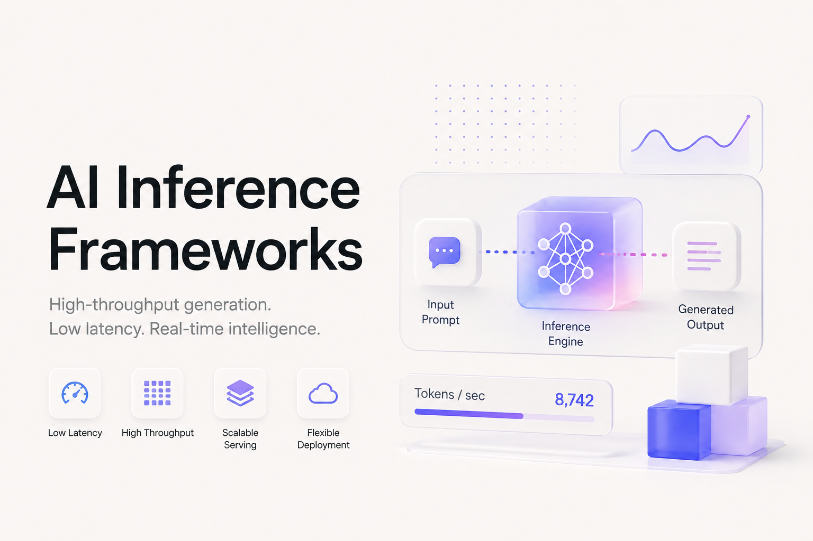

# The Open-Source Inference Systems Stack for Foundation Models

The decisive unit in modern inference is no longer the model process. It is the distributed serving state machine around that process.

A production request passes through tokenization, admission control, prefix lookup, replica selection, prefill execution, KV-cache placement, autoregressive decoding, sampling, streaming, cancellation and resource reclamation. At cluster scale, those transitions may be owned by different systems:

[
\boxed{
\text{request control plane}
\rightarrow
\text{distributed KV plane}
\rightarrow
\text{model execution engine}
\rightarrow
\text{kernel and accelerator runtime}.
}
]

This is why “inference framework” has become an overloaded term. vLLM, SGLang and TensorRT-LLM execute models and schedule token work. NVIDIA Dynamo, llm-d and AIBrix coordinate fleets of those engines. Mooncake owns distributed KV-cache storage and transfer. Triton Inference Server owns model serving and backend lifecycle across heterogeneous runtimes. llama.cpp, MLX LM and ExLlamaV3 optimize a different operating regime: local inference under constrained memory and hardware.

Treating these systems as direct substitutes produces bad architecture. A Kubernetes control plane cannot replace paged attention. A fast single-node engine does not automatically provide cache-aware routing across replicas. A kernel library does not own request scheduling. A model server that exposes an OpenAI-compatible endpoint is not necessarily a high-performance inference engine.

The 25 systems in this article are therefore arranged by **execution depth**, not by a synthetic leaderboard:

[
\begin{aligned}
\mathfrak{I}
============

&;
\mathfrak{I}*{\mathrm{control}}
\cup
\mathfrak{I}*{\mathrm{KV}}
\cup
\mathfrak{I}*{\mathrm{engine}}
\
&\cup
\mathfrak{I}*{\mathrm{accelerator}}
\cup
\mathfrak{I}_{\mathrm{portable}}.
\end{aligned}
]

No universal “best inference framework” exists. The correct system depends on which layer must be owned, which latency objective matters, where model and KV state reside, and what failure model the service must survive.

---

## 1. The inference state machine

Let an inference service maintain the state

[
\mathcal{S}_t
=============

\left(
W,
Q_t,
B_t,
K_t,
P_t,
R_t,
D_t,
G_t,
M_t
\right),
]

where:

| State | Meaning                                                                 |
| ----- | ----------------------------------------------------------------------- |
| (W)   | Model weights, quantized representations, adapters and execution graphs |
| (Q_t) | Waiting, admitted, preempted and active requests                        |
| (B_t) | Current token-level execution batch                                     |
| (K_t) | KV-cache blocks, ownership, location and reuse metadata                 |
| (P_t) | Tensor, pipeline, data, context and expert placement                    |
| (R_t) | Replica and phase-routing decisions                                     |
| (D_t) | Decode state, generated tokens, logits processors and stopping state    |
| (G_t) | Compiled graphs, kernels and execution plans                            |
| (M_t) | Runtime metrics, queue estimates, cache pressure and service objectives |

The end-to-end transition is:

[
\begin{aligned}
x
&\xrightarrow{\text{tokenize}}
\tau
\xrightarrow{\text{route}}
r
\xrightarrow{\text{admit}}
q
\xrightarrow{\text{prefix lookup}}
K_{\mathrm{hit}}
\
&\xrightarrow{\text{prefill}}
(K_0,y_0)
\xrightarrow{\text{KV commit}}
\widehat{K}
\xrightarrow{\text{decode loop}}
y_{1:T}
\
&\xrightarrow{\text{stream}}
\widehat{y}
\xrightarrow{\text{release}}
\mathcal{S}_{t+1}.
\end{aligned}
]

The relevant frameworks differ primarily in which arrows they own.

### 1.1 Request routing

A conventional load balancer chooses a replica using connection count, queue length or round-robin rotation. An LLM-aware router may instead optimize:

[
r^*
===

\arg\min_{r\in\mathcal{R}}
\left[
\widehat{T}*{\mathrm{queue}}(r)
+
\widehat{T}*{\mathrm{prefill}}(r,x)
+
\widehat{T}_{\mathrm{decode}}(r,x)
----------------------------------

\lambda,\operatorname{KVOverlap}(r,x)
\right].
]

The final term matters because a nominally busy replica holding the required prefix may return the first token faster than an idle replica that must recompute the entire prompt.

Dynamo, llm-d, AIBrix and Llumnix operate substantially at this layer. vLLM, SGLang and TensorRT-LLM expose internal signals that make such routing possible, but they do not by themselves provide every cluster-control function.

### 1.2 Admission and continuous batching

Static batching waits for a fixed batch to complete. Autoregressive generation makes that wasteful because sequence lengths diverge.

Iteration-level or continuous batching instead constructs:

[
B_t
===

{
(i,p_i)
\mid
i\in Q_t,;
p_i\in
{\text{prefill chunk},\text{decode token}}
},
]

at every scheduler iteration. Completed sequences leave immediately; waiting sequences can enter without waiting for the longest active request.

vLLM, SGLang, TensorRT-LLM, LMDeploy, LightLLM and DeepSpeed-FastGen all implement forms of dynamic or continuous request scheduling. Their behavior differs in token budgeting, preemption, chunked prefill, cache allocation and graph capture.

### 1.3 Prefill and decode are different workloads

For prompt length (L_p), hidden width (d) and generated length (L_d):

[
\begin{aligned}
\text{prefill}
&:
\Theta(L_p d^2 + L_p^2 d),
\
\text{decode step}
&:
\Theta(d^2 + L_{\mathrm{ctx}}d).
\end{aligned}
]

Prefill exposes large matrix multiplications and is commonly compute-bound. Decode processes one new token per active sequence and is frequently constrained by weight reads, KV-cache bandwidth, communication and batch occupancy.

This asymmetry creates two different service objectives:

[
\mathrm{TTFT}
\approx
T_{\mathrm{queue}}
+
T_{\mathrm{prefill}},
]

[
\mathrm{ITL}
\approx
T_{\mathrm{decode\ iteration}}.
]

Disaggregated systems place prefill and decode on separate worker pools:

[
x
\rightarrow
\mathrm{PrefillPool}
\rightarrow
K(x)
\overset{\mathrm{transfer}}{\longrightarrow}
\mathrm{DecodePool}
\rightarrow
y.
]

This only helps when phase specialization and independent scaling outweigh KV-transfer latency, extra queueing, duplicated weights and control-plane complexity. Disaggregation is not a free performance switch.

### 1.4 KV cache is distributed mutable state

For a transformer with (n_l) layers, (n_{kv}) KV heads, head dimension (d_h), sequence length (L), batch (B) and element width (b) bytes:

[
\operatorname{Memory}_{KV}
==========================

2Bn_l n_{kv}Ld_hb.
]

At long context and high concurrency, KV state can dominate available memory. Modern engines therefore manage KV tensors as blocks rather than contiguous per-request buffers:

[
K
=

\bigcup_{j=1}^{N_{\mathrm{blocks}}}K_j.
]

Block-based management enables non-contiguous allocation, prefix reuse, preemption, copy-on-write semantics, cross-request sharing and external cache connectors. vLLM’s PagedAttention and automatic prefix caching are canonical implementations of this design.

At fleet scale, the state problem becomes:

[
\operatorname{Locate}
:
\operatorname{PrefixHash}
\rightarrow
{
(\text{worker},\text{tier},\text{block IDs})
}.
]

Mooncake, Dynamo, llm-d and AIBrix extend KV ownership beyond a single engine instance.

### 1.5 Speculative decoding changes the scheduler

A draft model proposes (k) tokens:

[
\tilde{y}*{t+1:t+k}
\sim
q*\phi(\cdot\mid y_{\leq t}),
]

and the target verifies them in one or a small number of forward passes:

[
a
=

\max
\left{
j:
\tilde{y}_{t+1:t+j}
\text{ is accepted}
\right}.
]

The speedup depends on draft cost, acceptance length, verification efficiency, cache compatibility and batch interference. A framework listing speculative decoding support does not imply an end-to-end gain for every model or traffic distribution.

### 1.6 Goodput is the correct service-level metric

Maximum token throughput is insufficient. A service can produce many tokens while violating user-facing latency objectives.

Define:

[
\operatorname{Goodput}
======================

\frac{
#{
\text{requests satisfying TTFT, ITL and E2E SLOs}
}
}{
\Delta t
}.
]

An engine should therefore be evaluated using at least:

[
{
\mathrm{TTFT},
\mathrm{TPOT},
\mathrm{ITL},
\mathrm{E2E},
\mathrm{req/s},
\mathrm{input\ tok/s},
\mathrm{output\ tok/s},
\mathrm{goodput}
}.
]

The benchmark tuple must include:

[
\boxed{
(
\text{model},
\text{hardware},
N,
L_{\mathrm{in}},
L_{\mathrm{out}},
\text{arrival process},
\text{precision},
\text{parallelism},
\text{software version}
).
}
]

A throughput number without this tuple is not a cross-framework conclusion.

---

## 2. Systems boundary

A project belongs in the core set when it directly owns one or more of:

[
\begin{aligned}
&\text{token-level scheduling},\
&\text{KV allocation, reuse, migration or storage},\
&\text{prefill/decode execution},\
&\text{distributed model placement},\
&\text{speculative verification},\
&\text{request migration or phase routing},\
&\text{replica autoscaling and model lifecycle},\
&\text{accelerator-specific generative execution}.
\end{aligned}
]

The following are important but outside the core 25 when considered independently:

* FlashInfer, FlashAttention, TensorRT plugins and AITER are kernel or operator substrates.
* NCCL, RCCL, HCCL, NIXL, UCX and MPI are communication or transfer substrates.
* CUDA, ROCm, Neuron, XLA and OpenVINO Runtime are device or graph runtimes.
* LiteLLM and API gateways normalize provider interfaces but do not execute model inference.
* Kubernetes, KServe and managed platforms provide deployment infrastructure but are not token schedulers.
* Quantization formats such as GGUF, GPTQ, AWQ and EXL3 are representations, not complete serving systems.
* NIM packages and validates deployable model services but is not an independent open inference algorithm family.

Evidence labels are used as follows:

* **[CODE-VERIFIED]** — directly observable in official implementation or tests.
* **[REPORTED]** — explicitly documented by the project.
* **[DERIVED]** — engineering conclusion from cited primary evidence.
* **[EXPERIMENTAL]** — explicitly incomplete, unstable or research-oriented.
* **[DEPRECATED]** — archived, superseded or no longer the active path.
* **[UNDISCLOSED]** — public evidence is insufficient.

---

# 3. The 25 inference systems

## Layer A — Datacenter inference control planes

These systems coordinate model engines across replicas, nodes or clusters. They should not receive credit for model-execution algorithms delegated to vLLM, SGLang or TensorRT-LLM.

---

## 1. NVIDIA Dynamo

**Repository:** `ai-dynamo/dynamo`
**Role:** datacenter-scale inference orchestration above model engines.

Dynamo coordinates vLLM, SGLang and TensorRT-LLM workers rather than replacing their schedulers or kernels. Its primary components include an API frontend, KV-aware router, service discovery, prefill and decode worker pools, multi-tier KV management and a planner for capacity allocation. **[CODE-VERIFIED/REPORTED]**

The routing plane consumes worker-load and KV-cache events to estimate which replica already owns reusable prefix blocks:

[
r^*
===

\arg\max_r
\left[
\alpha,\operatorname{KVHit}(r,x)
--------------------------------

## \beta,\operatorname{Load}(r)

\gamma,\widehat{T}(r,x)
\right].
]

Dynamo supports aggregated serving, KV-aware aggregated routing, disaggregated prefill/decode deployments and global planning across worker pools. Its vLLM deployment examples transfer KV state between specialized prefill and decode workers using NIXL-based paths.

Dynamo’s multi-tier KV design can move blocks across GPU, CPU, local storage and remote tiers. This changes the serving problem from per-process cache eviction to fleet-level state placement.

**Strongest use case:** large NVIDIA-oriented deployments where independently scaling prefill, decode and cache tiers is operationally justified.

**Hard limitation:** Dynamo adds a second distributed scheduler above the engine scheduler. Performance and correctness now depend on cache-event freshness, router consistency, transfer topology, backend compatibility and planner decisions. A poorly configured Dynamo deployment can add control-plane cost without improving the underlying engine.

---

## 2. llm-d

**Repository:** `llm-d/llm-d`
**Role:** Kubernetes-native distributed inference stack.

llm-d combines Kubernetes, Gateway API inference extensions and model engines such as vLLM into a distributed serving system with prefix-aware routing, load-aware scheduling, prefill/decode disaggregation and accelerator-portable deployment patterns. **[REPORTED]**

Its router can select both prefill and decode endpoints for one request and coordinate KV transfer between them. Current architecture documentation also describes latency-prediction sidecars that estimate TTFT and ITL for endpoint scoring.

A central systems constraint is network transport. llm-d explicitly states that efficient disaggregated serving requires high-performance RDMA-class interconnects; TCP fallback is intended for testing and is not an equivalent production path.

The project’s wide-expert-parallel deployment patterns combine phase disaggregation with specialized communication paths for MoE prefill and decode.

**Strongest use case:** Kubernetes-standardized organizations that want a well-defined path from single vLLM instances to KV-aware, disaggregated multi-node serving.

**Hard limitation:** llm-d is an integration architecture. Its achievable behavior remains bounded by engine capabilities, Kubernetes scheduling, KV transport, gateway state and hardware-specific well-lit paths. It is not a portable guarantee of identical performance across accelerators.

---

## 3. AIBrix

**Repository:** `vllm-project/aibrix`
**Role:** cloud-native control and data plane for large-scale inference.

AIBrix separates control-plane components—model metadata, adapter management, autoscaling and policy enforcement—from data-plane components for request dispatch, scheduling and model serving. **[REPORTED]**

Its architecture includes an LLM gateway, application-aware autoscaling, high-density LoRA management, unified runtime sidecars, distributed inference, distributed KV-cache support and heterogeneous-serving policies.

AIBrix is explicitly co-designed with vLLM but increasingly exposes engine-neutral integration points. Recent releases include phase-aware and topology-aware routing plus independent autoscaling of prefill and decode roles.

The brutal truth is that AIBrix’s highest reported gains are system-specific. Distributed cache and routing improvements depend on workload prefix locality, replica count, cache capacity and traffic shape. They should not be converted into universal throughput or latency claims.

**Strongest use case:** enterprise Kubernetes environments needing adapter lifecycle, model routing, autoscaling, failure diagnostics and vLLM-aware serving policies in one open control plane.

**Hard limitation:** its feature breadth creates overlap with llm-d, Ray Serve, Kubernetes inference gateways and external KV systems. Architecture ownership must be explicit or the deployment accumulates competing controllers.

---

## 4. Ray Serve LLM

**Repository:** `ray-project/ray`
**Role:** programmable application and model-serving orchestration.

Ray Serve LLM specializes Ray Serve primitives for OpenAI-compatible LLM endpoints, multi-model deployment, autoscaling, request routing and Kubernetes operation through KubeRay. It commonly uses vLLM as the underlying execution engine. **[REPORTED]**

Ray owns replica lifecycle, actor placement, resource bundles, application composition, traffic routing and autoscaling. vLLM owns token scheduling, paged KV allocation and model execution.

This separation is valuable for compound inference applications:

[
\text{retrieve}
\rightarrow
\text{rerank}
\rightarrow
\text{LLM}
\rightarrow
\text{validator},
]

because the entire graph can be represented as programmable Python deployments rather than as one model server.

**Strongest use case:** inference applications combining multiple models, Python services, retrieval components and dynamically scaled vLLM deployments.

**Hard limitation:** Ray cannot repair poor engine-level batching or KV management. Actor elasticity also does not automatically preserve active decode state; request retry and stream failure semantics remain application concerns.

---

## 5. NVIDIA Triton Inference Server

**Repository:** `triton-inference-server/server`
**Role:** multi-backend model server and production serving substrate.

Triton serves TensorRT, ONNX Runtime, PyTorch, OpenVINO, Python and other backends through a common HTTP/gRPC surface. It owns model repositories, model loading and unloading, instance groups, dynamic batching, sequence batching, ensembles, metrics and backend lifecycle. **[REPORTED]**

For LLMs, Triton often hosts a TensorRT-LLM backend or a Python/custom backend. The continuous token scheduler and paged KV implementation remain backend responsibilities. Triton’s dynamic batching should therefore not be conflated with autoregressive iteration-level scheduling.

Triton is especially valuable when an inference service includes heterogeneous model stages:

[
\text{vision encoder}
\rightarrow
\text{LLM}
\rightarrow
\text{ranking model}
\rightarrow
\text{postprocessor}.
]

Its model-ensemble and backend mechanisms can expose the pipeline through a unified service.

**Strongest use case:** NVIDIA-centric production environments serving mixed model classes and multiple optimized backends.

**Hard limitation:** Triton is not itself the highest-performance generative engine. LLM performance is determined primarily by the selected backend, its batching model, KV manager and kernel implementation.

---

# Layer B — Distributed KV, phase separation and request movement

These systems focus on the state that must move between engines or replicas.

---

## 6. Mooncake

**Repository:** `kvcache-ai/Mooncake`
**Role:** KV-centric disaggregated serving and distributed cache storage.

Mooncake originated as the serving platform disclosed for Kimi. Its open components include a Transfer Engine and Mooncake Store for moving, storing, replicating and evicting KV-cache blocks and model-related objects across inference clusters. **[REPORTED]**

The core architecture treats KV state as a distributed object:

[
K_j
\mapsto
(
\text{GPU},
\text{CPU},
\text{SSD},
\text{remote memory}
),
]

with location metadata and high-bandwidth transfer separated from the model scheduler.

This is a material shift from local prefix caching. Local caching asks whether a block exists inside one engine. Mooncake asks whether the block exists anywhere in the serving fabric and whether transfer is cheaper than recomputation.

Mooncake integrations with vLLM demonstrate how external KV storage can support agentic workloads containing repeated long prefixes, but the published gains remain tied to the documented hardware, trace distribution and cache configuration.

**Strongest use case:** high-prefix-reuse, long-context or agentic services where KV recomputation is a major fraction of serving cost.

**Hard limitation:** remote KV reuse is only valuable when:

[
T_{\mathrm{lookup}}
+
T_{\mathrm{transfer}}
<
T_{\mathrm{recompute}}.
]

Small prefixes, weak locality or slow interconnects can make an external cache a net loss.

---

## 7. DistServe

**Repository:** `LLMServe/DistServe`
**Role:** research system for prefill/decode disaggregation.

DistServe separates prefill and decode onto different GPU groups so each phase can use an independent parallelism and resource plan. Its central argument is that colocating the phases couples resource allocation and causes interference between compute-heavy prefill and latency-sensitive decode. **[REPORTED]**

The scheduling problem becomes:

[
\begin{aligned}
N_P^*
&=
\arg\min_{N_P}
\operatorname{TTFT}
\quad
\text{subject to prefill load},
\
N_D^*
&=
\arg\min_{N_D}
\operatorname{ITL}
\quad
\text{subject to decode load}.
\end{aligned}
]

KV tensors are produced by prefill workers and transferred to decode workers. This enables different TP or PP degrees for each phase, but introduces transport and coordination overhead.

**Strongest use case:** research and capacity studies where TTFT and ITL must be provisioned independently.

**Hard limitation:** DistServe is not a full production control plane. It demonstrates a serving architecture; it does not provide the operational breadth, engine coverage or cluster lifecycle of Dynamo, llm-d or AIBrix.

---

## 8. Llumnix

**Repository:** `llumnix-project/llumnix`
**Role:** cross-instance request scheduling and live request migration.

Llumnix extends scheduling beyond initial replica selection. Its scheduler-plus-rescheduler architecture can route a request initially and then migrate its execution state when load, cache state or service conditions change. **[REPORTED]**

The target is dynamic imbalance:

[
\operatorname{Load}_i(t)
\neq
\operatorname{Load}_j(t)
]

even when requests were initially assigned well. Because generation lengths are unknown, static dispatch can produce severe queue skew.

Migration requires moving:

[
{
\text{request metadata},
\text{generated tokens},
\text{KV blocks},
\text{sampling state}
}
]

without violating ordering or duplicating output. Llumnix supports white-box modes involving engine cooperation and lighter black-box deployment modes.

The project reports use within Alibaba Cloud PAI-EAS, giving it stronger operational provenance than a paper-only scheduling prototype.

**Strongest use case:** multi-instance services where unpredictable output lengths create persistent load imbalance and live migration can recover stranded capacity.

**Hard limitation:** migration competes with inference for network and memory bandwidth. Rescheduling too aggressively can increase tail latency and destabilize cache locality.

---

# Layer C — High-throughput generative execution engines

These systems own token scheduling, KV management and model execution.

---

## 9. vLLM

**Repository:** `vllm-project/vllm`
**Role:** general-purpose high-throughput LLM and multimodal inference engine.

vLLM’s foundational mechanism is PagedAttention: KV-cache blocks are managed through a block table rather than requiring contiguous per-sequence allocation. This reduces fragmentation and enables flexible allocation, prefix reuse and request preemption. **[REPORTED/CODE-VERIFIED]**

The engine core owns:

[
\text{scheduler}
+
\text{KV manager}
+
\text{model executor}
+
\text{request state}.
]

Its scheduler continuously selects token work, allocates KV blocks and dispatches execution to GPU workers. Current architecture documentation describes one engine-core process per data-parallel rank.

Major mechanisms include continuous batching, chunked prefill, automatic prefix caching, speculative decoding, structured generation, multimodal execution and tensor, pipeline, data, context and expert parallelism.

vLLM also exposes KV-connector interfaces and experimental prefill/decode disaggregation. The framework itself explicitly describes disaggregated prefill as experimental; fleet-level production behavior should therefore be provided by a validated surrounding system rather than assumed from the feature flag.

**Strongest use case:** broad model coverage and high-throughput serving across NVIDIA, AMD and an expanding set of accelerator backends.

**Hard limitation:** broad support increases combinatorial complexity. Attention backend, quantization, model architecture, speculative method, parallelism plan and hardware backend do not all share identical maturity. vLLM is a strong default, not evidence that every supported configuration is optimal.

---

## 10. SGLang

**Repository:** `sgl-project/sglang`
**Role:** high-performance language and multimodal serving with prefix-oriented execution.

SGLang combines a serving runtime with a frontend for structured model programs. Its defining systems mechanism is RadixAttention, which organizes reusable prefix KV state through a radix-tree-like structure so requests sharing prefixes can reuse computed blocks efficiently. **[REPORTED]**

The runtime includes continuous batching, chunked prefill, prefix caching, speculative decoding, tensor parallelism, data parallelism, expert-parallel paths and large-scale prefill/decode disaggregation. The project exposes server arguments controlling memory management, scheduling and parallelism rather than treating the server as a fixed black box.

SGLang is particularly strong under workloads with structured prompt sharing:

[
\text{system prompt}
+
\text{few-shot examples}
+
\text{branch-specific continuation}.
]

Its cache structure can exploit repeated prefixes across branches and requests.

**Strongest use case:** reasoning, agentic and structured-generation workloads with substantial prefix reuse, plus large-scale MoE serving.

**Hard limitation:** prefix-aware optimization increases scheduler and cache-state complexity. Performance depends heavily on prompt structure, cache eviction, tokenizer consistency and frontend execution patterns. A workload with little prefix sharing will not receive the same benefit.

---

## 11. TensorRT-LLM

**Repository:** `NVIDIA/TensorRT-LLM`
**Role:** NVIDIA-specific compiled and runtime-optimized generative inference engine.

TensorRT-LLM combines model transformations, TensorRT compilation paths, custom CUDA kernels and a runtime scheduler. It supports in-flight batching, paged attention, chunked context, KV reuse, speculative decoding, LoRA, TP, PP, EP and multi-node execution. **[REPORTED]**

Its execution architecture is closer to the hardware than general PyTorch engines. Model graphs, fused operators, GEMM selection, quantization and communication paths are specialized for NVIDIA GPUs.

TensorRT-LLM also supports aggregated and disaggregated serving. In the disaggregated form, context and generation workers exchange KV state and may use separate resource configurations.

It provides advanced low-precision paths, including FP8 and NVIDIA-specific FP4 modes where model and hardware support align. Such support should be interpreted as a full-stack requirement involving model conversion, calibration or quantization, kernels and target GPU generation—not merely a runtime flag.

**Strongest use case:** maximum NVIDIA-specific efficiency under controlled model, hardware and software versions.

**Hard limitation:** compilation and version coupling. Model conversion, TensorRT engine compatibility, CUDA version, driver, GPU architecture and runtime release form one qualified deployment artifact. It is less forgiving of rapid model-code mutation than PyTorch-native engines.

---

## 12. LMDeploy

**Repository:** `InternLM/lmdeploy`
**Role:** LLM compression and serving toolkit with TurboMind and PyTorch backends.

LMDeploy’s TurboMind engine implements persistent batching, blocked KV-cache management and optimized CUDA execution. The project also provides PyTorch execution, quantization, multimodal pipelines and distributed model serving. **[REPORTED]**

Persistent batching is LMDeploy’s form of continuous request admission. Its KV manager supports block-based state allocation, while dynamic split-and-fuse-style execution mixes prompt and decode work.

LMDeploy is closely integrated with InternLM but supports a broad model surface through Hugging Face-compatible interfaces and deployment pipelines.

The project publishes performance comparisons against vLLM, but those figures must remain bound to their model, precision, request distribution and software versions. They do not establish that TurboMind is generally faster for all architectures.

**Strongest use case:** CUDA deployments requiring an integrated quantization, conversion, multimodal and serving toolkit.

**Hard limitation:** the existence of multiple backends creates behavior differences in model coverage, kernel paths, quantization and feature support. “LMDeploy support” is not one uniform execution contract.

---

## 13. LightLLM

**Repository:** `ModelTC/LightLLM`
**Role:** lightweight Python and Triton-kernel-oriented LLM serving engine.

LightLLM implements a distributed server architecture with token-level memory management, continuous request scheduling and specialized kernels. It draws architectural ideas from systems including FasterTransformer, TGI, vLLM and FlashAttention while maintaining a comparatively direct Python control surface. **[REPORTED]**

Its design is useful for researchers who want to inspect the relationship among request managers, token memory allocation, model workers and distributed execution without traversing a larger cloud-control framework.

**Strongest use case:** lightweight high-performance serving experiments and custom model integration where direct scheduler access matters.

**Hard limitation:** ecosystem and operational depth are narrower than vLLM, SGLang and TensorRT-LLM. Documentation, deployment patterns and cross-hardware validation are less comprehensive, making integration risk more dependent on internal expertise.

---

## 14. DeepSpeed-FastGen and MII

**Repository:** `deepspeedai/DeepSpeed-MII`
**Role:** DeepSpeed-based accelerated text-generation inference.

MII combines blocked KV caching, continuous batching, tensor parallelism, custom kernels and Dynamic SplitFuse. Dynamic SplitFuse partitions long prompts and combines prompt chunks with decode work to reduce phase interference. **[REPORTED]**

The serving architecture builds on DeepSpeed-Inference and DeepSpeed kernel components. It can expose persistent deployments and model-serving APIs while using DeepSpeed’s distributed model execution.

DeepSpeed’s published FastGen numbers are project-reported. Some public issue evidence also shows configurations where MII did not outperform vLLM, reinforcing that model, prompt shape and version materially affect results.

**Strongest use case:** organizations already standardized on DeepSpeed that want a closely related inference path.

**Hard limitation:** MII has not achieved the same ecosystem momentum, model coverage or broad operational adoption as vLLM, SGLang or TensorRT-LLM. It should be benchmarked directly rather than selected from historical performance claims.

---

## 15. Sarathi-Serve

**Repository:** `microsoft/sarathi-serve`
**Role:** research serving engine focused on the throughput–latency tradeoff.

Sarathi-Serve’s central mechanism is chunked prefill with stall-free scheduling. Long prefills are divided into bounded chunks, and decode requests are packed alongside those chunks rather than being blocked behind a full prompt computation.

The scheduler seeks decode-maximal batches:

[
B_t
===

B_{\mathrm{decode}}
\cup
{
\text{at most one bounded prefill chunk}
}.
]

This makes iteration cost more uniform and reduces pipeline imbalance.

Sarathi-Serve is explicit that it is a research prototype derived from an earlier vLLM codebase and does not maintain complete feature parity with vLLM. **[EXPERIMENTAL]**

**Strongest use case:** scheduler research, particularly under mixed long-prefill and latency-constrained decode workloads.

**Hard limitation:** it is not a default production engine. Model coverage, deployment integrations and ongoing compatibility should be treated as research-grade.

---

# Layer D — Accelerator-specific distributed inference

---

## 16. tpu-inference

**Repository:** `vllm-project/tpu-inference`
**Role:** unified TPU backend for vLLM using JAX and XLA lowering.

`tpu-inference` powers the current vLLM TPU path and provides a common lowering architecture for PyTorch- and JAX-defined models. The project is intended to expose vLLM scheduling and API behavior while compiling execution through JAX/XLA to TPU. **[REPORTED]**

This separates:

[
\text{vLLM request and KV scheduler}
]

from:

[
\text{TPU model lowering and device execution}.
]

That separation is strategically important. It allows TPU deployments to participate in the broader vLLM serving ecosystem rather than requiring a completely independent user-facing server.

**Strongest use case:** TPU inference requiring vLLM-compatible serving semantics and unified JAX/PyTorch model lowering.

**Hard limitation:** backend parity cannot be assumed. CUDA-specific kernels, quantization paths, graph behavior and distributed features must be implemented or lowered separately for TPU.

---

## 17. AWS NeuronX Distributed Inference

**Repository:** `aws-neuron/neuronx-distributed-inference`
**Role:** distributed model execution and model hub for AWS Trainium and Inferentia.

NeuronX Distributed Inference provides PyTorch-oriented model implementations, model sharding, compilation and optimized inference components for Neuron devices. It is the stated forward path for optimized large-model inference on AWS Neuron hardware. **[REPORTED]**

The stack includes model-specific implementations, tensor-parallel sharding, Neuron Kernel Interface integrations and accelerator-aware generation loops. Recent Neuron releases document expanded multimodal, diffusion and speculative-decoding support.

AWS has also pursued integration between NxD Inference and vLLM’s engine architecture, allowing vLLM to provide serving semantics while NeuronX supplies accelerator execution.

**Strongest use case:** production inference on Trainium or Inferentia where the service can use AWS-qualified model implementations and Neuron kernels.

**Hard limitation:** model support and optimization are more curated than in CUDA ecosystems. A Hugging Face architecture that runs under PyTorch does not automatically have an efficient NeuronX implementation.

---

# Layer E — Portable, edge, workstation and heterogeneous runtimes

These systems optimize for hardware reach, local execution, memory constraints or application embedding rather than datacenter-scale request routing.

---

## 18. llama.cpp

**Repository:** `ggml-org/llama.cpp`
**Role:** portable C/C++ LLM and VLM inference runtime.

llama.cpp targets minimal-dependency execution across CPUs, NVIDIA GPUs, AMD GPUs, Apple hardware and other backends. It includes quantized GGUF model loading, CPU/GPU layer placement, KV caching, speculative paths, grammar-constrained generation and an OpenAI-compatible HTTP server. **[REPORTED]**

Its primary strength is deployment reach. A model can be embedded directly into a C/C++ application or run on systems that cannot support a datacenter-oriented PyTorch stack.

The runtime’s memory model permits partial GPU offload:

[
W
=

W_{\mathrm{GPU}}
\cup
W_{\mathrm{CPU}},
]

allowing inference even when the full model does not fit in accelerator memory.

**Strongest use case:** local, embedded, desktop, CPU-first and mixed CPU/GPU inference.

**Hard limitation:** portability is not equivalent to high-concurrency serving efficiency. llama.cpp can expose a server, but it is not a substitute for a fleet-scale KV-aware serving control plane.

---

## 19. MLC LLM

**Repository:** `mlc-ai/mlc-llm`
**Role:** compiler-driven universal LLM deployment engine.

MLC LLM compiles model execution through the Apache TVM/MLC stack for deployment across CUDA, ROCm, Vulkan, Metal, WebGPU, browsers and mobile platforms. **[REPORTED]**

Its architecture separates model representation, operator compilation, target-specific code generation and runtime packaging. This allows the same logical model to be specialized for multiple device classes.

MLC is materially different from llama.cpp. llama.cpp emphasizes a hand-optimized portable runtime and GGUF ecosystem. MLC emphasizes compiler-generated deployment artifacts and native application integration.

**Strongest use case:** cross-platform applications requiring one compiler-oriented path from server GPUs to mobile, browser or embedded targets.

**Hard limitation:** compilation, model conversion and target-specific tuning introduce build complexity. Broad target support does not imply equal maturity or performance on every backend.

---

## 20. ONNX Runtime GenAI

**Repository:** `microsoft/onnxruntime-genai`
**Role:** generative inference loop over ONNX Runtime.

ONNX Runtime GenAI implements token generation, logits processing, search, sampling, KV-cache management, preprocessing, postprocessing and grammar-constrained output for ONNX models. It powers Microsoft local-inference surfaces including Foundry Local and Windows-oriented tooling. **[REPORTED]**

Its value comes from execution-provider portability:

[
\text{ONNX graph}
\rightarrow
{
\text{CUDA},
\text{DirectML},
\text{CPU},
\text{mobile providers},
\ldots
}.
]

The GenAI layer fills the gap between a static graph runtime and an autoregressive generation service.

**Strongest use case:** Windows, edge and enterprise applications already standardized on ONNX Runtime and execution providers.

**Hard limitation:** model conversion and graph support remain explicit engineering work. A model implemented in Transformers is not automatically available as an optimized ONNX Runtime GenAI artifact.

---

## 21. OpenVINO GenAI

**Repository:** `openvinotoolkit/openvino.genai`
**Role:** generative pipelines over Intel OpenVINO Runtime.

OpenVINO GenAI provides optimized LLM, VLM, speech and diffusion pipelines on top of OpenVINO Runtime. It targets Intel CPUs, integrated graphics, discrete GPUs and NPUs through OpenVINO’s graph compilation and device plugins. **[REPORTED]**

The library owns autoregressive pipeline behavior while OpenVINO Runtime owns graph transformation, kernel selection and device execution.

It is particularly relevant where accelerator memory is modest but host memory bandwidth, integrated graphics or Intel NPUs are available.

**Strongest use case:** Intel-centric workstation, edge and client deployments.

**Hard limitation:** the model and precision path must be validated against the exact OpenVINO version and device plugin. CUDA-oriented custom kernels and quantization assumptions do not transfer automatically.

---

## 22. MLX LM

**Repository:** `ml-explore/mlx-lm`
**Role:** LLM generation and fine-tuning on Apple silicon.

MLX LM provides model loading, generation, quantization, prompt caching and distributed inference over Apple’s MLX array framework. It uses the unified memory architecture of Apple silicon, allowing CPU and GPU execution to access a shared memory pool. **[REPORTED]**

This avoids the conventional discrete-GPU host-to-device ownership boundary, although memory bandwidth and total unified memory still constrain usable model size and throughput.

**Strongest use case:** local research, application development and private inference on Apple silicon.

**Hard limitation:** MLX LM is hardware-specific and not a datacenter serving control plane. Multi-user batching, fault tolerance and cluster scheduling are outside its primary design center.

---

## 23. mistral.rs

**Repository:** `EricLBuehler/mistral.rs`
**Role:** Rust-based local and server inference engine.

mistral.rs provides Rust and Python APIs, model quantization support, paged-attention-oriented scheduling, multimodal model execution and an OpenAI-compatible server. **[REPORTED]**

Rust provides a strong application-embedding and concurrency surface, while the engine supports multiple hardware backends through its underlying execution stack.

The project is evolving quickly, and its issue tracker exposes correctness and scheduler failures under particular multimodal and concurrent configurations. These are not reasons to dismiss the project; they are evidence that broad model support and paged scheduling remain active engineering surfaces.

**Strongest use case:** Rust-native applications and local servers requiring a modern generative engine without a Python process as the primary host.

**Hard limitation:** its production validation and model-configuration coverage remain narrower than vLLM or llama.cpp. Fast development increases compatibility risk.

---

## 24. ExLlamaV3

**Repository:** `turboderp-org/exllamav3`
**Role:** highly optimized quantized inference on consumer NVIDIA GPUs.

ExLlamaV3 targets local LLM inference with low-bit EXL3 quantization, optimized CUDA kernels and consumer-class GPU memory constraints. It continues development from the now-archived ExLlamaV2 line. **[REPORTED]**

Its design is deliberately specialized:

[
\text{consumer NVIDIA GPU}
+
\text{aggressive weight quantization}
+
\text{local generation}.
]

This specialization permits lower abstraction overhead and tight control over quantized matrix kernels.

**Strongest use case:** maximum local throughput per unit of VRAM on supported NVIDIA consumer GPUs.

**Hard limitation:** portability and serving breadth are intentionally limited. Current issue evidence also shows that tensor-parallel and newer GPU configurations require careful qualification.

---

## 25. KTransformers

**Repository:** `kvcache-ai/ktransformers`
**Role:** CPU–GPU heterogeneous inference for models that exceed accelerator memory.

KTransformers partitions model execution across CPU and GPU, with particular emphasis on large sparse MoE models. Dense or frequently used components can reside on GPU while expert weights or other memory-heavy structures remain in CPU memory. **[REPORTED]**

For a sparse MoE layer:

[
Y
=

\sum_{e\in\operatorname{TopK}(x)}
g_e(x)E_e(x),
]

only selected experts execute per token. This makes CPU-resident expert storage more plausible than CPU offload for a dense layer, provided expert dispatch, transfer and CPU kernels are efficient.

**Strongest use case:** running very large MoE models on workstations or servers whose aggregate CPU memory is sufficient but GPU memory is not.

**Hard limitation:** heterogeneous inference trades accelerator memory for CPU bandwidth, NUMA locality, PCIe transfer and kernel complexity. It enables execution; it does not guarantee datacenter-grade token throughput.

---

# 4. Capability matrix

**Native** means the system directly owns the mechanism.
**Integration** means it relies on an underlying engine or external component.
**Experimental** means the capability is explicitly incomplete or research-oriented.

| System                  | Token scheduler        | Block/paged KV           | Prefix reuse          | Chunked prefill   | Speculation                | Model parallelism            | P/D disaggregation  | Cross-instance KV  | Fleet control |
| ----------------------- | ---------------------- | ------------------------ | --------------------- | ----------------- | -------------------------- | ---------------------------- | ------------------- | ------------------ | ------------- |
| NVIDIA Dynamo           | integration            | integration              | native routing        | integration       | integration                | integration                  | native              | native             | native        |
| llm-d                   | integration            | integration              | native routing        | integration       | integration                | integration                  | native              | integration        | native        |
| AIBrix                  | integration            | integration              | native routing        | integration       | integration                | integration                  | native              | native/integration | native        |
| Ray Serve LLM           | integration            | integration              | integration           | integration       | integration                | integration                  | integration         | integration        | native        |
| Triton Inference Server | backend-dependent      | backend-dependent        | integration           | integration       | integration                | integration                  | integration         | integration        | native        |
| Mooncake                | integration            | native distributed store | native                | integration       | absent                     | integration                  | native architecture | native             | integration   |
| DistServe               | native                 | native                   | undisclosed           | native            | absent                     | native                       | native              | native transfer    | experimental  |
| Llumnix                 | integration            | integration              | native scheduling     | integration       | integration                | integration                  | native              | native migration   | native        |
| vLLM                    | native                 | native                   | native                | native            | native                     | native                       | experimental        | native connectors  | integration   |
| SGLang                  | native                 | native                   | native RadixAttention | native            | native                     | native                       | native              | native/integration | integration   |
| TensorRT-LLM            | native                 | native                   | native                | native            | native                     | native                       | native              | native transfer    | integration   |
| LMDeploy                | native                 | native                   | native                | native split/fuse | supported                  | native                       | limited             | limited            | integration   |
| LightLLM                | native                 | native token memory      | supported             | supported         | model-dependent            | native                       | limited             | absent             | integration   |
| DeepSpeed-FastGen/MII   | native                 | native                   | limited               | native SplitFuse  | limited                    | native                       | absent              | absent             | integration   |
| Sarathi-Serve           | native                 | native                   | limited               | native            | absent                     | native PP                    | absent              | absent             | experimental  |
| tpu-inference           | vLLM integration       | vLLM integration         | vLLM integration      | vLLM integration  | backend-dependent          | native TPU sharding          | experimental        | integration        | integration   |
| NxD Inference           | native                 | native                   | model-dependent       | model-dependent   | native for selected models | native                       | undisclosed         | undisclosed        | integration   |
| llama.cpp               | native                 | native                   | native prompt cache   | supported         | native                     | limited multi-device         | absent              | absent             | local server  |
| MLC LLM                 | native                 | native                   | supported             | supported         | supported                  | backend-dependent            | absent              | absent             | local/server  |
| ONNX Runtime GenAI      | native generation loop | native                   | supported             | model-dependent   | supported                  | execution-provider-dependent | absent              | absent             | integration   |
| OpenVINO GenAI          | native                 | native                   | supported             | supported         | supported                  | device/plugin-dependent      | absent              | absent             | integration   |
| MLX LM                  | native                 | native                   | native prompt cache   | limited           | supported                  | native MLX distributed       | absent              | absent             | local         |
| mistral.rs              | native                 | native                   | supported             | supported         | supported                  | backend-dependent            | absent              | experimental       | local/server  |
| ExLlamaV3               | native                 | native                   | supported             | limited           | supported                  | native TP paths              | absent              | absent             | local         |
| KTransformers           | native                 | native                   | supported             | model-dependent   | model-dependent            | heterogeneous placement      | absent              | absent             | local/server  |

The matrix exposes an important boundary: the systems with the deepest engine features are not the systems with the strongest fleet-control semantics. Production architecture usually composes at least one row from each layer.

---

# 5. Hardware ecosystem map

## NVIDIA

The complete NVIDIA path is:

[
\boxed{
\begin{aligned}
&\text{Dynamo, llm-d, AIBrix or Ray Serve}
\
&\rightarrow
\text{vLLM, SGLang or TensorRT-LLM}
\
&\rightarrow
\text{FlashInfer, Transformer Engine, custom CUDA kernels}
\
&\rightarrow
\text{CUDA, NCCL, NIXL and the GPU fabric}.
\end{aligned}
}
]

TensorRT-LLM offers the tightest NVIDIA-specific compilation and kernel coupling. vLLM provides broader model and ecosystem flexibility. SGLang is especially compelling for prefix-heavy, structured and large-scale MoE serving. Dynamo coordinates all three rather than replacing them.

## AMD Instinct

A practical AMD stack is:

[
\boxed{
\text{llm-d/AIBrix/Ray}
\rightarrow
\text{vLLM or SGLang}
\rightarrow
\text{ROCm kernels/AITER}
\rightarrow
\text{ROCm and RCCL}.
}
]

vLLM explicitly includes CUDA/HIP execution paths and an expanding hardware backend surface. The exact model, attention backend, quantization and ROCm version must be qualified together.

The brutal truth is that “ROCm supported” is not equivalent to CUDA feature parity. New speculative methods, low-precision formats and fused kernels often mature at different rates.

## Google TPU

The principal open paths are:

[
\boxed{
\text{vLLM}
\rightarrow
\text{tpu-inference}
\rightarrow
\text{JAX/XLA}
\rightarrow
\text{TPU},
}
]

and the standalone JetStream family:

[
\text{JetStream}
\rightarrow
\text{JAX or PyTorch engine implementation}
\rightarrow
\text{XLA/TPU}.
]

JetStream remains technically important as a TPU throughput-oriented engine, while `tpu-inference` is the current vLLM-integrated path. The older JetStream-PyTorch implementation is no longer the active development direction.

## AWS Trainium and Inferentia

[
\boxed{
\text{vLLM-compatible service or custom server}
\rightarrow
\text{NxD Inference}
\rightarrow
\text{Neuron compiler/runtime}
\rightarrow
\text{Trainium or Inferentia}.
}
]

NxD Inference is the accelerator-specific execution layer. It should be evaluated through supported model implementations and Neuron SDK releases rather than generic PyTorch compatibility.

## Intel CPU, GPU and NPU

[
\boxed{
\text{application/server}
\rightarrow
\text{OpenVINO GenAI or ONNX Runtime GenAI}
\rightarrow
\text{OpenVINO/ONNX execution provider}
\rightarrow
\text{CPU, GPU or NPU}.
}
]

OpenVINO provides the more vertically integrated Intel path. ONNX Runtime GenAI provides a broader execution-provider and application ecosystem.

## Apple silicon

[
\boxed{
\text{MLX LM}
\rightarrow
\text{MLX}
\rightarrow
\text{Metal and unified memory}.
}
]

llama.cpp and MLC LLM are alternative paths where broader portability or C/C++ application embedding matters more than native MLX integration.

## Consumer NVIDIA GPUs

[
\boxed{
\text{ExLlamaV3}
\rightarrow
\text{EXL3 quantization and specialized CUDA kernels}
\rightarrow
\text{consumer GPU}.
}
]

llama.cpp is preferable when CPU offload or cross-vendor portability matters. KTransformers is preferable for sparse MoE models requiring substantial CPU-resident expert storage.

---

# 6. Public inference-stack provenance

Inference support and actual production use are different claims:

[
\boxed{
\text{production disclosure}
\neq
\text{official integration}
\neq
\text{model compatibility}.
}
]

| Service or ecosystem           | Public evidence                                                                                      | Classification             |
| ------------------------------ | ---------------------------------------------------------------------------------------------------- | -------------------------- |
| Kimi serving                   | Mooncake repository identifies Mooncake as the serving platform for Kimi                             | **[REPORTED]**             |
| Hugging Face hosted generation | TGI repository states it powered Hugging Chat, Inference API and Inference Endpoints before archival | **[REPORTED/DEPRECATED]**  |
| Ray Serve LLM                  | Official deployment path uses vLLM as an engine                                                      | **[REPORTED INTEGRATION]** |
| NVIDIA Dynamo                  | Officially integrates vLLM, SGLang and TensorRT-LLM                                                  | **[REPORTED INTEGRATION]** |
| llm-d                          | Built around engines including vLLM and SGLang with Kubernetes-native routing                        | **[REPORTED INTEGRATION]** |
| AIBrix                         | Publicly positioned as a cloud-native vLLM control plane with additional engine integrations         | **[REPORTED INTEGRATION]** |
| TPU vLLM                       | `tpu-inference` is identified as the active vLLM TPU backend                                         | **[REPORTED]**             |
| AWS Neuron                     | NxD Inference is the forward optimized inference path                                                | **[REPORTED]**             |

Mooncake has direct service provenance because its repository explicitly identifies it as Kimi’s serving platform.

TGI has unusually clear historical provenance inside Hugging Face services, but the repository is now archived and read-only. That changes its engineering status even though its historical contribution remains substantial.

A model appearing in vLLM, SGLang, TensorRT-LLM or llama.cpp does not prove that the model provider uses that engine in production. Compatibility only establishes that the architecture can be executed by the framework.

---

# 7. Selection by workload

## General-purpose NVIDIA LLM serving

**Default starting point:** vLLM.

Select vLLM when model breadth, OpenAI-compatible serving, continuous batching, paged KV, prefix caching, speculative decoding and flexible distributed execution are more important than maximum hardware-specific specialization.

Move to TensorRT-LLM when the deployment is stable, NVIDIA-only and worth a more tightly qualified compilation and optimization process.

Select SGLang when prefix structure, reasoning workloads, structured model programs or large-scale MoE execution dominate.

## Maximum NVIDIA-specific optimization

**Default:** TensorRT-LLM, potentially under Dynamo or Triton.

The appropriate composition is:

[
\text{Dynamo}
\rightarrow
\text{TensorRT-LLM}
]

for distributed LLM fleet optimization, or:

[
\text{Triton}
\rightarrow
\text{TensorRT-LLM backend}
]

for a heterogeneous multi-model server.

## Agentic and long-prefix workloads

**Default engine:** SGLang or vLLM with prefix caching.
**Distributed cache:** Mooncake when cross-instance KV reuse is justified.
**Control plane:** Dynamo, llm-d or AIBrix.

The decision should be based on measured prefix reuse:

[
\rho_{\mathrm{prefix}}
======================

\frac{
\text{reusable prompt tokens}
}{
\text{total input tokens}
}.
]

External KV infrastructure is difficult to justify when (\rho_{\mathrm{prefix}}) is low.

## Prefill-heavy serving

**Default research baseline:** Sarathi-Serve for chunked-prefill studies.
**Production engines:** vLLM, SGLang or TensorRT-LLM with validated chunked-prefill configuration.

If TTFT dominates, disaggregated serving may be justified:

[
N_P
\neq
N_D,
\qquad
P_P
\neq
P_D.
]

DistServe provides the clearest research model. Dynamo, llm-d and AIBrix provide broader operational systems.

## Large-scale prefill/decode disaggregation

**NVIDIA-oriented control plane:** Dynamo.
**Kubernetes-oriented stack:** llm-d.
**Enterprise vLLM control plane:** AIBrix.

Do not deploy disaggregation without measuring:

[
T_{\mathrm{KV\ transfer}},
\quad
T_{\mathrm{connection}},
\quad
T_{\mathrm{queue},P},
\quad
T_{\mathrm{queue},D}.
]

When KV transfer consumes most of the saved phase time, colocated continuous batching can be superior.

## Large MoE inference

**NVIDIA:** SGLang or TensorRT-LLM, depending desired flexibility and hardware specialization.
**Workstation or limited-GPU memory:** KTransformers.
**Cluster-wide routing and wide EP:** llm-d or Dynamo around the selected engine.

MoE serving must account for:

[
T_{\mathrm{MoE}}
================

T_{\mathrm{router}}
+
T_{\mathrm{dispatch}}
+
T_{\mathrm{expert}}
+
T_{\mathrm{combine}}.
]

Parameter sparsity does not remove communication cost.

## Kubernetes-native production

**Default choices:** llm-d or AIBrix.

llm-d is attractive where Gateway API, vLLM/SGLang portability and well-lit distributed-serving patterns are central. AIBrix is attractive where LoRA lifecycle, autoscaling, model management and vLLM co-design are dominant.

Using both requires a precise control-plane boundary; otherwise routing, autoscaling and model lifecycle may be duplicated.

## Compound AI systems

**Default:** Ray Serve LLM.

Ray is appropriate when the LLM is one node in a larger Python execution graph rather than the entire service.

For a static heterogeneous model ensemble, Triton may provide a lower-level and more controlled serving surface.

## TPU inference

**Default vLLM-compatible path:** `tpu-inference`.

Use JetStream when its standalone XLA-native architecture and available model implementations better match the target workload.

## AWS Trainium and Inferentia

**Default:** NeuronX Distributed Inference.

Select models from the officially supported and optimized NxD surface. Do not assume that arbitrary Transformers code will produce efficient Neuron execution.

## Intel client and edge inference

**Default:** OpenVINO GenAI.

Choose ONNX Runtime GenAI when the surrounding application, model pipeline or deployment estate is already ONNX-centric.

## Windows-local inference

**Default:** ONNX Runtime GenAI for native Windows and execution-provider integration.

llama.cpp remains appropriate when GGUF model availability and simple local deployment dominate.

## Apple silicon

**Default native framework:** MLX LM.

Choose llama.cpp for broader quantized-model compatibility and C/C++ embedding. Choose MLC LLM when the same application must also target browser, mobile or non-Apple accelerators.

## CPU-first and mixed CPU/GPU inference

**Default:** llama.cpp.

For very large sparse MoE models, evaluate KTransformers because expert sparsity can make CPU-resident expert weights more practical than dense layer offload.

## Consumer NVIDIA GPU

**Default for maximum quantized local performance:** ExLlamaV3.

Choose llama.cpp if portability or CPU offload is more important than NVIDIA-specific low-bit execution.

## Cross-platform native applications

**Default compiler-driven choice:** MLC LLM.

Choose mistral.rs when Rust embedding and server implementation are primary constraints.

## Research on inference scheduling

Use:

* Sarathi-Serve for chunked-prefill and stall-free scheduling.
* DistServe for phase disaggregation.
* Llumnix for dynamic migration and rescheduling.
* Mooncake for distributed KV placement.
* SGLang for prefix-aware runtime design.
* vLLM for paged KV and general-purpose scheduler experiments.

---

# 8. Historical, archived and adjacent systems

## Hugging Face Text Generation Inference

TGI implemented continuous batching, tensor parallelism, quantization, streaming and production-grade Rust/Python/gRPC serving, and it powered Hugging Face inference services. Its repository was archived and made read-only, so it should not be selected as a new greenfield dependency despite its historical significance. **[DEPRECATED]**

## FasterTransformer

FasterTransformer established many optimized transformer-inference kernels and distributed execution paths later absorbed into TensorRT-LLM and other engines. It is better treated as a historical kernel/runtime ancestor than as the default current serving system.

## ExLlamaV2

ExLlamaV2 is archived, with active development continuing in ExLlamaV3. **[DEPRECATED]**

## JetStream-PyTorch

The standalone JetStream-PyTorch repository is no longer under active development and directs users toward newer TPU inference work. JetStream’s broader concepts remain relevant, but new vLLM-compatible TPU work should examine `tpu-inference`. **[DEPRECATED PATH]**

## FlexFlow Serve

FlexFlow Serve is technically important for tree-based speculative inference and distributed execution research, but its current operational and ecosystem evidence is weaker than the retained core systems. It remains a research reference rather than a default production engine.

## Petals

Petals provides fault-tolerant inference across geographically distributed and heterogeneous machines. It solves an unusual access and decentralization problem rather than low-latency datacenter serving. Its architecture is technically significant, but its network and trust assumptions place it outside the principal production inference stack considered here.

## FastChat

FastChat’s controller–worker architecture and OpenAI-compatible serving layer were influential, but high-performance execution is generally delegated to newer engines. It is better viewed as an application and evaluation serving layer than as a current core token-execution engine.

## Ollama

Ollama provides an excellent local model-management and application experience, commonly using llama.cpp-derived execution. It does not independently own enough low-level inference semantics to displace llama.cpp in a systems-level engine analysis.

## BentoML and OpenLLM

These projects package, deploy and operate models. They are serving application frameworks, not independent KV schedulers or model-execution engines.

## LiteLLM

LiteLLM normalizes APIs, provider routing, retries, budgeting and gateway behavior. It does not execute the model or own KV state, so it belongs above the inference framework boundary.

## KServe

KServe owns Kubernetes-native model deployment and inference-service resources. LLM token scheduling and KV-cache management are supplied by the selected backend.

## NVIDIA NIM

NIM packages and validates optimized model services using engines such as TensorRT-LLM. It is a deployment product and distribution layer, not a separate open inference mechanism family.

## TensorRT

TensorRT is a graph compiler and optimized inference runtime. TensorRT-LLM is the LLM-specific system that adds autoregressive scheduling, KV management, distributed generation and speculative decoding.

---

# 9. Final decision surface

The inference framework should be selected after defining:

[
\mathcal{C}
===========

(
H,
W,
L_{\mathrm{in}},
L_{\mathrm{out}},
\Lambda,
S,
K,
P,
F
),
]

where:

* (H): accelerator and network topology;
* (W): model architecture, precision and weight footprint;
* (L_{\mathrm{in}}): input-length distribution;
* (L_{\mathrm{out}}): output-length distribution;
* (\Lambda): request-arrival process;
* (S): TTFT, ITL and E2E service objectives;
* (K): expected prefix locality and KV working set;
* (P): tensor, pipeline, data and expert placement;
* (F): process, node, network and control-plane failure model.

The engineering objective is:

[
\mathcal{I}^*
=============

\arg\max_{\mathcal{I}}
\left[
\operatorname{Goodput}(\mathcal{I})
-----------------------------------

## \lambda_1 C_{\mathrm{compute}}

## \lambda_2 C_{\mathrm{operations}}

## \lambda_3 R_{\mathrm{tail}}

\lambda_4 R_{\mathrm{failure}}
\right].
]

A compact decision map is:

[
\begin{array}{rcl}
\text{general high-throughput serving}
&\Rightarrow&
\textbf{vLLM},
[1.5mm]
\text{prefix-heavy or structured serving}
&\Rightarrow&
\textbf{SGLang},
[1.5mm]
\text{maximum NVIDIA specialization}
&\Rightarrow&
\textbf{TensorRT-LLM},
[1.5mm]
\text{NVIDIA datacenter orchestration}
&\Rightarrow&
\textbf{Dynamo},
[1.5mm]
\text{Kubernetes distributed inference}
&\Rightarrow&
\textbf{llm-d},
[1.5mm]
\text{vLLM-focused enterprise control plane}
&\Rightarrow&
\textbf{AIBrix},
[1.5mm]
\text{compound Python inference applications}
&\Rightarrow&
\textbf{Ray Serve LLM},
[1.5mm]
\text{heterogeneous backend serving}
&\Rightarrow&
\textbf{Triton Inference Server},
[1.5mm]
\text{distributed KV reuse}
&\Rightarrow&
\textbf{Mooncake},
[1.5mm]
\text{dynamic request migration}
&\Rightarrow&
\textbf{Llumnix},
[1.5mm]
\text{prefill/decode systems research}
&\Rightarrow&
\textbf{DistServe},
[1.5mm]
\text{chunked-prefill scheduler research}
&\Rightarrow&
\textbf{Sarathi-Serve},
[1.5mm]
\text{TPU with vLLM semantics}
&\Rightarrow&
\textbf{tpu-inference},
[1.5mm]
\text{Trainium or Inferentia}
&\Rightarrow&
\textbf{NxD Inference},
[1.5mm]
\text{portable local inference}
&\Rightarrow&
\textbf{llama.cpp},
[1.5mm]
\text{compiler-driven cross-platform deployment}
&\Rightarrow&
\textbf{MLC LLM},
[1.5mm]
\text{Windows and ONNX estate}
&\Rightarrow&
\textbf{ONNX Runtime GenAI},
[1.5mm]
\text{Intel client and edge}
&\Rightarrow&
\textbf{OpenVINO GenAI},
[1.5mm]
\text{Apple silicon}
&\Rightarrow&
\textbf{MLX LM},
[1.5mm]
\text{consumer NVIDIA quantized inference}
&\Rightarrow&
\textbf{ExLlamaV3},
[1.5mm]
\text{CPU--GPU heterogeneous MoE}
&\Rightarrow&
\textbf{KTransformers}.
\end{array}
]

Three architectural conclusions matter more than the framework names.

First, the serving engine and the serving control plane are now separate systems:

[
\text{engine efficiency}
\neq
\text{fleet efficiency}.
]

A perfect single-replica scheduler can still produce poor cluster performance under round-robin routing, cache-blind dispatch and static replica allocation.

Second, KV cache has become a first-class distributed storage tier:

[
\text{KV cache}
\not\equiv
\text{temporary tensor}.
]

For long-context, conversational and agentic workloads, KV placement, indexing, transfer, replication and eviction can determine cost more strongly than weight loading.

Third, inference optimization must be SLO-conditioned:

[
\text{maximum tokens/s}
\not\Rightarrow
\text{maximum useful capacity}.
]

The correct system is the smallest composition that owns the required request, KV, execution and recovery transitions while meeting TTFT, ITL and end-to-end latency under the actual traffic distribution.

A production architecture is complete only when it can answer all five questions:

[
\boxed{
\begin{aligned}
&\text{Where are the weights?}\
&\text{Where are the KV blocks?}\
&\text{Which scheduler owns the next token?}\
&\text{Which controller owns the next replica?}\
&\text{What happens to an active stream when a component fails?}
\end{aligned}
}
]

Everything else is an implementation detail.
