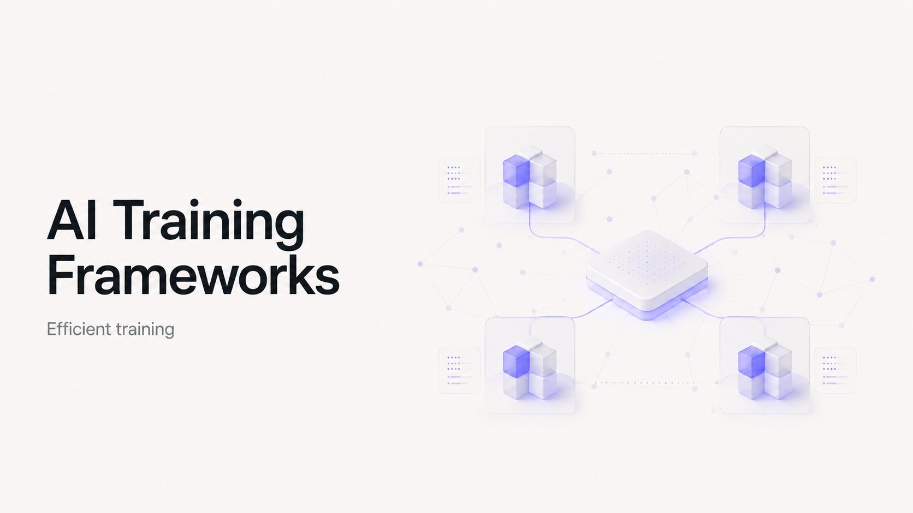

# A Systems Map of Open-Source Distributed Training for Foundation Models

Distributed training is frequently discussed as though it were a single software capability. It is not. A training job that spans thousands of accelerators is a composition of independently evolving mechanisms: rank construction, tensor placement, parameter residency, activation movement, gradient reduction, optimizer-state ownership, checkpoint commit, and worker recovery.

A framework becomes relevant to foundation-model training only when it directly controls at least one of those state transitions. This boundary excludes libraries that merely provide model definitions, kernels, collective primitives, serialization formats, or managed cluster capacity. FlashAttention may determine the attention kernel. NCCL may execute an all-reduce. Kubernetes may allocate the nodes. None of them determines which rank owns an optimizer moment, when a pipeline stage emits a microbatch, how an expert token is dispatched, or whether a checkpoint can be restored under a different topology.

The 24 systems examined here fall into five architectural classes:

[
\boxed{
\begin{aligned}
\mathfrak{F}
============

&;
\mathfrak{F}*{\mathrm{runtime}}
\cup
\mathfrak{F}*{\mathrm{composition}}
\cup
\mathfrak{F}*{\mathrm{engine}}
\
&\cup
\mathfrak{F}*{\mathrm{orchestration}}
\cup
\mathfrak{F}_{\mathrm{accelerator}}.
\end{aligned}
}
]

The objective is not to produce a universal ordering. No meaningful total order exists independently of model architecture, sequence length, accelerator topology, checkpoint contract, failure model, and organizational constraints. The useful question is narrower:

[
\textit{Which system should own each part of the distributed training state machine?}
]

---

## 1. The systems boundary

A distributed-training system qualifies here when it directly implements one or more of the following:

[
\begin{aligned}
&\text{process-group or device-mesh construction},\
&\text{parameter, gradient, or optimizer-state partitioning},\
&\text{tensor, pipeline, context, sequence, or expert parallelism},\
&\text{activation placement, communication, or recomputation},\
&\text{distributed checkpoint planning and resharding},\
&\text{worker elasticity, restart, or topology reconstruction}.
\end{aligned}
]

This definition deliberately distinguishes algorithm ownership from integration.

Hugging Face Accelerate can configure FSDP or DeepSpeed, but the sharding algorithm remains owned by PyTorch or DeepSpeed. Lightning Fabric can launch a distributed job and expose strategy objects, but it does not independently define ZeRO partitioning. Ray Train can reconstruct a worker group after failure, but it delegates parameter placement to the underlying trainer. NeMo exposes complete training workflows, while Megatron Core implements much of the model-parallel execution beneath those workflows.

The distinction can be written as:

[
\operatorname{Expose}(m)
\neq
\operatorname{Own}(m)
\neq
\operatorname{Execute}(m),
]

where (m) is a distributed mechanism.

The kernel and communication layers are also outside the core set:

[
\begin{aligned}
\text{Triton, Pallas}
&\rightarrow \text{kernel construction},\
\text{Transformer Engine, AITER, FlashAttention}
&\rightarrow \text{optimized operators and precision},\
\text{NCCL, RCCL, HCCL, MPI}
&\rightarrow \text{collective transport}.
\end{aligned}
]

These layers are performance-critical, but they do not own the distributed optimizer-step lifecycle.

---

## 2. Distributed training as a state machine

A distributed optimizer step operates over more than model weights. Let

[
\mathcal{S}_t
=============

\left(
\Theta_t,
G_t,
O_t,
A_t,
R_t,
D_t,
C_t,
P_t,
K_t
\right),
]

where:

| State      | Meaning                                                           |
| ---------- | ----------------------------------------------------------------- |
| (\Theta_t) | Parameters, parameter shards, master parameters, quantized copies |
| (G_t)      | Gradients, partial gradients, reduction buckets                   |
| (O_t)      | Optimizer moments, loss scaling, scheduler state                  |
| (A_t)      | Live, offloaded, partitioned, or recomputed activations           |
| (R_t)      | RNG state for dropout, sampling, expert routing, recomputation    |
| (D_t)      | Dataset cursor, sampler, shuffling and dataloader state           |
| (C_t)      | Rank, process group, communicator and topology state              |
| (P_t)      | Parallelism plan and tensor-placement metadata                    |
| (K_t)      | Most recently committed recoverable checkpoint                    |

The step transition is:

[
\begin{aligned}
\mathcal{D}
&\xrightarrow{\text{sample}}
B_t
\xrightarrow{\text{place}}
\widehat{B}*t
\xrightarrow{\text{forward}}
A_t
\
&\xrightarrow{\text{activation communication}}
Z_t
\xrightarrow{\text{loss}}
\mathcal{L}*t
\xrightarrow{\text{backward}}
G_t
\
&\xrightarrow{\text{gradient communication}}
\widehat{G}*t
\xrightarrow{\text{optimizer}}
(\Theta*{t+1},O*{t+1})
\xrightarrow{\text{commit}}
K*{t+1}.
\end{aligned}
]

No single framework necessarily owns the full transition.

### 2.1 Worker and topology construction

The first transition creates a distributed execution domain:

[
\mathcal{W}
===========

{
(w_i,r_i,d_i,n_i)
}_{i=0}^{N-1},
]

where each worker has a global rank (r_i), device (d_i), and node (n_i).

PyTorch c10d, `torchrun`, TorchElastic, Ray Train, Slurm launchers, and accelerator-specific runtimes construct or reconstruct this domain. They determine membership and communicator creation, but not necessarily tensor placement.

### 2.2 Tensor placement

A multidimensional device mesh can be written as:

[
\mathcal{M}
\in
\mathbb{N}^{d_1\times d_2\times \cdots \times d_k},
\qquad
\prod_{j=1}^{k}d_j=N.
]

The dimensions may represent:

[
\mathcal{M}
===========

\mathcal{M}*{\mathrm{DP}}
\times
\mathcal{M}*{\mathrm{TP}}
\times
\mathcal{M}*{\mathrm{PP}}
\times
\mathcal{M}*{\mathrm{CP}}
\times
\mathcal{M}_{\mathrm{EP}}.
]

DTensor, JAX sharding, XLA GSPMD, OneFlow Global Tensor, and higher-level model-parallel engines map logical tensors onto this topology.

### 2.3 Model-state residency

Under replicated data parallelism:

[
\Theta^{(r)}=\Theta,
\qquad
O^{(r)}=O,
]

while gradients are synchronized.

Under fully sharded data parallelism or ZeRO-3:

[
\Theta
======

\biguplus_{r=0}^{N-1}\Theta^{(r)},
\qquad
G
=

\biguplus_{r=0}^{N-1}G^{(r)},
\qquad
O
=

\biguplus_{r=0}^{N-1}O^{(r)}.
]

The framework must schedule temporary parameter materialization, gradient reduction, optimizer execution, and shard release. FSDP2, DeepSpeed ZeRO, Megatron’s distributed optimizer, Paddle sharding, and comparable systems own this transition.

### 2.4 Activation movement

Model parallelism introduces communications into the forward and backward graphs:

[
\begin{aligned}
\mathrm{TP}
&:\operatorname{AllReduce},
\operatorname{AllGather},
\operatorname{ReduceScatter},\
\mathrm{PP}
&:\operatorname{SendRecv}
\left(
A^{(s)}\rightarrow A^{(s+1)}
\right),\
\mathrm{CP}
&:\operatorname{RingExchange}
\left(
K,V
\right),\
\mathrm{EP}
&:\operatorname{AllToAll}
\left(
X_{\mathrm{token}}\rightarrow X_{\mathrm{expert}}
\right).
\end{aligned}
]

The communication substrate transports these tensors; the training engine decides their schedule, layout, lifetime, and synchronization dependencies.

### 2.5 Checkpoint commit and recovery

A distributed checkpoint is recoverable only when it captures enough state to reconstruct the training process:

[
K_t
===

\operatorname{Serialize}
\left(
\Theta_t,
O_t,
R_t,
D_t,
t,
\text{scheduler},
\text{precision state},
P_t
\right).
]

Saving only model weights is not fault-tolerant training.

Topology-independent restore additionally requires:

[
\operatorname{Load}_{P'}
\left(
K_t^{P}
\right),
\qquad
P'\neq P,
]

where state written under parallelism plan (P) is redistributed into (P'). PyTorch Distributed Checkpoint, Orbax/TensorStore, NeMo distributed checkpointing, DeepSpeed Universal Checkpointing, and framework-specific checkpoint planners address different parts of this problem.

---

## 3. Comparison methodology

The systems are compared without collapsing them into a scalar score. Each is evaluated along nine engineering dimensions.

### 3.1 Semantic ownership

Does the project directly implement the mechanism, or configure another framework that implements it?

### 3.2 Parallelism closure

Can the system compose:

[
\mathrm{DP}
\times
\mathrm{FSDP}
\times
\mathrm{TP}
\times
\mathrm{PP}
\times
\mathrm{CP}
\times
\mathrm{EP}
]

without incompatible tensor layouts, duplicated process groups, or undefined checkpoint semantics?

### 3.3 Distributed-state completeness

Which system owns:

[
{
\Theta,G,O,A,R,D,C,P,K
}?
]

A system that partitions parameters but ignores dataloader and RNG state is not a complete recovery layer.

### 3.4 Checkpoint semantics

The relevant questions are:

* Are writes synchronous or asynchronous?
* Is state sharded or consolidated?
* Is checkpoint layout tied to the original world size?
* Can model and optimizer states be resharded?
* Is a commit atomic or detectable as incomplete?
* Can recovery resume from a different topology?

### 3.5 Failure model

A framework may support:

[
\text{restart}
\neq
\text{elastic membership}
\neq
\text{stateful recovery}.
]

Restarting all ranks after a process failure does not guarantee that the optimizer, RNG stream, or input cursor resumes correctly.

### 3.6 Hardware coupling

A hardware-specific system is not penalized for being specialized. The relevant question is whether specialization is explicit and whether the software bill of materials is reproducible.

### 3.7 Frontier validation

Compatibility is weaker evidence than actual disclosed use:

[
\boxed{
\text{explicitly used}
;>;
\text{officially reproduced}
;>;
\text{supported by repository}
;>;
\text{community inferred}.
}
]

A Llama implementation in TorchTitan does not prove that Meta trained Llama using TorchTitan.

### 3.8 Operability

The analysis includes launchers, observability, profiling, object-storage checkpoints, cluster integration, failure diagnosis, reproducible containers, and topology-aware configuration.

### 3.9 Benchmark evidence

A performance claim is comparison-worthy only when it exposes:

[
\mathcal{B}
===========

(
\text{hardware},
N,
\text{model},
L,
\text{precision},
\text{batch},
\text{baseline},
\text{software version}
).
]

When this tuple is incomplete, the result remains a project-reported measurement rather than a cross-framework conclusion.

Evidence labels used below are:

* **[CODE-VERIFIED]**
* **[REPORTED]**
* **[DERIVED]**
* **[UNDISCLOSED]**
* **[EXPERIMENTAL]**
* **[DEPRECATED]**

---

## 4. The 24 distributed-training systems

### 4.1 Landscape

| System                            | Organization    | Execution model                 | Directly owned semantics                                                       | Hardware envelope                          | Primary engineering role                                 |
| --------------------------------- | --------------- | ------------------------------- | ------------------------------------------------------------------------------ | ------------------------------------------ | -------------------------------------------------------- |
| PyTorch Distributed Core          | PyTorch         | PyTorch/c10d                    | Process groups, DDP, rendezvous, elastic worker lifecycle                      | GPU, CPU and supported backends            | Distributed runtime substrate                            |
| PyTorch Composable Parallelism    | PyTorch         | PyTorch/DTensor                 | DeviceMesh, DTensor, FSDP2, TP, PP, CP                                         | PyTorch-supported accelerators             | Native distributed tensor and model transformation layer |
| PyTorch Distributed Checkpoint    | PyTorch         | PyTorch state dictionaries      | Parallel save/load, planning, resharding                                       | PyTorch-supported storage and accelerators | Checkpoint substrate                                     |
| TorchTitan                        | PyTorch         | PyTorch                         | Composed FSDP2, TP, PP, CP, checkpoint and trainer lifecycle                   | NVIDIA, AMD; emerging Trainium path        | Reference foundation-model trainer                       |
| Megatron Core                     | NVIDIA          | PyTorch                         | TP, PP, SP, CP, EP, distributed optimizer, MoE                                 | NVIDIA-first; downstream ports exist       | Frontier model-parallel engine                           |
| NeMo Framework                    | NVIDIA          | PyTorch/Megatron                | Training application, strategies, recipes, checkpoint and experiment lifecycle | NVIDIA-first                               | Production training framework                            |
| DeepSpeed                         | Microsoft       | PyTorch                         | ZeRO, offload, PP, TP, MoE, sequence parallelism                               | NVIDIA, AMD and vendor integrations        | Sharding and execution engine                            |
| JAX distributed arrays            | Google/JAX      | JAX/XLA                         | Global arrays, mesh sharding, SPMD transforms                                  | TPU, GPU, CPU                              | Distributed programming model                            |
| MaxText                           | Google          | JAX/XLA                         | Complete mesh-based transformer trainer                                        | TPU and GPU                                | TPU-scale reference trainer                              |
| PyTorch/XLA                       | PyTorch/OpenXLA | PyTorch/XLA                     | SPMD sharding, XLA FSDP and checkpoint planners                                | TPU and XLA devices                        | PyTorch-to-XLA distributed bridge                        |
| AXLearn                           | Apple           | JAX/XLA                         | GSPMD training infrastructure and distributed state management                 | TPU and GPU                                | Full JAX training platform                               |
| Levanter                          | Marin community | JAX/Haliax                      | Named-tensor sharding, distributed training and checkpoints                    | TPU and GPU                                | Research-readable JAX trainer                            |
| OLMo-core                         | Ai2             | PyTorch                         | FSDP, TP, PP, CP, EP, MoE and checkpoint lifecycle                             | NVIDIA-oriented PyTorch                    | Reproducible open-model trainer                          |
| Nanotron                          | Hugging Face    | PyTorch                         | Explicit DP, TP, PP, ZeRO-1 and EP mechanics                                   | NVIDIA GPU                                 | Minimal inspectable 3D-parallel engine                   |
| Colossal-AI                       | HPC-AI Tech     | PyTorch                         | ZeRO, heterogeneous memory, TP, PP, SP, EP and MoE                             | GPU and selected NPU paths                 | Experimental hybrid-parallel engine                      |
| Paddle Fleet/AutoParallel         | PaddlePaddle    | Paddle                          | Sharding, hybrid parallelism, process meshes and recovery integration          | GPU, CPU and Paddle backends               | Paddle-native distributed framework                      |
| OneFlow Global Tensor             | OneFlow         | OneFlow                         | Placement and SBP-based global tensor semantics                                | GPU and CPU                                | Distributed tensor runtime                               |
| InternEvo                         | InternLM        | PyTorch                         | ZeRO, TP, PP, SP and long-sequence parallelism                                 | NVIDIA GPU                                 | InternLM pretraining engine                              |
| XTuner V1                         | InternLM        | PyTorch                         | FSDP-centric MoE execution and distributed post-training                       | GPU and Ascend NPU                         | Emerging MoE and post-training engine                    |
| Ray Train                         | Ray             | Python/PyTorch/JAX integrations | Worker topology, restart, checkpoint coordination and resource placement       | Multi-cloud and heterogeneous clusters     | Elastic orchestration layer                              |
| AMD Primus                        | AMD             | PyTorch/JAX integrations        | ROCm training integration, workflow, monitoring and fault handling             | AMD Instinct                               | AMD production training stack                            |
| Intel Gaudi distributed stack     | Intel/Habana    | PyTorch/vendor forks            | Gaudi process execution and validated distributed integrations                 | Gaudi 2 and Gaudi 3                        | Gaudi-specific training stack                            |
| AWS TorchNeuron distributed stack | AWS             | Native PyTorch/Neuron           | PyTorch distributed execution through TorchNeuron                              | AWS Trainium                               | Trainium-native PyTorch direction                        |
| Cerebras Model Zoo and Trainer    | Cerebras        | Cerebras runtime                | Compiler-controlled distributed execution and training lifecycle               | Cerebras CSX                               | Wafer-scale training stack                               |

---

### 4.2 PyTorch Distributed Core

**Repository:** `pytorch/pytorch`
**Role:** process-group runtime, replicated data parallelism and elastic worker execution.

PyTorch Distributed Core is the substrate beneath most PyTorch training systems. c10d owns stores, rendezvous, process groups, rank assignment, collective dispatch, and backend selection. DDP replicates parameters, registers autograd hooks, places gradients into ordered buckets, and schedules collective reduction as backward execution makes buckets ready. `torchrun` and TorchElastic construct and restart worker groups. **[CODE-VERIFIED]**

DDP owns replicated parameter consistency and gradient synchronization. It does not shard optimizer state, partition model layers, coordinate experts, or create topology-independent checkpoints. TorchElastic can replace failed workers, but application state must be persisted and restored explicitly. A worker restart without a complete snapshot is process recovery, not training recovery. **[REPORTED]**

Its strongest use case is as the stable communication and membership layer for a higher-level PyTorch system. Its hard boundary is intentional: it executes distributed operations but does not construct a complete foundation-model parallelism plan.

---

### 4.3 PyTorch Composable Parallelism

**Repository:** `pytorch/pytorch`
**Components:** DeviceMesh, DTensor, FSDP2, Tensor Parallel, Distributed Pipelining and Context Parallel.

DeviceMesh maps ranks into named multidimensional topologies. DTensor associates each logical tensor with a global shape, mesh and placement vector:

[
\operatorname{DTensor}
======================

(X_{\mathrm{local}},X_{\mathrm{global}},\mathcal{M},\mathcal{P}),
]

where placements may be replicated, sharded or partial. Operators propagate those placements and insert redistributions where necessary. **[CODE-VERIFIED]**

FSDP2 applies `fully_shard` transformations that represent parameters as per-parameter DTensors. Parameters are all-gathered before computation, gradients are reduce-scattered after backward, and optimizer execution occurs over local shards. This differs materially from FSDP1’s flattened parameter representation and improves composition with TP and DCP. **[CODE-VERIFIED]**

Tensor Parallel applies row-wise, column-wise and sequence-parallel transformations to modules. Distributed Pipelining owns stage construction, microbatch splitting, point-to-point communication and pipeline schedules, but its public API is still explicitly experimental. Context Parallel partitions sequence context and communicates attention state through distributed attention mechanisms. **[EXPERIMENTAL/CODE-VERIFIED]**

The architecture is strategically important because parameter state, tensor placement and checkpoint representation are converging on DTensor. The hard limitation is compositional maturity. Each mechanism may function independently while a particular combination of FSDP2, TP, PP, CP, compilation and low precision remains unvalidated.

---

### 4.4 PyTorch Distributed Checkpoint

**Repository:** `pytorch/pytorch`
**Role:** distributed save, load, planning and resharding.

PyTorch Distributed Checkpoint avoids rank-zero consolidation. Each rank contributes local state to a coordinated save, while planners transform logical state-dictionary entries into physical storage operations. During load, the destination state dictionary defines the target placement, allowing saved state to be redistributed into a different sharding plan. **[CODE-VERIFIED]**

The checkpoint layer primarily owns storage planning and tensor-state movement. The caller remains responsible for deciding whether the checkpoint contains:

[
{
\Theta,O,R,D,\text{scheduler},\text{precision state}
}.
]

DCP cannot reconstruct information that was never serialized. It also does not independently establish atomic commit semantics across arbitrary remote filesystems, select retention policy, or validate that changed model structure remains compatible.

Its strongest use case is a common checkpoint substrate for FSDP2, TorchTitan, PyTorch/XLA and custom DTensor applications. Its hard boundary is that distributed storage is not itself fault-tolerant training.

---

### 4.5 TorchTitan

**Repository:** `pytorch/torchtitan`
**Role:** composable PyTorch-native foundation-model trainer.

TorchTitan integrates FSDP2, DTensor TP, pipeline parallelism, context parallelism, DDP/HSDP, activation checkpointing, compilation, asynchronous DCP, checkpointable input state, profiling and observability inside a single reference trainer. It supports multiple low-precision paths, including FP8 and MXFP8 configurations where the hardware and kernel stack permit them. **[CODE-VERIFIED/REPORTED]**

Its architectural importance is not merely feature count. TorchTitan demonstrates how first-party PyTorch components share common state representations:

[
\text{DTensor parameter}
\rightarrow
\text{FSDP2/TP transformation}
\rightarrow
\text{DCP state dictionary}.
]

This reduces the conversion boundaries that historically existed between independent sharding, model-parallel and checkpoint engines.

TorchTitan is the strongest greenfield path for organizations that want to remain close to upstream PyTorch. Its limitation is that it is still a fast-moving reference platform. A model recipe in TorchTitan validates compatibility with the trainer; it does not establish that the model’s original developer used TorchTitan.

---

### 4.6 Megatron Core

**Repository:** `NVIDIA/Megatron-LM`
**Role:** transformer-specific hybrid model-parallel execution engine.

Megatron Core directly owns tensor-parallel linear layers, pipeline stages and schedules, sequence parallelism, context parallelism, expert parallelism, MoE routing and token dispatch, distributed optimizer behavior, activation recomputation and the corresponding process-group decomposition. **[CODE-VERIFIED]**

A typical Megatron topology is:

[
N
=

N_{\mathrm{DP}}
N_{\mathrm{TP}}
N_{\mathrm{PP}}
N_{\mathrm{CP}}
N_{\mathrm{EP}}.
]

Each dimension creates distinct ownership and communication rules. TP partitions matrix dimensions. PP partitions transformer depth. CP partitions sequence context. EP partitions experts and dispatches tokens through all-to-all or related communication. The distributed optimizer partitions optimizer-related state across data-parallel ranks.

The framework exposes FP16, BF16, FP8 and newer low-precision execution through the NVIDIA software stack, including Transformer Engine integrations. MoE, context-parallel and distributed checkpoint implementations are first-class components rather than external wrappers. **[REPORTED]**

Megatron Core is the deepest open transformer-specific parallel engine for NVIDIA clusters. Its hard limitation is configuration coupling: tensor divisibility, group construction, pipeline partitioning, expert topology, checkpoint layout and kernel availability must all agree. A valid configuration can still be communication-suboptimal if logical dimensions are mapped poorly onto NVLink, NVSwitch and inter-node fabrics.

---

### 4.7 NVIDIA NeMo Framework

**Repository:** NVIDIA NeMo Framework
**Role:** training application, strategy, recipe and operational lifecycle framework.

NeMo composes model recipes, datasets, precision policies, logging, experiment management, distributed strategies and checkpoint behavior. Its Megatron strategy delegates TP, PP, CP, EP and much of MoE execution to Megatron Core, while additional strategies expose PyTorch FSDP paths. **[REPORTED]**

NeMo’s distributed checkpoint layer supports sharded state and resumption under changed tensor- and pipeline-parallel configurations. This is an operationally significant distinction from rank-local checkpoint formats because long-running jobs frequently resume on clusters with altered resource availability. **[REPORTED]**

NeMo is appropriate when an NVIDIA organization needs a controlled end-to-end platform rather than a bare model-parallel library. It provides the application layer that Megatron Core intentionally does not.

The hard limitation is stack depth:

[
\text{NeMo}
\rightarrow
\text{Megatron Core}
\rightarrow
\text{Transformer Engine}
\rightarrow
\text{PyTorch}
\rightarrow
\text{CUDA/NCCL}.
]

A failure may cross configuration, distributed scheduling, kernels, communication and cluster infrastructure. Debugging therefore requires ownership across the entire stack rather than only the top-level NeMo abstraction.

---

### 4.8 DeepSpeed

**Repository:** `deepspeedai/DeepSpeed`
**Role:** sharding, offload and distributed execution engine.

DeepSpeed’s defining mechanism is ZeRO state partitioning:

[
\begin{array}{ll}
\text{ZeRO-1}: & O\ \text{partitioned},\
\text{ZeRO-2}: & O,G\ \text{partitioned},\
\text{ZeRO-3}: & O,G,\Theta\ \text{partitioned}.
\end{array}
]

ZeRO-Offload and ZeRO-Infinity extend parameter and optimizer residency into CPU memory and NVMe, introducing an explicit storage hierarchy into the optimizer step. **[CODE-VERIFIED/REPORTED]**

DeepSpeed also implements pipeline execution, tensor-parallel paths, MoE, expert parallelism and Ulysses-style sequence parallelism. Its AutoTP training path has documented compatibility constraints, including differences across ZeRO stages; support should not be inferred uniformly from the existence of a TP API. **[CODE-VERIFIED]**

Universal Checkpointing attempts to separate logical training state from the original DP, TP and PP layout. This is the correct design direction, but official issues show that optimizer, subgroup and MoE cases require careful version-specific validation. It is therefore incorrect to claim unconditional topology-independent recovery for every DeepSpeed configuration. **[REPORTED]**

DeepSpeed is strongest where memory hierarchy, ZeRO partitioning and offload dominate. Its hard limitation is execution-path fragmentation: ZeRO, pipeline, AutoTP, MoE, sequence parallelism and checkpoint conversion do not always share identical compatibility contracts.

---

### 4.9 JAX distributed arrays and explicit sharding

**Repository:** `jax-ml/jax`
**Role:** global-array and compiler-driven distributed programming model.

JAX represents arrays as logically global objects with physically addressable shards. A mesh and `PartitionSpec` describe placement:

[
X
:
[\mathcal{B},\mathcal{S},\mathcal{H}]
\mapsto
P(
\text{data},
\text{context},
\text{model}
).
]

XLA lowers the partitioned program and inserts communication according to the resulting SPMD graph. `shard_map` makes per-device computation and collective behavior more explicit when automatic partitioning is insufficient. **[REPORTED]**

This abstraction can encode data parallelism, parameter sharding, tensor parallelism, sequence partitioning, expert placement and hybrid meshes without wrapping each model layer in a dedicated distributed class.

JAX itself does not provide a complete training application. It does not determine the pipeline schedule, checkpoint retention policy, input recovery semantics or cluster restart strategy. Those responsibilities move to MaxText, AXLearn, Levanter, Orbax, TensorStore or organization-specific infrastructure.

The failure mode is often silent inefficiency rather than semantic invalidity. A sharding layout may compile and execute correctly while introducing expensive reshard operations or cross-slice collectives. Multi-controller programs also require globally consistent control flow and collective ordering. **[REPORTED]**

---

### 4.10 MaxText

**Repository:** `AI-Hypercomputer/maxtext`
**Role:** high-performance JAX reference trainer.

MaxText constructs logical meshes for data, FSDP, tensor, pipeline, context and expert parallelism. XLA then lowers the globally sharded program into device-local computations and collectives. The system supports dense, MoE, multimodal and post-training configurations across TPU and GPU environments. **[CODE-VERIFIED/REPORTED]**

MaxText’s checkpoint architecture is built around Orbax and TensorStore. It supports distributed asynchronous checkpointing, object-storage formats and multi-tier persistence strategies. The target sharding supplied during restore permits state redistribution rather than requiring direct reuse of the original physical shard layout. **[REPORTED]**

Context-parallel implementations include all-gather and ring-oriented attention strategies. Separately named sequence-parallel configurations have been deprecated in favor of context-parallel formulations, so old MaxText configurations should not be interpreted as the current architecture. **[DEPRECATED]**

MaxText is the default open reference for TPU-scale transformer training. Its hard limitation is that the apparent simplicity of a YAML mesh conceals compiler behavior. HLO partitioning, reshard insertion, topology mapping, recompilation and collective scheduling remain necessary debugging surfaces.

---

### 4.11 PyTorch/XLA

**Repository:** `pytorch/xla`
**Role:** PyTorch-to-XLA distributed execution bridge.

PyTorch/XLA lowers PyTorch operations into XLA computations. Its SPMD mode uses device meshes and tensor sharding annotations to construct a globally partitioned program. Parameters and activations remain PyTorch-facing objects while XLA controls their physical placement and collective communication. **[REPORTED]**

The project supports XLA-oriented FSDP and integrates with PyTorch Distributed Checkpoint through XLA-specific planners. This permits local XLA shards to participate in distributed save and load rather than requiring full host-side consolidation.

PyTorch/XLA is the relevant path when a PyTorch organization targets TPU while retaining the PyTorch model and optimizer surface. The limitation is that PyTorch’s eager execution intuition does not transfer directly. Graph boundaries, recompilation, host synchronization, dynamic shapes and unsupported lowerings can dominate performance.

AWS’s retirement of PyTorch/XLA training on Trainium is specific to the Trainium software transition. It does not imply that PyTorch/XLA is deprecated for TPU.

---

### 4.12 AXLearn

**Repository:** `apple/axlearn`
**Role:** full JAX/GSPMD model-development and training infrastructure.

AXLearn uses JAX, XLA and GSPMD to express models over logical meshes. Parameter specifications encode mesh-axis placement, and the framework provides trainer infrastructure, model abstractions, launch tooling and cloud-oriented execution support. Apple reports validation of the stack for models containing hundreds of billions of parameters across thousands of accelerators. This remains project-reported scale evidence rather than an independent framework comparison. **[REPORTED]**

Its TensorStore checkpoint implementation performs distributed serialization, bounded-memory writes, shape and dtype validation, asynchronous persistence and restore into specified target shardings. Checkpoint handling also includes non-tensor and input-related state, although code-level constraints remain around fully elastic input restoration. **[CODE-VERIFIED]**

AXLearn is appropriate when a JAX organization requires a complete extensible training platform rather than a model-specific reference implementation. Its primary limitation is API stability: the project explicitly states that it is under active development and that interfaces may change.

---

### 4.13 Levanter

**Repository:** `marin-community/levanter`
**Role:** research-oriented JAX foundation-model trainer.

Levanter is built around Haliax named tensors, making logical tensor dimensions explicit rather than encoding them through positional shape conventions. It supports GPU and TPU execution, FSDP-like parameter sharding, tensor parallelism, streaming data processing, Hugging Face conversion and distributed TensorStore checkpoints. **[REPORTED]**

The system places unusual emphasis on experiment reproducibility. It reports bitwise-deterministic TPU training across preemption and resumption when the topology remains compatible. It can resume using a different host count, but the project explicitly notes that this breaks exact reproducibility. **[REPORTED]**

Levanter is a strong choice for researchers who need readable global-tensor semantics and deterministic training rather than maximum hybrid-parallel breadth. Its hard boundary is that it does not provide a Megatron-equivalent PP, CP and EP stack.

---

### 4.14 OLMo-core

**Repository:** `allenai/OLMo-core`
**Role:** inspectable, reproducible PyTorch foundation-model trainer.

OLMo-core directly implements FSDP/HSDP, tensor parallelism, pipeline parallelism, context parallelism, expert parallelism, MoE support, distributed checkpointing and official training scripts for OLMo-family models. **[CODE-VERIFIED]**

Its principal systems property is evidence continuity:

[
\text{released model}
\leftrightarrow
\text{official recipe}
\leftrightarrow
\text{training framework}
\leftrightarrow
\text{checkpoint artifacts}.
]

That continuity is uncommon. It permits model-level observations to be connected to implementation and data decisions rather than reconstructed from a generic compatible trainer.

Recent project changes include checkpoint-write corrections, S3 retry handling, deterministic dataloader work and fixes involving pipeline RNG and CP/TP evaluation. These changes expose the operational problems that matter in real training runs rather than only adding architecture names. **[CODE-VERIFIED]**

OLMo-core is a strong default for open and inspectable model research. Its limitation is ecosystem scale: it has fewer vendor-maintained platform integrations than NeMo or DeepSpeed.

---

### 4.15 Nanotron

**Repository:** `huggingface/nanotron`
**Role:** explicit and compact PyTorch 3D-parallel training engine.

Nanotron directly implements data parallelism, ZeRO-1 optimizer partitioning, tensor parallelism, pipeline parallelism, expert parallelism, parameter tying and multiple pipeline schedules. Its code exposes process-group construction and distributed layer behavior without hiding them behind a large application framework. **[CODE-VERIFIED]**

The framework has added expert-parallel MoE execution, FP8-related paths and checkpoint improvements, including optimizer-state loading that is less tightly coupled to the original pipeline degree. **[REPORTED]**

Nanotron’s strongest use case is mechanism-level distributed-training research. It is small enough to inspect how TP, PP and DP interact and how pipeline schedules alter activation lifetime.

Its hard limitation is operational breadth. It does not provide the same elasticity, cloud recovery, hardware portability or topology-independent checkpoint surface as larger production frameworks. It is a readable training engine, not a complete multi-cloud training platform.

---

### 4.16 Colossal-AI

**Repository:** `hpcaitech/ColossalAI`
**Role:** flexible PyTorch hybrid-parallel and heterogeneous-memory engine.

Colossal-AI implements ZeRO-style state partitioning, Gemini heterogeneous memory management, tensor parallelism, pipeline parallelism, sequence parallelism, expert parallelism, MoE execution and model transformation through ShardFormer. **[CODE-VERIFIED]**

The framework is useful when researchers need to modify or compare alternative sharding and parallelism strategies without adopting Megatron’s full architecture. Its code includes explicit all-to-all expert communication and multiple plugin-driven execution paths.

Recent releases include asynchronous-checkpoint corrections and expanded 3D-parallel and MoE support. **[REPORTED]**

Its hard limitation is evidence normalization. Project benchmarks frequently demonstrate that a path works or improves over a selected baseline, but not every published result exposes the full hardware, model, sequence, batch, precision and version tuple required for universal comparison. Colossal-AI should therefore be selected for its mechanism flexibility, not because of an isolated throughput claim.

---

### 4.17 Paddle Fleet and AutoParallel

**Repository:** `PaddlePaddle/Paddle`
**Role:** Paddle-native distributed execution framework.

Fleet provides distributed strategy construction for data parallelism, optimizer sharding, tensor/model parallelism, pipeline parallelism, recomputation and hierarchical collective groups. AutoParallel introduces process meshes and global tensor-placement semantics for automatic or semi-automatic partitioning. **[REPORTED]**

Paddle’s distributed stack includes pipeline schedules, sequence-parallel support, resharding operations and framework-integrated checkpoint mechanisms. Some automatic and semi-automatic execution paths remain explicitly experimental, and the documented strategy surface should be read version by version rather than treated as uniformly stable. **[EXPERIMENTAL]**

Fleet is the correct choice for organizations already standardized on PaddlePaddle, PaddleNLP and associated deployment infrastructure. Its hard limitation is cross-ecosystem gravity: fewer external foundation-model repositories, kernels and diagnostics target Paddle first compared with PyTorch or JAX.

---

### 4.18 OneFlow Global Tensor

**Repository:** `Oneflow-Inc/oneflow`
**Role:** distributed tensor runtime based on placement and SBP semantics.

OneFlow Global Tensor describes a tensor using device placement and SBP:

[
\mathrm{SBP}
\in
{
\mathrm{Split}(d),
\mathrm{Broadcast},
\mathrm{Partial}
}.
]

This representation unifies data replication, tensor partitioning and partial-reduction states. When an operation changes the required SBP layout, OneFlow derives the necessary distributed redistribution and collectives. **[CODE-VERIFIED]**

The model is conceptually similar to modern global-array systems: the distributed placement is part of tensor semantics rather than an external wrapper. Pipeline-parallel execution is also represented in official implementation and documentation. **[REPORTED]**

OneFlow’s strongest contribution is architectural coherence. Its hard limitation is ecosystem concentration. Public foundation-model provenance, third-party integration and operational tooling are materially narrower than the corresponding PyTorch and JAX ecosystems. A team adopting it must value its global-tensor model enough to accept that narrower compatibility surface.

---

### 4.19 InternEvo

**Repository:** `InternLM/InternEvo`
**Role:** InternLM-oriented hybrid-parallel pretraining engine.

InternEvo implements optimizer-state partitioning, FSDP-related paths, Megatron-style TP, sequence parallelism, pipeline execution, activation recomputation and long-sequence parallel strategies. It supports distributed launch through `torchrun` and Slurm-oriented environments. **[REPORTED]**

Checkpoint configuration and state handling are integrated into the trainer rather than treated as external serialization utilities. **[CODE-VERIFIED]**

InternLM2 provides explicit model-to-framework provenance: its technical report identifies InternEvo as part of the training system and reports large-cluster execution. This is stronger evidence than merely finding an InternLM architecture implementation in another framework. **[REPORTED]**

InternEvo’s strongest use case is reproducing and extending the InternLM pretraining architecture. Its limitation is strategic fragmentation: newer InternLM development increasingly places ultra-large MoE and post-training mechanisms in XTuner V1, creating overlapping system boundaries.

---

### 4.20 XTuner V1

**Repository:** `InternLM/xtuner`
**Role:** FSDP-centric MoE and distributed post-training engine.

XTuner V1 targets very large dropless MoE configurations using an FSDP-centric design intended to reduce the scale of the expert-parallel communication domain. It integrates long-sequence execution through Ulysses-style partitioning and includes pretraining, multimodal SFT, GRPO and distributed RL workflows. **[REPORTED/CODE-VERIFIED]**

The framework supports GPU execution and documented Ascend NPU paths. Its training architecture spans model-state sharding, MoE token movement and post-training resource placement.

XTuner is technically significant because it questions the assumption that every ultra-large MoE must expose a wide global EP all-to-all domain. However, project-reported comparisons involving hundreds-of-billions or trillion-parameter configurations must be interpreted only under their disclosed hardware and software conditions.

Its hard limitation is maturity and auditability. Several performance and scale claims do not expose a complete cross-framework benchmark tuple, and checkpoint-resizing semantics are less comprehensively documented than in older training stacks.

---

### 4.21 Ray Train

**Repository:** `ray-project/ray`
**Role:** elastic distributed worker and checkpoint orchestration.

Ray Train owns worker construction, resource allocation, process-group initialization, node placement, checkpoint reporting, checkpoint persistence and worker-group reconstruction after failures. It integrates with DDP, FSDP, DeepSpeed, Lightning, JAX and custom trainers, but delegates model-state partitioning to those engines. **[REPORTED]**

Its recovery sequence is approximately:

[
\text{failure}
\rightarrow
\text{terminate worker group}
\rightarrow
\text{reallocate resources}
\rightarrow
\text{recreate workers}
\rightarrow
\text{restore checkpoint}.
]

The training function must still serialize enough state to resume correctly. Ray cannot infer a missing optimizer state, dataloader cursor or pipeline RNG stream. Checkpoint reporting also introduces synchronization behavior that must be understood in multi-worker jobs. **[REPORTED]**

Ray Train is strongest when elastic or multi-cloud execution is needed around an existing distributed engine. Its hard boundary is algorithm delegation: it is an orchestration system, not an independent TP, PP or ZeRO implementation.

---

### 4.22 AMD Primus

**Repository:** `AMD-AGI/Primus`
**Role:** AMD Instinct foundation-model training integration and reliability stack.

Primus provides a unified training surface over backends including Megatron and TorchTitan, with AMD-specific containers, ROCm integration, configuration, preflight validation, logging, checkpoint workflows and operational controls. **[REPORTED]**

Most TP, PP, FSDP, CP and EP algorithms remain owned by the selected backend. Primus owns the integration contract required to make those engines operate reliably on AMD Instinct systems:

[
\text{Primus}
\rightarrow
{\text{Megatron},\text{TorchTitan},\text{MaxText}}
\rightarrow
\text{AITER/ROCm/RCCL}.
]

Primus-SaFE and related integrations address failure detection, checkpoint-based recovery and fault-aware execution. **[REPORTED]**

Primus is the correct initial system boundary for a new ROCm foundation-model platform. Its limitation is version coupling: backend commit, ROCm release, AITER kernels, RCCL behavior, container image and accelerator generation must be qualified as one stack.

---

### 4.23 Intel Gaudi distributed training stack

**Repositories:** `HabanaAI/DeepSpeed`, `HabanaAI/Megatron-DeepSpeed`
**Role:** Gaudi-qualified distributed PyTorch integration.

The Gaudi training stack integrates PyTorch distributed execution, HCCL, FSDP, vendor DeepSpeed, Megatron-derived training and accelerator-specific graph, precision and profiling behavior. It directly owns the Gaudi device execution and communication integration, while TP, PP and ZeRO algorithms are largely inherited from vendor-qualified upstream forks. **[REPORTED]**

The official support matrix is the authoritative compatibility contract. PyTorch, SynapseAI, firmware, DeepSpeed fork, Megatron baseline, collective stack and container version must be evaluated as a single validated release set. Upstream package compatibility cannot be assumed merely because API names match. **[REPORTED]**

BF16 and FP8 are primary training modes on current Gaudi generations. FSDP support has expanded through vendor releases, but every combination should be checked against the corresponding matrix.

The stack is appropriate for a Gaudi-specific platform willing to maintain strict version qualification. Its hard limitation is vendor-version coupling and a smaller ecosystem of independently validated distributed recipes.

---

### 4.24 AWS TorchNeuron distributed stack

**Repository/runtime:** TorchNeuron and `torch-neuronx`
**Role:** native PyTorch execution direction for Trainium.

AWS is transitioning Trainium training toward native PyTorch distributed APIs executed through TorchNeuron. The intended stack exposes DDP, FSDP, DTensor and tensor-parallel mechanisms through familiar PyTorch abstractions rather than requiring the older NxDT-specific training layer. **[REPORTED]**

The target architecture is:

[
\text{TorchTitan or native PyTorch trainer}
\rightarrow
{\text{DDP,FSDP,DTensor,TP,DCP}}
\rightarrow
\text{TorchNeuron}
\rightarrow
\text{Neuron/Trainium}.
]

NxDT and NxD Core training APIs have entered maintenance mode, and PyTorch/XLA training is no longer the forward training path on Trainium. **[DEPRECATED]**

The current limitation is availability and maturity. TorchNeuron documentation identifies portions of the native training stack as beta or preview, so operator coverage and production qualification must be verified before committing a greenfield platform. The architectural direction is clear; the transition should not be mistaken for complete parity with mature CUDA or TPU stacks.

---

### 4.25 Cerebras Model Zoo and Trainer

**Repository:** `Cerebras/modelzoo`
**Role:** compiler-controlled distributed execution on CSX systems.

Cerebras Trainer supplies model, data, optimizer, callback, checkpoint, logging and restart abstractions for Cerebras systems. The Model Zoo contains dense language models, MoE systems, encoder-decoder models, multimodal architectures and diffusion workloads, together with configuration and checkpoint-conversion utilities. **[CODE-VERIFIED]**

Cerebras execution does not map cleanly onto the conventional GPU taxonomy. Partitioning is primarily controlled by the compiler and CSX runtime rather than by user-visible TP and PP process groups. Therefore, a missing “TP” switch should not be interpreted as an absence of distributed model partitioning; equally, conventional TP semantics should not be inferred without documentation.

The stack supports multi-system CSX execution and trainer-level restart behavior. **[REPORTED]**

Its strongest use case is an organization committed to Cerebras hardware and willing to let the compiler own placement. Its hard limitation is portability: CSX execution behavior and checkpoint representations are not interchangeable with GPU sharding systems without explicit conversion.

---

## 5. Parallelism capability matrix

The matrix distinguishes direct implementation from delegated integration.

| System                         | DP          | FSDP/ZeRO   | TP          | PP           | SP          | CP           | EP           | MoE         | DCP         | Elasticity   |
| ------------------------------ | ----------- | ----------- | ----------- | ------------ | ----------- | ------------ | ------------ | ----------- | ----------- | ------------ |
| PyTorch Distributed Core       | native      | integration | integration | integration  | integration | integration  | integration  | integration | integration | native       |
| PyTorch Composable Parallelism | native      | native      | native      | experimental | native      | experimental | experimental | integration | integration | integration  |
| PyTorch Distributed Checkpoint | integration | integration | integration | integration  | integration | integration  | integration  | integration | native      | integration  |
| TorchTitan                     | native      | native      | native      | native       | integration | native       | experimental | native      | native      | integration  |
| Megatron Core                  | native      | native      | native      | native       | native      | native       | native       | native      | native      | integration  |
| NeMo Framework                 | native      | integration | integration | integration  | integration | integration  | integration  | integration | native      | integration  |
| DeepSpeed                      | native      | native      | native      | native       | native      | absent       | native       | native      | native      | integration  |
| JAX distributed arrays         | native      | native      | native      | experimental | native      | native       | native       | integration | integration | absent       |
| MaxText                        | native      | native      | native      | native       | deprecated  | native       | native       | native      | native      | integration  |
| PyTorch/XLA                    | native      | native      | native      | experimental | native      | integration  | integration  | integration | native      | absent       |
| AXLearn                        | native      | native      | native      | undisclosed  | integration | integration  | integration  | integration | native      | experimental |
| Levanter                       | native      | native      | native      | absent       | integration | absent       | absent       | absent      | native      | integration  |
| OLMo-core                      | native      | native      | native      | native       | integration | native       | native       | native      | native      | integration  |
| Nanotron                       | native      | native      | native      | native       | absent      | absent       | native       | native      | native      | absent       |
| Colossal-AI                    | native      | native      | native      | native       | native      | experimental | native       | native      | native      | absent       |
| Paddle Fleet                   | native      | native      | native      | native       | native      | experimental | native       | native      | native      | experimental |
| OneFlow Global Tensor          | native      | native      | native      | native       | native      | undisclosed  | undisclosed  | integration | undisclosed | absent       |
| InternEvo                      | native      | native      | native      | native       | native      | native       | undisclosed  | undisclosed | native      | absent       |
| XTuner V1                      | native      | native      | integration | integration  | integration | absent       | native       | native      | undisclosed | absent       |
| Ray Train                      | integration | integration | integration | integration  | integration | integration  | integration  | integration | native      | native       |
| AMD Primus                     | integration | integration | integration | integration  | integration | integration  | integration  | integration | integration | native       |
| Intel Gaudi stack              | integration | integration | integration | integration  | integration | integration  | integration  | integration | integration | integration  |
| AWS TorchNeuron stack          | native      | native      | native      | experimental | integration | experimental | experimental | integration | integration | integration  |
| Cerebras Trainer               | native      | undisclosed | undisclosed | undisclosed  | undisclosed | undisclosed  | undisclosed  | native      | native      | undisclosed  |

Two interpretation rules matter.

First, **integration is not inferior by definition**. NeMo’s use of Megatron Core is deliberate architectural layering. Ray’s delegation to FSDP is correct because Ray owns a different state boundary.

Second, **native does not imply production-complete**. A native experimental pipeline API may be less operationally safe than a mature delegated integration.

---

## 6. Hardware ecosystem map

### 6.1 NVIDIA

[
\boxed{
\text{NeMo}
\rightarrow
\text{Megatron Core}
\rightarrow
\text{Transformer Engine/FlashAttention}
\rightarrow
\text{CUDA}
\rightarrow
\text{NCCL}
}
]

This path provides the broadest mature combination of TP, PP, CP, EP, MoE and low-precision execution on NVIDIA systems.

The more upstream PyTorch path is:

[
\boxed{
\text{TorchTitan}
\rightarrow
{\text{FSDP2,DTensor TP,PP,CP,DCP}}
\rightarrow
\text{CUDA/NCCL}.
}
]

The first path maximizes transformer-specific maturity. The second minimizes distance from first-party PyTorch state representations.

### 6.2 AMD Instinct

[
\boxed{
\text{Primus}
\rightarrow
{\text{Megatron Core,TorchTitan,MaxText}}
\rightarrow
\text{AITER/ROCm}
\rightarrow
\text{RCCL}.
}
]

The critical engineering object is not ROCm support in isolation. It is a qualified tuple:

[
(
\text{accelerator},
\text{ROCm},
\text{RCCL},
\text{kernel library},
\text{framework commit},
\text{container}
).
]

### 6.3 Google TPU

[
\boxed{
\text{MaxText or AXLearn}
\rightarrow
\text{JAX global arrays}
\rightarrow
\text{XLA/GSPMD}
\rightarrow
\text{TPU runtime}.
}
]

For a PyTorch-facing team:

[
\boxed{
\text{PyTorch/XLA SPMD}
\rightarrow
\text{XLA}
\rightarrow
\text{TPU}.
}
]

MaxText is the model-training reference. AXLearn is the broader application platform. PyTorch/XLA preserves more of the PyTorch programming surface.

### 6.4 AWS Trainium

The historical architecture was:

[
\text{NxDT/NxD Core}
\rightarrow
\text{PyTorch/XLA}
\rightarrow
\text{Neuron}.
]

The current architecture is moving toward:

[
\boxed{
\text{TorchTitan/native PyTorch}
\rightarrow
{\text{FSDP,DTensor,DDP,TP}}
\rightarrow
\text{TorchNeuron}
\rightarrow
\text{Trainium}.
}
]

A greenfield design should target the latter architecture, but only after validating the required TorchNeuron feature set.

### 6.5 Intel Gaudi

[
\boxed{
{\text{PyTorch,vendor DeepSpeed,vendor Megatron}}
\rightarrow
\text{SynapseAI}
\rightarrow
\text{HCCL}
\rightarrow
\text{Gaudi}.
}
]

Here the official support matrix is part of the training architecture. Upgrading a framework independently of SynapseAI and the vendor fork is not a benign software change.

### 6.6 Cerebras

[
\boxed{
\text{Cerebras Trainer/Model Zoo}
\rightarrow
\text{Cerebras compiler}
\rightarrow
\text{CSX runtime and fabric}.
}
]

The compiler absorbs much of the explicit placement problem. The tradeoff is lower transparency and portability relative to process-group-based GPU systems.

---

## 7. Publicly disclosed model-training provenance

Framework capability must not be confused with historical model provenance.

| Model or family          | Public evidence                                                                                     | Classification               | Engineering interpretation                             |
| ------------------------ | --------------------------------------------------------------------------------------------------- | ---------------------------- | ------------------------------------------------------ |
| BLOOM 176B               | Training stack explicitly identified as Megatron-DeepSpeed                                          | **[REPORTED]**               | Direct stack attribution is justified                  |
| Megatron-Turing NLG 530B | Megatron and DeepSpeed explicitly described                                                         | **[REPORTED]**               | Direct stack attribution is justified                  |
| OLMo 2 and OLMo 3        | Official training code, recipes and OLMo-core artifacts released                                    | **[REPORTED/CODE-VERIFIED]** | Strong end-to-end reproducibility evidence             |
| InternLM2                | Technical report identifies InternEvo                                                               | **[REPORTED]**               | Direct stack attribution is justified                  |
| DeepSeek-V3              | Technical report describes an internal training infrastructure rather than a named public framework | **[REPORTED]**               | Do not relabel the stack as Megatron or DeepSpeed      |
| Llama 3                  | Public report does not establish a named open-source distributed trainer at implementation level    | **[UNDISCLOSED]**            | TorchTitan or Megatron compatibility is not provenance |
| Qwen3                    | Public report does not establish a named open-source distributed trainer                            | **[UNDISCLOSED]**            | Repository support is not evidence of original use     |

BLOOM’s public materials explicitly identify Megatron-DeepSpeed, and the MT-NLG report explicitly describes combined DeepSpeed and Megatron execution.

OLMo provides a materially different evidence standard: model artifacts, training reports, official scripts and OLMo-core implementation are released as one system.

InternLM2 explicitly associates its training with InternEvo.

DeepSeek-V3 reports its own training infrastructure and parallelism decisions. Support for DeepSeek architectures in Megatron, Colossal-AI or XTuner does not retroactively identify those systems as its original trainer.

Llama and Qwen implementations exist across many trainers, but implementation availability proves only that a framework can represent the architecture. The public model reports do not establish the same direct open-source trainer provenance as BLOOM, OLMo or InternLM.

---

## 8. Selection by workload

The selection surface should be conditioned on model topology, hardware and recovery requirements rather than framework popularity.

### Dense frontier pretraining on NVIDIA

**Default:** Megatron Core with NeMo when a complete production application layer is required.

Mechanism:

[
\mathrm{TP}
\times
\mathrm{PP}
\times
\mathrm{CP}
\times
\mathrm{DP}
]

can be expressed inside one transformer-specific process-group model. NeMo adds recipe, experiment and checkpoint lifecycle.

Choose TorchTitan instead when the platform objective is first-party PyTorch composition and the intended configuration has been validated at the required scale.

### MoE frontier pretraining on NVIDIA

**Default:** Megatron Core with NeMo.

The critical capability is not merely an MoE layer. It is the joint handling of:

[
\text{router}
+
\text{token dispatch}
+
\text{EP groups}
+
\text{capacity policy}
+
\text{TP/PP/CP interaction}
+
\text{distributed optimizer}.
]

XTuner V1 is a technically relevant alternative for FSDP-centric dropless MoE research, but it should not replace mature Megatron deployments solely on the basis of project-reported scale claims.

### Memory-constrained distributed training

**Default:** DeepSpeed ZeRO-3, potentially with CPU or NVMe offload.

The decision should be driven by the bandwidth hierarchy:

[
T_{\mathrm{step}}
=================

T_{\mathrm{compute}}
+
T_{\mathrm{network}}
+
T_{\mathrm{PCIe}}
+
T_{\mathrm{storage}}
--------------------

T_{\mathrm{overlap}}.
]

Offload increases model capacity but can reduce throughput sharply when transfer and prefetch scheduling do not hide the slower tiers.

FSDP2 is preferable when the model fits within accelerator-cluster memory and upstream PyTorch composition is more important than deep offload.

### Long-context pretraining

**NVIDIA transformer engine:** Megatron Context Parallel.
**PyTorch-native platform:** TorchTitan Context Parallel.
**Sequence-all-to-all decomposition:** DeepSpeed Ulysses when attention-head divisibility and topology match the method.

The choice depends on whether the dominant decomposition partitions context blocks, attention heads, or both. A sequence-parallel method that requires divisibility by attention-head count may be inappropriate for grouped-query attention with a small KV-head count.

### TPU-scale training

**Default:** MaxText.

MaxText provides the most direct open path from logical mesh configuration to dense, MoE and long-context TPU execution, together with Orbax-based checkpoint handling.

Choose AXLearn when the requirement is a broader JAX training platform with model abstractions, cloud launch tooling and extensible application infrastructure.

### PyTorch training on TPU

**Default:** PyTorch/XLA SPMD.

Use this when preserving PyTorch model and optimizer interfaces outweighs the additional graph-compilation and lowering complexity. The team must be prepared to inspect XLA behavior rather than reason only from eager PyTorch execution.

### AMD Instinct

**Default:** Primus with Megatron Core or TorchTitan as the execution backend.

Megatron is appropriate for maximum hybrid-parallel depth. TorchTitan is appropriate for an upstream PyTorch architecture. Primus should own the validated ROCm, AITER, RCCL, container, monitoring and fault-handling contract.

### AWS Trainium

**Greenfield direction:** native PyTorch distributed components and TorchTitan through TorchNeuron.

Do not begin a new platform around NxDT without an explicit migration justification. TorchNeuron feature availability must be validated because the replacement path is still maturing.

### Intel Gaudi

**Default:** the exact vendor-qualified PyTorch, DeepSpeed or Megatron stack from the current support matrix.

Do not combine arbitrary upstream versions based on nominal API compatibility.

### Cerebras

**Default:** Cerebras Trainer and Model Zoo.

This is not a portable GPU framework choice. It is a decision to move placement and distributed execution into the Cerebras compiler/runtime.

### Elastic multi-cloud training

**Default:** Ray Train around FSDP2, DeepSpeed or a custom trainer.

Ray should own worker replacement and resource orchestration. The underlying trainer must own model-state partitioning and write complete recoverable checkpoints.

### Fully reproducible open-model research

**Default:** OLMo-core.

The primary advantage is not maximum parallelism count; it is the ability to connect released model behavior to official code, recipes, data and checkpoint artifacts.

### Minimal research-readable PyTorch engine

**Default:** Nanotron.

Use it when the research objective is to inspect or modify TP, PP, DP and EP mechanics directly.

### Minimal research-readable JAX engine

**Default:** Levanter.

Use it when named tensors, deterministic execution and transparent JAX sharding are more important than complete PP/CP/EP coverage.

### Paddle-native training platform

**Default:** Paddle Fleet and AutoParallel.

This choice is justified when the surrounding data, model, serving and operations ecosystem is already Paddle-native.

### Greenfield PyTorch-native training platform

**Default system composition:**

[
\boxed{
\text{TorchTitan}
+
\text{FSDP2}
+
\text{DTensor TP}
+
\text{PP/CP}
+
\text{DCP}
+
\text{TorchElastic or Ray}.
}
]

This architecture minimizes duplicated tensor-state abstractions. Its viability still depends on validating the exact combined configuration rather than assuming that individually supported features compose automatically.

---

## 9. Historical, adjacent and rejected candidates

### Horovod

Horovod remains historically important for making all-reduce data parallelism accessible across TensorFlow, PyTorch and other frameworks. It does not provide a current complete answer for FSDP/ZeRO, TP, PP, CP, EP or topology-independent foundation-model recovery. Its repository also indicates reduced active development. **[DEPRECATED/MAINTENANCE CONTEXT]**

### FairScale

FairScale incubated several sharding and distributed-training ideas that later moved upstream into PyTorch. The repository has been archived, and greenfield systems should use FSDP2, DTensor and DCP directly. **[DEPRECATED]**

### Mesh TensorFlow

Mesh TensorFlow established influential named-mesh and tensor-layout concepts, but the project is archived. Its architectural lineage continues through GSPMD, JAX sharding and modern XLA systems. **[DEPRECATED]**

### Alpa

Alpa demonstrated automatic inter- and intra-operator parallelization over JAX/XLA. Its repository is archived, and major auto-sharding ideas have moved into the underlying compiler ecosystem. It remains a research reference, not a greenfield production dependency. **[DEPRECATED]**

### GPT-NeoX

GPT-NeoX is historically important because it trained GPT-NeoX-20B and the Pythia family. Its execution architecture substantially composes Megatron and DeepSpeed mechanisms. New systems should normally consume the maintained upstream engines or a newer trainer unless exact GPT-NeoX reproduction is required.

### NxDT and NxD Core

These were material Trainium training systems and produced publicly documented large-scale runs. They remain relevant for existing installations, but AWS has placed their training APIs in maintenance mode and directed future work toward native PyTorch through TorchNeuron. **[DEPRECATED]**

### TorchPrime

TorchPrime provided a PyTorch/XLA reference trainer for TPU. Its repository states that active development has ceased as the ecosystem moves toward a more native PyTorch-on-TPU direction. **[DEPRECATED]**

### Accelerate and Lightning Fabric

These are valuable configuration, launch and integration layers. They should not be described as implementing their own FSDP or ZeRO algorithms when those semantics are delegated to PyTorch or DeepSpeed.

### MosaicML Composer and LLM Foundry

Composer supplies training-loop algorithms, callbacks and operational structure; LLM Foundry adds model recipes and distributed integrations. They are useful application layers but do not independently own the principal parameter-sharding and model-parallel algorithms considered here.

### FlagScale

FlagScale is an active multi-chip and heterogeneous training integration layer, but most core model-parallel execution is supplied by Megatron-derived backends. It is technically relevant as an integration platform, not as an independent TP/PP/EP algorithm family.

### veScale

veScale is conceptually aligned with automatic and composable distributed execution, but the publicly available implementation and project maturity are insufficient for treating it as a default production training stack. **[EXPERIMENTAL]**

### OpenRLHF and verl

These systems directly own important distributed post-training semantics: actor, rollout, reference, reward and critic placement; generation-training colocation; replay; and RL update orchestration. They are excluded from the core 24 because their primary system boundary is distributed post-training rather than general foundation-model pretraining.

A dedicated post-training analysis should compare:

[
{
\text{verl},
\text{OpenRLHF},
\text{NeMo-RL},
\text{AReaL},
\text{SLIME},
\text{XTuner RL}
}
]

using rollout throughput, policy staleness, actor–learner topology, inference-engine coupling and checkpoint consistency.

---

## 10. Final decision surface

A distributed-training framework should be selected only after the following contract is fixed:

[
\mathcal{C}
===========

(
H,
T,
M,
L,
P,
K,
F,
E
),
]

where:

* (H): accelerator family;
* (T): physical network topology;
* (M): model architecture;
* (L): sequence length and activation regime;
* (P): parallelism decomposition;
* (K): checkpoint and resharding requirements;
* (F): expected failure modes;
* (E): engineering and operational expertise.

The framework decision is then:

[
\mathcal{F}^{*}
===============

\arg\min_{\mathcal{F}}
\left[
T_{\mathrm{step}}
+
\lambda_1 T_{\mathrm{recovery}}
+
\lambda_2 R_{\mathrm{correctness}}
+
\lambda_3 C_{\mathrm{operations}}
+
\lambda_4 C_{\mathrm{migration}}
\right],
]

subject to:

[
\begin{aligned}
\operatorname{Memory}(\mathcal{F})&\leq H_{\mathrm{available}},\
\operatorname{Parallelism}(\mathcal{F})&\supseteq P,\
\operatorname{Restore}(\mathcal{F},K)&=\text{valid},\
\operatorname{HardwareSupport}(\mathcal{F},H)&=\text{qualified}.
\end{aligned}
]

The practical decision map is:

[
\begin{array}{rcl}
\text{NVIDIA dense or MoE frontier pretraining}
&\Rightarrow&
\text{Megatron Core + NeMo},
[2mm]
\text{ZeRO and deep offload}
&\Rightarrow&
\text{DeepSpeed},
[2mm]
\text{upstream PyTorch-native platform}
&\Rightarrow&
\text{TorchTitan + composable PyTorch + DCP},
[2mm]
\text{open and reproducible model research}
&\Rightarrow&
\text{OLMo-core},
[2mm]
\text{TPU-scale JAX training}
&\Rightarrow&
\text{MaxText},
[2mm]
\text{full JAX training infrastructure}
&\Rightarrow&
\text{AXLearn},
[2mm]
\text{PyTorch on TPU}
&\Rightarrow&
\text{PyTorch/XLA},
[2mm]
\text{AMD Instinct}
&\Rightarrow&
\text{Primus + Megatron or TorchTitan},
[2mm]
\text{Trainium}
&\Rightarrow&
\text{native PyTorch/TorchNeuron direction},
[2mm]
\text{Gaudi}
&\Rightarrow&
\text{vendor-qualified PyTorch stack},
[2mm]
\text{Cerebras}
&\Rightarrow&
\text{Cerebras Trainer},
[2mm]
\text{elastic cluster execution}
&\Rightarrow&
\text{Ray Train + an actual sharding engine},
[2mm]
\text{readable PyTorch parallelism research}
&\Rightarrow&
\text{Nanotron},
[2mm]
\text{readable deterministic JAX research}
&\Rightarrow&
\text{Levanter}.
\end{array}
]

The central architectural transition is the movement from framework-specific opaque state toward explicit distributed tensor and checkpoint representations:

[
\text{global tensor placement}
\rightarrow
\text{composable parallel transformations}
\rightarrow
\text{topology-aware distributed state}
\rightarrow
\text{reshardable checkpoint}.
]

JAX and XLA established this model through global arrays and SPMD partitioning. OneFlow expressed it through placement and SBP. PyTorch is now converging on it through DeviceMesh, DTensor, FSDP2 and DCP.

The remaining gap is not another parallelism acronym. It is closure across execution and recovery:

[
\boxed{
\text{parallel training}
+
\text{complete state capture}
+
\text{topology-independent restore}
+
\text{worker reconstruction}
============================

\text{operationally complete distributed training}.
}
]

A framework that reaches high steady-state throughput but cannot recover optimizer, RNG and dataloader state after a topology change is not a complete training system. A framework that supports every named parallel dimension but cannot map those dimensions efficiently onto the physical fabric is not a scalable system. A framework that implements an architecture but was not disclosed as the model’s original trainer provides compatibility—not provenance.

The correct engineering choice is therefore not the framework with the longest feature list. It is the smallest composition of systems that fully owns the required distributed state transitions, exposes its failure boundaries, and can restore the training computation under the topology that will actually exist after failure.
